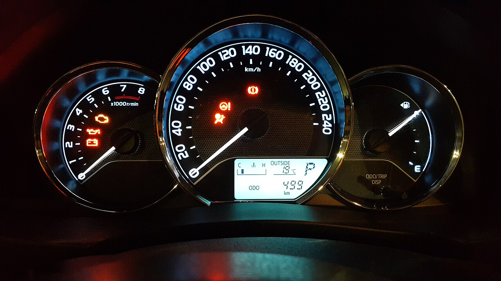

# Numbers & impact

*Vague resume bullets describe effort; quantified ones describe outcome. Real numbers from your own work - time saved, bugs found, cases automated - carry more weight than any adjective.*

> "Responsible for testing the checkout flow" and "found 12 critical bugs in the checkout flow before release,
> including one that blocked payment" describe the same work. Only one of them gives a reader something to
> remember, compare, and believe.

> **In real life**
>
> A bank statement, not a memory of spending. "I spent some money on groceries this month" could mean
> anything. A statement reads "$412.18 across six transactions" - specific, checkable, comparable to last
> month. A resume bullet should read like the statement line, not the vague memory of the month.

**Quantified impact**: Describing work outcomes with specific, honest figures - time, volume, defect counts, or percentage change - rather than general adjectives like 'significant' or 'extensive', so a reader can judge scale without guessing.

## What actually counts as a number

Useful QA metrics usually fall into a few families: **time** (regression cycle cut from 3 days to 6 hours),
**volume** (42 test cases automated, 15 critical bugs found pre-release), **rate or percentage** (flaky test
failures reduced by 30 percent), and **scope** (test coverage across 3 browsers and 2 platforms). The number
does not need to be dramatic - a small, honest, specific figure beats a vague superlative every time, because
it is checkable and it signals you tracked your own work closely enough to know it.

## Finding real numbers from your own work

Most testers already have these numbers somewhere: sprint reports, bug trackers, CI dashboards, standup
notes, or a simple personal log kept alongside daily work. If an exact figure is not available, an honest
estimate ("around 30 test cases," "roughly half the manual suite") is acceptable - inventing a precise
number you cannot defend in an interview is not. The goal is defensible specificity, not manufactured
precision.

> **Tip**
>
> Keep a running note of outcomes as you work - a bug count, a time saved, a suite size - rather than trying
> to reconstruct them from memory the night before updating your resume.

> **Common mistake**
>
> Do not invent a number to sound impressive. An interviewer who asks "how did you measure that 40 percent?"
> and gets a shrug will trust the rest of the resume less, not just that one line.


*Toyota Corolla 2016 speedometer.jpg — Kskhh, Wikimedia Commons, CC BY-SA 4.0. [Source](https://commons.wikimedia.org/wiki/File:Toyota_Corolla_2016_speedometer.jpg)*
- **An exact scale, not a feeling** — The speedometer reports a specific unit across a fixed range - the dashboard equivalent of a quantified bullet point instead of 'fast'.
- **A second, different precise measurement** — The tachometer reports engine RPM on its own scale - a reminder that a resume can and should carry more than one kind of number.
- **A specific, logged figure** — The digital display reads an exact trip distance - 499 km - the kind of concrete figure a resume bullet should aim for over a vague summary.
- **A quantified level, not an impression** — The fuel gauge reports a measured position between empty and full, not 'the tank felt low' - specificity by design, not by accident.

**Turning a task into a quantified bullet**

1. **Start with the task** — 'Tested the new payment feature' - true, but not memorable or comparable.
2. **Find the real number** — Check the bug tracker, CI dashboard, or your own notes for a defensible figure.
3. **Attach the outcome** — 'Found 15 critical bugs before release, including one blocking payment' - specific and checkable.
4. **Keep it honest** — If no exact figure exists, use a defensible estimate rather than inventing precision.

*An un-quantified bullet-point flagger (Python)*

```python
import re

bullets = [
    "Automated 42 regression test cases, cutting the manual cycle from 3 days to 6 hours.",
    "Found 15 critical bugs before the v2 release, preventing a checkout outage.",
    "Helped the team test the new payment feature.",
    "Reduced flaky test failures by 30 percent by adding explicit waits.",
]

def has_number(text):
    return bool(re.search(r"\\d", text))

quantified_flags = [has_number(b) for b in bullets]
for bullet, quantified in zip(bullets, quantified_flags):
    tag = "QUANTIFIED" if quantified else "VAGUE"
    print(tag + ": " + bullet[:40])

quantified_count = sum(1 for q in quantified_flags if q)
total = len(quantified_flags)
ratio = round(100 * quantified_count / total)
print("QUANTIFIED_RATIO=" + str(ratio))
result = "PASS" if ratio >= 70 else "FAIL"
assert result == "PASS", "too many un-quantified bullets"
print("RESULT=" + result)
```

*An un-quantified bullet-point flagger (Java)*

```java
import java.util.*;

public class Main {
    static boolean hasNumber(String text) {
        return text.matches(".*\\\\d.*");
    }

    public static void main(String[] args) {
        String[] bullets = {
            "Automated 42 regression test cases, cutting the manual cycle from 3 days to 6 hours.",
            "Found 15 critical bugs before the v2 release, preventing a checkout outage.",
            "Helped the team test the new payment feature.",
            "Reduced flaky test failures by 30 percent by adding explicit waits.",
        };

        int quantifiedCount = 0;
        for (String bullet : bullets) {
            boolean quantified = hasNumber(bullet);
            if (quantified) quantifiedCount++;
            String tag = quantified ? "QUANTIFIED" : "VAGUE";
            System.out.println(tag + ": " + bullet.substring(0, 40));
        }

        int total = bullets.length;
        long ratio = Math.round(100.0 * quantifiedCount / total);
        System.out.println("QUANTIFIED_RATIO=" + ratio);
        String result = ratio >= 70 ? "PASS" : "FAIL";
        if (!result.equals("PASS")) throw new AssertionError("too many un-quantified bullets");
        System.out.println("RESULT=" + result);
    }
}
```

### Your first time: Quantify your last three resume bullets

- [ ] Pick three vague bullets — Look for phrases like 'responsible for,' 'helped with,' or 'worked on' - these usually hide a real number.
- [ ] Find the underlying figure — Check bug trackers, CI history, sprint reports, or your own notes for time, volume, or rate.
- [ ] Rewrite with the number placed early — Lead with the outcome and figure, not the task, so a fast reader sees it first.
- [ ] Sanity-check every number — Ask yourself whether you could explain how you got that figure if asked in an interview.

- **You cannot find an exact number for real work you did.**
  Use a clearly-labeled honest estimate ('roughly,' 'around') rather than inventing false precision.
- **A number sounds impressive but you cannot explain its source.**
  Remove or soften it - an indefensible number in an interview damages credibility more than a modest, real one.
- **Every bullet has a number but they all feel padded.**
  Reserve numbers for genuinely meaningful outcomes; a forced number on a trivial task reads as padding, not impact.

### Where to check

- Bug trackers and CI dashboards for defect counts, run times, and pass rates from your actual work.
- Sprint or standup notes for volume figures (test cases written, automated, or reviewed).
- Your own running log, if you keep one, for numbers not captured anywhere else.
- [[resume-and-applications/the-qa-resume/structure-that-works]] for where quantified bullets belong in the overall resume shape.

### Worked example: turning a vague bullet into a quantified one

1. A candidate's draft reads: "Responsible for regression testing across releases."
2. They check their CI dashboard and find the regression suite runs 60 cases, previously all manual.
3. They recall automating roughly 40 of those cases over two months, cutting the manual run from a full day to under two hours.
4. The bullet becomes: "Automated 40 of 60 regression test cases, cutting the manual run from a full day to under two hours."

**Quiz.** What should you do if you cannot find an exact number for real work you completed?

- [ ] Invent a precise-sounding figure
- [ ] Omit the accomplishment entirely
- [x] Use a clearly honest estimate instead of false precision
- [ ] Replace it with a vague adjective like 'extensive'

*A labeled estimate is honest and still more useful to a reader than a vague adjective; inventing exact figures risks damaging credibility if questioned.*

- **Metric families for QA work** — Time, volume, rate/percentage, and scope - each turns a task description into a checkable outcome.
- **Where to find real numbers** — Bug trackers, CI dashboards, sprint reports, and a candidate's own running notes.
- **Honest estimate vs invented number** — A labeled estimate is defensible; an invented precise figure collapses under a follow-up question.

### Challenge

Rewrite three bullets from your own resume to include a real, checkable number pulled from a bug tracker, CI history, or your own notes.

- [Indeed — How to Quantify Resume Accomplishments (With Examples)](https://www.indeed.com/career-advice/resumes-cover-letters/how-to-quantify-resume)
- [Yale Office of Career Strategy — Writing Impactful Resume Bullets](https://ocs.yale.edu/resources/writing-impactful-resume-bullets/)
- [How to Quantify Your Resume Work Experience Using Data, Metrics, and Numbers](https://www.youtube.com/watch?v=YnVTgs3I60g)

🎬 [How to Quantify Your Resume Work Experience Using Data, Metrics, and Numbers](https://www.youtube.com/watch?v=YnVTgs3I60g) (4 min)

- Quantified bullets describe outcomes; vague ones describe effort - readers remember and trust the former.
- Time, volume, rate, and scope are the four metric families most QA work already produces.
- Pull real numbers from trackers and dashboards rather than reconstructing them from memory.
- A labeled honest estimate beats both an invented number and a vague adjective.


## Related notes

- [[Notes/resume-and-applications/the-qa-resume/structure-that-works|Structure that works]]
- [[Notes/resume-and-applications/the-qa-resume/skills-and-keywords-ats|Skills & keywords (ATS)]]
- [[Notes/resume-and-applications/the-qa-resume/common-mistakes|Common mistakes]]


---
_Source: `packages/curriculum/content/notes/resume-and-applications/the-qa-resume/numbers-and-impact.mdx`_
