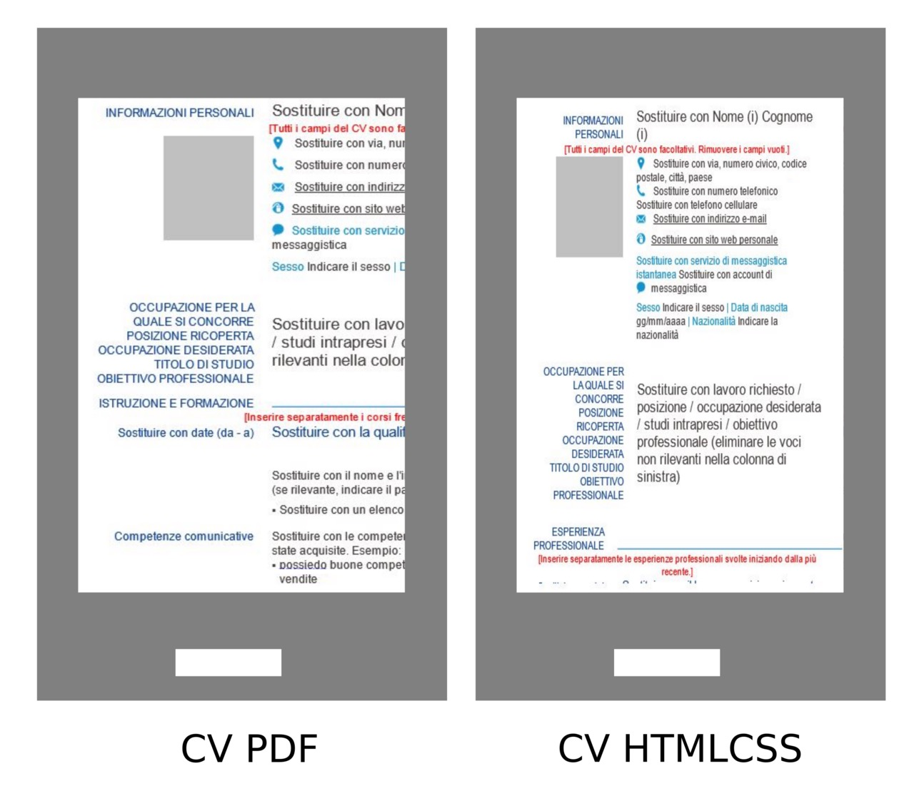

# Structure that works

*A QA resume that gets read follows one predictable shape: header, summary, skills, reverse-chronological experience, projects, education - scannable in seconds, not a puzzle to solve.*

> A recruiter looks at a resume for a matter of seconds before deciding whether to keep reading. In that
> window, structure does the work content cannot do alone - it tells the reader where to look first, second,
> and third, before a single sentence has been read closely.

> **In real life**
>
> A well-designed metro map. You do not read every station name in order - you find your line by color, spot
> the interchange stops, and trace a path in seconds. A confusing map with no color-coding and stops listed
> alphabetically instead of by route would technically contain the same information, and it would be useless
> under time pressure. A resume needs the same designed-for-scanning shape, not just the same facts.

**Resume structure**: A one-page (or two, for senior candidates) document ordered as header, summary, skills, reverse-chronological experience, optional projects, and education, so a reader can locate the most decision-relevant information within seconds without hunting.

## The five blocks, in order

A QA resume that works has five recognizable blocks, always in the same order: **contact header** (name,
location, email, phone, portfolio or GitHub link), **summary** (two to three lines naming your specialty
and years of experience - manual, automation, or both), **skills** (a short, honest, scannable list),
**experience** (reverse-chronological, most recent role first, each with quantified bullet points), and
**education** (near the bottom for most working candidates, since employers weigh experience first). A
**projects** block sits between experience and education when portfolio work strengthens the case - a
BuggyShop bug hunt, a Selenium framework, a personal test-automation repo.

## Why reverse-chronological, and why one page

Reverse-chronological order matches how a hiring manager reads: they want to know what you are doing *now*
before they care what you did five years ago. Skipping around in time forces the reader to reconstruct a
timeline themselves, which they will not do. Length matters for the same reason structure does - a resume
is a screening document, not an autobiography. Most QA candidates with under ten years of experience fit
comfortably on one page once bullets are trimmed to outcomes instead of task lists.

> **Tip**
>
> Put your strongest, most relevant line first in every section. A reader who only reads the first bullet
> of your most recent role should still walk away knowing your biggest, most specific contribution.

> **Common mistake**
>
> Do not bury the summary or skills section below a long, un-quantified job history. If a reader has to
> scroll past three roles before learning what you specialize in, most will stop before reaching it.


*Cv-mobile.png — Inseritore, Wikimedia Commons, CC BY-SA 4.0. [Source](https://commons.wikimedia.org/wiki/File:Cv-mobile.png)*
- **Contact block comes first** — Name and reachable contact details sit above everything else - the reader should never have to hunt for how to reach you.
- **A target-role line, kept tight** — This template's objective block is a placeholder to fill in; the danger is leaving generic filler here instead of one specific, tailored line.
- **Experience gets the middle of the page** — The professional-experience heading sits right after the summary and skills - the section a hiring manager reads most closely gets prime position.
- **Skills stay near the top of the fold** — A skills block positioned early, not buried after multiple job entries, so it can be scanned in the first few seconds.

**How a reader's eye actually moves**

1. **Header: who, and how to reach them** — Name, location, portfolio or GitHub link - confirmed in under two seconds.
2. **Summary: specialty and level** — Manual, automation, or both, and roughly how many years - sets expectations for everything below.
3. **Skills and most recent role** — The reader checks whether your tools and current job match what they need, fast.
4. **Earlier roles, projects, education** — Read only if the top of the page earned enough interest to keep going.

*A resume-structure checker (Python)*

```python
REQUIRED_ORDER = ["contact", "summary", "skills", "experience", "education"]

def sections_present_and_ordered(sections):
    present_required = [s for s in REQUIRED_ORDER if s in sections]
    has_all = len(present_required) == len(REQUIRED_ORDER)
    indices = [sections.index(s) for s in present_required]
    ordered = indices == sorted(indices)
    return has_all, ordered

def is_reverse_chronological(start_years):
    return all(start_years[i] >= start_years[i + 1] for i in range(len(start_years) - 1))

resume_sections = ["contact", "summary", "skills", "experience", "projects", "education"]
experience_start_years = [2026, 2024, 2022]
word_count = 480

has_all, ordered = sections_present_and_ordered(resume_sections)
checks = {
    "required_sections_present": has_all,
    "sections_in_scannable_order": ordered,
    "experience_is_reverse_chronological": is_reverse_chronological(experience_start_years),
    "fits_one_page": word_count <= 650,
}
for name, passed in checks.items():
    print(name + "=" + ("PASS" if passed else "FAIL"))
result = "PASS" if all(checks.values()) else "FAIL"
assert result == "PASS", "resume structure rejected"
print("RESULT=" + result)
```

*A resume-structure checker (Java)*

```java
import java.util.*;

public class Main {
    static final List<String> REQUIRED_ORDER = Arrays.asList("contact", "summary", "skills", "experience", "education");

    static boolean isReverseChronological(int[] startYears) {
        for (int i = 0; i < startYears.length - 1; i++) {
            if (startYears[i] < startYears[i + 1]) return false;
        }
        return true;
    }

    public static void main(String[] args) {
        List<String> resumeSections = Arrays.asList("contact", "summary", "skills", "experience", "projects", "education");
        int[] experienceStartYears = {2026, 2024, 2022};
        int wordCount = 480;

        List<String> presentRequired = new ArrayList<>();
        for (String s : REQUIRED_ORDER) if (resumeSections.contains(s)) presentRequired.add(s);
        boolean hasAll = presentRequired.size() == REQUIRED_ORDER.size();

        List<Integer> indices = new ArrayList<>();
        for (String s : presentRequired) indices.add(resumeSections.indexOf(s));
        List<Integer> sortedIndices = new ArrayList<>(indices);
        Collections.sort(sortedIndices);
        boolean ordered = indices.equals(sortedIndices);

        Map<String, Boolean> checks = new LinkedHashMap<>();
        checks.put("required_sections_present", hasAll);
        checks.put("sections_in_scannable_order", ordered);
        checks.put("experience_is_reverse_chronological", isReverseChronological(experienceStartYears));
        checks.put("fits_one_page", wordCount <= 650);

        boolean allPass = true;
        for (Map.Entry<String, Boolean> e : checks.entrySet()) {
            System.out.println(e.getKey() + "=" + (e.getValue() ? "PASS" : "FAIL"));
            allPass &= e.getValue();
        }
        String result = allPass ? "PASS" : "FAIL";
        if (!result.equals("PASS")) throw new AssertionError("resume structure rejected");
        System.out.println("RESULT=" + result);
    }
}
```

### Your first time: Rebuild your resume in the five-block order

- [ ] Write the contact header — Name, city, email, phone, and one link to a portfolio, GitHub, or LinkedIn profile.
- [ ] Write a two-to-three-line summary — State your QA specialty and rough experience level in plain language, tailored to the role.
- [ ] List skills honestly and briefly — Group by category if the list is long; only include tools you can discuss in an interview.
- [ ] Order experience newest first — Each role gets two to four quantified bullet points; older, less relevant roles get fewer lines.
- [ ] Place education and projects last — Unless you are a new graduate, education moves to the bottom; a strong project can sit just above it.

- **The resume runs to three pages.**
  Cut older roles to one line each, remove duplicate tool mentions, and drop tasks that did not produce a measurable outcome.
- **A reader says they cannot find your current specialty.**
  Move or rewrite the summary so it names manual, automation, or both in the first line, not buried in a paragraph.
- **Experience reads out of order.**
  Re-sort strictly by end date, most recent first, and check that each entry states start and end dates clearly.

### Where to check

- Read the resume aloud, top to bottom, and time yourself - if key facts take longer than ten seconds to find, the order is wrong.
- Compare block order against the five-block structure: contact, summary, skills, experience, education.
- Confirm every experience entry has a start and end date and is not out of sequence.
- [[resume-and-applications/the-qa-resume/skills-and-keywords-ats]] for how the skills block should be worded so parsing software finds it too.

### Worked example: reordering a resume that buried its strongest asset

1. A candidate's resume opens with a two-year-old internship, then lists skills, then a summary at the bottom.
2. A reviewer skims the top, finds an outdated role, and closes the file within eight seconds.
3. The candidate moves the summary to the top, lists their current automation role first, and trims the internship to one line.
4. The same reviewer now sees "2 years, Selenium and API automation" in the first line and keeps reading.

**Quiz.** Where should the education section usually sit for a working QA candidate with several years of experience?

- [ ] Above the contact header
- [ ] Near the top, before skills
- [x] Near the bottom, after experience
- [ ] It should be omitted entirely

*Once a candidate has real experience, employers weigh it more heavily than education, so education moves toward the bottom - though it still belongs on the page.*

- **The five blocks** — Contact header, summary, skills, experience (reverse-chronological), education - with an optional projects block before education.
- **Why reverse-chronological** — It matches how a reader wants information: current role first, so relevance is judged before ancient history.
- **One-page rule of thumb** — Most candidates under ten years of experience should fit one page by trimming to outcomes, not task lists.

### Challenge

Take your current resume and time how long it takes a friend to find your current job title and years of experience. If it takes more than ten seconds, restructure using the five-block order.

- [Indeed — How To Create a Resume Outline (With Template)](https://www.indeed.com/career-advice/resumes-cover-letters/how-to-create-a-resume-outline)
- [Coursera — How to Write a QA Tester Resume: Layout, Design, Examples](https://www.coursera.org/articles/qa-tester-resume)
- [Resume Writing Part 1: Resume Formats and Sections](https://www.youtube.com/watch?v=RDIl9_Z6nUk)

🎬 [Resume Writing Part 1: Resume Formats and Sections](https://www.youtube.com/watch?v=RDIl9_Z6nUk) (7 min)

- Use five ordered blocks: contact, summary, skills, reverse-chronological experience, education, with projects optional before education.
- Structure exists so a reader can find decision-relevant facts in seconds, not to look formal.
- Reverse-chronological order matches how readers actually want to receive career information.
- One page for most candidates is achieved by trimming to outcomes, not by shrinking the font.


## Related notes

- [[Notes/resume-and-applications/the-qa-resume/skills-and-keywords-ats|Skills & keywords (ATS)]]
- [[Notes/resume-and-applications/the-qa-resume/numbers-and-impact|Numbers & impact]]
- [[Notes/resume-and-applications/the-qa-resume/common-mistakes|Common mistakes]]


---
_Source: `packages/curriculum/content/notes/resume-and-applications/the-qa-resume/structure-that-works.mdx`_
