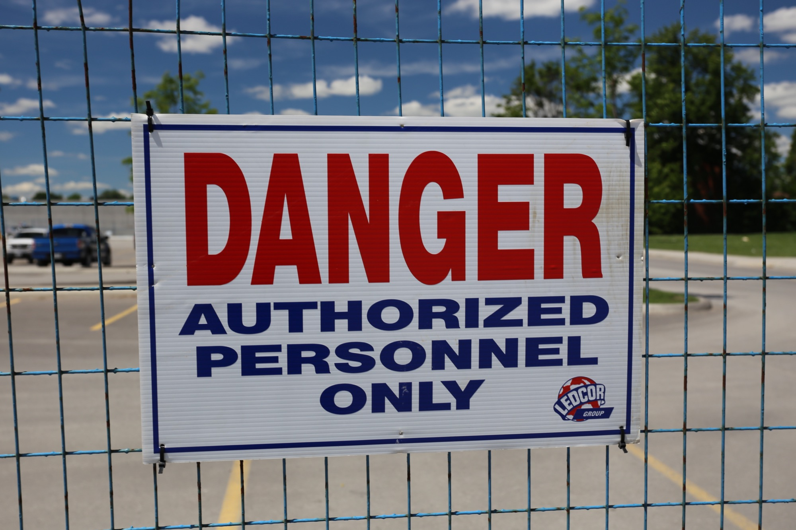

# Function-level checks (BFLA)

*Broken Function Level Authorization is the same authenticated user reaching an action their role should not permit - a customer token successfully calling DELETE /admin/users/{id} because the endpoint only checks 'is authenticated,' not 'is this role allowed to call THIS function.'*

> A tester, authorized to test this platform's own BuggyAPI sandbox with a tester-owned customer account,
> is reading through the API's generated OpenAPI docs and notices `DELETE /admin/users/{id}` listed
> alongside the ordinary customer endpoints. Curious rather than hopeful, they send the request anyway -
> their own valid customer token, no admin grant of any kind, against an endpoint explicitly named for
> admins. It succeeds. `204 No Content`. The user is gone. Nothing about the tester's identity changed and
> nothing was impersonated - the token really does belong to a plain customer account, exactly as issued.
> What never ran is a check that should have asked one specific question before touching that row: is a
> customer role actually permitted to call THIS function at all, regardless of which object it targets? That
> gap - a fully authenticated request reaching an action its role was never granted, because the endpoint
> checked identity but never checked permission for the specific function being invoked - is Broken Function
> Level Authorization, BFLA.

> **In real life**
>
> Picture a construction site ringed by a tall perimeter fence, one gate, one sign-in desk where every
> visitor - contractor, inspector, delivery driver - shows ID and gets a badge before stepping past the
> fence line. That badge answers exactly one question: are you cleared to be on this site at all. It is not
> nothing; a stranger off the street cannot simply wander in. But once badged and inside the fence, a second
> and completely separate question is waiting at every specific piece of equipment scattered across the
> site: this badge got you PAST THE GATE, but is it the specific badge authorized to operate THIS particular
> crane, THIS particular explosive charge, THIS particular high-voltage panel? A site that only checks the
> badge at the gate and never again is trusting that being let past the fence line is the same thing as
> being qualified to run every piece of equipment behind it - and on a site like that, a delivery driver who
> was only ever supposed to drop off lumber could walk straight up to the tower crane's control cab and
> start pulling levers, because nothing at the crane itself ever asked the second question the gate
> sign-in desk was never equipped to answer in the first place.

**Function-level checks (BFLA)**: Broken Function Level Authorization (BFLA) is a missing or incomplete authorization check on a specific action or endpoint, allowing an authenticated identity whose role should not permit that action to invoke it anyway. It is ranked as its own category in the OWASP API Security Top 10 (API5) because REST and GraphQL APIs expose functions - not just objects - as individually callable operations, each of which needs its own role check. BFLA is function-level: the question is WHICH ACTION or verb a role may invoke (view vs delete, read vs promote-to-admin), independent of which specific object it targets. This is the deliberate contrast with IDOR/BOLA, which is object-level: the question there is WHICH RECORD a role may reach, given that the action itself (usually a simple read) is already permitted. An endpoint can pass an object-level ownership check and still fail BFLA - a customer correctly restricted to viewing only their own account, but the DELETE verb on that same account object was never restricted to admins at all. Testing it means holding identity and role constant (a tester-owned, deliberately low-privileged account) and attempting a higher-privileged ACTION - not a different object, the same object if useful, but a verb or endpoint the role should never be permitted to call.

## Testing which actions a role may invoke, not which objects

- **Hold the object constant, vary the action.** Where IDOR/BOLA testing swaps an id while keeping the verb
  the same, BFLA testing does the opposite: keep the target the same (even the tester's own account or
  resource, if the platform allows it) and attempt a DIFFERENT verb or endpoint the tester's role should
  never reach - `DELETE`, `PUT /promote-to-admin`, an internal-only bulk export.
- **Read the API's own documentation for functions your role should never see used.** Generated OpenAPI
  docs, GraphQL schemas, and API changelogs often list every operation the API exposes, admin-only ones
  included, because the documentation itself is not access-controlled the way the operation is meant to
  be. Every admin-labeled function listed there is a legitimate BFLA test candidate for a tester-owned
  lower-privileged account.
- **Test the exact same endpoint across multiple roles, deliberately.** Call the same function once with a
  tester-owned admin account (expected to succeed) and once with a tester-owned customer account (expected
  to fail). A pass on the second call, where the first also passed, is the confirmed gap - not a guess
  based on the endpoint's name alone.
- **A function-level pass does not imply an object-level pass, and the reverse is equally true.** An
  endpoint can correctly restrict which user a `DELETE` targets (object-level, IDOR/BOLA's job) while never
  checking whether the calling role may invoke `DELETE` at all (function-level, BFLA's job). Test both as
  genuinely separate questions on the same endpoint.
- **Client-side hiding of a button is not evidence either way.** A "Delete user" button that only renders
  for admin accounts in the UI proves nothing about the API underneath it. The only way to confirm BFLA is
  to call the underlying endpoint directly with a tester-owned lower-privileged account's token, bypassing
  the UI entirely.

> **Tip**
>
> When an API ships generated documentation (OpenAPI/Swagger, GraphQL introspection), treat the full
> operation list as a BFLA test plan, not just a reference. Every operation tagged for a higher role than the
> tester-owned account currently holds - `admin`, `internal`, `staff` - is a specific, nameable test: call it
> with the lower-privileged token and record whether it succeeds. This turns BFLA testing from "guess what
> might be missing" into "confirm or clear every documented higher-privilege function, one at a time."

> **Common mistake**
>
> A tester confirms that a customer-role account cannot view another customer's order details - a correctly
> enforced object-level (IDOR/BOLA) ownership check - and concludes the endpoint family is secure. They never
> test whether that same customer-role token can call `DELETE` or `PUT /admin/promote` on ANY account,
> including its own. Passing the object-level check says nothing about whether the action itself was ever
> restricted to the right role. BFLA and IDOR/BOLA are independent checks on the same endpoint family, and an
> application can implement one correctly while never implementing the other at all - closing one without
> testing the other leaves a customer-role token free to call an admin-only verb on whichever object it likes.


*Danger Authorized Personnel Only - Evan Delshaw, Wikimedia Commons, CC BY 2.0. [Source](https://commons.wikimedia.org/wiki/File:Danger_Authorized_Personnel_Only_(19187034481).jpg)*
- **Severity, not scope** — The word DANGER signals how serious the risk is, but says nothing about WHICH specific action is restricted. Being authenticated at all tells an application nothing about which specific function a role may invoke either.
- **The actual rule: a named group, for a named boundary** — AUTHORIZED PERSONNEL ONLY names exactly who may cross this specific line - not whether they got past the site's outer gate already. This is BFLA's core question: is this role permitted for THIS function, independent of already being authenticated.
- **One barrier, layered in front of another** — The chain-link fence is a separate, earlier boundary from the sign's specific restriction - being on the inside of the fence (authenticated) is not the same as being cleared for what the sign restricts (authorized for this function).
- **A named, accountable owner for this specific rule** — The logo identifies exactly who enforces this particular restriction. A function-level check belongs to that one endpoint's own authorization logic - not to the application's general login system.

**Testing one function-level boundary by hand, safely - press Play**

1. **List the higher-privileged functions from the API's own docs** — Read OpenAPI/Swagger or GraphQL introspection for this platform's own sandbox for operations tagged admin or internal.
2. **Confirm the function works for a tester-owned admin account first** — Call it once with a tester-owned account that SHOULD be allowed, to confirm the function itself works as documented.
3. **Call the identical function with a tester-owned lower-privileged account** — Same endpoint, same verb, only the role differs. Record whether it succeeds when it should have been refused.
4. **Report the missing check as function-level, not object-level** — Name the exact endpoint, verb, and both accounts' roles used. State plainly that this is BFLA, distinct from any ownership check on the same endpoint.

Here is the same mechanism in runnable form - a tester-owned customer account attempting an admin-only
function, once against a server that only checks authentication and once against one that checks
per-function role permission too.

*Run it - a BFLA function-level permission simulator (Python)*

```python
# BFLA (Broken Function Level Authorization) simulator - run only against a
# LOCAL, in-memory, synthetic sandbox. This is detection/prevention teaching
# code, never a real attack: a tester-owned customer account attempts an
# admin-only FUNCTION - not a different object, the same object family - and
# we compare a server that only checks authentication against one that also
# checks whether the role may invoke this specific function.

# Which functions each role is actually permitted to invoke - independent of
# which object each function targets. This is the function-level rule set.
ROLE_PERMISSIONS = {
    "admin":    {"view_user", "list_users", "delete_user", "promote_to_admin"},
    "customer": {"view_own_profile"},
}

USERS = {
    "u-100": {"name": "test_alice", "role": "customer"},
    "u-101": {"name": "test_bob",   "role": "customer"},
}

# Tester-owned accounts only, on this platform's own sandbox.
SESSIONS = {
    "sess-cust-001":  {"user": "test_dana",  "role": "customer"},
    "sess-admin-002": {"user": "test_priya", "role": "admin"},
}

def call_function_INSECURE(session_token, function_name, target_user_id):
    # VULNERABLE ON PURPOSE, FOR TEACHING: authenticates the session but
    # never checks whether this role is permitted to invoke this FUNCTION at
    # all. Any authenticated identity can call any function.
    if session_token not in SESSIONS:
        return "401 Unauthorized"
    if target_user_id not in USERS:
        return "404 Not Found"
    if function_name == "delete_user":
        return "204 No Content -> " + target_user_id + " deleted (NO function-level check ran)"
    return "200 OK -> " + function_name + " executed"

def call_function_SECURE(session_token, function_name, target_user_id):
    # SAFE: authenticates, THEN checks whether the requester's role is
    # permitted to invoke this specific function, before touching any object.
    identity = SESSIONS.get(session_token)
    if identity is None:
        return "401 Unauthorized"
    if target_user_id not in USERS:
        return "404 Not Found"
    allowed_functions = ROLE_PERMISSIONS.get(identity["role"], set())
    if function_name not in allowed_functions:
        return "403 Forbidden - role '" + identity["role"] + "' cannot call '" + function_name + "'"
    if function_name == "delete_user":
        return "204 No Content -> " + target_user_id + " deleted (function-level check passed)"
    return "200 OK -> " + function_name + " executed"

def run():
    print("A tester-owned CUSTOMER token attempting an admin-only FUNCTION, same target both times.")
    print()

    print("-- Insecure server (authenticated, no per-function role check) --")
    print("  customer token calls delete_user on u-101 (a customer-only account, admin-only ACTION):")
    print("    " + call_function_INSECURE("sess-cust-001", "delete_user", "u-101"))
    print()

    print("-- Secure server (authenticated AND per-function role check) --")
    print("  customer token calls delete_user on u-101:")
    print("    " + call_function_SECURE("sess-cust-001", "delete_user", "u-101"))
    print("  admin token calls delete_user on u-101 (function the admin role IS permitted):")
    print("    " + call_function_SECURE("sess-admin-002", "delete_user", "u-101"))
    print()

    print("Note what stayed constant: the target (u-101) and the customer identity never changed.")
    print("Only the FUNCTION-LEVEL check in call_function_SECURE decided the outcome - this is BFLA,")
    print("not an object-ownership question like IDOR/BOLA.")

run()
```

The identical scenario in Java - same roles, same functions, same target, same result:

*Run it - a BFLA function-level permission simulator (Java)*

```java
import java.util.*;

public class Main {
    // BFLA simulator - teaching code only, mirrors the Python sibling demo
    // exactly. No real network calls - everything is a hardcoded, local
    // simulation of a tester-owned customer account attempting an
    // admin-only FUNCTION against the same target object throughout.

    static class Identity {
        String user, role;
        Identity(String user, String role) { this.user = user; this.role = role; }
    }

    static final Map<String, Set<String>> ROLE_PERMISSIONS = new LinkedHashMap<>();
    static final Set<String> USERS = new LinkedHashSet<>(Arrays.asList("u-100", "u-101"));
    static final Map<String, Identity> SESSIONS = new LinkedHashMap<>();

    static {
        ROLE_PERMISSIONS.put("admin", new LinkedHashSet<>(
            Arrays.asList("view_user", "list_users", "delete_user", "promote_to_admin")));
        ROLE_PERMISSIONS.put("customer", new LinkedHashSet<>(
            Arrays.asList("view_own_profile")));

        SESSIONS.put("sess-cust-001", new Identity("test_dana", "customer"));
        SESSIONS.put("sess-admin-002", new Identity("test_priya", "admin"));
    }

    static String callFunctionInsecure(String sessionToken, String functionName, String targetUserId) {
        // VULNERABLE ON PURPOSE, FOR TEACHING: authenticates the session but
        // never checks whether this role may invoke this FUNCTION at all.
        if (!SESSIONS.containsKey(sessionToken)) return "401 Unauthorized";
        if (!USERS.contains(targetUserId)) return "404 Not Found";
        if (functionName.equals("delete_user")) {
            return "204 No Content -> " + targetUserId + " deleted (NO function-level check ran)";
        }
        return "200 OK -> " + functionName + " executed";
    }

    static String callFunctionSecure(String sessionToken, String functionName, String targetUserId) {
        // SAFE: authenticates, THEN checks whether the requester's role is
        // permitted to invoke this specific function.
        Identity identity = SESSIONS.get(sessionToken);
        if (identity == null) return "401 Unauthorized";
        if (!USERS.contains(targetUserId)) return "404 Not Found";
        Set<String> allowed = ROLE_PERMISSIONS.getOrDefault(identity.role, Collections.emptySet());
        if (!allowed.contains(functionName)) {
            return "403 Forbidden - role '" + identity.role + "' cannot call '" + functionName + "'";
        }
        if (functionName.equals("delete_user")) {
            return "204 No Content -> " + targetUserId + " deleted (function-level check passed)";
        }
        return "200 OK -> " + functionName + " executed";
    }

    public static void main(String[] args) {
        System.out.println("A tester-owned CUSTOMER token attempting an admin-only FUNCTION, same target both times.");
        System.out.println();

        System.out.println("-- Insecure server (authenticated, no per-function role check) --");
        System.out.println("  customer token calls delete_user on u-101 (a customer-only account, admin-only ACTION):");
        System.out.println("    " + callFunctionInsecure("sess-cust-001", "delete_user", "u-101"));
        System.out.println();

        System.out.println("-- Secure server (authenticated AND per-function role check) --");
        System.out.println("  customer token calls delete_user on u-101:");
        System.out.println("    " + callFunctionSecure("sess-cust-001", "delete_user", "u-101"));
        System.out.println("  admin token calls delete_user on u-101 (function the admin role IS permitted):");
        System.out.println("    " + callFunctionSecure("sess-admin-002", "delete_user", "u-101"));
        System.out.println();

        System.out.println("Note what stayed constant: the target (u-101) and the customer identity never changed.");
        System.out.println("Only the FUNCTION-LEVEL check in callFunctionSecure decided the outcome - this is BFLA,");
        System.out.println("not an object-ownership question like IDOR/BOLA.");
    }
}
```

### Your first time: Your mission: prove one BFLA finding with two tester-owned accounts

- [ ] Get written authorization and create two tester-owned accounts at different roles — This platform's own BuggyAPI/BuggyShop sandbox, one tester-owned admin account and one tester-owned customer account.
- [ ] Pick one admin-only function from the API's own documentation — OpenAPI docs, GraphQL introspection, or a UI element only admins see. Confirm it succeeds with the tester-owned admin account first.
- [ ] Call the identical function, same target, with the tester-owned customer account — Change only the role's token - nothing else. Record whether the response is a success or a proper 403.
- [ ] Write the finding naming it as function-level, not object-level — State the endpoint, verb, both roles, and both responses. Note explicitly that this is BFLA - independent of any ownership check on the same endpoint.

You can now tell the difference between an endpoint that merely hides a button in the UI and one that
actually enforces which role may invoke a specific function - and you can prove the gap with two
tester-owned accounts instead of trusting what the interface chose to render.

- **A finding gets closed because 'the delete button doesn't even show up for customer accounts.'**
  A hidden button is a UI decision, not an authorization check. Confirm by calling the underlying endpoint directly with a tester-owned customer account's token, bypassing the UI entirely - if it still succeeds, the finding stands.
- **A tester confirms the object-level ownership check works and assumes the endpoint is fully secure.**
  Object-level (IDOR/BOLA) and function-level (BFLA) are independent checks on the same endpoint. Test both: can this role reach the RIGHT object, and separately, is this role even permitted to call this ACTION at all.
- **A developer 'fixes' the finding by removing the admin-only endpoint from the public API documentation.**
  Removing it from the docs does not remove it from the server. Confirm the fix by calling the endpoint directly with the tester-owned lower-privileged account again after the change ships.
- **A tester only tests one admin-only function and reports the API as fully covered.**
  Each function needs its own check. Work through every higher-privileged operation listed in the API's own documentation individually - a role check passing on one endpoint says nothing about the next.

### Where to check

- **Every higher-privileged function listed in the API's own documentation** - OpenAPI/Swagger tags,
  GraphQL introspection, and changelog entries each name functions a lower-privileged tester-owned account
  should try and expect a 403 from.
- **Both function-level and object-level, as genuinely separate questions on the same endpoint** - never
  let one passing check stand in for the other.
- **[[security-testing-web/authorization-and-access/idor-bola-by-hand]]** - the sibling finding where the
  gap is a missing ownership check on WHICH object; BFLA is about WHICH action, and the two are independent.
- **[[security-testing-web/authorization-and-access/forced-browsing]]** - forced browsing gets a tester to
  an endpoint that was never linked at all; BFLA is about what a role can DO once an endpoint is reached,
  linked or not.
- **[[security-testing-web/owasp-top-10-properly/broken-access-control]]** - the OWASP category BFLA
  findings map to, with the missing-check pattern worked through at the category level.

### Worked example: confirming one BFLA finding across two tester-owned roles in BuggyAPI

1. A tester, authorized to test the platform's own BuggyAPI sandbox, creates two accounts they own: a
   tester-owned admin account and a tester-owned plain customer account, and reads the generated OpenAPI
   docs for admin-tagged operations.
2. Using the tester-owned admin token, they call `DELETE /admin/users/{id}` against a disposable
   tester-owned target account. It succeeds with `204 No Content` - confirming the function itself works as
   documented for the role it is meant for.
3. Using the tester-owned CUSTOMER token - no admin grant of any kind - they call the identical endpoint
   and verb against a second disposable tester-owned target account. It also succeeds with `204 No
   Content`.
4. The finding is filed against the specific function: `DELETE /admin/users/{id}` checks authentication but
   never checks whether the calling role is permitted to invoke `delete_user` at all. Both requests and
   both responses are included as evidence, explicitly naming this as function-level (BFLA), separate from
   any object-ownership question on the same endpoint.

**Quiz.** An endpoint correctly ensures a customer-role account can only VIEW its own profile, never another customer's. The same endpoint family also exposes a DELETE verb that any authenticated customer-role token can call successfully against any account. What is the correct assessment?

- [ ] The endpoint is secure, since the ownership check on viewing already passed
- [ ] This is IDOR/BOLA, since the finding involves a user account object
- [x] This is BFLA - the object-level ownership check passing says nothing about whether the DELETE function itself was ever restricted to the right role
- [ ] No further testing is needed once one check on the endpoint family passes

*Object-level (IDOR/BOLA) and function-level (BFLA) are independent checks on the same endpoint family - passing one says nothing about the other (ruling out options A and D). The gap described is specifically that the DELETE ACTION was never restricted to the correct role, regardless of which object it targets - that is a function-level question, BFLA, not an object-ownership question (ruling out option B, which would apply if the issue were reaching the wrong PERSON's data via a read).*

- **BFLA (Broken Function Level Authorization)** — A missing or incomplete authorization check on a specific ACTION or endpoint, letting an authenticated identity whose role should not permit that action invoke it anyway.
- **BFLA vs IDOR/BOLA** — BFLA is function-level: which ACTION or verb a role may invoke. IDOR/BOLA is object-level: which RECORD a role may reach, given the action is already permitted. An endpoint can pass one and fail the other.
- **How to test it** — Hold the object constant, vary the action. Call the same higher-privileged function once with a tester-owned account that should be allowed, once with one that should not, and compare the two responses.
- **Why a hidden UI button is not evidence** — A button that only renders for admin accounts proves nothing about the API underneath it. Only calling the underlying endpoint directly with a lower-privileged tester-owned token confirms whether BFLA exists.
- **Why testing one function is not enough** — Each documented higher-privileged function needs its own check - a passing role check on one endpoint says nothing about the next one in the API's documentation.
- **The actual fix to recommend** — A server-side check, on every function call, that the authenticated identity's role is permitted to invoke THIS specific action - independent of any object-ownership check and independent of what the UI chooses to render.

### Challenge

In this platform's own BuggyShop or BuggyAPI sandbox, create two tester-owned accounts at different roles.
Pick one higher-privileged function from the platform's own API documentation or admin UI, confirm it
succeeds for the tester-owned account that should be allowed, then call the identical function against the
same or a disposable target using the tester-owned lower-privileged account's token. Record both requests
and responses, and write the finding naming it explicitly as a function-level (BFLA) gap, distinct from any
object-ownership check on the same endpoint.

### Ask the community

> I've been testing BFLA by holding the target object constant and only swapping which role's token calls a higher-privileged function - rather than assuming a hidden UI button means the underlying endpoint is actually restricted. For people who test APIs regularly: what's the trickiest BFLA you've found where the object-level (IDOR/BOLA) check was implemented perfectly, but nobody had ever separately restricted the action itself?

Looking for real examples where a well-built ownership check on WHICH record a role could reach
completely masked a missing check on WHICH ACTION that role could take - GraphQL mutations reusing an
object-level resolver, or a REST endpoint that checked ownership on read but never re-checked on delete.

- [OWASP API Security Top 10 - API5:2023 Broken Function Level Authorization](https://owasp.org/API-Security/editions/2023/en/0xa5-broken-function-level-authorization/)
- [OWASP - Authorization Cheat Sheet](https://cheatsheetseries.owasp.org/cheatsheets/Authorization_Cheat_Sheet.html)

🎬 [Rana Khalil - Broken Access Control: User role controlled by request parameter](https://www.youtube.com/watch?v=e_jsPdEeSto) (4 min)

- BFLA is an authenticated identity reaching an ACTION its role should not permit - the endpoint checks who you are but never checks whether your role may invoke this specific function.
- It is function-level, not object-level: IDOR/BOLA asks which record a role may reach, BFLA asks which action a role may invoke, and an endpoint can pass one while failing the other.
- Test it by holding the target constant and varying only the role's token across the identical function call.
- A hidden UI button proves nothing about the API underneath it - only calling the endpoint directly confirms the gap.
- The fix to recommend is a server-side check, on every function call, that the role is permitted to invoke that specific action.
- Test only systems you own or are explicitly, in writing, authorized to test, with tester-owned accounts and synthetic data.


## Related notes

- [[Notes/security-testing-web/authorization-and-access/idor-bola-by-hand|IDOR / BOLA by hand]]
- [[Notes/security-testing-web/authorization-and-access/privilege-escalation|Privilege escalation]]
- [[Notes/security-testing-web/authorization-and-access/forced-browsing|Forced browsing]]
- [[Notes/security-testing-web/owasp-top-10-properly/broken-access-control|Broken access control]]


---
_Source: `packages/curriculum/content/notes/security-testing-web/authorization-and-access/function-level-checks-bfla.mdx`_
