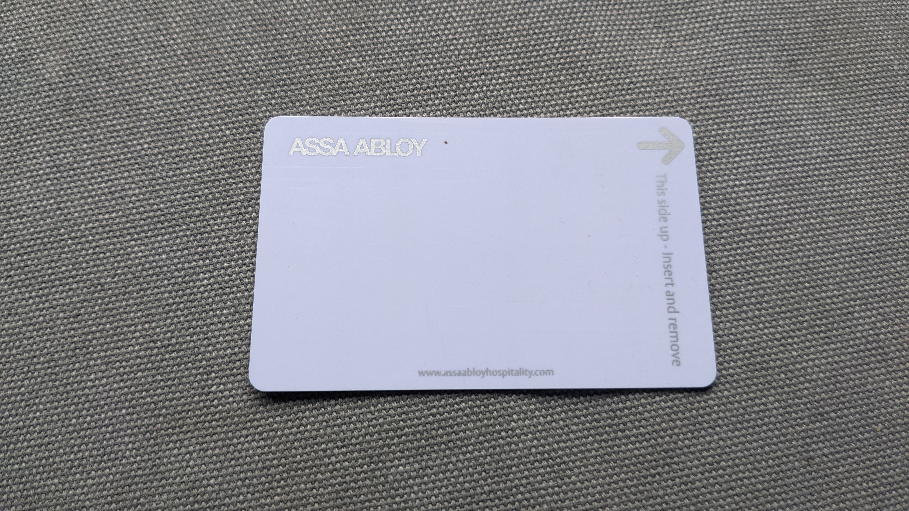

# IDOR / BOLA by hand

*Insecure Direct Object Reference / Broken Object Level Authorization happens when an endpoint returns or modifies data by id without checking the requester actually owns it. Test it with two tester-owned accounts, and know that UUIDs alone never fix a missing ownership check.*

> A tester, logged into a store account they own, opens their own order confirmation page. The URL reads
> `/orders/1002`. Out of habit more than suspicion, they change one digit: `/orders/1001`. The page loads -
> someone else's name, someone else's address, someone else's order total. No error, no warning, a fully
> valid `200 OK`. Nothing about the tester's own login broke or was bypassed; they are still exactly who
> they claim to be. What broke is a check that should have run on every single request and apparently never
> ran at all: does this order actually belong to the account asking for it? That gap - a valid, authenticated
> request reaching an object it was never granted access to, just by changing an id - is IDOR and BOLA, and
> it is one of the most common, most consequential findings in web application testing.

> **In real life**
>
> Picture a hotel corridor at night, every door fitted with the same electronic lock system. Each guest
> carries a keycard that looks identical to every other guest's card - blank plastic, no printed room
> number, no name. Walk up to your own door and swipe your card: the lock clicks open. Walk two doors down
> and swipe the exact same card against a different door: nothing happens, because the lock does not care
> which door you are standing in front of - it checks, every single time, whether THIS card is authorized
> for THIS specific door, right now, at the lock itself. A hotel that got this right never relies on guests
> not knowing which door is room 214; it relies on every lock enforcing its own boundary regardless of who
> walks up to it or what number happens to be printed on the door. A hotel that got it wrong might swap
> sequential room numbers for a longer, harder-to-guess code stenciled on each door - and still be exactly
> as broken, because the vulnerability was never the door numbers. It was a lock that opens for any card
> presented to it, without checking whose card it actually is.

**IDOR / BOLA by hand**: IDOR (Insecure Direct Object Reference) and BOLA (Broken Object Level Authorization) describe the same underlying mechanism: an endpoint accepts an object identifier - an order id, an invoice id, a user id - directly from the request, uses it to fetch or modify a specific record, and never confirms the requesting identity actually owns or is otherwise entitled to that specific object. IDOR is the older, broader term from classic web testing; BOLA is the API-specific name the same flaw carries in the OWASP API Security Top 10, because REST and GraphQL APIs expose object ids as a matter of course. Testing for it by hand means using two tester-owned accounts and deliberately requesting an object id that belongs to the OTHER account while authenticated as the first - comparing what account A can reach that should belong only to account B. Confirming impact means seeing account B's actual data returned (or modified) through account A's fully valid session, not just noticing that an id looks guessable. The fix to name in every finding is a server-side ownership check performed on every object access, checked against the authenticated identity making the request - never a change to how the id itself is formatted, generated, or hidden from the UI.

## Testing it with two tester-owned accounts

- **Set up two accounts you own, not one.** A single account can only ever prove "I can see my own data,"
  which tells you nothing about the ownership check. Two tester-owned accounts (A and B) let you generate
  a real object that belongs to B, then attempt to reach it while authenticated as A.
- **Establish the baseline first.** Log in as account A, note the exact id of a resource A legitimately
  owns (an order, an invoice, a saved address). Log in as account B and do the same, noting an id that
  belongs to B. You need both real ids before you can compare anything.
- **Swap the id while staying authenticated as the other account.** Log in as A, then request B's resource
  id directly - by editing the URL, the request body, or a hidden form field, whichever the feature uses.
  A fully valid A session reaching B's object is the actual finding.
- **Test every verb the endpoint exposes, not just GET.** A read-only leak (viewing B's invoice) and a
  write-capable one (editing or deleting B's address) are different severities; check both if the endpoint
  supports them.
- **Try both sequential and non-sequential ids on the same endpoint.** If the platform uses UUIDs, do not
  assume the check is safe - request a UUID you can observe belonging to the other tester-owned account
  (from a response you already legitimately received) and see if it is honored anyway.

> **Tip**
>
> The single most useful confirmation is a side-by-side comparison table: two columns, account A and account
> B, listing exactly which object ids each SHOULD be able to reach and which ids each account A actually
> reached when it requested B's id (and vice versa). A finding backed by that table - "A requested B's
> invoice id and received B's real invoice data" - is unambiguous. A finding that only says "the id looks
> guessable" is not a confirmed IDOR yet; guessability is a precondition, not proof of impact.

> **Common mistake**
>
> A tester notices an application switched from sequential order ids (`/orders/1001`) to UUIDs
> (`/orders/b7e1-9f3a-...`) and closes the finding as fixed, reasoning that an attacker can no longer guess
> the next id. This is security through obscurity mistaken for a fix. A UUID makes an id harder to GUESS,
> which reduces one specific attack path (enumeration), but it does nothing about the actual missing
> control: if the endpoint still returns whatever object the id points to without checking ownership, any
> UUID a tester can OBSERVE - leaked in another response, a shared link, a webhook payload, an export file -
> is exactly as exploitable as a sequential one ever was. The fix that actually closes an IDOR/BOLA finding
> is a server-side ownership check on the object access itself, independent of how the id is formatted.


*Assa Abloy hotel card key, Hillegersberg, Rotterdam (2022) - Donald Trung, Wikimedia Commons, CC BY-SA 4.0. [Source](https://commons.wikimedia.org/wiki/File:Assa_Abloy_hotel_card_key,_Hillegersberg,_Rotterdam_(2022)_01.jpg)*
- **A blank face, on purpose** — No room number, no guest name is printed anywhere on this card. Looking at it tells you nothing about which door it opens - exactly the property a request's object id should NOT rely on for its security.
- **The brand, not the boundary** — The only identifying text on the card is the manufacturer's name. Which specific door this card unlocks is decided by the lock system's own database when the card is presented - never by anything printed on the plastic itself.
- **One identical procedure, every card** — The same insert-direction arrow is molded into every guest's card regardless of which room it opens. Using the card correctly reveals nothing about what it is authorized to unlock - that check happens entirely at the lock.
- **Traceable to the vendor, not the room** — Even the footer text only names the hospitality lock vendor - never the property or the guest. An id or token that carries no ownership information printed on its face still needs the receiving system to check ownership itself.

**Testing one object endpoint by hand, safely - press Play**

1. **Establish a real id for each tester-owned account** — Log in as account A, note an id A legitimately owns. Log in as account B, note an id B legitimately owns. Both must be real, observed ids before comparing anything.
2. **Stay authenticated as A, request B's id** — Edit the URL, request body, or hidden field to point at B's object while your session is still A's fully valid session. Record the exact response.
3. **Confirm real data, not just a status code** — A 200 with B's actual name, address, or total is the finding. A 200 with empty or generic content is not proof yet - keep it separate until the returned data is genuinely B's.
4. **Report the ownership check as missing, recommend it server-side** — Name the exact endpoint and verb, both ids used, and both responses. Recommend a server-side ownership check on every access - never a change to id format alone.

Here is the same mechanism in runnable form - two tester-owned accounts probing a small in-memory
"orders" table by changing the order id, once against an endpoint with no ownership check and once
against one that checks server-side, including a UUID-style id to show why the id's shape never mattered.

*Run it - an IDOR/BOLA ownership-check simulator (Python)*

```python
# IDOR/BOLA ownership-check simulator - run only against a LOCAL, in-memory,
# synthetic sandbox. This is detection/prevention teaching code, never a real
# attack: two tester-owned accounts probe a small in-memory "orders" table by
# changing the order id in the request, and we compare what each account can
# reach against what a correct server-side ownership check would allow.

ORDERS = {
    "1001": {"owner": "test_alice", "total": "$42.10"},
    "1002": {"owner": "test_bob",   "total": "$18.75"},
    "1003": {"owner": "test_alice", "total": "$9.99"},
    # A non-sequential, UUID-style id - same missing check, harder to guess,
    # not actually fixed by the shape of the id alone.
    "b7e1-9f3a-opaque": {"owner": "test_bob", "total": "$120.00"},
}

# Tester-owned accounts only, on this platform's own sandbox.
SESSIONS = {
    "sess-alice": "test_alice",
    "sess-bob": "test_bob",
}

def get_order_INSECURE(session_token, order_id):
    # VULNERABLE ON PURPOSE, FOR TEACHING: authenticates the session but never
    # checks whether the requesting identity owns the requested order id.
    if session_token not in SESSIONS:
        return "401 Unauthorized"
    order = ORDERS.get(order_id)
    if order is None:
        return "404 Not Found"
    return "200 OK -> " + str(order)

def get_order_SECURE(session_token, order_id):
    # SAFE: authenticates, then checks server-side ownership before returning
    # anything - regardless of whether the id is sequential or UUID-style.
    requester = SESSIONS.get(session_token)
    if requester is None:
        return "401 Unauthorized"
    order = ORDERS.get(order_id)
    if order is None:
        return "404 Not Found"
    if order["owner"] != requester:
        return "403 Forbidden - order does not belong to this account"
    return "200 OK -> " + str(order)

def run():
    print("Two tester-owned accounts, same requests, two implementations.")
    print()
    probes = [
        ("sess-alice", "1001", "alice's own order"),
        ("sess-alice", "1002", "alice probing bob's SEQUENTIAL order id"),
        ("sess-alice", "b7e1-9f3a-opaque", "alice probing bob's UUID-style order id"),
    ]

    print("-- Insecure endpoint (authenticated, no ownership check) --")
    for token, order_id, desc in probes:
        print("  " + desc + " (order " + order_id + "):")
        print("    " + get_order_INSECURE(token, order_id))
    print()

    print("-- Secure endpoint (authenticated AND server-side ownership check) --")
    for token, order_id, desc in probes:
        print("  " + desc + " (order " + order_id + "):")
        print("    " + get_order_SECURE(token, order_id))
    print()

    print("The UUID-style id is exactly as exposed as the sequential one on the")
    print("insecure endpoint - it only takes longer to guess. Only the server-side")
    print("ownership check in get_order_SECURE actually closes the gap.")

run()
```

The identical scenario in Java - same accounts, same ids, same two implementations, same result:

*Run it - an IDOR/BOLA ownership-check simulator (Java)*

```java
import java.util.*;

public class Main {
    // IDOR/BOLA ownership-check simulator - teaching code only, mirrors the
    // Python sibling demo exactly. No real network calls - everything is a
    // hardcoded, local, in-memory simulation of two tester-owned accounts
    // probing an "orders" table by changing the order id in the request.

    static class Order {
        String owner, total;
        Order(String o, String t) { owner = o; total = t; }
        public String toString() { return "{owner=" + owner + ", total=" + total + "}"; }
    }

    static final Map<String, Order> ORDERS = new LinkedHashMap<>();
    static final Map<String, String> SESSIONS = new LinkedHashMap<>();

    static {
        ORDERS.put("1001", new Order("test_alice", "$42.10"));
        ORDERS.put("1002", new Order("test_bob", "$18.75"));
        ORDERS.put("1003", new Order("test_alice", "$9.99"));
        // A non-sequential, UUID-style id - same missing check, harder to
        // guess, not actually fixed by the shape of the id alone.
        ORDERS.put("b7e1-9f3a-opaque", new Order("test_bob", "$120.00"));

        SESSIONS.put("sess-alice", "test_alice");
        SESSIONS.put("sess-bob", "test_bob");
    }

    static String getOrderInsecure(String sessionToken, String orderId) {
        // VULNERABLE ON PURPOSE, FOR TEACHING: authenticates the session but
        // never checks whether the requesting identity owns the order id.
        if (!SESSIONS.containsKey(sessionToken)) return "401 Unauthorized";
        Order order = ORDERS.get(orderId);
        if (order == null) return "404 Not Found";
        return "200 OK -> " + order;
    }

    static String getOrderSecure(String sessionToken, String orderId) {
        // SAFE: authenticates, then checks server-side ownership before
        // returning anything - regardless of whether the id is sequential
        // or UUID-style.
        String requester = SESSIONS.get(sessionToken);
        if (requester == null) return "401 Unauthorized";
        Order order = ORDERS.get(orderId);
        if (order == null) return "404 Not Found";
        if (!order.owner.equals(requester)) return "403 Forbidden - order does not belong to this account";
        return "200 OK -> " + order;
    }

    static String[] probe(String token, String orderId, String desc) {
        return new String[]{token, orderId, desc};
    }

    public static void main(String[] args) {
        System.out.println("Two tester-owned accounts, same requests, two implementations.");
        System.out.println();

        List<String[]> probes = Arrays.asList(
            probe("sess-alice", "1001", "alice's own order"),
            probe("sess-alice", "1002", "alice probing bob's SEQUENTIAL order id"),
            probe("sess-alice", "b7e1-9f3a-opaque", "alice probing bob's UUID-style order id")
        );

        System.out.println("-- Insecure endpoint (authenticated, no ownership check) --");
        for (String[] p : probes) {
            System.out.println("  " + p[2] + " (order " + p[1] + "):");
            System.out.println("    " + getOrderInsecure(p[0], p[1]));
        }
        System.out.println();

        System.out.println("-- Secure endpoint (authenticated AND server-side ownership check) --");
        for (String[] p : probes) {
            System.out.println("  " + p[2] + " (order " + p[1] + "):");
            System.out.println("    " + getOrderSecure(p[0], p[1]));
        }
        System.out.println();

        System.out.println("The UUID-style id is exactly as exposed as the sequential one on the");
        System.out.println("insecure endpoint - it only takes longer to guess. Only the server-side");
        System.out.println("ownership check in getOrderSecure actually closes the gap.");
    }
}
```

### Your first time: Your mission: prove one IDOR/BOLA finding with two tester-owned accounts

- [ ] Get written authorization and create two tester-owned accounts — This platform's own BuggyShop/BuggyAPI sandbox, with two accounts you own and fake data only. Never a real third-party site or a real user's account.
- [ ] Generate one real, owned resource on each account — Log in as A, note a real id A owns. Log in as B, note a real id B owns. You need both before comparing anything.
- [ ] Stay authenticated as A, request B's id directly — Edit the URL, body, or hidden field. Record the exact request and the exact response, including whether B's real data came back.
- [ ] Write the finding naming the missing control — State the endpoint, verb, both ids, and both responses. Recommend a server-side ownership check on every access, not a change to id format.

You can now tell the difference between an id that merely looks hard to guess and an endpoint that
actually enforces who is allowed to see it - and you can prove the gap with two accounts you own instead
of assuming from the shape of an id alone.

- **The application switched from sequential ids to UUIDs and the finding gets marked resolved.**
  A UUID only makes an id harder to guess blindly - it does nothing about a missing ownership check. Test with a UUID you can actually observe (from another legitimate response, a shared link, an export) belonging to the other tester-owned account; if it is still honored, the finding stands.
- **Requesting another account's id returns a 200 with an empty or generic body, and it gets reported as confirmed IDOR anyway.**
  An empty or generic 200 is not proof yet - it may just mean the id did not match anything. Confirm the response actually contains the OTHER tester-owned account's real, specific data before writing up impact.
- **A tester only tests GET requests and reports the finding as read-only.**
  Check every verb the endpoint exposes with the swapped id - PUT, PATCH, DELETE included. A read-only leak and a write-capable one that lets one account modify or delete another's data are different severities and both need testing.
- **A developer 'fixes' the finding by hiding the link to other users' resources in the UI.**
  Hiding a link changes what is shown, not what is reachable. The underlying endpoint still needs a server-side ownership check - confirm by requesting the id directly again, bypassing the UI entirely, after the fix ships.

### Where to check

- **Every object-bearing endpoint, not just the one that worked first** - order details, invoices, saved
  payment methods, messages, exported files: each is an independent ownership check that can be missing.
- **Both the id's shape and the check behind it, kept as two separate questions** - never let "the id is a
  UUID" answer "is there an ownership check" on its own.
- **[[security-testing-web/authorization-and-access/privilege-escalation]]** - the sibling finding where
  the gap is a missing role check rather than a missing ownership check; the two often show up on the same
  endpoint.
- **[[security-testing-web/authorization-and-access/function-level-checks-bfla]]** - BFLA asks whether a
  specific action or verb is allowed for a role; IDOR/BOLA asks whether a specific object is owned by the
  requester. The two checks are independent and an endpoint can pass one while failing the other.
- **[[security-testing-web/owasp-top-10-properly/broken-access-control]]** - the OWASP category IDOR/BOLA
  findings map to, with the ownership-check pattern worked through at the category level.

### Worked example: confirming one IDOR finding across two tester-owned accounts in BuggyShop

1. A tester, authorized to test the platform's own BuggyShop sandbox, creates two accounts they own:
   test_alice and test_bob. Each places one order, and the tester notes both real order ids from the
   confirmation pages: `1001` for alice, `1002` for bob.
2. Staying logged in as test_alice, the tester edits the order URL from `/orders/1001` to `/orders/1002`.
   The page returns a full `200 OK` with bob's real order: item, address, and total - reached entirely
   through alice's own, fully valid session.
3. To rule out "the ids just happen to be sequential and easy to spot" as the actual cause, the tester
   checks whether the platform exposes any UUID-style ids elsewhere and, where one belonging to test_bob is
   observable, requests that too while still authenticated as alice. It is honored identically.
4. The finding is filed against the order-detail endpoint, naming the missing control precisely: no
   server-side check confirms the requested order id belongs to the authenticated session. Both the
   sequential and UUID-style requests are included as evidence, with the explicit note that switching id
   formats alone would not fix it.

**Quiz.** An application replaces its sequential order ids with random UUIDs. A tester who previously found an IDOR now cannot guess a valid order id belonging to another account. What is the correct conclusion?

- [ ] The finding is fixed - UUIDs cannot be guessed, so the data is now safe
- [x] The finding is unresolved until a server-side ownership check is confirmed, since any UUID a tester can observe elsewhere is exactly as exploitable as a sequential id was
- [ ] The severity should be upgraded, since UUIDs are harder to work with
- [ ] No further testing is needed once the id format changes

*Switching to UUIDs only raises the cost of blind guessing (enumeration) - it does nothing about whether the endpoint checks ownership at all. Any UUID the tester can observe through a legitimate channel (another response, a shared link, an export) is just as exploitable as a sequential id was if the ownership check is still missing (ruling out option A and D). The fix that actually resolves the finding is a server-side ownership check on the object access itself, not a change in id format, so severity is a separate question from the id's shape (ruling out option C).*

- **IDOR / BOLA** — An endpoint accepts an object id from the request, fetches or modifies that specific object, and never confirms the requesting identity actually owns or is entitled to it.
- **How to test it** — Use two tester-owned accounts. Stay authenticated as account A, request an id known to belong to account B, and check whether B's real data is returned.
- **Why UUIDs alone are not a fix** — A UUID makes an id harder to guess blindly, but any UUID a tester can OBSERVE through a legitimate channel is exactly as exploitable as a sequential id if the ownership check is still missing. Security through obscurity, not a control.
- **What confirms the finding** — The other tester-owned account's real, specific data actually returned (or modified) through the first account's fully valid session - not just a plausible-looking id or a generic 200 response.
- **The actual fix to recommend** — A server-side ownership check performed on every object access, checked against the authenticated identity making the request - independent of how the id is formatted or hidden in the UI.
- **IDOR/BOLA vs BFLA** — IDOR/BOLA asks whether this specific OBJECT is owned by the requester. BFLA asks whether this specific ACTION or verb is allowed for the requester's role. An endpoint can pass one check and fail the other.

### Challenge

In this platform's own BuggyShop or BuggyAPI sandbox, create two tester-owned accounts and generate one
real, owned resource on each (an order, an invoice, or similar). Staying authenticated as the first
account, request the second account's resource id directly, and record the exact request and response. If
the platform exposes any UUID-style ids, repeat the test with one you can legitimately observe belonging
to the other account. Write the finding naming the missing server-side ownership check precisely, and note
explicitly whether the id's format (sequential vs UUID) made any actual difference to the result.

### Ask the community

> I've been testing IDOR/BOLA with two tester-owned accounts - staying logged in as account A and requesting an id I know belongs to account B, rather than assuming from the id's shape alone. For people who test APIs regularly: what's the trickiest place you've found a missing ownership check that wasn't on an obvious CRUD endpoint - a webhook payload, an export job, a batch endpoint accepting a list of ids? How do you keep the swapped-id test proportionate to a minimal proof of concept there too?

Looking for real examples of ownership checks missing in less obvious places than a plain
`/orders/{id}` endpoint - batch operations, export jobs, or webhook payloads that carry an id through a
different path - and how people keep that kind of test minimal and safely scoped once it moves off the
obvious happy path.

- [OWASP - Insecure Direct Object Reference Prevention Cheat Sheet](https://cheatsheetseries.owasp.org/cheatsheets/Insecure_Direct_Object_Reference_Prevention_Cheat_Sheet.html)
- [PortSwigger Web Security Academy - Insecure direct object references (IDOR)](https://portswigger.net/web-security/access-control/idor)

🎬 [PortSwigger - Insecure direct object references (IDOR)](https://www.youtube.com/watch?v=IhVGgeWmXi0) (7 min)

- IDOR/BOLA is the same mechanism under two names: an endpoint returns or modifies an object by id without checking the requester actually owns it.
- Test it with two tester-owned accounts - stay authenticated as one, request an id known to belong to the other, and confirm the other's real data comes back.
- UUIDs alone never fix a missing ownership check - any UUID a tester can observe elsewhere is exactly as exploitable as a sequential id.
- Confirm impact with real data returned or modified, not just a plausible-looking id or a bare 200 status.
- The fix to recommend is always a server-side ownership check on every object access, never a change to id format or hiding links in the UI.
- Test only systems you own or are explicitly, in writing, authorized to test, with tester-owned accounts and synthetic data.


## Related notes

- [[Notes/security-testing-web/authorization-and-access/privilege-escalation|Privilege escalation]]
- [[Notes/security-testing-web/authorization-and-access/forced-browsing|Forced browsing]]
- [[Notes/security-testing-web/authorization-and-access/function-level-checks-bfla|Function-level checks (BFLA)]]
- [[Notes/security-testing-web/owasp-top-10-properly/broken-access-control|Broken access control]]


---
_Source: `packages/curriculum/content/notes/security-testing-web/authorization-and-access/idor-bola-by-hand.mdx`_
