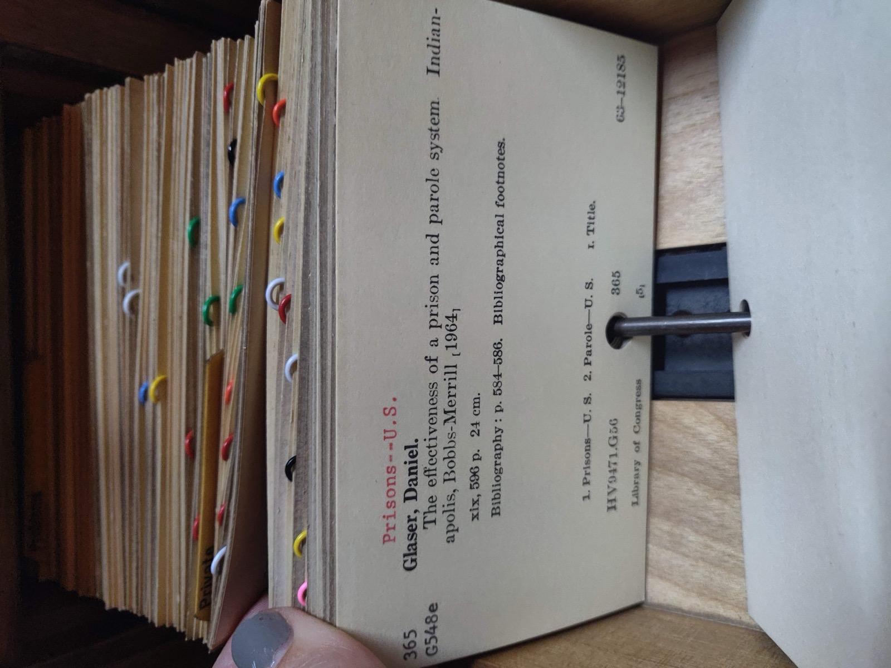

# SQL injection by hand

*SQL injection happens when input is spliced into a query's own text instead of passed as a value, so structure-breaking input changes what the query does. Test for it by hand with safe, minimal probes, and fix it with parameterized queries, never escaping alone.*

> A single apostrophe, typed by hand into a search box, no scanner involved: the results page comes back
> as a raw database error instead of a normal "no results found" message. That one keystroke just told
> you something real - the search field's value is being spliced directly into a query's own text instead
> of being carried as a separate, typed value. SQL injection by hand is the skill of noticing that moment,
> then proving - safely and minimally, on a sandbox you are authorized to test - that the query's actual
> logic can be changed, not just its displayed error. It is the same root-cause mechanism OWASP has ranked
> among the highest-risk categories for over a decade: input reaching a query as an instruction instead of
> as data.

> **In real life**
>
> Picture a library card catalog card: fixed, ruled fields, one per line - call number on its own line,
> author on its own line, subject heading on its own line. The clerk who refiles cards never reads the
> call-number line as an instruction to "also empty the drawer at the front desk" - it is text to file
> under, full stop, no matter how command-like it might read. A card catalog with that discipline could
> hold a card whose call number line literally contained the words "ignore this drawer" and nothing would
> happen, because the filing system only ever reads that line as a value to sort by. A query built by
> splicing raw input into its own text is a filing clerk who never learned that distinction: the instant a
> value looks like a database instruction - a quote that closes a string, a dash-dash that starts a
> comment - the database reads it as one. A parameterized query is the card's ruled template enforced in
> software: the value slot can hold absolutely any text, forever, and the query engine will only ever
> treat it as one literal value, never as new instructions.

**SQL injection by hand**: SQL injection by hand is the manual technique of testing whether user-supplied input is spliced directly into a SQL query's text rather than carried as a separate, typed value - and if so, deliberately supplying a short, structure-breaking test string (a stray quote, a comment marker, an always-true clause) to prove the query's logic can be changed, not merely its displayed output. Doing this by hand, rather than only through an automated scanner, teaches the underlying mechanism directly: a query built by string concatenation treats anything shaped like SQL syntax in the input as SQL syntax, because the database has no way to tell where the developer's intended query ends and the supplied text begins. Confirming impact - a row that should not have matched, an authentication check silently bypassed, a comment marker that visibly truncated the rest of the query - is the actual deliverable, not just a raised error. The fix a tester should name alongside any such finding is parameterized queries (prepared statements with bound parameters), which send the query's structure and its values to the database on separate channels, so no value can ever change the query's shape regardless of its characters. All of this is performed only against systems the tester owns or is explicitly, in writing, authorized to test - this platform's own BuggyShop/BuggyAPI sandbox or a local practice database - using tester-owned test accounts and synthetic data, never a real third-party site.

## Testing by hand, step by step

- **Find a field that reaches a query.** Search boxes, filters, sort parameters, login forms, and any URL
  parameter used to look something up are candidates - anywhere a value plausibly ends up inside a
  `WHERE`, `ORDER BY`, or similar clause.
- **Probe with a single, harmless, structure-breaking character first.** One apostrophe. If the response
  changes shape - a stack trace, a generic 500, a suddenly-empty result where you expected one row - that
  is a strong signal the value reached the query's own text unescaped.
- **Confirm with a boolean pair, not a guess.** Send one input that would make an added condition true (an
  always-true clause) and one that would make it false, and compare the two responses. A real difference
  in row count or behavior between the two - on identical otherwise-valid input - is proof of structural
  control, not a fluke.
- **Use a comment marker to test truncation, not to break anything.** Dialect-scoped comment syntax
  (`--` in many SQL dialects) appended after a value shows whether the rest of the intended query was
  discarded - a diagnostic signal, not a destructive action.
- **Stop at proof, never escalate to extraction or modification.** A tester's job is to demonstrate the
  mechanism and its impact with the smallest possible probe - one extra row, one bypassed check - and
  then report it. Dumping tables or altering data is out of scope for a minimal proof of concept.
- **Never run any of this against a system you do not own or are not explicitly, in writing, authorized
  to test.** Use this platform's own BuggyShop/BuggyAPI sandbox, a local practice database, or another
  named authorized target, with tester-owned test accounts and fake data only.

> **Tip**
>
> An input filter that blocks a lone apostrophe is not proof the query is safe - it only proves that one
> specific character is filtered. Test with a comment marker, a boolean-true/boolean-false pair, and a
> value containing a double-dash, each on its own; a query can still be vulnerable through a path a naive
> filter never anticipated. The only finding that actually closes the question is confirming the query is
> parameterized in the code, or observing behavior that only a structural change could explain.

> **Common mistake**
>
> Treating "the input gets escaped before display" as proof the query itself is safe. A tester sees a
> search term reflected back on the results page with its apostrophe safely shown as a literal character,
> concludes the field is "sanitized," and moves on. But output escaping (what makes a value safe to
> render as HTML) and query parameterization (what makes a value safe to send to a database) are two
> different controls solving two different problems - a value can be perfectly safe to display and still
> be spliced unparameterized into the query that fetched it. Confirm the query itself, ideally by checking
> the code for bound parameters, not by reading how the response happens to render.


*Card catalog at the Indiana State Library - interior view of catalog cards - TBurmeister (WMF), Wikimedia Commons, CC BY-SA 4.0. [Source](https://commons.wikimedia.org/wiki/File:Card_catalog_at_the_Indiana_State_Library_-_interior_view_of_catalog_cards.jpg)*
- **A field, not an instruction** — The red subject heading reads like a command a mundane one, plainly, but the filing clerk never treats it as one. That is exactly what a query parameter should be: content, sorted and stored, never executed as logic.
- **One fixed slot, always** — The call number lives in its own ruled line, never mixed into the title text. A parameterized query enforces the same separation in software - the value slot is always just the value slot, no matter what text lands in it.
- **The rod enforces order, not judgment** — A physical rod through a punched hole keeps every card in its place mechanically - no clerk has to decide by reading content. Parameterization is the same: the database enforces the boundary between structure and value mechanically, not by trusting escaped-looking text.
- **Every card, the identical template** — Whatever a card holds, it obeys the same ruled template as the one beside it. A parameterized query is identical: the query's shape never changes no matter what value is bound into it.

**Testing one field by hand, safely - press Play**

1. **Probe with one harmless, structure-breaking character** — A single apostrophe in a field you are authorized to test. Watch for any change in response shape - an error, a suddenly-empty result, an unexpected row.
2. **Confirm with a true/false boolean pair** — Send an always-true variant and an always-false variant of the same probe. A real difference in the two responses is evidence of structural control, not a guess.
3. **Check truncation with a comment marker** — A dialect-scoped comment sequence appended after the value shows whether the rest of the intended query was discarded - proof, not damage.
4. **Confirm minimal impact, then stop and report** — One extra row, one bypassed check is the deliverable. Report the mechanism and recommend parameterized queries; never extract data or modify anything.

Here is the same distinction in runnable form - a comparator that sends one illustrative, obviously-fake
input through both a concatenated query and a parameterized query against a local, in-memory sandbox
table, so you can see the exact difference in what each one does with it.

*Run it - parameterized vs concatenated query (Python)*

```python
# Parameterized vs concatenated query comparator - run only against a LOCAL,
# in-memory, synthetic sandbox database. This is detection/prevention teaching
# code, never a real attack: the "payload" strings are illustrative, comment
# based, and only ever touch a throwaway sqlite3 table created in this script.
import sqlite3

db = sqlite3.connect(":memory:")
db.execute("CREATE TABLE users (id INTEGER PRIMARY KEY, username TEXT, role TEXT)")
db.executemany(
    "INSERT INTO users (username, role) VALUES (?, ?)",
    [("test_alice", "member"), ("test_bob", "member"), ("test_admin", "admin")],
)
db.commit()

# A classic illustrative, dialect-scoped, obviously-fake login-bypass string.
# Comment-based, never run against anything but this local sandbox table.
ILLUSTRATIVE_INPUT = "test_admin' -- "

def concatenated_query(username):
    # VULNERABLE ON PURPOSE, FOR TEACHING: the input is spliced directly into
    # the SQL text, so anything shaped like SQL syntax is interpreted as SQL,
    # not treated as inert data.
    sql = "SELECT username, role FROM users WHERE username = '" + username + "' AND role != 'admin'"
    return sql, db.execute(sql).fetchall()

def parameterized_query(username):
    # SAFE: the driver sends the SQL text and the value on separate channels.
    # No matter what characters the value contains, it can only ever match a
    # username value - it can never change the query's structure.
    sql = "SELECT username, role FROM users WHERE username = ? AND role != 'admin'"
    return sql, db.execute(sql, (username,)).fetchall()

SUSPICIOUS_MARKERS = ["'", "--", ";", " or ", "=1", "union select"]

def flag_suspicious(text):
    # A detection heuristic ONLY - logging/alerting signal, never a substitute
    # for parameterized queries. Flags common SQL-metacharacter shapes.
    lowered = text.lower()
    return [m for m in SUSPICIOUS_MARKERS if m in lowered]

def run():
    print("Illustrative input (never sent to a real/third-party system):")
    print("  " + repr(ILLUSTRATIVE_INPUT))
    print()

    sql, rows = concatenated_query(ILLUSTRATIVE_INPUT)
    print("Concatenated query text sent to the local sandbox DB:")
    print("  " + sql)
    print("Rows returned (structure was changed by the input):")
    for row in rows:
        print("  " + str(row))
    print()

    sql, rows = parameterized_query(ILLUSTRATIVE_INPUT)
    print("Parameterized query text sent to the local sandbox DB:")
    print("  " + sql)
    print("Rows returned (input treated as one literal value):")
    print("  " + str(rows) + " (empty - no username literally equals the whole string)")
    print()

    markers = flag_suspicious(ILLUSTRATIVE_INPUT)
    print("Detection heuristic flags on the same input: " + str(markers))
    print("Detection is a signal for logging/alerting; parameterization is the actual fix.")

run()
```

The same comparison in Java - a small transparent interpreter over the identical in-memory rows, so the
same illustrative input produces the identical result without needing a database driver:

*Run it - parameterized vs concatenated query (Java)*

```java
import java.util.*;

public class Main {
    // Parameterized vs concatenated query comparator - teaching code only.
    // The Python sibling of this demo runs the same scenario against a real
    // local sqlite3 sandbox table; this Java version uses a small transparent
    // interpreter over the same in-memory rows so the same illustrative input
    // produces the identical result without requiring a JDBC driver. Neither
    // version ever touches a real or third-party system.

    static class User {
        String username, role;
        User(String u, String r) { username = u; role = r; }
        public String toString() { return "(" + username + ", " + role + ")"; }
    }

    static final List<User> USERS = Arrays.asList(
        new User("test_alice", "member"),
        new User("test_bob", "member"),
        new User("test_admin", "admin")
    );

    // A classic illustrative, dialect-scoped, obviously-fake login-bypass string.
    static final String ILLUSTRATIVE_INPUT = "test_admin' -- ";

    static String buildSql(String username) {
        return "SELECT username, role FROM users WHERE username = '" + username + "' AND role != 'admin'";
    }

    static List<User> concatenatedQuery(String username) {
        String sql = buildSql(username);
        // VULNERABLE ON PURPOSE, FOR TEACHING: mimic how a real engine reads
        // this text - a "--" starts a line comment, truncating everything
        // after it, exactly as it would in a real database.
        String effective = sql.contains("--") ? sql.substring(0, sql.indexOf("--")) : sql;
        int firstQuote = effective.indexOf('\\'');
        int secondQuote = effective.indexOf('\\'', firstQuote + 1);
        String usernameLiteral = effective.substring(firstQuote + 1, secondQuote);
        boolean hasRoleFilter = effective.contains("role != 'admin'");

        List<User> results = new ArrayList<>();
        for (User u : USERS) {
            boolean usernameMatches = u.username.equals(usernameLiteral);
            boolean roleFilterOk = !hasRoleFilter || !u.role.equals("admin");
            if (usernameMatches && roleFilterOk) results.add(u);
        }
        return results;
    }

    static List<User> parameterizedQuery(String username) {
        // SAFE: the value is never parsed as SQL text at all - it is compared
        // as one opaque literal, so it can only ever match a username value.
        List<User> results = new ArrayList<>();
        for (User u : USERS) {
            if (u.username.equals(username) && !u.role.equals("admin")) results.add(u);
        }
        return results;
    }

    static final String[] SUSPICIOUS_MARKERS = {"'", "--", ";", " or ", "=1", "union select"};

    static List<String> flagSuspicious(String text) {
        String lowered = text.toLowerCase();
        List<String> hits = new ArrayList<>();
        for (String m : SUSPICIOUS_MARKERS) if (lowered.contains(m)) hits.add(m);
        return hits;
    }

    public static void main(String[] args) {
        System.out.println("Illustrative input (never sent to a real/third-party system):");
        System.out.println("  \\"" + ILLUSTRATIVE_INPUT + "\\"");
        System.out.println();

        String sql = buildSql(ILLUSTRATIVE_INPUT);
        List<User> concatRows = concatenatedQuery(ILLUSTRATIVE_INPUT);
        System.out.println("Concatenated query text sent to the local sandbox DB:");
        System.out.println("  " + sql);
        System.out.println("Rows returned (structure was changed by the input):");
        for (User u : concatRows) System.out.println("  " + u);
        System.out.println();

        String paramSql = "SELECT username, role FROM users WHERE username = ? AND role != 'admin'";
        List<User> paramRows = parameterizedQuery(ILLUSTRATIVE_INPUT);
        System.out.println("Parameterized query text sent to the local sandbox DB:");
        System.out.println("  " + paramSql);
        System.out.println("Rows returned (input treated as one literal value):");
        System.out.println("  " + paramRows + " (empty - no username literally equals the whole string)");
        System.out.println();

        List<String> markers = flagSuspicious(ILLUSTRATIVE_INPUT);
        System.out.println("Detection heuristic flags on the same input: " + markers);
        System.out.println("Detection is a signal for logging/alerting; parameterization is the actual fix.");
    }
}
```

### Your first time: Your mission: test one field by hand, in an authorized sandbox

- [ ] Get written authorization and use a tester-owned account — This platform's own BuggyShop/BuggyAPI sandbox or a local practice database, with a test account you own and fake data only. Never a real third-party site.
- [ ] Pick one field that plausibly reaches a query — A search box, a filter, or a login form. Note the normal, expected response first so you can recognize a change.
- [ ] Probe with a single apostrophe, then a boolean-true/false pair — Record the exact response for each. A real difference between the true and false variants is your evidence of structural control.
- [ ] Confirm minimal impact and stop — One extra row or one bypassed check is proof enough. Write the finding with your exact probes and responses, and recommend parameterized queries as the fix.

You can now recognize, by hand, the exact moment input stops being data and starts being read as
instructions - and you can prove it with the smallest safe probe instead of reaching for a scanner first.

- **An apostrophe gets escaped or rejected everywhere you try it, so you conclude the field is safe.**
  Escaping one character proves only that one character is filtered - it does not prove the query is parameterized. Try a comment marker, a boolean-true/false pair, and a double-dash sequence, each separately. The only finding that truly closes the question is confirming bound parameters in the code.
- **The response looks identical whether your probe would be true or false (a blind condition).**
  Compare a clearly-true and a clearly-false variant of the same structural probe side by side rather than reading a single response in isolation. If both authorized and truly necessary, boolean-based differences (not timing floods) are the safer confirmation technique in a sandbox.
- **You notice what looks like SQL injection while simply browsing a real, live, third-party site.**
  Stop probing immediately. You do not have authorization to test that system. Do not send a second request to confirm it. If a responsible-disclosure channel exists, report only what you observed incidentally - never continue testing without written permission.
- **A classic `' OR '1'='1` style probe gets blocked, so you mark the finding as resolved.**
  A blocked signature proves a filter exists, not that the query is parameterized. Check the actual code path, or try a differently-shaped probe; a web application firewall blocking one known pattern is not the same control as a bound-parameter query.

### Where to check

- **The exact probe and the exact response, saved verbatim** - a finding lives or dies on reproducibility;
  paste the literal input and literal output, not a paraphrase.
- **The query-building code itself, if you can reach it** - confirm bound parameters (`?` or named
  placeholders) rather than string concatenation or `sprintf`-style building, even when output already
  looks escaped.
- **Every field that reaches a query, not just the first one that works** - a form with ten fields can
  have ten independent injection points; a single confirmed field does not clear the other nine.
- **[[security-testing-web/injection-and-client-side/xss-reflected-stored-dom]]** - the sibling injection
  category where input becomes markup or script instead of query syntax; the "data versus instruction"
  mechanism is the same idea applied to a different interpreter.
- **[[security-testing-web/owasp-top-10-properly/mapping-findings-to-the-list]]** - for how this finding
  maps to A03:2021 Injection once you have confirmed it, and how to report severity separately from that
  category.

### Worked example: confirming one login field by hand, in the BuggyShop sandbox

1. A tester, authorized to test the platform's own BuggyShop sandbox with a tester-owned account, notices
   the login form's username field returns a generic "invalid credentials" message for every normal input.
2. They try a single apostrophe in the username field. The response changes shape: instead of the normal
   message, the page returns a raw server error mentioning a SQL syntax problem near an unexpected quote.
3. To confirm structural control rather than just an error, they try a boolean pair on a known-invalid
   username: one variant appending an always-false clause (still rejected, as expected) and one appending
   an always-true clause. The always-true variant logs in successfully - the query's own logic was
   altered, not merely its formatting.
4. They stop there: no data is extracted, no account is modified beyond the one authorized test login.
   The finding is written up with the exact two probe strings, the exact two responses, and the
   recommendation to parameterize the query - filed as A03:2021 Injection.

**Quiz.** A tester sends a lone apostrophe into a search field and gets back a raw database error. What is the correct next step?

- [ ] File the finding immediately using only the error message as evidence
- [x] Confirm structural control with a true/false boolean pair before writing up impact, then recommend parameterized queries
- [ ] Try to extract as much data as possible to make the report more convincing
- [ ] Conclude the field is safe once the error stops appearing after retrying

*An error is a strong signal but not proof of exploitable impact by itself. A boolean-true/false comparison confirms the query's logic can actually be changed - which is the real finding - while extracting data (option C) goes beyond a minimal proof of concept and is out of scope. The fix to recommend is always parameterized queries, not just escaping the character that happened to trigger the error.*

- **SQL injection by hand** — Manually testing whether input is spliced into a query's own text rather than carried as a value, by supplying a short structure-breaking probe and confirming the query's logic actually changed.
- **Why a single apostrophe matters** — It is the smallest probe that reveals whether a value is being treated as query syntax instead of as inert data - a changed response shape is the first signal, not yet proof of impact.
- **Boolean-true/false confirmation** — Comparing an always-true probe against an always-false probe on otherwise identical input; a real behavioral difference between the two proves structural control, not a guess from one response alone.
- **Escaping versus parameterization** — Output escaping makes a value safe to render as HTML; query parameterization makes a value safe to send to a database. A value can be safely escaped for display and still be spliced unparameterized into its query.
- **The actual fix to recommend** — Parameterized queries (prepared statements with bound parameters) send query structure and values on separate channels, so no value can ever change the query's shape - never escaping alone.
- **Minimal proof of concept** — Confirm impact with the smallest possible probe - one extra row, one bypassed check - then stop and report. Extracting data or modifying records goes beyond scope.
- **If you find it on an unauthorized target** — Stop immediately. Do not send a confirming second request. Report only through an explicit responsible-disclosure channel, never by continuing to test without written authorization.

### Challenge

In this platform's own BuggyShop sandbox, using your tester-owned account, pick one field that plausibly
reaches a query (search, filter, or login) and run the by-hand sequence: a single apostrophe probe, then
a boolean-true/false pair, then - only if the first two suggested real structural control - a
comment-marker probe to test truncation. Write the finding as you would report it: the exact input and
output for each probe, the confirmed mechanism, and parameterized queries named as the fix. If the field
turns out not to be vulnerable, write that up too, with the same probes as your evidence.

### Ask the community

> I've been testing for SQL injection by hand - a single apostrophe first, then a boolean-true/false pair to confirm structural control before writing up any impact - rather than jumping straight to an automated scanner. For people who do this regularly: what boolean-pair probe shapes have caught injection that a lone apostrophe or a generic scanner payload missed, and how do you keep the confirmation step minimal enough to stay a safe proof of concept?

Comparing notes on which boolean-pair shapes actually surface injection that a single-character probe or
a generic scanner signature misses - while keeping every step small enough to remain a safe, minimal
proof of concept - is exactly the kind of hands-on detail that separates "ran a scanner" from "understood
the mechanism."

- [OWASP - SQL Injection Prevention Cheat Sheet](https://cheatsheetseries.owasp.org/cheatsheets/SQL_Injection_Prevention_Cheat_Sheet.html)
- [PortSwigger Web Security Academy - SQL injection](https://portswigger.net/web-security/sql-injection)

🎬 [Computerphile - Hacking Websites with SQL Injection](https://www.youtube.com/watch?v=_jKylhJtPmI) (9 min)

- SQL injection by hand starts with the smallest structure-breaking probe - a single apostrophe - to notice when input reaches a query as syntax instead of data.
- Confirm impact, not just an error: a boolean-true/false pair that produces a real behavioral difference is proof of structural control.
- Output escaping and query parameterization are different controls; a value can be safe to render and still be unparameterized in its query.
- The fix to name in every finding is parameterized queries (bound parameters), never escaping alone.
- Stop at a minimal proof of concept - one extra row, one bypassed check - and never extract data or modify records beyond the authorized test.
- Test only systems you own or are explicitly, in writing, authorized to test, with tester-owned accounts and synthetic data.


## Related notes

- [[Notes/security-testing-web/injection-and-client-side/xss-reflected-stored-dom|XSS: reflected / stored / DOM]]
- [[Notes/security-testing-web/injection-and-client-side/command-and-template-injection|Command & template injection]]
- [[Notes/security-testing-web/owasp-top-10-properly/mapping-findings-to-the-list|Mapping findings to the list]]


---
_Source: `packages/curriculum/content/notes/security-testing-web/injection-and-client-side/sql-injection-by-hand.mdx`_
