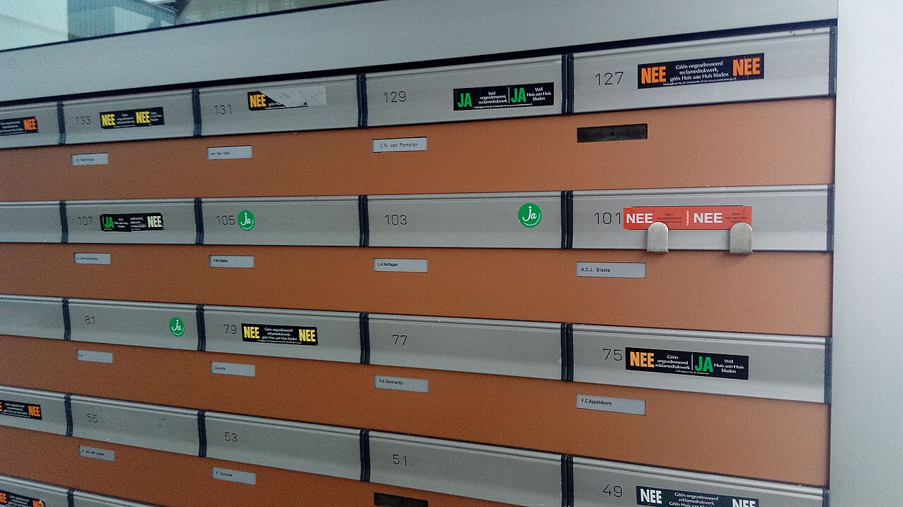

# Broken access control

*Broken access control (A01:2021, the #1 web risk) is when the app lets a user reach data or actions that are not theirs - reading another's invoice by changing an id, or hitting an admin route directly. Testers probe ownership and role on every object and function, within authorized scope.*

> Picture the wall of letterboxes in an apartment lobby. Every box has a number, every box has a name,
> and the whole system rests on one quiet assumption: your key opens box 103 and only box 103. Now
> imagine the locks were never really wired to the keys - every key opens every box - and the only thing
> stopping you from reading your neighbour's mail is that you have always politely opened your own. That
> is broken access control. The application shows you box 103 because that is the number in your URL,
> but when you change the number to 102, it hands you box 102's contents too, because it never actually
> checked that 102 is yours. It sits at number one on the OWASP Top 10:2021 for a reason: it is
> everywhere, it is trivial to trigger - you often just change a number - and it leaks exactly the data
> the whole app exists to protect. A tester who can reason about who owns which box, and who is allowed
> to open it, is testing the single most common critical web vulnerability there is.

> **In real life**
>
> The letterbox wall teaches the whole category. First, there is a RESOURCE with an IDENTIFIER: box
> number 103, invoice id 103, account /users/103. Second, there is an OWNER: the resident whose name is
> on the box, the user the invoice belongs to. Third, there should be a CHECK that runs every single
> time someone reaches for a box: is this key holder the owner of this box, or a caretaker (an admin)
> with legitimate reason? Broken access control is any case where that check is missing, weak, or
> skipped: the key opens every box (no ownership check), the caretaker's master key is left in the door
> (privilege escalation), or a box round the back has no lock at all (an unprotected admin route). The
> tester's job is to walk up to boxes that are not theirs, within authorized scope, and see whether the
> wall actually stops them.

**Broken access control (A01:2021)**: Broken access control (A01:2021) is the risk category for failures to enforce what an authenticated user is permitted to see or do. Access control (authorization) decides whether an already-identified user may perform an action on a specific resource; it is distinct from authentication, which decides who the user is. Common forms: insecure direct object reference / IDOR (reaching another user's object by changing an identifier), missing function-level authorization (calling an admin action as a normal user), privilege escalation (gaining higher rights - horizontal to a peer's data, vertical to an admin's), forced browsing to unprotected URLs, and metadata or CORS misconfiguration. It ranked #1 in the OWASP Top 10:2021, with broken access control found in a large share of tested applications. The fix is server-side enforcement: deny by default, verify ownership and role on every object and every function, and never rely on hiding a link or a client-side check. Test it ONLY on systems you own or are explicitly authorized in writing to test.

## What broken access control looks like, and how a tester probes it

- **IDOR - the changed identifier.** The most common form. An endpoint like `GET /invoice?id=103`
  returns object 103 without checking that 103 belongs to you. The test: log in as your own account,
  note your object's id, then request an id you do not own and see whether the app serves it or
  correctly denies. If it serves it, that is a leak.
- **Missing function-level authorization.** The UI hides the "delete user" button from normal users,
  but the endpoint behind it - `POST /admin/deleteUser` - does not re-check the caller's role. Hiding
  a link is not access control. The test: as a low-privilege user, call the privileged action
  directly and see whether the server enforces the role or just trusted the hidden UI.
- **Privilege escalation - horizontal and vertical.** Horizontal: reaching a peer's data at your own
  level (your neighbour's box). Vertical: gaining a higher role (the caretaker's master key). Both
  come from the server trusting a client-supplied value - a user id, a role field, a tampered token -
  instead of deriving identity and permission server-side.
- **Forced browsing and unprotected routes.** A page or file that is simply not linked, but is fully
  reachable if you type or guess the URL: `/reports/2021-Q4.pdf`, `/admin`, a backup left in the
  webroot. Not-linked is not protected. The test: try known and predictable paths directly.
- **The one reliable fix, which tells you what to test for.** Correct access control is server-side,
  deny-by-default, and re-checked on every object and every function: does the caller own this object,
  or hold a role that legitimately grants access? Everything you probe is really one question - did the
  server actually run that check, or did it assume?
- **The rule that keeps this legal and professional.** Access-control testing means requesting things
  that are not yours, which is only acceptable within authorization. Test only systems you own or are
  explicitly permitted in writing to test, use accounts and data you are allowed to use (ideally
  tester-owned test accounts and synthetic data), stay in the agreed scope, and capture the minimum
  proof needed. Never pivot from a found leak into harvesting real users' data.

> **Tip**
>
> Set up two test accounts you control - call them Alice and Bob - and make this your default access
> check on every feature. As Alice, create or find an object and note its id. Then, as Bob, try to
> read, edit, and delete Alice's object by its id, and try to call any privileged action directly.
> Correct behaviour is a clean deny (typically 403 or a 404 that reveals nothing) enforced by the
> server. This two-account pattern turns the vague worry "is authorization right?" into a concrete,
> repeatable test you can run on anything - and it uses only accounts and data you are authorized to use.

> **Common mistake**
>
> Believing the hidden UI is the control. A team removes the "Edit" button for viewers and calls the
> permission "done", but the `PUT /doc/103` endpoint behind it still accepts any authenticated caller.
> The button was never the lock - it was a curtain in front of an unlocked door. Access control lives on
> the server, on the endpoint, re-checked every request; the UI only decides what to draw. If your test
> plan only clicks visible buttons, it will pass a feature that a single crafted request walks straight
> through. Always test the endpoint directly, not just the screen.


*Letter boxes at an apartment, Oosterflank, Rotterdam (2020) - Donald Trung, Wikimedia Commons, CC BY-SA 4.0. [Source](https://commons.wikimedia.org/wiki/File:Letter_boxes_at_an_apartment,_Oosterflank,_Rotterdam_(2020)_01.jpg)*
- **The box number - the resource identifier** — Box 103, invoice id 103, /users/103. This is the handle the app uses to fetch an object. Broken access control begins the moment the app trusts that handle without checking who is allowed to use it. Change 103 to 102 and see what comes back.
- **The name label - the owner the check must verify** — Every box belongs to someone. Correct access control asks, on every request, 'does this caller own this object, or hold a role that grants access?' A missing or skipped ownership check is exactly IDOR - the app hands over box 102 because you asked, never confirming it is yours.
- **The sequential numbers - predictable, enumerable IDs** — 49, 51, 53 ... 101, 103. Guessable identifiers make broken access control trivial to exploit at scale: an attacker just counts. Unpredictable ids raise the bar but are NOT the fix - the server must still verify ownership on every single request.
- **One wall, one lobby key - horizontal access to a peer** — Your key should open one box; if it opens your neighbour's too, that is horizontal privilege - reaching a peer's data at your own level. Test it with two accounts you control: as Bob, try to open Alice's box by its number and confirm the wall stops you.
- **The caretaker's route - functions and vertical escalation** — Somewhere there is a management panel and a master key. Vertical escalation is a normal user reaching admin functions - often because the endpoint behind a hidden button never re-checks the role. Hiding the button is a curtain, not a lock; test the endpoint directly.

**How an IDOR test plays out - press Play**

1. **Confirm you are authorized, then set up two accounts you control** — Only test a system you own or have explicit written permission to test. Create Alice and Bob as your own test accounts, on a test or local environment, using synthetic data. Authorization is the precondition for everything that follows.
2. **As Alice, find an object and note its identifier** — Alice opens her invoice and sees the request GET /invoice?id=101. That id, 101, is the handle the server uses to fetch the object. You now know the shape of the identifier and one value that is legitimately Alice's.
3. **As Bob, request Alice's identifier directly** — Log in as Bob and issue GET /invoice?id=101 - an object that is not Bob's. This is the whole test: does the server check that 101 belongs to the caller, or does it just fetch and return it because the id was well-formed?
4. **Read the verdict, and stop at minimal proof** — A correct app denies (403, or a non-revealing 404). If Bob receives Alice's invoice, that is broken access control - an A01:2021 finding. Capture just enough evidence to prove it (the request and that it returned another account's object), and do not enumerate other real users.

Here is the decision at the heart of it, in runnable form: the same requests through a vulnerable
endpoint that checks only authentication, and a fixed one that checks ownership or admin role.

*Run it - a vulnerable vs a fixed access-control check (Python)*

```python
# Modelling an access-control decision so you can SEE the bug and the fix.
# This is a pure logic simulation, not an attack: it decides ALLOW / DENY.
# Each invoice belongs to one owner; admins may read any.
INVOICES = {
    101: "alice",
    102: "bob",
    103: "carol",
}

# The vulnerable check: "are you logged in?" and nothing else. This is the bug.
def vulnerable_can_read(requester, requester_role, invoice_id):
    return requester is not None

# The fixed check: you may read an invoice only if you own it, or you are admin.
def secure_can_read(requester, requester_role, invoice_id):
    owner = INVOICES.get(invoice_id)
    return owner == requester or requester_role == "admin"

REQUESTS = [
    ("alice", "user",  101),   # owner reads own invoice
    ("alice", "user",  102),   # alice tries bob's invoice by changing the id
    ("bob",   "user",  103),   # bob tries carol's invoice
    ("admin", "admin", 102),   # an admin legitimately reads any invoice
]

def report(label, check):
    print(label)
    leaks = 0
    for requester, role, invoice_id in REQUESTS:
        owner = INVOICES.get(invoice_id)
        allowed = check(requester, role, invoice_id)
        authorized = (owner == requester or role == "admin")
        verdict = "ALLOW" if allowed else "DENY "
        flag = "  <-- LEAK" if allowed and not authorized else ""
        if allowed and not authorized:
            leaks += 1
        print("  " + verdict + " " + requester + " (" + role + ") -> invoice " + str(invoice_id) + " owned by " + owner + flag)
    print("  leaks: " + str(leaks))
    print()

report("Vulnerable endpoint (checks authentication only):", vulnerable_can_read)
report("Fixed endpoint (checks ownership or admin role):", secure_can_read)
print("Access control must verify WHO OWNS the object, not just that the caller is logged in.")
```

The same two checks in Java - identical requests, identical verdicts:

*Run it - a vulnerable vs a fixed access-control check (Java)*

```java
import java.util.*;

public class Main {
    // Modelling an access-control decision so you can SEE the bug and the fix.
    // This is a pure logic simulation, not an attack: it decides ALLOW / DENY.
    // Each invoice belongs to one owner; admins may read any.
    static final Map<Integer, String> INVOICES = new LinkedHashMap<>();
    static {
        INVOICES.put(101, "alice");
        INVOICES.put(102, "bob");
        INVOICES.put(103, "carol");
    }

    interface Check { boolean allow(String requester, String role, int invoiceId); }

    // The vulnerable check: "are you logged in?" and nothing else. This is the bug.
    static boolean vulnerableCanRead(String requester, String role, int invoiceId) {
        return requester != null;
    }

    // The fixed check: you may read an invoice only if you own it, or you are admin.
    static boolean secureCanRead(String requester, String role, int invoiceId) {
        String owner = INVOICES.get(invoiceId);
        return owner.equals(requester) || role.equals("admin");
    }

    static final String[][] REQUESTS = {
        {"alice", "user",  "101"},   // owner reads own invoice
        {"alice", "user",  "102"},   // alice tries bob's invoice by changing the id
        {"bob",   "user",  "103"},   // bob tries carol's invoice
        {"admin", "admin", "102"},   // an admin legitimately reads any invoice
    };

    static void report(String label, Check check) {
        System.out.println(label);
        int leaks = 0;
        for (String[] r : REQUESTS) {
            String requester = r[0], role = r[1];
            int invoiceId = Integer.parseInt(r[2]);
            String owner = INVOICES.get(invoiceId);
            boolean allowed = check.allow(requester, role, invoiceId);
            boolean authorized = owner.equals(requester) || role.equals("admin");
            String verdict = allowed ? "ALLOW" : "DENY ";
            String flag = (allowed && !authorized) ? "  <-- LEAK" : "";
            if (allowed && !authorized) leaks++;
            System.out.println("  " + verdict + " " + requester + " (" + role + ") -> invoice " + invoiceId + " owned by " + owner + flag);
        }
        System.out.println("  leaks: " + leaks);
        System.out.println();
    }

    public static void main(String[] args) {
        report("Vulnerable endpoint (checks authentication only):", Main::vulnerableCanRead);
        report("Fixed endpoint (checks ownership or admin role):", Main::secureCanRead);
        System.out.println("Access control must verify WHO OWNS the object, not just that the caller is logged in.");
    }
}
```

### Your first time: Your mission: run a two-account access-control test

- [ ] Confirm you are authorized to test the target, in writing, and stay in scope — Access-control testing means requesting resources that are not yours - only ever on a system you own or have explicit written permission to test, with accounts and data you are allowed to use. This step is not optional; it is what separates testing from intrusion.
- [ ] Create two accounts you control - Alice and Bob - on a test or local environment — Use tester-owned accounts and synthetic data, never real users' records. As Alice, create or open an object (an invoice, a document, a profile) and record the identifier the request uses, such as id=101.
- [ ] As Bob, try to read, edit, and delete Alice's object by its id — Issue the same requests Bob would normally make for his own object, but with Alice's identifier. Correct behaviour is a server-enforced deny (403, or a 404 that reveals nothing). Bob receiving Alice's data is an A01:2021 IDOR finding.
- [ ] Try one privileged action directly as Bob, bypassing the UI — Find an admin-only action, and as low-privilege Bob call its endpoint directly rather than through the hidden button. If the server performs it, that is missing function-level authorization. Record the request, the response, and minimal proof - then stop.

You have now run the single most valuable security test there is on a web app: does the server check
who owns the object and who may call the function, or does it just trust the request? Kept inside
authorization, this two-account habit catches the number-one risk on the list.

- **A user can read another user's data by changing an id in a URL or request body.**
  This is IDOR, the classic A01:2021. The endpoint fetches the object by its identifier but never verifies the caller owns it. The fix is server-side: on every object access, check that the resource belongs to the authenticated user (or that their role legitimately grants access) before returning it, and deny by default. As a tester, prove it with two accounts you control and report it as A01:2021 with the request and the cross-account response as evidence.
- **A normal user can perform an admin action even though the button is hidden from them.**
  Missing function-level authorization: the UI hid the control but the endpoint behind it never re-checks the role. Hiding a link is presentation, not access control. The server must authorize every privileged function against the caller's actual role on every request. Test by calling the privileged endpoint directly as a low-privilege account; a correct app denies it regardless of what the UI showed.
- **A page or file is reachable by typing its URL even though nothing links to it.**
  Forced browsing against an unprotected route - not-linked is not protected. Admin panels, report exports, and stray backups left in the webroot are all reachable by anyone who guesses or finds the path. Every sensitive route needs its own server-side authorization check, independent of whether a link exists. Probe known and predictable paths directly, within authorized scope, and treat any that serve sensitive content without a check as A01:2021.
- **Access control 'works' in manual clicking but a crafted request walks through it.**
  The test only exercised the UI, which is exactly where access control does NOT live. Buttons, hidden fields, and disabled inputs are drawn by the client and can be ignored by an attacker who talks to the endpoint directly. Move the test down to the request layer: replay and modify the actual API calls with a proxy or client, changing ids, roles, and target paths, so you exercise the server's real decision rather than the screen's suggestion.

### Where to check

- **Every endpoint that takes an object identifier** - `?id=`, `/users/{n}`, ids in the request body or a JWT claim. Each is an IDOR candidate: verify the server checks ownership, not just that the id is well-formed. (Braces here mean a path segment, e.g. `/users/103`.)
- **Every privileged or admin function** - creation, deletion, role changes, exports. Confirm the endpoint re-checks the caller's role server-side, independent of whether the UI exposed the control.
- **Unlinked and predictable URLs** - admin panels, report files, backups, sequential document paths. Not-linked is not protected; each needs its own authorization check.
- **The token and session** - anything client-supplied that names identity or role (a user id in the body, a role field, a tampered cookie or JWT). The server must derive permission itself, never trust these values.
- **[[non-functional-testing-intro/security/common-risks]]** and the OWASP Web Security Testing Guide's authorization tests - the how-to companions for probing each of the above safely and within scope.

### Worked example: finding and reporting one IDOR, properly

1. A tester has written authorization to test a billing feature on a staging environment, with two
   tester-owned accounts and synthetic data. Scope and permission are confirmed before anything else.
2. Logged in as Alice, the tester opens an invoice and observes the request `GET /invoice?id=101`.
   The identifier is a small sequential integer - already a hint that ids are enumerable.
3. The tester logs in as Bob (their own second account) and issues `GET /invoice?id=101`, an object
   that belongs to Alice, not Bob. The server returns Alice's invoice PDF with a 200. That is the
   whole vulnerability: no ownership check ran.
4. The tester captures minimal proof - the two requests and the fact that Bob's session received
   Alice's object - and deliberately does NOT iterate through other ids or touch any real customer
   data. One clear demonstration is enough; harvesting would be out of scope and unethical.
5. The finding is filed as "A01:2021 Broken Access Control (IDOR) - any authenticated user can read
   any invoice by changing the id", with the evidence, the affected endpoint, and impact scored on
   the app: every customer's billing data is exposed, so this is high severity regardless of A01's
   list position. The recommended fix is a server-side ownership check on the invoice lookup, deny by
   default.

**Quiz.** Logged in as your own test account, you change the id in GET /invoice?id=101 to an id you do not own and the server returns that other account's invoice. Within an authorized test, what is the right conclusion and next step?

- [ ] The ids are just guessable; recommend random ids and consider it resolved
- [x] It is an A01:2021 IDOR - the server did not verify ownership; capture minimal proof, do not harvest other records, and report it with the fix being a server-side ownership check
- [ ] It is fine as long as the Edit button is hidden for other users in the UI
- [ ] Enumerate every id to measure how many records are exposed before reporting

*Returning another account's object because you supplied its id is broken access control - specifically IDOR - and the root cause is a missing server-side ownership check, not merely guessable ids. Random ids raise the bar but are not the fix (option A). Hiding a UI control does nothing for a direct request (option C). Enumerating real records exceeds what is needed to prove the bug and can breach scope and ethics (option D) - capture minimal proof and stop. Report it as A01:2021 with the fix being deny-by-default, verify-ownership-on-every-request enforcement.*

- **Broken access control (A01:2021)** — Failure to enforce what an authenticated user may see or do. Ranked #1 in the 2021 list, found in a large share of tested apps. Authorization (may you?) is distinct from authentication (who are you?).
- **IDOR** — Insecure Direct Object Reference: reaching another user's object by changing an identifier (id=101 to id=102) because the server fetches by id without checking ownership. The most common form of broken access control.
- **Missing function-level authorization** — A privileged action (delete user, export data) whose endpoint does not re-check the caller's role - the UI hid the button but the server still obeys any authenticated caller. Hiding a link is not access control.
- **Horizontal vs vertical escalation** — Horizontal: reaching a peer's data at your own level (a neighbour's letterbox). Vertical: gaining a higher role (the caretaker's master key). Both come from the server trusting client-supplied identity or role.
- **The two-account test** — Create Alice and Bob (accounts you control). As Alice, note an object's id. As Bob, try to read/edit/delete it and call privileged actions directly. A server-enforced deny (403 / non-revealing 404) is correct; success is a finding.
- **The fix (and what to test for)** — Server-side, deny-by-default authorization re-checked on every object and every function: does the caller own this object or hold a legitimate role? Never rely on hidden UI, unpredictable ids, or client-side checks alone.
- **The authorization rule for testers** — Access-control testing means requesting things that are not yours - only on systems you own or are explicitly permitted in writing to test, with allowed accounts and synthetic data, in scope, capturing minimal proof. Never harvest real users' records.

### Challenge

On a system you own or are explicitly authorized in writing to test, set up two accounts you control
and hunt for one broken-access-control issue. As account one, create an object and record the exact
request and its identifier. As account two, attempt to read, edit, and delete that object by its id,
and attempt one privileged action by calling its endpoint directly rather than through the UI. Write
up what you find - whether the server correctly denied, or whether it leaked - as an A01:2021 finding
with the request, the response, minimal proof, and a server-side fix. Capture only what is needed to
demonstrate the issue; do not enumerate other real records. Both a clean deny and a real leak are
worth documenting: one proves the control works, the other is the number-one risk on the list.

### Ask the community

> I have started running two-account access-control tests on every feature - as user B, requesting user A's objects by id (`GET /invoice?id=101`) and calling privileged endpoints directly. For folks who test authorization regularly: how do you keep this systematic across many endpoints without missing any, and how do you keep proof minimal and in-scope once you find a real IDOR?

Keeping the two-account check systematic across dozens of endpoints, and knowing exactly where to
stop once you have proven a leak, are the two things that separate a tidy authorization pass from
either missed bugs or an out-of-scope mess - hearing how experienced testers handle both is the
fastest way to level this up.

- [OWASP A01:2021 Broken Access Control - the official category page](https://owasp.org/Top10/2021/A01_2021-Broken_Access_Control/)
- [OWASP Authorization Cheat Sheet - how to enforce access control correctly](https://cheatsheetseries.owasp.org/cheatsheets/Authorization_Cheat_Sheet.html)
- [Aikido Security - Broken Access Control (OWASP A01) explained with examples](https://www.youtube.com/watch?v=vUFVxoV5y_I)

🎬 [Aikido Security - Broken Access Control Explained: OWASP Top 10 A01 Explained with Examples](https://www.youtube.com/watch?v=vUFVxoV5y_I) (7 min)

- Broken access control (A01:2021) is the #1 web risk: the app lets an authenticated user reach data or actions that are not theirs because it failed to verify ownership or role.
- The most common form is IDOR - change an identifier (id=101 to id=102) and receive an object you do not own, because the server fetched by id without an ownership check.
- Other forms: missing function-level authorization (privileged endpoint behind a hidden button), horizontal and vertical privilege escalation, and forced browsing to unlinked-but-unprotected routes.
- Test it with two accounts you control: as user B, try to read, edit, and delete user A's objects by id and call privileged actions directly - a server-enforced deny is correct, success is a finding.
- Access control lives on the server, deny-by-default, re-checked on every object and every function; hidden UI, unpredictable ids, and client-side checks are not the control.
- Only test systems you own or are explicitly authorized in writing to test, with allowed accounts and synthetic data, in scope, capturing minimal proof - never harvest real users' records.


## Related notes

- [[Notes/security-testing-web/owasp-top-10-properly/the-2021-list-and-how-to-use-it|The 2021 list & how to use it]]
- [[Notes/security-testing-web/owasp-top-10-properly/mapping-findings-to-the-list|Mapping findings to the list]]
- [[Notes/non-functional-testing-intro/security/common-risks|Common risks]]


---
_Source: `packages/curriculum/content/notes/security-testing-web/owasp-top-10-properly/broken-access-control.mdx`_
