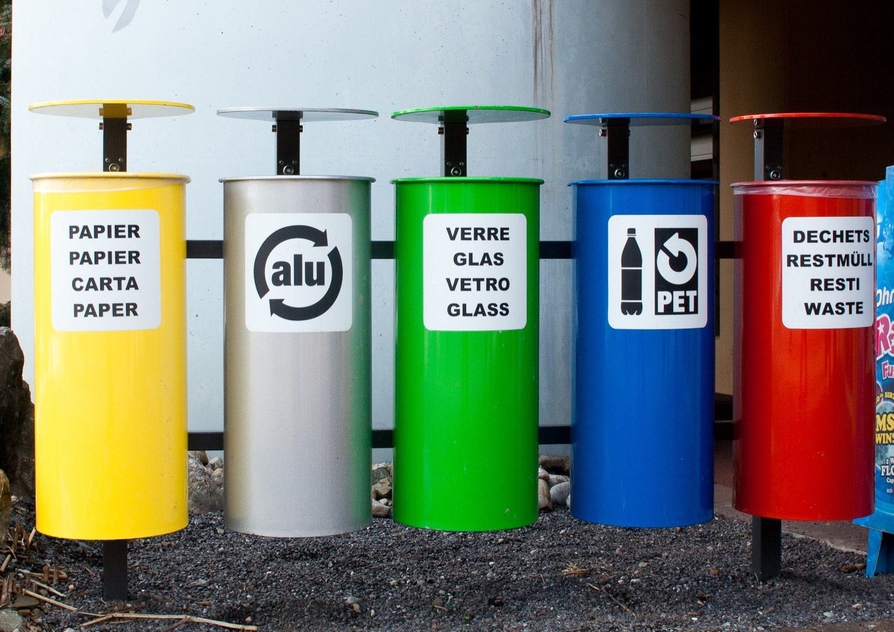

# Mapping findings to the list

*Mapping a finding to the OWASP Top 10:2021 means matching its root-cause mechanism to the category that names it, not a keyword or a story. Some findings fit two categories, some fit none - both are fine to report, as long as you never force a fit or read the category as severity.*

> You have just found a real bug: a password-reset link still works after someone has already used it once.
> Good catch. Now write it up. Do you call it A07 Identification and Authentication Failures, because the
> whole thing is a broken auth flow? Or A04 Insecure Design, because nobody ever thought to invalidate the
> token after use? Pick wrong and your bug tracker fills up with the same mechanism labeled five different
> ways, dashboards stop meaning anything, and the developer reading your report has to reverse-engineer
> what you actually meant. This note is the missing skill between "I found something" and "I labeled it
> correctly": how to take a raw finding and place it in the one category whose name matches its mechanism -
> and, just as importantly, how to admit when it does not belong in any of the ten at all.

> **In real life**
>
> Picture five recycling bins standing in a row, each stenciled with exactly what belongs inside it: paper,
> aluminium, glass, PET plastic, and a last bin for whatever is genuinely left over. You do not sort a
> bottle by how big it is or how much you care about it - a tiny scrap of foil and a huge sheet of paper
> are sorted by what they ARE, not by size or drama. Two bins can look confusingly similar (glass and clear
> PET plastic both glint the same way), so you check the actual material, not the first impression. And
> critically, that last bin exists precisely because not everything is paper, aluminium, glass, or PET -
> forcing a plastic bottle into the paper bin because you could not be bothered to check contaminates the
> whole batch. Mapping a security finding to the OWASP Top 10:2021 is the same sort: match the mechanism to
> the one labeled category it actually is, resist the two that look alike, and when nothing fits, use the
> "not covered" bin rather than contaminating a category with a finding that does not belong there.

**Mapping findings to the list**: Mapping findings to the list is the skill of assigning a specific, already-discovered vulnerability to the OWASP Top 10:2021 category whose root-cause mechanism it actually matches, so the finding becomes searchable, comparable, and trend-able across a team and over time. The match is made on MECHANISM (what actually failed: an ownership check, a hashing choice, a query built from raw input) rather than on surface keywords or how alarming the finding sounds. Two edge cases are normal and must be handled honestly rather than forced: a finding can plausibly touch more than one category (name a primary root cause and note the secondary rather than splitting or guessing), and a finding can match none of the ten (business-logic abuse and novel flaws are explicitly outside the list's scope per OWASP's own notes - report it anyway, just without a Top 10 code). Category is never severity: the label says WHICH shape a bug has, and its priority is scored separately from exploitability, exposure, and business impact.

## How to place a finding, step by step

- **Read for mechanism, not headline.** "Users can see each other's data" is a headline, not a
  mechanism. Ask what actually failed underneath it: was an ownership check skipped (A01), was the data
  unencrypted in transit (A02), or was it returned by a query built from unescaped input (A03)? The same
  headline can hide three different root causes, and only the mechanism tells you which one you have.
- **When two categories both look right, name a primary and a secondary.** A password-reset token that
  still works after use is fundamentally an authentication-flow defect (A07) - but it is also true that
  nobody threat-modeled "what happens after redemption" (A04, Insecure Design). Pick the more specific,
  closer-to-the-symptom category as primary, note the other as a contributing factor, and file ONE
  finding - do not split one bug into two tickets chasing two codes.
- **Treat A04 Insecure Design as the least specific bucket, not a shrug.** Almost any bug can be traced
  back to "this was not designed carefully enough." That makes A04 tempting as a default when you are
  unsure - resist it. Reserve A04 for findings whose sharpest description really is a missing design
  control (no anti-automation, no fraud-limit business logic), and prefer any more specific category
  when one genuinely fits better.
- **When nothing fits, say so - do not force it.** A referral code redeemable twice by resubmitting a
  form quickly is a real bug and a real business-logic race, but it does not name the mechanism of any
  of the ten categories. Report it in full, with its own title and fix, and simply omit a Top 10 code
  rather than jamming it under the nearest-sounding one. A wrong code is worse than no code - it
  actively misleads whoever searches or trends by category later.
- **The category is not the priority queue.** Once a finding is placed, score its severity on its own
  merits - exploitability, exposure, affected data, existing controls, business impact - completely
  independent of which letter it got. An A10:2021 SSRF that reaches cloud metadata can outrank an
  A01:2021 that only leaks a harmless preference field. The map tells you where the bug lives, not how
  loud the alarm should be.
- **Consistency compounds.** One correctly mapped finding is a data point; a team's worth of them, mapped
  the same way every time, becomes a trend line - which category recurs, which sprint introduced more
  A05 misconfigurations, which team keeps shipping A03. That trend is only trustworthy if everyone
  mapped by the same rule: mechanism first, never force a fit, category and severity kept apart.

> **Tip**
>
> Before you write a category code on any finding, finish this sentence out loud: "the mechanism that
> actually failed here is ___." If you cannot finish it in one clear phrase - if you are reaching for the
> headline instead - you are not ready to map it yet. Go find the mechanism first; the correct category
> usually falls out on its own once you can name the failure in one line.

> **Common mistake**
>
> Mapping by dramatic weight instead of mechanism. A tester finds that an internal admin tool has no
> authentication at all and, because it feels huge, files it as A01 Broken Access Control - "access control
> is broken, look how bad it is." But an endpoint with genuinely zero authentication is arguably an A07
> Identification and Authentication Failures issue (there is no identity check to begin with) that also
> happens to grant total access; calling it "how broken the access is" rather than naming the missing
> authentication step buries the real mechanism under how alarming the finding feels. Severity and mechanism
> are different questions - a finding can be both catastrophic and precisely, calmly categorized.


*Tri des dechets (cropped) - Ludovic Peron, Wikimedia Commons, CC BY-SA 3.0. [Source](https://commons.wikimedia.org/wiki/File:Tri_des_d%C3%A9chets_(cropped).jpg)*
- **One bin, one named category** — PAPIER is stenciled once, plainly. A finding maps the same way: to the one category whose name matches its mechanism, not to whichever sounds closest.
- **Matched by what it IS, not by story** — The alu bin does not care how big or dented the can is - only that it is aluminium. A finding is matched by its root-cause mechanism, never by how alarming or newsworthy it sounds.
- **Two categories can look alike** — Glass and the clear PET bottle two bins over can catch the same light. Some findings likewise sit close to two categories - check the actual mechanism before you commit, the way you would check the material, not the glint.
- **The near-neighbor bin** — PET plastic stands right next to glass - a deliberate reminder that adjacent-looking categories (say, A07 auth flow versus A04 design gap) need a real look at the mechanism, not a guess from proximity.
- **The catch-all - not everything fits** — DECHETS / RESTMULL / WASTE exists because not everything is paper, aluminium, glass, or PET. A finding that matches none of the ten categories still gets reported in full - it just does not get a Top 10 code forced onto it.
- **Same size, same stand - no bin outranks another** — All five bins are built to the same height and mounted on the same rail. The taxonomy does not rank its categories by importance either - a bin's position in the row is not its priority, and neither is a category's letter.

**Mapping one finding, honestly - press Play**

1. **Write down what actually failed, in one sentence** — Not the headline ('users can see each other's data') but the mechanism: an ownership check was skipped, a hash was weak, a query concatenated raw input. If you cannot write this sentence yet, you are not ready to map.
2. **Check it against the ten category shapes** — Does the sentence describe someone reaching data or actions that are not theirs (A01)? Protection that was missing around the data itself (A02)? Input reaching a query or command (A03)? Walk the shapes, not a keyword list.
3. **If two shapes both fit, name a primary and a secondary** — Pick the one closest to the actual symptom as primary, note the other as a contributing cause, and file it as ONE finding. Do not split a single bug to chase two codes.
4. **If none fit, report it anyway - without a code** — Business-logic abuse and novel flaws are explicitly outside the Top 10's ten shapes. The finding is still real and still gets a full write-up; it just is not force-fit into the nearest-sounding category.

Here is that same mapping discipline in runnable form - a small classifier that matches each finding's
mechanism to a category, flags the one that fits two, and refuses to force the one that fits none.

*Run it - a findings-to-category classifier (Python)*

```python
# A findings-to-category classifier: match each finding's MECHANISM tags to
# the OWASP Top 10:2021 category that names that root cause. Real triage
# works the same way - match the mechanism, not a keyword, and if nothing
# fits, say so instead of forcing it into the nearest box.

CATEGORY_TAGS = {
    "A01": {"no-ownership-check"},
    "A02": {"weak-hash"},
    "A03": {"sql-string-concat"},
    "A04": {"business-logic-abuse-by-design", "no-threat-model"},
    "A05": {"debug-on-in-prod"},
    "A06": {"known-cve-dependency"},
    "A07": {"no-lockout", "reusable-reset-token"},
    "A08": {"unsigned-update-accepted"},
    "A09": {"no-audit-log"},
    "A10": {"server-fetches-attacker-url"},
}

CATEGORY_NAMES = {
    "A01": "Broken Access Control",
    "A02": "Cryptographic Failures",
    "A03": "Injection",
    "A04": "Insecure Design",
    "A05": "Security Misconfiguration",
    "A06": "Vulnerable and Outdated Components",
    "A07": "Identification and Authentication Failures",
    "A08": "Software and Data Integrity Failures",
    "A09": "Security Logging and Monitoring Failures",
    "A10": "Server-Side Request Forgery (SSRF)",
}

# A04 is the least specific bucket (a design gap with no sharper mechanism),
# so when a finding's tags span two categories, prefer the more specific one.
PRIORITY = ["A01", "A02", "A03", "A05", "A06", "A07", "A08", "A09", "A10", "A04"]

FINDINGS = [
    ("F01", "Any user can read another user's invoice by changing id in the URL", {"no-ownership-check"}),
    ("F02", "Passwords are stored with unsalted MD5", {"weak-hash"}),
    ("F03", "A search field concatenates raw input into a SQL string", {"sql-string-concat"}),
    ("F04", "A checkout quantity field accepts a negative number, producing a payout instead of a charge", {"business-logic-abuse-by-design"}),
    ("F05", "Production runs with debug mode on, leaking stack traces", {"debug-on-in-prod"}),
    ("F06", "A logging library in use has a publicly known CVE with no patch applied", {"known-cve-dependency"}),
    ("F07", "The login form never locks out after failed attempts", {"no-lockout"}),
    ("F08", "The auto-update client installs packages without verifying a signature", {"unsigned-update-accepted"}),
    ("F09", "Failed admin logins are never written to any log", {"no-audit-log"}),
    ("F10", "The report-generator endpoint fetches any URL you pass it and returns the response", {"server-fetches-attacker-url"}),
    ("F11", "A password-reset token still works after already being used once", {"reusable-reset-token", "no-threat-model"}),
    ("F12", "A referral code can be redeemed twice by resubmitting the form quickly", set()),
]

def classify(tags):
    return [cat for cat in PRIORITY if CATEGORY_TAGS[cat] & tags]

def run():
    print("Mapping findings to the OWASP Top 10:2021 - by mechanism, not keyword:")
    print()
    mapped, ambiguous, unmapped = 0, 0, 0
    for fid, desc, tags in FINDINGS:
        matches = classify(tags)
        if not matches:
            print("  [" + fid + "] UNMAPPED - " + desc)
            print("           Does not name a mechanism any of the ten categories cover. Report it anyway.")
            unmapped += 1
        elif len(matches) == 1:
            cat = matches[0]
            print("  [" + fid + "] " + cat + " " + CATEGORY_NAMES[cat] + " - " + desc)
            mapped += 1
        else:
            primary, secondary = matches[0], matches[1:]
            print("  [" + fid + "] " + primary + " " + CATEGORY_NAMES[primary] + " (primary) - " + desc)
            print("           also touches: " + ", ".join(secondary) + " - note it, don't split the finding")
            mapped += 1
            ambiguous += 1
    print()
    print(str(mapped) + " mapped (" + str(ambiguous) + " needed a primary/secondary call), " + str(unmapped) + " unmapped.")
    print("The category names the mechanism. Severity is scored separately, by impact on this app.")

run()
```

The same classifier in Java - identical findings in, identical categories and calls out:

*Run it - a findings-to-category classifier (Java)*

```java
import java.util.*;

public class Main {
    // A findings-to-category classifier: match each finding's MECHANISM tags to
    // the OWASP Top 10:2021 category that names that root cause. Real triage
    // works the same way - match the mechanism, not a keyword, and if nothing
    // fits, say so instead of forcing it into the nearest box.

    static final Map<String, Set<String>> CATEGORY_TAGS = new LinkedHashMap<>();
    static final Map<String, String> CATEGORY_NAMES = new LinkedHashMap<>();
    // A04 is the least specific bucket (a design gap with no sharper mechanism),
    // so when a finding's tags span two categories, prefer the more specific one.
    static final String[] PRIORITY = {"A01", "A02", "A03", "A05", "A06", "A07", "A08", "A09", "A10", "A04"};

    static {
        CATEGORY_TAGS.put("A01", new HashSet<>(Arrays.asList("no-ownership-check")));
        CATEGORY_TAGS.put("A02", new HashSet<>(Arrays.asList("weak-hash")));
        CATEGORY_TAGS.put("A03", new HashSet<>(Arrays.asList("sql-string-concat")));
        CATEGORY_TAGS.put("A04", new HashSet<>(Arrays.asList("business-logic-abuse-by-design", "no-threat-model")));
        CATEGORY_TAGS.put("A05", new HashSet<>(Arrays.asList("debug-on-in-prod")));
        CATEGORY_TAGS.put("A06", new HashSet<>(Arrays.asList("known-cve-dependency")));
        CATEGORY_TAGS.put("A07", new HashSet<>(Arrays.asList("no-lockout", "reusable-reset-token")));
        CATEGORY_TAGS.put("A08", new HashSet<>(Arrays.asList("unsigned-update-accepted")));
        CATEGORY_TAGS.put("A09", new HashSet<>(Arrays.asList("no-audit-log")));
        CATEGORY_TAGS.put("A10", new HashSet<>(Arrays.asList("server-fetches-attacker-url")));

        CATEGORY_NAMES.put("A01", "Broken Access Control");
        CATEGORY_NAMES.put("A02", "Cryptographic Failures");
        CATEGORY_NAMES.put("A03", "Injection");
        CATEGORY_NAMES.put("A04", "Insecure Design");
        CATEGORY_NAMES.put("A05", "Security Misconfiguration");
        CATEGORY_NAMES.put("A06", "Vulnerable and Outdated Components");
        CATEGORY_NAMES.put("A07", "Identification and Authentication Failures");
        CATEGORY_NAMES.put("A08", "Software and Data Integrity Failures");
        CATEGORY_NAMES.put("A09", "Security Logging and Monitoring Failures");
        CATEGORY_NAMES.put("A10", "Server-Side Request Forgery (SSRF)");
    }

    static Object[] finding(String id, String desc, String... tags) {
        return new Object[]{id, desc, new HashSet<>(Arrays.asList(tags))};
    }

    static List<String> classify(Set<String> tags) {
        List<String> matches = new ArrayList<>();
        for (String cat : PRIORITY) {
            Set<String> shared = new HashSet<>(CATEGORY_TAGS.get(cat));
            shared.retainAll(tags);
            if (!shared.isEmpty()) matches.add(cat);
        }
        return matches;
    }

    public static void main(String[] args) {
        List<Object[]> findings = new ArrayList<>();
        findings.add(finding("F01", "Any user can read another user's invoice by changing id in the URL", "no-ownership-check"));
        findings.add(finding("F02", "Passwords are stored with unsalted MD5", "weak-hash"));
        findings.add(finding("F03", "A search field concatenates raw input into a SQL string", "sql-string-concat"));
        findings.add(finding("F04", "A checkout quantity field accepts a negative number, producing a payout instead of a charge", "business-logic-abuse-by-design"));
        findings.add(finding("F05", "Production runs with debug mode on, leaking stack traces", "debug-on-in-prod"));
        findings.add(finding("F06", "A logging library in use has a publicly known CVE with no patch applied", "known-cve-dependency"));
        findings.add(finding("F07", "The login form never locks out after failed attempts", "no-lockout"));
        findings.add(finding("F08", "The auto-update client installs packages without verifying a signature", "unsigned-update-accepted"));
        findings.add(finding("F09", "Failed admin logins are never written to any log", "no-audit-log"));
        findings.add(finding("F10", "The report-generator endpoint fetches any URL you pass it and returns the response", "server-fetches-attacker-url"));
        findings.add(finding("F11", "A password-reset token still works after already being used once", "reusable-reset-token", "no-threat-model"));
        findings.add(finding("F12", "A referral code can be redeemed twice by resubmitting the form quickly"));

        System.out.println("Mapping findings to the OWASP Top 10:2021 - by mechanism, not keyword:");
        System.out.println();
        int mapped = 0, ambiguous = 0, unmapped = 0;
        for (Object[] f : findings) {
            String fid = (String) f[0], desc = (String) f[1];
            @SuppressWarnings("unchecked")
            Set<String> tags = (Set<String>) f[2];
            List<String> matches = classify(tags);
            if (matches.isEmpty()) {
                System.out.println("  [" + fid + "] UNMAPPED - " + desc);
                System.out.println("           Does not name a mechanism any of the ten categories cover. Report it anyway.");
                unmapped++;
            } else if (matches.size() == 1) {
                String cat = matches.get(0);
                System.out.println("  [" + fid + "] " + cat + " " + CATEGORY_NAMES.get(cat) + " - " + desc);
                mapped++;
            } else {
                String primary = matches.get(0);
                List<String> secondary = matches.subList(1, matches.size());
                System.out.println("  [" + fid + "] " + primary + " " + CATEGORY_NAMES.get(primary) + " (primary) - " + desc);
                System.out.println("           also touches: " + String.join(", ", secondary) + " - note it, don't split the finding");
                mapped++;
                ambiguous++;
            }
        }
        System.out.println();
        System.out.println(mapped + " mapped (" + ambiguous + " needed a primary/secondary call), " + unmapped + " unmapped.");
        System.out.println("The category names the mechanism. Severity is scored separately, by impact on this app.");
    }
}
```

### Your first time: Your mission: map five real findings by mechanism

- [ ] Gather (or write) five short finding descriptions from a system you are authorized to test — Real findings from your own authorized testing, or plausible ones you invent for practice. Each should be one or two sentences - a symptom, not yet a category.
- [ ] For each, write the one-sentence mechanism before naming a category — Not the headline - the actual failed check or missing control. If you cannot write this sentence cleanly, you are not ready to map yet; go dig one level deeper first.
- [ ] Assign a category, or explicitly mark it unmapped — Match the mechanism sentence to the closest of the ten category shapes. If two fit, name a primary and a secondary. If none fit, write 'not in the Top 10' rather than forcing one.
- [ ] Score each finding's severity completely separately from its category — Rank by exploitability, exposure, affected data, and business impact - never by the category's letter. An unmapped finding can still be your highest-severity one.

You can now do the step most testers skip: turning a raw symptom into a correctly labeled, honestly
scoped finding - one that a teammate, a dashboard, or a future you can trust without re-investigating it.

- **Two testers map the same bug to two different categories.**
  This usually means one of you matched the headline and the other matched the mechanism. Go back to the one-sentence rule: write down exactly what failed underneath the symptom, then check that sentence - not the original bug title - against the ten category shapes. Agreeing on the mechanism sentence first almost always collapses the disagreement.
- **A finding seems to fit two categories and nobody wants to pick.**
  Name a primary (the category closest to the actual symptom) and a secondary (the contributing cause), and file it as one finding with both noted. Do not split it into two tickets chasing two codes, and do not leave it uncategorized just because two options exist - ambiguity is normal and has a documented resolution.
- **A real bug does not match any of the ten categories, so someone drops it or force-fits it.**
  Neither is correct. Report the finding in full - title, mechanism, evidence, fix - and simply omit a Top 10 code. Business-logic abuse and novel flaws are explicitly outside the list's scope; a missing code is honest, a wrong code actively misleads anyone who searches or trends by category later.
- **A dashboard says 'mostly A01 findings this quarter' and everyone reads that as 'our biggest risk is access control.'**
  A category count is a coverage and trend signal, not a severity ranking - it tells you which mechanism recurs, not how dangerous any single instance was. Pull the actual severity scores behind those A01 findings before drawing a risk conclusion; a pile of low-impact A01s can matter less than one high-impact finding in any other category, mapped or not.

### Where to check

- **The one-sentence mechanism you wrote before mapping** - if it reads like the finding's headline
  instead of its root cause, redo it before assigning any code.
- **The OWASP Top 10:2021 category pages** - re-read the shape of each category (not just its title)
  when a finding sits near a boundary between two of them. See
  [[security-testing-web/owasp-top-10-properly/the-2021-list-and-how-to-use-it]] for the full ten-shape
  walk.
- **Your bug tracker's history for the same mechanism** - a consistent past mapping for similar findings
  keeps your trend data honest; check it before introducing a new interpretation.
- **The severity score, kept in its own field** - confirm it was set from exploitability, exposure, and
  impact, never copied from or influenced by the category letter.
- **[[security-testing-web/owasp-top-10-properly/broken-access-control]]** and
  **[[security-testing-web/owasp-top-10-properly/cryptographic-and-config-failures]]** - the two category
  deep-dives already in this chapter, useful for confirming a mechanism really matches A01, A02, or A05
  before you commit to that code.

### Worked example: mapping one ambiguous finding end to end

1. A tester, authorized to test a staging checkout flow with tester-owned accounts, finds that a
   password-reset link still works after the account owner has already used it once to set a new
   password. That is the raw symptom.
2. Before touching a category, they write the mechanism sentence: "the reset token is never invalidated
   after a successful redemption." That sentence, not the symptom, is what gets matched.
3. Two categories both plausibly fit: A07 Identification and Authentication Failures (the token is part
   of the authentication flow itself) and A04 Insecure Design (nobody designed a rule for token
   lifecycle after use). The tester picks A07 as primary, since the mechanism sits squarely inside the
   authentication flow, and notes A04 as a secondary contributing cause.
4. One finding is filed - not two - titled "A07:2021 Identification and Authentication Failures: password
   reset token remains valid after use (also touches A04:2021 Insecure Design: no token-lifecycle rule)."
   Evidence is the two requests: reset, then reuse of the same token, both succeeding.
5. Severity is scored separately from the category: because a reused token could let an attacker who
   intercepted an old reset email regain access indefinitely, this is scored high-impact - a judgment
   made from exploitability and exposure, not from which letter the finding happened to receive.

**Quiz.** A finding does not clearly match the mechanism of any OWASP Top 10:2021 category. What is the correct move?

- [ ] Force it into the category with the closest-sounding name so it has a code
- [ ] Drop the finding, since anything outside the Top 10 is not worth reporting
- [x] Report the finding in full with its own title, mechanism, evidence, and fix, and simply omit a Top 10 code
- [ ] Always file it as A04 Insecure Design, since that category can absorb anything unclear

*Business-logic abuse and novel flaws are explicitly outside the Top 10's ten named shapes, so a real finding with no clean match should be reported fully and honestly without a forced code. Forcing the nearest-sounding category (option A) or defaulting everything unclear into A04 (option D) both corrupt the data anyone later trends or searches by category. Dropping a real finding (option B) is simply wrong regardless of categorization. A missing code is honest; a wrong code misleads.*

- **Mapping findings to the list** — Assigning a specific finding to the OWASP Top 10:2021 category whose root-cause mechanism it actually matches - by mechanism, not headline or keyword - so findings become searchable, comparable, and trend-able.
- **The one-sentence rule** — Before assigning any category, finish the sentence: 'the mechanism that actually failed here is ___.' If you cannot state it plainly, you are not ready to map the finding yet.
- **When two categories both fit** — Name a primary (closest to the actual symptom) and a secondary (contributing cause), and file ONE finding noting both - never split one bug to chase two codes.
- **When no category fits** — Report the finding in full - title, mechanism, evidence, fix - and simply omit a Top 10 code. Business-logic abuse and novel flaws are explicitly outside the list's scope; a missing code beats a wrong one.
- **A04 Insecure Design as a bucket** — The least specific category - almost anything can be traced to 'not designed carefully enough.' Reserve it for findings whose sharpest description really is a missing design control, not a default for uncertainty.
- **Category versus severity** — The category names WHICH mechanism failed; severity is scored separately from exploitability, exposure, affected data, and business impact. An unmapped or low-ranked-category finding can still be your highest-severity one.
- **Why consistent mapping matters** — One correctly mapped finding is a data point; a team mapping the same way every time turns those points into a trustworthy trend line - which mechanism recurs, which sprint introduced more of a given category.

### Challenge

Take three real or plausible findings from a system you own or are explicitly authorized to test. For
each, write the one-sentence mechanism first, then assign it a Top 10:2021 category - or mark it
unmapped if it genuinely does not fit. Make at least one of your three findings a deliberately ambiguous
case that plausibly touches two categories, and write both the primary and secondary code for it. Make at
least one a deliberate non-fit (a business-logic or novel issue) and report it fully without forcing a
code. Finally, score all three findings' severity using only exploitability, exposure, and business
impact - and confirm your severity order does not simply follow the categories' A01-A10 order.

### Ask the community

> I have started writing the one-sentence 'the mechanism that actually failed here is ___' before assigning any OWASP Top 10:2021 code to a finding, and explicitly marking findings unmapped when nothing fits rather than forcing the nearest category. For people who triage findings regularly: how do you keep mapping consistent across a whole team without a long meeting on every ambiguous bug, and how do you stop stakeholders from reading category-count dashboards as a severity ranking?

Keeping category mapping consistent across many testers without re-litigating every ambiguous case, and
stopping a category-count chart from being misread as a risk ranking, are exactly the two failure modes
that turn a clean taxonomy into confusing data - hearing how other teams solved both is the fastest way
to make mapping actually pay off at scale.

- [OWASP - How to use the OWASP Top 10 as a standard](https://owasp.org/Top10/2021/A00_2021_How_to_use_the_OWASP_Top_10_as_a_standard/)
- [MITRE CWE - the weakness database many findings ultimately map back to](https://cwe.mitre.org/)
- [OWASP Risk Rating Methodology - scoring severity separately from category](https://owasp.org/www-community/OWASP_Risk_Rating_Methodology)

🎬 [Debricked - CWE: Categorizing the Underlying Weakness](https://www.youtube.com/watch?v=58wdoRaY0CU) (7 min)

- Map a finding by its root-cause mechanism - what actually failed underneath the symptom - never by keyword, headline, or how alarming it sounds.
- Write the one-sentence mechanism before assigning any category; if you cannot state it plainly, you are not ready to map yet.
- When two categories both fit, name a primary (closest to the symptom) and a secondary (contributing cause) and file one finding, not two.
- When no category fits, report the finding fully anyway and simply omit a Top 10 code - business-logic abuse and novel flaws are explicitly outside its scope.
- Treat A04 Insecure Design as the least specific bucket, not a default for anything unclear.
- Category and severity are separate questions: score priority from exploitability, exposure, and business impact, never from a category's letter or position.


## Related notes

- [[Notes/security-testing-web/owasp-top-10-properly/the-2021-list-and-how-to-use-it|The 2021 list & how to use it]]
- [[Notes/security-testing-web/owasp-top-10-properly/broken-access-control|Broken access control]]
- [[Notes/security-testing-web/owasp-top-10-properly/cryptographic-and-config-failures|Cryptographic & config failures]]


---
_Source: `packages/curriculum/content/notes/security-testing-web/owasp-top-10-properly/mapping-findings-to-the-list.mdx`_
