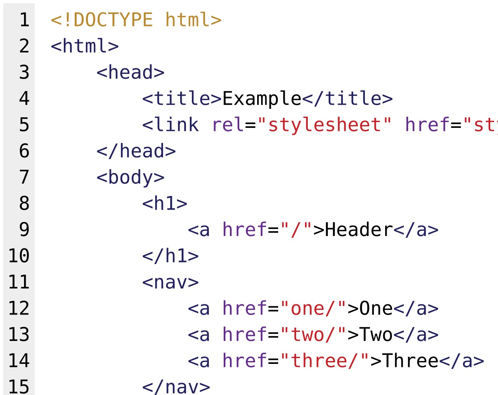

# id, name, CSS, and XPath

*Choose among WebDriver's core locator strategies by proving uniqueness, intent, and resistance to harmless DOM changes.*

> A selector can be syntactically valid, return an element, and still be wrong. The real test is whether it identifies the intended element uniquely and keeps doing so after an unrelated wrapper or sibling is added.

> **In real life**
>
> A postal address can name a building directly, describe a street pattern, or give turn-by-turn directions. An ID is the direct address; CSS describes visible address parts; XPath can express a route through the document. The longest route is not automatically the safest.

**locator strategy**: A locator strategy is the mechanism and value WebDriver uses to identify one or more elements in the current browsing context.

## Make the selector prove intent

WebDriver supports eight traditional strategies. `id` matches an element's ID, `name` matches its name attribute, CSS uses the browser's selector engine, and XPath evaluates an XPath expression. Prefer the smallest selector that encodes a stable product fact. An ID is strong only when the application keeps it unique and stable; a name may be shared by radio buttons; CSS can express attributes and relationships compactly; XPath is valuable for relationships or text patterns CSS cannot express.

Always measure match count during authoring. `findElement` returns the first match, so it can hide ambiguity. `findElements` exposes zero, one, or many matches without throwing for zero. Scope a search beneath a stable container when the same control legitimately appears in repeated regions.

> **Tip**
>
> Use DevTools to test the selector, then assert that its match count and target semantics are what the test expects.

> **Common mistake**
>
> Choosing XPath because it can encode the entire DOM path. Absolute paths couple the test to every wrapper and sibling index between the root and the control.


*HTML source code example — Wikimedia Commons, public domain. [Source](https://commons.wikimedia.org/wiki/File:HTML_source_code_example.svg)*
- **Identity** — The visible feature represents stable evidence used to identify the target.
- **Context** — Surrounding structure narrows candidates but should not become an absolute path.
- **Candidate** — A query can match something without proving it is the intended element.
- **Oracle** — A decisive observed property confirms identity before interaction.

**From candidate to reliable element**

1. **Name intent** — State the product fact the test needs.
2. **Choose evidence** — Prefer owned identity or meaning over layout.
3. **Measure matches** — Reject absence and unintended ambiguity.
4. **Verify semantics** — Check a decisive property before acting.

## Real Selenium examples

These fenced examples require Selenium. The playgrounds are deterministic standard-library models.

```python
from selenium.webdriver.common.by import By

panel = driver.find_element(By.CSS_SELECTOR, "[data-testid='profile-panel']")
save = panel.find_element(By.CSS_SELECTOR, "button[data-action='save']")
assert save.get_attribute("type") == "submit"
```

```java
WebElement panel = driver.findElement(By.cssSelector("[data-testid='profile-panel']"));
WebElement save = panel.findElement(By.cssSelector("button[data-action='save']"));
if (!"submit".equals(save.getAttribute("type"))) throw new AssertionError("wrong control");
```

*Run it — accept one locator contract (Python)*

```python
CANDIDATES = ["id=email","css=[data-testid='email']","xpath=/html/body/div[2]/form/input[1]"]
EXPECTED = "id=email"

def choose(candidates):
    accepted = [value for value in candidates if value == EXPECTED]
    if len(accepted) != 1:
        raise AssertionError(f"expected one accepted locator, got {len(accepted)}")
    return accepted[0]

selected = choose(CANDIDATES)
accepted = selected == EXPECTED
wrong_rejected = all(value != selected for value in CANDIDATES if value != EXPECTED)
assert accepted, "the intended locator contract must be selected"
assert wrong_rejected, "every accidental locator must be rejected"
print(f"SELECT {selected}")
print("RULE stable direct identity")
print("RESULT accepted=true wrong_rejected=true")
```

*Run it — accept one locator contract (Java)*

```java
import java.util.ArrayList;
import java.util.List;

public class Main {
    static final String EXPECTED = "id=email";
    static String choose(List<String> candidates) {
        List<String> accepted = new ArrayList<>();
        for (String value : candidates) if (value.equals(EXPECTED)) accepted.add(value);
        if (accepted.size() != 1) throw new AssertionError("expected one accepted locator, got " + accepted.size());
        return accepted.get(0);
    }
    public static void main(String[] args) {
        List<String> candidates = List.of("id=email", "css=[data-testid='email']", "xpath=/html/body/div[2]/form/input[1]");
        String selected = choose(candidates);
        boolean accepted = selected.equals(EXPECTED);
        boolean wrongRejected = candidates.stream().filter(value -> !value.equals(EXPECTED)).allMatch(value -> !value.equals(selected));
        if (!accepted) throw new AssertionError("the intended locator contract must be selected");
        if (!wrongRejected) throw new AssertionError("every accidental locator must be rejected");
        System.out.println("SELECT " + selected);
        System.out.println("RULE stable direct identity");
        System.out.println("RESULT accepted=true wrong_rejected=true");
    }
}
```

### Your first time: Your mission: defend one locator

- [ ] State the target — Write the user or product fact that identifies the intended element.
- [ ] List candidates — Record IDs, names, data attributes, semantics, CSS, and XPath options.
- [ ] Test uniqueness — Measure count in the correct document, frame, and component scope.
- [ ] Prove identity — Check one decisive property before the action.

You now have a locator contract and evidence, not merely a selector string.

- **The locator returns no element.**
  Check window and frame context, readiness, then whether the contract changed.
- **The locator returns the wrong element.**
  Measure all matches, add meaningful scope, and verify identity.
- **A harmless wrapper breaks the selector.**
  Remove positional and wrapper dependencies.
- **Another viewport changes the match.**
  Inspect responsive DOM or geometry instead of adding a blind fallback.

### Where to check

- **Elements panel** — live attributes, accessible name, ancestry, and match count.
- **Browsing context** — active window, frame, and component scope.
- **Application source** — owned IDs and data attributes versus generated output.
- **Failure evidence** — selector, count, candidates, viewport, and page state.

### Worked example: a Save button that became two

A settings page starts with one Save button. A new panel adds another, so the old first-match query silently clicks the wrong control. The repaired test scopes to the profile panel, locates its owned save action, verifies type=submit, and rejects zero or multiple candidates.

**Quiz.** What makes a locator robust?

- [ ] It is the longest selector
- [ ] It always returns the first match
- [x] It encodes stable intent and proves identity
- [ ] It combines CSS and XPath fallbacks

*Robustness survives irrelevant changes while rejecting absence, ambiguity, and the wrong target.*

- **Locator** — A strategy and value used to identify elements.
- **Scope** — A stable context that narrows legitimate candidates.
- **Match count** — Evidence distinguishing absent, unique, and ambiguous.
- **Oracle** — A decisive property checked before acting.

### Challenge

Mutate EXPECTED in both playgrounds to an accidental candidate. The original assertions must reject the change. Then duplicate the intended candidate and require the uniqueness oracle to reject ambiguity.

### Ask the community

> My locator [value] in [window/frame/component] matched [count]. I expected [identity], observed [attributes], and the DOM change was [change]. Which contract should I strengthen?

Remove private URLs, customer data, credentials, and session values.

- [Selenium — Locator strategies](https://www.selenium.dev/documentation/webdriver/elements/locators/)
- [Selenium — Locator practices](https://www.selenium.dev/documentation/test_practices/encouraged/locators/)
- [W3C WebDriver — Element retrieval](https://www.w3.org/TR/webdriver2/#element-retrieval)

🎬 [Learn Every CSS Selector In 20 Minutes](https://www.youtube.com/watch?v=l1mER1bV0N0) (20 min)

- Locator syntax and durability are different questions.
- Stable meaning matters more than CSS-versus-XPath preference.
- Match count exposes absence and ambiguity.
- Scope and a post-location oracle prevent wrong-element actions.
- Real Selenium stays fenced; playgrounds model the decision.


## Related notes

- [[Notes/selenium-webdriver/locators/locator-strategy|Locator strategy]]
- [[Notes/selenium-webdriver/locators/relative-locators|Relative locators]]
- [[Notes/selenium-webdriver/locators/robust-selectors|Robust selectors]]


---
_Source: `packages/curriculum/content/notes/selenium-webdriver/locators/id-name-css-xpath.mdx`_
