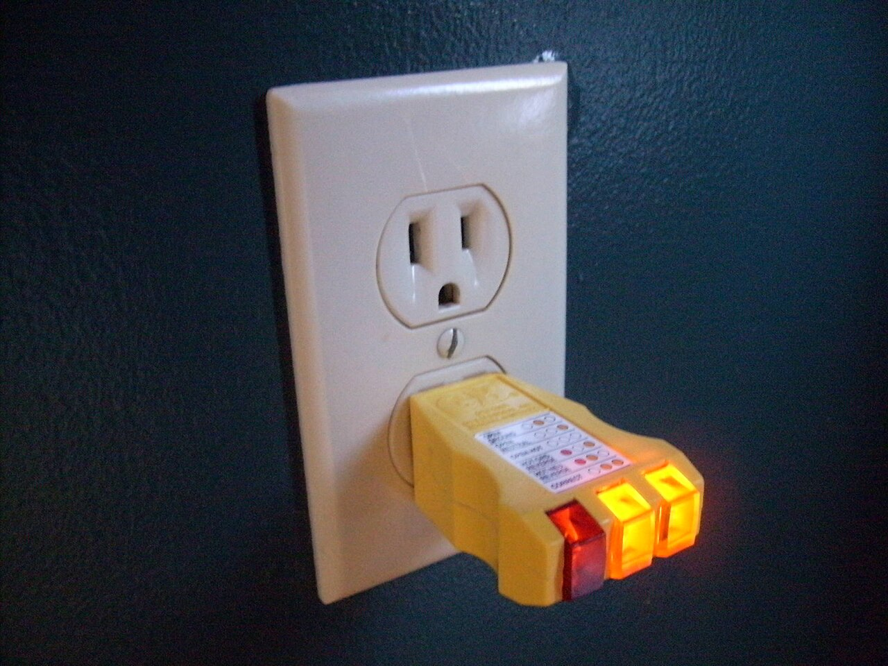

# Relative locators without spatial surprises

*Use Selenium 4 relative locators as geometry-based filters, then prove the returned element's identity before acting.*

> The input near this label sounds semantic, but Selenium calculates relative locators from rendered rectangles. Responsive layout can change the answer without changing the form's meaning.

> **In real life**
>
> A receptacle tester tells you something about the socket it is actually plugged into, not the nearest socket in your mental floor plan. Relative locators likewise need a final identity check: proximity narrows candidates but does not prove purpose.

**relative locator**: A relative locator finds elements of a base type according to their rendered position above, below, near, left of, or right of another element.

## Make the selector prove intent

Selenium 4 relative locators begin with a base locator and add spatial relations such as `above`, `below`, `toLeftOf`, `toRightOf`, or `near`. Selenium uses `getBoundingClientRect()` geometry. That makes the technique useful when a nearby anchor is stable and the layout relationship is part of the page design.

Geometry is viewport-dependent. Responsive rearrangement, zoom, fonts, banners, and duplicated controls can change which candidate is nearest. Prefer semantic association such as a label's for attribute when available. If you do use a relative locator, constrain the base type, anchor it to a stable locator, and verify an attribute, accessible name, or other identity before interaction.

> **Tip**
>
> Run relative-locator tests at every supported viewport where layout can change, and log the returned element's identifying attributes.

> **Common mistake**
>
> Using near as if it meant belongs to. It means geometric distance within Selenium's threshold, not a DOM or accessibility relationship.


*Receptacle tester demonstration — AndrewBuck, CC BY-SA 4.0. [Source](https://commons.wikimedia.org/wiki/File:Receptacle_tester_demonstration.jpg)*
- **Identity** — The visible feature represents stable evidence used to identify the target.
- **Context** — Surrounding structure narrows candidates but should not become an absolute path.
- **Candidate** — A query can match something without proving it is the intended element.
- **Oracle** — A decisive observed property confirms identity before interaction.

**From candidate to reliable element**

1. **Name intent** — State the product fact the test needs.
2. **Choose evidence** — Prefer owned identity or meaning over layout.
3. **Measure matches** — Reject absence and unintended ambiguity.
4. **Verify semantics** — Check a decisive property before acting.

## Real Selenium examples

These fenced examples require Selenium. The playgrounds are deterministic standard-library models.

```python
from selenium.webdriver.common.by import By

from selenium.webdriver.support.relative_locator import locate_with
password = driver.find_element(By.ID, "password")
email = driver.find_element(locate_with(By.TAG_NAME, "input").above(password))
assert email.get_attribute("name") == "email"
```

```java
WebElement password = driver.findElement(By.id("password"));
WebElement email = driver.findElement(with(By.tagName("input")).above(password));
if (!"email".equals(email.getAttribute("name"))) throw new AssertionError("wrong input");
```

*Run it — accept one locator contract (Python)*

```python
CANDIDATES = ["input:name=email","input:name=search","button:name=continue"]
EXPECTED = "input:name=email"

def choose(candidates):
    accepted = [value for value in candidates if value == EXPECTED]
    if len(accepted) != 1:
        raise AssertionError(f"expected one accepted locator, got {len(accepted)}")
    return accepted[0]

selected = choose(CANDIDATES)
accepted = selected == EXPECTED
wrong_rejected = all(value != selected for value in CANDIDATES if value != EXPECTED)
assert accepted, "the intended locator contract must be selected"
assert wrong_rejected, "every accidental locator must be rejected"
print(f"SELECT {selected}")
print("RULE above password and identity=email")
print("RESULT accepted=true wrong_rejected=true")
```

*Run it — accept one locator contract (Java)*

```java
import java.util.ArrayList;
import java.util.List;

public class Main {
    static final String EXPECTED = "input:name=email";
    static String choose(List<String> candidates) {
        List<String> accepted = new ArrayList<>();
        for (String value : candidates) if (value.equals(EXPECTED)) accepted.add(value);
        if (accepted.size() != 1) throw new AssertionError("expected one accepted locator, got " + accepted.size());
        return accepted.get(0);
    }
    public static void main(String[] args) {
        List<String> candidates = List.of("input:name=email", "input:name=search", "button:name=continue");
        String selected = choose(candidates);
        boolean accepted = selected.equals(EXPECTED);
        boolean wrongRejected = candidates.stream().filter(value -> !value.equals(EXPECTED)).allMatch(value -> !value.equals(selected));
        if (!accepted) throw new AssertionError("the intended locator contract must be selected");
        if (!wrongRejected) throw new AssertionError("every accidental locator must be rejected");
        System.out.println("SELECT " + selected);
        System.out.println("RULE above password and identity=email");
        System.out.println("RESULT accepted=true wrong_rejected=true");
    }
}
```

### Your first time: Your mission: defend one locator

- [ ] State the target — Write the user or product fact that identifies the intended element.
- [ ] List candidates — Record IDs, names, data attributes, semantics, CSS, and XPath options.
- [ ] Test uniqueness — Measure count in the correct document, frame, and component scope.
- [ ] Prove identity — Check one decisive property before the action.

You now have a locator contract and evidence, not merely a selector string.

- **The locator returns no element.**
  Check window and frame context, readiness, then whether the contract changed.
- **The locator returns the wrong element.**
  Measure all matches, add meaningful scope, and verify identity.
- **A harmless wrapper breaks the selector.**
  Remove positional and wrapper dependencies.
- **Another viewport changes the match.**
  Inspect responsive DOM or geometry instead of adding a blind fallback.

### Where to check

- **Elements panel** — live attributes, accessible name, ancestry, and match count.
- **Browsing context** — active window, frame, and component scope.
- **Application source** — owned IDs and data attributes versus generated output.
- **Failure evidence** — selector, count, candidates, viewport, and page state.

### Worked example: a Save button that became two

A settings page starts with one Save button. A new panel adds another, so the old first-match query silently clicks the wrong control. The repaired test scopes to the profile panel, locates its owned save action, verifies type=submit, and rejects zero or multiple candidates.

**Quiz.** What makes a locator robust?

- [ ] It is the longest selector
- [ ] It always returns the first match
- [x] It encodes stable intent and proves identity
- [ ] It combines CSS and XPath fallbacks

*Robustness survives irrelevant changes while rejecting absence, ambiguity, and the wrong target.*

- **Locator** — A strategy and value used to identify elements.
- **Scope** — A stable context that narrows legitimate candidates.
- **Match count** — Evidence distinguishing absent, unique, and ambiguous.
- **Oracle** — A decisive property checked before acting.

### Challenge

Mutate EXPECTED in both playgrounds to an accidental candidate. The original assertions must reject the change. Then duplicate the intended candidate and require the uniqueness oracle to reject ambiguity.

### Ask the community

> My locator [value] in [window/frame/component] matched [count]. I expected [identity], observed [attributes], and the DOM change was [change]. Which contract should I strengthen?

Remove private URLs, customer data, credentials, and session values.

- [Selenium — Relative locators](https://www.selenium.dev/documentation/webdriver/elements/locators/#relative-locators)
- [Selenium Java API — RelativeLocator](https://www.selenium.dev/selenium/docs/api/java/org/openqa/selenium/support/locators/RelativeLocator.html)
- [Selenium Python API — relative locator](https://www.selenium.dev/selenium/docs/api/py/selenium_webdriver_support/selenium.webdriver.support.relative_locator.html)

🎬 [14. Mastering getByTestId() Locator in Playwright | Custom Attribute data-testId |](https://www.youtube.com/watch?v=hAEFjHaOnGI) (8 min)

- Locator syntax and durability are different questions.
- Stable meaning matters more than CSS-versus-XPath preference.
- Match count exposes absence and ambiguity.
- Scope and a post-location oracle prevent wrong-element actions.
- Real Selenium stays fenced; playgrounds model the decision.


## Related notes

- [[Notes/selenium-webdriver/locators/id-name-css-xpath|id / name / css / xpath]]
- [[Notes/selenium-webdriver/locators/locator-strategy|Locator strategy]]
- [[Notes/selenium-webdriver/locators/robust-selectors|Robust selectors]]


---
_Source: `packages/curriculum/content/notes/selenium-webdriver/locators/relative-locators.mdx`_
