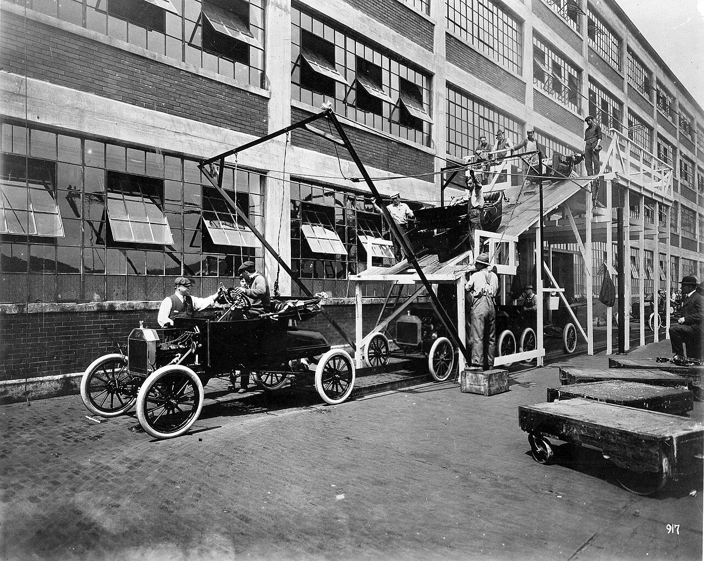

# Your first Selenium script in Java

*Put Selenium in the active Maven project, prove the JDK Maven actually uses, drive Selenium's web form, assert an outcome, and guarantee browser cleanup with try/finally.*

> A browser opening is not a passing test. Your first useful Selenium script must prove four things:
> Maven can see Selenium, a browser session starts, an interaction produces the expected result, and
> the session closes even when the assertion fails. Miss any one and you have a demo, not a test.

> **In real life**
>
> Think of an assembly line. The JDK powers the factory, Maven supplies the specified parts, Selenium
> defines the work instructions, and Chrome is the car moving through the stations. A car entering the
> line only proves startup. The inspection station is the assertion that proves the result; `quit()` in
> `finally` closes the line even when inspection rejects the car.

**WebDriver session**: A Selenium WebDriver session is the stateful browser-control relationship created when a driver such as ChromeDriver starts. Commands such as get, findElement, and click belong to that session until quit ends it and releases browser and driver processes.

## Make the build boring before opening a browser

Run `java -version` and `mvn -version` in the same terminal. The second command reports the Java
runtime Maven actually uses; it can differ from the JDK selected by an IDE. Then put Selenium under
`dependencies` in the `pom.xml` of the project you will run, not in a nearby tutorial folder:

```xml
<properties>
  <maven.compiler.release>17</maven.compiler.release>
  <selenium.version>4.46.0</selenium.version>
</properties>

<dependencies>
  <dependency>
    <groupId>org.seleniumhq.selenium</groupId>
    <artifactId>selenium-java</artifactId>
    <version>${selenium.version}</version>
  </dependency>
</dependencies>
```

`mvn dependency:tree` should then list `org.seleniumhq.selenium:selenium-java`. Modern Selenium uses
Selenium Manager when a suitable driver is not otherwise supplied, but that cannot repair a missing
Java dependency or a build launched from the wrong project.

> **Tip**
>
> Diagnose from the inside out: first `mvn -version`, then `mvn dependency:tree`, then compile. Only
> after imports resolve should you investigate Chrome or driver startup. This separates build failures
> from browser-control failures.

> **Common mistake**
>
> Treating "Chrome opened" as success. A script that clicks but asserts nothing cannot detect a wrong
> title or message, and a script that calls `quit()` only on the happy path leaks processes as soon as
> an exception interrupts it.


*Ford assembly line, 1913 — Ford Motor Company / Library of Congress, public domain. [Source](https://commons.wikimedia.org/wiki/File:AssemblyLine.jpg)*
- **First car = session startup** — The car enters the line before later stations can act on it. Likewise, new ChromeDriver must create a session before navigation or assertions can run.
- **Raised line = ordered test steps** — Each station receives the work produced by the previous station. Imports, startup, navigation, interaction, and assertion form the same ordered pipeline.
- **Workers = Maven dependencies** — Every station needs the right worker and tool. The active Maven project must resolve selenium-java before org.openqa.selenium imports can compile.
- **End of line = quit in finally** — A run needs a controlled exit even when an earlier station reports a defect. A finally block ends the browser session after success or failure.

**From Maven project to a closed browser session**

1. **Resolve the active project** — Maven reads this directory's pom.xml and builds its dependency graph.
2. **Compile Selenium imports** — WebDriver, By, WebElement, and ChromeDriver must exist on the compile classpath.
3. **Start and use a session** — ChromeDriver creates one session; get, findElement, sendKeys, and click use it.
4. **Assert observable state** — Compare the actual title and submitted message with explicit expected values.
5. **Quit from finally** — End the session and release processes regardless of the assertion outcome.

## The real Selenium path

Prerequisites: JDK 17 or newer, Maven, Chrome, the Selenium dependency above, and network access to
the official test page (and possibly for first-run driver management). This is real Selenium code,
so it belongs in a normal fenced block rather than the dependency-free playground.

```java
import org.openqa.selenium.By;
import org.openqa.selenium.WebDriver;
import org.openqa.selenium.WebElement;
import org.openqa.selenium.chrome.ChromeDriver;

public class FirstScript {
    public static void main(String[] args) {
        WebDriver driver = new ChromeDriver();
        try {
            driver.get("https://www.selenium.dev/selenium/web/web-form.html");
            if (!"Web form".equals(driver.getTitle())) {
                throw new AssertionError("Unexpected title: " + driver.getTitle());
            }

            WebElement textBox = driver.findElement(By.name("my-text"));
            textBox.sendKeys("Selenium");
            driver.findElement(By.cssSelector("button")).click();

            String message = driver.findElement(By.id("message")).getText();
            if (!"Received!".equals(message)) {
                throw new AssertionError("Unexpected message: " + message);
            }
        } finally {
            driver.quit();
        }
    }
}
```

The playgrounds below are **models**, not Selenium. They use only each language's standard library
so the curriculum runner can deterministically prove the same lifecycle contract without Chrome,
Maven, pip, a driver, or the network.

*Model the session lifecycle — Python*

```python
events = []
session = "session-7"
url = "https://www.selenium.dev/selenium/web/web-form.html"
expected_title = "Web form"
actual_title = "Web form"
assertion_passed = False
teardown_recorded = False

events.append(f"START session={session}")
try:
    events.append(f"NAVIGATE url={url}")
    assertion_passed = actual_title == expected_title
    if assertion_passed:
        events.append(f"ASSERT title expected={expected_title} actual={actual_title} PASS")
finally:
    events.append(f"QUIT session={session}")
    teardown_recorded = True

assert assertion_passed, "title assertion failed"
assert any(event.startswith("ASSERT ") for event in events), "assertion event missing"
assert teardown_recorded and events[-1].startswith("QUIT "), "teardown missing"

for event in events:
    print(event)
print(f"RESULT assertion={str(assertion_passed).lower()} teardown={str(teardown_recorded).lower()}")
```

*Model the same session lifecycle — Java*

```java
import java.util.ArrayList;
import java.util.List;

public class Main {
    public static void main(String[] args) {
        List<String> events = new ArrayList<>();
        String session = "session-7";
        String url = "https://www.selenium.dev/selenium/web/web-form.html";
        String expectedTitle = "Web form";
        String actualTitle = "Web form";
        boolean assertionPassed = false;
        boolean teardownRecorded = false;

        events.add("START session=" + session);
        try {
            events.add("NAVIGATE url=" + url);
            assertionPassed = actualTitle.equals(expectedTitle);
            if (assertionPassed) {
                events.add("ASSERT title expected=" + expectedTitle + " actual=" + actualTitle + " PASS");
            }
        } finally {
            events.add("QUIT session=" + session);
            teardownRecorded = true;
        }

        if (!assertionPassed) throw new AssertionError("title assertion failed");
        if (events.stream().noneMatch(e -> e.startsWith("ASSERT "))) throw new AssertionError("assertion event missing");
        if (!teardownRecorded || !events.get(events.size() - 1).startsWith("QUIT ")) throw new AssertionError("teardown missing");

        events.forEach(System.out::println);
        System.out.println("RESULT assertion=" + assertionPassed + " teardown=" + teardownRecorded);
    }
}
```

### Your first time: Run the real script once, with evidence

- [ ] Verify both Java selectors — Run java -version and mvn -version; confirm Maven reports the JDK you intend.
- [ ] Prove dependency placement — From the directory containing the active pom.xml, run mvn dependency:tree and find selenium-java.
- [ ] Compile before browser diagnosis — Run the project compile goal. Resolve classpath and package errors before investigating Chrome.
- [ ] Run and watch the assertion — The script should enter text, submit, and verify both title and Received! message.
- [ ] Force a failure — Temporarily change the expected message. Confirm the assertion fails and Chrome still closes via finally.

- **package org.openqa.selenium does not exist**
  Maven is compiling without selenium-java. Run mvn dependency:tree from the module that owns this source file; move the dependency into that module's active pom.xml and reimport Maven in the IDE.
- **The IDE compiles but Maven fails, or the reverse**
  Compare the IDE project SDK with the Java home printed by mvn -version. Fix the JDK selection, then rebuild from the command line to remove IDE cache ambiguity.
- **Chrome opens and remains after a failure**
  The quit call is on the happy path or missing. Create the driver once, put all session work in try, and call driver.quit() in finally.
- **The script finishes green even when the page is wrong**
  Actions are not assertions. Capture title or message text and compare it to an explicit expected value that throws on mismatch.

### Where to check

- **`mvn -version`** — the JDK Maven truly runs with.
- **`mvn dependency:tree`** — whether Selenium is in this module's effective dependency graph.
- **The first compiler error** — import failures are classpath evidence, not driver evidence.
- **Task Manager or Activity Monitor** — leaked Chrome or driver processes after an intentional failure.
- **The assertion message** — expected and actual values should explain the behavioural failure.

### Worked example: The dependency was correct — in the wrong project

Mina adds `selenium-java` to a parent tutorial's `pom.xml`, then runs a class from a sibling Maven
module. Her IDE remembers cached imports, but `mvn compile` reports that `org.openqa.selenium` does
not exist. From the source module she runs `mvn dependency:tree`; Selenium is absent. She moves the
dependency into that module's active `pom.xml`, reloads Maven, and compilation succeeds. Next she
changes the expected title to force failure: the assertion reports expected versus actual and Chrome
closes. The two observations prove both the oracle and teardown, not merely that a window appeared.

**Quiz.** A Java Selenium script opens Chrome, submits a form, and calls quit() on the next line. What two changes turn it into a trustworthy first test?

- [ ] Add a longer sleep and print the page source
- [x] Assert an observable result and place quit() in a finally block
- [ ] Replace Maven with manual JAR downloads
- [ ] Use more locators before closing the browser

*An assertion makes incorrect behaviour fail, while finally guarantees cleanup when any earlier operation or assertion throws. A sleep, more actions, or manual dependency handling supplies neither property.*

- **What does mvn -version prove?** — Which Java runtime Maven actually uses, which may differ from the IDE's selected JDK.
- **What does mvn dependency:tree prove?** — Whether selenium-java is in the active Maven module's resolved classpath.
- **Why is an opened browser insufficient?** — It proves session startup, not that the interaction produced the expected state.
- **Why quit in finally?** — Because assertions and browser commands can throw; finally still ends the session and releases processes.
- **Real example versus playground** — The fenced example uses Selenium and Chrome; the playground is a standard-library lifecycle model for deterministic execution.

### Challenge

Run the real example, then make the expected message deliberately wrong. Capture the failing
expected/actual evidence and confirm no Chrome or driver process remains. Restore the expectation,
run again, and explain which observation proves assertion quality and which proves teardown quality.

### Ask the community

> My Java first script fails at [compile / session start / assertion / teardown]. Here are mvn -version, the selenium-java line from dependency:tree, the first error, and whether Chrome remains after failure. Which boundary rejected it?

Share boundary evidence, not only a screenshot of the browser. It lets others distinguish a Maven
classpath problem from driver startup, page behaviour, or lifecycle cleanup.

- [Selenium — Install a Selenium library](https://www.selenium.dev/documentation/webdriver/getting_started/install_library/)
- [Selenium — Write your first Selenium script](https://www.selenium.dev/documentation/webdriver/getting_started/first_script/)
- [Selenium Java API — WebDriver](https://www.selenium.dev/selenium/docs/api/java/org/openqa/selenium/WebDriver.html)
- [Selenium — Unable to locate driver troubleshooting](https://www.selenium.dev/documentation/webdriver/troubleshooting/errors/driver_location/)

This recording is useful for its Maven dependency and first-class walkthrough, but its manual driver
setup predates built-in Selenium Manager. Use the modern `new ChromeDriver()` flow shown above.

🎬 [Write your first Selenium WebDriver code using Maven - POM Dependency](https://www.youtube.com/watch?v=YyB2NGV69xE) (13 min)

- Java setup begins with the active Maven module and the JDK Maven reports, not with the browser.
- ChromeDriver starts a WebDriver session; commands use that stateful session until quit ends it.
- An interaction becomes a test only when an explicit expected value is compared with actual browser state.
- driver.quit() belongs in finally so failures cannot leak browser and driver processes.
- The real fenced example requires Selenium and Chrome; the dual playgrounds model its lifecycle deterministically with standard libraries only.


## Related notes

- [[Notes/automation/frameworks/selenium-java|Selenium with Java]]
- [[Notes/selenium-webdriver/setup-and-architecture/drivers-and-selenium-manager|Drivers & Selenium Manager]]
- [[Notes/selenium-webdriver/setup-and-architecture/first-script-python|First script (Python)]]


---
_Source: `packages/curriculum/content/notes/selenium-webdriver/setup-and-architecture/first-script-java.mdx`_
