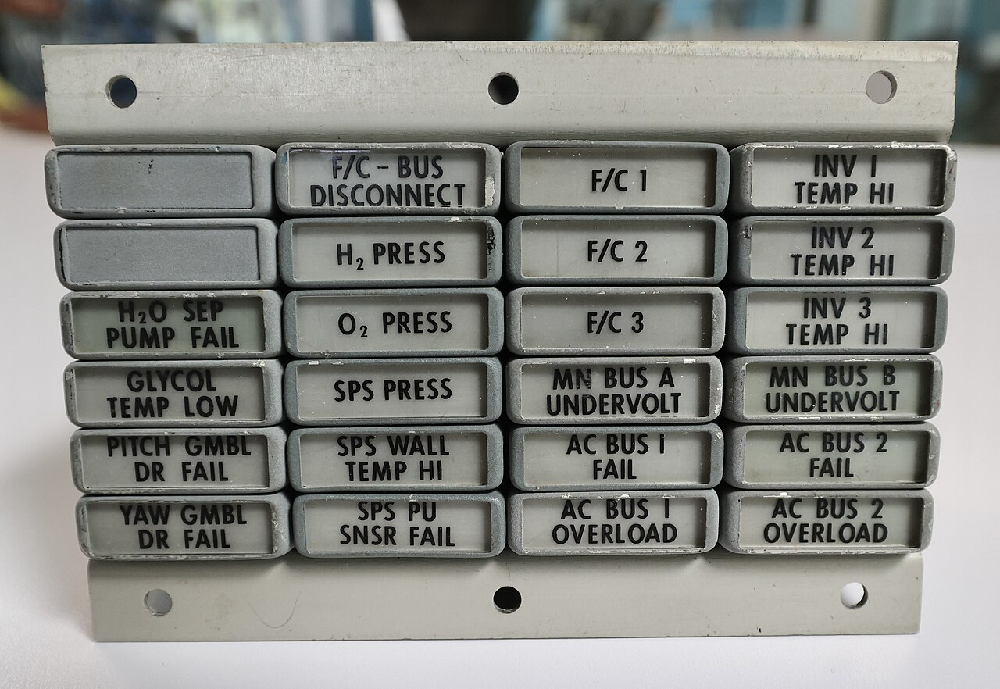

# Implicit versus explicit waits

*Separate WebDriver's session-wide element lookup timeout from condition-specific explicit waits, and avoid unpredictable combinations.*

> A ten-second timeout does not mean Selenium understands what ready means. An implicit wait only changes element lookup; an explicit wait can name the exact state required for the next action.

> **In real life**
>
> An annunciator panel has separate named warnings rather than one generic delay light. Explicit waits work the same way: visible, clickable, text present, or gone are different conditions. A global implicit wait is closer to giving every lookup the same grace period.

**explicit wait**: An explicit wait repeatedly evaluates a named condition until it succeeds or a maximum timeout expires.

## Wait for evidence, not elapsed time

An implicit wait is a session-wide timeout used by element location commands. Its default is zero, and a successful lookup returns as soon as an element is found. It does not wait for arbitrary business state, enabledness, text, or network completion. An explicit wait runs a client-side polling loop for a particular condition and throws a timeout if the condition never succeeds.

Selenium warns not to mix implicit and explicit waits because nested lookup delays can produce unpredictable total times. Prefer explicit waits when the next command depends on a named state. Keep the condition close to the action and include the locator, condition, timeout, and last observed state in failure evidence.

> **Tip**
>
> Choose a condition that proves readiness for the next action, not merely presence in the DOM.

> **Common mistake**
>
> Setting a long implicit wait and assuming every later click, text read, and disappearance check is synchronized.


*Apollo Command Module Master Caution and Event Annunciator Panel — Steve Jurvetson, CC BY 2.0. [Source](https://commons.wikimedia.org/wiki/File:Apollo_Command_Module_Master_Caution_%26_Event_Annunciator_Panel_%E2%80%94_with_the_Infamous_%22Main_Bus_B_Undervolt%22_Alarm_of_Apollo_13_(53839889630).jpg)*
- **Initial state** — The first visible state is evidence, not yet success.
- **Repeated observation** — Polling samples state without assuming when it changes.
- **Decisive condition** — The named target state releases the next action.
- **Deadline** — A bounded wait rejects missing readiness with evidence.

**A condition-based wait**

1. **Trigger** — Perform the action that starts asynchronous work.
2. **Observe** — Evaluate one named condition.
3. **Poll** — Retry only while the deadline and transient policy allow.
4. **Return or reject** — Continue on decisive state or fail with the last observation.

## Real Selenium examples

These fenced samples require Selenium; the playground pair is a dependency-free timing model.

~~~python
driver.implicitly_wait(0)
wait = WebDriverWait(driver, 10)
button = wait.until(EC.element_to_be_clickable((By.ID, "submit")))
~~~

~~~java
driver.manage().timeouts().implicitlyWait(Duration.ZERO);
WebElement button = new WebDriverWait(driver, Duration.ofSeconds(10))
    .until(ExpectedConditions.elementToBeClickable(By.id("submit")));
~~~

*Run it — wait for one decisive state (Python)*

```python
EXPECTED = "clickable"
OBSERVATIONS = [[0,"missing"],[2,"present"],[4,"clickable"]]

def wait_until(observations, expected, deadline):
    for timestamp, state in observations:
        if timestamp > deadline:
            break
        if state == expected:
            return timestamp, state
    raise AssertionError(f"timeout deadline={deadline} expected={expected}")

ready = wait_until(OBSERVATIONS, EXPECTED, 5)
accepted = ready == (4, EXPECTED)
assert accepted, "the wait must return the first decisive observation"

try:
    wait_until(OBSERVATIONS, EXPECTED, 3)
    raise AssertionError("the short deadline must reject readiness")
except AssertionError as error:
    timeout_rejected = str(error).startswith("timeout deadline=")
assert timeout_rejected, "timeout evidence must be preserved"

print(f"READY t={ready[0]} state={ready[1]}")
print("REJECT timeout deadline=3")
print("RESULT ready=true timeout_rejected=true")
```

*Run it — wait for one decisive state (Java)*

```java
import java.util.List;

public class Main {
    static final String EXPECTED = "clickable";
    record Observation(int time, String state) {}
    static Observation waitUntil(List<Observation> observations, String expected, int deadline) {
        for (Observation item : observations) {
            if (item.time() > deadline) break;
            if (item.state().equals(expected)) return item;
        }
        throw new AssertionError("timeout deadline=" + deadline + " expected=" + expected);
    }
    public static void main(String[] args) {
        List<Observation> observations = List.of(new Observation(0, "missing"), new Observation(2, "present"), new Observation(4, "clickable"));
        Observation ready = waitUntil(observations, EXPECTED, 5);
        boolean accepted = ready.equals(new Observation(4, EXPECTED));
        if (!accepted) throw new AssertionError("the wait must return the first decisive observation");
        boolean timeoutRejected = false;
        try { waitUntil(observations, EXPECTED, 3); }
        catch (AssertionError error) { timeoutRejected = error.getMessage().startsWith("timeout deadline="); }
        if (!timeoutRejected) throw new AssertionError("timeout evidence must be preserved");
        System.out.println("READY t=" + ready.time() + " state=" + ready.state());
        System.out.println("REJECT timeout deadline=3");
        System.out.println("RESULT ready=true timeout_rejected=true");
    }
}
```

### Your first time: Your mission: replace one sleep

- [ ] Name the transition — Write the state before and the decisive state after the async work.
- [ ] Choose an observation — Use visible UI or protocol evidence required by the next action.
- [ ] Bound the wait — Set timeout and polling cadence appropriate to the system.
- [ ] Capture failure — Preserve last state, condition, locator, elapsed time, and relevant logs.

You now have a synchronization oracle rather than a delay guess.

- **The wait times out although the page looks ready.**
  Compare the named condition with the actual next-action requirement and last observed state.
- **The wait is much longer than configured.**
  Check for mixed implicit and explicit waits or slow work inside the condition.
- **A stale element repeats until timeout.**
  Relocate by a stable locator after rerender instead of polling an old reference.
- **CI fails but local runs pass.**
  Capture timings, network, console, and the exact transition instead of enlarging a sleep.

### Where to check

- **Wait diagnostics** — condition, locator, timeout, poll count, and last observed value.
- **Browser console and network** — async errors, rejected requests, and completion timing.
- **DOM snapshots** — node replacement, visibility, enabledness, and text changes.
- **Timeout configuration** — implicit, explicit, script, and page-load timeouts kept distinct.

### Worked example: the spinner that outlived the sleep

A test clicks Search, sleeps two seconds, and reads an empty results panel. On a busy runner the response takes three seconds. The repair waits for the spinner to disappear and results to become visible, returns early on fast runs, and reports the last state plus network failure when readiness never occurs.

**Quiz.** What should release an explicit wait?

- [ ] The average historical delay
- [x] A named state required by the next action
- [ ] The longest sleep the suite can tolerate
- [ ] Any ignored exception

*A wait is useful when its condition proves the next action can proceed; elapsed time alone does not.*

- **Implicit wait** — A session-wide timeout applied to element location.
- **Explicit wait** — A bounded polling loop for one named condition.
- **Polling interval** — How often a wait reevaluates its condition.
- **Last observation** — The state or exception that makes a timeout diagnosable.

### Challenge

Mutate EXPECTED in both playgrounds. The original state observations must make each program exit nonzero. Then add an observation exactly at the deadline and prove the boundary policy is inclusive.

### Ask the community

> After [trigger], I waited [timeout] for [condition] at [locator]. The last state was [state], poll count was [count], and network/console evidence was [summary]. Which boundary should I inspect next?

Remove credentials, private URLs, cookies, and customer data.

- [Selenium — Waiting strategies](https://www.selenium.dev/documentation/webdriver/waits/)
- [Selenium Java API — FluentWait](https://www.selenium.dev/selenium/docs/api/java/org/openqa/selenium/support/ui/FluentWait.html)
- [Selenium Python API — waits](https://www.selenium.dev/selenium/docs/api/py/selenium_webdriver_support/selenium.webdriver.support.wait.html)

🎬 [Selenium Class 50: How To Use Explicit Wait in Selenium 4](https://www.youtube.com/watch?v=07NCR1ml0O4) (7 min)

- Readiness is a condition, not a duration.
- Implicit waits affect lookup; explicit waits can name richer state.
- Do not mix implicit and explicit waits.
- Bounded polling should preserve the last observation and cause.
- Real Selenium stays fenced; playgrounds model timing deterministically.


## Related notes

- [[Notes/selenium-webdriver/waits-and-sync/fluent-waits|Fluent waits]]
- [[Notes/selenium-webdriver/waits-and-sync/avoiding-sleeps|Avoiding sleeps]]
- [[Notes/selenium-webdriver/waits-and-sync/handling-async|Handling async]]


---
_Source: `packages/curriculum/content/notes/selenium-webdriver/waits-and-sync/implicit-vs-explicit.mdx`_
