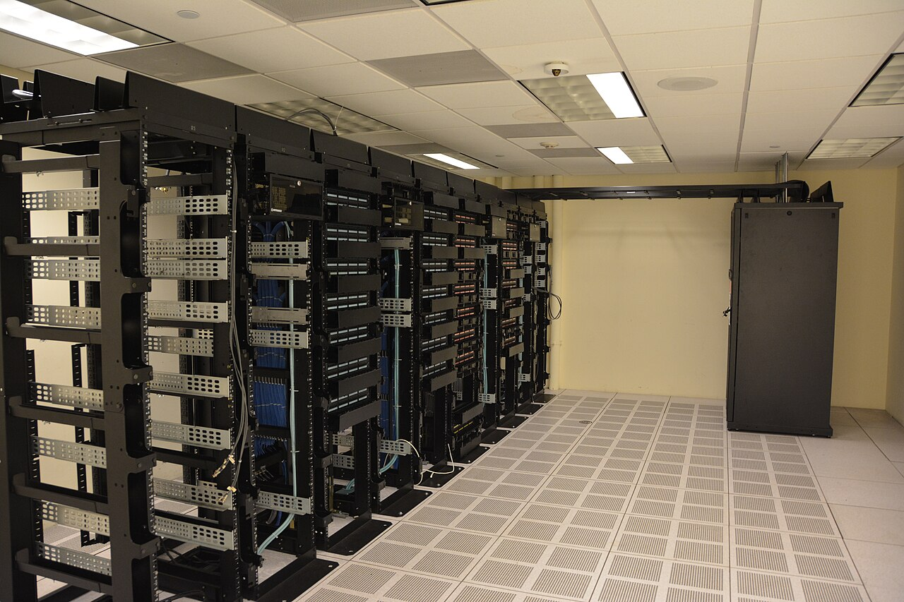

# Where your app's data lives

*The app on your screen is a front end talking to a server, which reads and writes an actual database - usually on a machine you'll never see. The UI is a temporary view; the database is where the truth actually lives.*

> Close every tab. Restart your phone. Uninstall and reinstall the app. Your bank balance, your order
> history, your saved cart - all of it is still there the moment you log back in. None of that data ever
> lived on your device or in your browser tab at all. It was never "in the app" in the way it felt like
> it was - it lived somewhere else the whole time, and the app was just a window that showed it to you.

> **In real life**
>
> A restaurant's dining room versus its kitchen and walk-in fridge. You sit at your table, order, and a
> finished plate arrives - that's the dining room, the part you see and interact with directly. But the
> plate didn't originate at your table. It was assembled in a back room you never enter, from ingredients
> kept in a fridge you'll never open, following a process you have no visibility into. If the kitchen ran
> out of an ingredient, your dining room experience changes (no more of that dish) even though nothing
> about the dining room itself changed at all. An app's UI is the dining room. Its database is the
> kitchen and the fridge - the part that actually holds what's real, out of sight, behind the scenes.

**Where your app's data lives**: An app's data doesn't live in the app's UI - the UI (a web page, a phone app) is a FRONT END that displays data and sends user actions to a BACKEND server over the network. That server is what actually reads from and writes to a DATABASE, which typically lives on a completely different physical machine (often in a cloud provider's data center) than the device the UI is running on. This separation is why data survives things that would erase anything held only in the UI's own memory - closing a tab, restarting a phone, reinstalling an app - because none of those actions touch the server or its database at all. It's also why the UI can show something that ISN'T actually true: the UI only knows what it was last told, while the database is the actual, current source of truth.

## The UI is a window, not the vault

- **Three tiers, roughly.** A front end (what you see and click), a backend server (the logic that
  decides what's allowed and talks to storage), and a database (where the actual data persists). Your
  device only ever runs the first one.
- **The database usually lives on hardware you'll never touch.** A server in a data center, most often
  now a cloud provider's infrastructure - physically distant from wherever the app happens to be
  running, and completely unaffected by anything that happens to that specific device.
- **The UI is a rendering of what it was last told, not a live mirror of the database.** Between the
  moment the UI loaded some data and right now, the database might have changed - another user, a
  background job, a different device the same user is using. The UI doesn't know until it asks again.
- **This is exactly why persistence works the way it does.** Closing a tab or restarting a device only
  destroys what that device was holding. The database, being on a completely separate machine, was
  never affected at all - which is the entire reason your data is still there when you come back.

> **Tip**
>
> When you're unsure whether something you're looking at reflects the database's CURRENT state or just
> what the UI loaded a while ago, force a fresh read: reload the page, pull-to-refresh, or re-open the
> screen from scratch. If the value changes, you were looking at stale UI state. If it doesn't, you've
> got real evidence it currently matches the database - though even that's only true until the next
> change happens somewhere else.

> **Common mistake**
>
> Assuming that because an app "feels instant," the database write must have already happened before the
> UI updated. Plenty of well-built apps update the UI OPTIMISTICALLY - showing the expected result
> immediately, before the server has even confirmed the write succeeded - specifically to feel fast. That
> UX choice is often good design, but it means the UI briefly (or sometimes not so briefly, if the write
> actually fails) shows something the database doesn't yet, or won't ever, actually have.


*Datacenter Server Racks — Carl Lender, Wikimedia Commons, CC BY 2.0. [Source](https://commons.wikimedia.org/wiki/File:Datacenter_Server_Racks_(22370909788).jpg)*
- **One server rack, packed with equipment** — This is roughly where your data actually, physically lives - not in your phone, not in your browser tab, but on disks inside a machine like this one, almost always somewhere you'll never see in person.
- **The row of racks, receding into the distance** — A large app's data usually isn't on just one machine - many servers, often working together, share the real load. 'The database' is frequently more than a single box.
- **The raised, perforated floor** — Infrastructure most users - and most testers - never think about, built specifically to keep this room, and the data inside it, running continuously. The unglamorous part that makes persistence actually possible.
- **A separate, closed cabinet at the far end of the room** — A distinct piece of infrastructure from the open racks nearby - a reminder that 'where your app's data lives' can be spread across several different systems (a primary database, backups, caches), not one single obvious box.

**One tap, and everywhere that data actually travels - press Play**

1. **A user taps 'Add to cart' in the app on their phone** — At this instant, the tap has only happened locally - nothing has left the device yet.
2. **The app (the front end) sends that action over the network to a backend server** — The phone itself never stores the real cart - it's asking a completely different machine to handle it.
3. **The backend server writes a new row to the database** — This is the step that actually creates a durable, persistent record - on a disk, in a data center, far from the phone.
4. **The server sends back a confirmation, and the app updates the screen** — Only NOW does the UI show the updated cart - ideally after, not before, the database write actually succeeded.
5. **Verdict** — The phone was involved in exactly two steps: sending the tap, and displaying the result. Everything that actually matters for persistence happened on a machine the user never sees.

Every screen you've ever looked at in any app was showing you a report FROM somewhere else - never the
data's actual home.

*Run it - the UI's own memory vs. the database, across a 'refresh' (Python)*

```python
class AppUI:
    """What's on screen right now - lives only in this process's memory."""
    def __init__(self):
        self.visible_cart_count = 0

    def add_to_cart_on_screen(self):
        self.visible_cart_count += 1

    def refresh_page(self):
        self.visible_cart_count = 0  # the UI's own memory is simply gone

class Database:
    """The actual source of truth - conceptually, on a server's disk, far from the UI."""
    def __init__(self):
        self._cart_rows = []

    def add_to_cart(self, item):
        self._cart_rows.append(item)

    def cart_for_display(self):
        return list(self._cart_rows)

ui = AppUI()
db = Database()

ui.add_to_cart_on_screen()
db.add_to_cart("keyboard")
ui.add_to_cart_on_screen()
db.add_to_cart("mouse")

print("Before refresh - UI's own count:", ui.visible_cart_count)
print("Before refresh - database actually has:", db.cart_for_display())

print()
print("User refreshes the page (only the UI's own memory resets - the database is untouched)...")
ui.refresh_page()

print()
print("After refresh - UI's own count:", ui.visible_cart_count)
print("After refresh - database still has:", db.cart_for_display())
print("The UI has to RE-READ from the database to redraw the real cart -")
print("the database, not the UI, was the truth the entire time.")
```

Same UI-vs-database contrast in Java:

*Run it - the UI's own memory vs. the database, across a 'refresh' (Java)*

```java
import java.util.*;

public class Main {
    static class AppUI {
        int visibleCartCount = 0;

        void addToCartOnScreen() {
            visibleCartCount++;
        }

        void refreshPage() {
            visibleCartCount = 0;  // the UI's own memory is simply gone
        }
    }

    static class Database {
        List<String> cartRows = new ArrayList<>();

        void addToCart(String item) {
            cartRows.add(item);
        }

        List<String> cartForDisplay() {
            return new ArrayList<>(cartRows);
        }
    }

    public static void main(String[] args) {
        AppUI ui = new AppUI();
        Database db = new Database();

        ui.addToCartOnScreen();
        db.addToCart("keyboard");
        ui.addToCartOnScreen();
        db.addToCart("mouse");

        System.out.println("Before refresh - UI's own count: " + ui.visibleCartCount);
        System.out.println("Before refresh - database actually has: " + db.cartForDisplay());

        System.out.println();
        System.out.println("User refreshes the page (only the UI's own memory resets - the database is untouched)...");
        ui.refreshPage();

        System.out.println();
        System.out.println("After refresh - UI's own count: " + ui.visibleCartCount);
        System.out.println("After refresh - database still has: " + db.cartForDisplay());
        System.out.println("The UI has to RE-READ from the database to redraw the real cart -");
        System.out.println("the database, not the UI, was the truth the entire time.");
    }
}
```

### Your first time: Your mission: watch data leave the device

- [ ] Pick an app you can test and open its network tab (browser devtools, or a proxy tool for a mobile app) — You want to actually see requests leaving the device, not just guess that they do.
- [ ] Perform one action that should persist (add to cart, save a setting, post something) — Watch for the specific network request that fires as a result.
- [ ] Find that request's destination - the server it's actually talking to — Note the domain/host. That's roughly where 'the app' stops and 'someone else's machine' begins.
- [ ] Now put the device in airplane mode (or block that request) and repeat the same action — See what the UI does when it CAN'T reach that server - does it fail honestly, or pretend to succeed?

You've now directly observed the boundary this note describes - the exact moment an action stops being
local to your device and becomes a request to wherever the real data actually lives.

- **An action appears to succeed instantly even with the network disconnected or the backend clearly unreachable.**
  This points at an optimistic UI update with no proper failure handling - the screen is showing an assumed success that the database never actually recorded. Worth checking whether the app eventually reconciles (retries, shows an error) once connectivity returns, or just silently loses the action.
- **Two different devices logged into the same account show different data for what should be identical, shared information.**
  Since both devices are only ever windows onto the same remote database, a real difference between them usually means at least one is showing stale, previously-loaded UI state rather than a fresh read. Force a refresh on both and see if they converge - if they don't, that's a more serious sync/backend issue worth escalating.

### Where to check

- **The network tab, for the specific request behind any action that should persist** — confirms whether the device actually talked to a server at all, and what that server said back.
- **Behavior with the network disconnected** — a fast, direct way to reveal whether the UI is honestly reporting failure or just assuming success.
- **[[sql-and-databases-for-testers/verifying-the-app-against-the-db/ui-action-to-db-check]]** — the next chapter's systematic version of this exact check: confirming a UI action actually reached the database.
- **[[sql-and-databases-for-testers/tools-and-habits/connecting-safely]]** — once you're ready to look at a real database directly instead of inferring its state from the UI, how to connect to one without causing damage.

### Worked example: an 'instant' save that wasn't actually reaching the database at all

1. A tester notices that toggling a setting in an app updates the on-screen switch immediately, with no
   visible delay or loading state at all - it feels instant and reliable.
2. Trusting that responsiveness, the tester assumes the setting is being saved just as fast as it's
   being displayed, and moves on without checking further.
3. Later, while separately investigating an unrelated network issue, the tester opens the browser's
   network tab and toggles the same setting again - and sees no network request fire at all.
4. Digging into the app's code (with a developer's help) reveals the toggle was implemented as
   pure front-end UI state during an early prototype phase, and the actual "save to backend" call was
   never wired up before the feature shipped.
5. Finding: "This setting has never once reached the database. Every user who has ever toggled it has
   had their preference silently reset on their next visit, because the UI updating instantly was never
   evidence the write happened - it was evidence only that the on-screen switch could move." The
   feature ships a genuine fix only once a real request to persist the setting exists at all.

**Quiz.** A setting toggle in an app updates the on-screen switch instantly, with no loading state. What does that instant visual update, by itself, actually prove about whether the change was saved to the database?

- [ ] It proves the change was saved, since a well-built app wouldn't show success before persisting the change
- [x] It proves nothing on its own - a UI can update instantly as an optimistic assumption, or even as pure front-end state that was never wired up to reach a server at all
- [ ] It proves the change will eventually be saved, just with some delay
- [ ] It proves the app is using a NoSQL database, since those are known for fast writes

*This note is explicit that the UI is a window showing what it was last told (or, with optimistic updates, what it EXPECTS to be told) - not a live mirror of the database, and not proof a write occurred. An instant visual change could reflect a genuinely fast, already-confirmed save; an optimistic update ahead of a save that hasn't confirmed yet; or, as in the worked example, front-end-only state that was never connected to a backend at all. The only way to know which is true is an independent check (the network tab, a fresh read, direct DB access) - not the speed or confidence of the UI update itself. Option four confuses an unrelated technology choice (NoSQL) with what this note is actually about: UI feedback timing says nothing about database technology or whether persistence happened at all.*

- **The three rough tiers** — Front end (what you see/click, runs on your device) → backend server (logic, talks to storage) → database (where data actually persists, on different hardware entirely).
- **The dining room / kitchen analogy** — The dining room (UI) is what you interact with directly; the kitchen and fridge (database) is where what's real actually lives, out of sight, behind the scenes.
- **Why data survives closing a tab or restarting a device** — None of that data ever lived on the device - it lives on a separate server's database the whole time, completely unaffected by what happens to any one device.
- **What 'optimistic UI update' means, and why it matters for testing** — The UI shows an expected result before the server confirms it - meaning an instant-feeling success can precede (or in a bug, replace entirely) an actual database write.
- **The direct test for whether a UI action reached a database** — Check the network tab for the actual request, or force a fresh read (reload, new session) - the UI's own confidence or speed proves nothing on its own.

### Challenge

Pick any app you can test and open its network tab. Perform one action that should persist data.
Identify the specific request that fires, and note its destination. Then disconnect the network (or
block that one request) and repeat the same action - write down exactly what the UI does when it can't
actually reach the server, and whether that behavior would mislead a user into thinking it worked.

### Ask the community

> An action in the app I'm testing updates the screen instantly with no loading state. I want to confirm whether it's actually reaching the backend/database, or if it's just front-end state. What's the fastest way to check, without needing direct database access?

Useful replies usually point straight at the browser/app's network tab (or a proxy tool for native
apps) - watching for the specific request tied to that action, and its response, is normally enough to
answer this without needing any database access at all.

- [MDN — Client-Server overview](https://developer.mozilla.org/en-US/docs/Learn_web_development/Extensions/Server-side/First_steps/Client-Server_overview)
- [Cloudflare — Database vs. server, explained](https://www.cloudflare.com/learning/serverless/glossary/database-vs-server/)
- [Tamara Jost — Frontend, API, Backend and Database explained](https://www.youtube.com/watch?v=NzEYYemQ3_8)

🎬 [Tamara Jost — Frontend, API, Backend and Database explained](https://www.youtube.com/watch?v=NzEYYemQ3_8) (5 min)

- An app's data lives in a database on a backend server's hardware, not on your device or in the UI's own memory - that's why it survives closing tabs and restarting devices.
- The dining room / kitchen analogy: the UI is what you interact with directly; the database is where what's real actually lives, out of sight.
- The UI shows what it was last told - sometimes an optimistic guess ahead of confirmation - which is why a fast or confident UI update proves nothing about whether a database write happened.
- The direct test: check the network tab for the actual request, or force a fresh read independent of whatever the UI is currently displaying.
- This closes the chapter's foundation - next, the module moves from understanding data's shape and location to actually reading it with SQL.


## Related notes

- [[Notes/sql-and-databases-for-testers/databases-in-plain-words/relational-vs-nosql|Relational vs NoSQL]]
- [[Notes/sql-and-databases-for-testers/verifying-the-app-against-the-db/ui-action-to-db-check|UI action → DB check]]
- [[Notes/sql-and-databases-for-testers/tools-and-habits/connecting-safely|Connecting safely]]


---
_Source: `packages/curriculum/content/notes/sql-and-databases-for-testers/databases-in-plain-words/where-your-apps-data-lives.mdx`_
