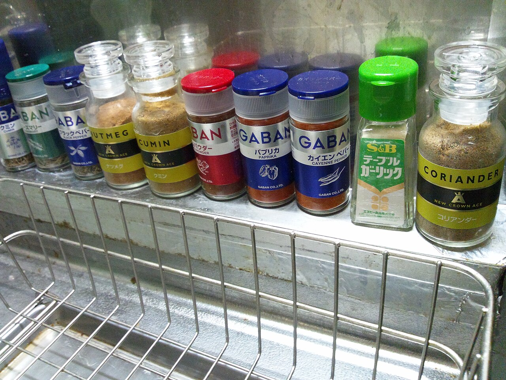

# Query snippets library

*Keep every verification query you prove correct in a personal, named, parameterized library - organized per feature, versioned in git or notes. It turns ten minutes of query writing into a thirty-second lookup, and gets sharper with every bug you verify.*

> The first time you verified an order against the database, the query took ten minutes: finding the
> right tables, remembering the JOIN, getting the WHERE right, double-checking a suspicious result.
> Next Tuesday a similar bug arrives - and most testers start those same ten minutes from zero, because
> last week's query lives nowhere. The testers who seem impossibly fast at data verification are not
> faster at SQL. They stopped rewriting: every query they ever proved correct went into a personal
> library, named and ready, so Tuesday's check is a thirty-second lookup and a parameter swap.

> **In real life**
>
> A cook's spice rack. Every jar is labeled and faces outward - CUMIN, PAPRIKA, CORIANDER - each one
> already ground, tasted, and trusted, sitting in an assigned spot within arm's reach of the stove.
> Mid-recipe, the cook grabs the right jar in two seconds flat; without the rack, every dish would
> start with rummaging through cupboards and sniffing unlabeled bags. A snippets library is your spice
> rack: each proven query is a labeled jar, the parameter is the amount you shake in this time, and the
> rack keeps growing - every new dish you cook adds a jar the next dish can reuse.

**Query snippets library**: A query snippets library is a personal, organized collection of verification queries you have already proven correct - each one NAMED for what it answers (orders_for_user, failed_payments_since), PARAMETERIZED so the changeable part is an explicit placeholder you fill per use instead of text you re-edit, ANNOTATED with a comment saying what it checks and what healthy output looks like, and VERSIONED somewhere durable - a git repo, your team's wiki, your notes app, or your DB client's saved-snippets feature. It is not a cheat sheet of generic SQL syntax; it is the specific, battle-tested queries for YOUR product's tables, accumulated one verified bug at a time.

## Building the rack, one jar at a time

- **Capture at the moment of proof.** The instant a query correctly verifies something - the bug is
  confirmed, the fix is validated - that query has earned a place in the library. Capturing proven
  queries costs seconds; reconstructing them next month costs the original ten minutes again.
- **Name by question, parameterize the changeable part.** `orders_for_user` with a `user_id`
  placeholder answers a whole family of checks; a pasted one-off with `WHERE user_id = 7842` buried
  in it answers exactly one. Mark every blank clearly - a `?`, a `:user_id`, an obvious
  `PARAM_HERE` - so future-you edits the parameter, never the proven logic.
- **Organize by feature, annotate with intent.** Group snippets the way you test - checkout, signup,
  payments, per table or per screen - and give each a one-line comment: what it checks, and what a
  healthy result looks like. A query whose expected output you recorded is a test; one without is
  just SQL.
- **Version it somewhere durable.** A git repo is ideal (history shows how checks evolved as the
  schema changed); a wiki page or notes app works; your DB client's snippet/history feature is the
  minimum. The one wrong place is nowhere - queries that live only in a session's scrollback die with
  the session.

> **Tip**
>
> Seed the library today with just three snippets - the after-any-action check ("show the most recent
> rows in this table"), the count-by-status check (a GROUP BY that fingerprints a whole table in one
> result), and the entity-by-id lookup for your product's core record. Those three cover a remarkable
> share of daily verification, and the library's growth from there is automatic: every bug you verify
> hands you the next jar.

> **Common mistake**
>
> Reusing a snippet's RESULT expectations after the schema changed underneath it. A library query keeps
> running long after a column is renamed or a status value is added - and a stale snippet that silently
> returns wrong-but-plausible rows is worse than no snippet, because you trust it. Treat the library
> like test code: when a verified check surprises you, first confirm the snippet still matches today's
> schema, and prune or update jars whose labels no longer match their contents.


*Spice rack — Karl Baron, Wikimedia Commons, CC BY 2.0. [Source](https://commons.wikimedia.org/wiki/File:Spice_rack_(6194773009).jpg)*
- **The CUMIN jar - one labeled, proven ingredient** — Ground once, tasted, trusted, and labeled so it is grabbed without thinking. That is one snippet: a query you proved correct, named for the question it answers, ready for reuse.
- **The row of jars, labels facing out - the organized library** — PAPRIKA and CAYENNE side by side, every label readable at a glance. Organize snippets the same way: grouped by feature, named by question, so the right one is found by reading, not by remembering.
- **The big CORIANDER jar - the workhorse within easiest reach** — The most-used jar earns the handiest spot. Your after-any-action check and count-by-status snippet are these workhorses - the two or three queries you will reach for daily.
- **The wire rack beneath - the fixed home everything returns to** — The rack is why nothing gets lost: one known place, every jar returned to its spot. That is versioning the library - git, a wiki, saved client snippets - one durable home instead of a session's scrollback.

**Tuesday's bug, verified from the library - press Play**

1. **A bug report lands: user 1's payment looks wrong in the app** — Last month this meant ten minutes of rebuilding a query from scratch. Today it means opening the library.
2. **Look up the snippet by its name: orders_for_user** — Found by reading, not remembering - it sits in the payments group, with a comment saying what healthy output looks like.
3. **Fill the parameter: user_id = 1** — The one blank is explicit. The proven JOIN and WHERE logic stay untouched - editing the parameter, never the logic.
4. **Run it and compare against the app's claim** — Two orders back in seconds: one paid, one failed. The app shows both as paid - mismatch found, evidence exported for the report.
5. **Close the loop: today's new query joins the library** — Verifying this bug needed one new check - payment status by date. Named, parameterized, annotated, committed: next Tuesday it is a thirty-second lookup too.

The whole idea, reduced to one line: prove a query once, shelve it labeled and parameterized, and
every future verification starts from lookup instead of from zero.

*Run it - a tiny snippets library over a real database (Python)*

```python
import sqlite3

conn = sqlite3.connect(":memory:")
cur = conn.cursor()

cur.execute("CREATE TABLE orders (id INTEGER PRIMARY KEY, user_id INTEGER, status TEXT, created TEXT)")
cur.executemany("INSERT INTO orders VALUES (?,?,?,?)", [
    (101, 1, "paid", "2026-07-15"),
    (102, 2, "failed", "2026-07-16"),
    (103, 1, "failed", "2026-07-17"),
    (104, 3, "paid", "2026-07-17"),
    (105, 2, "failed", "2026-07-18"),
])
conn.commit()

# The snippet library: named, parameterized, proven queries - the ? marks are the blanks
SNIPPETS = {
    "orders_for_user": "SELECT id, status, created FROM orders WHERE user_id = ?",
    "failed_since": "SELECT id, user_id, created FROM orders WHERE status = 'failed' AND created >= ?",
    "count_by_status": "SELECT status, COUNT(*) FROM orders GROUP BY status ORDER BY status",
}

def run_snippet(name, params=()):
    print("[" + name + "]", "params:", params if params else "(none)")
    for row in cur.execute(SNIPPETS[name], params):
        print("   ", row)
    print()

run_snippet("orders_for_user", (1,))
run_snippet("failed_since", ("2026-07-17",))
run_snippet("count_by_status")

print("Three verification checks, three lookups - zero queries written from scratch.")
conn.close()
```

Same library shape in Java - the shared code runner here has no live JDBC/SQLite driver on its
classpath (unlike your own machine, where `sqlite-jdbc` works fine locally), so each named snippet
becomes a small function over plain collections, with the same parameters and the same results:

*Run it - the same named, parameterized snippet library (Java)*

```java
import java.util.*;
import java.util.function.Function;

public class Main {
    record Order(int id, int userId, String status, String created) {}

    static List<Order> orders = List.of(
        new Order(101, 1, "paid", "2026-07-15"),
        new Order(102, 2, "failed", "2026-07-16"),
        new Order(103, 1, "failed", "2026-07-17"),
        new Order(104, 3, "paid", "2026-07-17"),
        new Order(105, 2, "failed", "2026-07-18")
    );

    // The snippet library: named, parameterized, proven checks - the parameter is the blank
    static Map<String, Function<String, List<String>>> snippets = new LinkedHashMap<>();

    static void buildLibrary() {
        snippets.put("orders_for_user", param -> {
            List<String> out = new ArrayList<>();
            for (Order o : orders) {
                if (o.userId() == Integer.parseInt(param)) {
                    out.add("(" + o.id() + ", " + o.status() + ", " + o.created() + ")");
                }
            }
            return out;
        });
        snippets.put("failed_since", param -> {
            List<String> out = new ArrayList<>();
            for (Order o : orders) {
                if (o.status().equals("failed") && o.created().compareTo(param) >= 0) {
                    out.add("(" + o.id() + ", " + o.userId() + ", " + o.created() + ")");
                }
            }
            return out;
        });
        snippets.put("count_by_status", param -> {
            Map<String, Integer> counts = new TreeMap<>();
            for (Order o : orders) counts.merge(o.status(), 1, Integer::sum);
            List<String> out = new ArrayList<>();
            for (Map.Entry<String, Integer> e : counts.entrySet()) {
                out.add("(" + e.getKey() + ", " + e.getValue() + ")");
            }
            return out;
        });
    }

    static void runSnippet(String name, String param) {
        System.out.println("[" + name + "] params: " + (param == null ? "(none)" : param));
        for (String row : snippets.get(name).apply(param)) {
            System.out.println("    " + row);
        }
        System.out.println();
    }

    public static void main(String[] args) {
        buildLibrary();
        runSnippet("orders_for_user", "1");
        runSnippet("failed_since", "2026-07-17");
        runSnippet("count_by_status", null);
        System.out.println("Three verification checks, three lookups - zero queries written from scratch.");
    }
}
```

### Your first time: Your mission: start the library with three jars

- [ ] Create the home: a snippets.sql file in a git repo, a notes page, or your client's snippet feature — One durable place, decided once. The format matters far less than the habit of putting things there.
- [ ] Write your three seed snippets against any database you can query — Most-recent-rows for your core table, a count-by-status GROUP BY, and a lookup-by-id - the three workhorses from this note.
- [ ] Give each a name, an explicit parameter placeholder, and a one-line comment with expected healthy output — A query with a recorded expectation is a reusable test; without one it is just SQL you once ran.
- [ ] Use the library for real within a week - and add the first new query you prove correct — The moment a lookup beats rewriting, the habit locks in. The library only grows from bugs you were verifying anyway.

You now own the compounding asset this note is about: verification speed that increases with every
bug you check, instead of resetting to zero each Tuesday.

- **A trusted snippet suddenly returns zero rows (or errors with 'no such column') on a database where it always worked.**
  The schema moved underneath the library - a column renamed, a table split, a status value changed spelling. Check the snippet against the schema browser's current column list, fix it, and commit the updated version; the git history of that file becomes a record of how the schema evolved.
- **The library has grown into a junk drawer - forty near-duplicate queries, and finding the right one takes longer than rewriting it.**
  Prune and rename by question, not by table: one parameterized orders_for_user beats six pasted variants with different hardcoded ids. If several snippets differ only in a literal value, merge them into one snippet with an explicit parameter and delete the rest.

### Where to check

- **Your library, before writing any query from scratch** — the thirty-second lookup only pays off if checking the rack is the reflex; rummaging in cupboards means the rack has failed or the jar is missing.
- **The snippet's comment with expected healthy output** — comparing today's result against the recorded expectation is what turns a saved query into a repeatable check.
- **[[sql-and-databases-for-testers/tools-and-habits/db-clients]]** — where snippets actually run, and whose saved-snippets and history features are the minimum viable library.
- **[[sql-and-databases-for-testers/verifying-the-app-against-the-db/ui-action-to-db-check]]** — the verification workflow that generates library entries: every UI-to-DB check you prove correct is a jar for the rack.

### Worked example: two testers, one recurring bug, and a nine-minute difference

1. A payments bug resurfaces monthly in slightly different clothes: some users' failed payments show
   as paid in the app. Two testers on the team handle these tickets on alternating rotations.
2. The first tester starts each ticket in an empty query editor: which table holds payment attempts?
   What is the JOIN to users again? Was the status value 'failed' or 'FAILED'? Ten minutes of
   rediscovery precede every verification, and the reconstructed query is subtly different each time.
3. The second tester opens `payments.sql` in the team's QA repo: `failed_since` and
   `orders_for_user`, both proven during the ORIGINAL bug months ago, each with a comment showing
   healthy output. Parameter in, run, compare - verified in under a minute, identically every time.
4. During one rotation, the second tester's `count_by_status` snippet also flags something nobody
   asked about: a brand-new status value, 'pending_retry', appearing in the counts. It is the first
   sign of an unannounced schema change that would have silently broken other checks.
5. Finding: the library did not just save nine minutes - it made verification REPEATABLE (same
   proven query every rotation, not a fresh reconstruction) and made drift VISIBLE (a fingerprint
   query notices new values the day they appear). That is what versioned, named checks buy.

**Quiz.** A tester keeps pasting last month's proven query into new tickets after hand-editing the user id buried in its WHERE clause - and this month's edit accidentally changed the JOIN condition too, corrupting the results. Which library habit would have prevented this?

- [ ] Saving the query in two places so there is always a backup copy
- [x] Parameterizing the snippet - the user id becomes an explicit placeholder that gets filled per run, so the proven JOIN and WHERE logic is never hand-edited again
- [ ] Memorizing the query so it can be retyped fresh each time
- [ ] Only running the query while a developer watches to catch mistakes

*The failure happened during hand-editing of proven logic - exactly the step parameterization removes. With the changeable part promoted to an explicit placeholder, each use fills the blank and leaves the battle-tested JOIN and WHERE untouched, which is why this note says to mark every blank clearly and edit the parameter, never the logic. A backup copy (option one) duplicates the same editing risk in two places. Retyping from memory (option three) is the ten-minutes-from-zero problem this whole note exists to end, with fresh typo risk each time. And supervision (option four) does not scale and misses the point - the fix is structural, not more careful eyeballs.*

- **A query snippets library, in one line** — A personal, versioned collection of verification queries you already proved correct - named by question, parameterized, annotated with expected output - so checks start from lookup, not from zero.
- **The spice rack analogy** — Each proven query is a labeled jar within arm's reach; the parameter is the amount you shake in this time; the rack (git, wiki, client snippets) is the fixed home that keeps jars findable.
- **When does a query earn a place in the library?** — The moment it proves something - a bug confirmed, a fix verified. Capture costs seconds at that moment; reconstruction next month costs the original ten minutes again.
- **Why parameterize instead of pasting and editing?** — An explicit placeholder means future runs fill the blank while the proven JOIN/WHERE logic stays untouched - hand-editing pasted queries is how proven logic silently breaks.
- **The three seed snippets** — Most-recent-rows for the core table, count-by-status (GROUP BY fingerprint), and entity-by-id lookup - they cover most daily verification and start the library today.

### Challenge

Build your seed library for a real product you test (BuggyShop counts): three named, parameterized
snippets in one durable file, each with a one-line comment stating what it checks and what healthy
output looks like. Then run all three via lookup, timing yourself - and write down the comparison
against writing them fresh. Commit the file if you have git; that first commit is the library's
birthday.

### Ask the community

> I keep rewriting mostly-the-same verification queries every sprint and it feels wasteful, but a personal SQL snippets file also feels like something a 'real' engineer would organize better. How do experienced testers actually keep their verification queries?

Useful replies usually reveal that nearly every experienced tester has exactly this file - a
snippets.sql in a repo, a wiki page per feature, or the DB client's saved snippets - and the advice
converges on naming by the question answered, marking parameters explicitly, and recording expected
output, because a query with an expectation is a reusable test rather than a one-off.

- [Art of Testing — SQL for Testers](https://artoftesting.com/sql-for-testers)
- [LearnSQL — SQL Basics Cheat Sheet](https://learnsql.com/blog/sql-basics-cheat-sheet/)
- [Super SQA | QA Automation — SQL For Software Testing (QA) - How We Use SQL In Software Testing](https://www.youtube.com/watch?v=6owEkqf9WNw)

🎬 [Super SQA | QA Automation — SQL For Software Testing (QA) - How We Use SQL In Software Testing](https://www.youtube.com/watch?v=6owEkqf9WNw) (13 min)

- Every query you prove correct is an asset - capture it at the moment of proof, because reconstruction next month costs the original ten minutes again.
- Name snippets by the question they answer and parameterize the changeable part - future runs fill the blank, never hand-edit the proven logic.
- Annotate each snippet with what it checks and what healthy output looks like - a recorded expectation turns saved SQL into a repeatable test.
- Version the library somewhere durable (git ideally) and organize by feature - a queryable history of checks doubles as a record of schema evolution.
- Maintain it like test code: update or prune snippets when the schema moves, and merge near-duplicates into one parameterized entry.


## Related notes

- [[Notes/sql-and-databases-for-testers/tools-and-habits/read-only-discipline|Read-only discipline]]
- [[Notes/sql-and-databases-for-testers/tools-and-habits/db-clients|DB clients (DBeaver, TablePlus)]]
- [[Notes/sql-and-databases-for-testers/verifying-the-app-against-the-db/ui-action-to-db-check|UI action → DB check]]


---
_Source: `packages/curriculum/content/notes/sql-and-databases-for-testers/tools-and-habits/query-snippets-library.mdx`_
