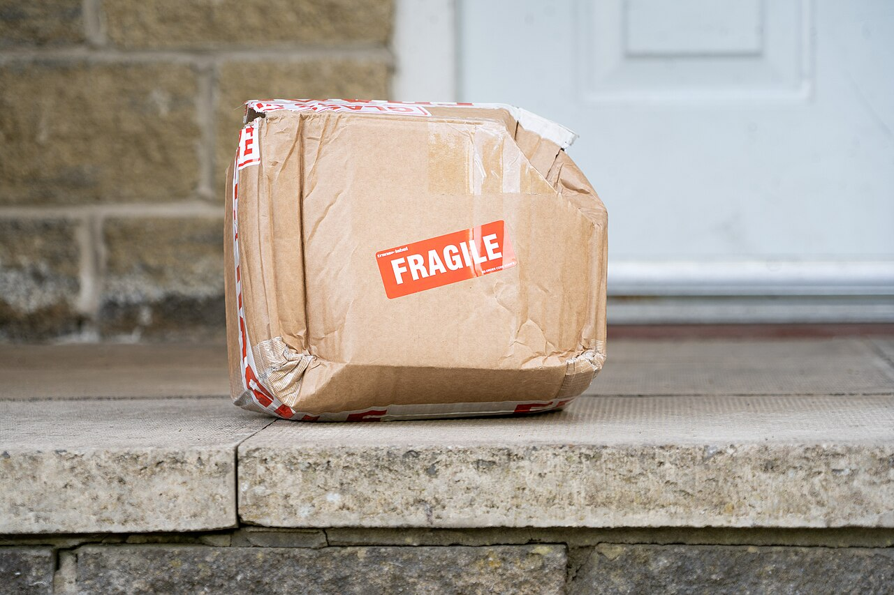

# UI action to DB check

*After any UI action, the screen only shows what the app THINKS happened - caches and optimistic updates can lie. The real verdict is one SELECT away: check that the actual row changed in the database, independent of the screen that reported success.*

> A tester clicks "Cancel order" and the screen instantly shows the order as cancelled. Test passed?
> Not yet. The screen is the app talking about itself - and apps update their own display optimistically,
> serve cached lists, and swallow failed writes without a word. Three days later the warehouse ships the
> "cancelled" order, because the row in the database still said `placed` the whole time. The habit this
> note teaches: after the click, go look at the row.

> **In real life**
>
> A courier app that says "Delivered" versus the parcel actually sitting on your doorstep. The
> notification is a report ABOUT the delivery, written by software that wants to tell you good news -
> it is not the delivery itself. Maybe the parcel is there. Maybe it went to the wrong house. Maybe it
> is there but crushed flat with a FRAGILE sticker on it. The only way to know is to open the door and
> look at the step. The UI's success message is the notification; the database row is the doorstep. A
> tester's job is to open the door.

**UI action to DB check**: A UI-to-DB check is the two-step verification habit for any action that should change data: first perform the action in the UI and note what the screen claims happened, then run a direct query against the database and confirm the actual row changed in the way the claim implies - the right row, the right column, the right new value, and nothing else touched. The screen and the row are produced by different code paths (the UI often updates its own local state before, or even without, a successful write), so agreement between them is something to verify, never something to assume.

## Why the screen is not the row

- **Optimistic updates show success before it happens.** Many UIs update the screen the moment you
  click, then send the real write in the background. If that write fails quietly, the screen keeps
  smiling at data that no longer matches anything.
- **Caches show the past.** A list view may be rendered from a cached copy fetched minutes ago. The
  row can be correct while the screen is stale - or the screen "correct" while the row never changed.
- **The row is where consequences live.** Emails, invoices, warehouse picks, and reports are driven
  by what is in the table, not by what a browser once displayed. A bug that only exists in the gap
  between the two is still a real, shippable, customer-facing bug.
- **The check is cheap.** One `SELECT` on the affected row, before and after the action, turns "looks
  fine" into evidence: `SELECT status FROM orders WHERE id = 2` - a few seconds per test case.

> **Tip**
>
> Query the row BEFORE the UI action, not just after. A before-and-after pair proves the action caused
> the change. If you only look afterward, a value that was already correct - left over from a previous
> test, or set by something else entirely - can silently pass your check without the app having done
> anything at all.

> **Common mistake**
>
> Verifying by refreshing the same screen. A refresh often re-reads the same cache, or re-renders from
> the same API response that was wrong in the first place - so the lie survives the refresh and now
> looks confirmed. The point of the DB check is independence: use a different path to the data (a direct
> query, or at minimum a different tool or session) than the one that just told you "success."


*Damaged fragile parcel delivered to doorstep — Meanwell Packaging, Wikimedia Commons, CC BY 2.0. [Source](https://commons.wikimedia.org/wiki/File:Damaged_fragile_parcel_delivered_to_doorstep.jpg)*
- **The parcel itself - the actual stored state** — This box on the step is what really happened, whatever any notification claims. In testing terms it is the database row: the one artifact that downstream reality - the warehouse, the invoice, the next screen - actually runs on.
- **The FRAGILE sticker - what was supposed to happen** — The sticker records the expectation: handle with care. The app's success toast is this sticker - a statement of intent, printed before the outcome was known. Expectations are not evidence.
- **The crushed corner - the detail only inspection reveals** — The tracking app said 'Delivered' and technically it was. Only looking at the box shows the state it arrived in. A DB check catches exactly this class of gap: the action 'succeeded' but the resulting data is wrong.
- **The doorstep - the place you go to check** — Independent of the app, the step either has the parcel or it does not. That is your direct query: a look at the data itself, through a different path than the software that just reported success.

**One click, two stories - press Play**

1. **Tester clicks 'Cancel order' in the UI** — The screen flips the order to 'cancelled' immediately - an optimistic update, shown before any write is confirmed.
2. **First, the row is read BEFORE trusting anything** — SELECT status FROM orders WHERE id = 2 - it still says 'placed'. Now there is a baseline to compare against.
3. **The app's background write fails silently** — The API call errors out and the error is swallowed. The UI never finds out - it is still showing 'cancelled'.
4. **The tester re-runs the same SELECT** — The row still says 'placed'. Screen says cancelled, database says placed - two sources, two different answers.
5. **Verdict: the mismatch IS the bug report** — UI state and DB state disagree after a completed action. That one-line finding, with the query and both values, is exactly what the developer needs.

The whole idea, reduced to one line: the screen is the app's opinion, the row is the fact - after every
data-changing click, check the fact.

*Run it - a UI that lies and the SELECT that catches it (Python)*

```python
import sqlite3

conn = sqlite3.connect(":memory:")
cur = conn.cursor()

cur.execute("CREATE TABLE orders (id INTEGER PRIMARY KEY, item TEXT, status TEXT)")
cur.executemany("INSERT INTO orders VALUES (?,?,?)", [
    (1, "Wireless mouse", "placed"),
    (2, "USB-C cable", "placed"),
    (3, "Laptop stand", "shipped"),
])
conn.commit()

# What the UI is showing after the tester clicks "Cancel" on order 2.
# The screen updated itself optimistically - but the app's UPDATE silently failed.
ui_view = {1: "placed", 2: "cancelled", 3: "shipped"}

print("--- Step 1: the UI says order 2 is cancelled. Trust it? ---")
for order_id, ui_status in ui_view.items():
    db_status = cur.execute(
        "SELECT status FROM orders WHERE id = ?", (order_id,)
    ).fetchone()[0]
    verdict = "MATCH" if ui_status == db_status else "MISMATCH - UI is lying!"
    print("  order", order_id, "| UI says:", ui_status, "| DB says:", db_status, "|", verdict)

print()
print("--- Step 2: the fix ships - the cancel now really runs an UPDATE ---")
cur.execute("UPDATE orders SET status = 'cancelled' WHERE id = 2")
conn.commit()

db_status = cur.execute("SELECT status FROM orders WHERE id = 2").fetchone()[0]
print("  order 2 | UI says: cancelled | DB says:", db_status, "|",
      "MATCH" if db_status == "cancelled" else "MISMATCH")
print()
print("Same click, same screen - only the DB check told the two apart.")

conn.close()
```

Same check in Java - the shared code runner here has no live JDBC/SQLite driver on its classpath
(unlike your own machine, where `sqlite-jdbc` works fine locally), so this mirrors the exact same
UI-versus-database comparison in plain Java collections, over the same rows, verified by hand to match
the real SQLite output above:

*Run it - the same UI-vs-DB comparison, without a live JDBC driver on the shared runner (Java)*

```java
import java.util.*;

public class Main {
    public static void main(String[] args) {
        // The "database" - what is actually stored
        Map<Integer, String> db = new LinkedHashMap<>();
        db.put(1, "placed");
        db.put(2, "placed");
        db.put(3, "shipped");

        // What the UI is showing after the tester clicks "Cancel" on order 2.
        // The screen updated itself optimistically - but the real update silently failed.
        Map<Integer, String> uiView = new LinkedHashMap<>();
        uiView.put(1, "placed");
        uiView.put(2, "cancelled");
        uiView.put(3, "shipped");

        System.out.println("--- Step 1: the UI says order 2 is cancelled. Trust it? ---");
        for (Map.Entry<Integer, String> e : uiView.entrySet()) {
            String dbStatus = db.get(e.getKey());
            String verdict = e.getValue().equals(dbStatus) ? "MATCH" : "MISMATCH - UI is lying!";
            System.out.println("  order " + e.getKey() + " | UI says: " + e.getValue()
                + " | DB says: " + dbStatus + " | " + verdict);
        }

        System.out.println();
        System.out.println("--- Step 2: the fix ships - the cancel now really runs an UPDATE ---");
        db.put(2, "cancelled");

        String dbStatus = db.get(2);
        System.out.println("  order 2 | UI says: cancelled | DB says: " + dbStatus + " | "
            + (dbStatus.equals("cancelled") ? "MATCH" : "MISMATCH"));
        System.out.println();
        System.out.println("Same click, same screen - only the DB check told the two apart.");
    }
}
```

### Your first time: Your mission: catch one UI claim red-handed (or prove it honest)

- [ ] Pick one data-changing action in an app you can test - cancel, rename, mark done, delete — Something whose effect should be one visible change to one row.
- [ ] BEFORE clicking, query the affected row and write down its current values — In BuggyShop or the playground above, that is one SELECT by id. This is your baseline.
- [ ] Perform the action in the UI and note exactly what the screen claims — The toast text, the new on-screen value, any counter that changed - the claim you are about to verify.
- [ ] Re-run the same query and compare all three: baseline, UI claim, new row value — Row changed as claimed = verified. Row unchanged or changed differently = you have a reproducible, evidence-backed bug.

You have now verified an action against the data instead of against the app's own report of itself -
the core habit this whole chapter builds on.

- **The UI shows the change, but your query still returns the old value - even after waiting and re-running it.**
  First confirm you are querying the right row and the right database (same environment the app writes to - staging UIs pointed at one DB while you query another is a classic false alarm). If the target is right, check the network tab: did the write request actually fire, and did it return success? A 4xx/5xx behind a smiling UI is your bug.
- **Your query shows the row changed correctly, but the UI keeps showing the old value.**
  The write worked; the read path is stale. Hard-refresh, or check in a fresh session - if the new value appears, you are looking at a caching/refresh bug in the UI layer, not a data bug. Report it as exactly that, with the row's real value as evidence.

### Where to check

- **The affected row, before AND after the action** — a before/after pair on the same query is what proves the action caused the change.
- **The network request behind the click** — status code and response body separate "write never happened" from "write happened, display is stale."
- **[[sql-and-databases-for-testers/databases-in-plain-words/where-your-apps-data-lives]]** — why the screen and the storage are different layers that can disagree in the first place.
- **[[sql-and-databases-for-testers/verifying-the-app-against-the-db/crud-verification]]** — the next note: turning this one-off check into a systematic pass over all four operation types.

### Worked example: the cancelled order that shipped anyway

1. A tester cancels order 2847 through the UI. The order page flips to "Cancelled", a confirmation
   toast appears, and the order vanishes from the "Active orders" list. Everything on screen agrees.
2. Following the habit, the tester runs `SELECT id, status FROM orders WHERE id = 2847` anyway -
   expecting `cancelled`, planning to move on.
3. The row says `placed`. Re-running it a minute later: still `placed`. The screen and the database
   are telling two different stories about the same order.
4. The network tab shows why: the cancel request returned a 500, but the frontend had already updated
   its own state and the error handler showed nothing. The UI was reporting its optimistic guess as
   fact.
5. Finding: filed with the query, the before/after values, and the failed request attached. Without
   the DB check this passes testing, and the customer gets a shipping notification for an order they
   watched themselves cancel.

**Quiz.** A tester clicks 'Mark as paid' on invoice 91. The screen immediately shows a green 'Paid' badge. Which of these actually verifies the action worked?

- [ ] Refresh the page - if the badge still says 'Paid' after a reload, the change was saved
- [ ] Watch the badge for a few seconds - optimistic updates revert on their own when the write fails
- [x] Query the invoice row directly and confirm its payment status column now holds the paid value, ideally having noted its value before the click
- [ ] Check that the invoice moved from the 'Unpaid' list to the 'Paid' list elsewhere in the UI

*Only the direct query checks the data through a path independent of the app's own display. A refresh (option one) can re-read the same cache or the same wrong API state, so the lie survives the reload looking confirmed. Waiting for a revert (option two) relies on the app correctly detecting and surfacing its own failure - the exact thing in doubt. Another list in the same UI (option four) is still the same application state, rendered twice; both views can repeat the same wrong story. The row, checked before and after, is the fact the rest of the business runs on.*

- **The UI-to-DB check, in one line** — After any data-changing action: query the affected row directly and confirm it changed as claimed - never accept the screen's own success report as proof.
- **The parcel-on-the-doorstep analogy** — The courier app's 'Delivered' notification is the UI; the parcel actually on the step (and its condition) is the database row. Only opening the door settles it.
- **Why refresh is not verification** — A refresh often re-reads the same cache or same wrong API response - the independent path is a direct query, not the same screen again.
- **Why query the row BEFORE the action too** — A before/after pair proves the action caused the change; an after-only check can pass on leftover data from a previous test.
- **Screen right, row wrong vs screen wrong, row right** — Row unchanged after 'success' = failed write (data bug). Row changed but screen stale = read-path/caching bug. The pair of checks tells you which report to file.

### Challenge

In any app you can test, pick three different data-changing actions (one create, one update, one
delete if you can). For each: record the affected row before, act in the UI, record the screen's
claim, then query the row after. Write a three-line log per action - baseline, claim, actual - and
note which of the three you would have wrongly passed if you had only looked at the screen.

### Ask the community

> After a UI action shows success, my direct query still shows the old value - but only sometimes, and waiting a few seconds usually fixes it. Is this a bug or am I just querying too fast?

Useful replies usually distinguish real async processing (a queued write that lands moments later, by
design) from a genuine silent failure - and suggest checking whether the delay is consistent and
whether the write request itself returned success, before deciding which one you are looking at.

- [Guru99 — Database Testing Tutorial](https://www.guru99.com/data-testing.html)
- [Software Testing Help — Database Testing: How to Test a Database](https://www.softwaretestinghelp.com/database-testing-process/)
- [CodeLucky — Database Testing: A Beginner's Guide to Test Methodologies](https://www.youtube.com/watch?v=CX8_eWReUBk)

🎬 [CodeLucky — Database Testing: A Beginner's Guide to Test Methodologies](https://www.youtube.com/watch?v=CX8_eWReUBk) (9 min)

- The screen and the row are produced by different code paths - optimistic updates and caches mean their agreement must be verified, not assumed.
- After any data-changing action, run a direct query on the affected row: right row, right column, right new value, nothing else touched.
- Query before the action as well as after - the pair proves causation and catches leftover data from earlier tests.
- Refreshing the same screen is not an independent check; it can re-read the exact state that was wrong in the first place.
- When screen and row disagree, the direction of the mismatch tells you the bug type: unchanged row = failed write; changed row with stale screen = display/caching bug.


## Related notes

- [[Notes/sql-and-databases-for-testers/databases-in-plain-words/what-a-database-is|What a database is]]
- [[Notes/sql-and-databases-for-testers/databases-in-plain-words/where-your-apps-data-lives|Where your app's data lives]]
- [[Notes/sql-and-databases-for-testers/verifying-the-app-against-the-db/crud-verification|CRUD verification]]


---
_Source: `packages/curriculum/content/notes/sql-and-databases-for-testers/verifying-the-app-against-the-db/ui-action-to-db-check.mdx`_
