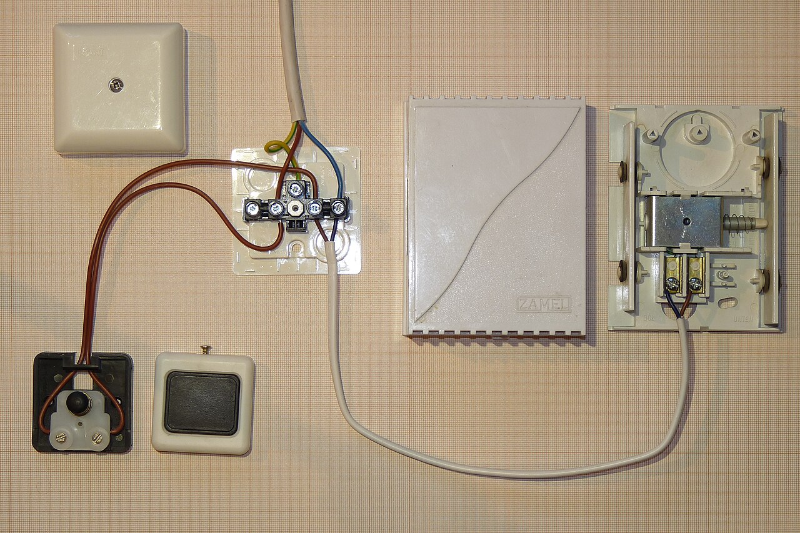

# Third-party services & webhooks

*When part of your system lives on someone else's servers - a payment processor, an email provider - you can't step through its code when something breaks. Webhooks flip the usual request direction: THEY call YOU, whenever their event happens, on their schedule, not yours.*

> A customer pays for an order. Your app shows "processing..." Ten seconds later, an email appears
> confirming payment - but nobody's code POLLED anything to notice the payment cleared. Instead, the
> payment processor's servers reached out and called YOUR server, unprompted, the moment the money
> actually moved. That's a webhook - and if you've only ever tested APIs where you're the one calling
> out, this reversed direction is where most third-party-integration bugs hide.

> **In real life**
>
> A doorbell. You don't stand at your window all day checking whether someone has arrived (that's
> polling - wasteful, and always a little late). Instead you wire up a doorbell: when someone presses
> it, YOUR house gets notified, at the exact moment it happens, with no effort on your part to keep
> checking. A webhook is that doorbell wiring between two services - the third party "presses the
> button" (their event happens) and your server's doorbell (an endpoint you exposed) rings.

**webhook**: A webhook is a way for one service to notify another the instant something happens, by having the NOTIFYING service make an HTTP request to a URL the RECEIVING service provided in advance - the reverse of a normal API call, where the client is usually the one initiating contact. Instead of your app repeatedly asking a payment processor 'has this payment cleared yet?' (polling), you register a webhook URL with the processor once, and the processor calls THAT URL the moment the payment actually clears. This means your server must be reachable from the outside internet, must handle requests arriving at unpredictable times with no guaranteed order, must verify the request genuinely came from the third party (not an attacker forging the same shape), and must tolerate the same event arriving more than once - because most webhook providers retry on any delivery failure, including cases where your server actually processed it successfully but failed to reply fast enough.

## What's different about testing a webhook versus testing your own API

- **You don't control WHEN it fires.** A normal API call happens because your code decided to make
  it. A webhook fires on the third party's schedule - which means your tests need a way to
  TRIGGER or SIMULATE that event, not just wait and hope.
- **You must verify authenticity.** Since your webhook endpoint is a public URL, anyone can send it
  a request shaped like a real event. Real providers sign their payloads (a header like
  `X-Signature`) so you can verify the request genuinely came from them - an endpoint that skips
  this check will process forged events as if they were real.
- **The same event can arrive more than once.** Most providers retry a webhook delivery if they
  don't get a fast, successful response - even if your server DID process it successfully but was
  slow to reply. This means webhook handlers must be idempotent: processing the same event twice
  must not double-charge, double-ship, or double-anything.
- **Order isn't guaranteed.** A "payment succeeded" event and a "payment refunded" event for the
  same order could theoretically arrive out of order under real-world network conditions - handlers
  that assume strict ordering can end up in an impossible state.

> **Tip**
>
> Almost every serious webhook provider (Stripe, GitHub, Twilio, PayPal) has a dashboard where you can
> resend a past real event, or send a test event, on demand. That's often the fastest way to actually
> exercise your webhook endpoint under test conditions - far faster than trying to trigger the real
> underlying event (an actual payment, an actual code push) every time you need to test it.

> **Common mistake**
>
> Testing a webhook endpoint by manually crafting a fake JSON payload and POSTing it directly, without
> ever validating the endpoint checks the provider's signature. This "test" can pass even when the
> endpoint has zero protection against a forged event from an actual attacker - because your manual
> test never exercised the one check that matters most: is this request even really from who it
> claims to be from?


*Doorbell button wiring — Dmitry G, Wikimedia Commons, CC BY-SA 3.0. [Source](https://commons.wikimedia.org/wiki/File:Doorbell_button.jpg)*
- **The button itself — the third party's event** — Pressed on THEIR schedule, not yours - a payment clearing, a code push landing, an SMS being delivered. You don't control when this happens, only that you've wired something up to respond when it does.
- **The wiring running down the wall — the HTTP call your webhook endpoint receives** — The actual mechanism connecting the button to your chime - equivalent to the third party's server making an HTTP POST to the URL you registered with them.
- **Whether just ANY press should ring your chime** — A doorbell button anyone could rewire to trigger falsely is a bad doorbell. Signature verification is the equivalent safeguard - confirming this 'press' really came from the wire you installed, not from someone else's forged connection.
- **What happens if the button gets pressed twice quickly** — A well-built chime handles a rapid double-press gracefully rather than doing something twice as bad - just as a webhook handler must tolerate the same event delivery arriving more than once without double-processing it.

**A payment webhook, start to finish - press Play**

1. **Your app registers a webhook URL with the payment processor, once, in advance** — Something like https://yourapp.com/webhooks/payment - the processor stores this and will call it later.
2. **A customer pays. The processor's systems confirm the payment cleared** — This can take anywhere from milliseconds to several seconds - entirely on the processor's internal timeline, invisible to your app.
3. **The processor's server makes an HTTP POST to YOUR registered URL, unprompted** — This is the reversal: they are now the CLIENT, and your server is the one receiving the incoming call.
4. **Your endpoint verifies the request's signature before trusting anything in the body** — Confirms this really came from the processor - not a forged request shaped to look like one.
5. **Your endpoint processes the event idempotently and responds quickly** — If this exact event was already processed (checked via its unique event ID), do nothing again but still respond success - so the processor doesn't retry needlessly.

Idempotent webhook handling, simulated directly - the same event delivered twice, processed exactly
once:

*Run it - the same webhook event delivered twice, processed exactly once (Python)*

```python
processed_event_ids = set()
order_paid_count = {}

def handle_payment_webhook(event):
    """A correctly idempotent webhook handler."""
    event_id = event["id"]

    if event_id in processed_event_ids:
        return f"Event {event_id}: already processed, skipping (still returns 200 OK)"

    processed_event_ids.add(event_id)
    order_id = event["order_id"]
    order_paid_count[order_id] = order_paid_count.get(order_id, 0) + 1
    return f"Event {event_id}: order {order_id} marked PAID (total times marked: {order_paid_count[order_id]})"

# The provider retries delivery because your server's first ACK was slow/dropped -
# this is NORMAL, expected webhook behavior, not a bug on the provider's side.
event = {"id": "evt_8f3a91", "order_id": "order_552"}

print(handle_payment_webhook(event))   # first delivery
print(handle_payment_webhook(event))   # RETRY of the exact same event
print(handle_payment_webhook(event))   # a second retry, just in case

print()
print(f"Order order_552 was marked PAID {order_paid_count['order_552']} time(s) total.")
print("Correct: exactly 1 - even though the webhook was DELIVERED 3 times.")
```

The identical idempotency check in Java - same three deliveries, same single processing:

*Run it - the same webhook event delivered twice, processed exactly once (Java)*

```java
import java.util.*;

public class Main {
    static Set<String> processedEventIds = new HashSet<>();
    static Map<String, Integer> orderPaidCount = new HashMap<>();

    static String handlePaymentWebhook(Map<String, String> event) {
        String eventId = event.get("id");

        if (processedEventIds.contains(eventId)) {
            return "Event " + eventId + ": already processed, skipping (still returns 200 OK)";
        }

        processedEventIds.add(eventId);
        String orderId = event.get("order_id");
        orderPaidCount.merge(orderId, 1, Integer::sum);
        return "Event " + eventId + ": order " + orderId + " marked PAID (total times marked: "
                + orderPaidCount.get(orderId) + ")";
    }

    public static void main(String[] args) {
        Map<String, String> event = Map.of("id", "evt_8f3a91", "order_id", "order_552");

        System.out.println(handlePaymentWebhook(event)); // first delivery
        System.out.println(handlePaymentWebhook(event)); // RETRY of the exact same event
        System.out.println(handlePaymentWebhook(event)); // a second retry, just in case

        System.out.println();
        System.out.println("Order order_552 was marked PAID " + orderPaidCount.get("order_552") + " time(s) total.");
        System.out.println("Correct: exactly 1 - even though the webhook was DELIVERED 3 times.");
    }
}
```

### Your first time: Your mission: find one real webhook and check its two easiest-to-miss behaviors

- [ ] Find a service you use (or your team's product uses) that integrates via webhooks — Payment processors, git hosts, chat platforms, and SMS/email providers almost all offer them - check their developer docs for a 'webhooks' section.
- [ ] Find whether they document signature verification — Look for a header name (often something like X-Signature or X-Hub-Signature) and how to verify it - this is the check that stops forged events.
- [ ] Find whether they document retry behavior — Most explicitly state something like 'we retry for up to 3 days if your endpoint doesn't return a 2xx' - this confirms duplicate delivery is expected, not a bug.
- [ ] Write one sentence for each: is signature verification required, and how many times might one real event be delivered? — These two answers are exactly what determines whether an integration is safe against forged events and duplicate processing.

You've now identified the two properties of any webhook integration that matter most for testing -
authenticity and idempotency - directly from real provider documentation instead of assuming both
are handled correctly.

- **A customer was charged once but their order shows as 'paid' twice, or a notification email was sent multiple times for one real event.**
  This is the classic missing-idempotency bug: the webhook handler processes every delivery as if it were a brand-new event, instead of checking the event's unique ID against what's already been processed. Fix by tracking processed event IDs (or using the underlying data's own idempotency, like 'only transition PAID -> PAID is a no-op') before checking for duplicate side effects, not after.
- **A webhook endpoint appears to work in every manual test but the team later finds evidence of a forged/malicious event having been processed.**
  Check whether the endpoint actually verifies the provider's signature header, or only checks that the payload LOOKS shaped correctly. A manually-crafted test payload that skips signature verification will 'pass' even on an endpoint with zero real protection - the only way to catch this gap is testing with a deliberately unsigned or wrongly-signed request and confirming it's rejected.
- **An event that should have triggered an action (an order marked shipped, an account upgraded) never happened, with no error visible anywhere in your own logs.**
  Check the THIRD PARTY's own webhook delivery dashboard/logs first, if they offer one - the failure may be entirely on their side (never sent), in transit (blocked by a firewall, wrong URL registered), or your endpoint returned a non-2xx that you didn't notice, all of which look identical from inside your own system's logs alone.

### Where to check

- **The third-party provider's webhook delivery dashboard, if one exists** — shows exactly what was sent, when, the response your server gave, and whether/how many times it retried - often the fastest ground truth for a "why didn't this fire" investigation.
- **Whether your endpoint checks a signature header before trusting the payload body** — the single highest-value security check specific to webhooks.
- **Whether processing is guarded by the event's unique ID**, not just by the business data inside it — the idempotency check that prevents duplicate-delivery bugs.
- **[[system-design-for-testers/architecture-styles/apis-as-the-glue]]** — the same contract-thinking applies to a webhook's payload shape, just with the request direction reversed.

### Worked example: a duplicate-shipping-notification bug traced to a missing idempotency check

1. A bug report: some customers received TWO "your order has shipped" emails for a single shipment.
2. A tester checks the shipping provider's webhook dashboard for one affected order and finds the
   provider delivered the `shipment.created` event TWICE for that order, four seconds apart -
   explicitly logged as "retry: previous attempt timed out."
3. Checking the webhook handler's code shows it sends the shipping email as a direct side effect of
   receiving the event, with no check for whether this exact event ID had already been handled.
4. The first delivery actually succeeded fully (the email sent, the order updated) - but the
   handler took long enough responding that the provider's client-side timeout fired anyway,
   triggering an automatic retry from the provider's side, which the handler dutifully processed all
   over again.
5. Finding: "Duplicate shipping emails are caused by a missing idempotency check in the
   `shipment.created` webhook handler, combined with a slow response time that triggers the
   provider's own retry logic. Recommend tracking processed event IDs and returning success
   immediately for a duplicate delivery, plus reducing the handler's response time so retries
   trigger less often in the first place." Found by checking the provider's own delivery log first,
   not by guessing from the symptom alone.

**Quiz.** A payment webhook handler works perfectly in every manual test where you POST a hand-crafted JSON payload shaped like a real event. What important protection might this testing approach be completely failing to verify?

- [ ] Whether the handler correctly parses JSON
- [ ] Whether the handler's business logic (marking an order paid) works at all
- [x] Whether the handler verifies the request's signature to confirm it genuinely came from the real payment provider, rather than accepting any correctly-shaped payload from anyone
- [ ] Whether the handler returns a 200 status code

*A hand-crafted test payload sent directly to the endpoint completely bypasses the one check that matters most for a public webhook URL: does the endpoint verify the request's signature before trusting it? An endpoint with zero signature verification will process this manual test payload exactly the same as it would process a real attacker's forged request - meaning this kind of testing can report 'it works!' while leaving a serious security gap completely unexercised. The other options (JSON parsing, business logic, status codes) are all things this kind of manual test WOULD actually exercise - signature verification is specifically the thing it can't, because the test payload is deliberately shaped to look legitimate without ever needing to prove it via a real signature.*

- **What makes a webhook different from a normal API call** — The direction is reversed - the third party initiates the HTTP request TO your server, on their schedule, instead of your app calling out to them.
- **Why webhook handlers must be idempotent** — Most providers retry delivery on any failure to get a fast success response - even when the handler DID succeed but replied too slowly - so the same event can legitimately arrive more than once.
- **Why signature verification matters specifically for webhooks** — A webhook endpoint is a public URL; without verifying the provider's signature, the endpoint can't distinguish a real event from an attacker's forged request shaped to look like one.
- **Fastest way to test a webhook without triggering the real underlying event** — Most serious providers offer a dashboard to resend a real past event or send a synthetic test event on demand - much faster than manufacturing the real trigger (an actual payment, etc.) every time.
- **The doorbell analogy for webhooks** — You don't poll (repeatedly check if someone arrived) - you wire a doorbell so THEY notify YOU the instant it happens, at their initiative, not yours.

### Challenge

Find the webhook documentation for one real provider (Stripe, GitHub, Twilio, or similar - many
publish these publicly even if you don't have an account). Write down: (1) the header name they use
for signature verification, and (2) their stated retry policy (how many times / for how long they'll
retry a failed delivery). These two facts are the foundation of testing any webhook integration
against that provider.

### Ask the community

> We're integrating with `[provider]`'s webhooks for `[event type]`. I want to test both signature verification and duplicate-delivery handling before this ships - has anyone found a good way to simulate an unsigned/forged request and a duplicate delivery against `[provider]`'s webhook format specifically?

Naming the specific provider gets much more useful answers here, since exact signature schemes and
retry behavior vary a lot between providers (Stripe's scheme looks nothing like GitHub's, for
example).

- [webhooks.fyi — a vendor-neutral guide to webhook best practices](https://webhooks.fyi/)
- [Stripe Docs — Webhooks (signature verification, retries, idempotency)](https://stripe.com/docs/webhooks)
- [Paperform — What is a Webhook?](https://www.youtube.com/watch?v=RiAdjmWUU_A)

🎬 [Paperform — What is a Webhook?](https://www.youtube.com/watch?v=RiAdjmWUU_A) (7 min)

- A webhook reverses the usual API direction - the third party calls YOUR server, unprompted, whenever their event happens.
- Webhook handlers must be idempotent - the same event can legitimately be delivered more than once, and processing it twice must not double any side effect.
- Signature verification is the single highest-value security check specific to webhooks - without it, any forged request shaped correctly is indistinguishable from a real one.
- Most providers offer a dashboard to resend or simulate events - the fastest way to test without triggering the real underlying action every time.
- When an expected webhook-triggered action didn't happen, check the provider's own delivery logs first - the failure could be on their side, in transit, or a non-2xx response you didn't notice.


## Related notes

- [[Notes/system-design-for-testers/architecture-styles/apis-as-the-glue|APIs as the glue]]
- [[Notes/system-design-for-testers/architecture-styles/monolith-vs-microservices|Monolith vs microservices]]
- [[Notes/system-design-for-testers/from-architecture-to-test-strategy/integration-points-are-risk|Integration points = risk]]


---
_Source: `packages/curriculum/content/notes/system-design-for-testers/architecture-styles/third-party-services-and-webhooks.mdx`_
