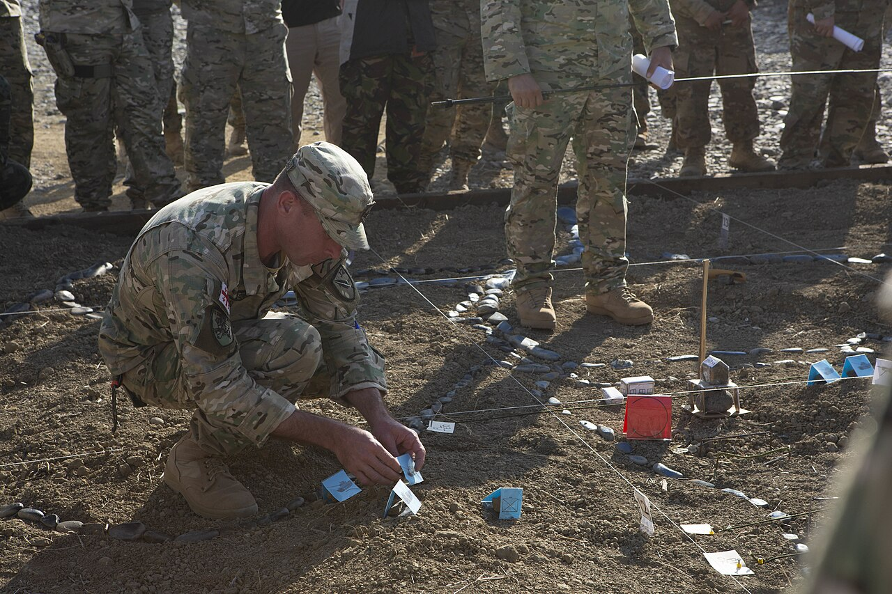

# Drawing the system before testing it

*Boxes, arrows, ten minutes: a hand-drawn sketch of the system turns vague testing into targeted testing. The drawing exposes seams, hotspots, and the arrows nobody can explain - and getting it corrected by a developer is the fastest architecture lesson a tester can buy.*

> Ask for the architecture diagram and you'll usually get one of two answers: "it's in Confluence"
> (last updated three reorganizations ago, missing two services) or "we don't really have one." Ask
> three developers to DESCRIBE the system instead and you'll get three different systems. Here's the
> move that separates testers who guess from testers who know: stop asking for the map. Draw one.
> Five boxes, five arrows, ten minutes, wrong in at least two places - and then show it to a
> developer, because nothing on this earth makes an engineer talk faster than a slightly incorrect
> diagram. Their corrections ARE the architecture lesson, and the corrected sketch becomes the most
> useful testing tool you own.

> **In real life**
>
> Before a military unit executes an operation, they build the terrain in miniature - dirt, stones
> for roads, string for grid lines, paper markers for every unit - and then walk the entire plan on
> the model, out loud, with everyone watching. It's called a rehearsal-of-concept drill, and its
> power isn't the model's accuracy (it's dirt and cards); it's what building it FORCES: every
> road must be placed by someone who knows where it goes, every marker placed by the unit it
> represents, and every "wait, who's covering that ridge?" gets asked while it costs nothing.
> Sketching a system before testing it is the same drill: the drawing is crude on purpose, and the
> act of drawing it is what makes the unknowns visible while they're still cheap.

**System sketch**: A system sketch is a deliberately simple drawing of the system under test: a box for each major piece (frontend, API, database, each third-party service), an arrow for each way data moves between them, a label on each arrow saying what flows, and an honest question mark on anything you can't explain. It is not formal architecture documentation - no UML, no tooling required, whiteboard or paper is ideal. Its purpose is diagnostic: drawing it exposes what you don't know (the unlabeled arrow), showing it to a developer collects corrections (the fastest architecture lesson available), and the corrected sketch becomes a test-planning surface - seams to probe, hotspots to regression-test, and a place to mark where every past bug actually lived.

## Why drawing beats asking, reading, and remembering

- **Drawing forces completeness in a way conversation never does.** A verbal explanation can skip
  the email service and nobody notices; a sketch with an arrow into thin air is visibly
  unfinished. The blank spots on paper are exactly the blind spots in your testing - made
  embarrassing, therefore made fixable.
- **A wrong sketch extracts more truth than a right question.** Show a developer your drawing and
  say "is this how it works?" Watching someone correct your arrows ("no, payments calls US back -
  a webhook, here") teaches you more system architecture in five minutes than an afternoon of
  reading. People love correcting a diagram; they hate writing one.
- **The question marks are the deliverable.** The arrow you can't label is not a failure of the
  exercise - it IS the exercise. Every "?" on your sketch converts directly into a precise
  question for the developer, and precise questions get precise answers. Vague dread
  ("I don't really understand the payment flow") becomes a to-do list.
- **The sketch is a test-planning surface.** Once the boxes and arrows exist, your strategy work
  from this module lands ON them: circle the seams (ownership changes mid-arrow = concentrated
  risk), star the hotspot (the box most arrows touch = the regression magnet), and mark which
  layer each planned check belongs to. Testing stops being a list and becomes a map.
- **Keep it small and it stays true.** Five to nine boxes. If the sketch needs more, you're
  drawing the company, not the feature - zoom in on the part you're testing and let one box
  labeled 'everything else' absorb the rest. A sketch that fits on one page gets redrawn when
  things change; a mural gets framed and ignored, like the Confluence diagram did.
- **Where past bugs cluster, future bugs cluster.** Mark on the sketch where the last five real
  incidents actually lived. The dots don't spread evenly - they pile onto one or two boxes and
  arrows, and that pile is your risk-based test priority, drawn by history itself.

> **Tip**
>
> Date your sketch and photograph it into the team channel after a developer has corrected it. Two
> things happen: the corrections become searchable team knowledge (the architecture documentation
> nobody was ever going to write), and the date turns staleness into a feature - a sketch labeled
> "March" that no longer matches reality is EVIDENCE the system changed, which is itself a finding
> worth asking about.

> **Common mistake**
>
> Waiting until you understand the system before drawing it - "I'll sketch it once I know how it
> works." Precisely backwards: the sketch is HOW you get to know how it works, and its errors are
> the mechanism, not a humiliation. The tester who draws a wrong diagram on day two and gets it
> corrected knows more by day three than the tester still politely absorbing tribal knowledge in
> month two. Draw first, be wrong, get corrected - that's the whole technique.


*Agile Spirit 2019 rehearsal-of-concept drill — Sgt. Williams Quinteros, U.S. Marine Corps, Wikimedia Commons, Public domain. [Source](https://commons.wikimedia.org/wiki/File:Agile_Spirit_19-_Rehearsal_of_concepts_(5648278).jpg)*
- **The marker being placed — every box named by hand** — Each paper card is one unit, placed deliberately by someone who must know what it is and where it belongs. Your sketch works identically: every box you draw is a component you're forced to name and position - and the component you CAN'T confidently place is a gap in your understanding, found before it becomes a gap in your testing.
- **The stone-lined routes — connections drawn, not assumed** — Roads and rivers are laid out stone by stone, because how units MOVE between positions is where operations succeed or fail. Those are your arrows: how data travels between boxes. A conversation can skip a connection and nobody notices; a drawing with a missing road is visibly wrong - which is the point.
- **The red marker — expected trouble, marked explicitly** — Opposing forces get their own color, placed exactly where trouble is expected. Do the same on your system sketch: mark where the last five real bugs actually lived. History piles onto one or two boxes and arrows - and that pile, not a hunch, is your risk-based test priority.
- **The string grid — a shared way to point at things** — Grid lines exist so everyone can reference the same spot without ambiguity - 'grid B3', not 'over there-ish'. A shared sketch gives your team the same power: 'the webhook arrow between payments and the API' beats three people each imagining a different system while using the same words.
- **The audience — the plan is walked BEFORE anyone moves** — The entire unit stands around the model and walks the operation out loud, so misunderstandings surface while they cost nothing. Showing your sketch to a developer is your rehearsal: their corrections - 'no, that arrow goes the other way' - are the cheapest architecture lessons you will ever receive.

**Ten minutes with a marker, start to payoff - press Play**

1. **Minute 0-5: draw what you THINK the system is - boxes, arrows, honest question marks** — Browser, API, database, payments, email. Label what flows on each arrow. Two arrows get a '?' because you genuinely don't know. That's not failure; that's the inventory of your blind spots.
2. **Minute 5-10: show a developer - 'is this right?' - and collect corrections** — 'Payments also calls US back - webhook, draw it the other way too.' 'Email goes through a queue, not directly.' Every correction is architecture knowledge transferring at maximum speed, because nothing makes an engineer talk like a wrong diagram.
3. **Minute 10: the corrected sketch starts doing analysis for you** — Circle ownership changes: three seams, two touching a third party. Star the box most arrows touch: the API - your regression magnet. The two former question marks are now two precise test areas you didn't know existed.
4. **Ongoing: the sketch becomes the team's map - and its staleness becomes a signal** — Photograph it into the team channel, dated. New bugs get marked where they lived. When reality drifts from the drawing, that drift is evidence the system changed - your cue to ask what else changed with it.

The sketch, expressed as code you can run: boxes with owners, arrows with labels, and honest
question marks - then watch the drawing answer three test-planning questions by itself:

*Run it - a system sketch that computes its own test plan (Python)*

```python
# A system sketch as data: boxes (who owns them) and arrows (what flows).
# "?" means: nobody in the room could explain that arrow. Write it down anyway.
BOXES = {
    "browser":  "ours",
    "api":      "ours",
    "database": "ours",
    "payments": "PayFast (3rd party)",
    "email":    "SendMail (3rd party)",
}

ARROWS = [
    ("browser",  "api",      "JSON over HTTPS"),
    ("api",      "database", "SQL reads/writes"),
    ("api",      "payments", "charge requests"),
    ("payments", "api",      "?"),
    ("api",      "email",    "?"),
]

print("The sketch (boxes and arrows):")
for src, dst, label in ARROWS:
    print(f"  {src:>8} --[{label}]--> {dst}")
print()

# The drawing starts answering questions the moment it exists.

# 1. Seams: arrows that cross an ownership boundary = concentrated risk.
seams = [(s, d) for s, d, _ in ARROWS if BOXES[s] != BOXES[d]]
print(f"1. Seams (ownership changes mid-arrow): {len(seams)}")
for s, d in seams:
    print(f"   {s} -> {d}   ({BOXES[s]} meets {BOXES[d]})")

# 2. The hotspot: the box the most arrows touch is the regression magnet.
touch_count = {}
for s, d, _ in ARROWS:
    touch_count[s] = touch_count.get(s, 0) + 1
    touch_count[d] = touch_count.get(d, 0) + 1
hotspot = max(sorted(touch_count), key=lambda b: touch_count[b])
print(f"2. Hotspot: '{hotspot}' touches {touch_count[hotspot]} of {len(ARROWS)} arrows -")
print("   any change near it deserves extra regression suspicion.")

# 3. Question marks: every '?' is a dev question you now KNOW to ask.
unknowns = [(s, d) for s, d, label in ARROWS if label == "?"]
print(f"3. Arrows nobody could label: {len(unknowns)}")
for s, d in unknowns:
    print(f"   what exactly flows {s} -> {d}? (ask before testing, not after failing)")

print()
print("Ten minutes of drawing produced: a seam list, a regression hotspot,")
print("and two precise dev questions - before a single test was written.")
```

The same sketch and the same three analyses in Java - identical findings:

*Run it - a system sketch that computes its own test plan (Java)*

```java
import java.util.*;

public class Main {
    record Arrow(String src, String dst, String label) {}

    public static void main(String[] args) {
        // A system sketch as data: boxes (who owns them) and arrows (what flows).
        // "?" means: nobody in the room could explain that arrow. Write it down anyway.
        Map<String, String> boxes = new LinkedHashMap<>();
        boxes.put("browser", "ours");
        boxes.put("api", "ours");
        boxes.put("database", "ours");
        boxes.put("payments", "PayFast (3rd party)");
        boxes.put("email", "SendMail (3rd party)");

        List<Arrow> arrows = List.of(
                new Arrow("browser", "api", "JSON over HTTPS"),
                new Arrow("api", "database", "SQL reads/writes"),
                new Arrow("api", "payments", "charge requests"),
                new Arrow("payments", "api", "?"),
                new Arrow("api", "email", "?")
        );

        System.out.println("The sketch (boxes and arrows):");
        for (Arrow a : arrows)
            System.out.printf("  %8s --[%s]--> %s%n", a.src(), a.label(), a.dst());
        System.out.println();

        // The drawing starts answering questions the moment it exists.

        // 1. Seams: arrows that cross an ownership boundary = concentrated risk.
        List<Arrow> seams = arrows.stream()
                .filter(a -> !boxes.get(a.src()).equals(boxes.get(a.dst()))).toList();
        System.out.printf("1. Seams (ownership changes mid-arrow): %d%n", seams.size());
        for (Arrow a : seams)
            System.out.printf("   %s -> %s   (%s meets %s)%n",
                    a.src(), a.dst(), boxes.get(a.src()), boxes.get(a.dst()));

        // 2. The hotspot: the box the most arrows touch is the regression magnet.
        Map<String, Integer> touchCount = new TreeMap<>();
        for (Arrow a : arrows) {
            touchCount.merge(a.src(), 1, Integer::sum);
            touchCount.merge(a.dst(), 1, Integer::sum);
        }
        String hotspot = Collections.max(touchCount.entrySet(), Map.Entry.comparingByValue()).getKey();
        System.out.printf("2. Hotspot: '%s' touches %d of %d arrows -%n",
                hotspot, touchCount.get(hotspot), arrows.size());
        System.out.println("   any change near it deserves extra regression suspicion.");

        // 3. Question marks: every '?' is a dev question you now KNOW to ask.
        List<Arrow> unknowns = arrows.stream().filter(a -> a.label().equals("?")).toList();
        System.out.printf("3. Arrows nobody could label: %d%n", unknowns.size());
        for (Arrow a : unknowns)
            System.out.printf("   what exactly flows %s -> %s? (ask before testing, not after failing)%n",
                    a.src(), a.dst());

        System.out.println();
        System.out.println("Ten minutes of drawing produced: a seam list, a regression hotspot,");
        System.out.println("and two precise dev questions - before a single test was written.");
    }
}
```

### Your first time: Your mission: draw the app you test, today, badly

- [ ] Grab paper or a whiteboard and draw a box for each major piece you KNOW exists — Frontend, backend/API, database, and every third-party you're aware of (payments, email, login, analytics). Five to nine boxes. No tools, no UML - rectangles and handwriting.
- [ ] Draw an arrow for every way data moves, and LABEL what flows on each one — 'JSON over HTTPS', 'SQL', 'webhook'. The labels are where your knowledge gets tested - an arrow you can draw but can't label is a finding.
- [ ] Put an honest question mark on everything you can't explain — Unlabeled arrows, boxes you suspect exist but can't name, connections you've heard mentioned. The question marks are the point of the exercise, not its failure.
- [ ] Show it to a developer: 'I sketched the system so I can test it better - what's wrong here?' — Write their corrections directly onto the drawing. Then photograph the corrected version into the team channel with today's date - it just became documentation.

Total cost: about fifteen minutes. What you now own: the seam list, the hotspot, a set of precise
questions, and the experience of a developer explaining the real architecture at full speed -
which no document in the wiki was ever going to do.

- **Your sketch balloons past a dozen boxes and stops being useful.**
  You're drawing the organization, not the feature. Zoom: keep the boxes your current testing actually touches, and collapse everything else into one box honestly labeled 'everything else'. A sketch is a tool for THIS testing effort - the C4 model calls this choosing your zoom level, and the one-page constraint is what keeps the drawing alive and redrawable.
- **Developers give conflicting corrections - two engineers redraw the same arrow differently.**
  You've struck gold, not confusion. Two owners disagreeing about how their halves connect is the exact condition that breeds seam bugs - if THEY can't agree what flows across that arrow, no test on either side is verifying the same contract. Write both versions down, get them in one conversation, and test that arrow's reality first.
- **The sketch was great for a sprint, then quietly stopped matching reality.**
  Expected - systems drift, and a dated sketch turns drift into signal. When a correction lands ('oh, notifications go through the queue now'), that's your cue to ask the follow-up: what else changed in that work? Redraw the affected corner (one page = five minutes), re-date it, repost it. The redraw ritual keeps the map honest and keeps you informed of architecture changes nobody thought to tell QA about.
- **You're testing a system with no one to correct the sketch - legacy code, vendor product, the author left.**
  Let the system correct it instead. Open the network tab and use the app: every request is an arrow announcing itself, with its real label. Check config files and environment variables for connection strings - each one is a box you may be missing. Logs and dashboards reveal the pieces that only appear under load. Slower than a five-minute correction, but the sketch still assembles - from evidence instead of testimony.

### Where to check

- **The network tab while using the app** — every request is an arrow drawing itself, with the real protocol and payload as its label; ten minutes of normal usage validates half your sketch.
- **Config files and environment variables** — connection strings and API keys are a census of boxes: every URL and credential points at a component that belongs on the drawing.
- **The infrastructure dashboard (or whoever can see it)** — the deployed-services list is the authoritative box inventory; compare it against your sketch and investigate every name you didn't draw.
- **The last five incident reports or serious bug tickets** — mark where each one actually lived on the sketch; the clustering you'll see is your risk map, drawn by history.
- **[[system-design-for-testers/the-big-picture/reading-an-architecture-diagram]]** — the notation basics (what boxes, arrows, and layers conventionally mean) that make your own sketches legible to the engineers correcting them.

### Worked example: a wrong sketch finds the box nobody mentioned

1. A tester new to a food-delivery app draws their day-two sketch: app, API, database, payments,
   and a maps service. Five boxes, six arrows, two honest question marks - one on "how do
   restaurants get told about new orders?" because they genuinely have no idea.
2. They show a senior developer, who grins and starts redrawing. "Orders don't go straight to
   the restaurant - there's a dispatch service in the middle, with a queue. It retries if the
   restaurant tablet is offline. Also the maps arrow is backwards, and payments calls us back
   here - webhook." Ninety seconds, four corrections, one entirely new box.
3. The corrected sketch now shows: a dispatch service NOBODY had mentioned in onboarding, a
   queue with retry behavior (a duplicate-delivery risk, as the integration-points note would
   predict), and a webhook seam. The tester circles three seams and stars the dispatch service -
   it touches four arrows.
4. Payoff, two weeks later: a bug report arrives - "restaurant got the same order twice." Old
   tester response: confused clicking in the app, where nothing reproduces. New response: straight
   to the starred box - the dispatch queue's retry - with a precise question: "does the tablet
   acknowledge before or after the retry timer?" Root cause found the same morning, because the
   tester already knew the box existed and already suspected its retry seam.
5. The sketch took fifteen minutes, was wrong on first draft, and that wrongness was the
   mechanism: the developer's corrections surfaced in ninety seconds what onboarding hadn't
   surfaced in two weeks. The team pinned the photographed sketch in their channel; it's now
   what NEW hires get shown on day one.

**Quiz.** A tester sketches the system from memory, shows it to a developer, and the developer points out that a whole message-queue service is missing and one arrow points the wrong way. What's the best assessment of this outcome?

- [ ] The exercise failed - the sketch was wrong, so the tester should have studied the wiki first
- [x] The exercise worked exactly as intended - the corrections surfaced a hidden component and a misunderstood flow at the cost of ten minutes
- [ ] The developer should now produce a formal architecture diagram so sketching isn't needed again
- [ ] The tester should keep the sketch private next time to avoid looking uninformed

*Surfacing the unknown-unknowns IS the exercise. The tester now knows about a message queue (with all its retry/duplicate/ordering bug families) and a corrected data flow - knowledge acquired in minutes precisely BECAUSE the wrong sketch provoked correction; engineers correct a flawed diagram far more readily than they author one from scratch. Studying the wiki first (option A) usually means studying a stale map. Waiting for formal documentation (option C) trades a live, cheap, redrawable tool for a deliverable that drifts. And keeping sketches private (option D) discards the entire mechanism - the correction conversation - to protect an ego that was never actually at risk: drawing first and being corrected reads as initiative, and every senior engineer knows it.*

- **What is a system sketch?** — A deliberately simple drawing of the system under test: a box per major piece, an arrow per data flow, a label on every arrow, and an honest question mark on anything you can't explain. Paper or whiteboard; no formal notation needed.
- **Why draw instead of just asking or reading?** — Drawing forces completeness (a missing arrow is visible; a skipped sentence isn't), and a wrong sketch extracts corrections - engineers eagerly fix a flawed diagram but rarely write one from scratch.
- **What do the question marks on a sketch represent?** — The deliverable. Each '?' is a blind spot converted into a precise developer question - 'what flows from payments back to the API?' - asked before testing instead of discovered after failing.
- **How does a sketch become a test plan?** — Circle the seams (arrows crossing ownership = concentrated risk), star the hotspot (the box most arrows touch = regression magnet), and mark where past bugs lived (history's clustering = risk priority).
- **The right size for a sketch** — Five to nine boxes, one page. Bigger means you're drawing the company, not the feature - zoom in and collapse the rest into 'everything else'. One-page sketches get redrawn; murals get ignored.
- **What does it mean when two devs correct the same arrow differently?** — Gold: two owners disagreeing about their shared contract is exactly where seam bugs breed. Neither side's tests are verifying the same reality - test that arrow first.
- **How to sketch when there's nobody to ask** — Let the system testify: the network tab draws arrows with real labels, config files and env vars census the boxes, logs and dashboards reveal what only appears under load.

### Challenge

Run the full drill on the app you know best, with a timer: ten minutes to sketch (boxes, labeled
arrows, question marks), then get one developer to spend five minutes correcting it. Count three
things when you're done: components you didn't know existed, arrows you had wrong, and precise
questions your question marks produced. If all three counts are zero, you may genuinely know your
system - but in several years of testers trying this exercise, the recorded number of first-draft
sketches that survived contact with a developer unchanged is approximately none.

### Ask the community

> I sketched the architecture of the app I test (boxes and arrows, nothing formal) and got it corrected by a developer - found `[a component I didn't know existed / an arrow pointing the wrong way]`. For testers who keep system sketches: how do you keep them current as the system changes, and do you mark bug history on them to guide risk-based testing?

Sketch-keeping habits vary wildly between testers - some redraw per feature, some keep one living
team map, some annotate bug clusters in red. Hearing how others maintain theirs is the fastest way
to find the rhythm that survives contact with your actual workload.

- [The C4 model — a simple, zoom-level approach to drawing software systems](https://c4model.com/)
- [Martin Fowler (Ham Vocke) — The Practical Test Pyramid (placing tests on the map you drew)](https://martinfowler.com/articles/practical-test-pyramid.html)
- [IcePanel — What is the C4 model?](https://www.youtube.com/watch?v=7o_PgOQWqdY)

🎬 [IcePanel — What is the C4 model?](https://www.youtube.com/watch?v=7o_PgOQWqdY) (4 min)

- Don't ask for the map - draw one. Ten minutes, five to nine boxes, labeled arrows, honest question marks; being wrong is the mechanism, because corrections are the fastest architecture lesson available.
- The question marks are the deliverable: every arrow you can't label converts into a precise developer question asked BEFORE testing instead of after failing.
- The corrected sketch is a test-planning surface: circle the seams, star the hotspot the most arrows touch, and mark where past bugs clustered - that's a risk map drawn by history.
- Keep it one page and dated: small sketches get redrawn and stay true; when reality drifts from the drawing, the drift itself is evidence the system changed - and a cue to ask what else did.
- Two developers correcting the same arrow differently is a finding, not noise - disagreement between owners is exactly where seam bugs breed.
- No one to ask? The system testifies: the network tab draws the arrows, config files census the boxes, and logs reveal the pieces that only appear under load.


## Related notes

- [[Notes/system-design-for-testers/the-big-picture/reading-an-architecture-diagram|Reading an architecture diagram]]
- [[Notes/system-design-for-testers/from-architecture-to-test-strategy/integration-points-are-risk|Integration points = risk]]
- [[Notes/system-design-for-testers/from-architecture-to-test-strategy/asking-devs-the-right-questions|Asking devs the right questions]]


---
_Source: `packages/curriculum/content/notes/system-design-for-testers/from-architecture-to-test-strategy/drawing-the-system-before-testing-it.mdx`_
