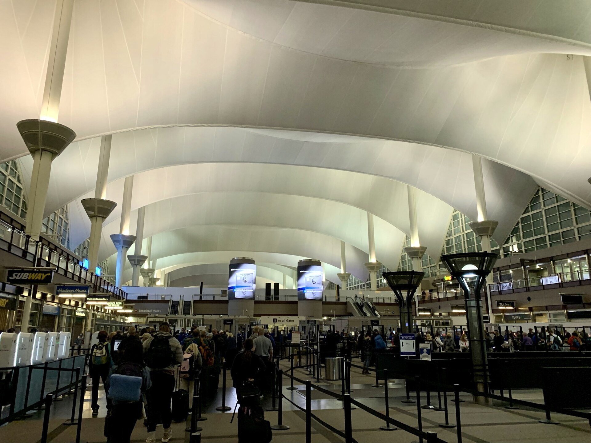

# What to test at which layer

*Every check has a cheapest layer where it's cheap to run and precise when it fails. Business rules belong at the unit layer, wiring belongs at the API layer, and only full journeys belong in the browser - mixing these up is why some test suites take an hour and still fail vaguely.*

> A coupon rule has eight interesting cases: right above the minimum, right below it, wrong-case
> input, member discounts, an unknown code. Testing all eight by clicking through checkout in a
> browser costs four minutes EACH - opening the site, adding items, logging in, applying the coupon,
> reading the total. Testing the same eight by calling the function directly costs milliseconds
> each. Same coverage, six-thousand-times the cost, and when the slow version fails you only learn
> "the total was wrong" - not which of four possible layers broke it. Knowing WHERE a rule lives is
> what decides where testing it is cheap.

> **In real life**
>
> An airport's layered security: ID check at the curb, boarding-pass scan at the checkpoint, the
> X-ray belt, the walk-through scanner, a final gate check before boarding. Each layer verifies
> something specific, at the point where verifying it is fastest and clearest. Nobody re-checks your
> ID at the X-ray belt - that layer's whole job is metal and shape, not identity. And nobody skips
> straight to boarding without any of the earlier checks, hoping a single gate-side glance will catch
> everything. A good test strategy is exactly this: each layer owns the checks it's positioned to do
> well, and nothing gets pushed to a later, slower, less specific layer "just to be safe."

**Testing at the right layer**: Testing at the right layer means matching each thing you want to verify to the cheapest layer capable of verifying it precisely. Pure business logic (a discount rule, a validation formula, a scoring algorithm) belongs at the UNIT layer - calling the function directly, no server, no browser, no database, milliseconds per case. Whether pieces connect correctly (does the endpoint call the right function, return the right shape, enforce auth) belongs at the API/INTEGRATION layer - real requests, no browser, seconds per case. Whether a real user can complete a real journey (can they actually see the discount applied and check out) belongs at the UI/END-TO-END layer - a full browser, the slowest and most fragile, reserved for a handful of critical paths. The rule of thumb, sometimes drawn as a pyramid: many fast unit checks at the base, fewer integration checks in the middle, a small number of end-to-end checks at the top - because each layer up is slower, flakier, and less specific about WHAT broke when it fails.

## Matching the check to the layer, and why it matters

- **Business rules live at the unit layer.** A discount formula, a password-strength rule, a
  shipping-cost calculation - these are pure logic with no server or browser required. Every edge
  case (boundaries, unusual combinations, invalid input) belongs here: cheap enough to run
  hundreds of variations in under a second, and when one fails, the failure names the exact input
  that broke the exact rule.
- **Wiring lives at the API/integration layer.** Does the checkout endpoint actually CALL the
  discount function? Does it return the right JSON shape? Does it reject a request with no auth
  token? This layer doesn't re-test the rule's every edge case - one or two representative calls
  confirm the connection works; the rule's exhaustive cases already passed downstairs.
- **Journeys live at the UI/E2E layer, sparingly.** Can a real user add an item, apply a coupon,
  and see the discounted total on screen? This is the only layer that catches rendering,
  real-browser quirks, and the full path working end to end - and it's the slowest, most brittle
  layer by far. Reserve it for a SMALL number of critical paths, not for re-proving logic already
  covered below.
- **The failure-precision argument matters as much as speed.** A failing unit test says "discount
  is wrong for cartTotal=50, coupon=SAVE20" - one line, no ambiguity. A failing E2E test says "the
  checkout page didn't show $40" - and now someone must manually rule out the rule, the API, the
  rendering, and a stale cache before finding the real cause. Layer choice decides how much manual
  detective work every future failure costs.
- **The pyramid shape is a consequence, not a rule to memorize.** Many unit checks (cheap, fast,
  precise) at the base; fewer integration checks in the middle; very few E2E checks at the top -
  because that's what falls out naturally from routing every check to its cheapest sufficient
  layer. A suite shaped like an ice-cream cone (mostly E2E, almost no unit tests) is usually the
  symptom of routing everything to the slowest layer by default.
- **This is a testing-STRATEGY skill, not just an automation skill.** Even fully manual testers
  benefit: knowing a rule is "just a function" tells you to ask a developer to verify it with fast
  unit tests, freeing your own manual time for the journeys only a human (or a browser) can judge.

> **Tip**
>
> Before writing or requesting any test, ask one question: "What is the CHEAPEST layer where this
> check could fail for the reason I care about?" A discount percentage being wrong can only mean the
> rule is wrong - test the rule directly. A discount not APPEARING on screen could be the rule, the
> API, or the rendering - that's an integration or UI concern. The question routes almost every test
> to its correct layer in one sentence.

> **Common mistake**
>
> Treating "more UI tests = more thorough" as true. Ten E2E tests re-proving ten variations of one
> discount rule are ten slow, flaky ways to test something one fast unit test file already covers
> completely - they add runtime and maintenance burden without adding real confidence. Thoroughness
> comes from covering the RULE's edge cases exhaustively somewhere cheap, then confirming the
> JOURNEY works once at the top - not from re-running the same logic through the most expensive
> layer available.


*Denver International Airport security line — APK, Wikimedia Commons, CC BY-SA 4.0. [Source](https://commons.wikimedia.org/wiki/File:Denver_International_Airport_security_line.jpg)*
- **The queue behind stanchions — travelers approaching the FIRST layer** — Before the X-ray, before the scanner - identity gets checked first, because that's the cheapest place to catch 'wrong person, wrong ticket' before spending the checkpoint's slower resources on them. Unit tests are this: the earliest, cheapest layer, catching what it can catch before anything more expensive runs.
- **The checkpoint lanes — the wiring layer** — Boarding passes get scanned, bags get X-rayed - verifying the CONNECTIONS (does this ticket match this flight, does this bag's contents match policy) rather than re-verifying the traveler's whole identity again. This is the integration layer: confirming pieces connect correctly, not re-litigating logic already settled.
- **TSA Pre✓ lanes — a faster path for a narrower check** — Pre-screened travelers get a lighter-touch lane because the deep verification already happened elsewhere, earlier. The same principle: once a rule is proven exhaustively at the unit layer, later layers don't need to re-run every case - a light confirmation suffices.
- **CLEAR kiosks — an even earlier, even narrower check** — Biometric identity confirmation happens here, before travelers even reach the main queue - the cheapest possible layer for the narrowest possible question ('is this really them'). Push every check as early and as narrow as it can correctly go.
- **The soaring tented roof — the one thing only visible from here** — No earlier checkpoint reveals what the finished terminal looks like end to end. Some things - does the whole journey actually feel right, does the full path actually work - can only be verified at the top, by walking it. That's the E2E layer's irreplaceable job, and the reason it still deserves a few real checks, not zero.

**One rule, tested at the wrong layer for months - press Play**

1. **A discount rule has 8 edge cases; the team's only checks are 3 slow E2E browser tests** — Each E2E run: open the site, log in, add items, apply a coupon, read the total - roughly 30 seconds per case, and only 3 of 8 cases are covered at all.
2. **A new edge case breaks (member discount stacking with a coupon); no test catches it** — The 3 E2E tests never exercised that combination. It ships, and a customer notices the math is wrong three weeks later.
3. **The team adds ONE unit test file: 8 cases, each calling discount() directly** — Total runtime: under a second. Every edge case the E2E suite couldn't afford to cover is now covered completely, at a fraction of the cost.
4. **The suite is restructured: 8 unit cases + 1 API wiring check + 1 E2E journey** — Same real coverage, dramatically faster, and a future failure now says WHICH layer broke - not just 'the total looked wrong' three weeks after the fact.

Eight edge cases of one discount rule, tested at the unit layer versus the same coverage estimated
through a browser - the same logic in both languages, same conclusion:

*Run it - 8 rule variations at the unit layer vs the same coverage through a browser (Python)*

```python
def discount(cart_total, coupon, is_member):
    """The business rule under test - lives in ONE function, deep in the backend."""
    if coupon == "SAVE20" and cart_total >= 50:
        pct = 20
    elif coupon == "SAVE20":
        pct = 0                     # coupon requires a 50 minimum
    elif is_member and cart_total >= 100:
        pct = 10
    else:
        pct = 0
    return cart_total * (100 - pct) // 100

# Every interesting variation of the RULE - the edge cases a tester designs
cases = [
    (49, "SAVE20", False, 49),      # just under the minimum -> no discount
    (50, "SAVE20", False, 40),      # exactly at the minimum -> 20% off
    (50, "save20", False, 50),      # wrong case coupon -> no discount
    (100, "", True, 90),            # member at threshold -> 10% off
    (99, "", True, 99),             # member just under -> nothing
    (100, "SAVE20", True, 80),      # coupon beats membership
    (0, "SAVE20", False, 0),        # empty cart
    (50, "EXPIRED", False, 50),     # unknown coupon
]

UNIT_MS = 5          # one function call
E2E_MS = 30_000      # browser: open site, add items, log in, apply coupon, read total

print("Checking all 8 rule variations at the UNIT layer:")
failures = []
for total, coupon, member, expected in cases:
    got = discount(total, coupon, member)
    ok = "pass" if got == expected else "FAIL"
    if got != expected:
        failures.append((total, coupon, member, expected, got))
    print(f"  {ok}  discount({total}, {coupon!r}, member={member}) -> {got} (expected {expected})")

print(f"\\ncost at unit layer:  8 x {UNIT_MS}ms = {8 * UNIT_MS}ms")
print(f"cost through the UI: 8 x {E2E_MS}ms = {8 * E2E_MS / 1000:.0f}s of browser clicking")
print(f"                     ({8 * E2E_MS // (8 * UNIT_MS)}x more expensive for the SAME rule coverage)")

print()
print("And when a UI-driven check fails, what do you know? 'The total was wrong' -")
print("which could be the rule, the API, the rendering, or a stale cache.")
print("When the unit check fails, you know THE RULE broke, and for which inputs.")
print()
print("So the layered strategy for this feature:")
print("  unit layer   -> all 8 rule variations (cheap, precise, fast)")
print("  API layer    -> 1-2 checks: the endpoint applies the rule and rejects bad input")
print("  UI layer     -> ONE journey: apply a coupon, see the discounted total render")
print("Test the LOGIC where it lives; test the WIRING where it connects.")
```

The same rule and the same 8 cases in Java - identical verdicts, identical cost comparison:

*Run it - 8 rule variations at the unit layer vs the same coverage through a browser (Java)*

```java
import java.util.*;

public class Main {
    static int discount(int cartTotal, String coupon, boolean isMember) {
        // The business rule under test - lives in ONE function, deep in the backend
        int pct;
        if (coupon.equals("SAVE20") && cartTotal >= 50) {
            pct = 20;
        } else if (coupon.equals("SAVE20")) {
            pct = 0; // coupon requires a 50 minimum
        } else if (isMember && cartTotal >= 100) {
            pct = 10;
        } else {
            pct = 0;
        }
        return cartTotal * (100 - pct) / 100;
    }

    record Case(int total, String coupon, boolean member, int expected) {}

    public static void main(String[] args) {
        // Every interesting variation of the RULE - the edge cases a tester designs
        List<Case> cases = List.of(
                new Case(49, "SAVE20", false, 49),   // just under the minimum -> no discount
                new Case(50, "SAVE20", false, 40),   // exactly at the minimum -> 20% off
                new Case(50, "save20", false, 50),   // wrong case coupon -> no discount
                new Case(100, "", true, 90),         // member at threshold -> 10% off
                new Case(99, "", true, 99),          // member just under -> nothing
                new Case(100, "SAVE20", true, 80),   // coupon beats membership
                new Case(0, "SAVE20", false, 0),     // empty cart
                new Case(50, "EXPIRED", false, 50)   // unknown coupon
        );

        int unitMs = 5;           // one function call
        int e2eMs = 30_000;       // browser: open site, add items, log in, apply coupon, read total

        System.out.println("Checking all 8 rule variations at the UNIT layer:");
        for (Case c : cases) {
            int got = discount(c.total(), c.coupon(), c.member());
            String ok = got == c.expected() ? "pass" : "FAIL";
            System.out.printf("  %s  discount(%d, '%s', member=%b) -> %d (expected %d)%n",
                    ok, c.total(), c.coupon(), c.member(), got, c.expected());
        }

        System.out.printf("%ncost at unit layer:  8 x %dms = %dms%n", unitMs, 8 * unitMs);
        System.out.printf("cost through the UI: 8 x %dms = %.0fs of browser clicking%n", e2eMs, 8 * e2eMs / 1000.0);
        System.out.printf("                     (%dx more expensive for the SAME rule coverage)%n",
                (8 * e2eMs) / (8 * unitMs));

        System.out.println();
        System.out.println("And when a UI-driven check fails, what do you know? 'The total was wrong' -");
        System.out.println("which could be the rule, the API, the rendering, or a stale cache.");
        System.out.println("When the unit check fails, you know THE RULE broke, and for which inputs.");
        System.out.println();
        System.out.println("So the layered strategy for this feature:");
        System.out.println("  unit layer   -> all 8 rule variations (cheap, precise, fast)");
        System.out.println("  API layer    -> 1-2 checks: the endpoint applies the rule and rejects bad input");
        System.out.println("  UI layer     -> ONE journey: apply a coupon, see the discounted total render");
        System.out.println("Test the LOGIC where it lives; test the WIRING where it connects.");
    }
}
```

### Your first time: Your mission: sort one feature's checks into their correct layers

- [ ] Pick one feature with a business rule - a discount, a validation, a scoring/ranking formula — Something with more than one interesting input combination, not just a static page.
- [ ] List every edge case of the RULE itself, ignoring the UI entirely — Boundaries, unusual combinations, invalid input - the same exercise as designing equivalence classes and boundary values, just now labeled by which LAYER should run them.
- [ ] Ask: could this specific case fail for a reason other than the rule being wrong? — If no - it's a unit-layer case. If the failure could ALSO be caused by wiring or rendering, it belongs one layer up.
- [ ] Design exactly ONE end-to-end case: the critical happy path through the whole feature — Not every edge case - just proof the pieces connect and a user can complete the journey. Everything else you listed already has a cheaper home.

You've just performed a test-layer triage - the skill that keeps a suite fast, precise, and
actually maintainable as a feature grows more edge cases over time.

- **The test suite takes an hour-plus, and most of it is UI/E2E tests re-checking business logic.**
  Audit the E2E suite for tests that only vary INPUT DATA to a rule (different coupon codes, different score thresholds) rather than different USER PATHS. Those are unit tests wearing a browser costume - migrate the rule coverage down to unit tests, and keep only ONE E2E case per distinct journey. Runtime typically drops by an order of magnitude with no loss of real coverage.
- **A test fails and nobody can tell from the failure message what's actually wrong.**
  The check was run at too high a layer for what it's verifying. 'Checkout total was $45.00, expected $40.00' name a symptom, not a cause. Add (or request) a unit test for the specific rule variation involved - its failure message will name the exact input and exact wrong output, which is the diagnostic power the E2E layer structurally cannot provide.
- **A critical business rule has zero fast tests - only a couple of manual QA passes before each release.**
  This is a request worth making even as a manual tester: ask a developer to add unit tests for the rule's edge cases (you can hand them your boundary/equivalence-class list directly - it becomes their test cases almost verbatim). Manual testing then shifts to what only a human judges well: does the JOURNEY feel right, not does 20% times 50 equal 40.
- **Two teams argue about whether a bug is 'frontend' or 'backend' because the only failing test is end-to-end.**
  The E2E test's vagueness IS the argument's fuel. Reproduce the same failure at the API layer (call the endpoint directly, skip the browser) - if it fails there too, it's backend; if the API returns correctly and only the UI misrenders, it's frontend. One layer-down repro ends most such arguments in minutes.

### Where to check

- **The function or module that contains the actual rule** — if a developer can point at one function, that function is where every edge case of the rule belongs, tested directly.
- **The endpoint's request/response shape** — API-layer tests confirm the CONNECTION (right function called, right shape returned, auth enforced) without re-deriving every rule outcome.
- **The test suite's own runtime breakdown** — most CI tools report per-layer or per-file timing; a suite where 90% of runtime lives in 10% of the coverage is showing you exactly where to re-layer.
- **Failure messages from recent test runs** — vague ('total was wrong') versus precise ('discount(50, SAVE20) returned 50, expected 40') is a direct readout of whether a check is running at its correct layer.
- **[[system-design-for-testers/where-bugs-live-by-layer/ui-layer-bug-families]]** — knowing what CAN break at the UI layer specifically is what lets you correctly scope the one E2E case each journey actually needs.

### Worked example: the 45-minute suite that became a 4-minute suite with the same bugs caught

1. A team's checkout test suite takes 45 minutes and includes 22 separate browser-driven tests,
   each logging in, adding items, and completing checkout with one different discount
   combination. CI is slow enough that people skip running it locally.
2. A tester audits the 22 tests: 19 of them differ ONLY in which coupon/membership/cart-total
   combination is used - every single one is testing the discount RULE, not the journey. Three
   are genuinely different journeys (guest checkout, saved-card checkout, gift-card redemption).
3. Proposal: extract the discount rule into unit tests covering all 19 combinations (runtime:
   under a second total), keep the 3 genuinely different E2E journeys, add ONE more E2E case
   confirming a coupon applies and renders correctly end to end (covering the wiring, once).
4. Result: 4 E2E tests instead of 22, one unit test file with 19 fast cases. Total suite runtime
   drops from 45 minutes to under 4. A regression introduced two weeks later (a coupon stacking
   bug) is caught by a unit test in CI within 90 seconds of the commit - the same bug that, in the
   old suite, would have surfaced 45 minutes later with a vague "checkout total incorrect"
   failure and no clue which of the 19 combinations was actually broken.
5. The lesson written into the team's testing guide: "If a new test only changes INPUT DATA to
   existing logic, it's a unit test candidate first. E2E tests are for new JOURNEYS, not new
   data." One layering exercise, same real coverage, an order of magnitude faster feedback.

**Quiz.** A team has one business rule (loyalty-tier calculation) with 12 edge cases, and currently tests all 12 by logging into the app and checking the displayed tier badge in a browser. What's the strongest recommendation?

- [ ] Keep all 12 as browser tests, since testing 'the real thing' is always more thorough than testing a function directly
- [ ] Delete the browser tests entirely - if the logic is unit tested, the UI never needs checking
- [x] Move the 12 edge cases to unit tests against the tier-calculation function directly, and keep exactly one browser test confirming the tier badge renders correctly for a single case
- [ ] Reduce to 6 browser tests to save time, picking the cases that seem most important

*The 12 cases are variations of ONE rule's input data, not 12 different user journeys - textbook unit-layer material: cheap, fast, and precise about which specific input broke when a failure occurs. Browser tests should confirm the WIRING - that the calculated tier actually reaches the screen correctly - which needs proving only once, not 12 times. Deleting UI coverage entirely misses that rendering itself can break independently of the correct calculation (a UI-layer bug family in its own right); trimming to 6 'important' browser tests keeps most of the cost while arbitrarily dropping real rule coverage, the worst of both approaches. The full-coverage, low-cost, high-precision answer is exhaustive unit coverage plus one confirmory E2E case.*

- **The core question for choosing a test's layer** — 'What is the CHEAPEST layer where this check could fail for the reason I care about?' A wrong calculation is a unit-layer question; a calculation not reaching the screen is an integration/UI question.
- **What belongs at the unit layer** — Pure business logic with no server or browser needed - discount rules, validation formulas, scoring algorithms. Every edge case belongs here: cheapest to run, most precise when it fails.
- **What belongs at the API/integration layer** — Whether pieces CONNECT correctly - right function called, right response shape, auth enforced. A handful of representative calls, not exhaustive re-testing of logic already proven at the unit layer.
- **What belongs at the UI/E2E layer** — Whether a real user can complete a real journey end to end - rendering, real-browser behavior, the full path working together. The slowest, most fragile layer; reserved for a small number of critical journeys.
- **Why failure precision matters as much as speed** — A unit test failure names the exact input and exact wrong output. An E2E failure names a symptom ('total was wrong') that could stem from the rule, the API, the rendering, or a stale cache - forcing manual detective work every time.
- **The ice-cream-cone anti-pattern** — A suite shaped mostly-E2E, almost-no-unit-tests - usually the result of defaulting every new check to the slowest available layer instead of asking which layer is cheapest and sufficient.
- **The tell that a 'new' E2E test should really be a unit test** — If it only changes INPUT DATA to existing logic (a different coupon code, a different score) rather than exercising a genuinely different user PATH, it's rule coverage wearing a browser costume.

### Challenge

Pick the slowest test file (or manual test script) you know of in the app you test. Count how many
of its cases differ only in input data to the SAME underlying logic versus how many represent
genuinely different user journeys. Estimate: if the input-data cases moved to the cheapest layer
that could catch them, how much would total runtime (or manual testing time) drop, with no loss of
real coverage? Write the number down - it's usually a bigger win than it looks before you count.

### Ask the community

> Our `[feature]` test suite has `[N]` slow `[UI/E2E]` tests, and I think `[some number]` of them are really just testing input-data variations of one rule rather than different journeys. What's a good way to propose migrating that coverage down to unit tests without losing anyone's confidence that the feature is still well-tested?

Bringing an estimate of the runtime/maintenance savings alongside the coverage argument turns this
from a philosophical debate into a concrete proposal most teams say yes to quickly.

- [Martin Fowler (Ham Vocke) — The Practical Test Pyramid](https://martinfowler.com/articles/practical-test-pyramid.html)
- [Google Testing Blog — Just Say No to More End-to-End Tests](https://testing.googleblog.com/2015/04/just-say-no-to-more-end-to-end-tests.html)
- [Alex Hyett — 5 Types of Testing Software Every Developer Needs to Know](https://www.youtube.com/watch?v=YaXJeUkBe4Y)

🎬 [Alex Hyett — 5 Types of Testing Software Every Developer Needs to Know](https://www.youtube.com/watch?v=YaXJeUkBe4Y) (6 min)

- Every check has a cheapest layer where it's both cheap to run and precise when it fails - matching checks to that layer is a skill independent of automation.
- Business rules belong at the unit layer (cheap, exhaustive, precise); wiring belongs at the API layer (a few representative calls); journeys belong at the UI layer (few, critical, expensive).
- Failure precision compounds: a unit failure names the exact broken input, an E2E failure names a vague symptom that costs manual investigation to localize every single time.
- A test suite shaped mostly-E2E with few unit tests is usually the result of defaulting to the slowest layer, not a deliberate coverage decision.
- The diagnostic question - 'could this fail for a reason other than the rule being wrong?' - routes almost any test to its correct layer in one sentence.
- This applies to manual testing too: knowing a check is 'just a function' means asking a developer for a fast unit test, freeing human testing time for what only a human judges well.


## Related notes

- [[Notes/system-design-for-testers/the-big-picture/life-of-a-request-end-to-end|Life of a request, end to end]]
- [[Notes/system-design-for-testers/where-bugs-live-by-layer/ui-layer-bug-families|UI-layer bug families]]
- [[Notes/system-design-for-testers/architecture-styles/apis-as-the-glue|APIs as the glue]]


---
_Source: `packages/curriculum/content/notes/system-design-for-testers/from-architecture-to-test-strategy/what-to-test-at-which-layer.mdx`_
