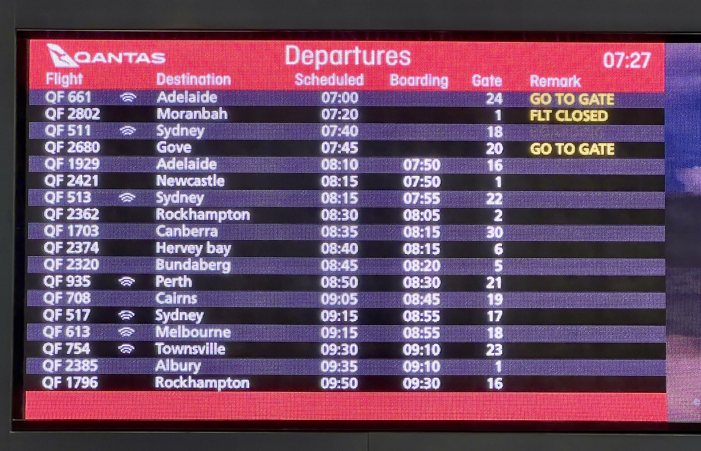

# Caching (Redis) & its bugs

*A cache is a fast copy of slow-to-fetch data - and every copy can drift from the original. Stale prices, ghost edits that revert, bugs that 'fix themselves' in exactly five minutes: all signatures of caching, and all diagnosable once you know to ask what sits between the user and the database.*

> A user edits their profile photo, sees the old one, files a bug. Fifteen minutes later it "fixes
> itself." Support closes the ticket: "cannot reproduce." Next week, same thing, different user. No
> error, no crash, no failed request anywhere in the logs - because nothing failed. Every component
> did exactly its job. The old photo was served from a cache that didn't know about the edit yet, and
> the "fix" was just a timer quietly expiring. Caching is the single biggest producer of bugs that
> look like magic - until you know the trick.

> **In real life**
>
> An airport departure board. The real, authoritative flight data lives deep in the airline's
> operations system - but ten thousand travelers can't all phone the operations desk every thirty
> seconds, so the terminal shows a BOARD: a fast, glanceable copy that everyone reads instead. The
> board is refreshed on a schedule, and between refreshes it is - by design - allowed to be slightly
> behind reality. Almost always that's fine. But if a gate changes right after a refresh, the board is
> now confidently wrong, travelers act on stale data, and someone sprints to gate 24 for a flight
> that moved to gate 7. Nobody at the airline made an error; the COPY was just older than the truth.
> That is a cache, and that sprint to the wrong gate is a caching bug.

**Cache (and Redis)**: A cache is a fast storage layer that keeps a COPY of data whose authoritative version lives somewhere slower - typically the database. Reads check the cache first: finding the value there is a HIT (fast, no database trip); not finding it is a MISS (fetch from the source, store the copy for next time). Because the copy can drift from the source, every cached value carries a freshness policy - usually a TTL (time-to-live) after which it expires and is re-fetched, and/or explicit INVALIDATION where writes to the source also delete or update the copy. Redis is the most common dedicated cache in web systems: an extremely fast in-memory data store that app servers share, sitting between them and the database.

## How caching works, and where the bugs hide

- **A cache exists because the real source is slow or expensive.** Rendering a product page might
  need five database queries; caching the result means the next thousand visitors get it in a
  millisecond. The speed is real - so is the new failure mode: serving copies.
- **Hit vs miss is the core vocabulary.** Hit: the value was in the cache and got served without
  touching the database. Miss: it wasn't, so the system paid the slow trip and stored the result.
  Miss-then-hit patterns explain "first load slow, second load instant" - which is normal, not a bug.
- **TTL (time-to-live) is the freshness budget.** Each entry expires after a set interval - 60
  seconds, 5 minutes, an hour. Until it expires, the system will confidently serve it EVEN IF the
  database has since changed. That gap between copy and truth is where the whole bug family lives.
- **Invalidation is the correct fix, and famously hard.** When data changes, well-built systems
  delete or update the affected cache entries at write time. Miss one path that writes the data -
  an admin tool, a bulk import, a second service - and that path's changes go invisible until TTL.
- **Redis is a SHARED cache; browser caches are per-user; CDNs cache per-region.** Real systems
  stack several layers. "Which cache is stale?" is a genuine diagnostic question - a user seeing
  old data might be fighting their own browser cache, the app's Redis, or a CDN edge node.
- **Redis often holds more than cached reads.** Sessions (see the load-balancer note's vanishing
  login), rate-limit counters, and job queues commonly live there too - so "Redis was down for two
  minutes" can mean logouts and duplicate jobs, not just slow pages.

> **Tip**
>
> When a "wrong data" bug report comes in, immediately ask: how long does the wrongness last, and does
> it end on its own? A wrong value that consistently corrects itself after a fixed interval - five
> minutes, an hour - with no deploy and no intervention is a stale cache with that TTL, close to
> proof. Note the interval in your report; a developer can usually match it to a specific cache
> config line within minutes.

> **Common mistake**
>
> Verifying a fix by looking at the database. The bug says "user sees old price"; someone updates the
> data; you check the DB row - correct! - and close the ticket. But users don't read the database,
> they read what the app serves, and the app serves the cache. If nothing invalidated the cached
> entry, the DB is right, your ticket is closed, and every real user still sees the old price until
> TTL. Always verify through the same path users take - the rendered page or the API response, not
> the underlying row.


*Flight departure board at Brisbane Airport — Kgbo, Wikimedia Commons, CC BY-SA 4.0. [Source](https://commons.wikimedia.org/wiki/File:Flight_departure_board_at_Brisbane_Airport,_December_2022.jpg)*
- **The board itself — a cache in front of the real system** — Authoritative flight data lives in the airline's operations system; thousands of travelers read this fast copy instead. Exactly a cache: one glanceable layer absorbing reads so the slow, true source doesn't have to answer everyone.
- **The clock — freshness is everything** — The board is only as current as its last refresh. A cached value has the same property: between updates it is ALLOWED to be behind reality. The question for any cache is never 'is it fast' - it's 'how old can this get before it hurts someone'.
- **GO TO GATE — a freshly updated entry** — This remark just changed, and the board reflects it: the write reached the copy. This is invalidation working - data changed at the source AND the visible layer was updated with it.
- **FLT CLOSED — act on stale data and you miss the plane** — If this remark lagged reality by two minutes, travelers would sprint to a gate that already closed. Stale cached data doesn't error - it confidently misleads. Users acting on a stale price, stock count, or permission is the same sprint.
- **The gate column — the value everyone actually reads** — Nobody phones operations to confirm a gate; the board IS the truth as far as travelers are concerned. Users treat your app's rendered output the same way - which is why 'the database is correct' never closes a stale-data bug.

**The ghost edit: why the profile photo 'came back' - press Play**

1. **The product page is cached in Redis with a 15-minute TTL** — Five DB queries collapse into one instant cached read - the page is fast, everyone is happy.
2. **An admin fixes a typo in the product name via a bulk-import tool** — The import writes straight to the database. The team's normal edit screen invalidates the cache on save - but the import tool was built later, by another team, and doesn't.
3. **Users keep seeing the typo; the admin re-checks the DB - it's fixed there!** — Both are 'right': the DB has the new name, the cache confidently serves the old one. A bug with no error anywhere in any log.
4. **14 minutes later the entry expires; the typo vanishes 'on its own'** — Nobody deployed, nobody fixed anything - a timer ran out. The ticket gets closed as 'cannot reproduce' unless a tester recognized the fixed-interval signature and asked what the TTL was.

The whole bug family in one runnable script - a TTL cache, a write that skips invalidation, the
stale window, the self-fix, and the correct write path:

*Run it - a stale cache serving old prices until its TTL expires (Python)*

```python
database = {"price:widget": 19.99}          # the system of record (slow, always right)
cache = {}                                   # the cache (fast, sometimes stale)
TTL = 60                                     # seconds a cached value is trusted

def read_price(now):
    """Read through the cache: hit if fresh, otherwise fetch from DB and store."""
    entry = cache.get("price:widget")
    if entry and now - entry["stored_at"] < TTL:
        return entry["value"], "cache HIT"
    value = database["price:widget"]         # the slow trip to the real source
    cache["price:widget"] = {"value": value, "stored_at": now}
    return value, "cache MISS -> read from DB, stored in cache"

print("t=0s   first visitor:", read_price(0))
print("t=10s  second visitor:", read_price(10))

print()
print("t=20s  admin updates the price in the DB to 24.99 - but nobody touches the cache")
database["price:widget"] = 24.99

value, how = read_price(30)
print(f"t=30s  visitor sees {value} ({how})  <- STALE! DB already says 24.99")
value, how = read_price(55)
print(f"t=55s  visitor sees {value} ({how})  <- still stale, still 'passing' tests")

value, how = read_price(65)
print(f"t=65s  visitor sees {value} ({how})  <- TTL expired, bug 'fixed itself'")

print()
print("--- same update, done right: invalidate the cache when the DB changes ---")
database["price:widget"] = 29.99
cache.pop("price:widget", None)              # write-side invalidation
value, how = read_price(70)
print(f"t=70s  visitor sees {value} ({how})")
print()
print("Tester's takeaway: a wrong value that corrects itself after a fixed interval,")
print("with no deploy and no fix, is the signature of a stale cache with a TTL.")
print("Note the exact wrongness-window and ask what caches sit between user and DB.")
```

The same cache, the same stale window, in Java - one deliberate simplification: the cache entry is
just a `double[]{value, storedAt}` pair, because the mechanics matter here, not the data structure:

*Run it - a stale cache serving old prices until its TTL expires (Java)*

```java
import java.util.*;

public class Main {
    static Map<String, Double> database = new HashMap<>(Map.of("price:widget", 19.99));
    static Map<String, double[]> cache = new HashMap<>(); // value, storedAt
    static final int TTL = 60; // seconds a cached value is trusted

    static String readPrice(int now) {
        double[] entry = cache.get("price:widget");
        if (entry != null && now - entry[1] < TTL) {
            return entry[0] + " (cache HIT)";
        }
        double value = database.get("price:widget"); // the slow trip to the real source
        cache.put("price:widget", new double[]{value, now});
        return value + " (cache MISS -> read from DB, stored in cache)";
    }

    public static void main(String[] args) {
        System.out.println("t=0s   first visitor: " + readPrice(0));
        System.out.println("t=10s  second visitor: " + readPrice(10));

        System.out.println();
        System.out.println("t=20s  admin updates the price in the DB to 24.99 - but nobody touches the cache");
        database.put("price:widget", 24.99);

        System.out.println("t=30s  visitor sees " + readPrice(30) + "  <- STALE! DB already says 24.99");
        System.out.println("t=55s  visitor sees " + readPrice(55) + "  <- still stale, still 'passing' tests");
        System.out.println("t=65s  visitor sees " + readPrice(65) + "  <- TTL expired, bug 'fixed itself'");

        System.out.println();
        System.out.println("--- same update, done right: invalidate the cache when the DB changes ---");
        database.put("price:widget", 29.99);
        cache.remove("price:widget"); // write-side invalidation
        System.out.println("t=70s  visitor sees " + readPrice(70));

        System.out.println();
        System.out.println("Tester's takeaway: a wrong value that corrects itself after a fixed interval,");
        System.out.println("with no deploy and no fix, is the signature of a stale cache with a TTL.");
        System.out.println("Note the exact wrongness-window and ask what caches sit between user and DB.");
    }
}
```

### Your first time: Your mission: catch a cache in the act

- [ ] Open any app you test, load a data-heavy page twice, and compare load times in devtools — A dramatically faster second load is your first evidence of caching somewhere - browser, app, or both.
- [ ] Check the response headers for cache clues — Look for Cache-Control, Age, ETag, X-Cache (HIT/MISS), or CF-Cache-Status - these tell you which layer served the response and how old it is.
- [ ] Change a piece of data you control, then check how long the OLD value keeps appearing — Edit your profile name or a test record, then reload the pages that display it. Anywhere the old value lingers, you've found a cached surface - time how long it takes to catch up.
- [ ] Ask a developer two questions: 'What lives in Redis?' and 'What are the main TTLs?' — The answers give you a map of every place stale data is POSSIBLE, plus the exact intervals to recognize in future bug reports - five minutes of conversation that pays off for months.

You now have the two facts that turn "weird data bug" into "stale cache, TTL is N minutes, here's
the surface that isn't invalidated" - the difference between a mystery ticket and a diagnosis.

- **A user's edit doesn't appear after saving - but the save succeeded, and the database has the new value.**
  Classic missed invalidation. Verify through the user's path (rendered page / API response), not the DB. Time how long the old value persists: if it corrects after a consistent interval, that's the TTL. Then find which write path was used - the bug is usually that ONE writer (an admin tool, bulk import, another service) skips the cache invalidation the normal path does.
- **A bug 'fixes itself' after a few minutes, repeatedly, and nobody can reproduce it on demand.**
  Treat the self-fix interval as evidence, not relief. Reproduce by making a change and immediately reading it back through the app within the suspected TTL window. Report the exact wrongness-window - 'stale for exactly ~5 minutes after any price change' matches a config line, 'sometimes shows old data' matches nothing.
- **Two users (or two browser tabs) see different data at the same moment for the same record.**
  Multiple cache layers disagreeing: one user hits a warm cache entry, the other a fresh one - or a CDN edge in one region updated and another didn't. Capture BOTH responses' cache headers (Age, X-Cache) side by side; the difference usually names the guilty layer outright.
- **After a Redis outage or restart, users are logged out, pages are slow, and some actions ran twice.**
  Redis usually holds more than cached reads: sessions vanish (logouts), every read is a miss until the cache re-warms (slowness), and rate-limit counters or queued jobs reset (duplicates). Test-plan the recovery path explicitly - what SHOULD survive a cache flush, and does it? A cache flush should never lose real data; if it does, something is using the cache as a database, which is a serious finding.

### Where to check

- **Response headers on the affected request** — `Cache-Control`, `Age`, `ETag`, `X-Cache: HIT/MISS`, `CF-Cache-Status`; they identify which layer served the response and how old the copy is.
- **The same data through a DIFFERENT path** — the API directly vs the rendered page, or an incognito window vs your normal one; disagreement between paths localizes which layer is stale.
- **The cache config or the dev who owns it** — what's cached in Redis, each key family's TTL, and which write paths invalidate; the missed-invalidation bug is a diff between 'paths that write' and 'paths that invalidate'.
- **Redis itself, if you have access** — a dev can check a specific key's value and remaining TTL in seconds while the bug is live; watching a stale key with 213 seconds left on its TTL is the whole diagnosis.
- **[[system-design-for-testers/scaling-building-blocks/load-balancers]]** — the other half of this story: sessions in Redis exist precisely so any server in the pool can read them, and per-server in-memory caches behind a balancer are how two refreshes can disagree.

### Worked example: the price that reverted - a sale that kept un-happening

1. Marketing launches a flash sale: widget drops from 49.99 to 29.99. Within minutes, support gets
   tickets: some users see the sale price, others still see 49.99 - and some saw 29.99, refreshed,
   and watched it JUMP BACK to 49.99.
2. A tester reproduces the jump-back and grabs headers on both responses: the 29.99 response says
   `X-Cache: MISS`, the 49.99 one says `X-Cache: HIT` with `Age: 214`. Same URL, same second -
   different cache entries. The price didn't revert; a 49.99 copy from before the sale was still
   being served from cache.
3. Why do some users consistently see the right price? Cross-checking with the load-balancer
   lesson: several app servers each keep a small local in-memory cache ON TOP of Redis. Servers
   that happened to fill their local copy after the price change serve 29.99; servers holding a
   pre-sale copy serve 49.99 - and the balancer shuffles users between them, producing the
   maddening flip-flop.
4. The team's normal product-edit screen invalidates Redis on save - but the flash-sale price was
   set by a scheduled job that writes the DB directly and invalidates nothing; and NOTHING
   invalidates the per-server local caches except their own 300-second TTL (matching `Age: 214`).
5. Finding: "Price changes made by the scheduler are invisible until TTL on two cache layers
   (Redis + per-server local, 300s). Repro: change any price via the scheduler, read the product
   page within 5 minutes across multiple refreshes. Recommend: scheduler must invalidate like the
   edit screen does, and add a test that changes data through EVERY write path and immediately
   reads it back through the user path." One bug report, an architecture lesson, and a permanent
   new test-design rule - because the tester read cache headers instead of shrugging.

**Quiz.** A user reports their shipping address change 'didn't work' - the checkout page still shows the old address. You check the database: the new address is there. What's the correct next step?

- [ ] Close the ticket - the database proves the change worked
- [ ] Re-open the app's edit form to confirm it saves correctly, then close if it does
- [x] Verify through the user's actual path: load the checkout page itself, and if it shows the old address, time how long it takes to show the new one and check response headers for cache evidence
- [ ] Ask the user to clear cookies and try a different browser

*The database being correct is exactly what a missed-invalidation bug looks like: the write reached the source of truth while a cached copy keeps being served to the user. Users read the app's output, not the database, so verification must happen through the same path they use. Timing the staleness window and grabbing cache headers converts the ticket from 'cannot reproduce, DB is fine' into 'checkout page serves a cached address that isn't invalidated on edit; stale for ~N minutes.' Closing on DB evidence ships the bug; re-testing the edit form tests a path already known to work; clearing cookies might accidentally 'fix' one user while leaving the defect for everyone else.*

- **What a cache is, in one line** — A fast COPY of data whose authoritative version lives somewhere slower - great for speed, and the source of every 'stale data' bug, because copies can drift from the truth.
- **Cache hit vs cache miss** — Hit: value found in the cache, served fast, no trip to the source. Miss: not found - pay the slow fetch, store the copy for next time. 'First load slow, second instant' is a miss-then-hit, and is normal.
- **TTL (time-to-live)** — The freshness budget: how long a cached entry is trusted before being re-fetched. Until it expires, the system serves the copy even if the source has changed - the stale window where the bug family lives.
- **Cache invalidation** — Deleting/updating cached copies when the source data changes. The classic bug: MOST write paths invalidate, but one (admin tool, bulk import, scheduler, another service) doesn't - its changes go invisible until TTL.
- **The 'fixes itself' signature** — A wrong value that corrects itself after a consistent fixed interval, with no deploy or intervention, is a stale cache expiring. Report the exact interval - it matches a TTL config a dev can find in minutes.
- **Why 'the DB is correct' never closes a stale-data bug** — Users read what the app serves (the cache), not the database. Verification must go through the user's path - the rendered page or API response - or you're testing a component users never see.
- **What Redis typically holds besides cached reads** — Sessions, rate-limit counters, queues/jobs. So a Redis outage means logouts, slow re-warming, and duplicate or lost jobs - a recovery path worth testing on purpose, not discovering in production.

### Challenge

In the app you test, find every distinct WRITE path for one piece of user-visible data - the normal
edit screen, any admin tool, any bulk import, any API, any scheduled job. Change the data through
each path in turn, and immediately read it back through the user-facing page. Record per path: did
the change appear instantly, after a delay (how long exactly?), or only after you forced a refresh?
Any path with a delay the others don't have has a missing invalidation - which is a bug report
waiting to be written, found without a single error message.

### Ask the community

> Users of our app see `[old data]` for about `[interval]` after changes made via `[write path]`, while changes via `[other path]` appear instantly. Response headers show `[cache header findings]`. Does this pattern point to a missed cache invalidation on that write path, and what should I ask the devs to check in `[Redis/CDN/etc]`?

The magic ingredients are the exact staleness interval and which write path triggers it - those two
facts usually let someone name the guilty cache layer and the missing invalidation hook in one reply.

- [Redis — Official Getting Started Guide](https://redis.io/docs/latest/develop/get-started/)
- [AWS — What Is Caching and How It Works](https://aws.amazon.com/caching/)
- [Fireship — Redis in 100 Seconds](https://www.youtube.com/watch?v=G1rOthIU-uo)

🎬 [Fireship — Redis in 100 Seconds](https://www.youtube.com/watch?v=G1rOthIU-uo) (2 min)

- A cache is a fast copy of slower authoritative data; hits skip the source, misses pay the trip and store the copy - speed bought at the price of possible staleness.
- TTL defines how stale a value is ALLOWED to get; explicit invalidation on writes is the correct fix, and the classic bug is one write path that forgets to invalidate.
- A wrong value that corrects itself after a fixed interval with no fix deployed is a stale cache expiring - report the exact interval, it maps to a TTL config line.
- Never verify a data bug against the database alone: users read the served output, so a correct DB row plus a stale cache is still a live bug.
- Redis commonly holds sessions, counters, and queues too - cache outages cause logouts and duplicate jobs, and the recovery path deserves its own tests.
- Real systems stack cache layers (browser, app/Redis, CDN, even per-server memory) - cache headers and cross-path comparisons tell you WHICH layer is the stale one.


## Related notes

- [[Notes/system-design-for-testers/scaling-building-blocks/load-balancers|Load balancers]]
- [[Notes/system-design-for-testers/the-big-picture/frontend-backend-and-the-database|Frontend, backend & the database]]
- [[Notes/system-design-for-testers/the-big-picture/life-of-a-request-end-to-end|Life of a request, end to end]]


---
_Source: `packages/curriculum/content/notes/system-design-for-testers/scaling-building-blocks/caching-redis-and-its-bugs.mdx`_
