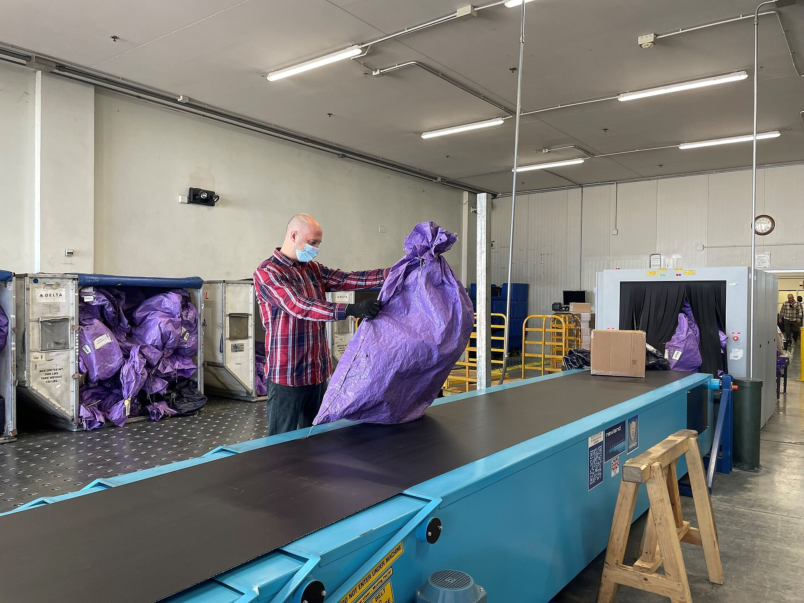

# Message queues & async work

*A message queue lets the app say 'done!' to the user while the real work waits in line for a background worker. That split - respond now, work later - is why checkouts feel instant, and why 'the email never came', silent backlogs, and double-charged retries are their own bug family.*

> You click "Place order." The success page appears in under a second. But the confirmation email
> takes forty seconds, the warehouse gets the pick-list two minutes later, and the loyalty points show
> up tomorrow. One click - and work that clearly happened at four different times. That's not sloppy
> engineering, it's a deliberate design: the app did the bare minimum while you waited, and put
> everything else in a line for later. The line is called a message queue, and once you know it's
> there, a whole family of "sometimes things just don't happen" bugs stops being spooky and starts
> being testable.

> **In real life**
>
> A mail center. Dropping a letter in the slot takes three seconds, and then you LEAVE - you don't
> stand there watching it get sorted, trucked, and delivered. Behind the counter, sacks of mail pile
> up in containers, a clerk feeds them onto a conveyor at a steady pace, and each item eventually
> passes through processing. If the clerks go home early, mail doesn't bounce or error - it just
> quietly piles up, and nobody who dropped a letter knows. If a clerk drops a sack halfway through and
> it gets re-run, some letters might go through the machine twice. Sender walks away instantly, work
> happens later at the worker's own pace, backlogs are silent, and retries can double-process - that
> is a message queue, all four behaviors included.

**Message queue (async work)**: A message queue is a holding line for work between two parts of a system: PRODUCERS append messages describing work to do (send this email, resize this image, sync this order) and immediately move on, while CONSUMERS (background workers) pull messages off the line and process them at their own pace, seconds or minutes later. This decouples the user-facing request - which stays fast because it only enqueues - from the slow work itself. The trade: work is now asynchronous (no guarantee WHEN it happens), backlogs grow silently if workers fall behind or die, and delivery is typically at-least-once, meaning a message can be processed twice after a crash or timeout - so consumers must be safe to re-run (idempotent). Common implementations: RabbitMQ, Kafka, AWS SQS, and Redis-backed job queues.

## How async work changes what "done" means

- **The request only promises the work was QUEUED, not done.** Checkout returns 200 when the order
  row is saved and the follow-up jobs (email, warehouse sync, points) are enqueued. "Success" now
  means "accepted" - every effect you verify after that has its own, later, completion time.
- **Producers and consumers don't know each other.** The web server enqueues and forgets; workers
  pull whenever they're free. That's the decoupling that keeps the site fast under load - a spike
  of 10,000 orders makes the QUEUE longer, not the checkout slower.
- **Backlogs are silent by design.** If workers crash or fall behind, producers keep enqueueing
  successfully. Nothing errors. Users just experience "the email never came" or "my export has been
  'processing' for an hour" - some of the hardest bug reports to trace unless you know to ask for
  the queue depth.
- **Delivery is at-least-once, not exactly-once.** When a worker dies mid-job (or just times out),
  the message gets redelivered and re-processed. If the job isn't idempotent - safe to run twice -
  users get duplicate emails, double charges, twice-shipped orders. The retry path is a first-class
  test target, not an edge case.
- **Order isn't guaranteed either.** With several workers pulling in parallel, message 2 can finish
  before message 1. A flow that silently assumes "the welcome email always lands before the setup
  reminder" has a race condition wearing a business-logic costume.
- **This is why some test failures are really timing failures.** An automated check that asserts
  the email exists 200ms after checkout is racing the queue - it will pass on a quiet system and
  fail under load, flaking exactly when the queue is busiest.

> **Tip**
>
> When testing anything that happens "after" a user action - emails, notifications, exports, syncs,
> points - always establish the EXPECTED delay first. Ask a dev: is this synchronous, or queued? If
> queued, what's the normal lag and where can I see the queue depth? Now "email arrived after 90
> seconds" is data instead of vibes: normal if the SLA is 2 minutes, a backlog symptom if it's 5
> seconds.

> **Common mistake**
>
> Reporting async bugs with no timeline: "the confirmation email doesn't arrive." Doesn't arrive EVER,
> or hadn't arrived YET when you checked, three seconds after clicking? Those are different bugs - the
> first is a lost message or dead worker, the second might be normal queue lag. An async bug report
> without timestamps (action at 14:02:10, checked at 14:02:15, again at 14:10, arrived 14:31) forces
> whoever picks it up to redo your entire investigation just to learn which bug family they're in.


*Fleet Mail Center Naples — U.S. Navy / NAVFAC, Wikimedia Commons, Public domain. [Source](https://commons.wikimedia.org/wiki/File:NAVFAC_Public_Works_Department_Naples_Helps_Get_the_Packages_to_People_(6907418).jpg)*
- **The clerk enqueueing — a producer at work** — Each sack he lifts onto the belt is a message being enqueued: the sender already walked away hours ago, their 'request' accepted in seconds. Producers never wait around to watch the work finish.
- **The conveyor — the queue itself** — Work in transit, in a rough line, heading toward whoever processes it. Its length at any moment is the queue depth - the single most diagnostic number when async things 'just aren't happening'.
- **One box mid-belt — a message in flight** — Enqueued, not yet processed. Right now, the system has promised this work exists but nothing has happened yet - exactly the state your app's confirmation email is in for the first seconds after checkout.
- **Containers of waiting sacks — the backlog** — Producers kept producing while consumers fell behind, and nothing errored - the sacks just piled up silently. A worker outage looks exactly like this: checkouts keep succeeding while the queue quietly grows.
- **The scanner at the end — the consumer** — It processes items at ITS pace, one at a time, indifferent to how fast things were dropped off. And if an item jams and gets re-run, it goes through twice - at-least-once delivery in physical form.

**One click, four completion times - press Play**

1. **14:02:10 - user clicks Place Order; the request saves the order and enqueues 3 jobs** — Response time: 300ms. The user sees the success page. Note what's actually true: order row exists, and three messages sit in a queue. Nothing else has happened.
2. **14:02:41 - a worker picks up 'send confirmation email' and sends it** — 31 seconds of queue lag - invisible and irrelevant to the user experience, entirely visible to a tester asserting the email exists 'immediately'.
3. **14:04:05 - another worker processes 'sync order to warehouse'** — A slower job in a different queue with its own workers. Each async effect has its own timeline - 'the order is placed' is not one moment but several.
4. **14:02:41 again - the email worker crashed after sending, before confirming; the message redelivers** — At 14:07 a retry sends the SAME email again. The user gets two confirmations. Nothing in the checkout flow was wrong - the bug lives entirely in the retry path, where only a tester who knows queues exist will go looking.

The whole lifecycle in one runnable script - instant enqueue, silent backlog, and the
crash-retry duplicate:

*Run it - a queue, a dead worker's silent backlog, and a duplicate email (Python)*

```python
from collections import deque

queue = deque()
sent_emails = []

def producer_checkout(order_id):
    """The web request: charge the card, enqueue the email, respond instantly."""
    queue.append({"type": "order-confirmation", "order": order_id, "attempt": 1})
    return f"order {order_id} placed (HTTP 200 in ~80ms - email NOT sent yet)"

def worker_process_one(fail=False):
    """The background worker: runs later, at its own pace."""
    if not queue:
        return "queue empty - nothing to do"
    msg = queue.popleft()
    if fail:
        # Worker crashed AFTER sending but BEFORE confirming - classic!
        sent_emails.append(f"email for order {msg['order']}")
        msg["attempt"] += 1
        queue.appendleft(msg)  # message re-queued for retry
        return f"worker died mid-job on order {msg['order']} -> message requeued"
    sent_emails.append(f"email for order {msg['order']}")
    return f"processed order {msg['order']} (attempt {msg['attempt']})"

print("--- the happy path: user never waits for the email ---")
print(worker_process_one())
print(producer_checkout("A-101"))
print(producer_checkout("A-102"))
print(f"queue depth: {len(queue)} (work waiting, users long gone)")
print(worker_process_one())
print(worker_process_one())
print(f"emails sent: {sent_emails}")

print()
print("--- bug 1: consumers stop, producers don't - the silent backlog ---")
for i in range(103, 108):
    producer_checkout(f"A-{i}")
print(f"5 more orders placed, workers down. queue depth: {len(queue)}")
print("Every checkout still returns 200. No user sees an error - the emails")
print("just... never arrive. The bug report says 'emails are slow sometimes'.")

print()
print("--- bug 2: crash between doing and confirming = duplicate delivery ---")
print(worker_process_one(fail=True))
print(worker_process_one())  # the retry runs - and sends the email AGAIN
dupes = [e for e in sent_emails if sent_emails.count(e) > 1]
print(f"emails sent so far: {len(sent_emails)}, duplicates: {sorted(set(dupes))}")
print()
print("Queues promise AT-LEAST-once delivery, not exactly-once. Anything a worker")
print("does must be safe to repeat (idempotent) - or users get double emails,")
print("double charges, double shipments. Test the retry path on purpose.")
```

The same queue in Java - `ArrayDeque` instead of `deque`, identical mechanics, identical
duplicate email at the end:

*Run it - a queue, a dead worker's silent backlog, and a duplicate email (Java)*

```java
import java.util.*;

public class Main {
    static Deque<Map<String, Object>> queue = new ArrayDeque<>();
    static List<String> sentEmails = new ArrayList<>();

    static String producerCheckout(String orderId) {
        // The web request: charge the card, enqueue the email, respond instantly
        Map<String, Object> msg = new HashMap<>();
        msg.put("type", "order-confirmation");
        msg.put("order", orderId);
        msg.put("attempt", 1);
        queue.addLast(msg);
        return "order " + orderId + " placed (HTTP 200 in ~80ms - email NOT sent yet)";
    }

    static String workerProcessOne(boolean fail) {
        // The background worker: runs later, at its own pace
        if (queue.isEmpty()) return "queue empty - nothing to do";
        Map<String, Object> msg = queue.pollFirst();
        if (fail) {
            // Worker crashed AFTER sending but BEFORE confirming - classic!
            sentEmails.add("email for order " + msg.get("order"));
            msg.put("attempt", (int) msg.get("attempt") + 1);
            queue.addFirst(msg); // message re-queued for retry
            return "worker died mid-job on order " + msg.get("order") + " -> message requeued";
        }
        sentEmails.add("email for order " + msg.get("order"));
        return "processed order " + msg.get("order") + " (attempt " + msg.get("attempt") + ")";
    }

    public static void main(String[] args) {
        System.out.println("--- the happy path: user never waits for the email ---");
        System.out.println(workerProcessOne(false));
        System.out.println(producerCheckout("A-101"));
        System.out.println(producerCheckout("A-102"));
        System.out.println("queue depth: " + queue.size() + " (work waiting, users long gone)");
        System.out.println(workerProcessOne(false));
        System.out.println(workerProcessOne(false));
        System.out.println("emails sent: " + sentEmails);

        System.out.println();
        System.out.println("--- bug 1: consumers stop, producers don't - the silent backlog ---");
        for (int i = 103; i <= 107; i++) producerCheckout("A-" + i);
        System.out.println("5 more orders placed, workers down. queue depth: " + queue.size());
        System.out.println("Every checkout still returns 200. No user sees an error - the emails");
        System.out.println("just... never arrive. The bug report says 'emails are slow sometimes'.");

        System.out.println();
        System.out.println("--- bug 2: crash between doing and confirming = duplicate delivery ---");
        System.out.println(workerProcessOne(true));
        System.out.println(workerProcessOne(false)); // the retry runs - and sends the email AGAIN

        Set<String> seen = new HashSet<>();
        Set<String> dupes = new TreeSet<>();
        for (String e : sentEmails) if (!seen.add(e)) dupes.add(e);
        System.out.println("emails sent so far: " + sentEmails.size() + ", duplicates: " + dupes);

        System.out.println();
        System.out.println("Queues promise AT-LEAST-once delivery, not exactly-once. Anything a worker");
        System.out.println("does must be safe to repeat (idempotent) - or users get double emails,");
        System.out.println("double charges, double shipments. Test the retry path on purpose.");
    }
}
```

### Your first time: Your mission: map the async work behind one user action

- [ ] Pick one action in your app that triggers follow-up effects — Checkout, signup, password reset, report export - anything where something 'happens later' (an email, a file, a sync).
- [ ] Perform it and timestamp everything — Note the exact time of the click, then the exact arrival time of each effect. Even rough timestamps turn 'it felt slow' into a measurable lag per effect.
- [ ] Ask a developer which of those effects go through a queue — And the follow-ups: what's the expected lag, which queue/worker handles each one, and where can queue depth be seen (an admin dashboard, RabbitMQ management UI, a metrics page)?
- [ ] Ask the money question: 'What happens if a worker dies halfway through this job?' — The answer reveals whether the retry path is idempotent - and whether anyone has ever actually tested it. 'Hmm, good question' is a finding.

You now have an async map for one flow: which effects are queued, their normal lags, and where the
backlog would show. Next time "the email didn't come," you'll know exactly which number to look at
first.

- **Confirmation emails / notifications / exports 'sometimes never arrive', with zero errors anywhere.**
  First question: is anything consuming the queue? A dead or stuck worker produces exactly this - producers keep succeeding, the backlog grows silently. Ask for the queue depth over time (or a dashboard screenshot): a climbing line with flat consumption is a dead-worker diagnosis in one glance. Report WHEN the backlog started growing; it usually matches a deploy or an infra event.
- **Users occasionally receive the same email twice, or - much worse - get charged twice.**
  At-least-once delivery meeting a non-idempotent job: a worker crashed or timed out between doing the work and acknowledging the message, so it redelivered and re-ran. Repro deliberately: ask a dev to kill the worker mid-job in a test environment (or use the queue's redelivery tooling) and observe whether the effect repeats. Duplicate-producing jobs that move money are severity-critical regardless of how rare the crash is.
- **An automated test asserting an async effect passes locally but flakes in CI, failing maybe once in five runs.**
  The test is racing the queue - asserting the email/record exists a fixed few hundred ms after the action, which loses whenever workers are momentarily busy. Fix the test to poll with a sensible timeout matched to the effect's real SLA instead of a fixed sleep, and treat the flake as information: it told you which assertions sit downstream of a queue.
- **Things happen out of order - a 'your setup is incomplete' reminder arrives before the welcome email, or a cancellation email after a refund email.**
  Parallel workers mean no cross-message ordering guarantee; any flow that ASSUMES ordering has a latent race. Repro by loading the queue (bulk actions) to widen the timing window. The fix on the dev side is explicit sequencing (one message triggers the next) - the test-side lesson is to probe every 'A then B' assumption in async flows.

### Where to check

- **The queue's own dashboard** — RabbitMQ management UI, Kafka consumer-lag metrics, SQS queue attributes, or a Redis job-queue admin page; queue depth and its trend over time is THE diagnostic number for async bugs.
- **Worker logs, filtered by the job type** — did the job run, when, how many attempts, and what did attempt numbers greater than 1 do differently?
- **A dead-letter queue, if one exists** — where messages go after exhausting retries; a growing dead-letter queue is a pile of user-visible failures nobody has read yet, and checking it is a legitimate standing test activity.
- **Timestamps end to end** — action time vs effect time across several runs; the lag distribution tells you what 'normal' is, so you can recognize 'abnormal' instead of guessing.
- **[[system-design-for-testers/scaling-building-blocks/caching-redis-and-its-bugs]]** — Redis often hosts these job queues, so a Redis incident hits queued work and cached reads at the same time; the two bug families arrive together.

### Worked example: the double-charge that only hit during the flash sale

1. During a flash sale, three customers report being charged twice for one order. Outside sale
   hours, nobody can reproduce it - single orders always charge once. The payment code hasn't
   changed in months.
2. A tester maps the flow: checkout enqueues a 'capture payment' job; a worker captures the charge,
   then acknowledges the message. Under normal load the whole job takes 2 seconds.
3. Timing hypothesis: during the sale, the payment provider slowed to 40+ seconds per capture - and
   the queue's visibility timeout (how long a message stays invisible while a worker holds it) is
   30 seconds. So the message REAPPEARED while the first worker was still mid-capture, a second
   worker picked it up, and both captures succeeded. Crash not required - a timeout is enough.
4. Repro in staging: add an artificial 35-second delay to the payment-provider stub, place one
   order, watch two captures fire. Reproduces every time. Outside the delay, never - matching
   production perfectly.
5. Finding: "Payment capture is not idempotent and the job exceeds the queue's visibility timeout
   under provider slowdown, causing double charges - repro attached. Recommend an idempotency key
   on capture (provider-side dedupe) plus a visibility timeout above worst-case capture time."
   Severity critical, root cause architectural, repro deterministic - from a bug that looked like
   a once-in-a-blue-moon ghost, because the tester knew redelivery doesn't need a crash.

**Quiz.** During load testing, order confirmations that normally arrive in seconds start taking 20+ minutes, but every checkout still returns success instantly and no errors appear in any log. What's the most likely explanation?

- [ ] The email service is down, and checkouts should be failing but aren't
- [x] Workers consuming the email queue can't keep up with (or stopped consuming) the enqueue rate, so the backlog is growing silently while producers keep succeeding
- [ ] The load test is generating invalid email addresses, so sends fail quietly
- [ ] The database is overloaded, which slows down the checkout transaction itself

*This is the silent-backlog signature: producers (checkouts) keep enqueueing successfully - that's WHY there are no errors and checkout stays fast - while consumers fall behind, so each message waits longer before a worker reaches it. Growing delay with zero errors and healthy user-facing responses points at queue depth, not at a hard failure. A fully down email service would eventually surface errors in worker logs and nothing would arrive at all; invalid addresses would show explicit send failures; and a slow database would slow the checkout response itself, which is explicitly described as still instant.*

- **What a message queue does for a user-facing request** — The request only saves the essentials and ENQUEUES the slow work, returning fast; background workers process the queued jobs later at their own pace. 'Success' means accepted, not finished.
- **Producer / consumer / queue depth** — Producers append work messages; consumers (workers) pull and process them; queue depth is how many messages are waiting - the single most diagnostic number when async effects go missing.
- **Why backlogs are silent** — Dead or slow workers don't make producers fail - enqueueing keeps succeeding, so there are no errors anywhere while work quietly piles up. Users experience 'it just never happened'.
- **At-least-once delivery** — Queues redeliver a message if the worker crashes or exceeds the visibility timeout before acknowledging - so any job can run TWICE. No crash required; a slow job is enough.
- **Idempotency, and why testers care** — A job is idempotent if running it twice has the same effect as once. Non-idempotent jobs + redelivery = duplicate emails, double charges, double shipments. The retry path is a first-class test target.
- **The async bug report essentials** — Timestamps: when the action happened, when you checked, when (if ever) the effect arrived. 'Never arrived' vs 'hadn't arrived yet' are different bug families, and timestamps are what separates them.
- **Why async assertions flake in CI** — A fixed-delay assertion races the queue: it wins on a quiet system, loses under load. Poll with a timeout matched to the effect's real SLA instead - and note which assertions turned out to sit behind queues.

### Challenge

Take one queued effect in your app (an email, a sync, an export) and write down its failure map:
(1) What does the user see if the message is never processed? (2) What happens if it's processed
twice - is the job idempotent, and how do you know? (3) What's the expected lag, and at what lag
would you call it a bug? (4) Where would you LOOK to tell a dead worker from a slow one? If you
can't answer one of the four, that's your next conversation with a developer - and possibly your
next bug report.

### Ask the community

> Our app processes `[effect]` through a queue (`[RabbitMQ/Kafka/SQS/Redis jobs, if known]`). I'm seeing `[symptom: delays/duplicates/never-arrives]` with timestamps `[your timeline]`. What should I check first to distinguish a backlog, a dead worker, or a redelivery issue - and what's the standard way to test the retry path deliberately?

Include your timeline and whether ANYTHING errored (usually: nothing did) - async bugs are diagnosed
almost entirely from timing patterns, and the folks who run these queues can often name the failure
mode from the shape of your timestamps alone.

- [AWS — What Is a Message Queue?](https://aws.amazon.com/message-queue/)
- [RabbitMQ — Official 'Hello World' Tutorial (queues in practice)](https://www.rabbitmq.com/tutorials/tutorial-one-python)
- [Gaurav Sen — What is a MESSAGE QUEUE and Where is it used?](https://www.youtube.com/watch?v=oUJbuFMyBDk)

🎬 [Gaurav Sen — What is a MESSAGE QUEUE and Where is it used?](https://www.youtube.com/watch?v=oUJbuFMyBDk) (10 min)

- A queue splits 'respond to the user' from 'do the work': requests enqueue and return fast; workers process later at their own pace - so success means accepted, not finished.
- Backlogs are silent: dead or slow workers never make producers error, so 'it just never happened' bugs are diagnosed from queue depth and timestamps, not from logs full of exceptions.
- Delivery is at-least-once - crashes AND timeouts cause redelivery - so every queued job must be idempotent, and the retry path deserves deliberate testing, especially where money moves.
- Parallel workers void ordering guarantees: any 'A always happens before B' assumption across queued jobs is a latent race condition.
- Async bug reports live or die on timelines: action time, check times, arrival time (or 'never') - they're what separates queue lag, dead workers, and lost messages.
- Fixed-sleep test assertions on async effects are flake generators - poll against the effect's real SLA, and treat such flakes as a map of where queues live in your system.


## Related notes

- [[Notes/system-design-for-testers/scaling-building-blocks/load-balancers|Load balancers]]
- [[Notes/system-design-for-testers/scaling-building-blocks/caching-redis-and-its-bugs|Caching (Redis) & its bugs]]
- [[Notes/system-design-for-testers/the-big-picture/life-of-a-request-end-to-end|Life of a request, end to end]]


---
_Source: `packages/curriculum/content/notes/system-design-for-testers/scaling-building-blocks/message-queues-and-async-work.mdx`_
