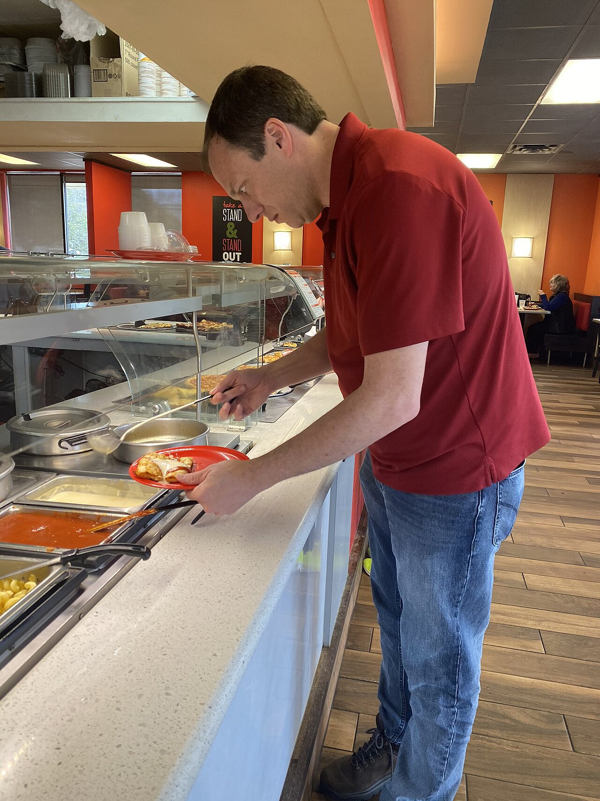

# Client-side vs server-side rendering

*Server-side rendering hands the browser a finished page; client-side rendering hands it raw ingredients (JSON + JavaScript) and makes the browser assemble the page itself. Same visible result, completely different failure modes and completely different places for a tester to look.*

> Two pages both end up showing the same product listing. View source on one and you see the full
> HTML, product names and all. View source on the other and you see a nearly-empty `<div id="root">`
> with a pile of `<script>` tags - the actual content only appears after JavaScript runs. Same result
> on screen, two completely different journeys to get there - and when something breaks, "where do I
> even look" depends entirely on knowing which journey this page took.

> **In real life**
>
> A buffet counter. One diner stands at the counter with a plate, spooning food from steel trays one
> scoop at a time, assembling their own meal, item by item, in front of everyone. Behind them, someone
> else is already SEATED with a fully composed plate in front of them, delivered ready to eat -
> nothing left to assemble. Both people end up with dinner. But if the diner at the counter's spoon
> gets stuck on the mac and cheese tray, THEIR plate stays half-empty while everyone else's, already
> plated, is unaffected. That stuck moment - visibly incomplete, actively still assembling - is
> exactly what client-side rendering looks like when something in the assembly step goes wrong.

**Client-side vs server-side rendering**: Server-side rendering (SSR) means the server builds the complete HTML for a page - with real content already in place - before sending it to the browser; the browser's job is mostly just to display what arrived. Client-side rendering (CSR) means the server sends a mostly-empty HTML shell plus a JavaScript bundle and (usually) a separate data fetch (often JSON from an API); the BROWSER then runs that JavaScript to build the actual page content, assembling it locally after the initial page load. The same final visual result can be produced either way, but the two approaches fail differently: an SSR page that errors usually fails to load AT ALL (a blank page or a server error page) because the failure happens before anything is sent; a CSR page that errors can show a fully-loaded-looking shell with a blank or partially-broken content area, because the SHELL loaded fine and the failure is in the separate assembly step that ran afterward.

## Same result, two different journeys

- **SSR: the finished plate arrives.** The server does the assembly work - pulling data, building
  HTML - and sends something already complete. View-source shows real content. The tradeoff: every
  request costs the server real work, and a slow data fetch delays the WHOLE page from appearing at
  all.
- **CSR: you assemble it yourself, at the counter.** The server sends a near-empty shell fast, then
  the browser runs JavaScript to fetch data and build the page. View-source shows mostly empty
  markup; the "real" DOM only exists after script execution. The tradeoff: the shell can appear
  instantly, but content is genuinely ABSENT until assembly finishes - and assembly can fail in ways
  a finished plate never could.
- **The failure signatures differ, on purpose.** SSR failing usually means nothing showed up at
  all (the server itself choked). CSR failing usually means the SHELL showed up fine, and
  everything after that - loading spinners that never resolve, empty sections, console errors -
  points at the separate client-side assembly step, not the server that served the shell.
- **Hybrid approaches exist and blur this** — many modern frameworks render the FIRST view on the
  server (for speed and SEO) then hand off to client-side JavaScript for subsequent interactions.
  Testing either half separately still matters even when a page uses both.

> **Tip**
>
> "View page source" (not "Inspect element") shows you the ORIGINAL server response, before any
> JavaScript ran - the fastest single check for "was this SSR or CSR?" If the content you see on
> screen is already in view-source, it was server-rendered. If view-source shows almost nothing where
> visible content is, JavaScript built that content client-side, and that's where a bug in it lives.

> **Common mistake**
>
> Assuming a blank or broken section is automatically a "backend" or "data" bug without checking
> which rendering approach produced it. On a CSR page, a blank content area might mean the JavaScript
> that was supposed to build it threw an error and never ran at all - a client-side bug, invisible to
> any server log, and one that "view page source" plus the browser console will reveal in seconds.


*Man at chain buffet restaurant — Wikimedia Commons, CC BY-SA 4.0 (MultiEditor03). [Source](https://commons.wikimedia.org/wiki/File:Man_at_chain_buffet_restaurant.jpg)*
- **The man actively spooning food — client-side assembly, in progress** — His plate isn't finished - it's being built right now, one scoop at a time, at the point of consumption. This is exactly what a CSR page's browser is doing after the shell arrives: fetching and assembling content locally, visibly incomplete until it finishes.
- **The steel trays of raw ingredients — the data/API responses** — Separate components, not yet combined into a meal. In CSR, this is the JSON the browser fetches - the raw material JavaScript will assemble into the page, not the page itself.
- **The woman already seated with a finished plate — server-side rendering** — Her food arrived already composed - nothing left to assemble at the table. That's SSR: the server did the composing before anything reached the 'diner,' so what arrives is already complete.
- **The plate itself, mid-fill — the DOM being built in real time** — Not empty, not finished - actively under construction. If the man's spoon jammed right now, HIS plate stays half-empty while the seated woman's meal is completely unaffected - the same isolation CSR failures have from a server that already sent its part successfully.

**The same page, rendered two different ways - press Play**

1. **SSR: request arrives at the server** — The server fetches the data it needs and builds the FULL HTML — content already in place — before sending anything.
2. **SSR: browser receives complete HTML** — View-source shows the real content immediately. The browser's job is mostly just paint it on screen.
3. **CSR: request arrives, a near-empty shell is sent fast** — View-source shows barely anything - a container div and script tags. The 'real' page doesn't exist yet.
4. **CSR: browser runs JavaScript, fetches data separately** — Now, and only now, does the browser build the actual content - a completely separate step from receiving the shell.
5. **Verdict** — Same visible result, different timing and different failure points: SSR fails at the server, before anything ships. CSR can 'succeed' at shipping the shell and still fail at the separate assembly step afterward.

The core difference, stripped to its essence: does the SERVER hand back finished content, or does
it hand back a shell plus raw data for the CLIENT to assemble? Here's both paths simulated:

*Run it - the same product list, rendered server-side vs client-side (Python)*

```python
products = [{"name": "Wireless Mouse", "price": 19.99}, {"name": "USB-C Hub", "price": 34.50}]

def server_side_render(products):
    # The SERVER builds complete HTML before anything is sent.
    rows = "".join(f"<li>{p['name']} - \${p['price']}</li>" for p in products)
    html = f"<ul>{rows}</ul>"
    return html  # this exact string is what the browser receives

def client_side_shell():
    # The SERVER sends only this - no product data at all.
    return '<div id="root"></div><script src="app.js"></script>'

def client_side_assemble(products):
    # The BROWSER runs this separately, AFTER the shell already arrived.
    rows = "".join(f"<li>{p['name']} - \${p['price']}</li>" for p in products)
    return f"<ul>{rows}</ul>"  # only exists after JS execution succeeds

print("--- SSR: what the browser actually receives from the server ---")
print(server_side_render(products))
print()

print("--- CSR: what the browser receives from the server (view-source would show exactly this) ---")
print(client_side_shell())
print()

print("--- CSR: what the browser builds AFTERWARD, only if its JS runs successfully ---")
print(client_side_assemble(products))
print()
print("Same final list, two totally different points where a failure could occur.")
```

Same two paths in Java - the point being WHEN and WHERE the actual content gets built:

*Run it - the same product list, rendered server-side vs client-side (Java)*

```java
import java.util.*;

public class Main {
    record Product(String name, double price) {}

    static String serverSideRender(List<Product> products) {
        StringBuilder rows = new StringBuilder();
        for (Product p : products) {
            rows.append("<li>").append(p.name()).append(" - $").append(p.price()).append("</li>");
        }
        return "<ul>" + rows + "</ul>";
    }

    static String clientSideShell() {
        return "<div id=\\"root\\"></div><script src=\\"app.js\\"></script>";
    }

    static String clientSideAssemble(List<Product> products) {
        StringBuilder rows = new StringBuilder();
        for (Product p : products) {
            rows.append("<li>").append(p.name()).append(" - $").append(p.price()).append("</li>");
        }
        return "<ul>" + rows + "</ul>";
    }

    public static void main(String[] args) {
        List<Product> products = List.of(
            new Product("Wireless Mouse", 19.99),
            new Product("USB-C Hub", 34.50)
        );

        System.out.println("--- SSR: what the browser actually receives from the server ---");
        System.out.println(serverSideRender(products));
        System.out.println();

        System.out.println("--- CSR: what the browser receives from the server (view-source would show exactly this) ---");
        System.out.println(clientSideShell());
        System.out.println();

        System.out.println("--- CSR: what the browser builds AFTERWARD, only if its JS runs successfully ---");
        System.out.println(clientSideAssemble(products));
        System.out.println();
        System.out.println("Same final list, two totally different points where a failure could occur.");
    }
}
```

### Your first time: Your mission: classify three real pages by how they're rendered

- [ ] Pick any three pages you use regularly (a news site, a web app dashboard, a search engine) — Right-click each and choose 'View Page Source' (not Inspect Element).
- [ ] For each, check whether the actual visible content is already present in the raw source — If yes, that page (or at least this part of it) is server-rendered. If you see mostly empty containers and script tags, it's client-rendered.
- [ ] For at least one CSR page, open DevTools, go to the Network tab, and reload — Watch for a separate data request (often returning JSON) that fires AFTER the initial HTML - that's the assembly step happening.
- [ ] Throttle your network (DevTools has a slow-3G option) and reload the CSR page — Notice the shell can appear fast while content visibly lags behind - a distinctly CSR symptom an SSR page wouldn't show the same way.

You've now told the two rendering approaches apart using nothing but tools already in your browser -
the fastest way to know where a rendering bug is even allowed to live.

- **A page's content is completely missing from 'View Page Source', even though it's visibly on screen.**
  This is expected for a client-rendered page - the content genuinely doesn't exist in the server's response, only after JavaScript builds it. This isn't a bug by itself; it just tells you where to look NEXT: the browser console and Network tab, for the client-side assembly step.
- **A section of a page stays as a loading spinner forever, while the rest of the page works fine.**
  Classic CSR partial-failure: the shell and most of the page assembled fine, but the specific data fetch or component render for THIS section threw an error or never resolved. Check the browser console for a JS error and the Network tab for that section's specific request.
- **A page is completely blank, including things that normally always show (a header, a logo).**
  If even the shell elements are missing, suspect a server-side failure (SSR failing entirely, or CSR's shell itself failing to load) rather than a client-side assembly bug - check the actual HTTP status of the page request itself first.

### Where to check

- **View Page Source (not Inspect Element)** — shows the raw server response before any JavaScript runs; the single fastest SSR-vs-CSR test.
- **DevTools Network tab, watching load order** — a separate data-fetch request firing after the initial HTML is the signature of client-side assembly happening.
- **The browser console** — CSR failures often throw a visible JavaScript error exactly at the point content should have appeared; SSR failures rarely show up here since the failure already happened server-side.
- **Network throttling (DevTools' slow-connection presets)** — makes the gap between "shell arrived" and "content assembled" visible and reproducible on demand.

### Worked example: a 'blank dashboard' bug that was a client-side data fetch, not a server outage

1. Users report the dashboard is "completely blank" after logging in. The on-call engineer's first
   check is the server's health dashboard - everything green, no errors, no elevated response times.
2. A tester reproduces it and immediately checks View Page Source: the page shell (header, nav,
   layout containers) IS present in the raw HTML - so the server responded fine, and this isn't a
   full outage.
3. Opening the browser console reveals a JavaScript error: a null-reference exception thrown while
   trying to render the dashboard's data widgets, right after a fetch that returned an unexpected
   response shape.
4. Checking the Network tab shows the data-fetch request itself: `200 OK`, but the response body's
   structure had changed (a field was renamed in a recent API deploy) - the client-side code
   expected the old shape and crashed trying to read a field that no longer existed under that name.
5. Finding: "Dashboard renders its shell correctly (SSR/initial load unaffected); the client-side
   widget-rendering code throws on the new API response shape from [deploy], leaving the content
   area blank while the rest of the page is fine. Not a server outage - a client-side contract
   mismatch." Found by checking view-source and the console FIRST, instead of assuming a server
   problem from a vague "blank page" report.

**Quiz.** A tester compares two pages: Page A shows real content in 'View Page Source'. Page B shows only an empty container and script tags in 'View Page Source', but the same content appears on screen after a moment. What's the correct read?

- [ ] Page B is broken and Page A is working correctly, since Page B's source is missing content
- [x] Page A is server-side rendered (content built before sending); Page B is client-side rendered (a shell is sent, then JavaScript builds the content afterward) - neither is inherently broken, they're just different rendering approaches with different failure points to check
- [ ] Both pages use the same rendering approach, and the difference is just a caching artifact
- [ ] Page B must be using a slower server than Page A, since its content takes longer to appear

*An empty container in the raw source with content appearing later is the defining signature of client-side rendering - the server intentionally sends a shell, and the browser assembles the real content afterward via JavaScript. This is a normal, common architecture choice, not evidence of brokenness. Option one wrongly treats a CSR page's expected behavior as a defect. Option three misses the actual mechanism difference (rendering approach, not caching). Option four assumes a server-speed explanation when the real difference is WHERE the content gets built, not how fast a server responds.*

- **Server-side rendering (SSR), in one line** — The server builds complete HTML with real content before sending it - view-source shows the actual content immediately.
- **Client-side rendering (CSR), in one line** — The server sends a near-empty shell plus JavaScript; the BROWSER builds the real content afterward, often via a separate data fetch.
- **The fastest SSR-vs-CSR test** — View Page Source (not Inspect Element) - if the visible content is already there, it's SSR; if you see mostly empty containers and scripts, it's CSR.
- **How SSR and CSR fail differently** — SSR failing usually means nothing loads at all (server-side failure, before anything ships). CSR failing can mean the shell loads fine while content silently fails in a separate later step.
- **The buffet analogy for these two approaches** — A diner spooning their own plate at the counter (CSR: assembly happens at the point of consumption, visibly incomplete until done) vs a diner already seated with a finished plate (SSR: fully composed before it ever reached them).

### Challenge

Pick any web app you use and find one page that's clearly client-side rendered (View Page Source
shows mostly empty containers). Open DevTools' Network tab, reload, and identify the specific data
request responsible for the content you see on screen. Then throttle your connection to a slow
preset and reload again - write down what the page looks like in the gap between the shell arriving
and the content finishing, and whether anything communicates to the user that content is still loading.

### Ask the community

> I'm looking at a page where `[describe what you saw - e.g. content missing from view-source but present on screen / a section stuck loading forever]`. View-source shows `[what you found]` and the console shows `[any errors, or 'nothing']`. Is this a rendering-approach quirk or a real bug?

Useful replies usually ask for the exact console error text (if any) and whether the SAME content
appears correctly elsewhere in the app - that combination usually pinpoints whether it's a one-off
client-side bug or a structural rendering-approach question.

- [MDN — Client-side rendering (CSR), glossary definition](https://developer.mozilla.org/en-US/docs/Glossary/CSR)
- [MDN — Server-side rendering (SSR), glossary definition](https://developer.mozilla.org/en-US/docs/Glossary/SSR)
- [Timegame — CSR vs SSR: Is one truly better than the other?](https://www.youtube.com/watch?v=kcBbwl02WCM)

🎬 [Timegame — CSR vs SSR: Is one truly better than the other?](https://www.youtube.com/watch?v=kcBbwl02WCM) (8 min)

- SSR sends complete, ready content; CSR sends a shell plus a separate client-side assembly step - the same visible result, two different journeys.
- View Page Source (not Inspect Element) is the fastest test: real content there means SSR; empty containers and scripts mean CSR.
- SSR failures usually mean nothing loaded at all; CSR failures can mean the shell loaded fine while a separate later step silently failed.
- A blank or stuck-loading section on an otherwise-working page points at the client-side assembly step - check the console and Network tab, not the server.
- Neither approach is inherently broken - the point is knowing which one a given page uses, so you check the right place when something's wrong.


## Related notes

- [[Notes/system-design-for-testers/the-big-picture/frontend-backend-and-the-database|Frontend, backend & the database]]
- [[Notes/system-design-for-testers/the-big-picture/life-of-a-request-end-to-end|Life of a request, end to end]]
- [[Notes/the-internet-and-the-web/browsers-and-page-loading/how-a-page-loads|How a page loads]]


---
_Source: `packages/curriculum/content/notes/system-design-for-testers/the-big-picture/client-side-vs-server-side-rendering.mdx`_
