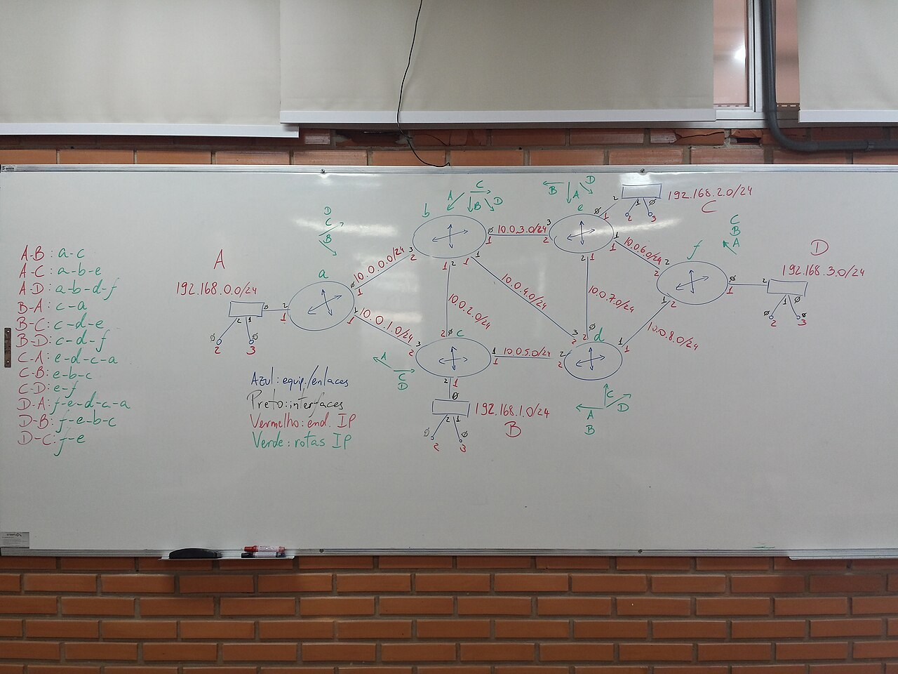

# Reading an architecture diagram

*A box-and-arrow diagram is just a legend plus nodes plus connections — read the legend first, then trace one path start to finish before trying to understand the whole picture at once. The same three-step read works whether the diagram is professional or a hasty whiteboard sketch.*

> A developer shares a screen with a diagram: a dozen boxes, arrows crossing every which way, a
> scribbled legend in the corner nobody reads twice. A tester who freezes up here loses the single
> best free resource this project has - a map straight from the people who built it, showing exactly
> which pieces exist and how they talk to each other. A tester who can read it walks away knowing
> where every future bug could possibly live, in about two minutes.

> **In real life**
>
> A network engineer's whiteboard sketch, mid-lesson: circles for routers, boxes for subnets, lines
> connecting them labeled with addresses, and - critically - a legend off to the side spelling out
> what each color means. Nobody reads this by staring at the whole board at once and hoping
> comprehension arrives. They read the legend first (so the colors mean something), then they trace
> ONE path with a finger - "to get from A to D, you go through a, then e, then f" - before trying to
> understand the whole tangle. That two-step discipline (legend first, one path second) is the entire
> skill of reading an architecture diagram, professional or scribbled.

**Reading an architecture diagram**: Reading an architecture diagram is the skill of extracting a system's real structure from a box-and-arrow drawing, in a fixed order: first locate and read the LEGEND (what each shape, color, or line style represents - a legend-less diagram should be treated with suspicion, since ambiguous notation is itself a red flag about how well-understood the system is); second, identify the NODES (each box or circle is normally one deployable unit - a service, a database, a queue - and its label is its name, not just decoration); third, trace CONNECTIONS one at a time by picking a single realistic scenario ('a user places an order') and following the arrows for just that one path from start to finish, rather than trying to absorb every arrow simultaneously. This ordered read scales from a polished conference-slide diagram down to a five-minute whiteboard sketch — the same three moves apply either way.

## The three-step read, in order

- **Read the legend first, always.** Colors, line styles, and shapes are only meaningful if you
  know what they stand for - guessing from convention is how a tester ends up confidently wrong
  about which line represents a synchronous call versus an async one.
- **Name the nodes before tracing anything.** Each box is one deployable thing with one job. Read
  every label once, out loud if it helps, before following a single arrow - this builds the
  vocabulary you'll need to describe the trace afterward.
- **Trace exactly one real scenario, start to finish.** Not "understand the whole diagram" - pick
  one concrete user action and follow only the arrows that scenario would actually use. A second
  scenario gets a second trace; trying to hold all paths in your head at once is how diagrams start
  to feel unreadable.
- **A missing legend is itself information.** If a diagram has no legend and uses inconsistent
  notation, that's a signal the system's own documentation discipline is thin - worth asking about
  directly rather than assuming your interpretation is the intended one.

> **Tip**
>
> When a diagram is presented live (a whiteboard, a screen share), ask the presenter to trace one real
> scenario ON the diagram before you try to read it cold yourself. Watching someone else's finger
> follow the arrows for "what happens when a user does X" teaches you the notation AND the real flow
> in the same two minutes, instead of guessing at both separately.

> **Common mistake**
>
> Trying to absorb an entire complex diagram in one pass before asking any questions. Complex systems
> diagrams are drawn by people who already understand the system - they compress a lot of context
> into a small drawing, and a first-time reader tracing everything at once will retain almost none of
> it. One scenario, traced completely, beats a blurry impression of the whole thing.


*Cenário MPLS (network topology whiteboard diagram) — Lopesgiovana, Wikimedia Commons, CC BY-SA 4.0. [Source](https://commons.wikimedia.org/wiki/File:Cen%C3%A1rio_MPLS.jpg)*
- **The written legend — read this before anything else** — 'Azul: equip./enlaces, Preto: interfaces, Vermelho: end. IP, Verde: rotas IP' - blue means equipment/links, black means interfaces, red means IP addresses, green means routes. Without reading this first, every color on the diagram is a guess.
- **One oval node, labeled 'e' — a single named unit** — Each oval is one router, with its own name. In a systems diagram, this is one box: a service, a queue, a database - named, specific, not interchangeable with its neighbors just because it looks similar.
- **A connecting line, labeled with a subnet range — one traceable path** — This exact line is what you'd follow with a finger to trace one route between two points - the same move as tracing 'what happens when a user places an order' through a systems diagram's arrows.
- **The written path list ('A-B: a-c', 'A-D: a-b-d-f'...) — traces already done for you** — Someone already worked out several complete paths through the diagram and wrote them down as sequences. This is exactly what tracing ONE scenario at a time produces - and having it already written is a gift most architecture diagrams don't include.

**Reading one diagram, in the correct order - press Play**

1. **Step 1: find and read the legend** — What does each color, shape, or line style mean? Nothing else on the diagram is safely interpretable until this is answered.
2. **Step 2: name every node once** — Read each box/circle's label. Build the vocabulary - 'auth service', 'orders queue', 'primary database' - before following any arrows.
3. **Step 3: pick ONE real scenario** — 'A user places an order.' Not the whole diagram - just this one concrete action.
4. **Step 4: trace only that scenario's arrows, start to finish** — Follow the path a real order actually takes, node to node, ignoring every arrow not on this specific route.
5. **Step 5: repeat for a second scenario if needed** — A second real action gets its own trace. The diagram doesn't get easier by staring at all of it simultaneously - it gets easier one scenario at a time.

The three-step read is really just a lookup-and-traverse over two lists: node names, then a path
made of connections. Here's that exact shape simulated on a tiny system diagram:

*Run it - reading a diagram's legend, nodes, and one traced path (Python)*

```python
# A tiny system, modeled the way a diagram represents it: nodes + labeled edges.

legend = {
    "solid arrow": "synchronous call (caller waits for a response)",
    "dashed arrow": "asynchronous message (caller doesn't wait)",
}

nodes = ["frontend", "auth-service", "orders-service", "orders-db", "email-queue"]

edges = [
    ("frontend", "auth-service", "solid arrow"),
    ("frontend", "orders-service", "solid arrow"),
    ("orders-service", "orders-db", "solid arrow"),
    ("orders-service", "email-queue", "dashed arrow"),
]

def trace(start, end, edges):
    # Real path-finding (breadth-first): a node can have more than one
    # outgoing edge, so we search for a route to 'end' rather than just
    # following whichever edge happens to be listed first.
    queue = [[start]]
    seen = {start}
    while queue:
        path = queue.pop(0)
        current = path[-1]
        if current == end:
            return path
        for e in edges:
            if e[0] == current and e[1] not in seen:
                seen.add(e[1])
                queue.append(path + [e[1]])
    return None

print("Step 1 - the legend:")
for symbol, meaning in legend.items():
    print(f"  {symbol}: {meaning}")

print()
print("Step 2 - the nodes:")
for n in nodes:
    print(f"  - {n}")

print()
print("Step 3 & 4 - tracing ONE scenario: 'a user places an order'")
path = trace("frontend", "email-queue", edges)
print("  path:", " -> ".join(path))
print("  meaning: frontend calls orders-service (sync), which writes to orders-db (sync)")
print("           and separately notifies email-queue (async, fire-and-forget)")
```

Same legend-nodes-path read in Java - the mechanics of tracing one scenario through a small graph:

*Run it - reading a diagram's legend, nodes, and one traced path (Java)*

```java
import java.util.*;

public class Main {
    record Edge(String from, String to, String style) {}

    public static void main(String[] args) {
        Map<String, String> legend = new LinkedHashMap<>();
        legend.put("solid arrow", "synchronous call (caller waits for a response)");
        legend.put("dashed arrow", "asynchronous message (caller doesn't wait)");

        List<String> nodes = List.of("frontend", "auth-service", "orders-service", "orders-db", "email-queue");

        List<Edge> edges = List.of(
            new Edge("frontend", "auth-service", "solid arrow"),
            new Edge("frontend", "orders-service", "solid arrow"),
            new Edge("orders-service", "orders-db", "solid arrow"),
            new Edge("orders-service", "email-queue", "dashed arrow")
        );

        System.out.println("Step 1 - the legend:");
        for (Map.Entry<String, String> e : legend.entrySet()) {
            System.out.println("  " + e.getKey() + ": " + e.getValue());
        }

        System.out.println();
        System.out.println("Step 2 - the nodes:");
        for (String n : nodes) {
            System.out.println("  - " + n);
        }

        System.out.println();
        System.out.println("Step 3 & 4 - tracing ONE scenario: 'a user places an order'");
        List<String> path = trace("frontend", "email-queue", edges);
        System.out.println("  path: " + String.join(" -> ", path));
        System.out.println("  meaning: frontend calls orders-service (sync), which writes to orders-db (sync)");
        System.out.println("           and separately notifies email-queue (async, fire-and-forget)");
    }

    static List<String> trace(String start, String end, List<Edge> edges) {
        // Real path-finding (breadth-first): a node can have more than one
        // outgoing edge, so we search for a route to 'end' rather than just
        // following whichever edge happens to be listed first.
        Deque<List<String>> queue = new ArrayDeque<>();
        queue.add(new ArrayList<>(List.of(start)));
        Set<String> seen = new HashSet<>(Set.of(start));
        while (!queue.isEmpty()) {
            List<String> path = queue.poll();
            String current = path.get(path.size() - 1);
            if (current.equals(end)) return path;
            for (Edge e : edges) {
                if (e.from().equals(current) && !seen.contains(e.to())) {
                    seen.add(e.to());
                    List<String> next = new ArrayList<>(path);
                    next.add(e.to());
                    queue.add(next);
                }
            }
        }
        return null;
    }
}
```

### Your first time: Your mission: read one real architecture diagram using the three-step order

- [ ] Find one architecture diagram (ask a developer for BuggyAPI/BuggyShop's, or find any public system-design diagram online) — Resist the urge to just look at the whole thing first - go straight to step one.
- [ ] Find and read the legend out loud, even if it feels obvious — If there's no legend, write down that fact - it's a real observation, not a personal failure to find one.
- [ ] List every node's name on paper before tracing anything — This is your vocabulary for the next step - you'll need these exact names.
- [ ] Pick one real user action and trace only its path, node by node — Write the trace as a sequence: 'X calls Y, which calls Z' - the same shape as this note's playground output.

You've now read a real architecture diagram using a repeatable method instead of hoping
comprehension arrives from staring - the skill this whole module builds toward using next.

- **A diagram has boxes and arrows but no legend anywhere.**
  Don't guess at notation - ask the diagram's author directly what a specific line style or color means before relying on your interpretation. A missing legend is itself worth noting as a documentation gap, not just a personal comprehension problem.
- **Two different diagrams of 'the same system' disagree with each other.**
  This is common and worth surfacing, not silently resolving by picking whichever one seems more authoritative. Diagrams drift out of sync with reality (and with each other) as systems change - ask which one reflects the CURRENT system, and treat the answer as a finding if neither does.
- **A traced path doesn't match what you actually observe the system doing (in logs, in the Network tab).**
  Trust the observed behavior over the diagram - diagrams document intent at the time they were drawn, and systems evolve faster than their diagrams usually get updated. A mismatch here is a genuinely useful finding: either the diagram is stale, or the system has an undocumented path worth asking about.

### Where to check

- **The diagram's own legend** — always read first; treat its absence as informative, not just inconvenient.
- **Whoever drew the diagram** — the fastest way to resolve ambiguous notation or confirm a traced path is correct; a two-minute question beats twenty minutes of guessing.
- **The system's actual observed behavior (logs, Network tab, traces)** — the tiebreaker when a diagram and reality seem to disagree; see [[system-design-for-testers/from-architecture-to-test-strategy/drawing-the-system-before-testing-it]] for turning this into a habit.
- **Version/date info on the diagram itself** — an undated diagram or one clearly older than the system's last major change is a signal to verify before trusting any specific detail.

### Worked example: the outdated diagram that sent a whole investigation the wrong way

1. A tester investigating a slow checkout flow is handed an architecture diagram showing
   `checkout-service` calling the `payments-service` directly, synchronously.
2. Following the diagram's traced path, the tester spends an hour looking for a slow direct call
   between those two services in the logs - and finds nothing matching that shape at all.
3. Checking actual request traces (not the diagram) reveals the real current path:
   `checkout-service` now publishes to a `payments-queue`, and a separate `payment-worker`
   consumes from it asynchronously - a queue was introduced months ago and the diagram was never
   updated.
4. The tester re-traces the REAL path from the observed traces and finds the actual slowness: the
   `payment-worker` has a growing backlog, meaning payments are processed with an increasing delay
   under load - a queue depth problem, not a "slow synchronous call" problem the diagram implied.
5. Finding, filed alongside the real bug: "The shared architecture diagram shows a direct
   checkout→payments call; the actual system uses an async queue via payment-worker, undocumented in
   the diagram. Recommend updating the diagram alongside fixing the queue backlog." Found by trusting
   observed behavior over a diagram once the two stopped matching.

**Quiz.** A tester is handed a complex architecture diagram with a dozen boxes and no time to study it deeply before testing starts. What's the most effective first move?

- [ ] Study the entire diagram until every box and arrow is memorized before writing a single test
- [ ] Skip the diagram entirely and start testing from the UI, since diagrams are usually out of date anyway
- [x] Read the legend first, name the nodes once, then trace exactly one real user scenario start to finish - repeating the trace for additional scenarios only as needed
- [ ] Ask someone to redraw the diagram in a simpler format before attempting to read it

*This note's whole method is designed for exactly this time-constrained situation: legend first (so notation isn't guessed), nodes named once (building vocabulary), then ONE concrete scenario traced completely - which is enough to start testing meaningfully without needing to absorb the entire diagram. Option one is the failure mode this note explicitly warns against - trying to absorb everything at once yields poor retention. Option two throws away a genuinely valuable resource just because diagrams CAN go stale; the fix for staleness is cross-checking against real behavior, not ignoring the diagram. Option four adds unnecessary delay and assumes the diagram is the problem rather than the reading approach.*

- **The three-step order for reading any architecture diagram** — 1) Read the legend first. 2) Name every node once. 3) Trace exactly one real scenario, start to finish - repeat per scenario, don't try to absorb everything at once.
- **Why a missing legend matters** — It's not just inconvenient - ambiguous, unexplained notation is itself a signal about how well-documented (or well-understood) the system actually is.
- **What to do when a diagram and observed behavior disagree** — Trust the observed behavior (logs, traces, Network tab) - diagrams document intent at drawing time and go stale as systems evolve faster than their documentation.
- **The single most useful diagram-reading habit for a tester** — Ask the diagram's author to trace one real scenario on it live - you learn the notation and the actual flow simultaneously, faster than guessing at either alone.
- **The whiteboard analogy for reading a diagram** — Read the color-key legend first, THEN trace one specific path with a finger (like 'A to D goes through a, then e, then f') - the same two-step discipline scales from a scribbled sketch to a polished slide.

### Challenge

Find any real architecture diagram (from a project you work on, or a public system-design example
online). Following the three-step order, write down: the legend's meaning (or note its absence),
every node's name, and one complete traced path for a specific realistic scenario. Then, if you can,
check that traced path against actual observed behavior (logs, a Network tab, documentation) and
note whether they agree.

### Ask the community

> I'm looking at an architecture diagram for `[system]` and I'm trying to trace what happens when `[a specific user action]`. Here's what I've traced so far: `[your path]`. Does this match how the system actually behaves, or has something changed since this diagram was drawn?

Asking about ONE specific traced scenario (not "explain this whole diagram to me") gets much more
precise, checkable answers - and often surfaces exactly where a diagram has drifted from reality.

- [The C4 Model — a widely-used framework for describing (and reading) software architecture diagrams](https://c4model.com/)
- [ByteByteGo — 7 System Design Concepts Explained in 10 Minutes](https://www.youtube.com/watch?v=Qd9tJ3H_hPE)

🎬 [ByteByteGo — 7 System Design Concepts Explained in 10 Minutes](https://www.youtube.com/watch?v=Qd9tJ3H_hPE) (11 min)

- Read any architecture diagram in a fixed order: legend first, then name every node, then trace exactly one real scenario start to finish.
- A missing or inconsistent legend is itself information - it signals thin documentation discipline, not just an inconvenience for you personally.
- Trace one scenario at a time rather than trying to absorb the whole diagram at once - retention comes from following a specific path, not staring at everything simultaneously.
- When a diagram and observed system behavior disagree, trust the observed behavior - diagrams go stale as systems change faster than their documentation.
- Watching someone trace a real scenario live on the diagram teaches notation and actual flow at the same time, faster than reading cold.


## Related notes

- [[Notes/system-design-for-testers/the-big-picture/reading-an-architecture-diagram|Reading an architecture diagram]]
- [[Notes/system-design-for-testers/architecture-styles/monolith-vs-microservices|Monolith vs microservices]]
- [[Notes/system-design-for-testers/from-architecture-to-test-strategy/drawing-the-system-before-testing-it|Drawing the system before testing it]]


---
_Source: `packages/curriculum/content/notes/system-design-for-testers/the-big-picture/reading-an-architecture-diagram.mdx`_
