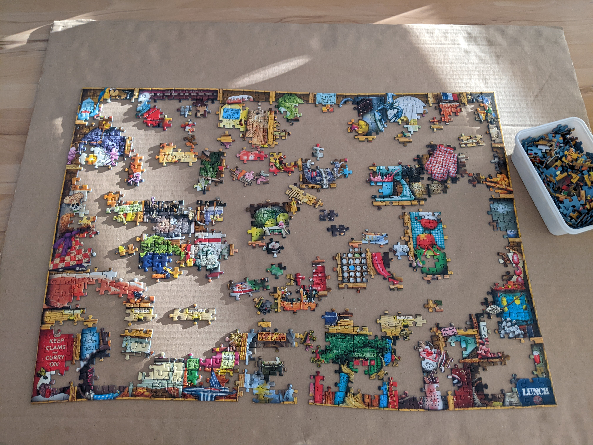

# Positive & negative

*For every 'it works' case, write the 'it correctly refuses to work' counterpart. Negative cases are unglamorous, easy to skip under deadline pressure, and where most real defects actually hide.*

> A feature that only ever gets tested with the "right" input can look completely finished while being
> one bad request away from a real problem. Positive cases prove a feature does what it's supposed to;
> negative cases prove it correctly REFUSES to do what it's not supposed to - and the second half is the
> one that gets rushed, shortened, or skipped entirely when a deadline is close. This note is about
> treating both as equally mandatory, not the second as optional polish.

> **In real life**
>
> A large jigsaw puzzle mid-assembly has completed clusters where every piece's tabs and blanks were
> checked and interlock exactly - that's a positive result, confirmed correct, not just placed nearby and
> hoped for. It also has a bin holding hundreds of unsorted pieces, and the overwhelming majority of them
> do NOT belong in any specific gap someone's currently working on. Trying one of those wrong pieces
> against a gap and confirming it doesn't fit - not skipping it, actively trying it - is a negative test.
> Skip that step and assume "well, obviously it won't fit," and you never actually confirmed the gap's
> shape rejects the wrong pieces the way it's supposed to. The puzzle isn't provably correct until both
> kinds of check have happened.

**Positive / negative test case**: A positive test case confirms the system does what it's supposed to do when given valid input under expected conditions - the 'it works' claim. A negative test case confirms the system correctly REFUSES or handles gracefully something it's not supposed to accept - invalid input, an unauthorized action, a boundary violation, a malformed request. Both are necessary for the same reason a lock needs to be tested both with the right key (opens) and a wrong one (stays locked) - proving one direction says nothing about the other, and a feature that only handles valid input correctly can still fail dangerously the first time something unexpected arrives.

## What a positive case actually proves

A positive case confirms the happy path: valid data goes in, the expected, correct outcome comes out.
This is the case most people write first, and reasonably so - it's the reason the feature exists at
all. But a positive case alone only ever proves the system CAN work; it says nothing about what happens
the moment something arrives that it wasn't built to expect.

## What a negative case actually proves

A negative case deliberately feeds the system something it should reject, mishandle gracefully, or
refuse - and confirms it does exactly that, with the right error, no data corruption, and no security
exposure. This is where "it correctly said no" is itself the success condition - a negative case that
gets silently accepted, or crashes instead of erroring cleanly, is a real defect even though nothing
about the ATTEMPT looked unusual.

## Why negative cases get skipped under pressure

They don't demo well. A positive case makes a feature look finished; a negative case makes someone
type garbage into a form and watch an error message appear, which reads as "less impressive" work even
though it's frequently where the real defects live. Deadline pressure quietly reallocates effort toward
the cases that look like progress - which is exactly the bias worth naming and resisting deliberately.


*Jigsaw puzzle in progress — Wikimedia Commons, CC BY-SA 4.0 (Balise42)*
- **A confidently interlocked cluster = a POSITIVE case, confirmed correct** — These pieces didn't just get placed nearby - each one's tabs and blanks were checked to interlock exactly. A positive case works the same way: confirming the RIGHT input produces the RIGHT, exactly-fitting result, not just something roughly close.
- **A stray piece sitting in an empty gap, unconnected = a candidate, not yet actually verified** — It looks plausible sitting there, maybe even the right color - but until someone actually presses it into the gap, 'looks right' isn't the same as 'confirmed right.' Untested-but-plausible is exactly the gap between assuming a feature works and actually verifying it.
- **The bin of loose, unsorted pieces = the population negative tests are drawn from** — Most of these pieces belong nowhere near the gap currently being worked on. A negative test is the deliberate act of trying one anyway and confirming the puzzle correctly refuses it - not skipping the wrong ones, actively trying them and checking they get rejected.
- **An empty gap with a distinctive, oddly-shaped border = the exact boundary a piece gets tested against** — Only one shape among thousands in that bin will interlock cleanly here. That specificity - one shape fits, everything else visibly doesn't - is the same precision a good negative test needs: not 'some wrong input,' a SPECIFIC wrong input, tried on purpose.
- **The completed straight-edge border = the structural boundaries, locked down before the interior detail** — The frame goes down before the picture in the middle does, because it constrains everything else. Test planning often works the same way - establish the edge cases and boundaries early, and the interior positive-path detail slots in against something already solid.

**Pairing a positive case with its negative counterparts - press Play**

1. **Write the positive case first** — Valid input, expected conditions, the happy path. This proves the feature CAN do its job - necessary, but only half the claim.
2. **Ask: what SHOULD this system refuse?** — Invalid data, unauthorized access, a boundary violation, a malformed request - list every way this input is supposed to be rejected, not just the ones that come to mind first.
3. **Write one negative case per rejection reason** — Empty input, wrong format, duplicate/conflicting data, unauthorized attempt - each a SEPARATE case, the same 'don't stack multiple invalid conditions' discipline this module's other notes describe.
4. **Confirm the REJECTION itself is correct, not just present** — Does it fail gracefully with a clear, correct error? Or does it crash, corrupt data, or silently accept something it shouldn't have? 'It got rejected' and 'it got rejected CORRECTLY' are different claims.
5. **Check the pairing is genuinely complete** — For every positive case, is there at least one negative counterpart testing what happens when the same feature is fed something it shouldn't accept?

Here's a positive case paired with three negative counterparts for a username field - one happy path,
three distinct ways the system should correctly say no:

*Run it - one positive case, three negative counterparts (Python)*

```python
existing_usernames = {"sajan_qa", "admin"}

def check_username(username):
    if not username:
        return "REJECTED: empty"
    if len(username) < 3:
        return "REJECTED: too short"
    if not username.replace("_", "").isalnum():
        return "REJECTED: invalid characters"
    if username.lower() in existing_usernames:
        return "REJECTED: already taken"
    return "ACCEPTED"

cases = [
    ("positive", "new_tester_92", "a valid, unused username"),
    ("negative", "admin", "a username that's already taken"),
    ("negative", "a!", "too short AND has an invalid character"),
    ("negative", "", "empty input"),
]

for kind, value, note in cases:
    result = check_username(value)
    label = value if value else "(empty)"
    print(f"[{kind.upper():8}] {label:16} ({note:38}) -> {result}")

# [POSITIVE] new_tester_92    (a valid, unused username              ) -> ACCEPTED
# [NEGATIVE] admin            (a username that's already taken       ) -> REJECTED: already taken
# [NEGATIVE] a!               (too short AND has an invalid character) -> REJECTED: too short
# [NEGATIVE] (empty)          (empty input                           ) -> REJECTED: empty
```

Same paired set in Java - the shape a signup form's server-side validation might actually take:

*Run it - the positive/negative pairing (Java)*

```java
import java.util.*;

public class Main {

    static final Set<String> EXISTING_USERNAMES = Set.of("sajan_qa", "admin");

    static String checkUsername(String username) {
        if (username == null || username.isEmpty()) return "REJECTED: empty";
        if (username.length() < 3) return "REJECTED: too short";
        if (!username.replace("_", "").chars().allMatch(Character::isLetterOrDigit)) return "REJECTED: invalid characters";
        if (EXISTING_USERNAMES.contains(username.toLowerCase())) return "REJECTED: already taken";
        return "ACCEPTED";
    }

    record Case(String kind, String value, String note) {}

    public static void main(String[] args) {
        List<Case> cases = List.of(
            new Case("positive", "new_tester_92", "a valid, unused username"),
            new Case("negative", "admin", "a username that's already taken"),
            new Case("negative", "a!", "too short AND has an invalid character"),
            new Case("negative", "", "empty input")
        );

        for (Case c : cases) {
            String result = checkUsername(c.value());
            String label = c.value().isEmpty() ? "(empty)" : c.value();
            System.out.printf("[%-8s] %-16s (%-38s) -> %s%n", c.kind().toUpperCase(), label, c.note(), result);
        }
    }
}

/* Output matches the Python run exactly - one ACCEPTED, three distinctly-reasoned REJECTED results. */
```

> **Tip**
>
> Notice the three negative cases above reject for three DIFFERENT stated reasons ("already taken," "too
> short," "empty"), not one generic "REJECTED." A negative case is only as useful as its ability to prove
> WHICH rejection path fired - a system that returns the same vague "invalid input" message for every
> negative case has actually told you nothing about whether each specific validation rule is really
> wired up correctly.

### Your first time: Your mission: pair a real positive case with its negative counterparts

- [ ] Find a real input field and write its positive case — Any form field on BuggyShop or a site you use. Valid data, expected conditions, the happy path - write it out fully first.
- [ ] List every way this field is SUPPOSED to reject input — Not just 'invalid input' generically - the specific, distinct reasons: empty, wrong format, duplicate, unauthorized, out of range. As many as genuinely apply.
- [ ] Write one negative case per distinct rejection reason — Same format as the positive case - specific value, specific expected result naming WHICH rejection reason should fire.
- [ ] Run every case against the real field — Confirm each negative case is rejected for the reason you expected, not just rejected generically or, worse, silently accepted.
- [ ] Check the error messages themselves, not just pass/fail — Does the error clearly state what went wrong? A rejection with a confusing or generic message is a smaller, real defect worth noting even when the rejection itself is technically correct.

You proved both halves of the claim on a real field - not just that it works, but that it correctly refuses what it's supposed to refuse, for the right stated reasons.

- **My negative case got rejected, but with a generic 'something went wrong' message instead of a specific one.**
  Report this as a real, if minor, defect - a vague error on a negative case is a genuine usability problem even when the underlying rejection logic is correct, because it leaves the actual user with no idea what to fix. Don't let 'well, it DID get rejected' close the finding; the specificity of the message is part of what the negative case is checking.
- **I can't tell if a certain input SHOULD be rejected or accepted - the spec doesn't say.**
  Treat this the same way an undocumented equivalence class gets handled elsewhere in this platform's test-design-techniques module: flag the ambiguity explicitly rather than guessing, and test what the system ACTUALLY does as a documented observation, clearly labeled as behavior-not-yet-confirmed-against-a-spec.
- **My negative case caused the system to crash instead of showing an error.**
  This is a more serious defect than a wrong error message, not a lesser one - file it with high priority and full reproduction steps. A clean rejection with a clear error is the correct negative-case outcome; a crash means the invalid input reached code that wasn't prepared to handle it at all, which is often a sign of a deeper validation gap.
- **I'm not sure how many negative cases is 'enough' for one field.**
  Tie the count to the number of DISTINCT rejection reasons that genuinely apply, the same discipline the test-design-techniques module uses for equivalence classes - not an arbitrary target number. A simple required-text field might only need two or three; a field with several independent validation rules (format, length, uniqueness, authorization) needs one negative case per rule.

### Where to check

Where negative-case coverage most often falls short in practice:

- **Any field under deadline pressure** — negative cases are the first thing cut when time runs short; explicitly protect time for them rather than treating them as the part that gets skipped if things run late.
- **Authorization and access-control paths** — "can a user without permission do this?" is a negative case that's easy to forget entirely if every test account used during development happens to have full access.
- **Fields with more than one validation rule** — each rule deserves its own negative case, the same "don't stack invalid conditions" discipline covered elsewhere in this module; one generic negative case rarely covers a field with several independent rules.
- **Error message QUALITY, not just error message presence** — a rejection that technically fires but with a confusing or unhelpful message is a real, reportable gap even though the pass/fail check alone would call it a pass.
- **API endpoints tested only through a UI that prevents bad input client-side** — the UI blocking bad input doesn't prove the SERVER also rejects it; a negative case sent directly to the API, bypassing the UI, checks a genuinely different and important thing.

The habit: **write the negative cases in the SAME sitting as the positive case, before moving to the next feature - not as a follow-up task that's easy to deprioritize later.**

### Worked example: pairing positive and negative cases for a real discount-code field, deliberately, under time pressure

1. **The pressure:** a release is tomorrow, and there's time to write cases for the coupon-code field, but not unlimited time. The instinct is to write the positive case well and wave at "some negative cases" vaguely.
2. **Resist that instinct - list the DISTINCT rejection reasons first, before writing anything.** From the field's rules: empty input, wrong length, invalid characters, unknown/nonexistent code, expired code, code valid but not applicable to the current cart. Six distinct reasons, not one vague "bad code" bucket.
3. **Write the positive case first, properly:** "TC-Coupon-01 [positive]: precondition - cart contains eligible items, coupon SAVE10 is active. Steps: enter 'SAVE10', apply. Expected: 10% discount applied to eligible items."
4. **Under real time pressure, prioritize negative cases by RISK, not by writing all six with equal effort.** The "expired code" and "code not applicable to cart" cases are the ones most likely to have subtle logic bugs (multiple conditions interacting) - write those two fully. The "empty input" and "wrong length" cases are simpler and lower-risk - write them more briefly, but do NOT skip them entirely.
5. **Write the two highest-risk negative cases in full:** "TC-Coupon-03 [negative]: precondition - coupon EXPIRED5 exists but expired yesterday. Steps: enter 'EXPIRED5', apply. Expected: 'This code has expired' message; no discount applied." And its cart-inapplicable sibling, structured identically.
6. **Write the two lower-risk ones more briefly, but completely** - shorter preconditions, same rigor on the expected result: "TC-Coupon-05 [negative]: empty code field, click apply. Expected: 'Please enter a code' message; apply button takes no further action."
7. **Run all cases, prioritizing the two high-risk negatives first** in case they surface something that changes the release decision - which is exactly the point of triaging by risk under real time pressure rather than by which cases are quickest to write.
8. **The result under a real deadline:** six negative cases still exist, sized to their actual risk rather than uniformly rushed or uniformly skipped - a defensible trade-off, clearly better than the instinct this note opened with: writing the positive case well and waving vaguely at "some negative cases" as an afterthought.

> **Common mistake**
>
> Writing one generic negative case ("try some invalid input") instead of one case per distinct rejection
> reason. A single vague negative case can pass while several of the field's actual validation rules are
> completely unverified - if "try some invalid input" happened to test a malformed email and that's the
> only rule actually checked, a missing length validation or a broken uniqueness check ships completely
> unnoticed. Negative cases need the same one-reason-per-case discipline as positive ones; "negative" is
> not itself a single test, it's a category containing as many distinct cases as there are distinct ways
> the system is supposed to say no.

**Quiz.** A tester writes a positive case confirming a discount code applies correctly, then writes exactly one negative case: entering the text 'asdf1234' and confirming it's rejected as an unknown code. The field also has rules for expired codes and codes that don't apply to the current cart. What's the gap here?

- [x] The single negative case only proves the 'unknown code' rejection path works - the expired-code and cart-inapplicable rejection paths remain completely unverified, and either could be silently broken without this test suite ever revealing it
- [ ] There is no gap - one well-chosen negative case is sufficient to prove a field correctly rejects invalid input, regardless of how many distinct validation rules exist
- [ ] The negative case should be deleted, since a field only needs positive-case coverage once the happy path has been confirmed to work correctly
- [ ] The gap is that the negative case's input 'asdf1234' isn't random enough - negative testing requires generating unpredictable inputs rather than deliberately chosen ones

*This note's central argument is that 'negative' is a category, not a single test - each distinct rejection reason (unknown code, expired code, cart-inapplicable code) is checked by different logic and needs its own case, the same discipline this module applies to positive cases and this platform's test-design-techniques module applies to invalid equivalence classes generally. Testing only the unknown-code path proves nothing about whether expired-code or cart-inapplicable-code handling actually works - either could have a real, shipped defect invisible to this test suite. Dropping negative cases entirely once the positive case passes is exactly the deadline-pressure bias this note names and argues against. And negative test values should be deliberately CHOSEN to target a specific rejection reason, not randomly generated - a chosen value proves something specific; a random one proves much less.*

- **Positive case vs negative case, in one line each** — Positive: valid input produces the expected, correct outcome. Negative: invalid or unexpected input is correctly refused or handled gracefully - the rejection ITSELF is the success condition.
- **Why do negative cases get skipped under deadline pressure?** — They don't demo well - a positive case looks like visible progress, a negative case looks like typing garbage into a form. The bias is worth naming and resisting deliberately, not indulging.
- **Why one negative case per distinct rejection reason, not one generic negative case?** — A single vague negative case can pass while several actual validation rules go completely unverified - each rule needs its own case, proving specifically that IT is wired up correctly.
- **What makes a negative case's rejection 'correct,' beyond just happening?** — A clear, specific, correct error message, no data corruption, no crash, no security exposure. 'It got rejected' and 'it got rejected correctly' are different claims - check both.
- **The UI-only validation trap** — A UI blocking bad input client-side doesn't prove the SERVER also rejects it. A negative case sent directly to the API, bypassing the UI, checks a genuinely different and often more important thing.
- **How to prioritize negative cases under real time pressure** — By RISK, not by ease of writing - the rejection paths most likely to hide a subtle logic bug (multiple interacting conditions) get full attention first; simpler ones get briefer but still-complete cases, never zero.

### Challenge

Pick one real input field (BuggyShop or any site you use). Write its positive case fully. Then list
every DISTINCT reason the field should reject input - not a vague "bad input" bucket, the actual
separate rules (empty, wrong format, duplicate, unauthorized, out of range, whatever genuinely applies).
Write one negative case per reason, and run all of them against the real field. Report which rejections
fired correctly with a clear, specific message, and flag explicitly any that were vague, silently
accepted something they shouldn't have, or crashed instead of erroring cleanly.

### Ask the community

> Positive/negative pairing check on `[field]`: positive case confirms `[valid input] -> [result]`. Negative cases I wrote: `[list reasons + results]`. Did I miss a distinct rejection reason this field actually has, or does any of my rejection messages look too vague to be useful?

The most useful replies name a SPECIFIC missing rejection reason or point at a SPECIFIC vague message -
"looks thorough" doesn't test the actual completeness this note is asking about.

- [Baeldung — Positive and Negative Testing](https://www.baeldung.com/cs/testing-positive-negative)
- [GeeksforGeeks — Positive vs Negative vs Destructive Test Cases](https://www.geeksforgeeks.org/software-testing/positive-vs-negative-vs-destructive-test-cases/)
- [Software Testing Help — What is Negative Testing? How to Write Negative Test Cases](https://www.softwaretestinghelp.com/positive-and-negative-test-scenarios/)
- [G C Reddy — Writing Test Cases: Positive & Negative Testing](https://www.youtube.com/watch?v=PFZhKWvEqlQ)

🎬 [Writing Test Cases — Positive & Negative Testing](https://www.youtube.com/watch?v=PFZhKWvEqlQ) (25 min)

- A positive case proves a feature CAN work with valid input. A negative case proves it correctly REFUSES what it shouldn't accept - both are mandatory, not one core and one optional.
- Negative cases get skipped under deadline pressure because they don't demo well - name that bias explicitly and protect time for them in the same sitting as the positive case.
- One negative case per DISTINCT rejection reason, not one generic 'try invalid input' case - a vague negative case can pass while several real validation rules stay completely unverified.
- A correct rejection means a specific, clear error, no crash, no data corruption, and no security exposure - 'rejected' and 'rejected correctly' are different claims worth checking separately.
- A UI blocking bad input doesn't prove the server does too - test negative cases against the API directly when possible, not only through a UI that may be filtering input before it arrives.


---
_Source: `packages/curriculum/content/notes/test-artifacts/scenarios-and-cases/positive-and-negative-cases.mdx`_
