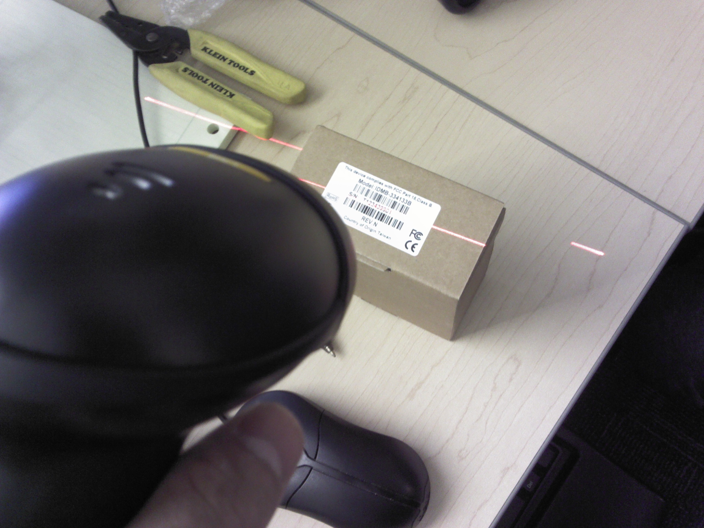

# Coverage

*Traceability coverage is really two separate measurements, not one - are all our requirements tested (forward), and is everything we're testing actually required (backward)? Most teams only ever check the first.*

> The previous note showed how an RTM catches an untested requirement - a real, useful check. But it's only
> half the picture. A test suite can look thorough - hundreds of passing cases, a healthy-looking RTM - and
> still be quietly testing things nobody actually asked for, while a genuine requirement sits untested
> underneath the noise. Coverage, done properly, checks both directions: does every requirement have a
> test, AND does every test actually trace back to a requirement that's still real.

> **In real life**
>
> A barcode scanner doesn't just confirm a box has SOME label on it - the laser has to land on a specific,
> readable barcode, match it against a known record, and get a hit. Scan a box with no barcode (or one
> that doesn't match anything in the system) and the scan fails cleanly - that's backward traceability in
> physical form: does this specific item trace back to something real in the record. Meanwhile, a
> warehouse audit works the other direction - does every item the manifest SAYS should be here actually
> get scanned and found. One check without the other misses real problems: a box present but unlisted, or
> an item listed but missing. Traceability coverage is the same two-direction discipline applied to
> requirements and test cases.

**Traceability coverage**: Traceability coverage is measured in two distinct directions. FORWARD coverage answers 'does every requirement have at least one linked test case' - expressed as a percentage of requirements covered; a gap here is an untested requirement. BACKWARD coverage answers 'does every test case trace back to a real, current requirement' - expressed as a percentage of test cases that are properly linked; a gap here is an ORPHAN test case, one testing something no longer (or never) actually required. Full bidirectional coverage means both percentages hit 100% - no untested requirements, and no untethered tests.

## Forward coverage: are we testing everything required

This is the check the-rtm's note already demonstrated - scan every requirement row for an empty
test-case column. Expressed as a percentage, it's simply covered requirements divided by total
requirements. This is the direction most teams already check, because it's the direction stakeholders
usually ask about first.

## Backward coverage: are we testing anything that ISN'T required

This is the direction most teams skip. A test case that once verified a real requirement, but whose
requirement was later cut, reworded, or never actually approved, becomes an orphan - still running,
still "passing," verifying nothing anyone currently needs. Orphans aren't harmless; they cost real
execution time and give false confidence that coverage is higher than it actually is.

## Why both numbers matter together

A team could hit 100% forward coverage while carrying a pile of orphaned tests, and the forward number
alone would never reveal it. Reporting only forward coverage is answering half the actual question -
real bidirectional coverage requires checking, and reporting, both directions independently.


*The scanning the barcode on the box.jpg — Wikimedia Commons, CC BY-SA 3.0 (Mingjunli)*
- **The barcode itself = a requirement or test case ID** — A specific, unique identifier meant to be matched against a record - exactly like a requirement ID or test case ID in an RTM.
- **The laser crossing the barcode = a forward-traceability check** — The act of checking whether THIS specific ID has a match on record - does this requirement have a linked test case.
- **The scanner itself = the traceability process doing the checking** — Neither direction of coverage checks itself - something (a person, a tool, a scanner) has to actively run the match, in both directions.
- **The visible serial number = the specific ID being traced** — A serial number only means something once matched against a real record - an ID with no match, in either the barcode or requirements sense, is a gap.
- **The laser line continuing past the box, onto empty desk = a scan with nothing to match** — A scan that lands on nothing real is exactly what an orphan test case is - something being checked or run that doesn't actually trace back to anything current.

**Checking coverage in both directions - press Play**

1. **Forward: walk every requirement, check for a linked case** — Percentage covered = requirements with at least one case, divided by total requirements.
2. **Forward gaps = untested requirements** — The failure mode this chapter's first note already demonstrated - a real behavior nobody verified.
3. **Backward: walk every test case, check its requirement still exists and is current** — Percentage valid = cases linking to a real requirement, divided by total cases.
4. **Backward gaps = orphan test cases** — Tests running against nothing real - wasted execution time and false confidence in the numbers.
5. **Report BOTH percentages, not just one** — A single 'coverage: 100%' number, without specifying which direction, is an incomplete and potentially misleading claim.

*Run it - forward and backward coverage, computed independently (Python)*

```python
requirements = ["REQ-01", "REQ-02", "REQ-03", "REQ-04", "REQ-05"]

test_cases = {
    "TC-101": "REQ-01",
    "TC-102": "REQ-01",
    "TC-103": "REQ-02",
    "TC-104": "REQ-03",
    "TC-105": "REQ-06",  # orphan: REQ-06 doesn't exist in the current requirements set
}

def forward_coverage(requirements, test_cases):
    linked = set(test_cases.values())
    covered = [r for r in requirements if r in linked]
    gaps = [r for r in requirements if r not in linked]
    return covered, gaps

def backward_coverage(requirements, test_cases):
    valid = [tc for tc, req in test_cases.items() if req in requirements]
    orphans = [tc for tc, req in test_cases.items() if req not in requirements]
    return valid, orphans

covered, gaps = forward_coverage(requirements, test_cases)
valid, orphans = backward_coverage(requirements, test_cases)

forward_pct = round(len(covered) / len(requirements) * 100)
backward_pct = round(len(valid) / len(test_cases) * 100)

print("FORWARD traceability (requirement -> test case):")
print(f"  {len(covered)}/{len(requirements)} requirements covered ({forward_pct}%)")
print(f"  Gaps (untested requirements): {gaps}")

print("\\nBACKWARD traceability (test case -> requirement):")
print(f"  {len(valid)}/{len(test_cases)} test cases trace to a real requirement ({backward_pct}%)")
print(f"  Orphans (cases with no matching requirement): {orphans}")

full_coverage = not gaps and not orphans
print(f"\\nFull bidirectional coverage: {full_coverage}")

# FORWARD traceability (requirement -> test case):
#   3/5 requirements covered (60%)
#   Gaps (untested requirements): ['REQ-04', 'REQ-05']
#
# BACKWARD traceability (test case -> requirement):
#   4/5 test cases trace to a real requirement (80%)
#   Orphans (cases with no matching requirement): ['TC-105']
#
# Full bidirectional coverage: False
```

Same bidirectional check in Java - the shape a CI coverage-gate step might take:

*Run it - the bidirectional coverage check (Java)*

```java
import java.util.*;

public class Main {
    public static void main(String[] args) {
        List<String> requirements = Arrays.asList("REQ-01", "REQ-02", "REQ-03", "REQ-04", "REQ-05");

        LinkedHashMap<String, String> testCases = new LinkedHashMap<>();
        testCases.put("TC-101", "REQ-01");
        testCases.put("TC-102", "REQ-01");
        testCases.put("TC-103", "REQ-02");
        testCases.put("TC-104", "REQ-03");
        testCases.put("TC-105", "REQ-06");

        Set<String> linked = new HashSet<>(testCases.values());
        List<String> covered = new ArrayList<>();
        List<String> gaps = new ArrayList<>();
        for (String req : requirements) {
            if (linked.contains(req)) covered.add(req);
            else gaps.add(req);
        }

        List<String> valid = new ArrayList<>();
        List<String> orphans = new ArrayList<>();
        for (Map.Entry<String, String> entry : testCases.entrySet()) {
            if (requirements.contains(entry.getValue())) valid.add(entry.getKey());
            else orphans.add(entry.getKey());
        }

        long forwardPct = Math.round((double) covered.size() / requirements.size() * 100);
        long backwardPct = Math.round((double) valid.size() / testCases.size() * 100);

        System.out.println("FORWARD traceability (requirement -> test case):");
        System.out.println("  " + covered.size() + "/" + requirements.size() + " requirements covered (" + forwardPct + "%)");
        System.out.println("  Gaps (untested requirements): " + gaps);

        System.out.println();
        System.out.println("BACKWARD traceability (test case -> requirement):");
        System.out.println("  " + valid.size() + "/" + testCases.size() + " test cases trace to a real requirement (" + backwardPct + "%)");
        System.out.println("  Orphans (cases with no matching requirement): " + orphans);

        boolean fullCoverage = gaps.isEmpty() && orphans.isEmpty();
        System.out.println();
        System.out.println("Full bidirectional coverage: " + fullCoverage);
    }
}

/* FORWARD traceability (requirement -> test case):
     3/5 requirements covered (60%)
     Gaps (untested requirements): [REQ-04, REQ-05]

   BACKWARD traceability (test case -> requirement):
     4/5 test cases trace to a real requirement (80%)
     Orphans (cases with no matching requirement): [TC-105]

   Full bidirectional coverage: false */
```

> **Tip**
>
> Notice the two percentages in this example (60% forward, 80% backward) are close but genuinely
> different numbers, measuring genuinely different things. Never average them into one blended "coverage
> score" - that would hide exactly the distinction this note exists to make. Report both, separately,
> every time.

### Your first time: Your mission: audit a test suite in both directions

- [ ] Take the RTM you built in the previous note (or build a small one now) — 5-6 requirements, with test cases linked where they exist.
- [ ] Compute forward coverage: covered requirements / total requirements — This is the number most teams already track - confirm you can produce it as a clean percentage.
- [ ] Now check backward: for every test case, does its linked requirement still genuinely exist and apply? — This is the step most teams skip - look specifically for cases tied to a cut, renamed, or superseded requirement.
- [ ] Compute backward coverage: valid cases / total cases — If this number is lower than 100%, you've found at least one orphan.
- [ ] Report both percentages side by side, not blended — State them as two separate facts - 'forward: X%, backward: Y%' - exactly as this note's playground output does.

You produced a genuinely complete coverage picture - not just \"are we testing enough,\" but \"are we testing the RIGHT things and nothing extra.\"

- **Our forward coverage is 100% but I suspect we have orphan tests dragging out the suite's runtime.**
  100% forward coverage says nothing about backward coverage - these are independent measurements, exactly as this note describes. Run the backward check specifically: for every test case, confirm its linked requirement is still real and current.
- **A requirement got renamed and now several test cases show as 'orphaned' even though they're still testing something real.**
  This is why the-rtm note stressed stable requirement IDs separate from wording - if the ID persisted through the rename, the cases should still link correctly. If the ID itself changed, that's a one-time relinking task, not a genuine orphan.
- **I found an orphan test case but I'm not sure whether to delete it or find it a new home.**
  First confirm it's genuinely testing nothing current - not just missing a tag. If it verifies real, still-relevant behavior that simply isn't captured in the current requirements doc, the fix might be adding the missing requirement, not deleting the test.
- **Leadership only ever asks about 'coverage' as one number, and I don't know which direction they mean.**
  Ask explicitly, and then report both anyway - a stakeholder asking for 'coverage' almost always means forward (are we testing everything), but backward coverage is the number that protects against a bloated, misleading test suite. Both are worth surfacing even if only one was requested.

### Where to check

Where checking both directions actually matters:

- **Before trusting a 'fully covered' claim** — a forward-only 100% can still hide a suite full of orphans.
- **After any requirements change** — cut or reworded requirements are exactly where orphan test cases are born.
- **Test suite cleanup or performance work** — orphans are one of the safest, most defensible things to prune once genuinely confirmed.
- **Audits and compliance reviews** — many regulated contexts specifically require BIDIRECTIONAL traceability, not just forward.
- **NOT a reason to distrust every passing test** — most cases in a healthy suite ARE correctly linked; the check is for the exceptions, not a wholesale suspicion of the whole suite.

The habit: **whenever someone reports a coverage percentage, ask which direction it measures - and if only one direction has ever been checked, treat the number as incomplete.**

### Worked example: a 100% forward coverage claim that hid a real problem

1. **The claim**: a team reports "100% requirements coverage" ahead of a release, based on their RTM showing every requirement row with at least one linked, passing test case.
2. **A closer look at the RTM's history** shows three requirements were REMOVED from the spec two sprints ago after a scope change - a subscription-tiers feature was cut.
3. **The test cases that used to verify those three requirements were never deleted or relinked.** They still run in every CI pass, still pass, and still count toward the suite's total test count.
4. **Running a backward check** - for each test case, does its linked requirement still exist in the current, approved requirements doc - immediately surfaces these three as orphans.
5. **The "100% coverage" claim was true only in the forward direction.** Backward coverage was actually 94% (a handful of orphans out of the total suite), a fact the forward-only report never surfaced.
6. **This isn't just a bookkeeping nitpick.** Those orphan tests were adding real minutes to every CI run, and their continued "passing" status was quietly inflating confidence in a scope-creep feature that no longer existed.
7. **The fix**: the three orphaned cases get reviewed - two are deleted outright (genuinely testing the cut feature), one is repurposed because it happened to also exercise a still-current requirement that had been under-tested.
8. **The team's next coverage report states both numbers explicitly**: "Forward: 100% (24/24). Backward: 96% (23/24, after cleanup)." That's a materially more honest, more complete claim than the original single number.

> **Common mistake**
>
> Treating "100% coverage" as a complete, self-explanatory claim without specifying direction. The worked
> example above shows exactly how this goes wrong - a true forward number coexisting with a materially
> incomplete backward number, reported as if it were the whole picture. Whenever you see or report a bare
> "coverage: X%" figure, the very next question should be: forward, backward, or both?

**Quiz.** A test suite has 50 test cases. 48 of them link to a real, current requirement; 2 link to a requirement that was deleted from the spec three months ago. What is this suite's BACKWARD coverage, and what do the 2 orphaned cases represent?

- [x] 96% backward coverage (48/50); the 2 orphans are test cases still running and passing against requirements that no longer exist - wasted execution time and a source of false confidence
- [ ] 100% backward coverage, since backward coverage only measures whether test cases exist at all, not whether their linked requirements are still current
- [ ] 96% FORWARD coverage; backward coverage isn't a real, separately measurable concept - only forward coverage (are all requirements tested) can actually be calculated
- [ ] 0% backward coverage, since ANY orphaned test case anywhere in a suite invalidates the entire suite's backward traceability score down to zero

*This note defines backward coverage precisely as valid test cases (those linking to a real, current requirement) divided by total test cases - 48/50 = 96%, exactly matching this note's own worked Python/Java example pattern (a small number of orphans reducing an otherwise-high percentage, not zeroing it out). The 2 orphaned cases are defined explicitly in this note as tests that still run and still 'pass' while verifying nothing anyone currently needs - real wasted cost and a real source of inflated confidence, not a harmless technicality. Backward coverage is NOT the same measurement as forward coverage - conflating the two, or claiming only one of them is 'real,' is precisely the mistake this note's Callout warns against. And a percentage-based measurement doesn't collapse to zero because of a partial orphan count - 48 of the 50 cases are still validly linked, which is what makes 96% the correct computed value rather than a full invalidation of the whole suite.*

- **Forward coverage, defined** — The percentage of requirements with at least one linked test case - a gap here is an untested requirement.
- **Backward coverage, defined** — The percentage of test cases that trace back to a real, current requirement - a gap here is an orphan test case.
- **Why an orphan test case is a real problem, not just clutter** — It still runs and still 'passes,' costing real execution time while inflating confidence in coverage that isn't actually there.
- **Why forward and backward percentages should never be averaged** — They measure genuinely different things - blending them into one 'coverage score' hides exactly the distinction that makes bidirectional checking useful.
- **The most common cause of new orphan test cases** — Requirements getting cut, reworded, or superseded without the linked test cases being reviewed or relinked.
- **The habit this note is really teaching** — Whenever you hear a bare 'coverage: X%' claim, ask which direction it measures - and treat a one-directional number as incomplete.

### Challenge

Using the RTM you built in the previous note's Challenge (or a new one), run both a forward and a
backward coverage check. Report both percentages explicitly, separately. If you can't find a real orphan
in your own set, deliberately introduce one (link a test case to a requirement ID that isn't in your
list) and confirm your backward check actually catches it.

### Ask the community

> Coverage check on `[project/suite]`: forward `[X]`%, backward `[Y]`%. Anyone else track backward coverage as a habit, or is forward-only still the norm on your team?

The most useful replies describe a SPECIFIC process or tool feature for catching orphans (tag-based
linting in CI, a periodic manual audit) rather than a general "yes we should do that too" comment.

- [Jama Software — What is Bidirectional Traceability? And How to Use It](https://www.jamasoftware.com/requirements-management-guide/requirements-traceability/bidirectional-traceability/)
- [TestRail — Test Coverage vs. Traceability: What QA Teams Need to Know](https://www.testrail.com/blog/test-coverage-traceability/)
- [Kualitee — Forward and Backward Traceability in Testing: A Guide](https://www.kualitee.com/blog/testing/traceability-in-testing-and-how-to-achieve-it/)
- [MATLAB — How to Analyze Coverage Using Test Case Traceability](https://www.youtube.com/watch?v=nS3-ztqMC0E)

🎬 [How to Analyze Coverage Using Test Case Traceability](https://www.youtube.com/watch?v=nS3-ztqMC0E) (2 min)

- Traceability coverage is two separate measurements: forward (requirement -> test case) and backward (test case -> requirement).
- A forward gap is an untested requirement; a backward gap is an orphan test case - a case verifying something no longer current.
- Orphan test cases have a real cost: wasted execution time and inflated confidence in coverage that isn't actually there.
- Never blend forward and backward percentages into one score - report them separately, since they measure genuinely different risks.
- Requirements changes (cuts, rewrites) are the most common source of new orphans - a backward check after any requirements change is worth the habit.


---
_Source: `packages/curriculum/content/notes/test-artifacts/traceability/traceability-coverage.mdx`_
