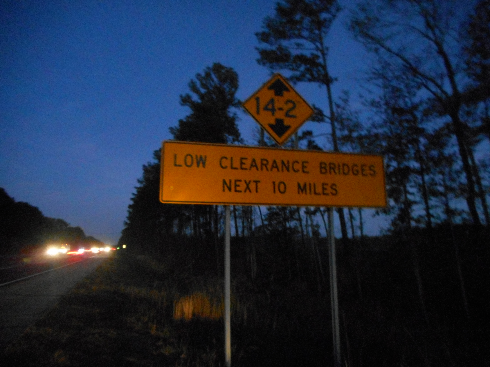

# Worked example

*A real highway sign - an exact clearance number, a ten-mile zone it applies across - walked through boundary value analysis end to end, building a reusable test-generation habit rather than a one-off list of numbers.*

> A highway clearance sign is boundary value analysis already running in the physical world, posted for
> every driver to see: one exact number, and a decision - pass safely, or don't - that changes at that
> number and nowhere else. This note borrows that sign directly and walks the full technique against it,
> start to finish: reading the exact boundary out of a real-world rule, generating a systematic set of
> test values around it, and catching a genuine off-by-one mistake that a less careful pass would have
> waved through.

> **In real life**
>
> A "14 ft 2 in" clearance sign isn't giving a general impression of "pretty low up ahead" - it's stating
> an exact number a truck driver's vehicle height gets checked against, with a real, physical
> consequence at that precise value and no gradual warning in between. A truck at 14'1" clears every
> time; a truck at 14'3" doesn't, ever; a truck at exactly 14'2" is the one case where the posted number
> itself gets tested for real, against steel and concrete, not against a vague sense of caution. That's
> the exact discipline this note walks through in software: find the real number, test at it and
> immediately around it, and treat the outcome at that precise point as the thing that actually matters.

**BVA worked example**: A boundary value analysis worked example, done properly, is a repeatable PROCESS rather than a one-off list of test values: identify the exact boundary number from a real rule, generate a systematic set of test cases around it (typically the three-value set - outside, at, and inside the boundary), run them against the real system, and compare results against a literal reading of the rule. The value of doing this as a repeatable process, rather than picking test values ad hoc, is that the same generator can be reused against any new boundary a tester encounters - which is exactly what this note's playground builds and reuses.

## The rule, exactly as posted

A real highway sign, photographed at dusk: a diamond marker reading "14-2" (14 feet, 2 inches) above a
rectangular sign reading "LOW CLEARANCE BRIDGES, NEXT 10 MILES." Converted to inches for precision, the
posted clearance is 170 inches. The rule this implies for a routing or clearance-checking system:
a vehicle taller than the posted clearance must NOT be routed through; a vehicle at or under it is
safe. Notice this reads almost identically to the pricing and rate-limit rules from earlier notes in
this module - a real-world number, doing exactly the same job a code threshold does.

## Building a reusable test generator, not a one-off list

Rather than hand-picking six numbers for this one sign, this worked example builds a small, genuinely
reusable function: given a low and high bound, generate the standard three-value set automatically.
This is worth doing even for a single boundary, because the exact same function gets reused, unchanged,
on the NEXT boundary a tester encounters - the process is the deliverable, not the specific six numbers
this sign happens to produce.

## Applying it, and catching a real defect

With the generator built, this note applies it to a deliberately-planted defect: a clearance check that
uses `<=` where the physical reality (and the posted sign) demands `<`. A vehicle exactly at the posted
height is NOT safe - it will strike the bridge - but the buggy check waves it through anyway. This is
the exact off-by-one shape the module's earlier notes described, now caught by the systematic process
this note builds, not by getting lucky on which values happened to get tested.


*NB I-95, Low Clearance Bridges, Godwin-Dunn, NC — Wikimedia Commons, CC BY-SA 4.0 (DanTD)*
- **"14-2" = the exact boundary number, stated with no ambiguity** — Not 'low clearance ahead' - an exact figure, 14 feet 2 inches, converted cleanly to 170 inches. This is the number a real boundary value analysis targets: not the general vicinity of a rule, but the precise value printed on the sign itself.
- **"LOW CLEARANCE BRIDGES" = the plain-English rule, before it's turned into a testable class** — This is the spec sentence, in miniature - a rule that has to be converted into an exact pass/fail threshold before it means anything testable. The conversion from wording to number is real work, the same step this module's earlier worked example walked through with a policy sentence.
- **"NEXT 10 MILES" = the scope the rule applies across, easy to leave out entirely** — The boundary doesn't just exist at one point on the highway - it applies continuously across a ten-mile zone. A spec that only states a threshold value without stating WHERE or WHEN it applies is missing a detail just as real as the number itself.
- **Oncoming headlights = a real vehicle, about to be tested against this exact number** — Somewhere on this ten-mile stretch, a real truck's actual height gets compared to 170 inches, for real, with real consequences either way. This is what a boundary test actually simulates - not an abstract number, but a genuine pass/fail moment.
- **The dark road ahead = the boundary can be hit at any point along the zone, not just once** — A ten-mile low-clearance zone means the SAME boundary check runs continuously, at every bridge in it - a reminder that a boundary rule, once defined, typically needs to hold correctly everywhere it's applied, not just at one lucky spot that happened to get tested.

**From a posted sign to a caught off-by-one bug - press Play**

1. **Read the real-world rule and extract the exact number** — "14 ft 2 in" becomes 170 inches - a precise, testable boundary, converted from the sign's own wording rather than approximated.
2. **Build a reusable three-value test generator** — A small function that takes any low/high pair and produces the standard six-value set - written once, reusable on every future boundary, not hand-picked per rule.
3. **Generate the test set for THIS boundary** — 0-169 as the safe range produces: -1, 0, 1 (lower edge) and 168, 169, 170 (upper edge) - six values, generated automatically, not chosen by hand.
4. **Run every generated value against the real (buggy) logic** — Five of six match the expected result cleanly. One - the value exactly at the posted clearance - does not.
5. **Name the exact defect the mismatch reveals** — A vehicle exactly 170 inches tall is waved through by the buggy check, when the posted sign's own number says it shouldn't be - the off-by-one is now named precisely, not just suspected.

Here's the full process, run end to end - generator, boundary set, and the exact mismatch it exposes:

*Run it - the full BVA worked example, generator to caught bug (Python)*

```python
def generate_boundary_tests(low, high):
    # three-value BVA: outside, boundary, inside - per edge
    return [
        ("just below low", low - 1),
        ("at low", low),
        ("just above low", low + 1),
        ("just below high", high - 1),
        ("at high", high),
        ("just above high", high + 1),
    ]

def is_safe_to_pass(height_inches):
    # Sign reads "14-2" (170 inches). BUG: should be < 170, not <= 170 -
    # a vehicle exactly 170in tall WILL hit a bridge posted at exactly that clearance.
    return height_inches <= 170

LOW, HIGH = 0, 169  # posted safe range is 0-169 inches; 170+ should be rejected

print(f"{'Case':20} {'Height (in)':>12} {'Safe to pass?':>15}")
for case, height in generate_boundary_tests(LOW, HIGH):
    result = is_safe_to_pass(height)
    expected = height <= 169
    flag = "" if result == expected else "  <-- BUG: off-by-one at the posted clearance"
    print(f"{case:20} {height:>12} {str(result):>15}{flag}")

# Case                  Height (in)   Safe to pass?
# just below low                 -1            True
# at low                          0            True
# just above low                  1            True
# just below high               168            True
# at high                       169            True
# just above high               170            True  <-- BUG: off-by-one at the posted clearance
```

Same generator and the same caught bug in Java - the shape a routing service's clearance check might
actually take:

*Run it - the BVA worked example (Java)*

```java
import java.util.*;

public class Main {

    record Case(String label, int height) {}

    static List<Case> generateBoundaryTests(int low, int high) {
        return List.of(
            new Case("just below low", low - 1),
            new Case("at low", low),
            new Case("just above low", low + 1),
            new Case("just below high", high - 1),
            new Case("at high", high),
            new Case("just above high", high + 1)
        );
    }

    static boolean isSafeToPass(int heightInches) {
        // Sign reads "14-2" (170 inches). BUG: should be < 170, not <= 170 -
        // a vehicle exactly 170in tall WILL hit a bridge posted at exactly that clearance.
        return heightInches <= 170;
    }

    public static void main(String[] args) {
        int low = 0, high = 169;
        System.out.printf("%-20s %12s %15s%n", "Case", "Height (in)", "Safe to pass?");
        for (Case c : generateBoundaryTests(low, high)) {
            boolean result = isSafeToPass(c.height());
            boolean expected = c.height() <= 169;
            String flag = result == expected ? "" : "  <-- BUG: off-by-one at the posted clearance";
            System.out.printf("%-20s %12d %15s%s%n", c.label(), c.height(), result, flag);
        }
    }
}

/* Output:
Case                  Height (in)   Safe to pass?
just below low                 -1            true
at low                          0            true
just above low                  1            true
just below high               168            true
at high                       169            true
just above high               170            true  <-- BUG: off-by-one at the posted clearance
*/
```

> **Tip**
>
> Notice that five of the six generated values match expectations perfectly - a naive test run that only
> sampled two or three of these values had a real chance of missing the one that matters. This is the
> concrete payoff of generating the FULL three-value set systematically rather than picking a few values
> that "feel" like they cover the boundary: the defect lives at exactly one of six, and only a systematic
> generator guarantees that one gets tested at all.

### Your first time: Your mission: build your own reusable boundary-test generator

- [ ] Find a real-world or in-product numeric boundary — A posted limit, a rate cap, a size restriction - reuse one from an earlier mission if you like, or find a fresh one anywhere, physical signage counts.
- [ ] Write (or adapt) a small three-value generator function — Given a low and high bound, it should output six values: outside/at/inside for each edge. Keep it generic - no hardcoded numbers specific to one field.
- [ ] Run the generator against your chosen boundary — Confirm the six values it produces make sense for your specific rule before testing anything against the real system.
- [ ] Test all six against the real system or your own reasoning — Record every result. If you don't have access to test the real system, reason through what SHOULD happen at each value based on the stated rule.
- [ ] Keep the generator function - reuse it on your next boundary — The point of building it once is not having to hand-pick six values again next time. Confirm this by actually reusing it (mentally or literally) on a second boundary.

You built a small, genuinely reusable tool instead of a one-off list of numbers - the actual deliverable of doing boundary value analysis properly, not just the six values it happened to produce this time.

- **My generator produced a negative number as a test value, but the field can never actually be negative in the real system.**
  That's fine, and worth keeping rather than filtering out - a value the generator produces that the system can genuinely never receive is a NO-OP test (it should be clearly and consistently rejected or impossible to enter), and confirming that is itself useful information, not wasted effort. Only skip it if entering it is literally impossible through any real interface, and note why in your results.
- **The real system's boundary isn't a clean integer - it's something like a price with cents, or a percentage with two decimal places.**
  Adjust the generator's step size to match the domain's actual granularity - for cents, 'one step' is $0.01, not 1; for a percentage with two decimals, it's 0.01%. The three-value PRINCIPLE (outside, at, inside) transfers directly; only the size of 'one step' needs to match what the real system can actually represent.
- **I ran all six generated values and every single one passed - does that mean I wasted the effort of generating three-value instead of two-value?**
  Not wasted - a clean three-value pass is stronger, more valuable evidence than a clean two-value pass, precisely because it checked a case two-value never would have. Report it plainly as a clean, thorough result rather than downgrading it because nothing dramatic turned up; boring, confirmed-correct boundaries are real information too.
- **My boundary has more than two edges - like a three-tier pricing structure with two thresholds instead of one.**
  Run the generator once per boundary edge, not once for the whole structure - a three-tier structure has two edges (tier1/tier2 and tier2/tier3), each getting its own six-value set. Don't try to force a single six-value list to cover a structure with more than one transition point.

### Where to check

Applying this same generate-then-verify process elsewhere:

- **Any newly-discovered numeric threshold** — the moment you find a new boundary anywhere in a product, run the same generator against it before moving on, rather than hand-picking a couple of values that feel sufficient.
- **Regression suites, as a systematic backfill** — an existing test suite with ad hoc boundary coverage is a good candidate for running this generator retroactively and comparing against what's already tested, surfacing untested inside-neighbor values.
- **Physical or real-world limits that feed into software** — shipping weight limits, size restrictions, posted capacities - anywhere a real-world number (like this note's clearance sign) gets encoded into a system's validation logic.
- **Any time a defect report mentions 'this exact value doesn't work right'** — that's frequently a boundary defect in disguise; running the full generator around the reported value often surfaces the true pattern, not just the one symptom reported.
- **New boundaries introduced by a recent code change** — freshly written validation logic is exactly where an off-by-one is most likely to be introduced, before it's had time to get caught in production.

The habit: **treat 'find the boundary, generate the set, run it, compare' as a repeatable four-step routine, applied the same way every time a new numeric threshold turns up.**

### Worked example: applying the SAME generator to a second, unrelated boundary - proving it's actually reusable

1. **A completely different field, no relationship to the clearance sign:** a food delivery app's "free delivery" threshold - orders of $35 or more ship free, per the app's own FAQ page.
2. **Extract the exact boundary, same as before.** "$35 or more" implies $35.00 itself qualifies - the safe/valid range is $35.00 and up, with $34.99 as the first invalid value below it.
3. **Reuse the SAME generator function from the clearance-sign example, unchanged** - only the low/high arguments change: `generate_boundary_tests(low=3500, high=999999)` (working in cents, to avoid floating-point rounding issues entirely, a real practical habit worth adopting).
4. **The generator produces six cent-values automatically:** 3499, 3500, 3501 (lower edge) and roughly the far end of a sane upper range. For a "free delivery over $35" rule, the interesting edge is only the lower one - showing that not every rule needs both edges tested, and a good generator call reflects that by only exercising the edge that actually exists.
5. **Run the six values against the app's real checkout flow** (or reason through the FAQ's stated logic if the app isn't accessible): $34.99 correctly charges shipping, $35.00 correctly ships free, $35.01 correctly ships free.
6. **No defect found this time - and that's a completely valid, useful outcome.** The same systematic process that caught a real bug in the clearance-sign example here confirms a boundary is implemented correctly, which is exactly the kind of finding worth reporting plainly rather than treating as a non-event.
7. **The actual point of this second pass:** the generator function itself never changed - only the two numbers fed into it did. That's the payoff of building a real, reusable tool in the first worked example rather than a list of six numbers specific to one clearance sign.
8. **Going forward, this generator is now a standing part of this tester's toolkit** - the next new boundary, whatever domain it's in, gets the same four-step treatment: extract the number, generate the set, run it, compare against the stated rule.

> **Common mistake**
>
> Treating a worked example's SPECIFIC numbers as the lesson, rather than the PROCESS that generated
> them. The value of walking through the clearance-sign example isn't "now I know 170 inches is a
> boundary somewhere" - it's having a reusable four-step routine (extract the number, generate the
> three-value set, run it, compare against the stated rule) that transfers immediately to the next
> boundary, in a completely unrelated domain, without re-deriving the approach from scratch each time.

**Quiz.** After running a three-value boundary test generator against a real system, all six generated values produce exactly the results the spec predicts - no mismatches found. What's the correct way to treat this outcome?

- [x] Report it plainly as a clean, verified result - a thorough pass with no defects found is real, useful information, not a wasted effort just because nothing dramatic turned up
- [ ] Discard the results and re-test with different values, since a fully clean boundary test result usually indicates the test values were chosen incorrectly
- [ ] Escalate immediately for a security review, since boundaries that show no defects on the first pass are statistically more likely to have deeper, hidden issues
- [ ] Downgrade to only reporting two of the six values tested, since reporting a full clean six-value set is redundant once the pattern is established

*A clean three-value BVA pass is genuinely stronger evidence than a clean two-value pass would have been, precisely because it exercised the inside-neighbor value that two-value testing structurally skips - this note's WhenItBreaks section makes exactly this point. There's no reason to assume clean results mean the test values were wrong, and no basis for treating an absence of defects as evidence of HIDDEN ones - that inverts how evidence works. Trimming the reported results to fewer than the six actually run also throws away real information for no benefit; a complete, honest report of a clean six-value run is the correct and complete outcome, exactly as valid a finding as a caught defect.*

- **The four-step BVA routine this note builds** — Extract the exact boundary number from a real rule -> generate the three-value test set systematically -> run every value against the real system -> compare results against a literal reading of the rule.
- **Why build a generator function instead of hand-picking test values each time?** — The function is reusable, unchanged, on the NEXT boundary encountered - the process transfers across completely unrelated domains, while a one-off hand-picked list doesn't.
- **What does a boundary defect at the inside-neighbor value actually look like in practice?** — A value that satisfies the class by a hair, but the code's comparison operator excludes it anyway (or vice versa) - exactly the '170 inches waved through by a <= check' pattern this note's playground demonstrates.
- **How should 'one step' be adjusted for non-integer domains?** — Match the granularity the real system can represent - one cent for currency, 0.01% for a two-decimal percentage. The three-value PRINCIPLE stays the same; only the step size changes.
- **What does a fully clean three-value BVA result mean?** — Real, valuable evidence the boundary is implemented correctly - including the inside-neighbor case two-value testing would have skipped. Report it plainly; it's not a wasted or suspicious outcome.
- **Why does a boundary sometimes only need one edge tested, not both?** — Some rules ('$35 or more ships free') only have a meaningful lower or upper bound, not both - a good generator call reflects the actual shape of the rule rather than mechanically testing an edge that doesn't exist.

### Challenge

Build (or adapt) a three-value boundary test generator function of your own, taking a low and high
bound as input and producing the standard six-value set. Apply it to TWO different real boundaries in
completely unrelated domains - reuse the exact same function for both, changing only the input numbers.
Report both result sets. If you find a defect in either one, name the exact off-by-one pattern behind
it. If both come back clean, say so plainly, and state in one sentence why the generator itself was
still worth building rather than hand-picking values for each boundary separately.

### Ask the community

> BVA worked-example check on `[boundary/rule]`: I generated `[the six values]` and got `[results]`. Does this match a literal reading of `[the stated rule]`, or does something here look like the off-by-one pattern from this note?

The most useful replies engage with the SPECIFIC six values and results, not just the rule in general -
"the at-boundary result looks off given the wording" is far more useful than a general "seems fine."

- [ISTQB Glossary — boundary value analysis, the standard testing-certification definition](https://glossary.istqb.org/en_US/term/boundary-value-analysis)
- [GeeksforGeeks — Software Testing: Boundary Value Analysis, with worked examples](https://www.geeksforgeeks.org/software-testing/software-testing-boundary-value-analysis/)
- [Software Testing Help — Boundary Value Analysis & Equivalence Partitioning Examples](https://www.softwaretestinghelp.com/what-is-boundary-value-analysis-and-equivalence-partitioning/)
- [Management Bliss — Boundary Value Analysis in Software Testing, with examples](https://www.youtube.com/watch?v=0QSO3shMRB0)

🎬 [Boundary Value Analysis in Software Testing — With Examples](https://www.youtube.com/watch?v=0QSO3shMRB0) (9 min)

- A real-world posted limit (like a highway clearance sign) is boundary value analysis already in action - an exact number with a real consequence exactly at that value.
- Build a reusable three-value test generator rather than hand-picking values per boundary - the same function transfers unchanged to the next, completely unrelated boundary.
- A systematic six-value set catches defects a smaller, ad hoc sample can miss entirely - this note's off-by-one bug lived at exactly one of six generated values.
- A fully clean three-value result is real, valuable evidence, not a wasted effort - report it plainly rather than treating an absence of defects as suspicious.
- Adjust the generator's step size to the domain's real granularity (cents, percentage points) - the three-value principle transfers directly; only 'one step' changes.


---
_Source: `packages/curriculum/content/notes/test-design-techniques/boundary-value-analysis/bva-worked-example.mdx`_
