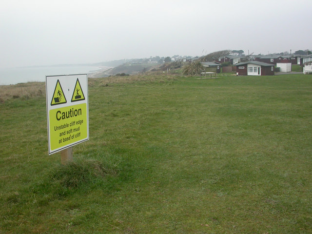

# Why edges fail

*Equivalence partitioning finds the classes and gives you a safe interior representative for each. Boundary value analysis exists because the safest value in a class is also the least likely place a defect actually hides.*

> Decades of testing experience point at the same uncomfortable pattern: a huge share of real defects
> cluster at the exact edges of input ranges, not scattered randomly across them. A field that correctly
> handles every value from 20 to 90 can still silently misfire on exactly 18, exactly 65, or exactly the
> one value a developer's `<` should have been `<=`. Equivalence partitioning's mid-range representative,
> by design, walks straight past every one of these. Boundary value analysis is the technique built
> specifically to stop walking past them.

> **In real life**
>
> A stretch of open field can look completely uniform right up until the exact point it becomes a
> crumbling cliff edge - the grass doesn't change color, the ground doesn't visibly shift, there's no
> gradient warning you which step is the last safe one. That's precisely why a caution sign gets planted
> well BEFORE the true edge, not on it: the danger isn't distributed evenly across the field, it's
> concentrated in a razor-thin line most people never even see coming. Software has the same shape. A
> function can behave identically for a thousand ordinary values and then flip its answer at exactly one
> of them - not because that value is special to look at, but because a developer's comparison operator
> drew the line one step off from where the spec actually intended it.

**Boundary**: A boundary is the exact point where an equivalence class ends and its neighbor begins - the specific value (or the pair of adjacent values) where a system's behavior is SUPPOSED to change. Boundary value analysis (BVA) is the technique of deliberately testing values at, and immediately next to, that point - rather than the safe interior representative equivalence partitioning would pick - because comparison-operator mistakes (< vs <=, > vs >=) live exactly there and nowhere else. An off-by-one error is the specific, extremely common defect shape BVA is built to catch: a boundary implemented one value away from where the specification actually placed it.

## Why the interior representative can't catch this

The previous module walked through picking a deliberately mid-range, boring representative for each
class - and explained why that's the right move for confirming a class's GENERAL behavior. But a
mid-range value is, by construction, far from every boundary. If a "senior discount applies at 65 and
older" rule is accidentally coded as `age > 65` instead of `age >= 65`, a representative like `80`
still returns the correct answer - the bug is invisible from the interior. Only testing at `65` itself
exposes it. This isn't a gap in equivalence partitioning's design, it's a deliberate division of labor:
EP proves the general case, BVA proves the exact edge.

## The comparison-operator trap

`<` versus `<=`, `>` versus `>=` - a single character's difference in a conditional is one of the most
common real-world coding mistakes, and it produces a defect that's invisible everywhere except the
exact value(s) next to the boundary. This is why BVA specifically targets the boundary value itself
AND the value immediately on either side of it: testing only the boundary can still pass by accident if
the surrounding logic happens to compensate, but testing the boundary alongside its immediate neighbors
makes an off-by-one error almost impossible to miss.

## The next two notes narrow this down further

This note establishes WHY boundaries deserve deliberate attention. The next note in this module,
two-value vs three-value BVA, gets specific about exactly which values around a boundary to test - and
how thorough to be about it.


*Barton on Sea, warning sign — Wikimedia Commons, CC BY-SA 2.0 (Mike Faherty, geograph.org.uk)*
- **The sign, planted well before the true edge = the warning arrives with room to react** — This sign isn't fixed to the crumbling lip itself - it sits a safe distance back, so anyone reading it still has ground to change course. A test that only checks a value exactly AT a boundary misses the equally real question of whether the system gives any warning on approach - most real protection happens before the edge, not at it.
- **The flat grass in between = looks identical to the danger zone, until it isn't** — From here, this grass is indistinguishable from the grass right at the crumbling edge - same color, same texture, no visible line marking where 'safe' quietly becomes 'about to give way.' That's exactly why boundary bugs are so easy to miss: the values on either side of a real boundary usually look completely ordinary too.
- **The actual cliff edge = the boundary itself, invisible from this distance** — You can't see the true edge in this photo at all - it's hidden past the grass, somewhere in the mist. In code, the exact line where `<` becomes `<=` is just as invisible by inspection; it only reveals itself when the specific value right against it gets tested.
- **The sea and beach far below = the consequence, once a boundary actually fails** — This is what a boundary defect looks like once it ships and a real user finally hits the exact wrong value - not a gentle warning anymore, but the failure the earlier caution existed to prevent.
- **The houses, set well back = a system designed with margin, not a razor-thin cutoff** — Whoever placed this row of buildings didn't build right up to today's edge line - cliffs erode, and boundaries move. A well-designed system does the same: build margin around a threshold rather than trusting one exact value to stay correct forever as requirements shift.

**From a mid-range pass to an exposed off-by-one bug - press Play**

1. **A class's mid-range representative passes cleanly** — Equivalence partitioning's job is done: age=80 correctly gets the senior discount. Nothing here suggests anything is wrong - and nothing here COULD suggest it, since the bug isn't in the interior.
2. **Identify the stated boundary from the spec** — "65 and older" names an exact value: 65 is the first value that should get the discount. That number, not some vague 'around retirement age,' is the boundary to target.
3. **Test the boundary value itself** — age=65 - does the discount apply, per the spec's own wording? This is the single most likely value in the entire input space to expose a comparison-operator mistake.
4. **Test the value immediately below it** — age=64 - this should clearly NOT get the discount. Confirms the boundary hasn't drifted the other direction, and that the neighboring class still behaves correctly.
5. **Compare all three results against the spec, side by side** — 64 correctly rejected, 65 incorrectly rejected, 66 correctly accepted - the exact shape of an `age > 65` bug where the spec said `age >= 65`. The pattern names the mistake precisely.

Here's exactly that bug, planted deliberately and caught by testing the boundary and its immediate
neighbor - not the interior value that would have missed it entirely:

*Run it - an off-by-one bug, caught only at the boundary (Python)*

```python
def is_senior_discount_eligible(age):
    # BUG: should be age >= 65, per the stated policy "65 and older"
    return age > 65

BOUNDARY_TESTS = [64, 65, 66]
for age in BOUNDARY_TESTS:
    expected = age >= 65
    actual = is_senior_discount_eligible(age)
    status = "PASS" if actual == expected else "FAIL - off-by-one bug caught"
    print(f"age={age}: expected={expected}, actual={actual}  [{status}]")

# age=64: expected=False, actual=False  [PASS]
# age=65: expected=True, actual=False  [FAIL - off-by-one bug caught]
# age=66: expected=True, actual=True  [PASS]
```

Same bug in Java - the shape a real eligibility check might take inside a checkout or membership
service:

*Run it - the off-by-one bug, boundary-tested (Java)*

```java
public class Main {

    static boolean isSeniorDiscountEligible(int age) {
        // BUG: should be age >= 65, per the stated policy "65 and older"
        return age > 65;
    }

    public static void main(String[] args) {
        int[] boundaryTests = {64, 65, 66};
        for (int age : boundaryTests) {
            boolean expected = age >= 65;
            boolean actual = isSeniorDiscountEligible(age);
            String status = expected == actual ? "PASS" : "FAIL - off-by-one bug caught";
            System.out.printf("age=%d: expected=%b, actual=%b  [%s]%n", age, expected, actual, status);
        }
    }
}

/* Output:
age=64: expected=false, actual=false  [PASS]
age=65: expected=true, actual=false  [FAIL - off-by-one bug caught]
age=66: expected=true, actual=true  [PASS]
*/
```

> **Tip**
>
> Notice that testing `age=80` (a perfectly reasonable equivalence-partitioning representative) would
> have shipped this bug undetected - it returns the correct `True` either way. The lesson isn't "EP is
> weaker than BVA" - it's that they answer different questions, and skipping either one leaves a real gap
> a single technique alone can't close.

### Your first time: Your mission: find one boundary and prove BVA catches what a mid-range test misses

- [ ] Find a field with a stated numeric threshold — "Free shipping over $50," "minimum password length 8," any rule with an exact number attached to a behavior change - on a real site, or in a ticket/spec you have access to.
- [ ] Test a safe mid-range value first, and confirm it passes — Same as an equivalence-partitioning representative - this establishes the general case works, but deliberately proves nothing about the exact edge.
- [ ] Test the boundary value itself, exactly as stated — If the rule says 'over $50,' test exactly $50.00 - does the free-shipping behavior the wording implies actually happen at that specific value?
- [ ] Test the value immediately on the other side — $49.99 alongside $50.00 (or $50.01, depending on how the rule reads) - the pair together is what makes an off-by-one error visible, not either value alone.
- [ ] Compare all three results against what the wording actually says — If the boundary value's result doesn't match a literal reading of the spec, you've found the exact shape of bug this note describes - name which comparison operator is likely wrong.

You proved, on a real field, that a comfortable mid-range pass says nothing about what happens at the one value where the rule's own wording is put to the test.

- **I tested the exact boundary value and it passed - does that mean the boundary is definitely correct?**
  Not by itself - test the immediate neighbor too. A boundary value passing in isolation can still hide a bug if the neighboring value is ALSO wrong in a way that happens to look consistent (both incorrectly accepted, for instance). The pair - boundary and neighbor together - is what actually confirms the line is drawn in the right place, not just that one point on it behaves.
- **The spec says 'over $50' but I'm not sure if that means $50.00 counts as 'over' or not.**
  This is a genuine ambiguity worth surfacing, not resolving by guessing - the English word 'over' is inherently unclear about whether it's inclusive. Flag it explicitly to whoever owns the requirement, and in the meantime test BOTH interpretations' worth of boundary values so you're covered whichever way it gets clarified.
- **I found an off-by-one bug at a boundary, but it seems to only affect a tiny number of real users - is it worth reporting?**
  Yes, and say so plainly in the report along with the narrow scope - a boundary bug affecting exactly one value (say, orders of precisely $50.00) is real and reproducible even if it's rare in practice. Let the team decide priority with accurate severity information; downgrading it yourself by not reporting it removes that choice from people who might weigh it differently (a $50.00 order might be extremely common on a specific promotional day, for instance).
- **I don't have access to the underlying code, only the running system - can I still do meaningful boundary testing?**
  Yes - black-box boundary testing doesn't require reading the comparison operator, only observing behavior at and around the stated threshold. If $50.00 and $49.99 both get charged shipping, or both get it free, you've found a real defect (or a real ambiguity) without ever seeing a line of code - the visible BEHAVIOR at the boundary is the evidence, not the source.

### Where to check

Where boundary-driven defects concentrate:

- **Any stated numeric threshold** — price cutoffs, age limits, length minimums/maximums, rate limits: wherever a spec names an exact number, that number is a boundary worth testing directly, not just approximately.
- **Loop and pagination logic** — "off-by-one" is the textbook name for exactly this defect class; the first and last item in a list are disproportionately likely to be mishandled.
- **Date and time ranges** — the last second of a promotion, the first day a subscription renews - inclusive/exclusive confusion around dates is a boundary bug with real financial consequences.
- **Anywhere a spec uses 'over,' 'under,' 'at least,' or 'up to'** — these words are exactly where inclusive/exclusive ambiguity hides; treat each one as a flag to test the literal boundary explicitly.
- **Recently changed validation logic** — a threshold that moved (a price tier changed from $50 to $75, for instance) is a fresh chance for the same off-by-one mistake to reappear at the new number.

The habit: **any time a spec names an exact number, test that number itself and its immediate neighbor - not just a value comfortably inside the range.**

### Worked example: catching a real off-by-one bug in a shipping threshold, black-box

1. **The rule, from a support page:** "Orders over $50 ship free." An equivalence-partitioning pass already confirmed $80 ships free and $20 doesn't - the general behavior works.
2. **Identify the exact boundary the wording implies.** "Over $50" suggests $50.00 itself should NOT qualify (it's not "over" $50, it's exactly $50) - free shipping should start at $50.01.
3. **Test $50.00 directly**, adding exactly one item priced to bring the cart to that figure. Result: free shipping applied. That contradicts the literal reading of "over $50."
4. **Before calling it a bug, test the immediate neighbor to confirm the pattern.** $49.99: shipping charged, as expected. $50.01: free shipping, as expected. Only $50.00 itself disagrees with the wording.
5. **This is the exact shape of an inclusive-boundary mistake** - the system was very likely built with `total >= 50` where the marketing copy's "over $50" implies `total > 50`. A one-character difference, exposed by testing precisely the value in question.
6. **Consider whether this is actually a defect or a spec inaccuracy.** It's entirely possible the ENGINEERING intent was always ">= $50" and the support page's wording is just loosely written - this is worth a genuine question, not an assumed bug report.
7. **File it as what it actually is: a discrepancy, not a confirmed defect** - "support page says 'over $50' (implies $50.01+); system applies free shipping starting at exactly $50.00. Please confirm which is the intended behavior and correct whichever side is wrong."
8. **The value of the finding doesn't depend on which side turns out to be 'right.'** Either the copy needs fixing or the code does - and without testing the exact boundary value, this mismatch would have shipped invisibly, discovered only by a customer noticing they got free shipping "early."

> **Common mistake**
>
> Treating a passing mid-range equivalence-partitioning test as proof that the boundaries around it are
> also correct. The two techniques test different things - EP proves a class behaves consistently in its
> interior, BVA proves the exact line between classes is drawn where the spec actually says it should be.
> A field can pass every EP representative and still ship an off-by-one bug that only a boundary-specific
> test would ever catch.

**Quiz.** A field's spec states: 'Passwords must be at least 8 characters.' A tester confirms a 12-character password is accepted and a 4-character password is rejected, then calls the field fully tested. What's missing, per this note?

- [x] The boundary itself (8 characters) and its immediate neighbor (7 characters) haven't been tested - an off-by-one mistake (like `length > 8` instead of `length >= 8`) would be invisible to the two tests already run
- [ ] Nothing is missing - a valid representative and an invalid representative fully cover a field's behavior regardless of any stated numeric threshold
- [ ] A 13-character password should be tested instead of the 12-character one, since boundary value analysis requires testing values as far as possible from the threshold
- [ ] The field needs a third valid representative between 8 and 12 characters to confirm the valid range is internally consistent

*12 and 4 are comfortable interior values for their respective equivalence classes - exactly the kind of representative that CONFIRMS the general behavior but, by construction, sits far from the one place an off-by-one bug actually lives. The spec names an exact threshold (8 characters), so the boundary value analysis this note describes calls for testing 8 itself (does it get accepted, as 'at least 8' implies?) and 7 (does it get correctly rejected?) - only that pair exposes a `length > 8` mistake where the spec meant `length >= 8`. Testing a value far from the threshold, like 13, moves in exactly the wrong direction for this purpose. And a third mid-range representative between 8 and 12 doesn't address the boundary question at all - it's still an interior value, no matter how many of those get added.*

- **Why can't equivalence partitioning's representative catch a boundary bug?** — A mid-range representative is, by design, far from every boundary - so a comparison-operator mistake (< vs <=) that only misfires at the exact edge is invisible from the interior. EP and BVA test different things.
- **The comparison-operator trap, in one line** — A single-character mistake (< vs <=, > vs >=) produces a defect invisible everywhere except the exact boundary value and its immediate neighbor - which is exactly what makes it easy to ship and hard to spot by eyeballing code.
- **Why test the boundary AND its immediate neighbor, not just the boundary alone?** — A boundary value passing in isolation can still hide a bug if the neighboring value is also wrong in a matching way. The pair together confirms the line is actually drawn in the right place.
- **What words in a spec should flag a boundary worth testing?** — "Over," "under," "at least," "up to" - these are exactly where inclusive/exclusive ambiguity hides, and each one names an exact value worth testing directly rather than approximately.
- **Can boundary testing be done without reading the source code?** — Yes - black-box boundary testing only requires observing behavior at and around a stated threshold. Consistent mis-handling at an exact value is evidence enough, independent of seeing the comparison operator itself.
- **What this note sets up for the rest of the module** — WHY boundaries deserve deliberate testing. The next note gets specific about exactly which values to test around a boundary (two-value vs three-value BVA) and how thorough to be.

### Challenge

Find a real field with a stated numeric threshold - a price cutoff, a length minimum, a rate limit, an
age restriction, anything with an exact number attached to a behavior change. Test three things in
order: (1) a comfortable mid-range value, to confirm the general case works; (2) the boundary value
itself, read literally against the spec's wording; (3) the value immediately on the other side of it.
Report all three results plainly. If the boundary value's result doesn't match a literal reading of the
spec's wording, name the exact comparison-operator mistake you suspect is behind it.

### Ask the community

> Boundary check on `[field/rule]`: spec says `[exact wording, e.g. 'orders over $50']`. I tested `[boundary value]` -> `[result]` and `[neighbor value]` -> `[result]`. Does this match a literal reading of the wording, or is this the off-by-one pattern this note describes?

The most useful replies quote the EXACT spec wording back and state plainly whether the observed
behavior matches it - "seems fine" without engaging the literal wording doesn't resolve an
inclusive/exclusive question.

- [ISTQB Glossary — boundary value analysis, the standard testing-certification definition](https://glossary.istqb.org/en_US/term/boundary-value-analysis)
- [GeeksforGeeks — Software Testing: Boundary Value Analysis, with examples](https://www.geeksforgeeks.org/software-testing/software-testing-boundary-value-analysis/)
- [Katalon — Boundary Value Analysis: A Complete Guide](https://katalon.com/resources-center/blog/boundary-value-analysis-guide)
- [Software Testing Mentor — Boundary Value Analysis in Testing, tutorial #35](https://www.youtube.com/watch?v=DpDgaGP-jsQ)

🎬 [Software Testing Tutorial #35 — Boundary Value Analysis in Testing](https://www.youtube.com/watch?v=DpDgaGP-jsQ) (13 min)

- Defects cluster disproportionately at the exact edges of input ranges, not scattered evenly across them - boundary value analysis exists specifically to test where bugs actually concentrate.
- A mid-range equivalence-partitioning representative, by construction, sits far from every boundary - it cannot catch a comparison-operator mistake (< vs <=) that only misfires at the exact edge.
- Test the boundary value AND its immediate neighbor together - a boundary passing in isolation can still hide a bug if the neighboring value is also wrong in a matching way.
- Words like 'over,' 'under,' 'at least,' and 'up to' flag an inclusive/exclusive ambiguity worth testing explicitly, not assuming.
- Boundary testing works black-box, without reading source code - consistent mis-handling at an exact stated value is evidence enough on its own.


---
_Source: `packages/curriculum/content/notes/test-design-techniques/boundary-value-analysis/why-edges-fail.mdx`_
