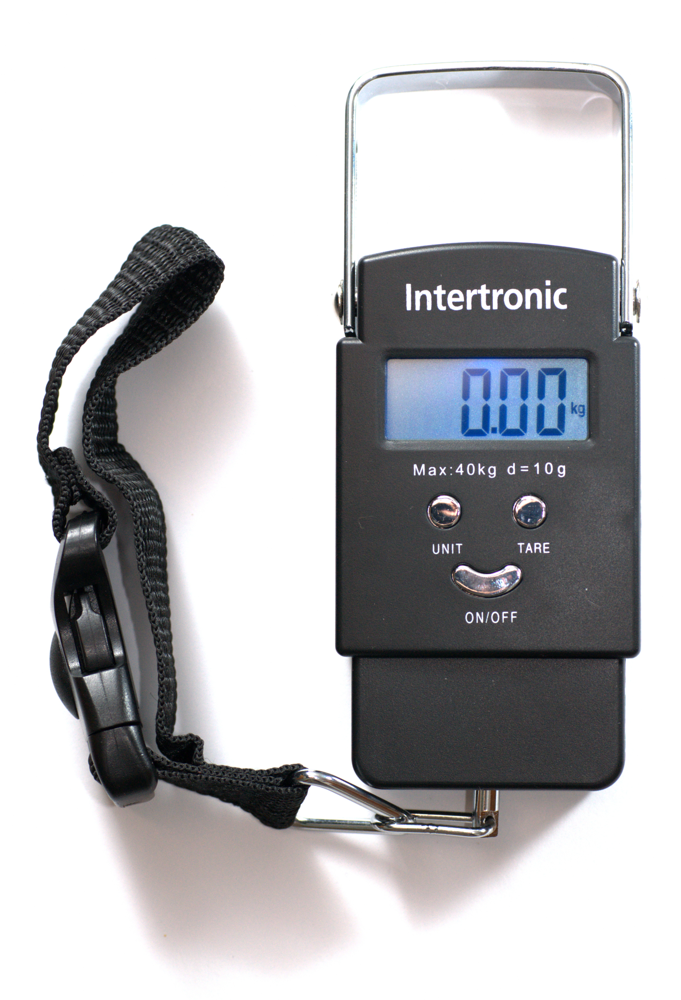

# Worked example

*Everything the last two notes covered - classes, valid and invalid, and picking a representative for each - applied start to finish against one real feature: an airline's checked-bag weight allowance.*

> Reading about equivalence partitioning in isolated fragments - "here's what a class is," "here's how
> to pick a representative" - can leave the technique feeling like separate rules to memorize rather than
> one continuous decision. This note is the antidote: one feature, worked start to finish, from a raw
> spec sentence to a finished, defensible test set, with every decision along the way explained in the
> moment it gets made.

> **In real life**
>
> A checked-bag scale at an airport counter doesn't care about the bag's brand, color, or contents - it
> produces exactly one number, and that number alone decides which of a small handful of outcomes
> happens next: ships free, ships for a fee, or gets refused at the counter. That's equivalence
> partitioning already running in production, whether or not anyone ever called it that: a huge space of
> possible bags collapses down to a few classes the instant the number appears on the display. This note
> walks through building that same classification, deliberately, the way a tester would - not the way
> the airline's engineers already did.

**Worked example**: A worked example, in the context of a test-design technique, is a complete walkthrough from a raw requirement to a finished, justified set of test cases - showing every decision (not just the final answer) so the REASONING transfers to a new field the reader hasn't seen before. The value isn't the specific test cases produced here; it's watching the technique's rules get applied under real ambiguity, the kind a textbook definition glosses over.

## The spec, as given

A budget airline's checked-baggage policy, copied straight from their support page: *"Each checked bag
must weigh 23kg or less at no extra charge. Bags between 23.01kg and 32kg incur a $75 overweight fee.
Bags over 32kg will not be accepted at check-in, per carrier safety policy."* One sentence, three
numbers, and - if you read closely - a boundary-adjacent trap already sitting inside it, which the
next note in this module (boundary value analysis) will pick apart properly. For now, the job is
narrower: turn this sentence into equivalence classes.

## Step one: count the distinct behaviors, not the numbers

Three numbers appear in the spec, but the number of DISTINCT SYSTEM BEHAVIORS is what actually
matters: accept-free, accept-with-fee, and refuse. That's three classes on the "the bag exists and has
a real weight" side. A fourth, easy to miss because the spec never mentions it: what happens if the
scale reports something nonsensical, like `0` or a negative number from a sensor glitch? That's not
covered by the policy sentence at all - which is itself worth flagging, not silently assuming away.


*Luggage weighting scale — Wikimedia Commons, CC BY-SA 3.0 / GFDL (Simon A. Eugster)*
- **The digital readout = the raw value waiting to be classified** — "0.00 kg" is just a number until a rule gets applied to it - on its own it says nothing about whether a bag ships free, costs extra, or gets refused. Every equivalence-partitioning exercise starts here: a raw measurement with no class assigned yet.
- **"Max: 40kg" printed on the device = a boundary that already exists, not one you invent** — This scale's own hardware limit is a real equivalence-class boundary, printed right on the case. Classes aren't always something a tester makes up - they're frequently already defined by a spec, a device limit, or a published policy, waiting to be read rather than guessed at.
- **UNIT = a reminder that a class boundary can mean something different depending on context** — Switch this from kg to lb and the SAME physical bag now compares against a completely different-looking number, even though nothing about the bag changed. A worked example has to pin down its units early, or the 'boundary' being tested silently shifts meaning partway through.
- **TARE = zeroing the baseline before the real measurement happens** — Pressing tare resets the display to a known-clean zero before anything real gets weighed - the equivalent of confirming a clean starting state before running a representative through a system, so a stale prior reading doesn't get misclassified as the new one.
- **The carabiner hook = where the abstract class meets an actual bag** — Every equivalence class stays theoretical until something real gets attached and measured. This is that moment - the point where 'standard', 'overweight', and 'rejected' stop being labels on paper and become a verdict on one specific suitcase.

**From one spec sentence to a finished class list - press Play**

1. **Read the spec sentence twice - once for numbers, once for behaviors** — The first read finds 23kg, 32kg, $75. The second read - the one that matters more - finds three outcomes: free, fee, refused. Numbers are inputs; behaviors are classes.
2. **Ask what the spec DIDN'T say** — Nothing here covers a zero or negative weight reading. That silence isn't nothing - it's a gap a tester has to fill deliberately, flagged as an assumption rather than quietly skipped.
3. **Draft the class list with plain-English names** — invalid: non-positive reading / standard: no fee / overweight: fee applies / rejected: exceeds safety limit. Four classes, each one a distinct system behavior, named so anyone can recognize them later.
4. **Pick one mid-range representative per class** — Not the edges - 11.6kg for standard, 27.6kg for overweight, 46kg for rejected, -2.5kg for the invalid reading. Boring, typical, unambiguous, exactly as the previous note in this module described.
5. **Verify each representative actually lands in its intended class** — Run the representative through the real classification logic (or the real system) and confirm the result matches the class it was meant to represent - catching a drafting mistake before it ships as a test case.

Here's the four-class model from the spec sentence, with a representative chosen and verified for each -
exactly the sequence the FlowAnimation above just walked through, now as runnable code:

*Run it - the full checked-bag classifier, spec to verified representatives (Python)*

```python
def classify_bag_weight(kg):
    if kg <= 0:
        return "invalid: non-positive reading"
    if kg <= 23:
        return "standard: no fee"
    if kg <= 32:
        return "overweight: fee applies"
    return "rejected: exceeds carrier safety limit"

# Classes drafted directly from the spec sentence, plus the one gap it left unstated
CLASSES = {
    "invalid: non-positive reading": (-5, 0),
    "standard: no fee": (0.1, 23),
    "overweight: fee applies": (23.1, 32),
    "rejected: exceeds carrier safety limit": (32.1, 60),
}

def midpoint(low, high):
    return round((low + high) / 2, 1)

print(f"{'Class':40} {'Representative':>15} Result")
for name, (low, high) in CLASSES.items():
    rep = midpoint(low, high)
    result = classify_bag_weight(rep)
    match = "OK" if result == name else "MISMATCH"
    print(f"{name:40} {rep:>15} kg -> {result}  [{match}]")

# Class                                     Representative Result
# invalid: non-positive reading                       -2.5 kg -> invalid: non-positive reading  [OK]
# standard: no fee                                    11.6 kg -> standard: no fee  [OK]
# overweight: fee applies                             27.6 kg -> overweight: fee applies  [OK]
# rejected: exceeds carrier safety limit              46.0 kg -> rejected: exceeds carrier safety limit  [OK]
```

Same model in Java - the shape this logic might actually take inside a checked-bag pricing service:

*Run it - the checked-bag classifier (Java)*

```java
import java.util.*;

public class Main {

    record ClassRange(String name, double low, double high) {}

    static final List<ClassRange> CLASSES = List.of(
        new ClassRange("invalid: non-positive reading", -5, 0),
        new ClassRange("standard: no fee", 0.1, 23),
        new ClassRange("overweight: fee applies", 23.1, 32),
        new ClassRange("rejected: exceeds carrier safety limit", 32.1, 60)
    );

    static String classifyBagWeight(double kg) {
        if (kg <= 0) return "invalid: non-positive reading";
        if (kg <= 23) return "standard: no fee";
        if (kg <= 32) return "overweight: fee applies";
        return "rejected: exceeds carrier safety limit";
    }

    static double midpoint(double low, double high) {
        return Math.round((low + high) / 2 * 10.0) / 10.0;
    }

    public static void main(String[] args) {
        System.out.printf("%-40s %15s %s%n", "Class", "Representative", "Result");
        for (ClassRange c : CLASSES) {
            double rep = midpoint(c.low(), c.high());
            String result = classifyBagWeight(rep);
            String match = result.equals(c.name()) ? "OK" : "MISMATCH";
            System.out.printf("%-40s %15s kg -> %s  [%s]%n", c.name(), rep, result, match);
        }
    }
}

/* Output:
Class                                     Representative Result
invalid: non-positive reading                       -2.5 kg -> invalid: non-positive reading  [OK]
standard: no fee                                    11.6 kg -> standard: no fee  [OK]
overweight: fee applies                             27.6 kg -> overweight: fee applies  [OK]
rejected: exceeds carrier safety limit              46.1 kg -> rejected: exceeds carrier safety limit  [OK]
*/
```

> **Tip**
>
> Notice the "MISMATCH" check baked into both playgrounds above - the code doesn't just print a
> representative's result, it confirms that result actually matches the class the representative was
> DRAFTED to represent. This is a real habit worth carrying into manual testing too: after picking a
> representative on paper, mentally (or actually) run it through the system's stated rules before typing
> it into a test case, catching an off-by-one in your own class definitions before it becomes a wasted
> test run.

### Your first time: Your mission: run this exact process on a policy sentence of your own

- [ ] Find one real policy or spec sentence with numeric thresholds — A shipping cost tier, a discount rule, a rate limit, a file-size cap - any real product or public policy page with a rule stated in one or two sentences.
- [ ] Read it twice: once for numbers, once for behaviors — Write down the distinct OUTCOMES, not just the numbers mentioned. If the sentence names three price points, count how many actually-different system responses those points produce.
- [ ] Name the gap the sentence doesn't cover — Every real policy sentence skips some input entirely (zero, negative, missing, wildly out of range). Write down what it is, even if you can't test it yet - naming the gap is itself the deliverable.
- [ ] Draft classes with plain-English names and pick a mid-range representative for each — Same as the previous note's mission - avoid the edges here on purpose, they belong to boundary value analysis next.
- [ ] Verify each representative by hand or in code — Confirm your own representative actually produces the class you intended, the way the playground above does programmatically. A mismatch here means the class definition itself needs fixing, not just the test case.

You ran the full sequence - spec to classes to verified representatives - on a rule nobody handed you pre-partitioned, which is the actual job.

- **My verification step showed a MISMATCH - the representative I picked landed in a different class than I expected.**
  This is the exercise working correctly, not failing. It means either the class boundary was mis-transcribed from the spec (an off-by-0.01 error, an inclusive/exclusive mixup), or the representative's midpoint math actually crossed into the neighboring class. Fix the class definition, re-pick the midpoint, and re-verify - never just swap in a different representative without understanding why the first one landed wrong.
- **The spec sentence I'm working from doesn't give me exact numeric boundaries, just vague language like 'a large order.'**
  Treat this as its own finding, not a blocker: write down the ambiguity explicitly ('large order' - undefined threshold) and either find the actual number elsewhere in the system (a config value, a database constraint) or flag it as a question for whoever owns the spec. Partitioning a vague requirement without resolving the number first just produces classes nobody can defend.
- **I found more than four classes once I dug into the real system - the spec sentence undersold how complex the field actually is.**
  That's a completely normal outcome of doing this properly - specs are frequently a simplification of what the system actually does. Document the additional classes you found with a note on where they came from (code, observed behavior, a support article the public policy page didn't mention), and treat the expanded list as the real deliverable, not the original four.
- **I'm not sure whether the invalid class I identified (negative/zero weight) is even reachable in the real system.**
  Don't skip it just because it seems unlikely - a sensor glitch, a network hiccup returning a default value, or a manual override field are all plausible real paths to a weird invalid reading. If you genuinely can't produce it to test, say so explicitly in the test plan rather than pretending the class doesn't exist; an untestable class is still a documented risk.

### Where to check

Applying this same sequence elsewhere:

- **Any pricing or fee tier** — shipping costs, subscription plans, overage charges: almost always three or more behaviors hiding behind two or three published numbers.
- **Rate limits and quotas** — an API's "100 requests per minute" is a valid-class/rejected-class pair at minimum, often with a third "approaching the limit, warning issued" class the docs don't always mention.
- **File upload constraints** — size limits, type restrictions, and page/duration caps (for documents or video) each get their own class list, drafted the same way as this note's weight example.
- **Any policy sentence with an unstated edge case** — the "what if the input is invalid/missing/malformed" class that a public-facing policy sentence almost never states, but the system always has to handle somehow.
- **Config values and database constraints, when accessible** — a spec's vague language often has an exact number sitting in code or a schema; check there before guessing at a threshold.

The habit: **treat every policy sentence as an equivalence-partitioning exercise waiting to happen, not just documentation to skim.**

### Worked example: the same exercise, one level harder: a spec with a subtle boundary trap

1. **A second policy sentence, from the same airline's page:** "Bags between 23kg and 32kg incur the overweight fee." Notice this one drops the ".01" precision the first sentence had - does `23kg` exactly belong to standard or overweight now?
2. **This is a real ambiguity, not a technicality to wave away.** The word "between" is doing a lot of unstated work - inclusive of both ends? Exclusive? Different systems interpret this differently, and a tester's job is to surface the question, not silently pick an interpretation.
3. **Draft two competing class models rather than guessing:** Model A treats 23kg as still "standard" (matching the first sentence's precision); Model B treats 23kg as the start of "overweight" (reading "between 23 and 32" as inclusive on both ends).
4. **This is exactly where equivalence partitioning alone runs out of road.** Both models produce valid-looking equivalence classes - the disagreement is specifically AT the boundary, which is precisely the question boundary value analysis (the next technique in this module) is built to answer, not this one.
5. **The correct move here isn't to resolve it with more equivalence partitioning.** It's to flag the ambiguity explicitly - "spec is unclear whether 23.00kg exactly is standard or overweight" - and hand it to whoever owns the requirement, or note it as an assumption if no one's available to ask.
6. **Meanwhile, the classes AWAY from the boundary are unaffected and can proceed normally.** `11.6kg` is unambiguously standard under either model; `27.6kg` is unambiguously overweight under either model. The ambiguity is narrow and localized - don't let it stall testing the rest of the feature.
7. **Document the assumption made and move forward**: "Testing 23.00kg specifically as a boundary case in the next note (BVA); until resolved, treating it as 'standard' per the more precise first policy sentence found." A defensible, written assumption beats silent guessing every time.
8. **The lesson carried into the next note:** equivalence partitioning tells you WHICH classes exist and gives you a safe interior representative for each - it deliberately does NOT resolve what happens exactly at a boundary. That handoff is the whole reason boundary value analysis exists as a separate technique.

> **Common mistake**
>
> Treating the numbers in a spec sentence as the whole exercise and skipping the "what behaviors does
> this actually produce" step. It's tempting to see "23kg, 32kg, $75" and immediately start writing test
> values near those numbers - but that's jumping straight to boundary value analysis without first
> confirming the CLASSES are even correctly identified. Read for behaviors first, draft class names in
> plain English, and only then pick representatives - skipping straight to numbers is how an
> undocumented fourth class (like the invalid non-positive reading in this note) gets missed entirely.

**Quiz.** Working through a spec sentence, a tester finds a genuine ambiguity: does a value sitting exactly on a stated boundary belong to the lower class or the upper one? What's the correct next step, per this note?

- [x] Flag the ambiguity explicitly and document an assumption or ask the requirement owner, while continuing to test the unambiguous interior representatives of the surrounding classes normally
- [ ] Silently pick whichever interpretation seems more likely and proceed without documenting the choice, since equivalence partitioning is meant to resolve exactly this kind of question
- [ ] Stop all testing on the feature until the ambiguity is formally resolved by a product owner, since no other classes can be trusted until it is
- [ ] Delete the ambiguous boundary value from the test plan entirely, since equivalence partitioning only concerns itself with interior, non-boundary values

*Equivalence partitioning's job is identifying classes and picking safe, interior representatives for each - it does not, by itself, resolve what happens exactly at a boundary; that's boundary value analysis's job, covered next in this module. The correct move when a genuine boundary ambiguity surfaces is to name it explicitly and either resolve it with whoever owns the spec or document the assumption made, while continuing to test the classes that aren't affected by the ambiguity - 11.6kg is unambiguously 'standard' regardless of how the 23kg question resolves. Silently guessing hides a real risk; stopping all testing over one narrow, localized question wastes the work that isn't blocked by it; and deleting the boundary value from consideration just defers the same open question to later, worse, when nobody remembers it was ever raised.*

- **The sequence this worked example followed** — Read the spec for numbers AND behaviors -> name the gap the spec doesn't cover -> draft plain-English class names -> pick a mid-range representative per class -> verify each representative lands in its intended class.
- **Why verify a representative after picking it?** — To catch a mistake in your OWN class definition (an off-by-0.01, an inclusive/exclusive mixup) before it becomes a wasted or misleading test case - not just to confirm the system works.
- **What to do when a spec sentence has a genuine boundary ambiguity** — Flag it explicitly, document an assumption or ask the requirement owner, and keep testing the unaffected classes normally. Don't silently guess, and don't halt everything over one localized question.
- **Why does a spec sentence's silence on invalid input matter?** — A policy sentence almost never states what happens for a nonsensical or missing input (like a negative weight reading) - that silence is a real gap a tester has to name and address, not assume away.
- **What equivalence partitioning deliberately does NOT resolve** — What happens exactly AT a boundary - inclusive vs exclusive, off-by-one questions. That's specifically boundary value analysis's job, the next technique in this module.
- **Why read a spec sentence twice - once for numbers, once for behaviors?** — Numbers alone can undercount the real classes. Counting distinct system BEHAVIORS (accept-free, accept-with-fee, refuse, plus any undocumented invalid case) is what actually determines how many classes exist.

### Challenge

Find a real policy sentence with at least two numeric thresholds - a shipping calculator, a rate
limit, a discount tier, a file-size cap, anything with published numbers. Run this note's full
sequence on it: (1) list the distinct behaviors, not just the numbers; (2) name at least one gap the
sentence doesn't explicitly cover; (3) draft plain-English class names; (4) pick and verify a mid-range
representative for each class. Then specifically hunt for a boundary ambiguity like the "between 23kg
and 32kg" example in this note's second WorkedExample - does your sentence have one? Write one sentence
stating what it is, or confirming you checked and didn't find one.

### Ask the community

> Worked-example check on `[policy sentence source]`: I identified these classes - `[list]` - with representatives `[list]`. Did I undercount the behaviors, or find a boundary ambiguity worth flagging separately? Here's the exact sentence I worked from: `[quote]`

The most useful replies quote the EXACT wording that creates an ambiguity or a missed class - vague
"seems okay" feedback doesn't sharpen this the way a specific "what about X" question does.

- [ISTQB Glossary — equivalence partitioning, the standard testing-certification definition](https://glossary.istqb.org/en_US/term/equivalence-partitioning)
- [Guru99 — Equivalence Partitioning and Boundary Value Analysis with worked examples](https://www.guru99.com/equivalence-partitioning-boundary-value-analysis.html)
- [Baeldung — Software Testing: Equivalence Partitioning explained with examples](https://www.baeldung.com/cs/software-testing-equivalence-partitioning)
- [Software Testing 101 — Equivalence Partitioning Test Design Technique Explanation](https://www.youtube.com/watch?v=4ckZYRvDzLU)

🎬 [Equivalence Partitioning Test Design Technique Explanation](https://www.youtube.com/watch?v=4ckZYRvDzLU) (13 min)

- Read a spec sentence twice: once for the numbers, once for the distinct BEHAVIORS those numbers produce - behaviors, not numbers, are what define classes.
- Name the gap a spec sentence never states - almost every real policy skips what happens for invalid, missing, or nonsensical input, and that silence is a finding worth documenting.
- Verify a representative after picking it: confirm it actually lands in the class it was drafted to represent, catching a class-definition mistake before it becomes a misleading test.
- A genuine boundary ambiguity (does the edge belong to the lower or upper class?) isn't equivalence partitioning's job to resolve - flag it, document an assumption, and hand it to boundary value analysis, next in this module.
- This same read-classify-represent-verify sequence applies to any policy with numeric thresholds: pricing tiers, rate limits, file-size caps, and beyond.


---
_Source: `packages/curriculum/content/notes/test-design-techniques/equivalence-partitioning/ep-worked-example.mdx`_
