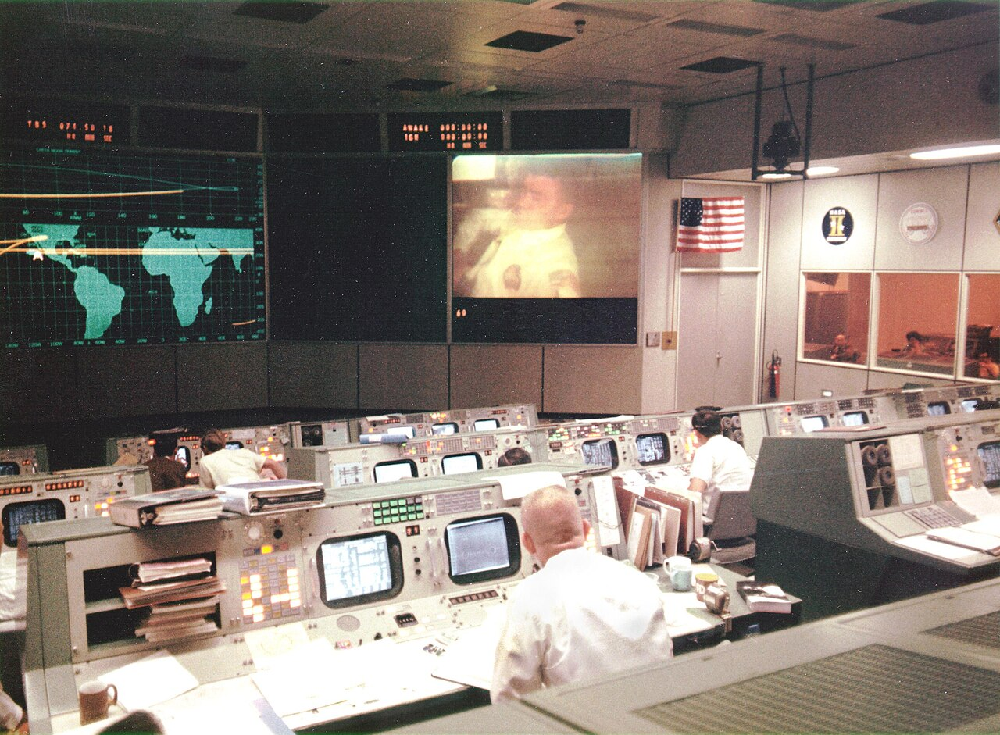

# Async communication

*Mission control couldn't call the spacecraft back to ask a quick clarifying question - every procedure was written complete enough to survive the delay. A Slack message assuming the reader has live context needs that same discipline: self-contained, or it just creates a round-trip.*

> "Can you check the thing from earlier?" posted in a team channel assumes the reader remembers exactly
> which thing, has the same context the writer had in the moment, and is online right now to ask a
> follow-up if not. On a distributed team spread across time zones, that message sits unanswered for
> hours, and the eventual reply is usually a clarifying question right back - a full round-trip spent
> just establishing what should have been in the original message.

> **In real life**
>
> Apollo mission control could not call the spacecraft back mid-procedure to ask a clarifying question -
> every checklist, every command sequence, was written complete enough to be executed correctly without
> a live conversation filling in the gaps, because a live conversation might not be possible at exactly
> the moment it was needed. The stacks of thick reference binders at every console existed for the same
> reason: when a question comes up, the answer needs to already be written down, not dependent on
> catching the one person who happens to remember it. Async communication asks a written message to
> clear that same bar - complete enough on its own that the reader never has to interrupt anyone to
> understand it.

**Async communication**: Async communication is written communication - a message, a doc, a ticket comment - composed to be fully understood by a reader with no shared live context and no immediate chance to ask a follow-up question, in contrast to synchronous communication (a call or in-person conversation) where gaps can be filled in real time.

## Self-contained means frontloaded, not just complete eventually

A context-rich async message frontloads everything a reader needs: the background, the reasoning
behind a request or decision, and what response or action is actually needed - not scattered across a
long thread the reader has to reconstruct, and not left implicit on the assumption the reader already
has the same mental model the writer does. "As discussed" or "see above" in a long thread forces a
scroll-back that a synchronous conversation would never have required, because in person the shared
context was already live in the room.

## Batch questions, and set explicit response expectations

Five separate one-line questions posted across a day each cost the reader a fresh context switch;
batching them into one clear, numbered list costs one. And because an async message has no guaranteed
immediate reply, it needs to say explicitly when a response is actually needed and why - a message
with no deadline reads as low-priority by default and can sit for days, even when the writer actually
needed an answer that afternoon. Reserve a synchronous meeting for the genuinely ambiguous or
emotionally sensitive conversations that benefit from real-time back-and-forth; for everything else,
a well-written async message respects everyone's actual schedule far better than a calendar invite
does.

> **Tip**
>
> Before sending any async message, read it back and ask: could someone with zero context on this
> conversation understand exactly what happened and what's needed, with no follow-up question? If not,
> add whatever's missing before sending, not after the first clarifying reply comes back.

> **Common mistake**
>
> Defaulting to "let's hop on a call" the moment a question takes more than one sentence to answer. Many
> of those questions are answerable, completely, in a well-written async message - a meeting should be
> the exception reached for deliberately, not the default first move.


*Mission Operations Control Room during Apollo 13 — NASA, public domain, via Wikimedia Commons. [Source](https://commons.wikimedia.org/wiki/File:Mission_Operations_Control_Room_during_Apollo_13.jpg)*
- **The trajectory display - status, not a conversation** — Continuously updated, readable by anyone glancing at it without asking a question first. A good async message works the same way: self-contained enough that a reader gets the full picture without needing to interrupt anyone.
- **Stacks of reference binders at every console** — Written procedures thick enough to answer nearly any question that comes up, because a controller cannot just call and ask mid-mission. Async communication needs that same completeness written in up front.
- **One controller, working from what's already written** — Not waiting on a live conversation to know what to do next - the information needed is already there, referenced directly. Exactly the posture async communication asks of both writer and reader.
- **The one live video link, used deliberately** — Real-time contact exists and gets reserved for the moment it's actually needed - not the default first move for something a written message could have handled.

**Writing one message that survives the delay**

1. **Frontload background and reasoning, not just the ask** — Who this is for, why now, what decision or action is actually needed - stated up front, not implied.
2. **Batch related questions into one list** — One context switch for the reader instead of several fragmented ones spread across a day.
3. **State an explicit response expectation** — When a reply is actually needed, and why - a message with no deadline defaults to low priority.
4. **Read it back as a stranger would** — Could someone with zero shared context understand and act on this with no follow-up question?

*Scoring a message for async self-containment (Python)*

```python
messages = [
    "Can you check the thing from earlier? Let me know when you get a chance.",
    ("Context: the checkout regression suite (link) started failing on the payment step Tuesday. "
     "I traced it to an expired test card in the fixture data (see attached log, line 42). "
     "Ask: can you refresh the test card by end of day Thursday - blocking the release sign-off "
     "scheduled for Friday morning?"),
]

def score(msg):
    has_context = "context" in msg.lower() or len(msg) > 150
    has_specific_ask = "?" in msg and ("can you" in msg.lower() or "need" in msg.lower())
    has_deadline = any(w in msg.lower() for w in ["by ", "end of day", "friday", "thursday", "deadline"])
    has_reference = "link" in msg.lower() or "log" in msg.lower() or "line " in msg.lower()
    return {
        "frontloaded context": has_context,
        "specific, actionable ask": has_specific_ask,
        "explicit response timing": has_deadline,
        "concrete reference (link/log/line)": has_reference,
    }

for m in messages:
    print("Message: " + m[:60] + ("..." if len(m) > 60 else ""))
    checks = score(m)
    for label, passed in checks.items():
        print("  " + ("PASS" if passed else "MISS") + ": " + label)
    print("  Self-containment score: " + str(sum(checks.values())) + "/4")
    print("")
```

*Scoring a message for async self-containment (Java)*

```java
import java.util.*;

public class Main {
    public static void main(String[] args) {
        List<String> messages = Arrays.asList(
                "Can you check the thing from earlier? Let me know when you get a chance.",
                "Context: the checkout regression suite (link) started failing on the payment step Tuesday. " +
                "I traced it to an expired test card in the fixture data (see attached log, line 42). " +
                "Ask: can you refresh the test card by end of day Thursday - blocking the release sign-off " +
                "scheduled for Friday morning?"
        );

        for (String m : messages) {
            String lower = m.toLowerCase();
            boolean hasContext = lower.contains("context") || m.length() > 150;
            boolean hasSpecificAsk = m.contains("?") && (lower.contains("can you") || lower.contains("need"));
            boolean hasDeadline = lower.contains("by ") || lower.contains("end of day") ||
                    lower.contains("friday") || lower.contains("thursday") || lower.contains("deadline");
            boolean hasReference = lower.contains("link") || lower.contains("log") || lower.contains("line ");

            Map<String, Boolean> checks = new LinkedHashMap<>();
            checks.put("frontloaded context", hasContext);
            checks.put("specific, actionable ask", hasSpecificAsk);
            checks.put("explicit response timing", hasDeadline);
            checks.put("concrete reference (link/log/line)", hasReference);

            String preview = m.length() > 60 ? m.substring(0, 60) + "..." : m;
            System.out.println("Message: " + preview);
            int score = 0;
            for (Map.Entry<String, Boolean> entry : checks.entrySet()) {
                if (entry.getValue()) score++;
                System.out.println("  " + (entry.getValue() ? "PASS" : "MISS") + ": " + entry.getKey());
            }
            System.out.println("  Self-containment score: " + score + "/4");
            System.out.println();
        }
    }
}
```

### Your first time: Rewrite one message for full self-containment

- [ ] Find a recent message you sent that got a clarifying question back — A real example, not a hypothetical - the clarifying reply is proof something was missing.
- [ ] Identify exactly what the follow-up question was asking for — That gap is precisely what the original message should have included.
- [ ] Rewrite the message with that missing context frontloaded — Background, the specific ask, and an explicit response timeframe.
- [ ] Read it back as someone with zero context on the conversation — Confirm it would make sense and be actionable without any prior thread to reference.

- **A written question sits unanswered for days even though the writer needed a same-day response.**
  No explicit response timing was stated - a message with no deadline reads as low priority by default. Add a specific 'need this by X, because Y' framing.
- **A team keeps scheduling meetings for questions that could be answered in a well-written message.**
  Default is likely flipped - try writing the fully self-contained async version first, and only escalate to a meeting for the genuinely ambiguous cases that resist a written answer.
- **Someone in a different time zone reports feeling constantly behind and confused by ongoing threads.**
  Messages in the thread are likely assuming live, shared context rather than being self-contained - audit recent messages for 'as discussed' or 'see above' phrasing and rewrite with the missing background included.

### Where to check

- Any message about to be sent to someone in a different time zone or working schedule, specifically checked for frontloaded context and an explicit response timeframe.
- Recent threads containing "as discussed" or "see above" - a strong signal the message assumed live context it never actually stated.
- [[test-management-and-reporting/docs-and-communication/status-updates]] for how this same self-containment discipline applies to short, recurring updates specifically.
- [[test-management-and-reporting/docs-and-communication/writing-for-developers]] for the precision standard the technical content of an async message should meet.
- [[test-management-and-reporting/docs-and-communication/confluence-and-wikis]] for moving genuinely durable context out of ephemeral chat entirely, into something a self-contained message can simply link to.

### Worked example: a two-day delay caused by one missing sentence

1. A tester in one time zone posts: "Hey, did the fix for the login bug go out?" with no further
   context, at the end of their working day.
2. A developer in a different time zone, twelve hours offset, sees it the next morning and has no idea
   which login bug, which fix, or why it matters right now - they reply asking for clarification.
3. The original tester doesn't see the reply until their own next working day, twelve hours later
   still - a question that could have been answered in one message has now cost two full day-long
   round-trips before any real answer arrives.
4. Rewritten with full context: "The session-timeout login bug (ticket QA-4021) - did the fix ship in
   yesterday's release? I need to confirm before closing out this week's regression report, due
   tomorrow 10am my time." Every piece of missing context is now present in the original message.
5. The developer, seeing the rewritten version the next morning, answers directly with no clarifying
   round-trip needed - the same underlying question, resolved in one exchange instead of three.

**Quiz.** Why does this note say a message like 'can you check the thing from earlier?' fails specifically on a distributed, asynchronous team?

- [ ] Because it uses informal language
- [x] Because it assumes shared live context and immediate availability to clarify - on a team without those, it triggers a slow, multi-day round-trip just to establish what should have been stated up front
- [ ] Because it's too short to be taken seriously
- [ ] Because asynchronous communication should never include casual phrasing

*On a synchronous team in the same room, a vague reference gets clarified instantly with a follow-up question. On a distributed async team, that same gap can cost a full day-long round-trip per clarification needed - which is exactly why the discipline here is frontloading enough context that no clarifying question is needed at all.*

- **Async communication** — Written communication composed to be fully understood by a reader with no shared live context and no immediate chance to ask a follow-up question.
- **Context-rich, frontloaded messaging** — Background, reasoning, and the specific ask stated up front in the message itself - not left implicit or scattered across a thread the reader has to reconstruct.
- **Why batching questions matters** — Each separate question posted throughout a day costs the reader a fresh context switch - batching related questions into one list costs only one.
- **Why explicit response timing matters** — A message with no stated deadline defaults to low priority and can sit unanswered for days, even when the writer genuinely needed a faster response.

### Challenge

Find a recent message you sent that received a clarifying question back. Identify exactly what that follow-up was asking for, then rewrite the original message with that missing context frontloaded so no clarification would have been needed.

- [GitLab Handbook — Asynchronous Communication](https://handbook.gitlab.com/handbook/company/culture/all-remote/asynchronous/)
- [Otter.ai — Mastering Asynchronous Communication: Examples and Best Practices](https://otter.ai/blog/asynchronous-communication)
- [What Is Asynchronous Communication in Remote Work? (Why It's Important)](https://www.youtube.com/watch?v=btO-l-nTPPA)

🎬 [What Is Asynchronous Communication in Remote Work? (Why It's Important)](https://www.youtube.com/watch?v=btO-l-nTPPA) (6 min)

- Async communication has to be self-contained - complete enough that a reader with no shared live context never needs to send a clarifying question back.
- Frontload background, reasoning, and the specific ask - never leave them implicit or scattered across a thread the reader has to reconstruct.
- Batch related questions into one message instead of fragmenting them - each separate question costs a fresh context switch on the receiving end.
- State an explicit response timeframe - a message with no deadline defaults to low priority and can sit unanswered far longer than intended.
- Reserve synchronous meetings for genuinely ambiguous or sensitive conversations - default to a well-written async message for everything else.


## Related notes

- [[Notes/test-management-and-reporting/docs-and-communication/status-updates|Status updates]]
- [[Notes/test-management-and-reporting/docs-and-communication/writing-for-developers|Writing for developers]]
- [[Notes/test-management-and-reporting/docs-and-communication/confluence-and-wikis|Confluence / wikis]]


---
_Source: `packages/curriculum/content/notes/test-management-and-reporting/docs-and-communication/async-communication.mdx`_
