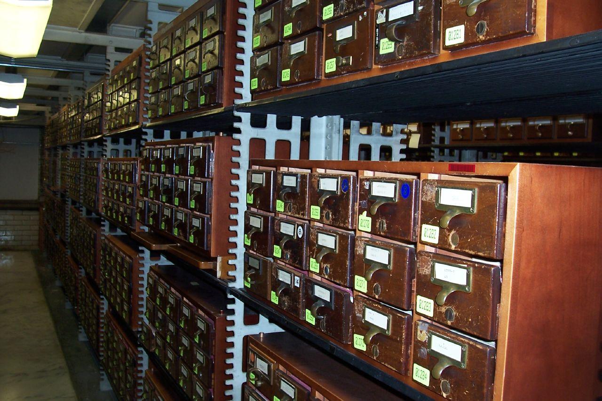

# Confluence / wikis

*A card catalog drawer with a worn, illegible label is still technically in the system and completely useless. A wiki page nobody reviews or archives rots the exact same way - and unlike a blank page, it actively lies to the next person who trusts it.*

> A wiki page describing a test environment's setup steps, written accurately eighteen months ago and
> never touched since, is worse than no documentation at all. A tester with no documentation asks a
> teammate and gets a current answer. A tester who trusts the stale page follows steps that describe a
> system that no longer exists - and has no reason to suspect anything is wrong until something breaks.

> **In real life**
>
> A library card catalog drawer only works because every card inside it is legible, correctly filed,
> and cross-referenced to related cards by number - pull the wrong drawer, or trust a label worn
> illegible with age, and the whole point of the system collapses even though the physical drawer is
> still sitting right there, technically part of the catalog. A wiki page rots the exact same way:
> still technically present, still returned by a search, and actively misleading the moment nobody has
> kept it current with what actually changed underneath it.

**A team wiki**: A team wiki (Confluence or similar) is a durable, searchable, cross-linked knowledge base meant to outlive any single person's memory or a single chat thread - valuable only to the extent every page stays findable, current, and owned, since a stale or duplicated page actively misleads rather than simply failing to help.

## Findable only if organized on purpose

A wiki's entire value proposition collapses the moment a page cannot be found by someone who does not
already know it exists. That means titles written in the terms a searcher would actually type, not
internal jargon or a nickname only the original author remembers, deliberate cross-links between
related pages rather than isolated islands of text, and a space structure that mirrors how the team
actually thinks about its own work rather than how it happened to accumulate over time. Duplicated
content is one of the quietest ways a wiki goes stale - the same information living in three separate
pages means only one of them, if any, ever gets updated, and a searcher has no way to know which.

## Ownership and review are what keep it true

A page with no named owner and no review cadence drifts out of date silently, and nothing in the
interface warns a reader that it has. The fix that actually holds up in practice: every space or major
page has a clear owner accountable for its accuracy, a recurring review interval (quarterly is a
common cadence for top-level structure) that checks whether content still matches reality, and an
explicit archive process - moving outdated pages to a clearly marked, read-only archive space - rather
than either deleting history outright or leaving a stale page live and indistinguishable from a current
one.

> **Tip**
>
> Add a visible "last reviewed" date to any page describing something that changes over time - a setup
> process, an environment configuration, a tool's current behavior. A reader who sees a page was
> verified two weeks ago trusts it very differently than one with no date at all.

> **Common mistake**
>
> Treating a wiki page as write-once. Documentation that describes a living system needs the same
> ongoing maintenance discipline as the system itself - a page written once and never revisited will
> eventually describe something that no longer exists, with nothing in its presentation warning anyone.


*Library of Congress Card Catalog — Rochelle Hartman, CC BY 2.0, via Wikimedia Commons. [Source](https://commons.wikimedia.org/wiki/File:Library_Of_Congress_Card_Catalog.jpg)*
- **One drawer, clearly labeled** — Findable because it's labeled precisely, not because someone happens to remember where it is. A wiki page works the same way - useful only if titled and tagged well enough for someone else to find it later.
- **A label worn illegible with age** — Still technically in the system, no longer actually usable. Exactly the fate of a wiki page that never gets revisited or updated as the real system underneath it keeps changing.
- **Rows receding into the distance** — An enormous amount of knowledge, valuable only because of the index system organizing it. A wiki with no real structure becomes exactly this scale of unnavigable the moment it grows past a handful of pages.
- **The numbered cross-reference tags** — A card doesn't just describe one item - it links to related ones by number. A wiki page's real value multiplies the same way, through deliberate cross-links, not as an isolated island of text.

**Keeping a wiki page trustworthy over time**

1. **Write with a findable title and real cross-links** — Terms a searcher would actually type, and links to every genuinely related page - not an isolated entry.
2. **Assign a named owner** — Someone accountable for this page's accuracy specifically, not an implicit assumption that whoever wrote it still checks back.
3. **Review on a recurring schedule** — A fixed interval, checked against what actually changed - not left to happen only when someone notices something is wrong.
4. **Archive explicitly when it goes stale** — Moved to a clearly marked, read-only archive space - never left live and indistinguishable from current, accurate pages.

*Flagging wiki pages overdue for review (Python)*

```python
import datetime

pages = [
    {"title": "Staging environment setup", "owner": "alex", "last_reviewed": "2026-01-15"},
    {"title": "API auth token rotation steps", "owner": None, "last_reviewed": "2024-06-02"},
    {"title": "Test data reset procedure", "owner": "priya", "last_reviewed": "2026-06-30"},
]

REVIEW_INTERVAL_DAYS = 90
today = datetime.date(2026, 7, 21)

for p in pages:
    reviewed = datetime.date.fromisoformat(p["last_reviewed"])
    days_since = (today - reviewed).days
    overdue = days_since > REVIEW_INTERVAL_DAYS
    no_owner = p["owner"] is None

    flags = []
    if overdue:
        flags.append("OVERDUE FOR REVIEW (" + str(days_since) + " days)")
    if no_owner:
        flags.append("NO OWNER ASSIGNED")

    status = ", ".join(flags) if flags else "current, owned"
    print(p["title"] + " -> " + status)
```

*Flagging wiki pages overdue for review (Java)*

```java
import java.time.LocalDate;
import java.time.temporal.ChronoUnit;
import java.util.*;

public class Main {
    static class Page {
        String title, owner, lastReviewed;
        Page(String title, String owner, String lastReviewed) {
            this.title = title; this.owner = owner; this.lastReviewed = lastReviewed;
        }
    }

    public static void main(String[] args) {
        List<Page> pages = new ArrayList<>();
        pages.add(new Page("Staging environment setup", "alex", "2026-01-15"));
        pages.add(new Page("API auth token rotation steps", null, "2024-06-02"));
        pages.add(new Page("Test data reset procedure", "priya", "2026-06-30"));

        int reviewIntervalDays = 90;
        LocalDate today = LocalDate.of(2026, 7, 21);

        for (Page p : pages) {
            LocalDate reviewed = LocalDate.parse(p.lastReviewed);
            long daysSince = ChronoUnit.DAYS.between(reviewed, today);
            boolean overdue = daysSince > reviewIntervalDays;
            boolean noOwner = p.owner == null;

            List<String> flags = new ArrayList<>();
            if (overdue) flags.add("OVERDUE FOR REVIEW (" + daysSince + " days)");
            if (noOwner) flags.add("NO OWNER ASSIGNED");

            String status = flags.isEmpty() ? "current, owned" : String.join(", ", flags);
            System.out.println(p.title + " -> " + status);
        }
    }
}
```

### Your first time: Audit one real corner of a team wiki

- [ ] Pick one space or page tree you use regularly — Something with more than a handful of pages, ideally describing a system that actually changes over time.
- [ ] Search for the same topic three different ways — Try the exact term you'd naturally type, then a synonym, then an abbreviation - note where each search succeeds or fails.
- [ ] Open five pages and check for a named owner and a review date — Count how many have neither.
- [ ] Flag one page you know describes something outdated — Either update it or explicitly move it to an archive space - don't leave it live and indistinguishable from current pages.

- **A new team member follows a wiki page's setup steps exactly and it doesn't work.**
  Likely a stale, unreviewed page describing a system that has since changed. Fix the page, add a review date, and assign an owner so the next drift gets caught before someone else hits the same wall.
- **A search for an obvious term returns nothing, even though a relevant page exists.**
  The page's title or tags use internal jargon rather than the term a searcher would actually type - rewrite the title and add the missing search terms as tags or synonyms.
- **Two pages describe the same process with conflicting steps.**
  Classic duplication - pick one as canonical, merge the useful content from the other, and either redirect or archive the duplicate rather than leaving both live.

### Where to check

- Any page describing a process or system that changes over time, specifically for a visible last-reviewed date and a named owner.
- Search results for common team terms, checking whether the pages that should surface actually do.
- [[test-management-and-reporting/docs-and-communication/writing-for-developers]] for the writing-quality standard a wiki page's content itself should meet once it's found.
- [[test-management-and-reporting/docs-and-communication/async-communication]] for how a well-maintained wiki reduces the need for repeated real-time questions in the first place.
- [[test-management-and-reporting/metrics-and-reporting/test-summary-reports]] for a different, point-in-time document type a wiki page should never be confused with or substitute for.

### Worked example: a stale wiki page that cost a new hire a full day

1. A wiki page titled "Local dev environment setup," last edited fourteen months ago, lists a specific
   database seeding command as the final setup step.
2. A new hire follows the page exactly on their first day. The seeding command fails silently - the
   underlying database schema changed eight months ago in a migration that was never reflected back
   into this page.
3. With no review date visible and no reason to doubt the page, the new hire spends most of a day
   debugging what looks like a personal environment problem before finally asking a teammate directly.
4. The teammate immediately recognizes the outdated command and provides the current one from memory -
   information that existed correctly in exactly one person's head and nowhere findable in writing.
5. Fix: the page is corrected, a named owner is assigned specifically because they run this setup
   process most often, and a 90-day review reminder is added so the next schema change gets caught
   before it silently strands the next new hire the same way.

**Quiz.** Why does this note say a stale, unreviewed wiki page is worse than having no documentation at all?

- [ ] Because wikis are inherently less reliable than any other documentation format
- [x] Because a reader with no documentation knows to ask someone for current information, while a reader trusting a stale page has no signal that what they're reading no longer matches reality
- [ ] Because stale pages take up more storage space than current ones
- [ ] Because search engines penalize wikis with outdated content

*The absence of documentation is an honest signal - a reader knows they need to go find out. A stale page presents itself with the same confidence and format as a current one, giving a reader every reason to trust it and no visible signal that anything has changed underneath it - which is exactly what makes it actively misleading rather than just unhelpful.*

- **A team wiki** — A durable, searchable, cross-linked knowledge base meant to outlive any single person's memory - valuable only as long as every page stays findable, current, and owned.
- **Why duplicated wiki content is a quiet failure mode** — The same information living in multiple pages means only one, if any, ever gets updated - a searcher has no way to know which version is actually current.
- **The three-part discipline that keeps a wiki trustworthy** — A named owner accountable for accuracy, a recurring review interval (commonly quarterly), and an explicit archive process for outdated pages rather than leaving them live.
- **Why a visible 'last reviewed' date matters** — It gives a reader a real signal about how much to trust a page describing something that changes over time - a page with no date offers no way to judge that at all.

### Challenge

Pick one page in a real team wiki describing a process that changes over time. Check whether it has a named owner and a review date. If not, add both, or flag it for archiving if it's clearly out of date.

- [Atlassian Community — Your Confluence Wiki Is Confidently Giving People Wrong Information Right Now](https://community.atlassian.com/forums/App-Central-articles/Your-Confluence-wiki-is-confidently-giving-people-wrong/ba-p/3192612)
- [10 Confluence Best Practices Your Users Should Know](https://stiltsoft.com/blog/10-confluence-best-practices-your-users-should-know/)
- [Confluence Tutorial: How to Better Manage & Organize Your Confluence Space](https://www.youtube.com/watch?v=ev96YBDGNtU)

🎬 [Confluence Tutorial: How to Better Manage & Organize Your Confluence Space](https://www.youtube.com/watch?v=ev96YBDGNtU) (11 min)

- A wiki's value collapses the moment a page can't be found - findable titles, real cross-links, and avoiding duplication all matter more than the writing itself.
- A stale, unreviewed page is worse than no documentation - it presents with full confidence while silently no longer matching reality, with no visible signal to warn a trusting reader.
- Every page describing something that changes needs a named owner and a recurring review interval - ownership without a schedule, or a schedule without an owner, both quietly fail.
- Duplicated content across multiple pages means only one version, if any, stays current - pick one canonical page and archive or redirect the rest.
- Archive outdated pages explicitly, to a clearly marked read-only space - never leave them live and visually indistinguishable from pages that are actually current.


## Related notes

- [[Notes/test-management-and-reporting/docs-and-communication/writing-for-developers|Writing for developers]]
- [[Notes/test-management-and-reporting/docs-and-communication/async-communication|Async communication]]
- [[Notes/test-management-and-reporting/metrics-and-reporting/test-summary-reports|Test summary reports]]


---
_Source: `packages/curriculum/content/notes/test-management-and-reporting/docs-and-communication/confluence-and-wikis.mdx`_
