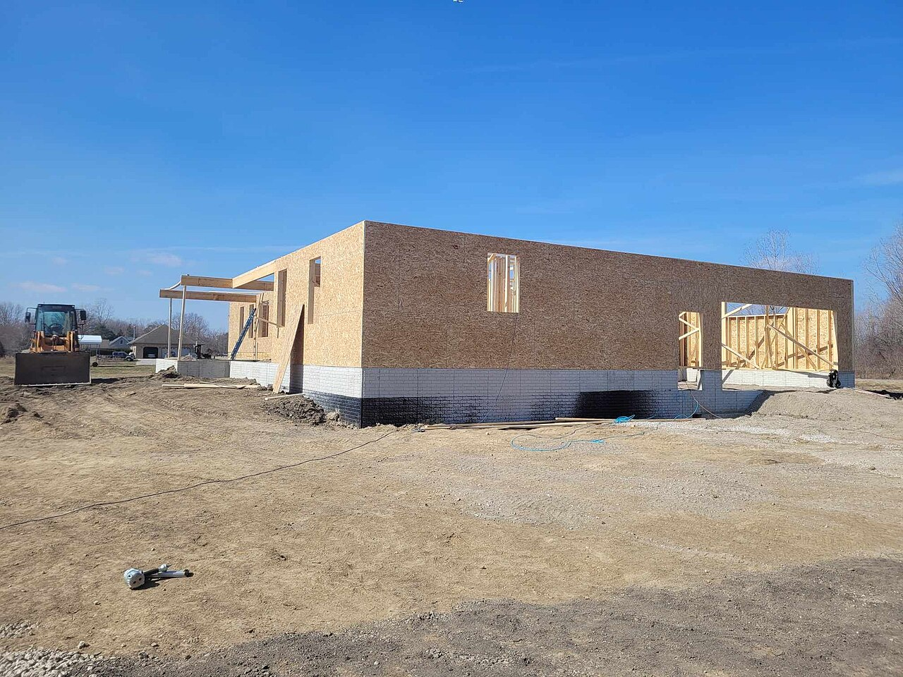

# Dev / QA / staging / prod

*One photo of a house mid-build shows the whole pipeline at once - raw exposed studs, sealed-but-unfinished sheathing, buried waterproofing nobody will ever see, and a finished home in the background where a real family already lives. Four environments, four completely different stakes.*

> A bug that ships straight to production costs real users, real trust, sometimes real money. The exact
> same bug caught in dev costs nothing but a few minutes - it never left one developer's laptop. The
> entire reason a pipeline has four separate environments instead of one is to catch that bug at the
> cheapest possible point, progressively closer to real conditions, before it ever reaches the one
> environment where a mistake actually matters.

> **In real life**
>
> One photograph of a house under construction can show the whole pipeline in a single frame: raw,
> exposed wooden studs on one end - open, easy to change, nothing hidden - sealed OSB sheathing further
> along, holding its real shape but visibly unfinished, black waterproofing coating the foundation,
> buried the moment the job is done and depended on by everything built above it, and in the background,
> a finished house where a real family already lives. Four stages of the same building, each one closer
> to "real" than the last, each one raising the cost of getting something wrong. A software pipeline's
> four environments follow the identical logic.

**Dev / QA / staging / prod**: Dev, QA, staging, and production are progressively higher-stakes environments in a deployment pipeline - dev for fast, private iteration, QA for controlled shared testing, staging as a close production replica for final validation, and production as the live system real users depend on - each stage designed to catch problems at the cheapest point before they reach the next.

## Four stages, four different jobs

**Dev** is private and fast-changing - typically a single developer's own machine, where breaking
something costs nothing because nobody else depends on it yet. **QA** (sometimes called Test) is
shared and more controlled: a QA team or process governs what changes land there, and this is where
smoke tests, integration tests, and regression suites run against a stable-ish target before anything
moves further. **Staging** is a close replica of production - matching, as closely as economically
reasonable, the real configuration, services, and dependencies real users will eventually rely on -
the deliberate "rehearsal space" where code performs under near-real conditions with zero risk to
actual customers if something goes wrong. **Production** is the live system: real users, real data,
real consequences, and by far the least forgiving of the four.

## Why the pipeline exists at all

Every stage exists to catch a specific category of problem at the cheapest possible point. A logic bug
gets caught in dev, for free, before a single other person even sees the code. An integration problem
- two features that individually work but conflict together - gets caught in QA, where the shared,
more realistic environment surfaces it. A configuration or scale problem - something that only appears
under production-like infrastructure or data volume - gets caught in staging, the one environment
built specifically to resemble production closely enough to catch exactly that category of bug.
Anything that slips past all three and only shows up in production is, by definition, the most
expensive possible place to have found it.

> **Tip**
>
> Treat a bug that only reproduces in staging or production, and never in dev or QA, as a signal about
> environment parity, not just about the bug itself - it usually means one of the earlier environments
> is missing something staging or production actually has (a config value, a data shape, a scale
> factor), worth investigating on its own.

> **Common mistake**
>
> Testing exclusively in QA and treating staging as a formality to click through quickly before release.
> Staging exists specifically to catch the category of bug that only appears under production-like
> conditions - skipping real validation there defeats the entire reason it exists as a separate stage.


*Ripcord Construction Framing — CassieMCassid, CC BY-SA 4.0, via Wikimedia Commons. [Source](https://commons.wikimedia.org/wiki/File:Ripcord_Construction_Framing.jpg)*
- **Open studs - raw and exposed** — Nothing hidden yet, every joint and change easy to see. A dev environment is the same: raw, exposed, changing hour to hour, meant for exactly this kind of close-up tinkering.
- **OSB sheathing - closed up, not yet finished** — The structure is now sealed and holding its real shape, but the final finish isn't here yet. A QA environment matches this: stable enough to test against, still visibly not what actually ships.
- **The black foundation coating - hidden, but load-bearing** — Buried the moment the house is finished, and everything above depends on it being done right. Staging config work is exactly this: invisible to an end user, and the single most consequential layer to get wrong.
- **A finished house, already lived in** — Real walls, real roof, a real family behind that door - production, the only environment where a mistake has consequences for real people.

**One change moving through the pipeline**

1. **Written and broken freely in dev** — A single developer's own environment - mistakes here cost nothing but a few minutes, nobody else depends on it yet.
2. **Shared and integration-tested in QA** — A controlled, shared target where smoke, integration, and regression tests catch problems that only show up once features combine.
3. **Validated under near-real conditions in staging** — Close to production's actual config, scale, and dependencies - catches exactly the category of bug dev and QA structurally cannot.
4. **Live, for real users, in production** — The least forgiving environment - anything that reaches here undetected is the most expensive place it could have been found.

*Estimating the cost of catching a bug at each stage (Python)*

```python
stages = [
    {"name": "dev", "relative_cost": 1, "who_is_affected": "one developer"},
    {"name": "QA", "relative_cost": 5, "who_is_affected": "the team"},
    {"name": "staging", "relative_cost": 15, "who_is_affected": "the release process"},
    {"name": "production", "relative_cost": 100, "who_is_affected": "real users"},
]

bug_found_at = "staging"

print("A configuration bug is found in each stage - relative cost to fix at that point:")
for s in stages:
    marker = " <-- caught here" if s["name"] == bug_found_at else ""
    print("  " + s["name"] + ": " + str(s["relative_cost"]) + "x baseline, affects " +
          s["who_is_affected"] + marker)

found_index = [s["name"] for s in stages].index(bug_found_at)
print("")
print("Caught before reaching: " + ", ".join(s["name"] for s in stages[found_index + 1:]) or "nothing further")
print("This is exactly why staging exists - catching this here avoided a " +
      str(stages[-1]["relative_cost"]) + "x-cost production incident.")
```

*Estimating the cost of catching a bug at each stage (Java)*

```java
import java.util.*;

public class Main {
    static class Stage {
        String name; int relativeCost; String whoIsAffected;
        Stage(String name, int relativeCost, String whoIsAffected) {
            this.name = name; this.relativeCost = relativeCost; this.whoIsAffected = whoIsAffected;
        }
    }

    public static void main(String[] args) {
        List<Stage> stages = new ArrayList<>();
        stages.add(new Stage("dev", 1, "one developer"));
        stages.add(new Stage("QA", 5, "the team"));
        stages.add(new Stage("staging", 15, "the release process"));
        stages.add(new Stage("production", 100, "real users"));

        String bugFoundAt = "staging";

        System.out.println("A configuration bug is found in each stage - relative cost to fix at that point:");
        int foundIndex = -1;
        for (int i = 0; i < stages.size(); i++) {
            Stage s = stages.get(i);
            String marker = s.name.equals(bugFoundAt) ? " <-- caught here" : "";
            if (s.name.equals(bugFoundAt)) foundIndex = i;
            System.out.println("  " + s.name + ": " + s.relativeCost + "x baseline, affects " +
                    s.whoIsAffected + marker);
        }

        System.out.println();
        List<String> avoided = new ArrayList<>();
        for (int i = foundIndex + 1; i < stages.size(); i++) avoided.add(stages.get(i).name);
        System.out.println("Caught before reaching: " + (avoided.isEmpty() ? "nothing further" : String.join(", ", avoided)));
        System.out.println("This is exactly why staging exists - catching this here avoided a " +
                stages.get(stages.size() - 1).relativeCost + "x-cost production incident.");
    }
}
```

### Your first time: Trace one real change through all four environments

- [ ] Pick one recent change and find where it currently lives — Dev, QA, staging, or already in production - note the current stage.
- [ ] Identify what specifically changes about the environment at each stage it passed through — Data volume, real integrations vs. mocks, config values, infrastructure scale.
- [ ] Ask what category of bug each stage is uniquely positioned to catch — A logic error, an integration conflict, a scale/config problem - map each to the stage built to catch it.
- [ ] Check whether staging is genuinely close to production or has quietly drifted — This sets up the deeper parity question the next note covers directly.

- **A bug never reproduces in dev or QA but shows up reliably in staging or production.**
  A strong signal of environment drift - something about scale, configuration, or a real integration differs between the earlier stages and this one. Investigate the specific gap rather than only chasing the bug's symptom.
- **A release is delayed because a problem is discovered in production that staging should have caught.**
  Audit staging's actual fidelity to production - the whole point of the stage is catching exactly this category of issue before it reaches real users.
- **A team treats staging validation as a rubber-stamp step, rarely finding real issues there.**
  Either staging has drifted too far from production to be useful, or genuine validation isn't actually happening there - both are worth investigating rather than accepting as normal.

### Where to check

- Any bug reported from production, checked first for whether it should have been (and could have been) caught at an earlier stage.
- Staging's actual configuration, data shape, and integrations, compared honestly against production rather than assumed to match.
- [[test-management-and-reporting/environments-and-test-data/environment-parity-and-config]] for the deeper discipline of keeping staging genuinely close to production, not just nominally similar.
- [[test-management-and-reporting/environments-and-test-data/test-data-management-and-anonymization]] for what kind of data belongs in each of these environments specifically.
- [[test-management-and-reporting/risk-and-estimation/risk-based-testing]] for deciding how much validation effort each stage deserves based on real risk.

### Worked example: a config bug that skipped straight past two environments

1. A team adds a new environment variable controlling a payment gateway's timeout setting, tested
   thoroughly in dev with a short, convenient 2-second timeout that made local testing fast.
2. QA's environment configuration was copied from dev months ago and never updated - it also runs the
   2-second timeout, so QA's tests pass cleanly with no issue.
3. Staging, configured independently to match production's actual infrastructure, uses the real
   30-second production timeout value - and immediately surfaces a bug where a slow, real network
   round-trip under that longer, correct value trips an unrelated race condition never seen at 2
   seconds.
4. The bug is caught in staging, exactly where it should be, precisely because staging's configuration
   matched production honestly while QA's had silently drifted out of sync.
5. Fix: the timeout bug is resolved, and separately, QA's environment configuration is audited and
   resynced with the actual values used further down the pipeline - the near-miss reveals a second,
   independent problem worth fixing on its own.

**Quiz.** Why does this note say a bug that only reproduces in staging, and never in dev or QA, deserves investigation beyond just fixing that specific bug?

- [ ] Because staging bugs are always false positives
- [x] Because it usually signals that dev or QA is missing something staging (and production) actually has - a config value, data shape, or scale factor - worth investigating as its own environment-parity problem
- [ ] Because staging environments are inherently unreliable
- [ ] Because the bug should be ignored until it appears in production

*Each environment exists to catch a specific category of problem - if a bug only shows up once conditions get closer to real, that gap between stages is informative on its own. Fixing just the reported bug without asking why earlier stages missed it leaves the same category of gap open for the next similar bug to slip through the same way.*

- **The four environments and their jobs** — Dev: private, fast iteration. QA: shared, controlled integration testing. Staging: close production replica for final validation. Production: the live system real users depend on.
- **Why the pipeline exists at all** — Each stage catches a specific category of problem at the cheapest possible point - a logic bug in dev, an integration conflict in QA, a config/scale problem in staging - before it can reach production.
- **What a staging-only bug usually signals** — A gap between staging (and production) and the earlier stages - typically a config value, data shape, or scale factor that dev/QA are missing, worth fixing as its own environment-parity issue.
- **Why staging deserves real validation, not a rubber stamp** — It exists specifically to catch the category of bug that only appears under production-like conditions - treating it as a formality defeats its entire purpose as a separate pipeline stage.

### Challenge

Trace one real recent change through as many of the four environments as you have access to. Identify what specifically differs about the environment at each stage, and which category of bug each one is uniquely positioned to catch.

- [Northflank — Dev, QA, Preview, Test, Staging, and Production Environments](https://northflank.com/blog/what-are-dev-qa-preview-test-staging-and-production-environments)
- [Harness — What Is a Staging Environment? The Role in DevOps](https://www.harness.io/harness-devops-academy/what-is-a-staging-environment)
- [Understanding Deployment Environments: Dev, Test, Staging & Production Explained!](https://www.youtube.com/watch?v=J7X1iE3LEzs)

🎬 [Understanding Deployment Environments: Dev, Test, Staging & Production Explained!](https://www.youtube.com/watch?v=J7X1iE3LEzs) (9 min)

- Dev, QA, staging, and production form a pipeline of progressively higher stakes - each stage catches a specific category of problem at the cheapest possible point.
- Dev is private and fast-changing; QA is shared and controlled; staging closely replicates production; production is the live system real users depend on.
- A bug that only reproduces in staging or production is informative on its own - it usually signals an earlier environment is missing something the later ones actually have.
- Staging's entire purpose is catching the category of bug that only appears under production-like conditions - treating it as a formality defeats why it exists as a separate stage.
- The cost of a mistake rises sharply at each stage - the same bug found in dev costs minutes; found in production, it costs real users, trust, and often real money.


## Related notes

- [[Notes/test-management-and-reporting/environments-and-test-data/environment-parity-and-config|Environment parity & config]]
- [[Notes/test-management-and-reporting/environments-and-test-data/test-data-management-and-anonymization|Test data management & anonymization]]
- [[Notes/test-management-and-reporting/risk-and-estimation/risk-based-testing|Risk-based testing]]


---
_Source: `packages/curriculum/content/notes/test-management-and-reporting/environments-and-test-data/dev-qa-staging-prod.mdx`_
