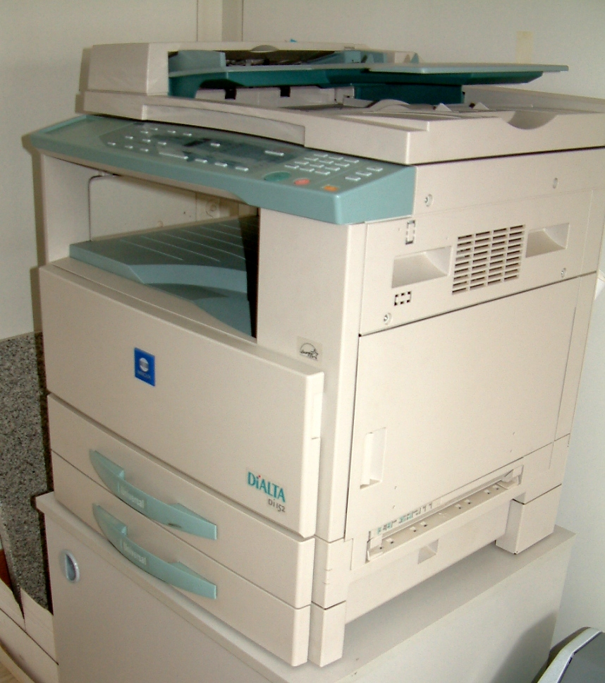

# Environment parity & config

*Manual provisioning guarantees drift; infrastructure as code guarantees parity. A quick hand-fix applied to production during an incident and never backported into the definition file is exactly how staging quietly stops meaning anything.*

> A severity-one incident hits production at 2am, and someone fixes it fast, directly on the live
> server, by hand - exactly the right call in the moment. Three weeks later, nobody remembers to
> backport that same fix into staging's configuration, and staging quietly stops matching what
> production actually runs. The next release passes every staging test cleanly and breaks in production
> anyway, because the environment that was supposed to catch this had already silently drifted away
> from the thing it was built to represent.

> **In real life**
>
> A shared office photocopier holds whatever settings the last person left on it - zoom level, contrast,
> paper tray selection - and unless the next person explicitly checks and resets them, their copy
> inherits every leftover tweak silently, with no warning that anything was changed from the default.
> Two copies made from the exact same original document can come out looking meaningfully different
> depending entirely on what settings happened to be sitting there beforehand. Environment configuration
> drifts exactly the same way: a manual tweak left in one environment, never captured anywhere durable,
> quietly changes what every future job run against that environment actually produces.

**Environment parity**: Environment parity is the discipline of keeping non-production environments (staging, QA) genuinely close to production in configuration, runtime, and integration behavior - maintained through infrastructure as code, which defines every environment from a single versioned source, rather than manual, undocumented changes that cause configuration drift over time.

## Manual changes are where drift starts

Configuration drift - the real-world state of an environment diverging from what its definition says
it should be - almost always starts the same way: a manual change made under pressure, usually during
an incident, applied directly to keep something running right now, with every intention of capturing
it properly afterward. The capturing-it-properly-afterward step is exactly the part that gets skipped
under the same pressure that caused the manual change in the first place. Automated processes outside
a team's normal deployment path - autoscaling actions, an external script, a well-meaning "just this
once" tweak in a demo environment - drift the same way, silently, with nothing in the system
announcing that a divergence just happened.

## Infrastructure as code is what actually prevents it

The fix that holds up in practice: define every environment - its infrastructure, its configuration
structure - in versioned, reviewable code (Terraform, Ansible, CloudFormation, or similar), and build
or update every environment from that single source rather than by hand. Manual provisioning
guarantees drift over a long enough timeline; infrastructure as code guarantees parity, because there
is no path for an undocumented change to exist - any real change has to go through the same versioned,
reviewed definition every environment is built from. The Twelve-Factor App methodology's config
principle reinforces the same discipline at the application layer: strict separation of config (which
varies per deploy) from code (which does not), so a config difference between environments is a
deliberate, visible choice rather than an accidental one.

> **Tip**
>
> Run a drift-detection check on a schedule, not just when something breaks - `terraform plan -refresh-
> only` (or the equivalent for your infrastructure tooling) run automatically and reported to a visible
> channel catches a manual change within hours instead of leaving it to surface as a mystery bug weeks
> later.

> **Common mistake**
>
> Making an emergency manual fix to production and considering the incident closed the moment the
> system is stable again. The fix is not actually complete until it is captured back into the versioned
> infrastructure or configuration definition - otherwise the fix itself becomes the next drift.


*Photocopying — Radomil, CC BY-SA 3.0, via Wikimedia Commons. [Source](https://commons.wikimedia.org/wiki/File:Photocopying_kserokopiarka.jpg)*
- **The control panel - easy to change, easy to forget was changed** — Whoever used this last may have left the zoom or contrast off-default with no visible warning. A manual tweak to an environment's config works the same way - silent, and inherited by whoever runs the next job.
- **Two paper trays, potentially different stock** — Nothing on the outside tells you which tray is loaded with what. Two environments claiming to be equivalent can just as easily be running quietly different underlying versions or values.
- **The brand plate - the exact spec, meant to be identical** — Same model, same rated behavior, on paper. Environment parity is the discipline of making sure that claim stays true in practice, not just in the label.
- **What actually comes out the other side** — The only real proof of whether the settings actually matched - config claims mean nothing until the output is checked directly.

**How drift happens, and how it gets prevented**

1. **An incident forces a fast, manual production fix** — The right call in the moment - stabilize first.
2. **The fix never gets backported into the versioned definition** — Under the same pressure that caused the fix, the follow-up capture step gets skipped.
3. **Staging, rebuilt from the old definition, silently no longer matches production** — Nothing announces the divergence - it surfaces only as a confusing bug later.
4. **Infrastructure as code closes the gap** — Every environment built from one versioned source - a real change has no path to exist without going through it.

*Detecting drift between an environment's actual and defined config (Python)*

```python
defined_config = {
    "payment_timeout_seconds": 30,
    "max_upload_mb": 25,
    "feature_flag_new_checkout": False,
}

actual_config = {
    "payment_timeout_seconds": 30,
    "max_upload_mb": 50,  # manually bumped during an incident, never backported
    "feature_flag_new_checkout": False,
}

print("Comparing actual environment config against the versioned definition:")
drifted = []
for key, defined_value in defined_config.items():
    actual_value = actual_config.get(key)
    if actual_value != defined_value:
        drifted.append((key, defined_value, actual_value))
        print("  DRIFT: " + key + " - defined=" + str(defined_value) + ", actual=" + str(actual_value))
    else:
        print("  OK: " + key + " matches (" + str(defined_value) + ")")

print("")
if drifted:
    print(str(len(drifted)) + " drifted value(s) found - reconcile by either updating the")
    print("definition to match reality on purpose, or reapplying the definition to fix reality.")
else:
    print("No drift detected - environment matches its versioned definition.")
```

*Detecting drift between an environment's actual and defined config (Java)*

```java
import java.util.*;

public class Main {
    public static void main(String[] args) {
        Map<String, Object> definedConfig = new LinkedHashMap<>();
        definedConfig.put("payment_timeout_seconds", 30);
        definedConfig.put("max_upload_mb", 25);
        definedConfig.put("feature_flag_new_checkout", false);

        Map<String, Object> actualConfig = new LinkedHashMap<>();
        actualConfig.put("payment_timeout_seconds", 30);
        actualConfig.put("max_upload_mb", 50); // manually bumped during an incident, never backported
        actualConfig.put("feature_flag_new_checkout", false);

        System.out.println("Comparing actual environment config against the versioned definition:");
        List<String> drifted = new ArrayList<>();
        for (Map.Entry<String, Object> entry : definedConfig.entrySet()) {
            String key = entry.getKey();
            Object definedValue = entry.getValue();
            Object actualValue = actualConfig.get(key);
            if (!Objects.equals(actualValue, definedValue)) {
                drifted.add(key);
                System.out.println("  DRIFT: " + key + " - defined=" + definedValue + ", actual=" + actualValue);
            } else {
                System.out.println("  OK: " + key + " matches (" + definedValue + ")");
            }
        }

        System.out.println();
        if (!drifted.isEmpty()) {
            System.out.println(drifted.size() + " drifted value(s) found - reconcile by either updating the");
            System.out.println("definition to match reality on purpose, or reapplying the definition to fix reality.");
        } else {
            System.out.println("No drift detected - environment matches its versioned definition.");
        }
    }
}
```

### Your first time: Audit one real environment for drift

- [ ] Pick one environment (staging or QA) and its versioned configuration definition — Terraform state, an Ansible playbook, a config-as-code file - whatever the team actually uses.
- [ ] Run a drift-detection check (a plan/diff command, or a manual comparison) — Compare what the definition says against what the environment is actually running.
- [ ] For any drift found, trace it back to when and why it happened — Usually a manual incident fix or a demo-convenience tweak - confirm the actual cause.
- [ ] Decide and document: update the definition to match reality on purpose, or reapply the definition to fix reality — Never leave a known drift unresolved and unlogged.

- **A release passes every staging test cleanly and breaks immediately in production.**
  Check staging's actual configuration against production's, value by value, specifically for anything manually changed in one but never the other - this is the single most common root cause of this exact symptom.
- **Nobody can explain why a specific config value in staging doesn't match its own definition file.**
  A strong drift signal - trace it to whichever incident or manual change introduced it, then either capture it into the definition properly or revert it deliberately.
- **A team keeps making 'just this once' manual tweaks directly to a shared environment.**
  Each one is a fresh drift risk - redirect every change, however small or urgent it feels, through the same versioned definition every environment is meant to be built from.

### Where to check

- Any environment that received an emergency manual fix recently, checked specifically for whether that fix was ever backported into its versioned definition.
- Configuration values that look unusual or unexplained in any non-production environment - a common signature of unlogged drift.
- [[test-management-and-reporting/environments-and-test-data/dev-qa-staging-prod]] for the broader pipeline this parity discipline exists to protect.
- [[test-management-and-reporting/environments-and-test-data/test-data-management-and-anonymization]] for the data-layer equivalent of this same consistency discipline.
- [[test-management-and-reporting/risk-and-estimation/risk-based-testing]] for prioritizing which environments and configs deserve the tightest parity given real risk and cost.

### Worked example: an upload limit that quietly diverged for months

1. A 2am incident causes uploads to fail in production under normal load - an engineer manually raises
   the max upload size limit directly on the production server to stop the bleeding, and the incident
   resolves within minutes.
2. The fix is never backported into the infrastructure-as-code definition, which still specifies the
   original, lower limit - staging, rebuilt from that same unchanged definition every deploy, keeps
   running the old value.
3. Months later, a new feature that intentionally handles larger file uploads passes every staging
   test cleanly, because staging's lower limit was never actually exercised by tests using realistic
   file sizes.
4. The feature ships and immediately fails for real users hitting the true production limit in a way
   staging's stale, drifted configuration could never have caught.
5. Fix: the correct upload limit is captured into the versioned definition on both environments, a
   scheduled drift-detection check is added specifically for this class of manually-patched value, and
   the incident runbook is updated to require a definition update as part of closing out any manual fix.

**Quiz.** Why does this note say an emergency manual production fix is not actually 'complete' the moment the system stabilizes?

- [ ] Because manual fixes are always technically wrong regardless of outcome
- [x] Because the fix has not been captured back into the versioned infrastructure/config definition yet - until it is, it exists only as undocumented drift that will silently diverge other environments built from that same definition
- [ ] Because production fixes always require a full postmortem before anything else can happen
- [ ] Because manual fixes are against most companies' policies

*The manual fix itself is often the right call under time pressure - the problem is treating incident resolution as the finish line. Until the change is captured back into the same versioned source every environment is built from, it is invisible drift, and any other environment rebuilt from the old definition will silently diverge from what production is actually running.*

- **Environment parity** — Keeping non-production environments genuinely close to production in configuration, runtime, and integration behavior - maintained through infrastructure as code, not manual, undocumented changes.
- **Configuration drift** — The real-world state of an environment diverging from its versioned definition, almost always starting with a manual change - often an incident fix - that never gets captured back into that definition.
- **Why infrastructure as code prevents drift specifically** — Manual provisioning guarantees drift over time; defining every environment from one versioned, reviewed source removes the path for an undocumented change to exist at all.
- **The Twelve-Factor App config principle** — Strict separation of config (which varies per deploy) from code (which does not) - so a difference between environments is a deliberate, visible choice, not an accidental one.

### Challenge

Pick one non-production environment and run (or manually perform) a drift check against its versioned definition. Report any drift found, trace it to its likely cause, and note whether it should be captured into the definition or reverted.

- [HashiCorp — Manage Resource Drift](https://developer.hashicorp.com/terraform/tutorials/state/resource-drift)
- [How to Fix 'Environment Parity' Issues](https://oneuptime.com/blog/post/2026-01-24-environment-parity-issues/view)
- [Terraform -refresh-only Tutorial: Fixing State Drift the Right Way](https://www.youtube.com/watch?v=acTvUZI0Nfg)

🎬 [Terraform -refresh-only Tutorial: Fixing State Drift the Right Way](https://www.youtube.com/watch?v=acTvUZI0Nfg) (10 min)

- Environment parity means staging and QA genuinely match production's configuration, runtime, and integration behavior - not just nominally, but in practice.
- Configuration drift almost always starts with a manual change, usually an incident fix, made under pressure that never gets captured back into the versioned definition.
- Manual provisioning guarantees drift over a long enough timeline; infrastructure as code guarantees parity by removing any path for an undocumented change to exist.
- A release that passes staging cleanly and breaks in production is one of the most common symptoms of environment drift - check config values against each other directly.
- An emergency manual fix isn't complete when the system stabilizes - it's complete when it's captured back into the same versioned source every environment is built from.


## Related notes

- [[Notes/test-management-and-reporting/environments-and-test-data/dev-qa-staging-prod|Dev / QA / staging / prod]]
- [[Notes/test-management-and-reporting/environments-and-test-data/test-data-management-and-anonymization|Test data management & anonymization]]
- [[Notes/test-management-and-reporting/risk-and-estimation/risk-based-testing|Risk-based testing]]


---
_Source: `packages/curriculum/content/notes/test-management-and-reporting/environments-and-test-data/environment-parity-and-config.mdx`_
