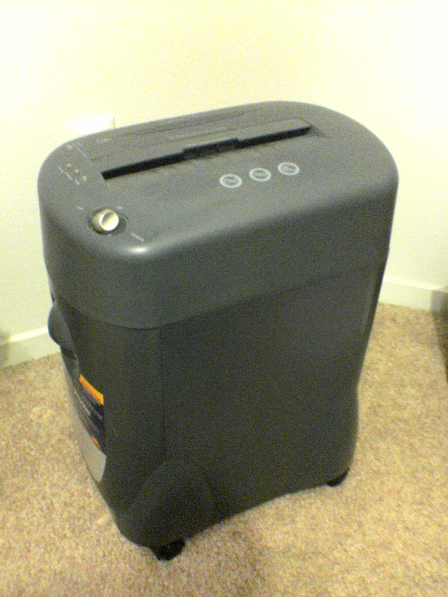

# GDPR & sensitive data in tests

*A staging snapshot taken 18 months ago can still contain a real user who has since exercised their right to erasure - and it's probably not covered by whatever masking process got added afterward. GDPR follows personal data everywhere it goes, not just wherever it officially lives.*

> A user exercises their GDPR right to erasure and their record is deleted cleanly from production the
> same day. A staging database snapshot taken eighteen months earlier, still sitting untouched on a QA
> server with weaker access controls than production ever had, still contains that same person's real
> name, email, and order history - completely untouched by the deletion, because nobody's erasure
> process ever looked there. Legally, that snapshot is exactly as non-compliant as if production had
> never deleted the record at all.

> **In real life**
>
> A document only stops being sensitive once it has actually gone through the shredder's feed slot and
> the shredded remains have actually left the bin - not the moment someone decides it should be
> destroyed, and not the moment a photocopy of it gets marked "for disposal" while the original sits
> untouched in a filing cabinet down the hall. Every real copy has to physically go through the same
> process before the document is genuinely gone. Personal data under GDPR works exactly the same way: a
> deletion request has to reach every real copy - production, staging, QA, backups - not just whichever
> system happened to be the official record.

**GDPR and sensitive data in tests**: GDPR obligations around sensitive data in test environments mean that personal data of EU residents is regulated wherever it is actually processed - including dev, QA, and staging copies derived from production - and that rights like erasure, data minimization, and purpose limitation apply to every one of those copies, not only the primary production system.

## The scope is wider than most teams assume

GDPR does not carve out an exception for non-production environments - if a dataset contains real
personal data of an EU resident, GDPR's obligations apply to it wherever it is processed, dev
laptop, QA database, or staging snapshot included. Two principles bite hardest in a testing context:
**data minimization** (only use and retain what testing genuinely requires, not a full raw copy by
default) and **purpose limitation** (data collected to run the live product is not automatically
licensed for use in an unrelated testing context without a legitimate basis). A team that would never
dream of leaving unmasked production data in a public S3 bucket often has exactly that same real data
sitting in a QA environment with a much larger set of people who can query it and far less monitoring
watching for misuse.

## The right to erasure follows data everywhere it went

Article 17's right to erasure requires removing personal data on a valid request "without undue
delay" - and that obligation does not stop at whichever system is considered the primary record. A
snapshot copied into staging before a deletion request came in, and never refreshed or re-masked
since, keeps that person's real data alive in a system nobody remembers to check. This is the single
most common real gap teams find once they actually audit: production erasure processes are usually
solid, and non-production copies are usually the blind spot, because nobody built erasure into the
test-data lifecycle in the first place.

> **Tip**
>
> Treat any real, unmasked personal data outside production as a flagged, time-boxed, explicitly
> justified exception - never a default convenience. Default every non-production environment to
> synthetic or properly anonymized data, and require a specific, documented reason before any real data
> is allowed to touch a lower environment at all.

> **Common mistake**
>
> Building a masking or anonymization pipeline and assuming it retroactively covers every existing
> snapshot already sitting in non-production systems. Old snapshots taken before the pipeline existed
> need to be audited and remediated explicitly - a new process going forward does not erase an
> already-existing gap.


*Paper Shredder — High Plains Drifter, public domain, via Wikimedia Commons. [Source](https://commons.wikimedia.org/wiki/File:Paper_Shredder.jpg)*
- **The feed slot - where it actually has to go in** — Every real document has to physically pass through here to be destroyed - not marked deleted somewhere while the original still exists. GDPR's right to erasure works the same way: a request has to reach every real copy, including test and backup environments.
- **The mode dial** — Different settings for different security needs - not every document needs the same destruction level. Sensitive test data needs the same judgment: how strictly it's anonymized should match how sensitive the underlying data actually is.
- **The control buttons** — Deliberate, visible controls - nothing happens by accident. Handling real personal data in a test environment needs the same deliberateness: an explicit, justified exception, never a convenient default.
- **The bin - still holding it, not gone yet** — Shredded doesn't mean destroyed until the bin is actually emptied. Pseudonymized isn't the same as erased either - the mapping key, and any unmasked snapshot, still exists somewhere until it's genuinely gone too.

**Following an erasure request everywhere personal data actually is**

1. **A user exercises their right to erasure** — A valid GDPR Article 17 request arrives, requiring removal without undue delay.
2. **Production deletes the record cleanly** — The system most teams remember to check - usually handled correctly.
3. **Non-production snapshots and copies are checked next** — Staging, QA, old backups - anywhere the same real data was ever copied to.
4. **Every real copy is remediated, not just the primary one** — Deleted, or brought under the same anonymization pipeline covering everything else in that environment.

*Auditing non-production snapshots for erasure compliance (Python)*

```python
erasure_requests = [{"user_id": "U-4471", "requested_on": "2026-03-14"}]

snapshots = [
    {"name": "staging-2025-01-15", "taken_on": "2025-01-15", "contains_raw_data": True},
    {"name": "qa-2026-05-02", "taken_on": "2026-05-02", "contains_raw_data": True},
    {"name": "staging-2026-06-10-masked", "taken_on": "2026-06-10", "contains_raw_data": False},
]

print("Erasure request for user " + erasure_requests[0]["user_id"] +
      " on " + erasure_requests[0]["requested_on"])
print("")

for s in snapshots:
    if s["contains_raw_data"] and s["taken_on"] > erasure_requests[0]["requested_on"]:
        print("  " + s["name"] + ": SAFE - taken after the erasure request, should not contain this user")
    elif s["contains_raw_data"]:
        print("  " + s["name"] + ": NON-COMPLIANT - raw data taken before the request, user may still be present")
    else:
        print("  " + s["name"] + ": SAFE - masked/anonymized, no raw personal data to erase")

print("")
non_compliant = [s["name"] for s in snapshots if s["contains_raw_data"] and s["taken_on"] <= erasure_requests[0]["requested_on"]]
print("Snapshots requiring remediation: " + (", ".join(non_compliant) if non_compliant else "none"))
```

*Auditing non-production snapshots for erasure compliance (Java)*

```java
import java.util.*;

public class Main {
    static class Snapshot {
        String name, takenOn; boolean containsRawData;
        Snapshot(String name, String takenOn, boolean containsRawData) {
            this.name = name; this.takenOn = takenOn; this.containsRawData = containsRawData;
        }
    }

    public static void main(String[] args) {
        String userId = "U-4471";
        String requestedOn = "2026-03-14";

        List<Snapshot> snapshots = new ArrayList<>();
        snapshots.add(new Snapshot("staging-2025-01-15", "2025-01-15", true));
        snapshots.add(new Snapshot("qa-2026-05-02", "2026-05-02", true));
        snapshots.add(new Snapshot("staging-2026-06-10-masked", "2026-06-10", false));

        System.out.println("Erasure request for user " + userId + " on " + requestedOn);
        System.out.println();

        List<String> nonCompliant = new ArrayList<>();
        for (Snapshot s : snapshots) {
            if (s.containsRawData && s.takenOn.compareTo(requestedOn) > 0) {
                System.out.println("  " + s.name + ": SAFE - taken after the erasure request, should not contain this user");
            } else if (s.containsRawData) {
                System.out.println("  " + s.name + ": NON-COMPLIANT - raw data taken before the request, user may still be present");
                nonCompliant.add(s.name);
            } else {
                System.out.println("  " + s.name + ": SAFE - masked/anonymized, no raw personal data to erase");
            }
        }

        System.out.println();
        System.out.println("Snapshots requiring remediation: " + (nonCompliant.isEmpty() ? "none" : String.join(", ", nonCompliant)));
    }
}
```

### Your first time: Audit real non-production data for GDPR exposure

- [ ] List every non-production environment or snapshot your team currently maintains — Staging, QA, dev databases, old backups - the full real inventory, not just the ones actively used.
- [ ] For each, check whether it contains real, unmasked personal data — Not assumed - actually verified by checking the data itself.
- [ ] For any that do, check how old the snapshot is relative to any known erasure requests — An old snapshot predating a real deletion request is a live compliance gap right now.
- [ ] Document the finding and a remediation plan for anything flagged — Delete, mask, or bring under the same anonymization pipeline as newer environments.

- **An audit finds real personal data in a staging snapshot that predates a known erasure request.**
  This is a live compliance gap - remediate the specific snapshot immediately (delete or properly anonymize it), and audit for other old snapshots with the same exposure.
- **A new data-masking pipeline is deployed and the team assumes all prior compliance risk is now resolved.**
  A new pipeline only protects data flowing through it going forward - explicitly audit and remediate every snapshot that existed before the pipeline was in place.
- **Nobody on the team can say with confidence which non-production environments contain real personal data.**
  Build and maintain an explicit inventory - this uncertainty is itself the compliance risk, since an untracked environment cannot be included in any erasure or minimization process.

### Where to check

- Every non-production environment and backup snapshot, explicitly inventoried for whether it contains real, unmasked personal data.
- Any snapshot older than a known erasure request's date, checked specifically for whether the affected user's data is still present.
- [[test-management-and-reporting/environments-and-test-data/test-data-management-and-anonymization]] for the specific techniques (masking, pseudonymization, synthetic data) that keep non-production environments out of GDPR's raw-data risk category in the first place.
- [[test-management-and-reporting/environments-and-test-data/environment-parity-and-config]] for treating this the same way as configuration drift - an old, unmanaged snapshot is a form of data drift from the current, compliant state.
- [[test-management-and-reporting/risk-and-estimation/risk-based-testing]] for prioritizing this kind of compliance audit against real risk and available effort.

### Worked example: an 18-month-old snapshot that outlived a real deletion request

1. A user submits a valid GDPR erasure request in March. Production deletes their record cleanly the
   same week, and the team considers the request closed.
2. A staging snapshot taken the previous September, well before the request, is still sitting on a QA
   server - untouched, unmasked, and never refreshed since a masking pipeline was introduced two
   months after that snapshot was taken.
3. A routine internal audit eight months later specifically checks non-production environments against
   the log of past erasure requests, and finds the user's real name and order history still present in
   that old staging snapshot.
4. Legally, this is a live compliance gap regardless of how cleanly production handled the original
   request - the data still exists, in a system with weaker access controls than production, months
   after it was supposed to be gone everywhere.
5. Fix: the old snapshot is deleted, a standing process is added to cross-check new erasure requests
   against every existing non-production snapshot going forward, and snapshot retention is capped so
   pre-masking-pipeline data cannot silently persist indefinitely.

**Quiz.** Why does this note say a staging snapshot from before a user's erasure request represents a live compliance gap, even though production handled the deletion correctly?

- [ ] Because staging environments are not covered by GDPR at all
- [x] Because GDPR's right to erasure applies to every real copy of personal data, not just the primary production system - an untouched old snapshot still contains that person's real data even after production deleted it
- [ ] Because staging snapshots are automatically deleted after a fixed period regardless of content
- [ ] Because only the most recent snapshot needs to comply with erasure requests

*GDPR does not distinguish between 'official' and 'unofficial' copies of personal data - if a real, identifiable record exists anywhere within an organization's control, the erasure obligation applies to it. A clean production deletion closes only the part of the obligation production was responsible for; every other real copy, wherever it sits, remains a live gap until it is remediated too.*

- **GDPR scope in testing** — Personal data of EU residents is regulated wherever it's actually processed - dev, QA, and staging copies derived from production are just as in-scope as production itself.
- **Why the right to erasure is easy to under-comply with** — Deletion requests typically get handled cleanly in production, but old snapshots and non-production copies taken before the request are easy to forget and remain a live compliance gap.
- **Why a new masking pipeline doesn't retroactively fix old snapshots** — It only protects data flowing through it going forward - every snapshot that existed before the pipeline was introduced needs to be explicitly audited and remediated separately.
- **The default posture this note recommends** — Treat any real, unmasked personal data outside production as a flagged, time-boxed, explicitly justified exception - default every non-production environment to synthetic or properly anonymized data instead.

### Challenge

Inventory every non-production environment and backup snapshot your team maintains. For each one, determine whether it contains real, unmasked personal data, and if so, how old it is relative to any known erasure requests.

- [GDPR Info — Art. 17: Right to Erasure ('Right to Be Forgotten')](https://gdpr-info.eu/art-17-gdpr/)
- [GDPR Compliance Testing: How to Use Production Data Without the Risk](https://getautonoma.com/blog/gdpr-compliance-testing)
- [GDPR Explained: The Right to Be Forgotten](https://www.youtube.com/watch?v=cXlWWQE0UGU)

🎬 [GDPR Explained: The Right to Be Forgotten](https://www.youtube.com/watch?v=cXlWWQE0UGU) (7 min)

- GDPR applies to personal data wherever it's actually processed - non-production environments derived from real user data are just as in scope as production.
- The right to erasure requires removing personal data from every real copy, not just the primary production record - old, unmanaged snapshots are the most common compliance gap.
- A new data-masking pipeline protects data going forward only - existing snapshots from before it existed need explicit, separate remediation.
- Non-production environments often have weaker access controls and less monitoring than production, making real personal data sitting there a practically higher, not lower, risk.
- Default every non-production environment to synthetic or properly anonymized data - treat real, unmasked personal data outside production as a flagged, justified, time-boxed exception, never a convenience.


## Related notes

- [[Notes/test-management-and-reporting/environments-and-test-data/test-data-management-and-anonymization|Test data management & anonymization]]
- [[Notes/test-management-and-reporting/environments-and-test-data/environment-parity-and-config|Environment parity & config]]
- [[Notes/test-management-and-reporting/risk-and-estimation/risk-based-testing|Risk-based testing]]


---
_Source: `packages/curriculum/content/notes/test-management-and-reporting/environments-and-test-data/gdpr-and-sensitive-data-in-tests.mdx`_
