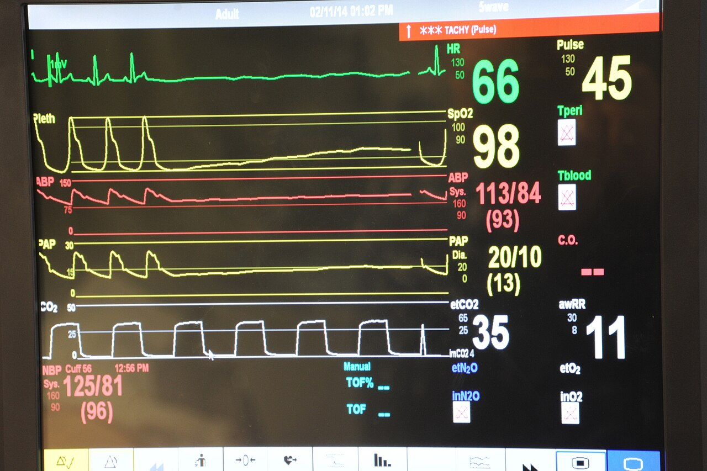

# Dashboards

*A patient monitor doesn't print forty equal-sized numbers - one red banner dominates the screen the instant something is actually wrong. A test dashboard with twenty same-sized widgets and no visual hierarchy is wallpaper nobody checks until it's too late.*

> A hospital vital-signs monitor tracks heart rate, oxygen saturation, blood pressure, and CO2 all at
> once, all the time - and the moment one of them crosses a real threshold, a red banner takes over the
> top of the screen and nothing else on that display matters until it's addressed. A test dashboard
> with twenty evenly-sized charts, none visually more important than any other, forces every viewer to
> scan the whole thing every time just to find out if anything is actually wrong - and given a choice,
> most people stop scanning it at all.

> **In real life**
>
> That monitor never presents heart rate, SpO2, and blood pressure as equal-weight numbers waiting to be
> compared - a waveform gives context over time, one bold digit gives the instant read, and a specific
> alarm color and position exist for exactly the moment something needs attention right now, distinct
> from everything reading normally around it. A test dashboard earns the same trust only by copying that
> same discipline: a small number of high-signal metrics, trend alongside current value, and unmistakable
> visual priority for whatever is actually abnormal - never twenty identical tiles competing for the same
> amount of attention.

**A test dashboard**: A test dashboard is a continuously updated visual summary of test health - built, unlike a periodic test summary report, for a broad audience to glance at without asking anyone, and effective only when it establishes a clear visual hierarchy that makes an anomaly impossible to miss among routine, healthy metrics.

## Purpose over the report it's not

A test summary report is a point-in-time document, produced and read once per cycle, built to justify
a specific decision. A dashboard exists for a completely different job: continuous, ambient visibility
that anyone on the team can check at any moment without asking someone to send them a document.
Confusing the two is a common design mistake - a dashboard trying to be a comprehensive historical
report becomes too dense to glance at, and a report trying to be a live dashboard becomes stale the
moment it's printed. Design each one for the specific way it will actually be consulted.

## Hierarchy is the entire design problem

Every credible source on dashboard design converges on the same core idea: a dashboard should tell a
story through a logical progression of data, and establish a visual hierarchy that guides a viewer
straight to what matters most. In practice that means picking a small number of genuinely high-signal
metrics rather than every metric that could technically be tracked, pairing each with a trend so a
single snapshot never gets over-interpreted, and reserving strong visual weight - color, size,
position - specifically for whatever is currently abnormal. A dashboard that gives a flaky-test rate
spike the same visual treatment as a routine "all green" summary has already failed its one job before
anyone reads a single number.

> **Tip**
>
> Design for the audience that will actually look at this without being told to. A QA lead needs trend
> lines and coverage gaps; a developer needs failure traces close to the code; a manager needs a release-
> readiness signal in one glance. The same underlying data, three different dashboards or dashboard
> views - not one dashboard trying to serve all three audiences equally.

> **Common mistake**
>
> Adding a new panel to a dashboard every time someone asks "can we also track X." Dashboard sprawl is
> the single most common failure mode - once a dashboard has forty panels of equal visual weight, nobody
> can find the signal in it anymore, and it quietly becomes wallpaper nobody actually checks.


*Vital signs monitor display — Petty Officer 1st Class James Stenberg, U.S. Navy, public domain, via Wikimedia Commons. [Source](https://commons.wikimedia.org/wiki/File:Vital_signs_monitor_display.jpg)*
- **The alarm banner - the one thing demanding attention** — Red, top of screen, impossible to miss. A test dashboard needs the same hierarchy: the one metric currently out of range should visually dominate, not sit as equal-sized text next to twenty numbers that are all fine.
- **Heart rate - trace plus one big number** — The waveform gives the pattern over time; the huge digit gives the instant read. A dashboard panel works best the same way: a trend line for context, one bold current value for the at-a-glance answer.
- **SpO2 - a different vital, its own color** — Color-coded so a glance tells you which trace is which without reading a single label. A crowded dashboard without this kind of visual separation turns into unreadable noise fast.
- **The toolbar - drill-down available, not forced** — Nobody needs to press a button to see the critical numbers - they're already on screen. Controls exist for the rare moment someone needs more detail, exactly how drill-down should stay optional, never mandatory just to get the headline.

**Building a dashboard someone actually checks**

1. **Pick the audience and the one question this view answers** — A QA lead's trend view and a manager's release-readiness view are different dashboards, not one dashboard doing double duty.
2. **Choose a small number of genuinely high-signal metrics** — Every additional panel competes for the same visual attention - more metrics almost always means less signal, not more.
3. **Pair each metric with a trend, never a bare current value alone** — A single snapshot invites over-interpretation; a trend shows whether this reading is normal or a real shift.
4. **Reserve strong visual weight specifically for anomalies** — Color, size, and position should make the one abnormal metric impossible to miss among everything reading normally.

*Assigning visual priority by deviation from normal (Python)*

```python
metrics = [
    {"name": "Pass rate", "current": 96, "normal_range": (94, 100)},
    {"name": "Avg build time (min)", "current": 12, "normal_range": (8, 15)},
    {"name": "Flaky test rate (%)", "current": 18, "normal_range": (0, 5)},
    {"name": "Open critical defects", "current": 1, "normal_range": (0, 2)},
]

def priority(metric):
    low, high = metric["normal_range"]
    value = metric["current"]
    if low <= value <= high:
        return "NORMAL - low visual weight"
    deviation = min(abs(value - low), abs(value - high))
    if deviation > (high - low):
        return "ALARM - maximum visual weight, top of dashboard"
    return "WATCH - moderate visual weight"

for m in metrics:
    p = priority(m)
    print(m["name"] + ": " + str(m["current"]) + " (normal: " +
          str(m["normal_range"][0]) + "-" + str(m["normal_range"][1]) + ") -> " + p)
```

*Assigning visual priority by deviation from normal (Java)*

```java
import java.util.*;

public class Main {
    static class Metric {
        String name; int current, low, high;
        Metric(String name, int current, int low, int high) {
            this.name = name; this.current = current; this.low = low; this.high = high;
        }
    }

    static String priority(Metric m) {
        if (m.current >= m.low && m.current <= m.high) {
            return "NORMAL - low visual weight";
        }
        int deviation = Math.min(Math.abs(m.current - m.low), Math.abs(m.current - m.high));
        if (deviation > (m.high - m.low)) {
            return "ALARM - maximum visual weight, top of dashboard";
        }
        return "WATCH - moderate visual weight";
    }

    public static void main(String[] args) {
        List<Metric> metrics = new ArrayList<>();
        metrics.add(new Metric("Pass rate", 96, 94, 100));
        metrics.add(new Metric("Avg build time (min)", 12, 8, 15));
        metrics.add(new Metric("Flaky test rate (%)", 18, 0, 5));
        metrics.add(new Metric("Open critical defects", 1, 0, 2));

        for (Metric m : metrics) {
            String p = priority(m);
            System.out.println(m.name + ": " + m.current + " (normal: " + m.low + "-" + m.high + ") -> " + p);
        }
    }
}
```

### Your first time: Audit an existing dashboard for hierarchy

- [ ] Open a real dashboard your team currently uses — Note how many panels it has and whether any one of them stands out visually from the rest.
- [ ] Count the panels currently showing an abnormal or noteworthy value — Usually a small minority - confirm they're actually more visually prominent than the routine ones.
- [ ] Ask three different team members what this dashboard tells them right now — If answers vary wildly or take longer than a glance, the hierarchy isn't working.
- [ ] Identify one panel that could be removed or merged without losing real signal — Dashboard sprawl rarely announces itself - it has to be actively looked for.

- **A real production-impacting test failure went unnoticed for days despite being visible on the team dashboard the whole time.**
  Classic missing-hierarchy failure - if the failure looked visually identical to forty other routine green tiles, nobody's eye was ever drawn to it. Add explicit alarm styling for anything crossing a real threshold.
- **A dashboard has grown to dozens of panels and nobody can say which ones actually matter anymore.**
  Dashboard sprawl - audit every panel against 'does this change what someone does today,' and remove or archive anything that doesn't clear that bar.
- **Different stakeholders keep asking for contradictory changes to the same shared dashboard.**
  They likely need genuinely different views, not one dashboard serving three audiences - split into audience-specific dashboards or dashboard tabs built from the same underlying data.

### Where to check

- Any dashboard with more than roughly seven to ten panels of equal visual weight - a strong sign of sprawl worth auditing.
- Whether any dashboard panel currently showing an abnormal value looks visually distinct from the panels showing normal ones.
- [[test-management-and-reporting/metrics-and-reporting/coverage-and-pass-rate-metrics]] for the specific metrics most commonly featured on a dashboard, and their own interpretation pitfalls.
- [[test-management-and-reporting/metrics-and-reporting/reporting-to-stakeholders]] for building the audience-specific views a single shared dashboard usually cannot serve well alone.
- [[test-management-and-reporting/metrics-and-reporting/test-summary-reports]] for the point-in-time document a dashboard is not a substitute for, and vice versa.

### Worked example: a dashboard that had the data and still missed the signal

1. A team's CI dashboard tracks 32 panels - pass rate per module, build time, flaky rate, coverage,
   defect counts, all displayed as identically-sized tiles in a uniform grid.
2. A specific module's flaky-test rate climbs from 4% to 22% over two weeks - visible in the data the
   entire time, sitting in tile 19 of 32, the exact same size and color treatment as every stable tile
   around it.
3. Nobody notices until a release built on that module ships with an intermittent production bug that
   the flaky tests had actually been signaling the whole time, just never loudly enough to draw an eye.
4. A retrospective traces the miss directly to the dashboard's uniform grid - the data existed and was
   visible; nothing about its presentation distinguished a real, worsening problem from routine noise.
5. Fix: the dashboard is redesigned around six headline metrics with explicit color-coded alarm states,
   any metric crossing its threshold moves to a dedicated top row, and the remaining 26 original panels
   move to a secondary drill-down view accessible on demand rather than always on screen.

**Quiz.** A team's dashboard has 32 equal-sized panels, and a real, worsening problem sat unnoticed in one of them for two weeks despite the data being technically visible the whole time. What does this note identify as the root cause?

- [ ] The dashboard needed more panels to catch the problem sooner
- [x] The dashboard had no visual hierarchy - every panel competed for identical attention, so nothing distinguished the one genuinely abnormal metric from routine, healthy ones
- [ ] The data itself was inaccurate
- [ ] Dashboards cannot catch slow-developing problems by design

*The data was present and correct the entire time - the failure was purely in presentation. A dashboard that gives an abnormal, worsening metric the exact same visual weight as thirty-one normal ones is asking every viewer to notice a needle in a haystack on every single glance, which is exactly the kind of miss a real hierarchy - alarm coloring, prominent placement, deviation-from-normal weighting - exists to prevent.*

- **A test dashboard** — A continuously updated visual summary of test health, built for a broad audience to glance at without asking anyone - distinct from a periodic test summary report, and effective only with a clear visual hierarchy.
- **Why dashboard sprawl is the most common failure mode** — Every additional panel added 'just in case' competes for the same visual attention as the panels that actually matter - past a certain point, more metrics means less findable signal, not more.
- **Trend plus current value, not current value alone** — A bare current-value number invites over-interpretation of a single snapshot; pairing it with a trend line shows whether this reading is a real shift or normal noise.
- **Audience-specific dashboards** — A QA lead, a developer, and a manager need different depth and framing from the same underlying data - one dashboard trying to serve all three equally usually serves none of them well.

### Challenge

Audit a real dashboard your team uses: count the panels, identify whether any currently-abnormal metric is visually distinct from the normal ones, and propose one specific change that would improve its hierarchy.

- [Grafana — Dashboard Best Practices](https://grafana.com/docs/grafana/latest/visualizations/dashboards/build-dashboards/best-practices/)
- [Amazon Managed Grafana — Best Practices for Dashboards](https://docs.aws.amazon.com/grafana/latest/userguide/v10-dash-bestpractices.html)
- [Grafana Campfire — Data Visualization Tips and Best Practices](https://www.youtube.com/watch?v=0G5dDDZLrVI)

🎬 [Grafana Campfire — Data Visualization Tips and Best Practices](https://www.youtube.com/watch?v=0G5dDDZLrVI) (45 min)

- A dashboard is for continuous, ambient visibility - a different job from a periodic test summary report, and each needs its own design.
- A small number of high-signal metrics, each paired with a trend, beats a large number of bare current-value panels every time.
- Visual hierarchy is the entire design problem: an anomaly must be unmistakably more prominent than routine, healthy data, or it will be missed exactly when it matters most.
- Dashboard sprawl - adding a panel every time someone asks - is the most common failure mode, and it quietly turns a dashboard into wallpaper nobody actually checks.
- Different audiences (developers, QA leads, managers) usually need genuinely different views built from the same data, not one dashboard trying to serve everyone equally.


## Related notes

- [[Notes/test-management-and-reporting/metrics-and-reporting/coverage-and-pass-rate-metrics|Coverage & pass-rate metrics]]
- [[Notes/test-management-and-reporting/metrics-and-reporting/reporting-to-stakeholders|Reporting to stakeholders]]
- [[Notes/test-management-and-reporting/metrics-and-reporting/test-summary-reports|Test summary reports]]


---
_Source: `packages/curriculum/content/notes/test-management-and-reporting/metrics-and-reporting/dashboards.mdx`_
