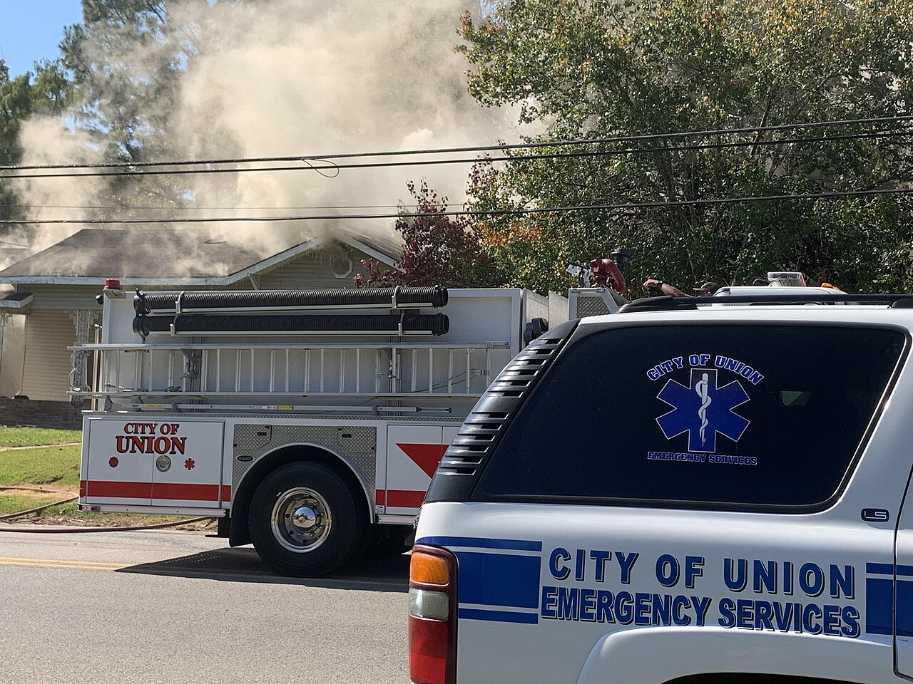

# Prioritizing what to test first

*Firefighters commit to the exact point smoke is pouring from first, not the whole structure evenly. Testing order needs the same discipline - risk score alone isn't enough; divide by effort, like WSJF's cost-of-delay-over-duration, to find where attention pays off soonest.*

> Two features both score a risk rating of 15. One takes twenty minutes to test thoroughly; the other
> needs a full day of dedicated exploratory work. A risk score alone says they deserve equal priority -
> it says nothing about the fact that testing the first one is nearly free, and skipping it while
> spending that same twenty minutes elsewhere leaves real, cheap-to-catch risk sitting completely
> untested. Risk tells you what matters. It never tells you, on its own, what order to actually work in.

> **In real life**
>
> Firefighters arriving at a burning house do not spray water evenly across the whole structure - they
> commit first to the exact point smoke is visibly concentrated, because that is where the actual fire
> is doing the most damage right now, while simultaneously staging ladders and hose reels for what comes
> next. The untouched side of the house is correctly left alone for the moment, not neglected by
> accident but deliberately deprioritized because nothing there needs attention yet. Prioritizing what
> to test first works from the same two questions at once: where is the real risk concentrated, and
> what is actually ready, right now, to be acted on.

**Prioritizing what to test first**: Prioritizing what to test first means sequencing testing work using risk score together with cost and readiness - not risk alone - so that cheap, high-value testing happens immediately, expensive high-risk areas get dedicated deep sessions, and nothing gets tested before it is stable enough to be worth testing at all.

## Risk divided by effort, not risk alone

Weighted Shortest Job First (WSJF), a prioritization model from the Scaled Agile Framework, captures
the missing piece precisely: rank work by cost of delay divided by job size, so a moderately valuable
item that takes an hour can rank above a highly valuable item that takes a week - value delivered soon
compounds, value delayed decays. Applied to testing, the same division matters: a quick smoke check on
a high-risk area is nearly always worth doing immediately, regardless of what else is queued, because
the cost is so low relative to the risk it retires. Reserve dedicated, multi-hour exploratory sessions
for the areas that are both high-risk and genuinely expensive to test properly - and actively deprior-
itize low-risk areas even when they happen to be quick, since quick-but-low-value work still crowds
out the time that higher-value work needs.

## Readiness gates everything else

A feature still under active development is not ready for deep testing no matter how its risk score
looks on paper - testing something that will change again tomorrow wastes the effort the moment the
underlying code shifts. This is exactly why a smoke test or build-verification pass belongs first,
always, regardless of the risk ranking underneath it: confirming the build is even fundamentally
testable is a near-zero-cost check that, if it fails, makes every other prioritization decision moot
until it's fixed. Only once something is stable enough to hold still does its place in the risk-
divided-by-effort ranking actually matter.

> **Tip**
>
> Run the cheapest, highest-risk checks first as a standing habit, even out of strict ranking order - a
> five-minute smoke test on a critical payment path is worth doing before a two-hour session on a
> lower-risk area, purely because of how little it costs relative to what it retires.

> **Common mistake**
>
> Testing features strictly in the order they get handed off by development, rather than deliberately
> re-ordering by risk and effort. Handoff order reflects when something was built, not how much it
> actually matters or how cheaply its risk can be retired - treating them as the same thing quietly
> hands prioritization control to whoever happened to finish coding first.


*Structure Fire in Union, Mississippi — Ktkvtsh, CC BY 4.0, via Wikimedia Commons. [Source](https://commons.wikimedia.org/wiki/File:Structure_Fire_in_Union,_Mississippi_06.jpg)*
- **Smoke pouring from one specific point** — Not the whole house burning uniformly - one clear point telling responders exactly where to commit first. Prioritizing test areas works the same way: focus where the real, visible risk actually concentrates.
- **Ladders and hose reels, staged and ready** — Tools prepared before being deployed - readiness matters as much as urgency. A feature still actively changing isn't ready for deep testing yet, no matter how high its risk score looks on paper.
- **The untouched part of the house** — Still standing, correctly left alone for now while the actual fire gets full attention. Low-priority test areas deserve the same deliberate deprioritization, not neglect by accident.
- **A second vehicle, a different kind of response** — Fire suppression and medical support run in parallel, not strictly in sequence - prioritization isn't always one single queue. Some test areas can and should run concurrently.

**Turning a risk ranking into an actual testing order**

1. **Run a smoke test first, regardless of ranking** — Confirm the build is fundamentally testable - a near-zero-cost check that makes everything else moot if it fails.
2. **Divide each item's risk score by its testing effort** — Cheap, high-risk checks rise to the top - the WSJF-style logic of value over duration.
3. **Filter out anything not yet stable enough to test** — A high scorer still under active development gets deferred until it holds still.
4. **Schedule dedicated deep sessions for high-risk, high-effort areas** — Reserved time, not squeezed in - these deserve focus, not leftover minutes at the end of a cycle.

*Ranking features by risk-per-effort, not risk alone (Python)*

```python
features = [
    {"name": "Payment retry logic", "risk_score": 15, "effort_hours": 0.5, "ready": True},
    {"name": "Bulk data export", "risk_score": 15, "effort_hours": 6, "ready": True},
    {"name": "New onboarding flow", "risk_score": 20, "effort_hours": 3, "ready": False},
    {"name": "Footer link update", "risk_score": 2, "effort_hours": 0.2, "ready": True},
]

print("Smoke test passes first, always, regardless of ranking below.")
print("")

testable_now = [f for f in features if f["ready"]]
for f in testable_now:
    f["priority_score"] = round(f["risk_score"] / f["effort_hours"], 2)

ranked = sorted(testable_now, key=lambda f: f["priority_score"], reverse=True)

print("Ready-to-test features, ranked by risk-per-hour:")
for f in ranked:
    print("  " + f["name"] + ": risk=" + str(f["risk_score"]) + ", effort=" +
          str(f["effort_hours"]) + "h, priority=" + str(f["priority_score"]))

deferred = [f["name"] for f in features if not f["ready"]]
print("")
print("Deferred (not yet stable enough to test): " + ", ".join(deferred))
```

*Ranking features by risk-per-effort, not risk alone (Java)*

```java
import java.util.*;

public class Main {
    static class Feature {
        String name; int riskScore; double effortHours; boolean ready; double priorityScore;
        Feature(String name, int riskScore, double effortHours, boolean ready) {
            this.name = name; this.riskScore = riskScore; this.effortHours = effortHours; this.ready = ready;
        }
    }

    public static void main(String[] args) {
        List<Feature> features = new ArrayList<>();
        features.add(new Feature("Payment retry logic", 15, 0.5, true));
        features.add(new Feature("Bulk data export", 15, 6, true));
        features.add(new Feature("New onboarding flow", 20, 3, false));
        features.add(new Feature("Footer link update", 2, 0.2, true));

        System.out.println("Smoke test passes first, always, regardless of ranking below.");
        System.out.println();

        List<Feature> testableNow = new ArrayList<>();
        for (Feature f : features) if (f.ready) testableNow.add(f);

        for (Feature f : testableNow) {
            f.priorityScore = Math.round((f.riskScore / f.effortHours) * 100.0) / 100.0;
        }
        testableNow.sort((a, b) -> Double.compare(b.priorityScore, a.priorityScore));

        System.out.println("Ready-to-test features, ranked by risk-per-hour:");
        for (Feature f : testableNow) {
            System.out.println("  " + f.name + ": risk=" + f.riskScore + ", effort=" +
                    f.effortHours + "h, priority=" + f.priorityScore);
        }

        List<String> deferred = new ArrayList<>();
        for (Feature f : features) if (!f.ready) deferred.add(f.name);
        System.out.println();
        System.out.println("Deferred (not yet stable enough to test): " + String.join(", ", deferred));
    }
}
```

### Your first time: Re-rank one real testing queue

- [ ] Take the risk-scored feature list from a real or recent project — Or build a quick one for 5-10 real items if none exists yet.
- [ ] Estimate a rough effort (in hours) to test each one properly — A quick gut estimate is fine to start - precision matters less than having a number at all.
- [ ] Divide risk score by effort and re-rank — Compare this order to the original risk-only ranking - note where they genuinely differ.
- [ ] Flag anything not actually stable/ready yet, regardless of its score — Confirm it gets deferred, not tested prematurely just because its number is high.

- **A high-risk feature keeps getting pushed to the end of every testing cycle.**
  Check whether it's simply expensive to test relative to its risk score, or whether it's actually not ready/stable yet - the fix differs: schedule dedicated time for the former, defer the latter honestly instead of repeatedly re-queuing it.
- **Testing time gets spent on whatever developers finish first, not what the risk ranking says matters most.**
  Handoff order is being used as a substitute for a real prioritization decision - deliberately re-rank the queue by risk-per-effort at the start of each cycle instead of testing in arrival order.
- **A quick, cheap, high-risk check gets skipped in favor of a longer session on something lower-value.**
  The risk-per-effort ranking exists specifically to catch this - a five-minute check retiring real risk should almost always happen before a longer session on something scoring lower.

### Where to check

- Any testing schedule, checked against whether it actually follows a risk-per-effort ranking or just development handoff order.
- Any high-risk item repeatedly deferred, checked for whether the real blocker is cost, readiness, or simply not being prioritized deliberately.
- [[test-management-and-reporting/risk-and-estimation/risk-based-testing]] for the underlying risk score this note's ranking divides by effort.
- [[test-management-and-reporting/risk-and-estimation/test-estimation-techniques]] for producing the effort estimates this prioritization actually depends on.
- [[test-management-and-reporting/risk-and-estimation/saying-no-with-data]] for using this same ranking to justify declining to test something at all, with evidence rather than a guess.

### Worked example: a cheap, high-risk check that almost got skipped

1. A two-week testing cycle's backlog includes a full day of exploratory testing on a new reporting
   dashboard (risk score 18) and a twenty-minute smoke check on a payment-retry code path that changed
   in the same release (risk score 15).
2. Ranked purely by raw risk score, the dashboard appears to deserve more attention and gets scheduled
   first, with the payment-retry check pushed to "if time allows" at the end of the cycle.
3. Recalculated by risk-per-effort, the payment-retry check (15 / 0.33 hours ≈ 45) massively outranks
   the dashboard (18 / 8 hours ≈ 2.25) - the cheap check should have happened almost immediately.
4. Run first as the ranking now suggests, the twenty-minute check immediately surfaces a real
   regression: the retry logic no longer respects a configured maximum retry count under a specific
   failure condition.
5. The dashboard still gets its full day of testing later in the cycle - nothing about the reprioritiz-
   ation says it doesn't matter, only that the cheap, high-value check should never have been queued
   behind it in the first place.

**Quiz.** Two features have the same risk score, but one takes twenty minutes to test and the other takes a full day. What does this note say about how they should be prioritized?

- [ ] They deserve exactly equal priority since their risk scores match
- [x] The cheaper one should almost always be tested first - dividing risk by effort (the same logic behind WSJF) reveals that retiring real risk for near-zero cost is worth doing immediately, regardless of the other item's absolute risk score
- [ ] The more expensive one should always come first since it represents more total testing value
- [ ] Risk score alone is sufficient and effort should never factor into test ordering

*Risk score tells you what matters; it says nothing about what order delivers the most value soonest. The WSJF-style logic of dividing by effort (or job size) is exactly what surfaces this: a cheap check that retires real risk almost always deserves to happen before a much more expensive item with the same nominal risk score, because the cost of getting to that risk reduction is so much lower.*

- **Prioritizing what to test first** — Sequencing testing work by risk score divided by cost, plus readiness - not risk alone - so cheap, high-value testing happens immediately and expensive high-risk work gets dedicated sessions.
- **WSJF, applied to testing** — Cost of delay (risk) divided by job size (testing effort) - a cheap, high-risk check nearly always outranks an expensive item with the same nominal risk score.
- **Why readiness gates the ranking** — A feature still under active development wastes testing effort the moment the code changes again - a smoke/build-verification check belongs first, always, regardless of risk ranking underneath it.
- **The core prioritization mistake this note warns against** — Testing in development handoff order rather than deliberately re-ranking by risk-per-effort - handoff order reflects when something was built, not how much it actually matters.

### Challenge

Take a real risk-scored feature list, estimate a rough testing effort for each item, and re-rank by risk divided by effort. Compare the result to the original risk-only order and note anything that moved significantly.

- [Scaled Agile Framework — WSJF (Weighted Shortest Job First)](https://framework.scaledagile.com/wsjf)
- [ProductPlan — Weighted Shortest Job First (WSJF)](https://www.productplan.com/glossary/weighted-shortest-job-first)
- [SAFe WSJF (Weighted Shortest Job First) Prioritization Explained](https://www.youtube.com/watch?v=D5P4nGMFz3Y)

🎬 [SAFe WSJF (Weighted Shortest Job First) Prioritization Explained](https://www.youtube.com/watch?v=D5P4nGMFz3Y) (11 min)

- Risk score alone tells you what matters, not what order to test in - divide risk by effort (the WSJF logic) to find where testing time actually pays off soonest.
- A cheap, high-risk check almost always deserves to run before an expensive item with the same nominal risk score.
- Readiness gates everything - a feature still under active development isn't worth deep testing yet, regardless of how high its risk score looks on paper.
- A smoke or build-verification check belongs first, always, before any risk-ranked ordering, because it's nearly free and everything else depends on the build being fundamentally testable.
- Testing in development handoff order silently hands prioritization control to whoever finished coding first, rather than to a deliberate risk-and-effort ranking.


## Related notes

- [[Notes/test-management-and-reporting/risk-and-estimation/risk-based-testing|Risk-based testing]]
- [[Notes/test-management-and-reporting/risk-and-estimation/test-estimation-techniques|Test estimation techniques]]
- [[Notes/test-management-and-reporting/risk-and-estimation/saying-no-with-data|Saying no with data]]


---
_Source: `packages/curriculum/content/notes/test-management-and-reporting/risk-and-estimation/prioritizing-what-to-test-first.mdx`_
