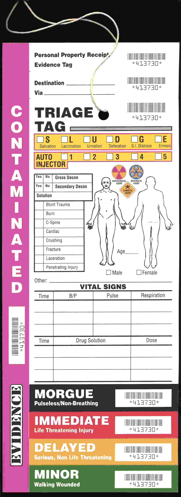

# Risk-based testing

*A triage tag doesn't ask who arrived first - it sorts by IMMEDIATE, DELAYED, and MINOR based on likelihood of harm times how bad that harm would be. Risk-based testing runs the same formula: Risk = Likelihood x Impact, and testing time goes where that number is highest, not where it's convenient.*

> A team with three days left before release and forty untested features cannot test all forty equally
> well - the math simply does not work. Risk-based testing exists because that constraint is always
> true, in some form, on every real project: time is finite, and the only real choice is where it goes.
> The question was never "should we skip something" - it always was, and always will be - "which forty
> percent gets the deepest attention, and on what actual basis."

> **In real life**
>
> A triage tag at a mass-casualty scene never asks who arrived first - it sorts patients into IMMEDIATE
> (life-threatening), DELAYED (serious, not life-threatening), and MINOR (walking wounded), based on a
> combination of how likely a condition is to get worse and how bad the outcome would be if it does.
> Limited responders, limited time, and the sorting exists specifically so the worst risk gets attention
> first regardless of arrival order. Risk-based testing runs the identical calculation: not "what's
> easiest to test" or "what got built first," but which combination of likelihood and impact is highest,
> tested in that order.

**Risk-based testing**: Risk-based testing is a strategy for allocating limited testing time and depth in proportion to actual risk - calculated as likelihood of failure multiplied by impact if that failure occurs - so the areas most likely to break and most costly if they do get tested first and most thoroughly, rather than testing everything equally or in whatever order happened to be convenient.

## The formula: Risk = Likelihood x Impact

Every risk-based testing method reduces to the same two questions, asked about every feature or area:
how likely is this to actually fail (complexity, how recently it changed, how many dependencies it
has, how experienced the team is with this part of the codebase), and how bad is it if it does
(revenue impact, safety, legal exposure, how many users are affected, how visible the failure would
be). A common practical scoring approach rates each factor on a 1-5 scale and multiplies them,
producing a score from 1 to 25 - high scores demand deep, early testing; low scores can be tested
lightly, tested last, or in some cases deliberately accepted as an untested risk with the reasoning
documented.

## Both dimensions matter - neither alone is enough

A feature that is very likely to break but genuinely trivial if it does (a rarely-used cosmetic
setting) sits at low overall risk despite the high likelihood. A feature that is unlikely to break but
catastrophic if it does (a payment calculation, tested thoroughly, rarely fails, but a failure there
is severe) still deserves real testing depth because of the impact side alone. The two-axis
calculation exists specifically to prevent either factor from being ignored - a purely likelihood-
based ranking under-tests rare-but-severe risks, and a purely impact-based ranking over-tests stable,
low-complexity code just because it happens to matter a lot when it works.

> **Tip**
>
> Revisit the risk assessment as new information arrives, not just once at project start. An area
> scored as low-risk that turns out to have several real defects during testing should be re-scored and
> re-prioritized immediately - the initial risk estimate was a starting hypothesis, not a fixed
> verdict.

> **Common mistake**
>
> Scoring risk from a gut feeling with no named factors behind the number. A defensible risk score
> names the specific reasons for both the likelihood and impact ratings - "recently rewritten,
> touches payment processing, affects all checkout users" - not just an unexplained "high" that nobody
> else can evaluate or challenge later.


*Deconference 2002 triage tag — Steve Mann, CC BY-SA 3.0, via Wikimedia Commons. [Source](https://commons.wikimedia.org/wiki/File:Deconference-2002-triage-tag.jpg)*
- **IMMEDIATE - life-threatening, treated first** — Limited responders, limited time - the worst risk gets attention before anything else, regardless of arrival order. Risk-based testing works the same way: highest likelihood and impact tested first, regardless of build order.
- **DELAYED - serious, but not life-threatening** — Real, worth treating, just not ahead of something worse. Medium-risk test areas earn exactly this level of attention: covered, but not at the expense of the genuinely critical path.
- **MINOR - walking wounded** — Still injured, still real - accepted to wait, deliberately, because the alternative is worse outcomes elsewhere. Low-risk test areas get the same honest, deliberate deprioritization, not neglect by accident.
- **The injury checklist - what actually drives the category** — Blunt trauma, burn, fracture - specific, checkable factors that justify a category, not a guess. A defensible risk score needs the same real justification: named factors, not a gut feeling.

**Scoring one feature's risk**

1. **Rate likelihood: how prone is this to failure?** — Complexity, recency of change, dependency count, team familiarity - scored on a consistent scale.
2. **Rate impact: how bad is it if it fails?** — Revenue, safety, legal exposure, number of affected users, visibility of the failure.
3. **Multiply the two scores** — Likelihood x impact - a number both dimensions had to contribute to, preventing either from being ignored.
4. **Allocate testing depth and order by the resulting score** — Highest scores tested first and deepest; lowest scores tested lightly, last, or knowingly accepted as risk.

*Scoring and ranking features by risk (Python)*

```python
features = [
    {"name": "Payment checkout", "likelihood": 2, "impact": 5},
    {"name": "Password reset", "likelihood": 3, "impact": 4},
    {"name": "Profile avatar upload", "likelihood": 4, "impact": 1},
    {"name": "Search autocomplete", "likelihood": 3, "impact": 2},
]

for f in features:
    f["risk_score"] = f["likelihood"] * f["impact"]

ranked = sorted(features, key=lambda f: f["risk_score"], reverse=True)

print("Feature risk ranking (likelihood x impact, scale 1-5 each, max score 25):")
for f in ranked:
    if f["risk_score"] >= 15:
        priority = "TEST FIRST, deepest coverage"
    elif f["risk_score"] >= 8:
        priority = "test thoroughly, standard priority"
    else:
        priority = "light coverage, test last"
    print("  " + f["name"] + ": likelihood=" + str(f["likelihood"]) + ", impact=" +
          str(f["impact"]) + ", score=" + str(f["risk_score"]) + " -> " + priority)
```

*Scoring and ranking features by risk (Java)*

```java
import java.util.*;

public class Main {
    static class Feature {
        String name; int likelihood, impact, riskScore;
        Feature(String name, int likelihood, int impact) {
            this.name = name; this.likelihood = likelihood; this.impact = impact;
            this.riskScore = likelihood * impact;
        }
    }

    public static void main(String[] args) {
        List<Feature> features = new ArrayList<>();
        features.add(new Feature("Payment checkout", 2, 5));
        features.add(new Feature("Password reset", 3, 4));
        features.add(new Feature("Profile avatar upload", 4, 1));
        features.add(new Feature("Search autocomplete", 3, 2));

        features.sort((a, b) -> Integer.compare(b.riskScore, a.riskScore));

        System.out.println("Feature risk ranking (likelihood x impact, scale 1-5 each, max score 25):");
        for (Feature f : features) {
            String priority;
            if (f.riskScore >= 15) {
                priority = "TEST FIRST, deepest coverage";
            } else if (f.riskScore >= 8) {
                priority = "test thoroughly, standard priority";
            } else {
                priority = "light coverage, test last";
            }
            System.out.println("  " + f.name + ": likelihood=" + f.likelihood + ", impact=" +
                    f.impact + ", score=" + f.riskScore + " -> " + priority);
        }
    }
}
```

### Your first time: Build a first risk matrix for a real project

- [ ] List 5-10 real features or areas from a current project — A mix of high-visibility and low-visibility, simple and complex.
- [ ] Rate each on likelihood (1-5) with a named reason — Complexity, recent changes, dependency count - write down why, not just the number.
- [ ] Rate each on impact (1-5) with a named reason — Revenue, safety, user count affected, visibility - again, name the actual reasoning.
- [ ] Multiply and rank, then compare the result to how testing time is currently actually allocated — A mismatch here is often the most useful finding of the whole exercise.

- **A low-risk-scored area turns out to have several real defects during testing.**
  Re-score it immediately with the new evidence - the original score was a starting estimate, not a fixed verdict, and new information should update it.
- **Two team members score the same feature very differently on likelihood or impact.**
  A sign the underlying reasoning wasn't made explicit - require a named reason for every score, which turns a subjective disagreement into a concrete, resolvable one.
- **Testing time keeps going to whatever is easiest to test rather than what the risk matrix says is highest priority.**
  The matrix needs to actually drive planning decisions, not just exist as documentation - revisit it explicitly when allocating each testing cycle's time.

### Where to check

- Any testing plan or sprint allocation, checked against whether it actually matches a real risk ranking rather than convenience or build order.
- Any risk score with no named reasoning behind it - a strong signal it was a guess, not a defensible assessment.
- [[test-management-and-reporting/risk-and-estimation/prioritizing-what-to-test-first]] for turning a risk ranking into an actual day-by-day testing order under real time constraints.
- [[test-management-and-reporting/risk-and-estimation/test-estimation-techniques]] for estimating how much time each risk tier realistically deserves.
- [[test-management-and-reporting/environments-and-test-data/dev-qa-staging-prod]] for how risk level should also inform which environment stage deserves the deepest validation for a given feature.

### Worked example: a low-scored feature that should have been re-triaged sooner

1. A risk matrix scores a "bulk CSV export" feature at 6 (likelihood 3, impact 2) - moderate-low,
   tested lightly and scheduled last in a two-week cycle.
2. A quick manual pass during the light-coverage slot finds three distinct defects in the first ten
   minutes: incorrect date formatting, a silent failure on files over 10,000 rows, and a memory issue
   under concurrent exports.
3. The likelihood score of 3 turns out to have badly underestimated real fragility - the feature was
   more complex and less battle-tested than the original assessment assumed.
4. Re-scored honestly with the new evidence (likelihood 5, impact revised to 3 once the concurrent-
   export memory issue's real severity is understood), the feature jumps to a risk score of 15 -
   squarely in "test first, deepest coverage" territory.
5. Testing time is reallocated mid-cycle to give it the depth the revised score demands, and two of the
   three defects are caught and fixed before release - the fix wasn't a better initial guess, it was
   updating the assessment the moment real evidence contradicted it.

**Quiz.** A feature scores low on likelihood (unlikely to fail) but very high on impact (catastrophic if it does). What does this note say about testing it?

- [ ] It can be safely skipped since failures are rare
- [x] It still deserves real testing depth because of the impact dimension alone - risk is likelihood times impact, and a high score on either axis alone can justify serious attention
- [ ] It should only be tested if time permits after all high-likelihood features
- [ ] Impact should be ignored if likelihood is low

*The two-axis calculation exists precisely to prevent either factor from being ignored on its own. A payment calculation that rarely fails but would be catastrophic if it did is exactly the kind of risk a purely likelihood-based ranking would under-test - the impact side of the formula is what correctly keeps it a priority despite its low likelihood.*

- **Risk-based testing** — Allocating limited testing time and depth in proportion to actual risk (likelihood x impact), so the highest-risk areas get tested first and most thoroughly.
- **The risk formula** — Risk = Likelihood x Impact - both factors scored (commonly 1-5 each), multiplied to produce a combined score that neither dimension alone can distort.
- **Why a risk score needs named reasoning** — An unexplained 'high' or 'low' cannot be evaluated or challenged by anyone else - naming the specific factors behind each rating makes the score defensible and revisable.
- **Why risk scores should be revisited during testing** — New evidence (defects found in a supposedly low-risk area) should update the original estimate immediately - it was a starting hypothesis, never a fixed verdict.

### Challenge

Build a risk matrix for 5-10 real features from a project you know: score likelihood and impact (1-5 each) with named reasoning, multiply for a risk score, and compare the ranking to how testing time is currently actually allocated.

- [Guru99 — Risk Based Testing: Approach, Matrix, Process & Examples](https://www.guru99.com/risk-based-testing.html)
- [Smartesting — Your Guide to Understanding Risk-Based Testing](https://www.smartesting.com/en/your-guide-to-understanding-risk-based-testing/)
- [Risk-Based Testing: Better Focus, Better Products](https://www.youtube.com/watch?v=zDjCThAUGE4)

🎬 [Risk-Based Testing: Better Focus, Better Products](https://www.youtube.com/watch?v=zDjCThAUGE4) (12 min)

- Risk-based testing allocates limited testing time in proportion to risk = likelihood x impact, not evenly or by convenience.
- Both dimensions matter independently - a high score on either likelihood or impact alone can justify serious testing attention.
- A defensible risk score names specific reasoning behind both ratings, not an unexplained gut-feeling number.
- Risk scores are starting hypotheses, not fixed verdicts - new evidence during testing should trigger an immediate re-score.
- The same underlying logic drives medical triage under scarce resources - sort by combined likelihood and severity, not by arrival order.


## Related notes

- [[Notes/test-management-and-reporting/risk-and-estimation/prioritizing-what-to-test-first|Prioritizing what to test first]]
- [[Notes/test-management-and-reporting/risk-and-estimation/test-estimation-techniques|Test estimation techniques]]
- [[Notes/test-management-and-reporting/environments-and-test-data/dev-qa-staging-prod|Dev / QA / staging / prod]]


---
_Source: `packages/curriculum/content/notes/test-management-and-reporting/risk-and-estimation/risk-based-testing.mdx`_
