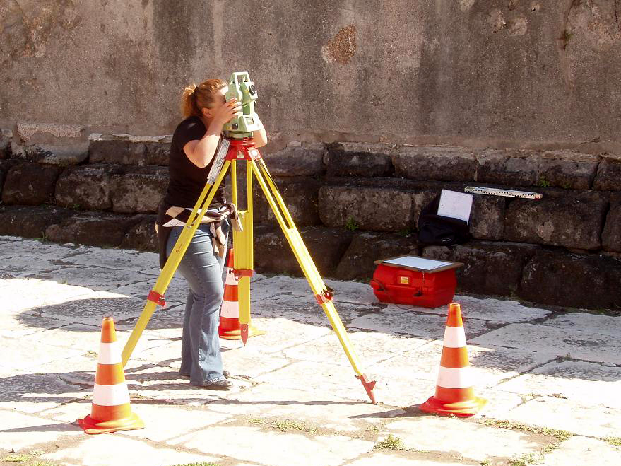

# Test estimation techniques

*A surveyor never eyeballs a distance - they triangulate from multiple fixed points against a known scale. PERT's three-point formula does the same for testing: optimistic, pessimistic, and most-likely estimates combined (O + 4M + P) / 6, producing a defensible number instead of a single guess.*

> "This will take about three days" is a guess dressed up as a number - confident-sounding, single-
> point, and offering nobody any way to tell how much uncertainty is actually hiding behind it. Real
> estimation techniques exist specifically to replace that guess with something derived from an actual
> method: historical data, multiple scenarios combined deliberately, or a count of concrete units of
> work - producing a number that can be explained, checked, and defended when reality inevitably departs
> from it.

> **In real life**
>
> A surveyor never eyeballs a distance and calls it done - a theodolite reads an actual angle against a
> known measuring rod, mounted on a tripod with three independent legs providing stable triangulation
> from more than one reference point at once. The result is a number derived from method, not a guess
> dressed up with confidence. Test estimation techniques exist for the exact same reason: three-point
> estimation triangulates from optimistic, pessimistic, and most-likely scenarios instead of a single
> guess, and historical-data-based methods anchor a new estimate against a known, measured reference
> the same way a surveyor's rod does.

**Test estimation techniques**: Test estimation techniques are structured methods - three-point (PERT) estimation, historical/analogous comparison, and counting testable units - for producing a testing time or effort estimate derived from an actual method and real data, rather than a single unsupported guess, and for expressing the genuine uncertainty around that number explicitly.

## Three-point (PERT) estimation: triangulating from three scenarios

Rather than asking for one number, three-point estimation asks for three: the **optimistic** estimate
(everything goes right), the **pessimistic** estimate (real but reasonable worst case), and the
**most likely** estimate (typical case, accounting for normal friction). The PERT formula combines
them with a weighted average that trusts the most-likely estimate four times as much as either
extreme: `(Optimistic + 4 x Most Likely + Pessimistic) / 6`. The real value isn't just the resulting
number - it's that the spread between optimistic and pessimistic gives an honest, quantified sense of
how uncertain the estimate actually is, something a single confident guess never communicates at all.

## Historical data and counting testable units

**Analogous estimation** anchors a new estimate against actual measured time from genuinely similar
past testing work - "the last three features of this complexity averaged 2.5 days of testing" is a
defensible starting point in a way "I think this will take a couple of days" never is, but it requires
a team to have actually tracked real time spent historically in the first place. **Counting testable
units** - test conditions, function points, distinct use cases - and multiplying by a known average
time per unit works the same way at a finer grain: count what genuinely needs testing, multiply by a
real historical rate, and the estimate scales honestly with actual scope instead of a felt sense of
"how big this seems."

> **Tip**
>
> Track actual time spent against every estimate, even rough ones - this is what turns future estimates
> from guesses into genuinely data-informed numbers. A team with a year of tracked estimate-vs-actual
> data can estimate far more accurately than one starting from scratch every time.

> **Common mistake**
>
> Presenting an estimate as a single number with no stated range or confidence level. "Three days" says
> nothing about whether that means "somewhere between two and three" or "somewhere between one and
> seven" - the range is exactly the information a stakeholder needs to plan around real uncertainty.


*Theodolite in use — David Shay, CC BY-SA 3.0, via Wikimedia Commons. [Source](https://commons.wikimedia.org/wiki/File:Theodolite_in_use.JPG)*
- **The instrument itself - measured, not guessed** — Reads an actual angle, not an eyeballed estimate. A real estimation technique - three-point, historical-average - produces a number the same way: derived from a method, not intuition alone.
- **The measuring rod - a known reference** — Every reading only means something compared against this fixed, known scale. A test estimate needs the same anchor: historical data from similar past work, not a fresh guess every time.
- **Three legs, three independent points** — Triangulation from more than one angle makes a survey reading trustworthy. Three-point estimation works the same way - optimistic, pessimistic, and most-likely readings combined, not a single guess taken on faith.
- **The marked boundary** — A survey states its scope explicitly - this much ground, no more, no less. A test estimate needs the same explicit boundary: exactly what's included, so the number means something specific and checkable.

**Producing one defensible estimate**

1. **Gather three scenarios: optimistic, most likely, pessimistic** — Three honest numbers, not one confident guess - each grounded in a real reason for that value.
2. **Combine with the PERT weighted average** — (O + 4M + P) / 6 - trusting the most-likely case more, without discarding the extremes entirely.
3. **Cross-check against historical data if available** — How did similar past work actually take, measured, not remembered?
4. **Report the estimate with its range, not as a bare single number** — The spread between optimistic and pessimistic is real, useful information a stakeholder needs to plan around.

*Three-point (PERT) estimation with a stated range (Python)*

```python
estimates = {
    "optimistic_hours": 4,
    "most_likely_hours": 8,
    "pessimistic_hours": 20,
}

pert_estimate = (estimates["optimistic_hours"] + 4 * estimates["most_likely_hours"] +
                  estimates["pessimistic_hours"]) / 6

# Standard deviation approximation, giving a sense of real uncertainty
std_dev = (estimates["pessimistic_hours"] - estimates["optimistic_hours"]) / 6

print("Three-point estimate inputs:")
print("  Optimistic: " + str(estimates["optimistic_hours"]) + "h")
print("  Most likely: " + str(estimates["most_likely_hours"]) + "h")
print("  Pessimistic: " + str(estimates["pessimistic_hours"]) + "h")

print("")
print("PERT weighted estimate: " + str(round(pert_estimate, 1)) + "h")
print("Approximate uncertainty (+/-): " + str(round(std_dev, 1)) + "h")
print("Report to stakeholders as: " + str(round(pert_estimate - std_dev, 1)) +
      "h - " + str(round(pert_estimate + std_dev, 1)) + "h, not a bare single number")
```

*Three-point (PERT) estimation with a stated range (Java)*

```java
public class Main {
    public static void main(String[] args) {
        double optimisticHours = 4;
        double mostLikelyHours = 8;
        double pessimisticHours = 20;

        double pertEstimate = (optimisticHours + 4 * mostLikelyHours + pessimisticHours) / 6;

        // Standard deviation approximation, giving a sense of real uncertainty
        double stdDev = (pessimisticHours - optimisticHours) / 6;

        System.out.println("Three-point estimate inputs:");
        System.out.println("  Optimistic: " + optimisticHours + "h");
        System.out.println("  Most likely: " + mostLikelyHours + "h");
        System.out.println("  Pessimistic: " + pessimisticHours + "h");

        System.out.println();
        System.out.println("PERT weighted estimate: " + Math.round(pertEstimate * 10.0) / 10.0 + "h");
        System.out.println("Approximate uncertainty (+/-): " + Math.round(stdDev * 10.0) / 10.0 + "h");
        System.out.println("Report to stakeholders as: " +
                Math.round((pertEstimate - stdDev) * 10.0) / 10.0 + "h - " +
                Math.round((pertEstimate + stdDev) * 10.0) / 10.0 + "h, not a bare single number");
    }
}
```

### Your first time: Produce a first three-point estimate

- [ ] Pick one real, upcoming testing task — Something specific enough to reason about concretely, not a vague multi-week initiative.
- [ ] Write down honest optimistic, most-likely, and pessimistic estimates — Each with a real reason - what would actually have to be true for each scenario.
- [ ] Apply the PERT formula: (O + 4M + P) / 6 — Compare the result to what a single gut-feel guess would have been.
- [ ] State the estimate as a range, not a single number, when reporting it — Use the optimistic-to-pessimistic spread as the honest uncertainty band.

- **Testing consistently takes far longer than estimated, cycle after cycle.**
  Check whether estimates are being tracked against actuals at all - without that historical data, every new estimate is still effectively a fresh guess with no correction feeding back into it.
- **A stakeholder holds the team to a single-number estimate as if it were a guarantee.**
  The estimate was likely presented without its range - reintroduce the optimistic-to-pessimistic spread explicitly, framing the single number as the center of a range, not a fixed commitment.
- **Two team members estimate the same task very differently with no way to reconcile the gap.**
  A sign the estimate wasn't built from a shared method - walk through three-point estimation together, making the optimistic/most-likely/pessimistic reasoning for each person explicit and comparable.

### Where to check

- Any estimate presented as a single bare number with no stated range or confidence level.
- Whether actual time spent is being tracked against past estimates at all - the raw material every future estimate should improve from.
- [[test-management-and-reporting/risk-and-estimation/prioritizing-what-to-test-first]] for how these effort estimates directly feed the risk-per-effort prioritization ranking.
- [[test-management-and-reporting/risk-and-estimation/saying-no-with-data]] for using a defensible estimate as the evidence behind declining to test something within an unrealistic timeline.
- [[test-management-and-reporting/risk-and-estimation/risk-based-testing]] for the risk scoring this note's effort estimates get divided against.

### Worked example: a single-number estimate that hid a real risk from everyone

1. A tester is asked how long testing a new payment integration will take and answers "about three
   days" - a confident-sounding single number, based mostly on a gut feeling.
2. A project plan is built around that three-day estimate with no buffer, since nothing about it
   signaled any uncertainty worth planning around.
3. Testing actually surfaces several edge cases in currency conversion and retry logic that were
   genuinely hard to anticipate - the work stretches to eight days, blowing the plan with no warning.
4. A retrospective applies three-point estimation to the same original task after the fact: optimistic
   2 days, most likely 4 days, pessimistic 10 days - PERT calculates (2 + 16 + 10) / 6 ≈ 4.7 days, with
   real uncertainty (+/- roughly 1.3 days) that the original single number never communicated at all.
5. Going forward, the team adopts three-point estimation for anything with real technical uncertainty,
   reporting a range instead of a single number - the actual outcome next time still varies, but
   nobody is caught by surprise the way the original flat "three days" guaranteed they would be.

**Quiz.** Why does this note say a single-number estimate like 'about three days' is worse than a three-point estimate with a stated range?

- [ ] Because single numbers are always mathematically wrong
- [x] Because a single number communicates false confidence and hides the real uncertainty - a stakeholder cannot plan for risk they were never told existed, while a stated range gives them exactly that information
- [ ] Because three-point estimation always produces a lower number
- [ ] Because single-number estimates take longer to calculate

*The problem with a bare single number isn't that it's necessarily inaccurate on average - it's that it hides exactly the information a stakeholder needs to plan around real risk. A three-point estimate's range, even when the center number ends up similar, tells the reader honestly how much uncertainty actually exists, which changes how they plan and how surprised they should be if the outcome lands at either extreme.*

- **Three-point (PERT) estimation** — Combining optimistic, most-likely, and pessimistic estimates with a weighted average (O + 4M + P) / 6, producing both a number and a genuine sense of uncertainty around it.
- **Why the PERT formula weights the most-likely estimate 4x** — It trusts the typical-case scenario more heavily than either extreme, based on probability theory (a Beta distribution), while still incorporating the honest range from both extremes.
- **Analogous estimation** — Anchoring a new estimate against actual measured time from genuinely similar past testing work - requires a team to have tracked real historical data to draw from.
- **Why an estimate should always be reported as a range** — A single bare number hides the real uncertainty behind it - a stated range gives a stakeholder the actual information needed to plan around risk, rather than false confidence.

### Challenge

Produce a three-point estimate for one real upcoming testing task: write honest optimistic, most-likely, and pessimistic numbers with reasons, apply the PERT formula, and state the result as a range rather than a single number.

- [A Three-Point Estimating Technique: PERT](https://projectmanagementacademy.net/resources/blog/a-three-point-estimating-technique-pert/)
- [PM Study Circle — Three-Point Estimating (PERT): Formula, Examples & FAQs](https://pmstudycircle.com/three-point-estimation/)
- [PERT in Project Management, Three-Point Estimating Explained](https://www.youtube.com/watch?v=AQ_Wr1Me__8)

🎬 [PERT in Project Management, Three-Point Estimating Explained](https://www.youtube.com/watch?v=AQ_Wr1Me__8) (14 min)

- Real estimation techniques derive a number from an actual method - three-point (PERT), historical comparison, or counting testable units - rather than a single unsupported guess.
- PERT's formula (O + 4M + P) / 6 weights the most-likely scenario heavily while still incorporating honest optimistic and pessimistic bounds.
- Historical, tracked data is what makes future estimates genuinely more accurate over time - without it, every 'new' estimate is still effectively a fresh guess.
- An estimate should always be reported as a range, not a bare single number - the range is the real information a stakeholder needs to plan around uncertainty.
- The spread between optimistic and pessimistic estimates is itself useful, quantified information about how uncertain a given task genuinely is.


## Related notes

- [[Notes/test-management-and-reporting/risk-and-estimation/prioritizing-what-to-test-first|Prioritizing what to test first]]
- [[Notes/test-management-and-reporting/risk-and-estimation/saying-no-with-data|Saying no with data]]
- [[Notes/test-management-and-reporting/risk-and-estimation/risk-based-testing|Risk-based testing]]


---
_Source: `packages/curriculum/content/notes/test-management-and-reporting/risk-and-estimation/test-estimation-techniques.mdx`_
