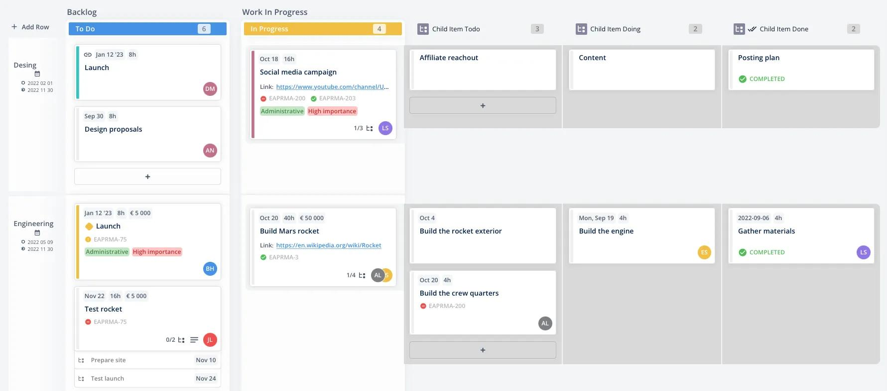

# JIRA & boards, deeper

*Beyond a status dropdown: custom fields for structured data a default install lacks, JQL for repeatable searches, the epic to story to sub-task hierarchy, and swimlanes that group a board by owner or workstream.*

> An earlier note covered the shape every project shares: an issue, a status, a board. That's enough to
> survive a first week on a team. It is not enough to run one - the moment a project has more than a
> handful of issues, someone needs to ask "show me every open bug this sprint that a specific person
> owns" without scrolling a board by eye, and someone needs a bigger unit than "issue" to talk about a
> whole feature. Custom fields, JQL, hierarchy, and swimlanes are the four answers a team reaches for
> once the basic board stops being enough.

> **In real life**
>
> A magazine's editorial system tracks more than "draft" or "published." A whole issue of the magazine -
> the November print run - breaks down into individual articles, and a long article breaks down further
> into the photo edit, the fact-check, and the copy pass underneath it. Two desks, Features and News, work
> in parallel down the same production calendar without their articles getting mixed into one pile. And
> an editor doesn't scroll the whole archive by eye to find something; they type a specific query into the
> system - "section is Features and status is Draft and word count is greater than 2000" - and get exactly
> those articles back. None of this replaces the basic draft-to-published status. It's what a real newsroom
> adds on top once "a stack of articles" stops being manageable.

**Jira hierarchy and query tooling**: Beyond an issue's basic type/status/fields shape, a mature Jira project typically adds: custom fields (project-specific structured data a default install doesn't ship, such as a customer tier or a regression flag), JQL - Jira Query Language (a text-based search syntax combining fields, operators, and values, e.g. project = QAM AND status = 'In Progress' AND assignee = currentUser`(`)`, for repeatable, shareable searches beyond what a board's filters expose), issue hierarchy (Epic contains Story contains Sub-task, letting a large body of work be planned and reported at three different sizes), and swimlanes (horizontal rows on a board, grouping cards by a rule such as assignee, epic, or priority, layered on top of the status columns rather than replacing them).

## Custom fields: structured data a default install doesn't have

Jira ships with severity-adjacent basics but has no built-in "which customer reported this" or "which
regression suite covers this." A custom field is how a team adds exactly that: a dropdown, a text box, a
number, or a linked-issue picker, attached to specific issue types in a specific project. The value only
exists once someone adds the field - it does not retroactively appear on old issues, and two projects can
have fields with the same label meaning entirely different things underneath.

- **Structured, not free-text.** A dropdown custom field with five fixed values is filterable and
  reportable; a free-text field where five people type five different spellings of the same idea is not,
  no matter how descriptive the label sounds.
- **Project-scoped by default.** A field built for one project's screen doesn't automatically appear on
  another's issues unless someone explicitly adds it there too - useful for keeping unrelated projects
  from cluttering each other's forms, confusing when a tester expects it and it's simply not configured.

## JQL: the query that replaces "scroll and squint"

A board's built-in filters (assignee, label, a quick text search) cover common cases. JQL exists for
everything past that - specific date ranges, several conditions at once, or a query worth saving and
reusing. It reads close to a sentence: `field operator value`, chained with `AND` / `OR`.

```
project = QAM AND type = Bug AND status != Done AND priority in (Highest, High)
```

That single line answers "every open, high-priority bug in this project" - the same question a status
dropdown and a priority column can answer by eye on a small board, but instantly and exactly on one with
thousands of issues. A saved JQL query is also how most Jira dashboards and reports are actually built
underneath their friendlier drag-and-drop UI.

> **Tip**
>
> Before typing a JQL query from scratch, open a board's existing filter and look for a small "Switch to
> JQL" or similar link near the filter bar. Most boards already have one built from their configured
> filters - reading it teaches the exact field names and syntax that project actually uses, which is faster
> and more reliable than guessing from documentation alone.

> **Common mistake**
>
> Building a custom field for something Jira's hierarchy already models. A team that adds a free-text
> "parent feature" field to every story, instead of actually linking that story under a real Epic, ends up
> with an unreliable, manually-typed shadow of a relationship the tool tracks natively - and one that
> breaks the moment someone misspells or forgets to fill it in. Check whether Epic/Story/Sub-task already
> covers what a new field is trying to recreate before adding one.


*Teamhood Kanban board — DovileMi, Wikimedia Commons, CC BY-SA 4.0. [Source](https://commons.wikimedia.org/wiki/File:Teamhood_Kanban_board.webp)*
- **A swimlane row, not a status column** — This horizontal band groups every card in it by team, layered across the same To Do / In Progress columns - a second grouping axis on top of status, not instead of it.
- **Colored tags on a card — custom fields** — Labels like these are project-configured custom fields, not part of Jira's default install - useful exactly because a team chose what they mean.
- **A parent card's own sub-task count** — The `1/4` marker and the linked issue key show a Story tracking its own Sub-tasks underneath it - the hierarchy a JQL query can filter by parent, and a free-text field never reliably would.
- **A zoomed-in child board** — This parent's Sub-tasks get their own mini board with their own To Do / Doing / Done columns - hierarchy and boards are two independent features that combine, not one built on the other.

**From a plain board to a queryable, layered one**

1. **A project outgrows a flat issue list** — More issues, more people, more questions a status column alone can't answer at a glance.
2. **Custom fields add the missing structured data** — A dropdown or linked field for whatever the default install doesn't track - filterable, not just readable.
3. **Epics group related Stories, Stories group Sub-tasks** — The same body of work reported at three sizes: a whole feature, a shippable slice, a single task.
4. **Swimlanes group the board by owner or workstream** — Rows layered across the existing status columns, not a replacement for them.
5. **JQL answers the specific question directly** — One saved query instead of scrolling and squinting at a board that has grown past what eyes alone can parse.

A JQL-style query is really just a small filter applied to a list of records. Here's a simplified
version: parse a `field = "value" AND field = "value"` string and run it against sample tickets, the same
shape a real Jira search bar builds before it ever reaches the server.

*Run it - a JQL-style filter simulator (Python)*

```python
tickets = [
    {"key": "QAM-101", "type": "Epic", "status": "In Progress", "assignee": "amir", "team": "Checkout"},
    {"key": "QAM-102", "type": "Story", "status": "In Progress", "assignee": "priya", "team": "Checkout"},
    {"key": "QAM-103", "type": "Story", "status": "Done", "assignee": "priya", "team": "Checkout"},
    {"key": "QAM-104", "type": "Sub-task", "status": "In Progress", "assignee": "priya", "team": "Checkout"},
    {"key": "QAM-105", "type": "Story", "status": "In Progress", "assignee": "amir", "team": "Search"},
]

def parse_jql(jql):
    conditions = []
    for clause in jql.split(" AND "):
        field, value = clause.split("=")
        conditions.append((field.strip(), value.strip().strip('"')))
    return conditions

def run_jql(jql, tickets):
    conditions = parse_jql(jql)
    return [t["key"] for t in tickets if all(t.get(f) == v for f, v in conditions)]

jql = 'type = "Story" AND status = "In Progress" AND team = "Checkout"'
matches = run_jql(jql, tickets)
print("JQL:", jql)
print("Matches:", matches)
assert matches == ["QAM-102"], "unexpected JQL result"
print("RESULT=PASS")

# JQL: type = "Story" AND status = "In Progress" AND team = "Checkout"
# Matches: ['QAM-102']
# RESULT=PASS
```

*Run it - a JQL-style filter simulator (Java)*

```java
import java.util.*;

public class Main {
    public static void main(String[] args) {
        List<Map<String, String>> tickets = new ArrayList<>();
        tickets.add(ticket("QAM-101", "Epic", "In Progress", "amir", "Checkout"));
        tickets.add(ticket("QAM-102", "Story", "In Progress", "priya", "Checkout"));
        tickets.add(ticket("QAM-103", "Story", "Done", "priya", "Checkout"));
        tickets.add(ticket("QAM-104", "Sub-task", "In Progress", "priya", "Checkout"));
        tickets.add(ticket("QAM-105", "Story", "In Progress", "amir", "Search"));

        String jql = "type = \\"Story\\" AND status = \\"In Progress\\" AND team = \\"Checkout\\"";
        List<String> matches = runJql(jql, tickets);

        System.out.println("JQL: " + jql);
        System.out.println("Matches: " + matches);
        if (!matches.equals(List.of("QAM-102"))) throw new AssertionError("unexpected JQL result");
        System.out.println("RESULT=PASS");
    }

    static Map<String, String> ticket(String key, String type, String status, String assignee, String team) {
        Map<String, String> t = new LinkedHashMap<>();
        t.put("key", key); t.put("type", type); t.put("status", status);
        t.put("assignee", assignee); t.put("team", team);
        return t;
    }

    static List<String[]> parseJql(String jql) {
        List<String[]> conditions = new ArrayList<>();
        for (String clause : jql.split(" AND ")) {
            String[] parts = clause.split("=", 2);
            conditions.add(new String[]{parts[0].trim(), parts[1].trim().replace("\\"", "")});
        }
        return conditions;
    }

    static List<String> runJql(String jql, List<Map<String, String>> tickets) {
        List<String[]> conditions = parseJql(jql);
        List<String> results = new ArrayList<>();
        for (Map<String, String> t : tickets) {
            boolean all = true;
            for (String[] c : conditions) {
                if (!Objects.equals(t.get(c[0]), c[1])) { all = false; break; }
            }
            if (all) results.add(t.get("key"));
        }
        return results;
    }
}

/* JQL: type = "Story" AND status = "In Progress" AND team = "Checkout"
   Matches: [QAM-102]
   RESULT=PASS */
```

### Your first time: Your mission: build one real JQL query and one real hierarchy

- [ ] Open any Jira project's board and find its filter bar — Look for a link to switch the current filter to its underlying JQL - read it before writing one from scratch.
- [ ] Write one JQL query answering a real question — e.g. 'every Bug assigned to me that isn't Done' - confirm it returns what you expect.
- [ ] Create one Epic with two Stories, and give one Story two Sub-tasks — Confirm the Epic's own view shows rollup progress across both Stories.
- [ ] Add one custom field and one swimlane grouping — A single dropdown field on one issue type, and a board regrouped by assignee or epic instead of status alone.
- [ ] Run the Python playground with your own tickets — Confirm the filter simulator returns exactly the keys matching every condition, not a partial match.

- **A JQL query returns nothing, though matching issues clearly exist on the board.**
  Check field names and value casing/spelling exactly - JQL is unforgiving of a mistyped status name or a field that doesn't exist in that specific project's configuration.
- **A Story seems to belong to two different Epics depending on who you ask.**
  An issue can only have one parent Epic in standard Jira hierarchy - if two people believe different things, one of them is looking at stale information or a different, similarly-named issue.
- **A new swimlane grouping makes some cards vanish from view.**
  Swimlanes commonly hide a 'no value' row by default - a card with no assignee or no epic set can disappear from an assignee- or epic-grouped board without actually being deleted.
- **A custom field a JQL query depends on doesn't exist on some issues.**
  Custom fields are per-project and often per-issue-type; a field added after older issues were created won't retroactively populate on them, and a query filtering by it will simply skip those.

### Where to check

- **A board's filter/JQL toggle** — the fastest way to read a project's real, currently-applied search logic instead of guessing at field names.
- **An Epic's own linked-issues panel** — shows every Story underneath it and, transitively, the Sub-tasks under those Stories.
- **Project (or field) administration**, if accessible — confirms which custom fields actually exist on a given issue type before relying on them in a query.
- [[test-management-and-reporting/test-management-tools/organizing-suites-and-runs]] for how a comparable case/suite/run hierarchy is organized in a dedicated test management tool rather than a tracker's board.

### Worked example: one JQL query replacing a manual scroll

1. A release lead needs every open bug affecting a specific customer tier before sign-off - dozens of
   issues scattered across a board with no single visible grouping for it.
2. Scrolling and reading labels by eye is slow and error-prone at this scale, and nobody trusts a manual
   count enough to report it upward.
3. A custom field, `Customer Tier`, already exists on the Bug issue type from an earlier project setup -
   confirmed by opening one real Bug and checking its fields panel.
4. The query `project = QAM AND type = Bug AND status != Done AND "Customer Tier" = Enterprise` returns
   an exact, reproducible list in seconds, savable for next release's sign-off too.
5. The same query becomes the source for a dashboard gadget - the friendly chart is JQL underneath,
   confirming the field and the query are now doing real, reusable reporting work.

**Quiz.** A tester wants to track a 'flaky in CI' flag on Bug issues, but the project has no such field yet. What's the most accurate next step?

- [ ] Write the flag into the issue description as free text every time
- [x] Check whether an existing field or the Epic/Story/Sub-task hierarchy already models this before adding a new custom field, then add a proper structured field (like a checkbox or dropdown) if it genuinely doesn't
- [ ] Rename the Priority field to mean 'flaky in CI' instead
- [ ] Ignore it since Jira can't track anything beyond its default fields

*Custom fields exist precisely for structured data a default install lacks, but adding one is worth doing properly - as a real, filterable field, and only after confirming nothing already covers it. Free text (option 1) can't be reliably queried with JQL. Repurposing an existing field's meaning (option 3) corrupts whatever that field's original purpose was for everyone else. Option 4 is simply false - this is exactly the situation custom fields solve.*

- **Custom field** — Project-specific structured data (dropdown, text, number, linked issue) a default Jira install doesn't ship - only exists where explicitly added, and doesn't retroactively appear on older issues.
- **JQL** — Jira Query Language - text-based search combining fields, operators, and values (e.g. status = 'In Progress'), for repeatable, shareable searches beyond a board's built-in filters.
- **Hierarchy: Epic → Story → Sub-task** — The same work reported at three sizes - a whole feature (Epic), a shippable slice (Story), a single task (Sub-task) - each Story has exactly one parent Epic.
- **Swimlanes** — Horizontal rows on a board grouping cards by a rule (assignee, epic, priority) layered across the existing status columns - a second grouping axis, not a replacement for status.
- **Fastest way to learn a project's real JQL** — Open its board's filter bar and switch to the underlying JQL view - reads the exact field names and syntax that specific project actually uses.

### Challenge

Pick a real (or practice) Jira project. Create one Epic with two Stories, give one Story two Sub-tasks,
and confirm the Epic's rollup view reflects all of it. Then write one JQL query that answers a real
question about that project ("all my open issues," "everything overdue this sprint") and save it. Open
the Python playground above, add your own tickets and a JQL-style condition matching your real query, and
confirm the filter returns exactly the matching keys.

### Ask the community

> I'm trying to track `[describe the data - a flag, a category, a linked system]` on issues in my Jira project, and I'm not sure whether to reach for a custom field, a label, or the existing hierarchy. What's the tradeoff between these for something like this?

Naming the SPECIFIC data point (not just "how do custom fields work?") gets more useful answers - the
right choice between a field, a label, and hierarchy usually depends on whether it needs to be
individually filterable, and how often its value actually changes.

- [Atlassian — JQL overview and syntax guide](https://www.atlassian.com/software/jira/guides/jql/overview)
- [Atlassian — Epics, stories, and themes](https://www.atlassian.com/agile/project-management/epics-stories-themes)
- [Atlassian — Jira boards guide](https://www.atlassian.com/software/jira/guides/boards/overview)
- [Atlassian — How to write a JQL query in Jira](https://www.youtube.com/watch?v=3QAuueP947k)

🎬 [How to write a JQL query in Jira | Jira Software tutorial — Atlassian](https://www.youtube.com/watch?v=3QAuueP947k) (4 min)

- Custom fields add project-specific structured data a default install lacks - useful exactly because they're filterable, not just readable free text.
- JQL turns 'scroll and squint' into a saved, repeatable, exact query - and most dashboards are JQL underneath a friendlier UI.
- Epic contains Story contains Sub-task lets the same work be planned and reported at three different sizes, with each Story tied to exactly one parent Epic.
- Swimlanes group a board by owner or workstream as rows layered across the existing status columns - a second axis, not a replacement.
- The fastest way to learn any of this on an unfamiliar project: open a real board's filter/JQL toggle and a real Epic's linked-issues panel before assuming or guessing.


## Related notes

- [[Notes/test-management-and-reporting/test-management-tools/testrail-xray-zephyr|TestRail / Xray / Zephyr]]
- [[Notes/test-management-and-reporting/test-management-tools/organizing-suites-and-runs|Organizing suites & runs]]
- [[Notes/defect-management/tools/jira-basics|JIRA basics]]


---
_Source: `packages/curriculum/content/notes/test-management-and-reporting/test-management-tools/jira-and-boards-deeper.mdx`_
