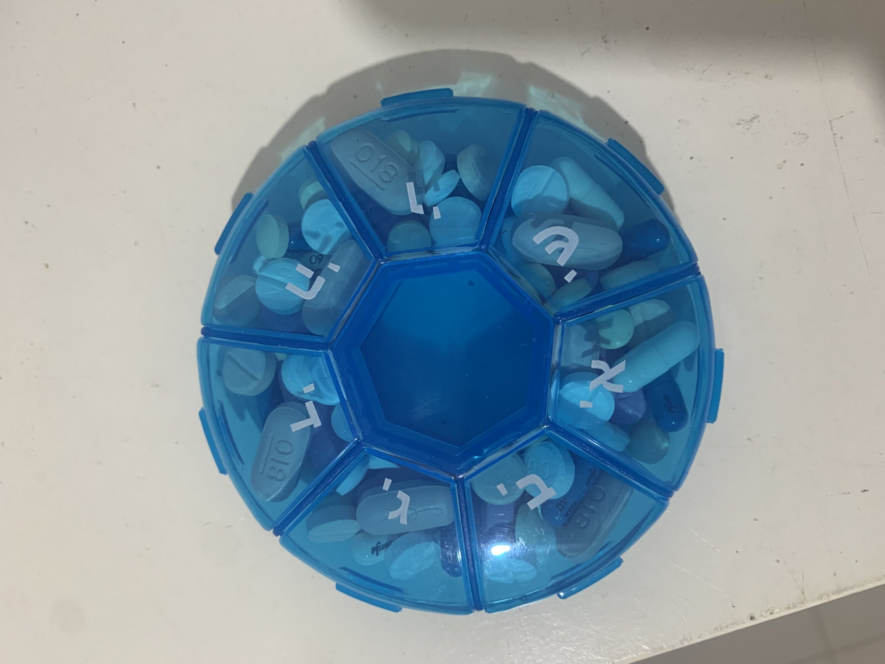

# Organizing suites & runs

*A suite is how test cases get grouped for reuse - by feature, by release, by regression depth. A run is one specific execution of a suite against one specific build. Confusing the two loses history.*

> "We have 200 test cases" answers almost nothing on its own. Two much more useful questions sit right
> behind it: how are those 200 cases grouped so a specific 20 of them can be pulled out for a fast smoke
> check before a hotfix, and which of them were actually executed - and with what result - against last
> Tuesday's build versus this morning's. The first question is about suites. The second is about runs. A
> test management tool exists to keep both answerable at any moment, for any build, without anyone
> searching their memory.

> **In real life**
>
> A tailor keeps a pattern library - shelves of reusable garment patterns, organized by type: dress
> shirts in one section, trousers in another, each pattern cut once and used over and over. A pattern
> itself is not a garment; it's a reusable template a garment gets made FROM. A specific client's fitting
> appointment on a specific Tuesday is a different thing entirely - this client, these exact measurements,
> this specific finished garment, checked and recorded on that one date. The tailor reuses the SAME shirt
> pattern for every client who wants that style, but each fitting is its own one-time event with its own
> result. Lose that distinction - treat the pattern itself as if it were the fitting, or overwrite the
> pattern every time a client's measurements come in - and the tailor can no longer tell what fits whom, or
> when it was last checked.

**suites and runs**: A suite groups related, reusable test cases together for a shared purpose - by feature area, by release scope, or by depth (a fast smoke suite versus a full regression suite). A run is one specific, dated execution of some or all of a suite's cases against one specific build or environment, recording each case's actual pass/fail/blocked result for that execution only. The same suite gets reused across many runs over a project's life; each run's results stay intact as its own historical record rather than overwriting the last one.

## Grouping cases into suites that actually get used

A suite's value depends entirely on being organized around a real decision someone needs to make, not
just "however the cases happened to get written."

- **By feature area** — `Checkout`, `Search`, `Account settings` — lets a team run exactly the cases
  relevant to a change, instead of everything.
- **By release scope** — a `Release 4.2 acceptance` suite pulls specific cases relevant to that release's
  actual changes, distinct from the full standing regression suite.
- **By depth** — a small `Smoke` suite (the handful of cases that must pass for a build to be worth
  testing further) versus a much larger `Full regression` suite - different moments call for a different
  suite, not one undifferentiated pile run in full every time.

A suite with hundreds of flat, ungrouped cases forces every run to be all-or-nothing. A suite broken into
purposeful sub-suites lets a team run five minutes of smoke checks after every commit and reserve the
full regression suite for release night.

## Recording a run without losing last time's history

A run is not a report generated after the fact - it's the actual record of one execution: this exact
suite (or a chosen subset), against this exact build, on this date, with each case marked Pass, Fail, or
Blocked as it's checked. The critical property a real test management tool protects is that running the
same suite again against build 4.2.2 does not erase what happened against build 4.2.1 - both runs stay
comparable, side by side, as separate historical records of the same reusable cases.

> **Tip**
>
> When a suite is genuinely too large to run in full before every commit, don't split cases arbitrarily -
> split by how expensive a false negative is at each moment. A five-minute smoke suite exists to answer "is
> this build worth testing further at all," and belongs on every commit; a multi-hour full regression suite
> answers a much bigger question and belongs at release boundaries.

> **Common mistake**
>
> Treating a suite's cases as disposable once a run finishes - deleting or drastically rewriting a case
> right after its run instead of keeping it as a stable, reusable definition. The entire point of separating
> suite (the reusable definition) from run (one execution's result) is that the SAME case gets executed
> again next release; a case rewritten from scratch each time can't be compared to its own past results, and
> a chronically-changing "same" case's flaky-looking history might just be a different case each time
> wearing the same name.


*Weekly medicine box — Yochi Tais, Wikimedia Commons, CC BY-SA 4.0. [Source](https://commons.wikimedia.org/wiki/File:Heptagonal_objects_A_weekly_medicine_box_846A60E4-A96F-4D2C-B010-FDB950E1DA4A.jpg)*
- **One labeled compartment — one suite** — Everything inside this single compartment shares one grouping label - the same way a suite groups related cases under one purposeful name, not an arbitrary split.
- **The shared central hub** — One structure every compartment attaches to - the project-level case repository every suite is carved out of, distinct from any single suite's own contents.
- **Several different pills sharing one compartment** — A suite's cases don't need to be identical to belong together - only related by the suite's own grouping rule, the same way different pill types share one day's compartment.
- **Opening just this one compartment today** — Using ONE compartment's contents right now is the run - a specific, one-time action pulled from reusable, standing contents, not a rewrite of the organizer itself.

**A case's life across suites and runs**

1. **A case is written once** — A reusable, versioned definition - steps, expected result - not tied to any single execution.
2. **It's grouped into a purposeful suite** — By feature, by release scope, or by depth (smoke vs full regression) - a real decision, not an arbitrary bucket.
3. **A run executes some or all of that suite** — Against one specific build, on one specific date, recording Pass/Fail/Blocked per case for THIS execution only.
4. **The next run reuses the same cases** — Build 4.2.2's run executes the identical case definitions again - comparable, side-by-side history, not an overwrite.
5. **History across runs answers the real question** — Not just 'did it pass' but 'did it pass the LAST three times,' or 'when did this specific case start failing.'

Turning "which suite passed against which build" into code is really just picking the most recent run
tied to a suite and scoring its results against that suite's case list.

*Run it - a suite/run coverage calculator (Python)*

```python
suites = {
    "Checkout - Regression": ["TC-1", "TC-2", "TC-3"],
    "Search - Smoke": ["TC-10", "TC-11"],
}

runs = [
    {"run_id": "RUN-1", "suite": "Checkout - Regression", "build": "4.2.1", "results": {"TC-1": "Pass", "TC-2": "Pass", "TC-3": "Fail"}},
    {"run_id": "RUN-2", "suite": "Checkout - Regression", "build": "4.2.2", "results": {"TC-1": "Pass", "TC-2": "Pass", "TC-3": "Pass"}},
    {"run_id": "RUN-3", "suite": "Search - Smoke", "build": "4.2.2", "results": {"TC-10": "Pass", "TC-11": "Blocked"}},
]

def latest_run_for_suite(suite_name, runs):
    matching = [r for r in runs if r["suite"] == suite_name]
    return matching[-1] if matching else None

def suite_pass_rate(suite_name, suites, runs):
    run = latest_run_for_suite(suite_name, runs)
    if run is None:
        return None
    cases = suites[suite_name]
    passed = sum(1 for c in cases if run["results"].get(c) == "Pass")
    return round(100 * passed / len(cases))

for suite_name in suites:
    run = latest_run_for_suite(suite_name, runs)
    rate = suite_pass_rate(suite_name, suites, runs)
    print(f"{suite_name}: latest {run['run_id']} ({run['build']}) -> {rate}% pass")

assert suite_pass_rate("Checkout - Regression", suites, runs) == 100
assert suite_pass_rate("Search - Smoke", suites, runs) == 50
print("RESULT=PASS")

# Checkout - Regression: latest RUN-2 (4.2.2) -> 100% pass
# Search - Smoke: latest RUN-3 (4.2.2) -> 50% pass
# RESULT=PASS
```

*Run it - a suite/run coverage calculator (Java)*

```java
import java.util.*;

public class Main {
    record Run(String runId, String suite, String build, Map<String, String> results) {}

    public static void main(String[] args) {
        Map<String, List<String>> suites = new LinkedHashMap<>();
        suites.put("Checkout - Regression", List.of("TC-1", "TC-2", "TC-3"));
        suites.put("Search - Smoke", List.of("TC-10", "TC-11"));

        List<Run> runs = new ArrayList<>();
        runs.add(new Run("RUN-1", "Checkout - Regression", "4.2.1", Map.of("TC-1", "Pass", "TC-2", "Pass", "TC-3", "Fail")));
        runs.add(new Run("RUN-2", "Checkout - Regression", "4.2.2", Map.of("TC-1", "Pass", "TC-2", "Pass", "TC-3", "Pass")));
        runs.add(new Run("RUN-3", "Search - Smoke", "4.2.2", Map.of("TC-10", "Pass", "TC-11", "Blocked")));

        for (String suiteName : suites.keySet()) {
            Run run = latestRunForSuite(suiteName, runs);
            Integer rate = suitePassRate(suiteName, suites, runs);
            System.out.println(suiteName + ": latest " + run.runId() + " (" + run.build() + ") -> " + rate + "% pass");
        }

        if (!Integer.valueOf(100).equals(suitePassRate("Checkout - Regression", suites, runs))) throw new AssertionError("bad rate");
        if (!Integer.valueOf(50).equals(suitePassRate("Search - Smoke", suites, runs))) throw new AssertionError("bad rate");
        System.out.println("RESULT=PASS");
    }

    static Run latestRunForSuite(String suiteName, List<Run> runs) {
        Run last = null;
        for (Run r : runs) if (r.suite().equals(suiteName)) last = r;
        return last;
    }

    static Integer suitePassRate(String suiteName, Map<String, List<String>> suites, List<Run> runs) {
        Run run = latestRunForSuite(suiteName, runs);
        if (run == null) return null;
        List<String> cases = suites.get(suiteName);
        long passed = cases.stream().filter(c -> "Pass".equals(run.results().get(c))).count();
        return Math.round(100.0f * passed / cases.size());
    }
}

/* Checkout - Regression: latest RUN-2 (4.2.2) -> 100% pass
   Search - Smoke: latest RUN-3 (4.2.2) -> 50% pass
   RESULT=PASS */
```

### Your first time: Your mission: run the same suite twice and compare history

- [ ] Write or reuse five test cases for a real (or practice) feature — Group them into one named suite - a real domain name, not 'Suite 1.'
- [ ] Execute all five as 'build 1' and record real Pass/Fail/Blocked results — This is your first run - date it and keep it.
- [ ] Execute the SAME five cases again as 'build 2,' changing at least one result — A pass becoming a fail, or vice versa - don't overwrite the first run's record.
- [ ] Answer, by hand, one case's full history across both runs — Confirm you can state its build-1 result and its build-2 result separately, not just 'its current status.'
- [ ] Run the Python playground with your own suites/runs data — Confirm the coverage calculator reports the LATEST run's pass rate for each suite correctly.

- **A suite has grown to hundreds of flat cases nobody wants to run before every small change.**
  Split it by depth - carve out a small, fast smoke suite for frequent runs, and reserve the full suite for release boundaries, rather than running everything every time or nothing at all.
- **The same test case seems to get rewritten slightly differently every release instead of reused.**
  That defeats the entire point of separating case from run - check whether the habit (or the tool) is creating a fresh copy each time instead of executing the SAME case definition again in a new run.
- **Nobody can say whether a specific case passed in the last two releases, only 'its current status.'**
  That's a sign runs aren't being kept as separate historical records - each run needs to persist independently, not overwrite the previous one's results in place.
- **A run shows several Blocked results and nobody follows up.**
  Blocked isn't Pass or Fail - it means the case couldn't even be attempted. Treat it with Fail-level urgency; it represents unverified, not confirmed-working, coverage.

### Where to check

- **A suite's own hierarchy/organization view** — the fast way to tell whether cases are grouped by a real, purposeful rule or just dumped in one flat list.
- **A single case's run history across multiple builds** — shows whether it's a stable case or a newly, genuinely flaky one, which a single run alone can't reveal.
- **The most recent run per suite** — the direct source for "is this suite currently passing," rather than an average across every run that's ever existed.
- [[test-management-and-reporting/test-management-tools/linking-bugs-to-cases]] for what happens next once a specific run records a Fail against a specific case.

### Worked example: a smoke suite catching a regression before the full suite even runs

1. A five-case `Checkout - Smoke` suite is configured to run automatically after every merge to the
   main branch - deliberately small, chosen for speed over completeness.
2. Build `4.2.2`'s smoke run shows `TC-2` (a gift card redemption case) failing, where it passed cleanly
   in build `4.2.1`'s equivalent run just a day earlier.
3. Because both runs' results are kept as separate records tied to the same reused case, the regression
   is immediately visible as a change between two specific, comparable executions - not just "a case
   currently shows red."
4. The much larger `Checkout - Full Regression` suite hasn't even been triggered yet - the smoke suite
   did its job, catching the regression cheaply before a much more expensive full run would have.
5. The fix ships, a new smoke run against build `4.2.3` shows `TC-2` passing again, and all three runs'
   results remain intact side by side as the case's ongoing history.

**Quiz.** A team's 'test suite' is a single spreadsheet tab where each case's row gets its Pass/Fail cell overwritten with the latest result every release. What's the most accurate assessment?

- [ ] This is equivalent to proper suite/run organization, since the same information exists at any given moment
- [x] This is missing the RUN concept entirely - overwriting each case's result in place destroys the release-over-release history that makes a real suite/run structure useful, and 'is this case flaky' becomes unanswerable
- [ ] This is fine as long as the suite's cases are well-written
- [ ] This only matters if the cases are also poorly organized into sub-suites

*This note's central distinction is that a suite (the reusable case definitions) and a run (one execution's specific results) must be kept as separate, persisted records specifically so history survives across releases. Overwriting a result in place every release is exactly the failure this note's tip and mistake callouts warn against - it makes comparing build-over-build results, or spotting a newly flaky case, impossible. Option one wrongly treats 'the current snapshot looks complete' as equivalent to preserving comparable history over time. Option three is a distractor - well-written cases don't fix a structurally missing run history. Option four conflates a separate problem (sub-suite organization) with this one; the spreadsheet's core failure exists independent of how well its single suite is internally organized.*

- **Suite** — A named group of related, reusable test cases - organized by feature, release scope, or depth (smoke vs full regression), not an arbitrary bucket.
- **Run** — One specific, dated execution of some or all of a suite's cases against one specific build, recording each case's actual result for that execution only.
- **Why the same case gets reused, not rewritten** — Reusing the identical case definition across many runs is what makes build-over-build results comparable - rewriting it each time breaks that comparison and can hide a genuinely flaky case.
- **Smoke suite vs full regression suite** — A small, fast suite answering 'is this build worth testing further,' run frequently - versus a much larger suite run at release boundaries; different moments call for a different suite.
- **Blocked vs Fail** — Blocked means the case couldn't even be attempted (a broken precondition, an environment issue) - deserves Fail-level urgency, since it represents unverified rather than confirmed-working coverage.

### Challenge

Take five test cases for a feature you know well. Organize them into one named suite with a real
rationale (not "Suite 1"). Simulate two runs: execute all five against "build 1," record results, then
execute the SAME five again against "build 2" with at least one result changed. Write, by hand, one
case's full two-run history. Then open the Python playground above, replace the sample suites/runs with
your own, and confirm the calculator reports each suite's latest pass rate correctly - not an average
across every run that ever happened.

### Ask the community

> My team's test cases are currently organized as `[describe your setup - one flat suite, a spreadsheet, several ad-hoc folders]`, and the specific problem I keep hitting is `[e.g. can't tell if a case is flaky / running everything takes too long before every small change / no separate record per build]`. Is a smaller sub-suite split the right first fix, or is the deeper issue how runs are being recorded?

Naming the SPECIFIC pain point (not just "how should I organize my suites?") gets far more useful
answers - sometimes the real fix is recording runs as separate records before any suite reorganization
is worth the effort.

- [Ministry of Testing — test case management lesson](https://www.ministryoftesting.com/dojo/lessons/test-case-management)
- [Guru99 — test management tools overview](https://www.guru99.com/test-management-tools.html)
- [TestRail's Test Runs and Results — TestRail](https://www.youtube.com/watch?v=7Ee954Bst4M)

🎬 [TestRail's Test Runs and Results — TestRail](https://www.youtube.com/watch?v=7Ee954Bst4M) (6 min)

- A suite groups reusable cases by a real rule - feature area, release scope, or depth - not an arbitrary bucket.
- A run is one dated execution of a suite against one specific build; its results must persist as their own record, not overwrite the last run's.
- The same case gets reused across many runs - rewriting it fresh each time destroys the comparable, build-over-build history that makes flakiness and regressions visible.
- Split large suites by depth (smoke vs full regression) so frequent runs stay fast and expensive full runs happen at real release boundaries.
- Blocked results deserve Fail-level urgency - they represent unverified coverage, not confirmed-working coverage.


## Related notes

- [[Notes/test-management-and-reporting/test-management-tools/testrail-xray-zephyr|TestRail / Xray / Zephyr]]
- [[Notes/test-management-and-reporting/test-management-tools/linking-bugs-to-cases|Linking bugs to cases]]
- [[Notes/test-artifacts/traceability/traceability-coverage|Coverage]]


---
_Source: `packages/curriculum/content/notes/test-management-and-reporting/test-management-tools/organizing-suites-and-runs.mdx`_
