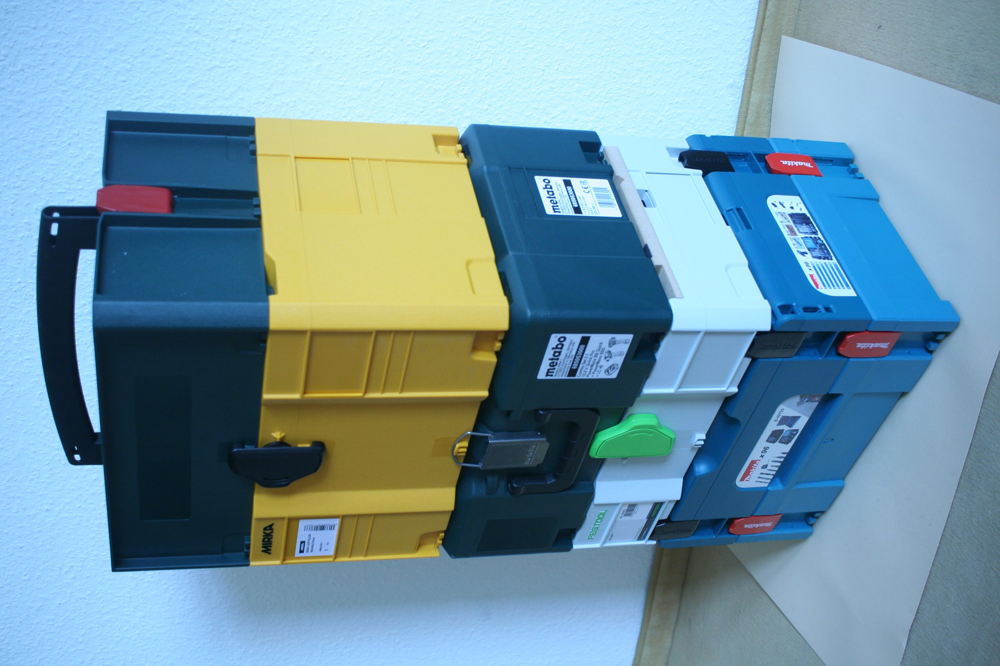

# TestRail / Xray / Zephyr

*Three real test management tools, two different shapes: TestRail runs as its own standalone system; Xray and Zephyr are Jira-native, living inside the tracker's issues instead of alongside it.*

> An earlier note in this corpus introduced test management tools as a category - software that organizes
> test cases into suites and runs, distinct from a bug tracker. TestRail, Xray, and Zephyr are three real
> tools a tester will actually meet doing that job, and they aren't interchangeable in how they attach to
> the rest of a team's workflow. Two of them live inside Jira as native issue types; one is its own
> separate system a team logs into on its own. That single difference in shape changes more about daily
> use than any individual feature list does.

> **In real life**
>
> Picture a stack of power-tool storage boxes from different brands, each one plastic, each one meant to
> hold and transport tools. Several of them share the same clip design on their corners - snap one box's
> corner clip into the next brand's box, and they lock together and stack as one unit, even though the
> boxes themselves come from different manufacturers. One box in the stack, though, uses its own separate
> clip design entirely - a small padlock-shaped latch nothing else in the stack connects to. It's a
> perfectly good box. It just doesn't snap into the others; it stands alone, carried and organized on its
> own terms. A Jira-native test management tool is a box built around a shared clip - it snaps directly
> into the tracker's own issue structure. A standalone tool is the box with its own latch - equally capable,
> deliberately not built to snap into anything else.

**test management tool shape**: TestRail, Xray, and Zephyr (Zephyr Scale and Zephyr Squad are its two current variants) are three widely used, real test management tools, differing chiefly in how they attach to a team's tracker. TestRail is standalone - its own separate web application with its own login, that a team optionally connects to a tracker via integration, rather than being built from tracker issues themselves. Xray and Zephyr are Jira-native - they run as an add-on/app installed into an existing Jira instance, modeling test cases, test plans, and test executions as Jira issue types living in the same project, screens, and permission model as every other issue.

## Standalone versus Jira-native: what actually changes day to day

- **Where you log in.** TestRail is its own URL, its own user accounts, its own permission model -
  separate from Jira even when the two are integrated. Xray and Zephyr open inside Jira itself; a tester
  never leaves the tracker to record a test result.
- **What a test case actually is, underneath.** In Xray and Zephyr, a test case is a Jira issue - it can
  be linked, JQL-searched, and reported on using the exact same query tooling this chapter's other note
  covers. In TestRail, a test case is a TestRail-native object; connecting it to a Jira bug is an explicit
  integration step, not an inherent property of both living in the same system.
- **Licensing model shape, not price.** TestRail is licensed as its own standalone product with its own
  subscription. Xray and Zephyr are both sold as Jira marketplace apps/add-ons, priced per the Jira
  instance they're installed into - a genuinely different purchasing and administration path, independent
  of whatever either currently costs.
- **Setup dependency.** A Jira-native tool cannot exist without a working Jira instance underneath it
  first. A standalone tool has no such dependency - a team can run TestRail with no tracker at all, or
  connect it to a tracker that isn't Jira.

> **Tip**
>
> Before choosing (or judging a team's existing choice), ask one question: does this team's daily workflow
> already center on Jira for everything else? If yes, a Jira-native tool (Xray or Zephyr) keeps test
> execution one click from a bug, without a second login. If the team runs a different tracker, or wants a
> test management system independent of whichever tracker it happens to use this year, a standalone tool
> like TestRail is built for exactly that independence.

> **Common mistake**
>
> Assuming "Jira-native" automatically means "better integrated, therefore always the right choice." A
> standalone tool's independence from Jira is a deliberate tradeoff, not a missing feature - it can outlive
> a tracker migration, serve teams on different trackers from one shared test case library, and isn't
> constrained by Jira's own performance or permission model at very large scale. Neither shape is
> categorically superior; they solve for different constraints.


*Systainer, Makpac, Festool, Metabo, Mirka toolbox stack — Paul Sladen, Wikimedia Commons, CC0. [Source](https://commons.wikimedia.org/wiki/File:Systainer-classic-makpac-festool-sys-mft-metaloc-t-loc-toolbox.jpg)*
- **A box with its own fixed handle and clip** — This box carries and stacks on its own terms, with hardware nothing else in the photo shares - the standalone shape: complete by itself, not dependent on snapping into another system.
- **A dark box with its own separate silver latch** — A padlock-style latch this specific box alone uses - a deliberately self-contained design, the same way a standalone test management tool doesn't rely on any tracker's structure underneath it.
- **A different brand, a different connector style entirely** — Not every box in a real product lineup shares one shared standard - evaluate what a specific tool actually connects to, rather than assuming a shared category means shared compatibility.
- **Two different-branded boxes sharing one bright red clip** — Two separate products, snapping into the same shared connector - the Jira-native shape: distinct tools (Xray, Zephyr), both built to click directly into the same underlying Jira structure.

**Choosing a shape, not just a feature list**

1. **Start from the team's actual tracker** — Already living in Jira daily, or using something else, or nothing formal yet?
2. **Jira-heavy team → consider Jira-native (Xray or Zephyr)** — Test cases become Jira issues - one login, one JQL syntax, one permission model for everything.
3. **Tracker-independent or multi-tracker team → consider standalone (TestRail)** — Its own system, its own login, connected to whichever tracker via integration rather than built from its issues.
4. **Within Jira-native: Xray vs Zephyr specifics** — Both attach to Jira the same way; the deeper choice comes down to specific feature fit (like native Gherkin/BDD authoring) rather than shape.
5. **Re-check the shape decision at major tracker changes** — A tracker migration hits a Jira-native tool directly; a standalone tool is comparatively insulated from it.

Comparing three tools by shape is really just filtering a small feature table. Here's that comparison as
code - the same kind of table a team actually draws on a whiteboard before picking one.

*Run it - a tool-feature comparator (Python)*

```python
tools = {
    "TestRail": {"standalone": True, "jira_native": False, "traceability": True, "gherkin_support": False},
    "Xray": {"standalone": False, "jira_native": True, "traceability": True, "gherkin_support": True},
    "Zephyr": {"standalone": False, "jira_native": True, "traceability": True, "gherkin_support": False},
}

def tools_matching(tools, required):
    matches = []
    for name, features in tools.items():
        if all(features.get(k) == v for k, v in required.items()):
            matches.append(name)
    return sorted(matches)

required = {"jira_native": True, "gherkin_support": True}
result = tools_matching(tools, required)
print("Required:", required)
print("Matches:", result)
assert result == ["Xray"], "unexpected comparator result"
print("RESULT=PASS")

# Required: {'jira_native': True, 'gherkin_support': True}
# Matches: ['Xray']
# RESULT=PASS
```

*Run it - a tool-feature comparator (Java)*

```java
import java.util.*;

public class Main {
    public static void main(String[] args) {
        Map<String, Map<String, Boolean>> tools = new LinkedHashMap<>();
        tools.put("TestRail", features(true, false, true, false));
        tools.put("Xray", features(false, true, true, true));
        tools.put("Zephyr", features(false, true, true, false));

        Map<String, Boolean> required = new LinkedHashMap<>();
        required.put("jira_native", true);
        required.put("gherkin_support", true);

        List<String> result = toolsMatching(tools, required);
        System.out.println("Required: " + required);
        System.out.println("Matches: " + result);
        if (!result.equals(List.of("Xray"))) throw new AssertionError("unexpected comparator result");
        System.out.println("RESULT=PASS");
    }

    static Map<String, Boolean> features(boolean standalone, boolean jiraNative, boolean traceability, boolean gherkin) {
        Map<String, Boolean> f = new LinkedHashMap<>();
        f.put("standalone", standalone); f.put("jira_native", jiraNative);
        f.put("traceability", traceability); f.put("gherkin_support", gherkin);
        return f;
    }

    static List<String> toolsMatching(Map<String, Map<String, Boolean>> tools, Map<String, Boolean> required) {
        List<String> matches = new ArrayList<>();
        for (var entry : tools.entrySet()) {
            boolean all = true;
            for (var req : required.entrySet()) {
                if (!Objects.equals(entry.getValue().get(req.getKey()), req.getValue())) { all = false; break; }
            }
            if (all) matches.add(entry.getKey());
        }
        Collections.sort(matches);
        return matches;
    }
}

/* Required: {jira_native=true, gherkin_support=true}
   Matches: [Xray]
   RESULT=PASS */
```

### Your first time: Your mission: map one real tool's shape before touching its features

- [ ] Identify which of the three (or another) tool a real or practice team actually uses — If none, sign up for any one free trial - TestRail, Xray, or Zephyr all offer one.
- [ ] Answer 'standalone or Jira-native' for it directly — Does it have its own separate login, or does it live inside an existing Jira project as issue types?
- [ ] Find one test case and check what it actually is underneath — A Jira issue you could JQL-search, or a native object in a separate system integrated with the tracker?
- [ ] Trace one integration point — How does a failed test case actually reach a filed bug in this specific tool - automatically, via a plugin, or a manual copy-paste step?
- [ ] Run the Python playground with your own required-features dict — Confirm the comparator returns exactly the tool(s) matching every condition you set, not a partial match.

- **A 'Jira-native' tool's test cases don't show up in a normal Jira board or JQL search.**
  Check whether that issue type is actually included in the board/filter's configured issue types - Test or Test Execution issue types are often excluded from a default board view by design, not by mistake.
- **A standalone tool's test results seem to update a tracker's bug status unpredictably.**
  That's the integration layer running, not magic - check its specific sync rules (which statuses trigger which tracker actions) rather than assuming a fixed, universal behavior.
- **A team switched trackers and its test management setup broke.**
  This hits a Jira-native tool directly, since it's built from that specific Jira instance's issues - a standalone tool, connected only via integration, is more likely to survive by re-pointing the integration instead of rebuilding everything.
- **Two people describe 'Zephyr' completely differently.**
  Zephyr ships as more than one product (Zephyr Scale and Zephyr Squad, aimed at different team sizes) - confirm which specific variant is meant before assuming a shared feature set.

### Where to check

- **The tool's own login page** — the fastest standalone-vs-Jira-native tell: a separate URL and account system, or a screen living inside an existing Jira instance.
- **A single test case's issue-type field (Jira-native tools)** — confirms it's a real Jira issue, filterable by the same JQL this chapter's other note covers.
- **The marketplace/app listing (Jira-native tools) or the vendor's own site (standalone tools)** — the licensing and installation model, without assuming today's price holds tomorrow.
- [[test-management-and-reporting/test-management-tools/jira-and-boards-deeper]] for the JQL and hierarchy concepts that apply directly once a test case IS a Jira issue.

### Worked example: the shape decision driving a real tool choice

1. A team already lives in Jira for every bug, sprint, and roadmap item - daily, for years.
2. Evaluating TestRail, they realize every test result would require a second login and a maintained
   integration just to reach the bugs already filed in Jira.
3. Evaluating Xray, a test case is created as a Jira issue directly - linked to a Story with a native
   Jira link, searchable in the same JQL the rest of the team already writes.
4. The team picks Xray specifically for the shape fit, not a feature checklist win - the deciding
   question was "where does our team already spend its day," not "which tool has more checkboxes."
5. A different team running its own ticketing system entirely, with no Jira anywhere, reaches the
   opposite conclusion for the same reason: TestRail's independence is the fit, not a compromise.

**Quiz.** A team wants a single test case library shared across two different projects that use two entirely different issue trackers. Which shape best fits that constraint?

- [ ] A Jira-native tool, since native issues are always more reliable
- [x] A standalone tool, since it isn't built from either tracker's issues and can integrate with both independently
- [ ] Either shape works identically for this case
- [ ] Neither - this configuration isn't possible with any test management tool

*A standalone tool's whole value in this note is its independence from any one tracker - it's a genuinely better fit when a single case library needs to serve teams on different trackers. A Jira-native tool (option 1) is built FROM one specific Jira instance's issues, which doesn't transfer to a second, unrelated tracker. Option 3 ignores the real structural difference this note is built around. Option 4 is simply false - this is a common, well-supported use case for standalone tools specifically.*

- **Standalone (TestRail)** — Its own separate application, login, and object model - connects to a tracker via integration rather than being built from that tracker's issues.
- **Jira-native (Xray, Zephyr)** — Runs as a Jira app/add-on - test cases ARE Jira issues, using the same screens, permissions, and JQL as everything else in that Jira instance.
- **The real decision axis** — Not 'which has more features' but 'where does this team already live day to day' - Jira-heavy teams fit Jira-native tools; tracker-independent or multi-tracker teams fit standalone tools.
- **Licensing model shape** — TestRail is a standalone product with its own subscription; Xray and Zephyr are sold as Jira marketplace apps, priced per the Jira instance - a structurally different purchase path regardless of current pricing.
- **Zephyr isn't one product** — Zephyr Scale and Zephyr Squad are two current variants aimed at different team sizes - confirm which one is meant before assuming a shared feature set.

### Challenge

Pick a real or practice tracker your team (or you personally) already uses daily. Argue, in writing, which
shape - standalone or Jira-native - fits it better, using this note's decision axis rather than a raw
feature count. Then open the Python playground above, change the `required` dict to match a real
constraint you care about (e.g. `traceability: True, standalone: True`), and confirm the comparator
returns the tool(s) that actually satisfy it.

### Ask the community

> My team currently uses `[tracker name]` and is evaluating `[TestRail / Xray / Zephyr / another tool]` for test management. The specific constraint driving this is `[e.g. two teams on different trackers need one shared case library / we want test cases to be native Jira issues]`. Given that constraint specifically, does the standalone-vs-Jira-native shape point clearly one way?

Naming the SPECIFIC constraint (not just "which tool is best?") gets much more useful answers - the
standalone-vs-Jira-native shape usually settles the question before any individual feature comparison
matters.

- [Xray — official site (Jira-native test management)](https://www.getxray.app/)
- [SmartBear — Zephyr Scale overview (Jira-native test management)](https://smartbear.com/product/zephyr-scale/overview/)
- [Software Testing Help — TestRail tutorial (standalone test management)](https://www.softwaretestinghelp.com/testrail-tutorial/)
- [Introduction to Jira Xray — Xray Tutorials](https://www.youtube.com/watch?v=QjPf9JNuL38)

🎬 [Tutorial #1 | Introduction to Jira Xray | Xray in Jira | Xray Tutorials](https://www.youtube.com/watch?v=QjPf9JNuL38) (8 min)

- TestRail is standalone - its own system, its own login, connected to a tracker via integration rather than built from its issues.
- Xray and Zephyr are Jira-native - test cases are real Jira issues, sharing Jira's own screens, permissions, and JQL.
- The real choice is shape-first: where does the team already live day to day, not a raw feature-count comparison.
- Licensing model shape differs structurally (standalone product vs Jira marketplace app) independent of whatever either currently costs.
- Neither shape is categorically better - a Jira-native tool fits a Jira-centered team; a standalone tool fits tracker independence or a multi-tracker team.


## Related notes

- [[Notes/test-management-and-reporting/test-management-tools/jira-and-boards-deeper|JIRA & boards, deeper]]
- [[Notes/test-management-and-reporting/test-management-tools/organizing-suites-and-runs|Organizing suites & runs]]
- [[Notes/defect-management/tools/test-management-tools|Test management tools]]


---
_Source: `packages/curriculum/content/notes/test-management-and-reporting/test-management-tools/testrail-xray-zephyr.mdx`_
