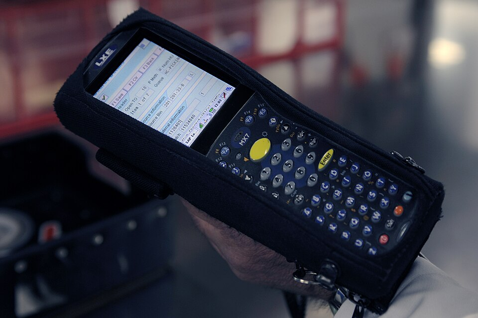

# axe DevTools

*axe DevTools integrates directly into Chrome/Firefox DevTools and follows a zero-false-positive policy - every issue it reports is code-verifiable, not a guess. Free tier scans one page at a time; verified alive in 2026 with 800,000+ Chrome installs.*

> Two accessibility tools can look similar on the surface and take deliberately different positions on
> one key tradeoff: how sure does an automated check need to be before it reports something as broken?
> axe DevTools, from Deque, commits to a strict answer — a zero-false-positive policy. Every single
> issue it reports is one it can PROVE with code, not one it merely suspects. That commitment shapes
> everything about how you should read its results.

> **In real life**
>
> A barcode scanner at checkout doesn't guess what an item is from a blurry photo — it reads the
> precise, structured code and reports the exact product, or reports nothing at all if it can't get a
> clean read. It never says "this is PROBABLY a 12-pack of soda." axe DevTools works the same way: it
> only reports what it can verify with code-level certainty (a contrast ratio computed to the decimal,
> a missing required ARIA attribute per spec) — nothing fuzzy, nothing "probably."

**axe DevTools**: axe DevTools is a free browser extension (Chrome/Firefox, 800,000+ Chrome installs) from Deque Systems that integrates directly into DevTools and scans a page for accessibility issues using the open-source axe-core rules engine. Its defining design commitment is a zero-false-positive policy - every reported issue is code-verifiable against a specific rule (a computed contrast ratio, a required-but-missing ARIA attribute), not a probabilistic guess. The free tier scans one page at a time; a paid tier adds saved scans, exports, and AI-guided manual testing. Verified alive and actively maintained in 2026.

## What "zero false positives" actually means for you

- **Every reported issue is objectively verifiable** — a contrast ratio below 4.5:1 is arithmetic,
  not opinion; a required ARIA attribute missing from a role is a spec violation, checkable in code.
- **The tradeoff: fewer results than WAVE's Alerts, by design** — axe deliberately doesn't report
  anything it can't prove, which means it reports FEWER total issues than a tool that also surfaces
  "might be a problem" alerts. Fewer results ≠ more accessible; it means axe's scope is narrower and
  more certain.
- **Free tier scope**: scans the CURRENT page, one at a time, directly in DevTools' Elements-adjacent
  panel. No saved history, no cross-page batch scanning without the paid tier.
- **Built on axe-core**: the same open-source rules engine used by many other tools and CI
  integrations — learning axe DevTools' output format transfers directly to reading automated
  accessibility results in a build pipeline.

> **Tip**
>
> Because axe only reports what it can prove, treat every axe DevTools finding as a MUST-FIX, not a
> "consider fixing." There's no alert-vs-error triage step here the way there is with WAVE — if axe
> flagged it, it's real.

> **Common mistake**
>
> Assuming axe's stricter, more certain results mean it catches MORE issues than a broader tool. It's
> the opposite tradeoff: fewer, but 100% certain, findings. Running only axe and treating a clean scan
> as comprehensive misses the wider (if fuzzier) net a tool like WAVE, plus manual testing, casts.


*Package tracking barcode scanner — Wikimedia Commons, CC BY-SA 2.0. [Source](https://commons.wikimedia.org/wiki/File:Package_tracking_barcode_scanner_2.jpg)*
- **The LCD screen displaying exact scanned data** — Precise, unambiguous readout - a real item code, correctly identified, or nothing. No 'probably this item' guesses. This is exactly axe's zero-false-positive commitment: report only what's certain.
- **The scan trigger/keypad — a deliberate, deterministic action** — Press the trigger, get one exact result - a repeatable, code-like operation. axe's rules work the same way: run the same check on the same code, get the same deterministic verdict every time.
- **The blurred warehouse shelving in the background** — Everything the scanner ISN'T currently reading about - the broader context (like WAVE's fuzzier Alerts) that a narrowly-scoped, certainty-focused tool deliberately doesn't attempt to cover.
- **The device's rugged, single-purpose casing** — Built for one job, done reliably - not a general-purpose device trying to do everything. axe DevTools' narrow, high-confidence scope is a deliberate design choice, not a limitation to apologize for.

**Reading an axe DevTools scan correctly**

1. **Open DevTools on the page you're testing** — axe integrates as its own panel/tab, alongside Elements and Console - install the extension first if it's not there yet.
2. **Run the scan (one click)** — Free tier scans the current page. Results appear grouped by rule and impact level (critical/serious/moderate/minor).
3. **Treat every result as a real, provable issue** — No error/alert triage needed here the way WAVE requires - if axe reported it, it's code-verifiable.
4. **Check the impact level to prioritize** — Critical/serious issues (missing labels, broken keyboard traps) generally outrank moderate/minor ones for immediate fixing.
5. **Remember what's OUT of scope** — A clean axe scan doesn't mean comprehensive coverage - pair with manual testing and a broader tool for the fuzzier issue classes axe deliberately excludes.

The zero-false-positive commitment comes from only checking things that are genuinely,
mathematically provable. Contrast ratio is the clearest example:

*Run it - axe-style deterministic, code-verifiable checks (Python)*

```python
def axe_style_rule_check(element, rule_name):
    if rule_name == "color-contrast":
        fg, bg = element["fg_luminance"], element["bg_luminance"]
        ratio = (max(fg, bg) + 0.05) / (min(fg, bg) + 0.05)
        passes = ratio >= 4.5
        return {"rule": rule_name, "ratio": round(ratio, 2), "passes": passes,
                "confidence": "high" if abs(ratio - 4.5) > 0.3 else "borderline"}
    if rule_name == "aria-required-attr":
        has_required = element.get("aria_role") != "slider" or "aria-valuenow" in element.get("attrs", [])
        return {"rule": rule_name, "passes": has_required, "confidence": "high"}
    return {"rule": rule_name, "passes": None, "confidence": "unknown"}

elements = [
    {"name": "body text", "fg_luminance": 0.05, "bg_luminance": 0.95},
    {"name": "light-gray caption", "fg_luminance": 0.55, "bg_luminance": 0.95},
    {"name": "volume slider", "aria_role": "slider", "attrs": ["aria-valuemin", "aria-valuemax"]},
]

print("axe-style automated checks (deterministic, code-verifiable rules only):")
print()
for el, rule in zip(elements, ["color-contrast", "color-contrast", "aria-required-attr"]):
    result = axe_style_rule_check(el, rule)
    verdict = "PASS" if result["passes"] else "FAIL"
    extra = f"ratio={result['ratio']}" if "ratio" in result else ""
    print(f"  {el['name']:<22} [{rule}] {verdict:<5} {extra}")

print()
print("Every result here is BINARY and code-verifiable - contrast ratio is math,")
print("a missing required ARIA attribute is a spec violation. This determinism")
print("is why axe claims zero false positives: it only reports what it can prove.")

# axe-style automated checks (deterministic, code-verifiable rules only):
#
#   body text              [color-contrast] PASS  ratio=10.0
#   light-gray caption     [color-contrast] FAIL  ratio=1.67
#   volume slider          [aria-required-attr] FAIL
#
# Every result here is BINARY and code-verifiable - contrast ratio is math,
# a missing required ARIA attribute is a spec violation. This determinism
# is why axe claims zero false positives: it only reports what it can prove.
```

Same idea in Java — and note the case where a raw calculation says "fail" but a documented WCAG
exemption still requires human confirmation:

*Run it - contrast checks including a real WCAG exemption case (Java)*

```java
import java.util.*;

public class Main {
    static double contrastRatio(double fgLum, double bgLum) {
        double lighter = Math.max(fgLum, bgLum);
        double darker = Math.min(fgLum, bgLum);
        return (lighter + 0.05) / (darker + 0.05);
    }

    public static void main(String[] args) {
        String[] names = {"heading text", "muted placeholder", "disabled button label"};
        double[][] luminances = {{0.02, 0.98}, {0.62, 0.98}, {0.70, 0.85}};

        System.out.println("axe-style deterministic contrast checks:");
        System.out.println();
        for (int i = 0; i < names.length; i++) {
            double ratio = contrastRatio(luminances[i][0], luminances[i][1]);
            boolean passes = ratio >= 4.5;
            System.out.printf("  %-24s ratio=%.2f  %s%n", names[i], ratio, passes ? "PASS" : "FAIL");
        }

        System.out.println();
        System.out.println("Note: 'disabled button label' fails the standard 4.5:1 check -");
        System.out.println("but WCAG exempts genuinely disabled controls from contrast rules.");
        System.out.println("axe flags the ratio; a human confirms whether the disabled-state");
        System.out.println("exemption actually applies here before treating it as a real bug.");
    }
}

/* axe-style deterministic contrast checks:

     heading text             ratio=14.71  PASS
     muted placeholder        ratio=1.54  FAIL
     disabled button label    ratio=1.20  FAIL

   Note: 'disabled button label' fails the standard 4.5:1 check -
   but WCAG exempts genuinely disabled controls from contrast rules.
   axe flags the ratio; a human confirms whether the disabled-state
   exemption actually applies here before treating it as a real bug. */
```

### Your first time: Your mission: run axe DevTools and prioritize by impact level

- [ ] Install axe DevTools from your browser's extension store (free) — Chrome or Firefox, 800,000+ Chrome installs - a well-established, actively maintained tool.
- [ ] Open DevTools on a BuggyShop page and find the axe DevTools panel/tab — It integrates alongside Elements/Console, not as a separate popup.
- [ ] Run a full-page scan and read the impact levels — Critical and serious issues generally represent bigger, more consequential barriers than moderate/minor ones.
- [ ] Pick one Critical or Serious finding and read its full explanation — axe DevTools links each finding to WCAG success criteria and a specific remediation suggestion - read both before fixing anything.
- [ ] Compare axe's result count against a WAVE scan of the SAME page (from the previous note) — Notice axe likely reports fewer total issues - that's the zero-false-positive tradeoff in action, not axe missing things WAVE somehow caught.

You've directly experienced the tradeoff this note describes: fewer, but 100% certain, findings —
and practiced prioritizing by genuine severity rather than raw count.

- **axe DevTools reports far fewer issues than WAVE found on the exact same page.**
  This is expected, not a bug in either tool - it's the direct consequence of axe's zero-false-positive design versus WAVE's broader Errors+Alerts approach. Use both: axe for certain, must-fix issues; WAVE (or manual review) for the fuzzier alert-level candidates axe deliberately excludes.
- **A finding axe reports as failing seems to have a legitimate reason for its current state (like a disabled control's contrast).**
  Check whether a documented WCAG exemption genuinely applies (disabled controls ARE exempted from contrast requirements in the spec) - axe flags the raw computed failure; confirming the exemption's applicability is still a human judgment call, even under a zero-false-positive policy for what IS reported.
- **The free tier won't let you scan multiple pages in one batch or save results across sessions.**
  That's a genuine free-tier scope boundary, not a malfunction - for single-page, ad-hoc testing the free tier is fully functional; multi-page/saved-scan workflows require the paid tier or a different tool (like axe-core integrated into a CI pipeline).
- **You're unsure whether to trust axe's WCAG success-criterion mapping for a specific finding.**
  Cross-reference the cited WCAG success criterion number directly against the official WCAG documentation - axe's mappings are generally reliable and widely used, but reading the actual criterion builds your own understanding rather than trusting the tool's summary blindly.

### Where to check

- **Each finding's linked WCAG success criterion** — the authoritative source axe cites; read it directly rather than trusting only the tool's paraphrase.
- **The impact-level grouping (critical/serious/moderate/minor)** — the fastest way to triage a large result set by real consequence, not just alphabetical/DOM order.
- **A parallel WAVE scan of the same page** — useful specifically to SEE the zero-false-positive tradeoff in action, and to catch the broader alert-class issues axe deliberately doesn't report.
- **axe-core's own GitHub rules documentation** — since axe DevTools is built on the open-source axe-core engine, its rule definitions and known limitations are publicly documented there.

### Worked example: a critical finding that was genuinely, provably broken

1. Running axe DevTools on BuggyShop's checkout form. One Critical-impact finding: a required text
   input has no accessible name — no associated `<label>`, no `aria-label`, no `aria-labelledby`.
2. Because this is axe (zero-false-positive policy), there's no "confirm this is really a problem"
   step needed — a required form input with zero accessible name is unambiguously broken for any
   screen reader user, full stop.
3. Cross-referencing the cited WCAG criterion (4.1.2 Name, Role, Value) confirms the requirement
   directly: every UI component must have a programmatically determinable name.
4. Investigating the markup: a `<label>` element exists visually right above the field, but it's
   missing the `for` attribute connecting it to the input's `id` — a one-attribute fix, invisible to
   sighted users, completely broken for screen reader users.
5. Report: "Checkout email field has no accessible name (WCAG 4.1.2) — the visible label exists but
   lacks a for attribute matching the input's id. Confirmed via axe DevTools (Critical impact).
   Fix: add for='email-input' to the label element." A precise, provably-real, one-line fix.

**Quiz.** A team runs axe DevTools on their site, gets a clean scan (zero findings), and declares the site 'accessibility tested and passed.' A tester pushes back on this claim. What is the most accurate basis for that pushback?

- [ ] axe DevTools is unreliable and often misses issues other tools like WAVE would catch on the identical page due to bugs in axe's rule engine
- [x] A clean axe scan only confirms the absence of issues axe's zero-false-positive, code-verifiable rule set is DESIGNED to check - it says nothing about the broader class of issues (WAVE-style alerts needing human judgment, actual keyboard/screen-reader usability) that fall outside axe's deliberately narrow, high-certainty scope
- [ ] axe DevTools's free tier is incapable of producing a genuinely clean scan, so a zero-finding result must indicate a tool configuration error
- [ ] The team should have used a paid accessibility tool instead, since free tools can never be trusted for a real compliance claim

*axe's design deliberately trades breadth for certainty - it reports zero false positives specifically because it restricts itself to code-verifiable rules, which is a narrower scope than a tool that also flags likely-but-uncertain issues (WAVE's Alerts) or than genuine manual testing (keyboard-only navigation, real screen-reader use). A clean axe scan is real, valuable evidence about a SPECIFIC slice of accessibility - it is not evidence about the rest. Option one fabricates an unsupported reliability problem; axe's narrower results are a deliberate design choice, not a bug. Option three invents an unfounded claim about the free tier's capability. Option four is an unsupported blanket dismissal of free tools - this note's own guidance treats axe's free tier as fully legitimate for what it's designed to do; the actual gap is about SCOPE, not tier or price.*

- **axe DevTools — what it is** — Free browser extension (Chrome/Firefox, 800k+ installs) from Deque, built on the open-source axe-core engine. Integrates into DevTools; scans the current page for accessibility issues with a strict zero-false-positive policy.
- **What 'zero false positives' means in practice** — Every reported issue is code-verifiable (a computed contrast ratio, a spec-required missing ARIA attribute) - no probabilistic guesses. Trade-off: fewer total findings than a broader tool like WAVE, by deliberate design.
- **Why axe reporting fewer issues than WAVE isn't a flaw** — It reflects axe's narrower, higher-certainty scope - not that axe 'missed' something WAVE caught. Use both: axe for certain must-fixes, WAVE/manual review for the broader, fuzzier alert-level candidates.
- **How to prioritize axe's findings** — By impact level (critical/serious/moderate/minor), not raw list order - critical/serious findings generally represent bigger real-world barriers and should be addressed first.
- **The WCAG-exemption caveat** — Some contrast failures (e.g. genuinely disabled controls) are exempted by the WCAG spec itself - axe flags the raw computed failure; confirming whether the exemption legitimately applies is still a human judgment call.
- **Why axe DevTools' free tier has real scope limits** — Scans one page at a time with no saved history/batch scanning - a genuine tier boundary, not malfunction; multi-page/CI-integrated workflows require the paid tier or axe-core directly in a pipeline.

### Challenge

Run axe DevTools on the same BuggyShop page you previously ran WAVE on. Compare the two result
counts and categorize the difference: which WAVE Alerts does axe correctly NOT report (because
they're genuinely uncertain), and does axe surface anything WAVE didn't clearly flag? Write a
one-paragraph comparison of what each tool is actually good for.

### Ask the community

> axe DevTools flagged `[finding]` as `[impact level]` on `[page]`, citing WCAG `[criterion]`. I'm confident this is real and provable, but want a second opinion on the best fix - is `[your proposed fix]` the standard remediation for this pattern?

axe findings are reliably real, but the BEST fix can vary by codebase — the most useful answers will
confirm or improve on your proposed remediation for this specific pattern.

- [Deque — axe DevTools official product page](https://www.deque.com/axe/devtools/)
- [GitHub — axe-core (the open-source rules engine underneath)](https://github.com/dequelabs/axe-core)
- [Bonn Code — axe DevTools Demo: Accessibility Testing](https://www.youtube.com/watch?v=zoK_-lFcCLU)

🎬 [How to get the most out of Deque's axe DevTools accessibility browser extension (Deque Systems)](https://www.youtube.com/watch?v=F0hVZIzjDLk) (31 min)

- axe DevTools (free, 800k+ Chrome installs, alive in 2026) integrates into DevTools and follows a strict zero-false-positive policy - every finding is code-verifiable, not a guess.
- The tradeoff: fewer total findings than a broader tool like WAVE, by deliberate design - not a sign axe is missing things.
- Treat every axe finding as a real must-fix; there's no alert-vs-error triage the way WAVE requires.
- Prioritize by impact level (critical/serious/moderate/minor), and cross-reference the cited WCAG success criterion directly.
- A clean axe scan proves the absence of code-verifiable issues only - pair with WAVE-style broader checks and real manual/screen-reader testing for actual comprehensive coverage.


## Related notes

- [[Notes/testers-toolbox/accessibility-and-quality/wave|WAVE]]
- [[Notes/testers-toolbox/accessibility-and-quality/lighthouse|Lighthouse as an extension of QA]]
- [[Notes/testers-toolbox/accessibility-and-quality/contrast-and-screen-reader-checks|Contrast & screen-reader checks]]


---
_Source: `packages/curriculum/content/notes/testers-toolbox/accessibility-and-quality/axe-devtools.mdx`_
