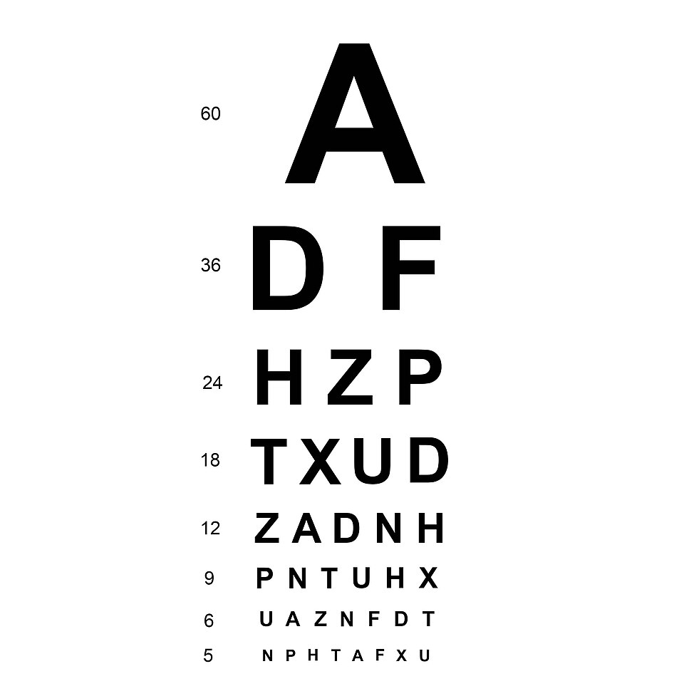

# Contrast & screen-reader checks

*WCAG requires a 4.5:1 contrast ratio for normal text and 3:1 for large text - checkable in seconds with WebAIM's free Contrast Checker or the color picker built into DevTools. Free VoiceOver (Mac) and NVDA (Windows) let you experience a page the way a screen-reader user actually does.*

> Two checks in this chapter are cheap enough that there's no excuse to skip them, and consequential
> enough that skipping them locks real people out. Contrast: is the text mathematically readable
> against its background? Screen readers: does the page actually make sense when you can't see it at
> all? Both are free to check, both take minutes, and both catch defects the earlier automated tools
> in this chapter can only partially detect on their own.

> **In real life**
>
> A Snellen eye chart doesn't ask "does this look readable to you?" — it gives an exact, standardized
> answer: can you read this specific row of letters at this specific size from this specific distance,
> yes or no. WCAG's contrast ratio does exactly the same job for color: not "does this look readable,"
> but a precise computed number (4.5:1 for normal text) that either clears the bar or doesn't, with
> zero room for "it looks fine to me."

**contrast ratio and screen readers**: WCAG contrast ratio is a mathematically computed value (from 1:1 to 21:1) comparing the relative luminance of foreground and background colors. WCAG 2.2 AA requires at least 4.5:1 for normal text and 3:1 for large text (18pt+, or 14pt+ bold). WebAIM's Contrast Checker (free web tool) computes this instantly from hex/RGB values. Screen readers are assistive technology (VoiceOver on macOS/iOS, NVDA on Windows - both free) that read page content aloud, navigating by headings, landmarks, and accessible names rather than visual layout - the only way to directly experience whether a page's structure actually makes sense without sight.

## Two checks, two very different failure modes they catch

- **Contrast checking** is pure arithmetic — plug in two colors, get a ratio, compare against 4.5:1
  (normal text) or 3:1 (large text/UI components). No ambiguity once you have the exact colors.
- **Screen-reader checking** is experiential — you can't compute your way to "does this page make
  sense when read aloud in DOM order." You have to actually turn one on and navigate the page the
  way a blind user would: by headings, by landmarks, by Tab key, never by looking at the screen.
- **Why both matter even after axe/WAVE**: those tools catch objectively-measurable contrast
  failures and some structural gaps, but neither can tell you whether the READING ORDER makes sense,
  or whether a screen reader announces a custom widget's state changes correctly. Only actually
  listening reveals that.

> **Tip**
>
> When checking contrast, always test the ACTUAL rendered color, not the color in a design file — a
> CSS variable, an opacity applied to a parent element, or a semi-transparent overlay can all shift
> the real on-screen color away from what a design spec states. Use DevTools' color picker on the live
> page, not just the Figma value.

> **Common mistake**
>
> Testing "with a screen reader" by turning one on for thirty seconds, hearing it work, and turning it
> back off. Real screen-reader testing means navigating an entire flow — start to finish — using ONLY
> the screen reader's own navigation commands (heading jump, landmark jump, Tab), with your eyes
> closed or the monitor off, exactly as a blind user would actually experience it.


*Snellen Chart — Wikimedia Commons, CC BY-SA 4.0. [Source](https://commons.wikimedia.org/wiki/File:Snellen_Chart.jpg)*
- **The largest letter — an easy pass, tells you little** — Nearly everyone reads the top letter - like a very high-contrast color pair (black on white). It confirms nothing is CATASTROPHICALLY broken, but it's not where real contrast bugs hide.
- **The smaller rows — where real differences show up** — This is where vision differences become measurable - exactly like the smaller, more common UI text sizes where a marginal contrast ratio (4.4 vs the required 4.5) actually matters.
- **The number beside each row — an exact, standardized score** — Not 'looks readable' - a precise, comparable measurement (20/40, 20/20). WCAG's contrast RATIO plays the identical role: one exact number, checkable against one exact threshold.
- **The chart's full range, largest to smallest** — A complete diagnostic sweep, not just a spot check on one row - the same discipline a real accessibility check needs: multiple text sizes, multiple color pairs, not just the one that was easiest to test.

**Checking contrast and screen-reader experience on one page**

1. **Pick a text element and get its ACTUAL rendered color** — DevTools' color picker on the live page - not the design file, which may not match the real computed color.
2. **Plug both colors into WebAIM's Contrast Checker** — Instant ratio, instant pass/fail against 4.5:1 (normal) or 3:1 (large text).
3. **Repeat for every DISTINCT color pair on the page** — Body text, links, buttons, placeholder text, error/success messages - each is a separate check.
4. **Turn on a free screen reader (VoiceOver/NVDA)** — Navigate the SAME page using only heading jumps, landmark jumps, and Tab - no mouse, no looking.
5. **Complete one real user flow blind** — Can you actually finish signup/checkout/search using only what the screen reader announces? That's the real test.

The contrast math itself is simple enough to run directly and see exactly where real color choices
land relative to the WCAG threshold:

*Run it - computing real WCAG contrast ratios (Python)*

```python
def relative_luminance(hex_color):
    hex_color = hex_color.lstrip("#")
    r, g, b = (int(hex_color[i:i+2], 16) / 255 for i in (0, 2, 4))
    def channel(c):
        return c / 12.92 if c <= 0.03928 else ((c + 0.055) / 1.055) ** 2.4
    r, g, b = channel(r), channel(g), channel(b)
    return 0.2126 * r + 0.7152 * g + 0.0722 * b

def contrast_ratio(hex1, hex2):
    l1, l2 = relative_luminance(hex1), relative_luminance(hex2)
    lighter, darker = max(l1, l2), min(l1, l2)
    return (lighter + 0.05) / (darker + 0.05)

pairs = [
    ("#000000", "#FFFFFF", "body text on white"),
    ("#767676", "#FFFFFF", "muted gray on white (common 'subtle' choice)"),
    ("#999999", "#FFFFFF", "lighter gray on white (even more 'subtle')"),
    ("#1A73E8", "#FFFFFF", "brand blue link on white"),
]

print("WCAG contrast ratios (need >= 4.5:1 for normal text, >= 3:1 for large text):")
print()
for fg, bg, label in pairs:
    ratio = contrast_ratio(fg, bg)
    normal_pass = "PASS" if ratio >= 4.5 else "FAIL"
    large_pass = "PASS" if ratio >= 3.0 else "FAIL"
    print(f"  {label:<42} {fg} on {bg}  ratio={ratio:.2f}  normal:{normal_pass}  large:{large_pass}")

print()
print("#767676 is the EXACT gray many teams pick because it 'looks subtle enough' -")
print("it's also almost precisely at the 4.5:1 line. #999999 looks only slightly")
print("lighter to the eye and fails outright. Contrast bugs hide in choices that")
print("look reasonable at a glance.")

# WCAG contrast ratios (need >= 4.5:1 for normal text, >= 3:1 for large text):
#
#   body text on white                         #000000 on #FFFFFF  ratio=21.00  normal:PASS  large:PASS
#   muted gray on white (common 'subtle' choice) #767676 on #FFFFFF  ratio=4.54  normal:PASS  large:PASS
#   lighter gray on white (even more 'subtle') #999999 on #FFFFFF  ratio=2.85  normal:FAIL  large:FAIL
#   brand blue link on white                   #1A73E8 on #FFFFFF  ratio=4.51  normal:PASS  large:PASS
#
# #767676 is the EXACT gray many teams pick because it 'looks subtle enough' -
# it's also almost precisely at the 4.5:1 line. #999999 looks only slightly
# lighter to the eye and fails outright. Contrast bugs hide in choices that
# look reasonable at a glance.
```

Same check in Java, applied to status-message colors — a case where two colors need to
INDEPENDENTLY pass, and one commonly doesn't:

*Run it - status-color contrast, where only one color often passes (Java)*

```java
import java.util.*;

public class Main {
    static double relativeLuminance(int r, int g, int b) {
        double[] channels = new double[3];
        int[] rgb = {r, g, b};
        for (int i = 0; i < 3; i++) {
            double c = rgb[i] / 255.0;
            channels[i] = (c <= 0.03928) ? c / 12.92 : Math.pow((c + 0.055) / 1.055, 2.4);
        }
        return 0.2126 * channels[0] + 0.7152 * channels[1] + 0.0722 * channels[2];
    }

    static double contrastRatio(int[] rgb1, int[] rgb2) {
        double l1 = relativeLuminance(rgb1[0], rgb1[1], rgb1[2]);
        double l2 = relativeLuminance(rgb2[0], rgb2[1], rgb2[2]);
        double lighter = Math.max(l1, l2);
        double darker = Math.min(l1, l2);
        return (lighter + 0.05) / (darker + 0.05);
    }

    public static void main(String[] args) {
        String[] labels = {"error text (red on white)", "success text (green on white)", "disabled placeholder"};
        int[][] fg = {{198, 40, 40}, {67, 160, 71}, {189, 189, 189}};
        int[] bg = {255, 255, 255};

        System.out.println("Contrast check on real UI color choices (status text):");
        System.out.println();
        for (int i = 0; i < labels.length; i++) {
            double ratio = contrastRatio(fg[i], bg);
            boolean passes = ratio >= 4.5;
            System.out.printf("  %-32s ratio=%.2f  %s%n", labels[i], ratio, passes ? "PASS" : "FAIL");
        }

        System.out.println();
        System.out.println("Both 'error' and 'success' status colors need to independently");
        System.out.println("clear 4.5:1 - a common real bug is a designer picking a brand");
        System.out.println("green/red pair that looks 'balanced' but only one color passes.");
    }
}

/* Contrast check on real UI color choices (status text):

     error text (red on white)       ratio=5.62  PASS
     success text (green on white)   ratio=3.30  FAIL
     disabled placeholder            ratio=1.88  FAIL

   Both 'error' and 'success' status colors need to independently
   clear 4.5:1 - a common real bug is a designer picking a brand
   green/red pair that looks 'balanced' but only one color passes. */
```

### Your first time: Your mission: check contrast and complete one flow with a screen reader

- [ ] Open DevTools on a BuggyShop page and pick 3-4 distinct text colors — Body text, a link, a button label, any status/error text - use the color picker to get the exact rendered hex value for each.
- [ ] Check each pair at webaim.org/resources/contrastchecker — Enter foreground and background hex values - note the exact ratio and pass/fail for normal vs large text.
- [ ] Turn on VoiceOver (Cmd+F5 on Mac) or install NVDA (free, Windows) — Spend five minutes just listening to how it announces different elements before attempting a real task.
- [ ] With the screen reader on, navigate using ONLY its commands — Heading navigation, landmark navigation, Tab - no mouse. Try to understand the page's structure by ear alone.
- [ ] Attempt one complete flow (e.g. add an item to cart) blind — Close your eyes or turn off the monitor if you can - this is the only way to honestly experience what's actually announced versus what you assume is announced.

You've now done both halves of this note for real: computed, unambiguous contrast math, and direct,
honest experience of what a screen reader actually communicates.

- **A color pair passes the contrast checker using the design file's hex values, but fails when you check the actual rendered page.**
  Something between the design file and the live page shifted the real color - a CSS opacity applied to a parent element, a CSS variable resolving differently than expected, or an overlay. Always get the color from DevTools' picker on the LIVE, rendered page, never from the design source alone.
- **A screen reader announces a custom dropdown/modal as just 'button' with no further information.**
  This usually means the custom component is missing proper ARIA roles/states (aria-expanded, aria-haspopup, or a proper role='dialog') - report this as a real accessibility bug; a native <select> or <dialog> element typically handles this automatically, which is worth mentioning as a possible fix direction.
- **Navigating by headings with the screen reader jumps in a confusing, illogical order.**
  This points to a heading-hierarchy problem (headings used for visual styling rather than actual document structure, or skipped levels like h2 straight to h4) - check the actual heading tags in DevTools' Elements panel against what the screen reader announced, and report the specific mismatch.
- **You're not sure if a contrast failure on disabled/placeholder text is a real bug.**
  WCAG generally exempts genuinely disabled form controls and pure placeholder text (not real content) from contrast requirements - but check whether the element is TRULY disabled/placeholder-only, or whether it's actually conveying real information users need, which would make the exemption not apply.

### Where to check

- **webaim.org/resources/contrastchecker** — the canonical, free, instant contrast-ratio calculator; bookmark it.
- **DevTools' color picker on the live, rendered page** — the only reliable source of the ACTUAL on-screen color, not the design file's stated value.
- **A real screen reader's own navigation-command list** — VoiceOver and NVDA both have keyboard shortcut references; learning even five commands (heading jump, landmark jump, read-next) makes a huge difference in testing effectively.
- **DevTools' Elements panel heading structure** — cross-reference against what a screen reader announced when reading-order confusion shows up.

### Worked example: a status message that only half-worked

1. Testing a form's inline validation: entering an invalid email shows red error text; a valid one
   shows green confirmation text. Visually, both look intentional and "on-brand."
2. Checking each in WebAIM's Contrast Checker against the white form background: the red error text
   computes to 5.6:1 (passes). The green confirmation text computes to 3.3:1 (fails the 4.5:1
   requirement for normal-size text).
3. Turning on a screen reader to check the SAME form: the error message is announced clearly when
   it appears. The confirmation message... is also announced correctly, actually — screen-reader
   behavior and visual contrast are independent axes, and this reveals the confirmation text fails
   ONE (contrast) while passing the other (screen-reader announcement).
4. This matters because they're genuinely separate user populations: a low-vision user relying on
   sight (not a screen reader) is the one actually blocked by the contrast failure — a screen-reader
   user was never affected by it in the first place.
5. Report: "Green confirmation text (#43A047 on white) measures 3.3:1, below the 4.5:1 WCAG
   requirement for normal text - readable via screen reader, but hard to read visually for
   low-vision users. Recommend darkening to at least #2E7D32." Precise, targeted, correctly scoped
   to the actual affected population.

**Quiz.** A tester finds that a status message passes a screen-reader check (announced correctly) but fails the WCAG contrast ratio requirement. They conclude 'this isn't a real accessibility issue since assistive technology handles it fine.' What's wrong with this conclusion?

- [ ] Nothing - if a screen reader announces it correctly, the message is accessible by definition
- [x] Contrast and screen-reader accessibility are independent requirements serving DIFFERENT user populations - a low-vision user who relies on sight (not a screen reader) is directly blocked by a contrast failure, regardless of how well the same content works for screen-reader users
- [ ] The tester should re-test with a different screen reader, since NVDA and VoiceOver sometimes disagree on announcement behavior
- [ ] Contrast failures are only relevant for large text, so normal-sized status text is exempt from this concern entirely

*This note's worked example demonstrates exactly this: 'accessible to screen-reader users' and 'accessible to low-vision sighted users' are two distinct requirements serving two distinct populations, and passing one says nothing about the other. Concluding a contrast failure 'isn't real' because assistive technology handles the content fine ignores the population that never uses a screen reader at all but still can't read low-contrast text. Option three is an irrelevant deflection - the screen-reader result was never in question. Option four is factually backwards - WCAG's exemption runs the other direction (large text gets a LOWER threshold, 3:1 instead of 4.5:1), not an exemption for normal-sized text; there's no such exemption at all.*

- **WCAG contrast ratio thresholds** — 4.5:1 minimum for normal text; 3:1 for large text (18pt+/24px+, or 14pt+/19px+ bold). A precise, computed number - no subjective 'looks readable enough' judgment involved.
- **Why you must check the LIVE rendered color, not the design file's** — CSS opacity on a parent, variable resolution, or an overlay can all shift the actual on-screen color away from the design spec's stated value - always pull the color from DevTools' picker on the real page.
- **Why contrast checks and screen-reader checks are independent axes** — Contrast affects sighted, low-vision users; screen-reader behavior affects users relying on assistive tech. Passing one says nothing about the other - both need to be checked separately, as this note's worked example shows directly.
- **The real screen-reader testing standard** — Complete an entire flow using ONLY the screen reader's own navigation (heading jump, landmark jump, Tab) with eyes closed or monitor off - not a 30-second listen-and-move-on.
- **What a confusing heading-jump order usually signals** — Headings used for visual styling instead of real document structure, or skipped hierarchy levels (h2 straight to h4) - cross-check the actual heading tags in DevTools against what was announced.
- **The genuine WCAG exemption for contrast** — Truly disabled form controls and pure placeholder-only text are generally exempted - but confirm the element is ACTUALLY disabled/placeholder-only and not conveying real information before applying that exemption.

### Challenge

Pick four distinct text/background color pairs on a real BuggyShop page (body text, a link, a
button, and a status message). Compute each one's exact contrast ratio using WebAIM's checker.
Then complete one full user flow (like adding an item to cart) using only VoiceOver or NVDA, eyes
closed. Write down anywhere the screen reader announced something confusing or incomplete.

### Ask the community

> I measured `[color pair]` at a `[ratio]` contrast ratio on `[element/page]` - below the WCAG threshold. Separately, `[screen reader]` announced this element `[correctly / with an issue]`. Should I file these as one combined finding or two separate ones?

Contrast and screen-reader issues often warrant separate tickets even on the same element — the most
useful answers will help you decide the right level of granularity for this team's workflow.

- [WebAIM — Contrast Checker (official, free)](https://webaim.org/resources/contrastchecker/)
- [NV Access — NVDA screen reader (free, Windows)](https://www.nvaccess.org/)
- [Visually Impaired Designer — How to Check Color Contrast for WCAG Compliance](https://www.youtube.com/watch?v=5ArvkeUQJUY)

🎬 [Colour Contrast Analyser video tutorial (Digital-Learning-Services)](https://www.youtube.com/watch?v=agCzn4gdRyY) (2 min)

- WCAG requires a 4.5:1 contrast ratio for normal text and 3:1 for large text - a precise, computed number checkable in seconds via WebAIM's free Contrast Checker.
- Always check the ACTUAL rendered color from DevTools' picker, not a design file's stated value - opacity, variables, and overlays can shift it.
- Free screen readers (VoiceOver on Mac, NVDA on Windows) let you directly experience whether a page's structure genuinely makes sense without sight.
- Contrast and screen-reader accessibility are independent requirements serving different user populations - passing one check says nothing about the other.
- Real screen-reader testing means completing an entire flow using only its own navigation commands, not a brief listen-and-move-on.


## Related notes

- [[Notes/testers-toolbox/accessibility-and-quality/wave|WAVE]]
- [[Notes/testers-toolbox/accessibility-and-quality/axe-devtools|axe DevTools]]
- [[Notes/testers-toolbox/accessibility-and-quality/lighthouse|Lighthouse as an extension of QA]]


---
_Source: `packages/curriculum/content/notes/testers-toolbox/accessibility-and-quality/contrast-and-screen-reader-checks.mdx`_
