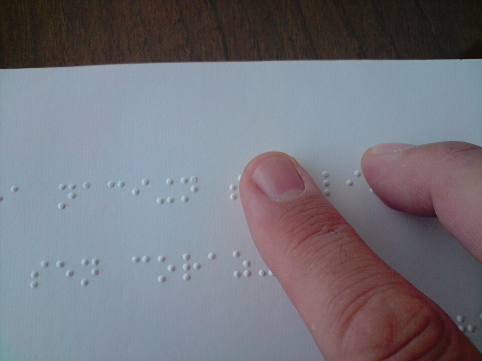

# WAVE

*WAVE overlays icons directly on a live page marking accessibility errors, alerts, and structure - free, unlimited, verified alive in 2026. It separates definite failures from likely issues needing human judgment, which is the whole skill of reading its results correctly.*

> Most accessibility bugs are invisible to sighted testers by design — a missing image description,
> an unlabeled form field, a link with no real text — because the page still LOOKS fine. WAVE from
> WebAIM makes these invisible gaps visible: run it on any page and it overlays icons directly at the
> exact spot each issue lives, turning "somewhere on this page, something isn't accessible" into "here,
> specifically, on line one of the form."

> **In real life**
>
> A book printed in ink too faint to read still LOOKS like a complete book from across the room — same
> page count, same layout, same cover. Only actually trying to read it reveals the failure. WAVE is the
> tool that reads every page for you and marks, in the margin, exactly which lines came out too faint
> to read — not just "somewhere in this book, something's wrong," but the precise paragraph.

**WAVE**: WAVE (Web Accessibility Evaluation Tool) is a free browser extension and web tool from WebAIM that scans a page and overlays icons directly on it marking accessibility issues - categorized as Errors (definite failures, like a missing form label), Alerts (likely issues needing human judgment, like an empty alt attribute that might be intentionally decorative), Features (accessibility techniques already present, like a skip-navigation link), and Structural/Contrast issues in dedicated tabs. Free and unlimited use, verified alive in 2026.

## Reading WAVE's results correctly is the actual skill

- **Errors** — definite accessibility failures: a missing `alt` attribute entirely, a form input with
  no associated label, empty headings. These are unambiguous; fix them.
- **Alerts** — likely issues that need a human to judge context: an empty `alt=""` COULD be correct
  (a genuinely decorative image next to visible text) or WRONG (the image is the only label present).
  WAVE can't tell the difference; you have to look.
- **Features** — accessibility techniques WAVE detected working correctly (a skip link, an ARIA
  landmark) — useful positive confirmation, not just a list of problems.
- **Structure and Contrast tabs** — separate views for heading hierarchy/landmarks and color contrast
  specifically, each worth checking on its own pass.

> **Tip**
>
> Never treat an "Alert" the same as an "Error." An alert is WAVE saying "I found something that's
> OFTEN a problem, but I can't be sure without understanding this page's intent" — that judgment call
> is exactly the part of accessibility testing a machine can't finish for you.

> **Common mistake**
>
> Running WAVE once, seeing zero Errors, and declaring the page accessible. Automated tools including
> WAVE catch roughly 30-40% of real-world accessibility issues — genuinely useful, and genuinely not
> the whole job. Manual checks (keyboard navigation, actual screen-reader use, logical reading order)
> remain mandatory regardless of how clean an automated scan comes back.


*A person reading a braille book — Wikimedia Commons, CC BY 2.0. [Source](https://commons.wikimedia.org/wiki/File:A_person_reading_a_braille_book.jpg)*
- **The fingertip on the raised dots — direct, precise contact with content** — Reading happens exactly where the finger touches - nowhere else. WAVE's icons work the same way: marking the EXACT spot on a page where an issue lives, not a vague 'somewhere on this page.'
- **The rows of dot patterns — structured, scannable information** — Braille encodes meaning in a precise, learnable structure. A well-built page does the same with headings, labels, and landmarks - the exact structure WAVE's Structure tab checks for.
- **The dark wood background, out of focus** — Everything not directly relevant fades into the background - the same triage WAVE performs, surfacing only what needs attention (errors/alerts) instead of every neutral detail of the page.
- **The page's visible edge, continuing beyond the frame** — More content exists beyond what's shown here - a reminder that one WAVE scan covers ONE page; a real audit means running it across every meaningfully different page template, not just the homepage.

**Running and triaging a WAVE scan**

1. **Install WAVE and open it on a real page** — Free extension, unlimited use - click the toolbar icon to run the scan instantly.
2. **Read the Errors first** — These are unambiguous failures - missing alt, unlabeled inputs, empty headings. Fix these regardless of context.
3. **Investigate each Alert individually** — Is this empty alt genuinely decorative, or the only label present? Context decides - WAVE can't.
4. **Check the Structure tab** — Heading hierarchy and landmarks - confirms the page has a logical, navigable outline for assistive tech.
5. **Follow up with manual checks** — Keyboard-only navigation and real screen-reader testing - the ~60-70% WAVE structurally cannot catch on its own.

The Error-vs-Alert distinction is the whole skill here. Here's that triage logic made explicit:

*Run it - simulating a WAVE-style scan and its error/alert triage (Python)*

```python
page_elements = [
    {"tag": "img", "src": "hero.jpg", "alt": "Team celebrating a product launch"},
    {"tag": "img", "src": "icon-cart.svg", "alt": ""},
    {"tag": "img", "src": "banner.jpg", "alt": None},
    {"tag": "input", "type": "text", "name": "search", "label_for": "search"},
    {"tag": "input", "type": "email", "name": "email", "label_for": None},
]

def wave_style_check(elements):
    errors, alerts = [], []
    for el in elements:
        if el["tag"] == "img":
            if el["alt"] is None:
                errors.append(f"Missing alt attribute: img src={el['src']}")
            elif el["alt"] == "":
                alerts.append(f"Empty alt (decorative?) - confirm intentional: img src={el['src']}")
        if el["tag"] == "input" and el.get("label_for") is None:
            errors.append(f"Missing form label: input name={el['name']}")
    return errors, alerts

errors, alerts = wave_style_check(page_elements)

print(f"WAVE-style scan found {len(errors)} errors, {len(alerts)} alerts:")
print()
print("ERRORS (definite accessibility failures):")
for e in errors:
    print(f"  - {e}")
print()
print("ALERTS (likely issues, need human judgment):")
for a in alerts:
    print(f"  - {a}")
print()
print("The empty alt=\\"\\" on the cart icon might be CORRECT (a decorative")
print("icon next to visible 'Cart' text) or WRONG (the icon IS the only label).")
print("WAVE flags it; a human decides which case this actually is.")

# WAVE-style scan found 2 errors, 1 alerts:
#
# ERRORS (definite accessibility failures):
#   - Missing alt attribute: img src=banner.jpg
#   - Missing form label: input name=email
#
# ALERTS (likely issues, need human judgment):
#   - Empty alt (decorative?) - confirm intentional: img src=icon-cart.svg
#
# The empty alt="" on the cart icon might be CORRECT (a decorative
# icon next to visible 'Cart' text) or WRONG (the icon IS the only label).
# WAVE flags it; a human decides which case this actually is.
```

Same logic in Java, applied to a page with a link that has zero accessible text — the case that's
genuinely unambiguous:

*Run it - WAVE-style scan catching an empty link (Java)*

```java
import java.util.*;

public class Main {
    public static void main(String[] args) {
        List<Map<String, Object>> elements = new ArrayList<>();
        elements.add(Map.of("tag", "img", "src", "product-1.jpg", "alt", "Blue running shoe, side view"));
        elements.add(Map.of("tag", "img", "src", "divider.png", "alt", ""));
        elements.add(Map.of("tag", "a", "href", "/checkout", "text", ""));
        elements.add(Map.of("tag", "a", "href", "/support", "text", "Contact support"));

        List<String> errors = new ArrayList<>();
        List<String> alerts = new ArrayList<>();

        for (Map<String, Object> el : elements) {
            String tag = (String) el.get("tag");
            if (tag.equals("img")) {
                String alt = (String) el.get("alt");
                if (alt.isEmpty()) {
                    alerts.add("Empty alt (decorative?) - confirm intentional: img src=" + el.get("src"));
                }
            }
            if (tag.equals("a")) {
                String text = (String) el.get("text");
                if (text.isEmpty()) {
                    errors.add("Link with no accessible text: href=" + el.get("href"));
                }
            }
        }

        System.out.println("WAVE-style scan found " + errors.size() + " errors, " + alerts.size() + " alerts:");
        System.out.println();
        System.out.println("ERRORS (definite accessibility failures):");
        for (String e : errors) System.out.println("  - " + e);
        System.out.println();
        System.out.println("ALERTS (likely issues, need human judgment):");
        for (String a : alerts) System.out.println("  - " + a);
        System.out.println();
        System.out.println("An empty link (icon-only, no text/aria-label) reads as");
        System.out.println("nothing to a screen reader - a real ERROR, not just an alert.");
    }
}

/* WAVE-style scan found 1 errors, 1 alerts:

   ERRORS (definite accessibility failures):
     - Link with no accessible text: href=/checkout

   ALERTS (likely issues, need human judgment):
     - Empty alt (decorative?) - confirm intentional: img src=divider.png

   An empty link (icon-only, no text/aria-label) reads as
   nothing to a screen reader - a real ERROR, not just an alert. */
```

### Your first time: Your mission: run WAVE and triage every result correctly

- [ ] Install WAVE from your browser's extension store (free) — Or use wave.webaim.org's web-based version if you'd rather not install anything for a one-off check.
- [ ] Run it on a content-heavy BuggyShop page — A product listing or checkout page will surface more results than a mostly-empty page.
- [ ] Read every Error and confirm each is a genuine failure — Errors are meant to be unambiguous - if one seems questionable, that's worth a second look at WAVE's own documentation for that specific error type.
- [ ] Investigate every Alert individually - don't batch-dismiss them — For each empty alt or similar alert, decide: is this element genuinely decorative, or does it carry meaning nothing else on the page conveys?
- [ ] Check the Structure tab for heading hierarchy — Confirm headings nest logically (h1 -> h2 -> h3, no skipped levels) - a structural issue easy to introduce without noticing visually.

You've practiced the actual skill this tool requires: not just running a scan, but correctly
separating "definitely broken" from "needs a human to decide."

- **WAVE reports zero errors and zero alerts, and you're tempted to call the page fully accessible.**
  A clean automated scan means the ~30-40% of issues automation CAN catch are absent - it says nothing about the rest. Follow up with a manual keyboard-only pass (can you reach and operate every control using Tab/Enter/Space alone?) and, ideally, real screen-reader testing before calling anything 'accessible.'
- **WAVE flags an alert on an element you're confident is correctly decorative.**
  Confirm by checking what's visually adjacent - if a real, meaningful text label already exists right next to the decorative image/icon, the empty alt is correct and the alert can be dismissed with that reasoning documented, not just silently ignored.
- **The overlay icons make a complex page visually cluttered and hard to read.**
  Use WAVE's Details panel (a text-based summary list) alongside the visual overlay rather than relying on the overlay alone for busy pages - the panel makes it easier to work through many results systematically.
- **You're testing a single-page app and WAVE's results seem stale after a client-side route change.**
  Re-run WAVE explicitly after any client-side navigation - SPAs often update content without a full page reload, and WAVE's scan may reflect the state at click time rather than automatically re-scanning on every route change.

### Where to check

- **WAVE's own Reference tab** — explains exactly what each error/alert type means and how to fix it, directly inside the tool.
- **The visually adjacent content around a flagged image** — the deciding factor for whether an empty `alt` alert is correctly decorative or a real gap.
- **A real screen reader** (VoiceOver on Mac, NVDA on Windows, both free) — the only way to confirm what WAVE's automated Alerts can only guess at.
- **The Structure tab's heading outline** — a fast, separate check for logical document hierarchy independent of the Errors/Alerts list.

### Worked example: an alert that turned out to be a real bug

1. Running WAVE on BuggyShop's product card grid: one Alert per product image, all flagged as
   "empty alt attribute."
2. Investigating: each product card DOES have a text product name visible right below the image —
   at first glance, this looks like the expected, correct decorative pattern (image decorative,
   text label does the real work).
3. Closer look reveals the actual problem: the visible product name text is a plain `<div>`, not
   actually associated with the image or the "Add to cart" button next to it in any accessible way.
   A screen reader user hears "button" with no indication of WHICH product's "Add to cart" button
   they're on.
4. The alert itself wasn't wrong to flag — but the REASON it initially seemed fine (visible adjacent
   text) turned out not to hold up under closer inspection, because that text wasn't accessibly
   connected to the controls near it.
5. Report: "Product card images correctly use empty alt (decorative), but the adjacent product name
   text isn't programmatically associated with the 'Add to cart' button - screen reader users can't
   tell which product's button they're activating. Recommend aria-label on each Add to cart button
   naming the specific product." A WAVE alert led to a real, more subtle finding than the alert
   itself described.

**Quiz.** WAVE flags an image with alt='' as an Alert, and the tester notices a text caption directly below the image. They mark the alert as 'not a bug' and move on. What did this note's guidance suggest they should have checked before dismissing it?

- [ ] Nothing further - visible adjacent text is always sufficient justification for an empty alt attribute
- [x] Whether that visible text is actually PROGRAMMATICALLY associated with the image/control it labels (not just visually adjacent) - visible proximity alone doesn't guarantee a screen reader will connect the two, which is exactly the deeper issue this note's worked example uncovered
- [ ] Whether the image file itself is corrupted, since that's the only other reason WAVE would flag an empty alt
- [ ] Nothing - WAVE Alerts should always be dismissed by default unless they escalate to Errors on a re-scan

*This note's worked example demonstrates precisely this gap: visible adjacent text can LOOK like sufficient decorative justification while still failing to be programmatically connected to the element it appears to label - a plain, unassociated <div> reads as nothing to a screen reader regardless of its visual position. The deeper check (is this actually wired up accessibly, not just visually nearby) is what the tester skipped. Option one states exactly the assumption this note's example proves insufficient. Option three invents an unrelated, unsupported technical cause. Option four is a dangerous overgeneralization - alerts require judgment case by case, and blanket-dismissing them defeats the entire purpose of the alert category existing separately from errors.*

- **WAVE — what it does** — Free browser extension/web tool from WebAIM that overlays icons on a live page marking accessibility Errors (definite failures), Alerts (likely issues needing judgment), Features (positive techniques found), plus separate Structure and Contrast tabs. Unlimited free use, alive in 2026.
- **Errors vs. Alerts — the key distinction** — Errors are unambiguous failures (missing alt entirely, unlabeled form input) - fix them. Alerts are likely issues WAVE can't resolve without context (an empty alt='' that might be correctly decorative or might be a real gap) - always require human judgment.
- **Why 'zero errors' doesn't mean 'fully accessible'** — Automated tools including WAVE catch roughly 30-40% of real accessibility issues. Manual checks - keyboard-only navigation, real screen-reader testing - remain mandatory regardless of a clean automated scan.
- **The deeper check behind a visible-adjacent-text justification** — Visible proximity to an image/control isn't the same as being PROGRAMMATICALLY associated with it - a plain unlabeled div near an icon can still read as nothing to a screen reader, even though it looks like a valid label to a sighted reviewer.
- **Why SPAs need WAVE re-run after route changes** — Client-side navigation can update content without a full page reload - WAVE's scan may not automatically reflect a post-navigation state, so re-run it explicitly after each route change you test.
- **WAVE's Structure tab — what it's for** — A separate check specifically for heading hierarchy and landmark regions - confirms the page has a logical, navigable outline for assistive technology, independent from the Errors/Alerts list.

### Challenge

Run WAVE on two different BuggyShop pages (a content-heavy page and a form-heavy page). For every
Alert found, investigate whether it's genuinely correct or hides a deeper issue (following this
note's worked-example method - check for real programmatic association, not just visual proximity).
Write up any Alert that turns out to be a real, previously-hidden bug.

### Ask the community

> WAVE flagged `[element]` on `[page]` as `[Error/Alert type]`. I checked `[what you investigated]` and I'm still unsure whether this is a real accessibility issue or expected/acceptable for this pattern. What's the right call here?

Alert-level findings often hinge on context a scan alone can't provide — the most useful answers
will help you settle whether this specific pattern is a genuine gap or an accepted convention.

- [WAVE — official site and web-based tool](https://wave.webaim.org/)
- [WAVE — browser extension page](https://wave.webaim.org/extension/)
- [Analyzing Accessibility Using WebAIM's WAVE Tool](https://www.youtube.com/watch?v=T1UoZZ45beQ)

🎬 [How to Use the WAVE Web Accessibility Evaluation Tool (James Warnken)](https://www.youtube.com/watch?v=Daoi8ABPuYc) (9 min)

- WAVE overlays icons directly on a live page marking accessibility Errors, Alerts, Features, and dedicated Structure/Contrast checks - free, unlimited use, alive in 2026.
- Errors are unambiguous failures; Alerts require human judgment - the real skill is correctly separating the two, not just running the scan.
- Automated scans (WAVE included) catch roughly 30-40% of real accessibility issues - manual keyboard and screen-reader testing remain mandatory.
- Visible adjacent text doesn't guarantee programmatic association - a plausible-looking Alert dismissal can still hide a real bug, as this note's worked example shows.
- Re-run WAVE explicitly after client-side route changes in SPAs, since its scan may not automatically reflect post-navigation content.


## Related notes

- [[Notes/testers-toolbox/accessibility-and-quality/axe-devtools|axe DevTools]]
- [[Notes/testers-toolbox/accessibility-and-quality/contrast-and-screen-reader-checks|Contrast & screen-reader checks]]
- [[Notes/testers-toolbox/accessibility-and-quality/lighthouse|Lighthouse as an extension of QA]]


---
_Source: `packages/curriculum/content/notes/testers-toolbox/accessibility-and-quality/wave.mdx`_
