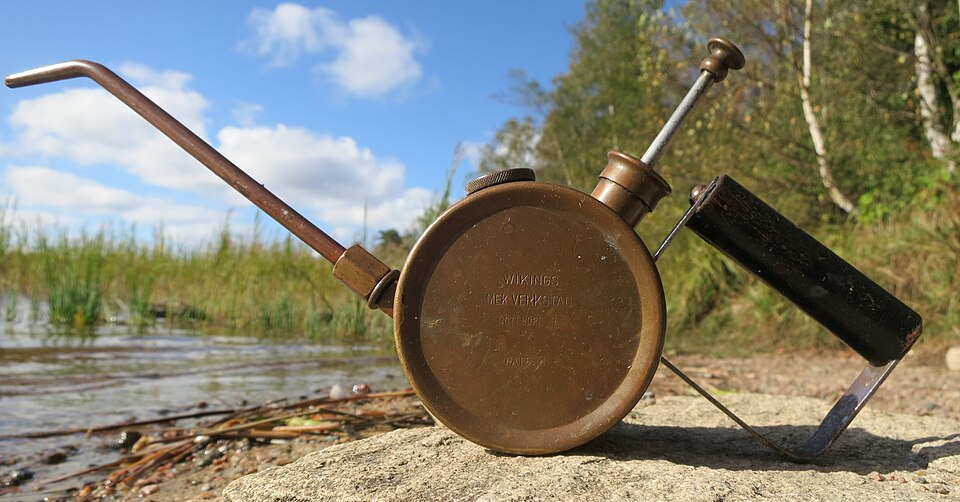

# Keeping your kit current

*This entire module's own research found three real 2026 cautionary tales: EditThisCookie (removed, malicious copycat took its name), Loom (free tier gutted), and ngrok (free tier cut hard). Tools you learned a year ago may no longer be true today - periodically re-verify, don't just remember.*

> This entire toolbox module was built on a research pass done specifically because tool status
> changes — and that research turned up three genuine, concrete cautionary tales from 2026 alone.
> EditThisCookie got pulled from the Chrome Web Store, and a malicious copycat wearing its name has
> 50,000+ installs now. Loom's free tier got gutted after an acquisition. ngrok's free tier got cut
> hard. None of this was true two years ago. All of it is true now. Keeping your kit current means
> treating "I learned this tool a while back" as a claim that needs re-checking, not a fact that stays true.

> **In real life**
>
> An old brass oil can, decades old, still works exactly as designed the moment someone actually
> oils the mechanism again — but leave it dry and unattended long enough, and the same tool seizes up,
> becomes unreliable, or gets replaced by something better without anyone noticing the old one stopped
> serving its purpose. Tool knowledge needs the same periodic attention: what you learned still works
> until it quietly doesn't, and only checking again tells you which is currently true.

**keeping your kit current**: Keeping your kit current means periodically re-verifying tool knowledge instead of trusting it indefinitely once learned - because tools genuinely change status: extensions get removed or replaced by malicious copycats, free tiers get cut or gutted after acquisitions, and better alternatives emerge. This module's own 2026 research found three concrete real examples: EditThisCookie (removed Dec 2024, malicious copycat now circulating with 50k+ installs), Loom (free tier gutted to 25 lifetime videos/5-min cap/720p/no MP4 download after Atlassian's integration), and ngrok (free tier cut to 1GB/month and 2-hour sessions in early 2026).

## Three real 2026 case studies, not hypotheticals

- **EditThisCookie** — the most-used cookie editor for years, pulled from the Chrome Web Store in
  December 2024 for running on deprecated Manifest V2. A malicious extension using the SAME name
  and icon has circulated since, actively stealing cookies — anyone still trusting old
  "install EditThisCookie" advice risks installing malware, not the tool they remember.
- **Loom** — the default screen-recording choice for bug reports for years. After Atlassian's 2026
  integration completed, its free tier dropped to 25 videos total (lifetime, not monthly), 5-minute
  clips, 720p, no MP4 download. A tool that was a reasonable free default is now a poor one for
  regular work.
- **ngrok** — long the default "expose localhost" tool. Its 2026 free tier got cut to 1GB monthly
  bandwidth and 2-hour sessions — fine for a quick demo, genuinely limiting for real testing.

> **Tip**
>
> When you're about to recommend a tool from memory — to a teammate, in a bug report, in training
> material — do a quick current-status check first if it's been more than a few months since you
> verified it yourself. This module exists because that exact check, done systematically, changed
> several notes' recommended defaults.

> **Common mistake**
>
> Assuming a well-known tool's free tier, ownership, or safety status is unchanged just because it
> used to be the obvious default. EditThisCookie, Loom, and ngrok were ALL once the safe, obvious
> choice — and all three changed in ways that make old advice actively wrong or risky today.


*1900s Wikings mekaniska verkstad brass oil can — Wikimedia Commons, CC BY 4.0. [Source](https://commons.wikimedia.org/wiki/File:1900s_Wikings_mekaniska_verkstad_Gothenburg_Sweden_brass_oil_can.jpg)*
- **The brass body, decades old but still sound** — Age alone doesn't make a tool unreliable - what matters is whether it's still MAINTAINED and verified to work, not just how long it's existed. The same logic applies to a tool's free tier or ownership status.
- **The curved spout, reaching toward its target** — Precisely aimed at where attention is actually needed - the same targeted re-verification this note calls for: not re-checking everything constantly, but directing periodic attention at what you're about to rely on or recommend.
- **The natural, outdoor setting - exposed to real conditions** — Nothing stays static sitting out in the elements - exactly like a tool's status in a changing market: ownership changes, free tiers get cut, security incidents happen, all without your own knowledge of the tool updating automatically.
- **The pump handle, ready to be used again** — Still functional, still ready - but only useful the moment someone actually engages with it again. The parallel: your knowledge of a tool stays useful only if you periodically re-engage with checking it.

**Re-verifying a tool belief before relying on it**

1. **Notice you're about to recommend/rely on tool knowledge from memory** — A teammate asks, you're writing docs, you're about to install something 'like you always do.'
2. **Ask: when did I last actually confirm this is still true?** — If it's been months, that's the trigger to check, not just recall.
3. **Quick search: '[tool name] status 2026' or check its official site directly** — Confirms current ownership, pricing, and whether it's still actively maintained.
4. **Compare against what you remembered** — Sometimes nothing changed - confirmed, move on. Sometimes something real changed - this module's own three case studies.
5. **Update your recommendation/advice accordingly** — The whole point: acting on CURRENT information, not comfortable old memory.

The core check here is simple: is a remembered belief about a tool still actually true? Here's
that exact question, run against this module's own three real case studies:

*Run it - checking remembered tool beliefs against 2026 reality (Python)*

```python
tool_timeline = [
    {"tool": "EditThisCookie", "event": "Removed from Chrome Web Store (Manifest V2 deprecated)", "date": "2024-12", "risk": "A malicious copycat with the same name now has 50,000+ installs"},
    {"tool": "Loom", "event": "Free tier gutted post-Atlassian integration", "date": "2026-01", "risk": "25 videos lifetime cap, 5-min limit, 720p, no MP4 download"},
    {"tool": "ngrok", "event": "Free tier cut hard", "date": "2026-01", "risk": "1GB/month, 2-hour sessions - unusable for real testing work"},
]

def stale_belief_check(tool, believed_status, actual_events):
    for event in actual_events:
        if event["tool"] == tool:
            return f"OUTDATED BELIEF - {event['event']} ({event['date']}). Risk: {event['risk']}"
    return "still accurate as far as known"

beliefs_from_a_year_ago = ["EditThisCookie", "Loom", "ngrok", "mitmproxy"]

print("Checking a tester's tool beliefs against what's actually true in 2026:")
print()
for belief in beliefs_from_a_year_ago:
    result = stale_belief_check(belief, "still the default choice", tool_timeline)
    print(f"  {belief:<16} -> {result}")

print()
print("Three of four beliefs, formed a year ago, are now dangerously outdated.")
print("Tools don't stay the same just because your understanding of them hasn't")
print("changed - 'keeping your kit current' means re-verifying, not just remembering.")

# Checking a tester's tool beliefs against what's actually true in 2026:
#
#   EditThisCookie   -> OUTDATED BELIEF - Removed from Chrome Web Store (Manifest V2 deprecated) (2024-12). Risk: A malicious copycat with the same name now has 50,000+ installs
#   Loom             -> OUTDATED BELIEF - Free tier gutted post-Atlassian integration (2026-01). Risk: 25 videos lifetime cap, 5-min limit, 720p, no MP4 download
#   ngrok            -> OUTDATED BELIEF - Free tier cut hard (2026-01). Risk: 1GB/month, 2-hour sessions - unusable for real testing work
#   mitmproxy        -> still accurate as far as known
#
# Three of four beliefs, formed a year ago, are now dangerously outdated.
# Tools don't stay the same just because your understanding of them hasn't
# changed - 'keeping your kit current' means re-verifying, not just remembering.
```

Same idea in Java, framed as a practical re-verification SCHEDULE rather than a one-time check —
the sustainable version of this habit:

*Run it - scheduling periodic tool-belief re-verification (Java)*

```java
import java.util.*;

public class Main {
    static boolean needsReverification(int daysSinceLastCheck, int reverifyThresholdDays) {
        return daysSinceLastCheck >= reverifyThresholdDays;
    }

    public static void main(String[] args) {
        Map<String, Integer> toolLastChecked = new LinkedHashMap<>();
        toolLastChecked.put("Bug Magnet", 20);
        toolLastChecked.put("EditThisCookie (a year-old note)", 400);
        toolLastChecked.put("Cookie-Editor", 15);
        toolLastChecked.put("ngrok", 380);

        int reverifyThreshold = 180;

        System.out.println("Checking which tool beliefs are due for re-verification (every 180 days):");
        System.out.println();
        for (Map.Entry<String, Integer> entry : toolLastChecked.entrySet()) {
            boolean due = needsReverification(entry.getValue(), reverifyThreshold);
            System.out.printf("  %-32s last checked %3d days ago -> %s%n",
                entry.getKey(), entry.getValue(), due ? "DUE FOR RE-VERIFICATION" : "still recent enough");
        }

        System.out.println();
        System.out.println("Two entries are over a year stale - exactly the kind of gap that let");
        System.out.println("a dead extension (EditThisCookie) or a gutted free tier (ngrok) go");
        System.out.println("unnoticed until this note's own 2026 research caught them.");
    }
}

/* Checking which tool beliefs are due for re-verification (every 180 days):

     Bug Magnet                       last checked  20 days ago -> still recent enough
     EditThisCookie (a year-old note) last checked 400 days ago -> DUE FOR RE-VERIFICATION
     Cookie-Editor                    last checked  15 days ago -> still recent enough
     ngrok                            last checked 380 days ago -> DUE FOR RE-VERIFICATION

   Two entries are over a year stale - exactly the kind of gap that let
   a dead extension (EditThisCookie) or a gutted free tier (ngrok) go
   unnoticed until this note's own 2026 research caught them. */
```

### Your first time: Your mission: re-verify one piece of tool knowledge you've been trusting from memory

- [ ] Pick one tool you learned about more than six months ago and haven't re-checked since — From this module, a past job, a course - anything you'd currently recommend to someone else from memory.
- [ ] Search its current official status: pricing page, official site, or a recent review — Confirm ownership, current free-tier limits, and whether it's still actively maintained.
- [ ] Compare what you find against what you remembered — Note specifically what (if anything) changed - this module's EditThisCookie/Loom/ngrok stories are exactly this exercise, done systematically.
- [ ] If something changed, identify the safe current alternative — This module already did this work for cookie editors (Cookie-Editor), screen recording (OBS/OS built-ins), and tunneling (Cloudflare Tunnel) - apply the same instinct to whatever you checked.
- [ ] Update wherever you'd normally state this as fact — Personal notes, a wiki page, advice you'd give a teammate - the actual point of re-verifying is acting differently afterward.

You've practiced the exact discipline that produced this entire module's tool-status research —
treating remembered tool knowledge as a claim to check, not a fact to trust indefinitely.

- **You're not sure how often is 'often enough' to re-verify tool knowledge.**
  There's no universal answer, but a reasonable default matches this chapter's tool-sprawl audit cadence - quarterly for actively-used tools, and specifically BEFORE recommending anything to someone else regardless of when you last checked it personally.
- **You re-verified a tool and found conflicting information across different sources.**
  Prefer the tool's own official site/pricing page as the primary source over third-party blog posts or forum comments, which can themselves be outdated - and note the date you checked, since even official info changes.
- **A tool you're re-checking seems to have been silently acquired or rebranded.**
  This is exactly the kind of change worth flagging loudly (as with Loom's Atlassian integration) - acquisitions frequently precede free-tier changes, so treat news of one as a specific trigger to check pricing/terms even if nothing else seems different yet.
- **You want to build this habit into a team's shared documentation, not just personal practice.**
  Add a 'last verified' date next to any tool recommendation in shared docs/wikis - makes staleness visible to everyone, not just something the original author might remember to recheck.

### Where to check

- **The tool's own official site and pricing page** — the most authoritative source for current status, preferred over third-party summaries that can themselves be stale.
- **Recent (dated) reviews or community discussion** — useful for catching real-world experience with a tool's current state, cross-referenced against official claims.
- **Security/privacy incident reports** (like the EditThisCookie story) — worth a specific periodic check for any tool handling sensitive data, since these can appear with little official fanfare.
- **A "last verified" date on any tool recommendation you maintain** — makes staleness visible and actionable for anyone relying on that recommendation later, including future you.

### Worked example: how this module's own research changed a real recommendation

1. Early in building this module's chapter on cookies, the working assumption (based on years of
   community consensus) was that EditThisCookie remained the standard, safe cookie-editing tool.
2. A verification pass — done specifically because this module's standing practice required
   checking every tool's 2026 status before writing about it — turned up the December 2024 removal
   and the subsequent malicious-copycat story.
3. This completely changed the recommendation: instead of "install EditThisCookie" (which would now
   risk pointing someone at malware wearing the same name), the module's actual cookie-editors note
   leads with Cookie-Editor and tells the EditThisCookie story explicitly as a security lesson.
4. Without that specific re-verification step, this entire curriculum would have shipped dangerously
   outdated, actively harmful advice — not because anyone was careless, but because tool knowledge
   naturally goes stale and nobody had checked recently.
5. This is the concrete, real-stakes version of the habit this note describes: the difference
   between "I remember this tool being fine" and "I just confirmed this tool is still fine" can be
   the difference between good advice and advice that gets someone's cookies stolen.

**Quiz.** A tester is about to recommend a screen-recording tool to a new colleague, based on advice that was accurate when the tester learned it roughly 18 months ago. What does this note's guidance say they should do before making the recommendation?

- [ ] Nothing extra - if the advice was correct 18 months ago from a credible source at the time, it remains safe to pass along as-is today
- [x] Do a quick current-status check (the tool's own site/pricing page) before recommending it, since this module's own research found real tools (Loom, ngrok, EditThisCookie) that changed dramatically within a similar or shorter timeframe - remembered advice is a claim to verify, not a fact to trust indefinitely
- [ ] Only re-check if the tool is free, since paid tools by definition never change their terms or ownership
- [ ] Recommend a completely different, newer tool instead, since any advice over a year old should be assumed automatically wrong

*This note's central, concretely-evidenced point is exactly this: EditThisCookie, Loom, and ngrok were all once perfectly reasonable defaults, and all three changed in real, consequential ways within roughly the same or a shorter timeframe than 18 months - discovered specifically because this module's own standing practice required a re-verification check before writing about each tool. Skipping that check (option one) is exactly the failure mode the note's WorkedExample shows nearly happened with EditThisCookie. Option three is an unsupported and false distinction - Loom's paid status didn't protect its FREE tier from being gutted, and acquisitions/ownership changes affect paid and free tiers alike. Option four overcorrects into unwarranted distrust - the point isn't that old advice is automatically wrong, it's that it needs a cheap, quick re-check before being trusted again, which may well confirm it's still accurate (as this note's own Python example shows with mitmproxy).*

- **This module's three real 2026 cautionary tales** — EditThisCookie (removed Dec 2024, malicious copycat now circulating), Loom (free tier gutted post-Atlassian: 25 videos lifetime/5-min/720p/no MP4), ngrok (free tier cut: 1GB/month, 2-hour sessions).
- **The core discipline this note teaches** — Treat remembered tool knowledge as a claim to periodically re-verify, not a fact that stays true indefinitely - tools change ownership, pricing, and safety status without your own memory of them updating automatically.
- **The specific trigger for re-verification** — Before recommending a tool to someone else, or relying on it for something important, if it's been more than a few months since you personally confirmed its current status.
- **Why an acquisition/ownership change is a specific red flag to check** — Acquisitions frequently precede free-tier changes (as with Loom/Atlassian) - treat news of one as a trigger to specifically check pricing/terms even before anything else seems different.
- **The practical habit for shared team documentation** — Add a 'last verified' date next to any tool recommendation - makes staleness visible to everyone relying on it, not dependent on the original author remembering to recheck.
- **Why this note exists as the CLOSING note of the entire chapter/module** — Every tool covered in this whole toolbox module was verified via this exact practice before being written about - this note names the discipline explicitly so it continues past the module itself, not just for these ~30 tools.

### Challenge

Pick one tool recommendation you've given someone (or would give) purely from memory, without
having checked it recently. Do the re-verification check described in this note: confirm current
ownership, pricing/free-tier status, and whether it's still actively maintained. Write one sentence
stating whether your memory was accurate or outdated, and if outdated, what changed.

### Ask the community

> I last verified `[tool]`'s status `[timeframe]` ago and am about to recommend it based on that. Has anyone confirmed more recently whether `[specific detail - free tier, ownership, maintenance status]` is still accurate?

Tool status can shift with little fanfare — the most useful answers will share a recent, dated
confirmation (or correction) of the specific detail you're relying on.

- [gHacks — the EditThisCookie removal and copycat story](https://www.ghacks.net/2024/12/31/google-chrome-legit-editthiscookie-extension-removed-instead-of-malicious-copycat/)
- [ScreenKite — Loom's 2026 free-plan changes explained](https://www.screenkite.com/blog/loom-free-plan-changes-2026)

🎬 [Browser Extensions are DANGEROUS (Naomi Brockwell TV)](https://www.youtube.com/watch?v=11P6DdI8HOo) (20 min)

- This module's own research found three real 2026 cautionary tales: EditThisCookie (removed + malicious copycat), Loom (free tier gutted), ngrok (free tier cut) - all once-safe defaults that changed.
- Tool knowledge needs periodic re-verification - a tool's status doesn't stay the same just because your memory of it hasn't updated.
- The specific trigger: before recommending a tool to someone else, or relying on it for something important, if it's been months since you personally confirmed its current status.
- An acquisition or ownership change is a specific red flag worth checking pricing/terms over, even before anything else visibly changes.
- Add a 'last verified' date to shared tool recommendations - makes staleness visible and actionable for everyone, not just the original author's memory.


## Related notes

- [[Notes/testers-toolbox/choosing-tools-wisely/tool-sprawl-and-when-to-stop|Tool sprawl & when to stop]]
- [[Notes/testers-toolbox/cookies-json-sessions/cookie-editors|Cookie editors]]
- [[Notes/testers-toolbox/beyond-the-browser/screen-recorders-for-bug-repro|Screen recorders for bug repro]]


---
_Source: `packages/curriculum/content/notes/testers-toolbox/choosing-tools-wisely/keeping-your-kit-current.mdx`_
