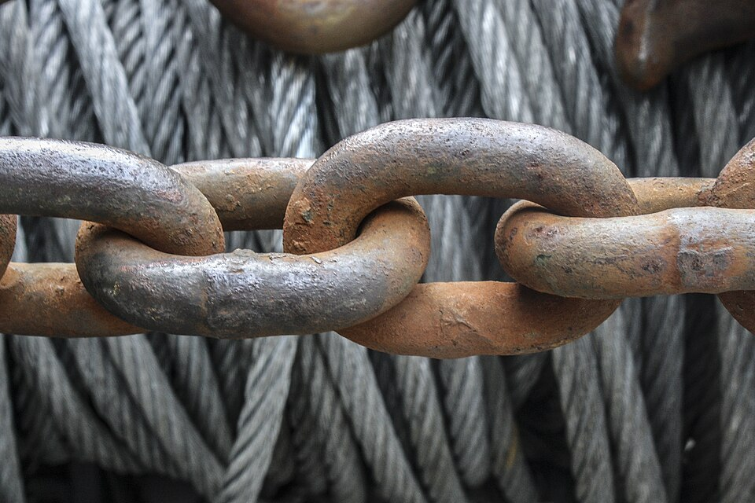

# Check My Links

*A one-click link crawler that visits every link on a page and highlights which return 404s, 500s, or redirects - turning a tedious manual click-through-everything check into a five-second sweep. Free, actively maintained in 2026.*

> Every page you're asked to sign off on has links — footer links, nav links, "related articles,"
> partner logos, social icons. Clicking every single one by hand is the kind of task that ruins
> attention: by link 30, you've stopped actually looking. Check My Links exists because a machine
> never gets bored — it visits every link on a page in seconds and hands you back a color-coded map
> of what's actually broken.

> **In real life**
>
> Pick up one link of a heavy chain and every other link is trusted to hold, sight unseen — until one
> rusted-through link snaps and the whole chain fails at exactly that point. A page's links work the
> same way: each one LOOKS identical (blue, underlined, clickable), but only visiting it reveals
> whether it's solid or already broken. A link checker is the inspector who tests every single link in
> the chain instead of eyeballing the shiny ones.

**Check My Links**: Check My Links is a free browser extension that crawls every hyperlink on the current page, requests each one, and highlights the result: green for a working link (2xx), a different color for redirects (3xx), and red for broken links (4xx/5xx). One click replaces manually clicking through every link on a page. Verified alive and actively supported in 2026 (4.4-star rating, maintained fork also available via SelectorsHub).

## What one click actually does

- **Crawls every `<a href>`** on the current page — visible links, footer links, even ones outside
  the viewport.
- **Fires a request per link** and reads back the HTTP status.
- **Color-codes the result directly on the page**: green outline = success, red = broken, a third
  color for redirects — so you see the failures in CONTEXT, not as a separate report you have to
  cross-reference.
- **Doesn't follow JavaScript-triggered navigation** — it checks `href` attributes, so a link that's
  really a JS `onClick` handler with no real `href` won't be crawled. That's a tool boundary, not a
  bug: those need manual clicking or DevTools inspection instead.

> **Tip**
>
> Run it on every page template ONCE per release, not just the homepage — a broken link in a footer
> that's shared across 200 pages is 200 broken links, found and fixed with a single check on the
> template rather than 200 individual page visits.

> **Common mistake**
>
> Treating "all green" as "the links are correct." The tool confirms a link RESOLVES (returns 2xx) —
> it says nothing about whether it resolves to the RIGHT place. A link to "Pricing" that 200s
> successfully to last year's pricing page is invisible to this tool and entirely visible to a human
> who actually clicks it and reads the destination.


*Chain Macro — Wikimedia Commons, CC BY-SA 4.0. [Source](https://commons.wikimedia.org/wiki/File:Chain_Macro.jpg)*
- **The interlocking point — where a link is tested** — Where one link joins the next is exactly where stress concentrates and rust bites first - the equivalent of the moment a browser actually REQUESTS a link's href and finds out if it resolves.
- **Surface rust and pitting — a link that LOOKS fine** — From a normal viewing distance this chain looks intact. Only close inspection (or, for a webpage, an actual HTTP request) reveals the corrosion - the same gap between 'looks clickable' and 'actually resolves'.
- **The next link in sequence — the rest of the page** — One link's integrity says nothing about the next one's. A checker has to visit EVERY link individually - sampling a few and assuming the rest are fine misses exactly the one that's failed.
- **Coiled wire rope, blurred, in the background** — Redundant strands bundled together - like a page with many links pointing to similar destinations. Depth of field hides most of it from casual view, just as most broken links hide until something actually checks them.

**One Check My Links run across a page**

1. **Click the extension icon** — On the page you're testing - works on any page the browser can load, including localhost/staging.
2. **The extension collects every <a href>** — Including links outside the visible viewport - it reads the DOM, not just what's on screen.
3. **Each link gets requested** — A real HTTP request per link, checking the response status - not just "does this string look like a URL."
4. **Results render as colors on the page** — Green (2xx), a redirect color (3xx), red (4xx/5xx) - directly overlaid on the actual links, in context.
5. **You investigate every red one** — Not just note the count - open each, read the actual status and destination, decide who owns the fix.

The classification logic underneath any link checker is simple HTTP-status bucketing. Here it is,
run against a realistic mixed page:

*Run it - classifying a page's links by status (Python)*

```python
page_links = {
    "/products": 200,
    "/about": 200,
    "/products/discontinued-item-42": 404,
    "/blog/2024/old-post": 301,
    "/checkout": 200,
    "/support/faq-old": 404,
    "https://partner-site.example/deal": 500,
}

def classify(status):
    if 200 <= status < 300:
        return "OK"
    if 300 <= status < 400:
        return "REDIRECT"
    if 400 <= status < 500:
        return "BROKEN (client error)"
    return "BROKEN (server error)"

print("Crawling every link on the page:")
print()
broken = []
for link, status in page_links.items():
    verdict = classify(status)
    print(f"  [{status}] {verdict:<22} {link}")
    if "BROKEN" in verdict:
        broken.append(link)

print()
print(f"{len(broken)} of {len(page_links)} links are broken:")
for link in broken:
    print(f"  - {link}")
print()
print("A 301 isn't broken, but it's worth a second look: does it redirect")
print("to the CORRECT destination, or a stale one nobody updated?")

# Crawling every link on the page:
#
#   [200] OK                     /products
#   [200] OK                     /about
#   [404] BROKEN (client error)  /products/discontinued-item-42
#   [301] REDIRECT               /blog/2024/old-post
#   [200] OK                     /checkout
#   [404] BROKEN (client error)  /support/faq-old
#   [500] BROKEN (server error)  https://partner-site.example/deal
#
# 3 of 7 links are broken:
#   - /products/discontinued-item-42
#   - /support/faq-old
#   - https://partner-site.example/deal
#
# A 301 isn't broken, but it's worth a second look: does it redirect
# to the CORRECT destination, or a stale one nobody updated?
```

Same classification in Java, including the case that matters most for a bug report — an external
dependency failing on YOUR page:

*Run it - link classification with LinkedHashMap (Java)*

```java
import java.util.*;

public class Main {
    public static void main(String[] args) {
        Map<String, Integer> links = new LinkedHashMap<>();
        links.put("/products", 200);
        links.put("/about", 200);
        links.put("/products/discontinued-item-42", 404);
        links.put("/blog/2024/old-post", 301);
        links.put("/checkout", 200);
        links.put("/support/faq-old", 404);
        links.put("https://partner-site.example/deal", 500);

        System.out.println("Crawling every link on the page:");
        System.out.println();
        List<String> broken = new ArrayList<>();
        for (Map.Entry<String, Integer> entry : links.entrySet()) {
            int status = entry.getValue();
            String verdict;
            if (status >= 200 && status < 300) verdict = "OK";
            else if (status >= 300 && status < 400) verdict = "REDIRECT";
            else if (status >= 400 && status < 500) verdict = "BROKEN (client error)";
            else verdict = "BROKEN (server error)";

            System.out.printf("  [%d] %-22s %s%n", status, verdict, entry.getKey());
            if (verdict.contains("BROKEN")) broken.add(entry.getKey());
        }

        System.out.println();
        System.out.println(broken.size() + " of " + links.size() + " links are broken:");
        for (String link : broken) {
            System.out.println("  - " + link);
        }
        System.out.println();
        System.out.println("An external 500 (partner-site.example) isn't YOUR bug to fix,");
        System.out.println("but it's still worth reporting - your page is what's linking to it.");
    }
}

/* Crawling every link on the page:

     [200] OK                     /products
     [200] OK                     /about
     [404] BROKEN (client error)  /products/discontinued-item-42
     [301] REDIRECT               /blog/2024/old-post
     [200] OK                     /checkout
     [404] BROKEN (client error)  /support/faq-old
     [500] BROKEN (server error)  https://partner-site.example/deal

   3 of 7 links are broken:
     - /products/discontinued-item-42
     - /support/faq-old
     - https://partner-site.example/deal

   An external 500 (partner-site.example) isn't YOUR bug to fix,
   but it's still worth reporting - your page is what's linking to it. */
```

### Your first time: Your mission: sweep one real page and triage every red link

- [ ] Install Check My Links from your browser's extension store — Free, one click, no account. A maintained fork is also linked from SelectorsHub if the original ever lapses.
- [ ] Open a content-heavy page - BuggyShop's footer or a blog-style page works well — Pages with many links (footers, sitemaps, resource pages) show the tool's value fastest.
- [ ] Click the extension icon and wait for the crawl to finish — Watch the page - links color as each request resolves, in real time.
- [ ] Open every red (broken) link's destination directly — Confirm it's really broken (not a flaky network blip) and note the exact status code - a 404 and a 500 point to very different root causes.
- [ ] Check at least two GREEN links manually too — Pick ones whose destination matters (like 'Pricing' or 'Contact') and confirm they resolve to the CORRECT page, not just A page - this is the check the tool itself cannot do.

You've now run the automated sweep AND the manual spot-check that catches what automation can't —
the two-layer habit that makes link checking actually reliable.

- **The extension reports a link as broken, but clicking it manually works fine.**
  Could be a flaky network blip during the crawl, a link that requires authentication the extension's request doesn't carry (a session cookie, for instance), or a server briefly rate-limiting rapid automated requests. Re-run the check; if it still fails automated but works manually, note the discrepancy in your report rather than dismissing either result.
- **A link the tool marks green actually leads to the wrong page.**
  Expected, not a tool failure - the extension only confirms a successful HTTP response, never destination correctness. That's exactly why the FirstTime exercise includes manually verifying a sample of green links, not just chasing red ones.
- **A JavaScript-driven 'link' (a styled button or div with an onClick handler) never gets checked at all.**
  The tool crawls real <a href> attributes - a JS-only navigation has no href for it to find. Test those manually, or use DevTools to inspect what the onClick handler actually does before trusting it works.
- **The crawl takes a very long time or seems to hang on a page with hundreds of links.**
  Large pages (a full sitemap, a huge resource index) can genuinely take a while since every single link gets a real request. Let it finish rather than assuming it's frozen; for very large pages, consider checking sections at a time.

### Where to check

- **The status code of every red link, individually** — a 404 (moved/deleted) and a 500 (server error) point to completely different owners and fixes; don't just count "broken," read what broke.
- **Whether a broken external link is still relevant** — a partner site that's gone dark might mean the whole link (and the relationship it represents) should be removed, not just fixed.
- **The page's actual href attributes in DevTools** — when the extension's crawl and manual clicking disagree, reading the real markup settles which one is right.
- **Shared templates (headers/footers) separately from page-specific content** — a broken template link affects every page using it; fix once, verify the fix propagates everywhere.

### Worked example: one footer sweep finds a site-wide bug

1. Task: pre-release smoke check on the marketing site. Run Check My Links on the homepage footer.
2. Result: 2 red links — "Privacy Policy" (404) and a partner logo linking to a dead domain (500 /
   DNS failure).
3. Investigate the Privacy Policy 404: the URL is `/legal/privacy-policy-2024`, but the page was
   renamed to `/legal/privacy` during a recent redesign. Classic stale-link-after-rename bug.
4. Because the footer is a SHARED component, check one more page to confirm: same 404 on the
   pricing page's footer too. Confirmed — this is one bug affecting every page on the site, not
   a one-off.
5. Report: "Footer 'Privacy Policy' link (404, `/legal/privacy-policy-2024`) affects all pages
   using the shared footer component (confirmed on homepage + pricing page); correct target is
   `/legal/privacy`. Partner logo link to `[domain]` also dead — recommend removing until the
   partnership status is confirmed with the partnerships team." One five-minute check, two real
   findings, correctly scoped as site-wide vs. external-relationship questions.

**Quiz.** A tester runs Check My Links on a page, sees all links reported green, and marks 'link checking: passed' in the test report. What's the gap in that conclusion?

- [ ] None - green across the board means every link works correctly
- [x] Green only means every link returned a successful HTTP response (2xx) - it says nothing about whether each link points to the CORRECT destination, which the tool cannot evaluate and still needs a manual spot-check
- [ ] The tester should have also run the check on mobile, since links behave completely differently on mobile browsers
- [ ] Check My Links cannot be trusted for a pass/fail decision because its crawl is not 100% reliable

*The tool verifies RESOLUTION (does the URL return a working response), not CORRECTNESS (does it lead where it should). A 'Contact Us' link that 200s to an outdated contact page is invisible to the crawler and exactly the kind of bug a human spot-check catches - which is why this note's own FirstTime exercise requires manually verifying a sample of green links, not just chasing red ones. Option three invents an unsupported claim about mobile-specific link behavior. Option four overstates a minor reliability caveat (occasional network flakiness, covered in WhenItBreaks) into a reason to distrust the whole tool, when the real gap is conceptual (resolution vs. correctness), not a reliability problem.*

- **Check My Links — what it does** — Free browser extension that crawls every <a href> on the current page, requests each one, and color-codes the result on the page itself: green (2xx), a redirect color (3xx), red (4xx/5xx). One click replaces manual link-by-link clicking.
- **What the tool CANNOT verify** — Destination correctness. It confirms a link resolves (returns a successful status) - it has no way to know whether that destination is the RIGHT page. Always manually spot-check a sample of green links too.
- **Why check shared templates (headers/footers), not just page content** — A broken link in a component used across many pages is one bug with site-wide impact - finding and fixing it once (after confirming it repeats across pages) is far more efficient than treating each page's report separately.
- **Why the tool misses JavaScript-driven navigation** — It crawls real <a href> attributes in the DOM. A button or div using a JS onClick handler with no real href has nothing for the crawler to find - test those manually or via DevTools.
- **The right response to a red (broken) link** — Read its EXACT status code before reporting - a 404 (moved/deleted, usually your fix) and a 500 (server error, possibly someone else's system) point to completely different root causes and owners.
- **Why an external link returning 500 is still worth reporting** — It's not your bug to fix, but it's your page linking to a broken destination - worth flagging even if the fix belongs to a different team or a partner.

### Challenge

Run Check My Links on three different page types in BuggyShop (e.g. homepage, a product page, a
footer-heavy page). For every red result, open it manually and record the exact status code and
what you believe caused it. Then pick five green results across the three pages and manually verify
each leads to the CORRECT destination - report any mismatch you find as its own finding, separate
from the tool's automated results.

### Ask the community

> Check My Links flagged `[link]` on `[page]` as `[status code]`, but `[what you observed manually - it works fine / it's a shared component so I think it affects other pages too]`. Before I file this: does anyone know if this component/link is shared across other pages, or is there a known reason this specific link behaves this way?

Broken-link findings often hinge on ownership and scope — the most useful answers will help you
figure out whether it's a shared-component bug (fix once) or a one-off, and who actually owns it.

- [SelectorsHub — Check My Links (maintained listing)](https://selectorshub.com/checkmylinks/)
- [GitHub — Check-My-Links source](https://github.com/PageModifiedOfficial/Check-My-Links)
- [SelectorsHub — How to find broken & invalid links, the easiest way](https://www.youtube.com/watch?v=z0T6F96efz8)

🎬 [How to use Check My Links Extension — free plugin to find broken links in 1 click (SelectorsHub)](https://www.youtube.com/watch?v=C1cxbFvb-0s) (7 min)

- Check My Links crawls every <a href> on a page in one click, requesting each and color-coding the result directly on the page - free, actively maintained in 2026.
- It verifies RESOLUTION (does the link work), never CORRECTNESS (does it lead to the right place) - always spot-check a sample of green links manually too.
- It doesn't crawl JavaScript-driven navigation (no real href to find) - test those separately.
- Check shared components (headers/footers) deliberately: one broken link there is a site-wide bug, not a page-specific one.
- Read the EXACT status code of every red link before reporting - 404 and 500 mean different root causes and often different owners.


## Related notes

- [[Notes/testers-toolbox/link-page-ui-checks/gofullpage-and-screenshots|GoFullPage & screenshot tools]]
- [[Notes/the-web-platform-for-testers/browsers-and-page-loading/a-peek-at-dev-tools|a-peek-at-dev-tools]]
- [[Notes/api-testing-fundamentals/status-codes-and-rest/2xx-4xx-5xx-families|2xx-4xx-5xx-families]]


---
_Source: `packages/curriculum/content/notes/testers-toolbox/link-page-ui-checks/check-my-links.mdx`_
