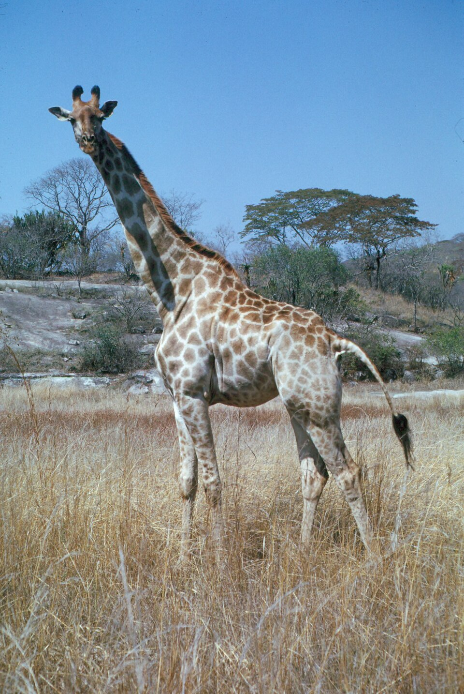

# GoFullPage & screenshot tools

*GoFullPage captures an entire scrollable page - not just the visible viewport - as one stitched image or PDF in a single click. Free, actively maintained in 2026 (v8.6), and the fastest way to attach undeniable visual evidence to a bug report.*

> A bug three scrolls down a page is genuinely hard to describe in words, and a single screenshot only
> ever shows what fit in the viewport when you pressed the key. GoFullPage solves a problem so simple
> it's easy to underrate: capture the WHOLE page — top to bottom, everything that would take five
> scrolls to see — as one image, in one click. Evidence a developer can open once and understand
> completely, instead of piecing together from three cropped screenshots and a paragraph of "scroll
> down a bit."

> **In real life**
>
> Stand next to a giraffe with a normal camera at head height and you get a photo of its knees. Step
> back far enough to fit the WHOLE animal — neck, body, legs, all of it — in one frame, and suddenly
> the photo actually shows what a giraffe is. A full-page screenshot does exactly that for a webpage:
> instead of a cropped view of whatever happened to be on screen, it steps back (by scrolling and
> stitching) until the entire page fits in one honest frame.

**GoFullPage**: GoFullPage is a free browser extension that captures an entire scrollable webpage as a single image or PDF, not just the visible viewport. It works by auto-scrolling through the page, capturing each section, and stitching them into one seamless file - handling complex pages with inner scrollable regions and iframes. Verified alive and actively maintained in 2026 (version 8.6, no ads, minimal permissions).

## Why "just take a screenshot" isn't enough

- **The viewport only shows what fits** — a bug at the bottom of a long form, or a footer element
  overlapping content, is invisible in a normal screenshot unless you happen to scroll to exactly
  the right spot first.
- **Manual scroll-and-stitch is slow and error-prone** — multiple screenshots, cropping overlaps,
  aligning seams in an image editor. GoFullPage does the entire sequence in under two seconds.
- **One file beats a folder of files** — a developer opening ONE full-page image understands
  context instantly; five separate screenshots require them to mentally reassemble the page.
- **Export as image or PDF** — PDF is often the better choice for very long pages (terms-of-service,
  a long article) since PDF viewers handle extreme aspect ratios more gracefully than image viewers.

> **Tip**
>
> Capture a full-page screenshot at the START of a test session for any page you're about to
> regression-test, before you touch anything. If something breaks later, you have an unambiguous
> "before" state to compare against — this costs one click and pays for itself the first time you need it.

> **Common mistake**
>
> Relying on a full-page screenshot as your ONLY evidence for a layout bug, with no note of which
> browser, zoom level, or screen width produced it. A screenshot proves something looked wrong; it
> doesn't reproduce the bug for someone on a different setup. Always pair the image with the exact
> environment (browser, viewport width, zoom) it was captured under.


*Giraffe standing in grass — Wikimedia Commons, CC BY-SA 4.0. [Source](https://commons.wikimedia.org/wiki/File:Giraffe_standing_in_grass_-_DPLA_-_c15db26d625323f71f0e39a086fa5cf3.jpg)*
- **The head — what fits in a normal screenshot** — If you stood too close, this is all you'd capture. A normal viewport screenshot only shows whatever's on screen when you press the key - the top of a long page, usually.
- **The long neck — the scrolled-past middle of the page** — The part between 'what you saw first' and 'what you saw last' - easy to forget exists until something breaks there. A full-page capture includes every inch of it.
- **The legs, standing in the grass — the page's footer/bottom** — The part most likely to be missed entirely without scrolling all the way down - exactly where footer bugs, overlapping elements, and cut-off content tend to hide.
- **The full frame, stepped back to fit everything** — The photographer chose a distance where the WHOLE animal fits - the deliberate choice a full-page tool automates: capture everything, not just what's convenient.

**One GoFullPage capture, start to finish**

1. **Click the extension icon (or Alt+Shift+P)** — On the page you want to capture - works on any scrollable page, including long forms and articles.
2. **The extension auto-scrolls the page** — Section by section, from top to bottom - handling lazy-loaded content and inner scrollable regions as it goes.
3. **Each section is captured and stitched** — Seams aligned automatically - no manual cropping, no visible overlap lines in the final image.
4. **Result opens in a new tab** — One continuous image (or export as PDF) - scroll through it like the original page, but now it's a single static file.
5. **Attach it to the bug report, annotated** — Crop/annotate right there if needed, then attach - permanent evidence that survives even if the live page changes later.

The core mechanic — turning "one long page" into "N viewport-sized captures, stitched" — is just
arithmetic. Here's the exact math the extension runs on your behalf:

*Run it - simulating the scroll-and-stitch sequence (Python)*

```python
def stitch_viewports(page_height, viewport_height):
    captured = 0
    sections = []
    while captured < page_height:
        remaining = page_height - captured
        this_section = min(viewport_height, remaining)
        sections.append((captured, captured + this_section))
        captured += this_section
    return sections

page_height = 3400
viewport_height = 900

sections = stitch_viewports(page_height, viewport_height)

print(f"Page height: {page_height}px | Viewport: {viewport_height}px")
print()
for i, (start, end) in enumerate(sections, 1):
    print(f"  Capture {i}: scroll to y={start:<5} grab {end - start}px (y={start}-{end})")

total_captured = sections[-1][1]
print()
print(f"{len(sections)} scroll-and-capture steps, {total_captured}px stitched into ONE image.")
print("Manually: scroll, screenshot, scroll, screenshot, then align every seam")
print("in an editor. The extension does all of this in under two seconds.")

# Page height: 3400px | Viewport: 900px
#
#   Capture 1: scroll to y=0     grab 900px (y=0-900)
#   Capture 2: scroll to y=900   grab 900px (y=900-1800)
#   Capture 3: scroll to y=1800  grab 900px (y=1800-2700)
#   Capture 4: scroll to y=2700  grab 700px (y=2700-3400)
#
# 4 scroll-and-capture steps, 3400px stitched into ONE image.
# Manually: scroll, screenshot, scroll, screenshot, then align every seam
# in an editor. The extension does all of this in under two seconds.
```

Same logic in Java, on a longer page — the point being: the number of steps scales with page
length, and it's still one click regardless:

*Run it - stitch math for a longer page (Java)*

```java
import java.util.*;

public class Main {
    static List<int[]> stitchViewports(int pageHeight, int viewportHeight) {
        List<int[]> sections = new ArrayList<>();
        int captured = 0;
        while (captured < pageHeight) {
            int remaining = pageHeight - captured;
            int thisSection = Math.min(viewportHeight, remaining);
            sections.add(new int[]{captured, captured + thisSection});
            captured += thisSection;
        }
        return sections;
    }

    public static void main(String[] args) {
        int pageHeight = 5200;
        int viewportHeight = 1080;

        List<int[]> sections = stitchViewports(pageHeight, viewportHeight);

        System.out.println("Page height: " + pageHeight + "px | Viewport: " + viewportHeight + "px");
        System.out.println();
        for (int i = 0; i < sections.size(); i++) {
            int[] s = sections.get(i);
            System.out.printf("  Capture %d: scroll to y=%-5d grab %dpx (y=%d-%d)%n",
                i + 1, s[0], s[1] - s[0], s[0], s[1]);
        }

        int total = sections.get(sections.size() - 1)[1];
        System.out.println();
        System.out.println(sections.size() + " scroll-and-capture steps, " + total + "px stitched into ONE image.");
        System.out.println("A long product page or terms-of-service page becomes ONE");
        System.out.println("reviewable file instead of a folder of disconnected screenshots.");
    }
}

/* Page height: 5200px | Viewport: 1080px

     Capture 1: scroll to y=0     grab 1080px (y=0-1080)
     Capture 2: scroll to y=1080  grab 1080px (y=1080-2160)
     Capture 3: scroll to y=2160  grab 1080px (y=2160-3240)
     Capture 4: scroll to y=3240  grab 1080px (y=3240-4320)
     Capture 5: scroll to y=4320  grab 880px (y=4320-5200)

   5 scroll-and-capture steps, 5200px stitched into ONE image.
   A long product page or terms-of-service page becomes ONE
   reviewable file instead of a folder of disconnected screenshots. */
```

### Your first time: Your mission: capture, annotate, and attach one full-page screenshot

- [ ] Install GoFullPage from the Chrome Web Store (also works in Edge) — Free, no account, no ads - confirm the developer name matches gofullpage.com before installing, same copycat caution as any extension.
- [ ] Open the longest page you can find in BuggyShop — A product listing, a long form, or a terms/FAQ-style page - anywhere a normal screenshot would miss most of the content.
- [ ] Capture it with one click (or Alt+Shift+P) — Watch it auto-scroll and stitch - notice how it handles the page's natural loading/rendering as it goes.
- [ ] Crop and annotate one specific area in the built-in editor — Circle or arrow-highlight a real element - a misaligned button, an overlapping footer - to demonstrate the annotation workflow you'd use for a real bug.
- [ ] Export as both image and PDF and compare — For a very long page, notice which format is actually easier to review - this is the judgment call you'll make in real reports.

You now have a full-page capture with a specific finding annotated — the exact evidence format that
makes a layout bug report land clearly the first time.

- **The capture cuts off partway down a very long or infinite-scroll page.**
  Infinite-scroll pages (endless feeds) don't have a true bottom, so the extension can only capture what's loaded when it reaches the current end - re-run after scrolling manually to load more content first, or accept a bounded capture and note in the report that the page continues beyond it.
- **An element inside an iframe or a nested scrollable panel didn't get captured correctly.**
  Complex embedded content (ads, embedded widgets, chat panels) can behave inconsistently with auto-scroll tools. Capture that region separately with a normal screenshot if the full-page tool visibly misses it, and note the limitation rather than assuming the capture is complete.
- **The stitched image has a visible seam or duplicated content at a scroll boundary.**
  Usually caused by animations, sticky headers, or lazy-loaded images shifting content mid-capture. Try again after the page has fully settled (scroll once manually first, wait a moment), and if it persists, capture the affected section manually as a fallback.
- **You captured a bug, but by the time you finished writing the report, the page had changed and the developer can't see what you saw.**
  This is exactly why the capture itself is the permanent record - attach the actual file to the ticket rather than a link to the live page, and pair it with the exact URL, browser, and timestamp so the discrepancy between 'then' and 'now' is documented, not disputed.

### Where to check

- **The captured file itself, scrolled through fully** — confirm nothing's missing or duplicated before attaching it as evidence; a bad capture is worse than no capture if nobody notices until later.
- **The exact environment string alongside the image** — browser, viewport width, zoom level, OS. A screenshot without this context can't be reliably reproduced by whoever picks up the bug.
- **The extension's own settings** — export format (image vs PDF), and whether it's set to include the full URL/timestamp as a watermark, which some workflows want and others don't.
- **gofullpage.com's changelog** — a legitimately maintained tool publishes version notes; a long silence is worth noticing before you build a workflow around any extension.

### Worked example: a footer overlap bug, invisible without a full capture

1. A tester is verifying a redesigned product page at normal browser height. Scrolling through
   manually, everything looks fine section by section.
2. On a hunch (the page felt "long"), they run GoFullPage and review the STITCHED image as one
   continuous whole rather than section by section.
3. Seeing the full page at once reveals it: the newsletter-signup footer slightly overlaps the last
   product review card — a ~15px overlap invisible when scrolling normally, because by the time
   the footer scrolls into view, the review card has scrolled just out of frame.
4. This is a bug that section-by-section manual scrolling was structurally unable to catch — it only
   exists as a relationship between two elements that are never both fully visible in one viewport
   at once. The full-page capture, and only the full-page capture, exposes it.
5. Report: full-page screenshot attached, with a cropped/circled close-up of the overlap region,
   exact viewport width and browser noted. The developer sees the whole-page context AND the precise
   detail in one message.

**Quiz.** A tester scrolls through a long page manually, section by section, checking that each visible portion looks correct, and concludes the page has no layout bugs. What class of bug can this method structurally miss?

- [ ] Nothing - checking every section as it scrolls into view covers the entire page just as thoroughly as a full-page capture
- [x] Bugs that exist in the RELATIONSHIP between two elements that are never both fully visible in the same viewport at once - like a footer overlapping content that's already scrolled mostly out of frame by the time the footer appears
- [ ] Only bugs in the very first section, since attention is highest there and fades later
- [ ] JavaScript bugs specifically, since scrolling doesn't trigger the same events as a full-page capture

*Section-by-section scrolling shows you each part of the page in isolation, but some bugs only exist in the SPACE BETWEEN sections - an element from earlier in the page slightly overlapping an element much later, a spacing inconsistency only obvious when both are visible together. A full-page capture, viewed as one continuous image, surfaces exactly this class of bug because it presents the whole page at once instead of section by section. Option three invents an unsupported claim about attention fading by page position. Option four is simply incorrect - screenshot tools don't interact with JavaScript execution differently based on scroll behavior; that's not how either scrolling or capture actually works.*

- **GoFullPage — what it does** — Free browser extension that captures an ENTIRE scrollable page (not just the viewport) as one stitched image or PDF, in one click - auto-scrolls, captures each section, and seamlessly combines them. Alive and maintained in 2026 (v8.6).
- **Why a full-page capture catches bugs manual scrolling misses** — Some bugs live in the relationship between two elements that are never both visible in the viewport at once (e.g. a footer overlapping content scrolled mostly out of frame) - only visible when the WHOLE page is viewed at once.
- **What a screenshot alone does NOT prove** — Reproducibility. A screenshot shows something looked wrong; it says nothing about browser, viewport width, or zoom level unless you note those separately alongside it.
- **Image vs PDF export - when to prefer which** — PDF often handles very long/extreme-aspect-ratio pages more gracefully in viewers; image is simpler for shorter pages and quick annotation. Try both on a long page to see which reviews more easily.
- **The infinite-scroll capture limitation** — Pages with no true bottom (endless feeds) can only be captured up to whatever's loaded at capture time - scroll to load more first, or note in the report that the page continues beyond the capture.
- **Why to capture a 'before' screenshot at the START of a test session** — One click, and it gives you an unambiguous baseline to compare against if something breaks later in the session - cheap insurance against 'did this look different before?' uncertainty.

### Challenge

Find or create a page in BuggyShop tall enough that at least 4 viewport-heights of scrolling are
needed to see it all. Capture it with GoFullPage, then deliberately try to find a bug that's only
visible in the STITCHED full view and not from scrolling section-by-section (a spacing issue between
distant elements, an overlap, an inconsistency in how two sections align). Write up whatever you find
with the full-page image attached and the specific region annotated.

### Ask the community

> I captured a full-page screenshot of `[page]` with GoFullPage and found `[what you observed]`, but I'm not sure if it's `[a real layout bug / a capture artifact from lazy-loading or animation]`. Has anyone seen this kind of stitching issue before, and how do you tell the difference?

Stitching artifacts and real layout bugs can look similar at first glance — the most useful answers
will help you distinguish a genuine bug from a known capture-tool quirk before you file it.

- [GoFullPage — official site](https://gofullpage.com/)
- [GoFullPage — Chrome Web Store listing](https://chromewebstore.google.com/detail/gofullpage-full-page-scre/fdpohaocaechififmbbbbbknoalclacl)
- [DIY Websites Pro — How to use GoFullPage for full-length screenshots](https://www.youtube.com/watch?v=2TdjBE9GSK8)

🎬 [How to Take Full-Page Screenshots with GoFullPage Chrome Extension — Step-by-Step Guide (Repair My Funnel)](https://www.youtube.com/watch?v=l8K3VRGFGN0) (5 min)

- GoFullPage captures an entire scrollable page - not just the viewport - as one stitched image or PDF in a single click. Free, no ads, actively maintained in 2026 (v8.6).
- It catches a bug class manual scrolling structurally can't: relationships between elements that are never both visible in the same viewport at once.
- A screenshot alone doesn't prove reproducibility - always pair it with the exact browser, viewport width, and zoom used to capture it.
- Infinite-scroll pages can only be captured up to whatever's loaded - scroll to load more first, or note the limitation.
- PDF export often handles very long pages better than image export; try both and pick whichever reviews more easily.


## Related notes

- [[Notes/testers-toolbox/link-page-ui-checks/check-my-links|Check My Links]]
- [[Notes/testers-toolbox/link-page-ui-checks/window-resizer-responsive-checks|Window Resizer & responsive checks]]
- [[Notes/defect-management/writing-bug-reports/evidence|Evidence]]


---
_Source: `packages/curriculum/content/notes/testers-toolbox/link-page-ui-checks/gofullpage-and-screenshots.mdx`_
