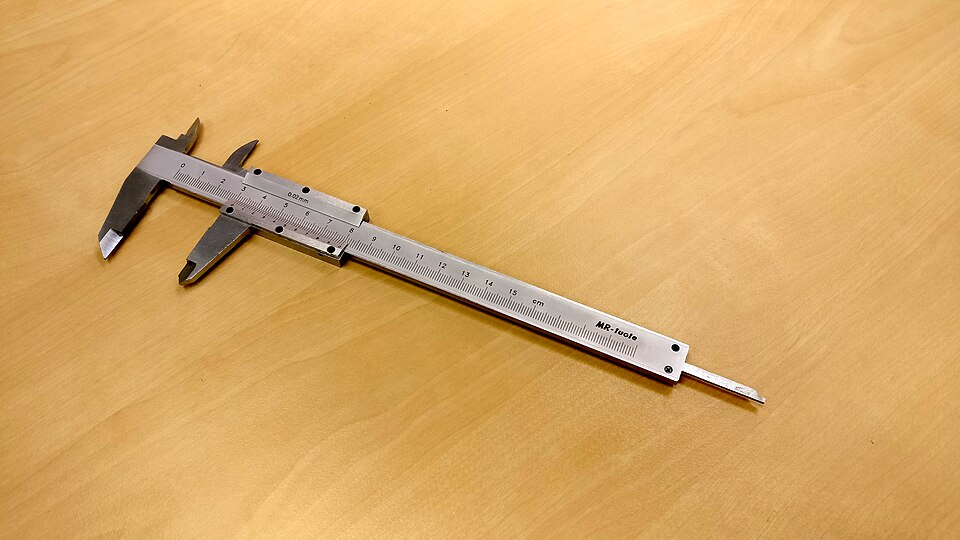

# WhatFont, PerfectPixel & Page Ruler

*Three precision-measurement extensions for design QA: WhatFont identifies any font on a page with a hover, Page Ruler measures pixel distances by drawing a rectangle, and PerfectPixel overlays a design comp for direct comparison. All three verified alive in 2026.*

> "That looks off" is a real observation and a useless bug report. A developer or designer needs a
> NUMBER: this button is 40px tall, the spec says 44px. This font renders as Arial, the spec says
> Inter. These three tools exist to convert "looks off" into an exact, arguable, fixable measurement —
> the difference between a report that gets closed as "can't reproduce" and one that gets fixed in ten
> minutes.

> **In real life**
>
> A vernier caliper doesn't just tell you something is "about two centimeters" — it reads to a
> fraction of a millimeter, because in manufacturing "about right" and "right" are entirely different
> categories, and only measurement tells them apart. Design implementation works the same way: a
> button that's "close enough" by eye might be 4 pixels short of spec, and only a real measurement
> tool — not squinting — reveals whether "close enough" is actually correct.

**precision measurement tools**: This chapter covers three distinct pixel-precision tools: WhatFont (hover over any text to see its exact font family, size, weight, and line-height), Page Ruler (draw a rectangle over any page region to read its exact width, height, and position in pixels), and PerfectPixel (overlay a semi-transparent design comp image directly on top of the live page to compare pixel-for-pixel). All three are free browser extensions, verified alive and maintained in 2026.

## Three tools, three questions

- **WhatFont** answers "what font IS this?" — hover over any text and it displays the computed
  font family, size, weight, and line-height instantly, no DevTools digging required.
- **Page Ruler** answers "how big/far IS this?" — draw a rectangle over any element or gap and read
  its exact pixel width, height, and position, directly on the page.
- **PerfectPixel** answers "does this MATCH the design?" — overlay the actual design file (a PNG/JPG
  export from Figma or similar) on top of the live page at adjustable opacity, and see every
  divergence at once, in place.

> **Tip**
>
> Use them in sequence, not just individually: PerfectPixel's overlay tells you THAT something's off
> and roughly where; Page Ruler tells you exactly how many pixels off; WhatFont tells you whether a
> text mismatch is a font-family problem, a size problem, or both. Together they turn one vague
> visual impression into three precise, independently verifiable facts.

> **Common mistake**
>
> Reporting "the spacing looks wrong" without a measurement, when a 30-second Page Ruler check would
> have produced "expected 24px top margin per spec, measured 30px" — a claim nobody can argue with,
> attached to a report nobody can dismiss as subjective.


*Vernier caliper 2016 — Wikimedia Commons, CC BY-SA 4.0. [Source](https://commons.wikimedia.org/wiki/File:Vernier_caliper_2016.jpg)*
- **The jaws — measuring a specific gap or element** — Closed precisely around whatever's being measured - the same role Page Ruler plays when you draw its rectangle over a button, a margin, or a gap between elements to read its exact pixel size.
- **The main scale — the coarse reading** — Whole centimeters and millimeters, readable at a glance - like WhatFont's first answer: 'this text is 16px, Arial.' A useful, quick fact, but not yet the FULL precision story.
- **The vernier scale — the fine, exact reading** — The sliding secondary scale that resolves the measurement down to a fraction of a millimeter - the equivalent of PerfectPixel's overlay revealing an exact few-pixel offset invisible to the naked eye alone.
- **The full length of the tool, laid flat and visible** — One instrument doing the whole measuring job, start to finish - the point of all three tools in this note: replace a subjective glance with an objective, repeatable number.

**Diagnosing a 'this looks off' report properly**

1. **Get the design spec** — A Figma export, a design doc, or exact stated values (font, size, spacing, color) - the source of truth to measure against.
2. **PerfectPixel: overlay the design comp** — Load the design image, drop opacity to ~50%, and see every divergence between spec and live page in place, at a glance.
3. **Page Ruler: measure the specific gap** — Draw a rectangle over the divergent element - read its exact width/height/position in pixels, compared against the spec's stated value.
4. **WhatFont: check if text is involved** — Hover the mismatched text - confirm whether it's a font-family swap, a size difference, or both.
5. **Report with all three numbers** — Spec value, measured value, and the exact pixel/font delta - a claim a developer can verify and fix without guessing.

The core of a "spec vs measured" comparison is just a dictionary diff. Here it is, catching exactly
the kind of small, easy-to-miss drift these tools are built to surface:

*Run it - comparing a design spec against measured values (Python)*

```python
design_spec = {
    "button_width_px": 120,
    "button_height_px": 44,
    "font_family": "Inter",
    "font_size_px": 16,
    "margin_top_px": 24,
}

measured_live = {
    "button_width_px": 120,
    "button_height_px": 40,
    "font_family": "Arial",
    "font_size_px": 16,
    "margin_top_px": 30,
}

print("Design spec vs measured live page (WhatFont + Page Ruler results):")
print()
mismatches = []
for key in design_spec:
    spec_val = design_spec[key]
    live_val = measured_live[key]
    match = "OK" if spec_val == live_val else "MISMATCH"
    print(f"  {key:<20} spec={spec_val!s:<8} live={live_val!s:<8} {match}")
    if spec_val != live_val:
        mismatches.append((key, spec_val, live_val))

print()
print(f"{len(mismatches)} mismatch(es) found:")
for key, spec_val, live_val in mismatches:
    print(f"  - {key}: expected {spec_val}, got {live_val}")
print()
print("font_family is the loud one (Arial instead of Inter is visible")
print("to anyone), but the 4px height and 6px margin differences are")
print("exactly the kind of 'looks close enough' gap only measurement catches.")

# Design spec vs measured live page (WhatFont + Page Ruler results):
#
#   button_width_px      spec=120      live=120      OK
#   button_height_px     spec=44       live=40       MISMATCH
#   font_family          spec=Inter    live=Arial    MISMATCH
#   font_size_px         spec=16       live=16       OK
#   margin_top_px        spec=24       live=30       MISMATCH
#
# 3 mismatch(es) found:
#   - button_height_px: expected 44, got 40
#   - font_family: expected Inter, got Arial
#   - margin_top_px: expected 24, got 30
#
# font_family is the loud one (Arial instead of Inter is visible
# to anyone), but the 4px height and 6px margin differences are
# exactly the kind of 'looks close enough' gap only measurement catches.
```

Same comparison in Java, on a card component where most values match and only two drift by a few
pixels — the realistic case, not the dramatic one:

*Run it - a mostly-correct component with two small drifts (Java)*

```java
import java.util.*;

public class Main {
    public static void main(String[] args) {
        Map<String, String> spec = new LinkedHashMap<>();
        spec.put("card_width_px", "320");
        spec.put("card_padding_px", "16");
        spec.put("heading_font", "Bricolage Grotesque");
        spec.put("heading_size_px", "24");
        spec.put("border_radius_px", "8");

        Map<String, String> measured = new LinkedHashMap<>();
        measured.put("card_width_px", "320");
        measured.put("card_padding_px", "12");
        measured.put("heading_font", "Bricolage Grotesque");
        measured.put("heading_size_px", "22");
        measured.put("border_radius_px", "8");

        System.out.println("Design spec vs measured live page:");
        System.out.println();
        List<String> mismatches = new ArrayList<>();
        for (String key : spec.keySet()) {
            String specVal = spec.get(key);
            String liveVal = measured.get(key);
            String verdict = specVal.equals(liveVal) ? "OK" : "MISMATCH";
            System.out.printf("  %-18s spec=%-22s live=%-22s %s%n", key, specVal, liveVal, verdict);
            if (!specVal.equals(liveVal)) mismatches.add(key);
        }

        System.out.println();
        System.out.println(mismatches.size() + " mismatch(es) found: " + mismatches);
        System.out.println();
        System.out.println("Font family and width matched exactly - padding and heading");
        System.out.println("size drifted by a few pixels each. Small enough to miss by eye,");
        System.out.println("large enough that a designer will flag it in review.");
    }
}

/* Design spec vs measured live page:

     card_width_px      spec=320                    live=320                    OK
     card_padding_px    spec=16                     live=12                     MISMATCH
     heading_font       spec=Bricolage Grotesque    live=Bricolage Grotesque    OK
     heading_size_px    spec=24                     live=22                     MISMATCH
     border_radius_px   spec=8                      live=8                      OK

   2 mismatch(es) found: [card_padding_px, heading_size_px]

   Font family and width matched exactly - padding and heading
   size drifted by a few pixels each. Small enough to miss by eye,
   large enough that a designer will flag it in review. */
```

### Your first time: Your mission: measure one real component against its spec

- [ ] Install WhatFont and Page Ruler (both free, Chrome Web Store) — PerfectPixel too, if you have a design comp image handy to overlay - otherwise the first two are enough to start.
- [ ] Pick one component in BuggyShop with a knowable spec — A button, a card, a heading - anything you can find a stated size/font/spacing for, or reasonably infer from surrounding consistent elements.
- [ ] Hover it with WhatFont and note the exact font, size, and weight — Read the full popup, not just the family name - size and weight drift just as often as family.
- [ ] Draw a Page Ruler rectangle over it and note exact width/height — Compare against whatever spec value you have - even 'it should roughly match this OTHER button's height' counts as a spec to check against.
- [ ] Write the finding as a spec-vs-measured pair, not an impression — 'Expected 44px, measured 40px' - not 'the button looks a bit short.' That's the entire point of this chapter's tools.

You've converted a visual impression into an exact, defensible measurement — the skill that makes
design-QA reports actually actionable.

- **WhatFont shows a generic fallback font name (like 'sans-serif') instead of a specific font.**
  This usually means the intended web font failed to load - a real finding, not a tool failure. Check the network tab for a failed font file request before assuming WhatFont is wrong; a fallback font IS the bug in this case.
- **Page Ruler's rectangle doesn't align cleanly with the element's actual edges.**
  Zoom the browser to 100% first (browser zoom skews on-page pixel measurement tools) and be deliberate about whether you're measuring the CONTENT box or including padding/border - Page Ruler measures what you draw, not what you meant, so draw carefully to the exact edge you intend.
- **PerfectPixel's overlay doesn't line up no matter how you position it.**
  Confirm the design comp image was exported at the SAME scale/resolution as the live page's viewport (a comp exported at 2x will never align with a 1x-rendered page without adjustment) - scale mismatch, not misalignment, is the most common cause.
- **A measurement looks wrong on one monitor but correct on another.**
  Display scaling (125%/150% Windows scaling, Retina scaling on macOS) can affect what a measurement tool reports versus the page's actual CSS pixel values. When in doubt, cross-check the same measurement via DevTools' computed styles panel, which reports true CSS values regardless of display scaling.

### Where to check

- **DevTools' Computed styles panel** — the ground truth for a rendered element's actual font, size, and box dimensions, useful for cross-checking any of these three tools' readings.
- **The original design file** (Figma, Sketch, or similar) — the actual source of truth these tools compare against; always confirm you're checking against the CURRENT version, not an outdated export.
- **The network tab, for font-related mismatches** — a wrong-looking font is very often a failed font file load, visible immediately in network requests.
- **Browser zoom level (should be 100%)** before any pixel measurement — zoom distorts on-page measurement tools in ways that are easy to forget mid-session.

### Worked example: turning 'the button looks small' into a filed, fixed bug

1. A tester reviewing a checkout page feels the "Place Order" button looks slightly smaller than
   its counterpart on the cart page. A pure impression — not yet reportable.
2. Page Ruler on the checkout button: 120×40px. Page Ruler on the cart page's equivalent button:
   120×44px. Same width, 4px height difference confirmed with numbers.
3. WhatFont on both: identical font family and size (16px, Inter, weight 500) — so the difference
   is purely a sizing/padding issue, not a typography one. Narrows the likely cause to CSS padding
   or a line-height difference, not a font swap.
4. PerfectPixel confirms visually: overlaying the cart page's button shape onto the checkout button
   at 50% opacity shows the checkout button sitting 4px short at the bottom edge specifically —
   likely a missing bottom-padding value in that component's specific instance.
5. Report: "Checkout page 'Place Order' button measures 120×40px; the equivalent cart-page button
   measures 120×44px with identical font/size (16px Inter 500) — likely a missing 4px bottom
   padding on the checkout instance specifically." A developer can go straight to the CSS with
   zero further investigation needed.

**Quiz.** A tester notices a heading 'looks a little big' on a page, uses WhatFont, and confirms it's rendering as 28px when the design spec says 24px. They report: 'Heading font looks off, might need adjustment.' What's the problem with this report given what they already measured?

- [ ] Nothing - the report correctly flags that something needs adjustment
- [x] The report throws away the exact measurement already taken - it should state the precise spec-vs-measured numbers (24px expected, 28px actual) instead of reverting to a vague impression, since the whole value of these tools is producing a claim nobody has to guess at or re-measure
- [ ] The tester should have also checked the font FAMILY, since size alone is never worth reporting on its own
- [ ] WhatFont cannot be trusted for size measurements, only font family identification

*The entire point of running WhatFont was to get an exact, verifiable number - reverting to 'looks off, might need adjustment' in the report discards that precision and puts the developer right back to guessing or re-measuring themselves. The correct report states both values directly: '24px expected, 28px measured.' Option three is an overreach - checking font family is often worthwhile, but it doesn't make a precise SIZE finding worthless on its own; a size-only mismatch is still a fully valid, fixable finding. Option four is factually wrong - WhatFont's whole function includes reporting the exact rendered font size, which is precisely the number this tester correctly obtained before oddly discarding it in the write-up.*

- **WhatFont / Page Ruler / PerfectPixel — one-line job each** — WhatFont: what font is this (hover, see family/size/weight/line-height). Page Ruler: how big/far is this (draw a rectangle, read exact pixels). PerfectPixel: does this match the design (overlay the comp at adjustable opacity).
- **Why 'looks off' reports get dismissed and measured ones don't** — A measurement (expected 24px, measured 28px) is an objective, independently verifiable claim. An impression ('looks a bit big') invites a developer to disagree by eye with no way to settle it.
- **The recommended tool sequence for a visual mismatch** — PerfectPixel overlay to spot THAT and roughly WHERE something's off -> Page Ruler to get the exact pixel delta -> WhatFont if text is involved, to isolate font-family vs size vs weight.
- **Why a WhatFont fallback font name (e.g. 'sans-serif') is itself a finding** — It usually means the intended web font failed to load - check the network tab for a failed font request; the fallback IS the bug, not a tool glitch.
- **Why browser zoom must be at 100% before pixel measurement** — Browser zoom distorts what on-page measurement tools report - always reset to 100% first, and cross-check against DevTools' Computed styles panel (true CSS values) if a reading looks suspicious.
- **Why a PerfectPixel overlay might never align even when positioned carefully** — Scale mismatch between the design comp's export resolution and the live page's rendered viewport (e.g. a 2x comp against a 1x page) - confirm export scale before assuming misalignment is a bug.

### Challenge

Pick one component in BuggyShop and treat it as a full design-QA review: measure its font
(WhatFont), its exact dimensions (Page Ruler), and — if you can produce or find a rough design
comp — overlay it (PerfectPixel). Write a single finding in the "expected X, measured Y" format for
at least one dimension, following this note's worked-example structure exactly.

### Ask the community

> I measured `[component]` at `[measured value]` against a spec of `[expected value]` using `[tool]`. Is a difference of `[delta]` typically worth filing as a design-QA bug, or is that within normal acceptable tolerance for this kind of element?

Tolerance for small pixel/font drift varies by team and component type — the most useful answers
will tell you what threshold this specific team or design system actually treats as worth fixing.

- [WhatFont — Chrome Web Store listing](https://chromewebstore.google.com/detail/whatfont/cnchnbcmhjadlbdbcebikmkbdlaajnni)
- [PerfectPixel by WellDoneCode — official site](https://www.welldonecode.com/)
- [eccorem project — Page Ruler browser extension review](https://www.youtube.com/watch?v=xT2fPmnvl5E)

🎬 [WhatFont Chrome Extension — Instantly Detect Any Website Font (Webcrux Technology)](https://www.youtube.com/watch?v=AJxPHGG8KN8) (2 min)

- Three distinct precision tools: WhatFont (identify a font by hovering), Page Ruler (measure exact pixel distances by drawing a rectangle), PerfectPixel (overlay a design comp for direct comparison) - all free, verified alive in 2026.
- Use them in sequence: overlay to spot THAT something's off, ruler to get the exact delta, font tool to isolate whether text is the cause.
- A measured report ('expected 24px, measured 28px') is objective and actionable; a visual impression ('looks a bit big') invites endless disagreement.
- A fallback font name from WhatFont usually signals a failed font-file load - check the network tab, don't assume tool error.
- Always reset browser zoom to 100% before pixel measurement, and cross-check suspicious readings against DevTools' Computed styles panel.


## Related notes

- [[Notes/testers-toolbox/link-page-ui-checks/window-resizer-responsive-checks|Window Resizer & responsive checks]]
- [[Notes/ui-ux-design-qa/design-qa-in-practice/reading-a-figma-spec|Reading a Figma spec]]
- [[Notes/ui-ux-design-qa/design-qa-in-practice/checking-spacing-states-and-breakpoints|Checking spacing, states & breakpoints]]


---
_Source: `packages/curriculum/content/notes/testers-toolbox/link-page-ui-checks/whatfont-perfectpixel-page-ruler.mdx`_
