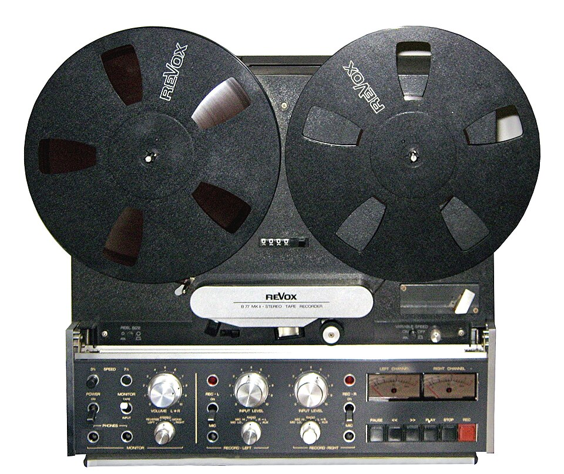

# Recorder extensions

*Chrome DevTools' built-in Recorder captures clicks and typing and exports runnable Puppeteer code - free, no install, no account. Selenium IDE, the older record-and-replay standard, is now considered deprecated for this role in 2026.*

> Watching yourself click through a checkout flow and having that turn into runnable code, automatically,
> is one of the closest things testing has to magic. Chrome's built-in DevTools Recorder does exactly
> this — record clicks and typing, replay them, export as a Puppeteer or Playwright script — with zero
> install and zero account. Selenium IDE used to be the default tool for this job; in 2026 it's
> considered a legacy option, and the DevTools Recorder (plus Playwright's own codegen, covered next)
> has taken its place as the free, actively-maintained standard.

> **In real life**
>
> A reel-to-reel tape recorder captures sound exactly as it happened — every word, pause, and
> background noise, unedited, in the order it occurred. That raw tape is genuinely useful, but nobody
> ships a raw field recording as a finished radio segment; someone always trims it, adds structure,
> and edits out the parts that don't belong. A recorded browser session is the exact same kind of raw
> material: real, accurate, and useful — and still just the first pass, not the final product.

**DevTools Recorder**: Chrome DevTools Recorder is a free, built-in panel (no extension, no account) that records a sequence of user actions - clicks, typing, navigation - as you interact with a page, replays them on demand, and exports the sequence as JSON or as a runnable Puppeteer script. It ships with every modern Chrome/Edge browser. Selenium IDE, the older record-and-replay browser extension, is now widely considered deprecated for new work as of 2026 - its recording capability still functions, but the ecosystem has moved toward DevTools Recorder and framework-native tools like Playwright codegen.

## What recording actually captures, and what it doesn't

- **Captures**: clicks, text input, navigation, and the exact selector used to target each element
  at the moment of recording.
- **Replays**: the same sequence, on demand, useful for a quick manual regression check without
  re-performing every click by hand.
- **Exports**: as JSON (a portable, tool-agnostic format) or as a Puppeteer script (real, runnable
  JavaScript) — either way, a starting point you take away and keep working with.
- **Does NOT capture**: assertions. A recorder faithfully records what you DID; it has no way to
  know what you expected to happen as a result. Verification is always a manual addition afterward.

> **Tip**
>
> Use a recording session as a fast way to discover the exact selectors a real user flow touches —
> even if you never use the exported script as-is. Recording once and reading the generated selectors
> can be faster than manually inspecting each element in a multi-step flow one at a time.

> **Common mistake**
>
> Treating an exported recording as a finished, maintainable test and committing it to a test suite
> unedited. A raw recording typically has zero assertions, often includes accidental clicks or
> unnecessary waits, and frequently uses whatever selector happened to be easiest for the recorder to
> grab — not necessarily the most stable one. Every recording needs a human editing pass before it
> belongs in a real suite.


*Revox B77 MK II reel-to-reel audio tape recorder — Wikimedia Commons, CC BY-SA 3.0. [Source](https://commons.wikimedia.org/wiki/File:Revox_B77_MK_II_reel-to-reel_audio_tape_recorder,_ca._1982_(cropped_and_edited).jpg)*
- **The loaded tape reels — the raw recorded session** — Everything that happened during recording, captured faithfully and completely - exactly what a DevTools recording session holds: every click and keystroke, unedited, in original order.
- **The REC / PLAY / STOP buttons — start, replay, and stop a session** — The literal controls this whole note describes: start recording, replay what was captured, stop when the flow is complete - identical mental model, decades-old interface.
- **The volume/input dials — tuning what gets captured** — Recording quality depends on how the input is configured before you start - the same way a recorder's selector-capture quality depends on the state of the page and elements available at record time.
- **The nameplate: 'Stereo Tape Recorder' — a tool built for ONE job** — Recording is its whole purpose - not editing, not mixing, not mastering. A browser recorder's job is equally narrow: capture the actions. Turning that into a polished, assertion-bearing test is a separate, human step.

**From a recorded session to something worth keeping**

1. **Open DevTools, go to the Recorder panel** — Chrome/Edge, built in - no extension needed. Click 'Start new recording,' name it.
2. **Perform the real user flow** — Click, type, navigate exactly as a real user would - the recorder captures each action and its selector.
3. **Stop and replay to sanity-check** — Does replaying the recording actually reproduce the flow correctly? Confirms the capture was clean before exporting.
4. **Export as JSON or Puppeteer script** — The raw material - selectors and actions, faithfully captured, zero assertions, zero cleanup yet.
5. **Edit by hand: add assertions, fix selectors, remove noise** — The step that turns a recording into an actual maintainable test - never optional, always required.

The gap between "what a recorder captures" and "what a real test needs" is the whole lesson here.
See it directly:

*Run it - a recorded session, converted to script lines (Python)*

```python
recorded_steps = [
    {"action": "click", "selector": "#login-btn"},
    {"action": "fill", "selector": "input[name=email]", "value": "qa@example.com"},
    {"action": "fill", "selector": "input[name=password]", "value": "hunter2"},
    {"action": "click", "selector": "button[type=submit]"},
]

def recorder_to_script_line(step):
    if step["action"] == "click":
        return f"page.click('{step['selector']}')"
    if step["action"] == "fill":
        return f"page.fill('{step['selector']}', '{step['value']}')"
    return f"# unknown action: {step['action']}"

print("What a recorder captures (raw steps):")
for step in recorded_steps:
    print(f"  {step}")

print()
print("What that becomes as a real script (one line per step):")
for step in recorded_steps:
    print(f"  {recorder_to_script_line(step)}")

print()
print("A recording is a STARTING POINT, not the final artifact - a maintainer")
print("still needs to add assertions, remove hardcoded waits, and replace")
print("brittle selectors before this becomes a real, durable test.")

# What a recorder captures (raw steps):
#   {'action': 'click', 'selector': '#login-btn'}
#   {'action': 'fill', 'selector': 'input[name=email]', 'value': 'qa@example.com'}
#   {'action': 'fill', 'selector': 'input[name=password]', 'value': 'hunter2'}
#   {'action': 'click', 'selector': 'button[type=submit]'}
#
# What that becomes as a real script (one line per step):
#   page.click('#login-btn')
#   page.fill('input[name=email]', 'qa@example.com')
#   page.fill('input[name=password]', 'hunter2')
#   page.click('button[type=submit]')
#
# A recording is a STARTING POINT, not the final artifact - a maintainer
# still needs to add assertions, remove hardcoded waits, and replace
# brittle selectors before this becomes a real, durable test.
```

Same lesson in Java, on a promo-code flow — and note explicitly what's MISSING from the raw output:

*Run it - a recorded promo-code flow, and what it's missing (Java)*

```java
import java.util.*;

public class Main {
    public static void main(String[] args) {
        List<Map<String, String>> steps = new ArrayList<>();
        steps.add(Map.of("action", "goto", "value", "/checkout"));
        steps.add(Map.of("action", "click", "selector", "#add-promo-code"));
        steps.add(Map.of("action", "fill", "selector", "input[name=promo]", "value", "SAVE10"));
        steps.add(Map.of("action", "click", "selector", "button.apply-promo"));

        System.out.println("What a recorder captures (raw steps):");
        for (Map<String, String> step : steps) {
            System.out.println("  " + step);
        }

        System.out.println();
        System.out.println("What that becomes as a Selenium/Playwright-style script line:");
        for (Map<String, String> step : steps) {
            String action = step.get("action");
            if (action.equals("goto")) {
                System.out.println("  page.navigate(\\"" + step.get("value") + "\\");");
            } else if (action.equals("click")) {
                System.out.println("  page.click(\\"" + step.get("selector") + "\\");");
            } else if (action.equals("fill")) {
                System.out.println("  page.fill(\\"" + step.get("selector") + "\\", \\"" + step.get("value") + "\\");");
            }
        }

        System.out.println();
        System.out.println("Missing from the raw recording: an assertion that SAVE10 actually");
        System.out.println("applied a discount. Recorders capture ACTIONS, never verification -");
        System.out.println("that part is always added by hand, every time.");
    }
}

/* What a recorder captures (raw steps):
     {value=/checkout, action=goto}
     {selector=#add-promo-code, action=click}
     {value=SAVE10, selector=input[name=promo], action=fill}
     {selector=button.apply-promo, action=click}

   What that becomes as a Selenium/Playwright-style script line:
     page.navigate("/checkout");
     page.click("#add-promo-code");
     page.fill("input[name=promo]", "SAVE10");
     page.click("button.apply-promo");

   Missing from the raw recording: an assertion that SAVE10 actually
   applied a discount. Recorders capture ACTIONS, never verification -
   that part is always added by hand, every time. */
```

### Your first time: Your mission: record, export, and edit one real flow

- [ ] Open DevTools on BuggyShop and go to the Recorder panel — Chrome/Edge - no extension needed. If the panel isn't visible, use the '⋮' overflow menu to find it, or Cmd/Ctrl+Shift+P and search 'Show Recorder'.
- [ ] Start a new recording and perform a short real flow — Something like: view a product, add to cart, open the cart. Keep it short for your first attempt.
- [ ] Stop recording and click Replay to confirm it works — Watch it re-perform your actions - this is the sanity check before you trust the export.
- [ ] Export as a Puppeteer script (or JSON) and open it in an editor — Read through every line - identify exactly which selectors got captured for each step.
- [ ] Add ONE real assertion by hand — e.g. confirm the cart count increased, or a success message appeared - the thing the recorder itself could never know to check.

You've experienced firsthand the gap this note is about: a recording is real, accurate raw material —
and still requires a human pass before it's an actual test.

- **Replaying a recording fails partway through, even though the manual flow still works.**
  The page likely changed since recording (an element moved, a selector became stale) - this is expected wear, not a recorder bug. Re-record the affected portion rather than trying to hand-patch a stale recording indefinitely.
- **The exported script includes selectors that look overly specific or fragile (long chained CSS paths).**
  Recorders often grab whatever selector uniquely identifies the element AT THAT MOMENT, not necessarily the most maintainable one. Cross-check fragile-looking selectors against SelectorsHub or a console $$() check (from this chapter's earlier notes) and swap in a more stable one during your editing pass.
- **A recording includes steps you didn't mean to perform (an accidental click, a stray keystroke).**
  This is common and expected - review the exported step list line by line and delete anything unintentional before treating the script as a starting point. Never assume a raw recording is clean without reading it first.
- **You're evaluating whether to migrate an old Selenium IDE suite to something else.**
  Selenium IDE recordings still technically run, but the tool is considered legacy for new work in 2026 - for NEW automation, prefer DevTools Recorder or Playwright codegen (next note). Migrating an existing large IDE suite is a bigger decision; weigh it against how actively that suite is maintained and how much value re-recording from scratch would add.

### Where to check

- **The Recorder panel's replay output** — the fastest sanity check that a recording captured what you intended before you export anything.
- **Each exported selector, individually** — cross-reference against SelectorsHub or a console `$$()` check for stability before trusting it in a maintained script.
- **The exported script's action list, read top to bottom** — the only reliable way to catch accidental clicks or unintended steps before they become permanent parts of a test.
- **Whatever the flow was SUPPOSED to verify** — always the missing piece in a raw recording; write it down as an assertion before considering the script finished.

### Worked example: a recording that looked done, but wasn't

1. A tester records a "forgot password" flow: navigate to login, click "Forgot password," enter an
   email, click submit. Export as a Puppeteer script.
2. Replaying the raw export "works" — no errors, all clicks succeed, the flow completes without
   crashing.
3. But reading the exported code reveals it: there's no check that a confirmation message actually
   appeared, or that an email was actually triggered. The script clicks through the flow and stops —
   it never confirms the flow SUCCEEDED, only that it didn't error.
4. This is exactly the gap this note describes: a recording captures actions, never outcomes. A
   script with zero assertions will "pass" even if the feature is completely broken downstream,
   because nothing in it ever checks the actual result.
5. Fix: add one assertion — confirm the "Check your email" confirmation text appears after
   submission. Now the script actually verifies something, instead of just performing motions that
   happen not to throw an error.

**Quiz.** A tester records a checkout flow, replays it successfully with no errors, and commits the exported script directly to the test suite without further changes. What's the most likely problem with this test, regardless of how well the recording itself worked?

- [ ] None - if the replay succeeded with no errors, the exported script is a complete and valid test
- [x] The exported script almost certainly contains zero assertions - it will 'pass' by successfully performing the clicks and typing, even if the checkout is actually broken downstream, because a recorder captures ACTIONS, never the verification that those actions produced the correct RESULT
- [ ] The script needs to be re-recorded on a different browser before it can be trusted
- [ ] Recorded scripts can never be committed to a test suite and must always be entirely hand-written instead

*A recorder's fundamental limitation, emphasized throughout this note, is that it captures what a user DID, never what the user expected to happen as a result. A script with no assertions will report 'success' as long as every click/fill action completes without throwing an error - it says nothing about whether the checkout actually processed correctly, a discount applied, or a confirmation appeared. Option one ignores this exact gap. Option three is an invented, unsupported requirement - cross-browser concerns are a separate, real testing consideration but have nothing to do with the missing-assertions problem here. Option four overcorrects - this note explicitly treats a recording as a valid, time-saving STARTING POINT; the guidance is to edit and add assertions, not to discard the recording technique altogether.*

- **Chrome DevTools Recorder — what it is** — A free, built-in DevTools panel (no extension, no account) that records clicks/typing/navigation, replays them, and exports as JSON or a Puppeteer script. Ships with every modern Chrome/Edge.
- **Selenium IDE's 2026 status** — Considered deprecated/legacy for new automation work - still technically functional, but the ecosystem has moved to DevTools Recorder and framework-native tools like Playwright codegen as the actively-maintained free standards.
- **What a recorder captures vs. what it can never capture** — Captures: exact actions and the selectors used at record time (clicks, typing, navigation). Never captures: assertions - a recorder has no way to know what OUTCOME you expected, only what you DID.
- **Why a raw recording that 'replays successfully' can still be a bad test** — Zero assertions means the script only verifies actions didn't error - it says nothing about whether the feature actually worked correctly. This is the single most common recording pitfall.
- **The mandatory editing pass after any recording** — Read every exported step, remove accidental/unintended actions, swap fragile selectors for stable ones, and add at least one real assertion - a recording is a starting draft, never a finished test.
- **A legitimate use of recording beyond producing a final script** — Fast selector discovery - recording a flow once and reading the captured selectors can be quicker than manually inspecting each element individually, even if you never keep the recorded script itself.

### Challenge

Record a two-to-three-step flow in BuggyShop using DevTools Recorder, export it as a Puppeteer
script, and read through every line. List every selector it captured, judge each for stability
(using this chapter's earlier notes' criteria), and write the ONE assertion the raw recording is
missing that would actually verify the flow succeeded.

### Ask the community

> I recorded `[flow]` with DevTools Recorder and the exported script uses `[selector/approach]`. Is this considered maintainable by teams that rely on recorded starting points, or is a full hand-rewrite generally expected before this kind of script goes into a real suite?

Teams vary widely on how much of a recorded script they keep vs. rewrite — the most useful answers
will share their actual editing checklist for turning a recording into something they'd trust in CI.

- [Chrome for Developers — Record, replay, and measure user flows (official docs)](https://developer.chrome.com/docs/devtools/recorder)
- [Chrome for Developers — DevTools Recorder features reference](https://developer.chrome.com/docs/devtools/recorder/reference)
- [Automation Step by Step — How to Record & Replay web tests on Chrome DevTools Recorder](https://www.youtube.com/watch?v=ayViRadGGJQ)

🎬 [Record and Replay in Chrome Browser — Chrome DevTools Recorder (Naveen AutomationLabs)](https://www.youtube.com/watch?v=2z4kDtrM4bc) (26 min)

- Chrome DevTools Recorder is free and built-in (no extension) - records clicks/typing/navigation, replays on demand, exports as JSON or a runnable Puppeteer script.
- Selenium IDE is considered legacy/deprecated for new work in 2026 - DevTools Recorder and Playwright codegen are the free, actively-maintained standards.
- A recorder captures ACTIONS only, never assertions - it cannot know what outcome you expected, only what you did.
- A raw recording that 'replays with no errors' can still be a broken test - zero assertions means it never actually verifies the feature worked.
- Every recording needs a human editing pass: remove accidental steps, swap fragile selectors for stable ones, and add real assertions before it belongs in a maintained suite.


## Related notes

- [[Notes/testers-toolbox/locator-and-recorder-helpers/from-recorder-to-real-script|From recorder to real script]]
- [[Notes/testers-toolbox/locator-and-recorder-helpers/selectorshub|SelectorsHub]]
- [[Notes/test-artifacts/scenarios-and-cases/writing-good-cases|Writing good cases]]


---
_Source: `packages/curriculum/content/notes/testers-toolbox/locator-and-recorder-helpers/recorder-extensions.mdx`_
