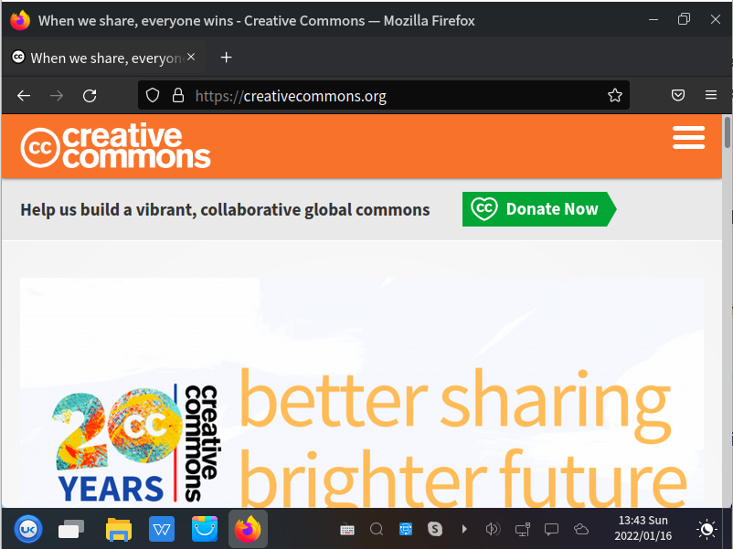

# A peek at dev tools

*Press F12 and every website hands you its source, its network traffic, its errors and its storage. This is the single most powerful free tool a tester owns, and most beginners never open it.*

> There is a key on your keyboard that turns every website inside out. It shows you the
> code, every request the page made, every error it swallowed, and every cookie it's
> hoarding. It's been there the whole time. Press **F12**. From this moment, "the page
> looks broken" is a sentence you never have to write again — because you can say
> *exactly which request returned 500, and what the console said about it.*

> **In real life**
>
> DevTools is **an X-ray, not a screenshot.** A screenshot shows the patient looks
> unwell. An X-ray shows the fracture, names the bone, and prints the angle. Both are
> "evidence"; only one tells the surgeon where to cut. Every bug report you file with a
> screenshot alone is asking a developer to re-take the X-ray you could have taken while
> you were standing right there.

## The four panels that matter

Everything else is optional. These four carry a tester's whole day:

1. **Console** — JavaScript errors, in red, with file and line number. Open it first, every time.
2. **Network** — every request: URL, status code, timing, size, and the actual response body. The last note's waterfall lives here.
3. **Elements** — the live **DOM**: Document Object Model — the browser's live, in-memory tree of the page, built from the HTML and then modified by JavaScript. What you see in the Elements panel is the DOM as it is NOW, which is often different from the HTML the server originally sent.: the page as it exists right now, after JavaScript has had its way with it. Where your test locators come from.
4. **Application → Storage** — cookies, local storage, session storage. Where "logged in as the wrong user" bugs hide (last note's worked example).


*Screenshot: Firefox browser — Wikimedia Commons, CC BY-SA 4.0. [Source](https://commons.wikimedia.org/wiki/File:Firefox_Browser_Creative_Commons_screenshot.png)*
- **F12 lives behind here (or just press F12)** — Menu → More tools → Developer tools, or right-click any element → Inspect, which opens straight to that element in the DOM. Right-click-Inspect is the fastest route in practice: you point at the broken thing and the tool goes there.
- **The rendered page — a RESULT, not the source** — What you see was built from HTML, restyled by CSS, and then rewritten by JavaScript. 'View source' shows what the server sent. The Elements panel shows what exists now. When those two disagree — and they usually do — the difference is where the bug is.
- **The URL — DevTools' silent partner** — Network requests are relative to this origin. Cookies are scoped to it. Storage is partitioned by it. Nearly every DevTools panel is implicitly answering questions ABOUT this address, which is why the address bar earned its own pin last note.
- **Reload with DevTools open** — The Network panel only records what happens while it's open. Beginners open DevTools AFTER the page loads, see an empty request list, and conclude the tool is broken. Open first, then reload. Everyone makes this mistake exactly once.
- **Per-tab, per-sandbox** — DevTools inspects THIS tab only — its own process, its own storage. Another tab's cookies and errors are invisible here, because the sandbox is real. The tool respects the same walls the browser does.

**Debugging 'the button does nothing' with four panels — press Play**

1. **🖱 The symptom** — A user clicks Submit. Nothing visible happens. That's all you have, and it's compatible with about eight different faults. Guessing between them is what junior testers do; splitting between them is what you're about to do.
2. **🟥 Console first** — A red error? Then JavaScript threw before the request was ever made — the bug is in the browser, and the error names the file and line. No error? The click handler ran fine, so move on. One glance just eliminated half the possibilities.
3. **🌐 Network second** — Did a request even leave? If not, the front-end never called the API. If yes, what's the status? 200 means the server was happy. 400 means your data was rejected. 500 means the server broke. 401 means you're not authenticated. Each number hands the bug to a different person.
4. **📄 Read the response body** — Click the failing request → Response. The server usually explains itself: 'email already registered', 'field must be a number'. This exact string belongs in your bug report, and it frequently reveals that the API was RIGHT and the UI failed to show its message.
5. **🧩 Elements last** — Is the button actually disabled? Is an invisible overlay sitting on top of it, eating the click? Inspect it and look. This catches the maddening class of bug where everything works perfectly and the click never reaches the button at all.

*Try it — read status codes the way DevTools makes you*

```python
# The Network panel's status column, decoded. Learn these six and you can
# assign almost any web bug to the right team in one glance.
responses = [
    (200, "OK",                    "Server did what you asked. If the UI still looks wrong, the bug is in the front-end."),
    (301, "Moved Permanently",     "Redirect. Fine — but a redirect chain costs round trips (chapter 1's arithmetic)."),
    (400, "Bad Request",           "The server rejected YOUR data. Read the response body: it usually says which field."),
    (401, "Unauthorized",          "Not logged in / token expired. Check cookies in Application panel."),
    (403, "Forbidden",             "Logged in, but not allowed. A permissions bug — or correct behaviour you're testing."),
    (404, "Not Found",             "That URL doesn't exist on the server. Typo, or a route that was never deployed."),
    (500, "Internal Server Error", "THE SERVER CRASHED. Never the front-end's fault. Grab the request, hand it to backend."),
]
for code, name, meaning in responses:
    owner = "backend" if code >= 500 else "frontend/data" if 400 <= code < 500 else "nobody (yet)"
    print(f"{code}  {name:22} [{owner:14}] {meaning}")
print()
print("The first digit is the whole story:")
for prefix, gist in [(2, "success"), (3, "go look somewhere else"), (4, "YOU made a mistake"), (5, "the SERVER made a mistake")]:
    print(f"  {prefix}xx = {gist}")
print()
print("A tester who reports '500 on POST /api/orders, response body: null pointer'")
print("gets a fix. A tester who reports 'checkout is broken' gets a meeting.")
```

## Elements: where locators are born

Right-click anything → **Inspect**. The Elements panel jumps to that element in the
DOM. Now look at what it has: an `id`? a `data-testid`? a class? That attribute is what
your automated test will use to find it (Track C, and it will feel like coming home).

Crucially, **the Elements panel shows the live DOM, not the HTML the server sent.**
`View source` shows the original. If a page's source is nearly empty but the Elements
panel is full of content, that page is built by JavaScript in the browser — and that
single fact explains an enormous number of "why can't my scraper/test see this element"
questions.

> **Tip**
>
> The single highest-leverage habit in this entire module: **open the console before you
> write a bug report.** If there's a red error, paste it. If a network request is red,
> click it, copy the status and the response body. That transforms "the page is broken"
> into "POST /api/orders returns 500, response: `{error: 'null value in column user_id'}`."
> The first report gets a meeting scheduled for Thursday. The second gets fixed before
> lunch, and someone asks who the new tester is.

### Your first time: Your mission: X-ray a real website

- [ ] Open DevTools, THEN reload — F12 first, reload second. The Network panel only records while it's open. Everyone learns this the hard way once — let this be your once.
- [ ] Read the console on three sites — Visit three websites you like and look at the console. You will find red errors on major, professional, well-funded sites. This is oddly comforting, and it recalibrates what 'broken' means.
- [ ] Inspect an element and change it — Right-click a headline → Inspect → double-click the text in the DOM → type something rude. It changes on screen. Nothing was saved; you edited your own copy. Refresh and it's gone. (This is also how every fake screenshot on the internet is made — now you can spot them.)
- [ ] Watch a request happen — Open Network, filter to Fetch/XHR, then click something in the app. Watch the request appear. Click it: headers, payload, response. You are now reading the conversation between browser and server, which is the whole of chapter 3.
- [ ] Find a status code that isn't 200 — Browse any large site with the Network panel open. You'll find a 404 or a 302 within a minute. Notice the page still works — most failures are invisible to users and obvious here.

Console read, DOM edited, request inspected, status code found. You have the tools of the job.

- **The Network panel is empty.**
  You opened DevTools after the page loaded. It only records while open. Reload with it open. (There's also a 'Preserve log' checkbox — turn it on when debugging redirects or form submissions that navigate away, or the evidence vanishes at the exact moment you need it.)
- **My test can't find an element that I can see on the page.**
  Compare `View source` (what the server sent) with the Elements panel (what exists now). If the element only appears in Elements, JavaScript created it after load — so your test must WAIT for it rather than look immediately. This one distinction explains most beginner automation failures, and you can diagnose it in two keystrokes.
- **The API returns 200 but the page shows an error.**
  The server was happy; the front-end mishandled the response. Click the request → Response tab and read what actually came back. Often the shape changed (an array where an object was expected) or a field is null. This is a front-end bug with a perfect exoneration for the backend attached, and you can prove it in one click.
- **It works when I test it, but the bug appears for users.**
  Your browser has state theirs doesn't: cookies, local storage, cache, extensions, a logged-in session. Reproduce in a private window (last note). Also check Application → Storage for leftovers, and throttle the network — a race condition that never appears at 12ms latency appears reliably at 187ms. Speed hides bugs; slowness reveals them.

### Where to check

Your daily four, in the order you'll use them:

- **Console** — red errors, with file and line. Before anything else. Always.
- **Network** — status codes, the response body, timing, and whether a request happened at all. Filter to Fetch/XHR to see only the API conversation.
- **Elements** — the live DOM. Where locators come from and where invisible overlays get caught.
- **Application → Storage** — cookies, local storage, session storage. The home of stale-state bugs.

Two more worth knowing today:
- **Device toolbar** (Ctrl+Shift+M) — simulate a phone screen. Half of all layout bugs are found here in thirty seconds.
- **Throttling** (Network panel) — Slow 4G plus 4× CPU. The last note's whole argument, one dropdown away.

The reflex to build: **F12 before you type a word of a bug report.** Every extra fact
you copy from these panels removes an hour from someone's week.

### Worked example: from 'checkout is broken' to a fixed bug in eleven minutes

Watch four panels dismantle one vague sentence.

1. **The report:** "Checkout is broken." Useless, but it's what you're given. Reproduce it: click Pay, nothing happens.
2. **Console.** No red errors. So JavaScript didn't crash — the click handler ran. That single glance eliminates the entire front-end-crash family of causes.
3. **Network, filtered to Fetch/XHR.** A request *did* fire: `POST /api/checkout` → **500**. The server broke. Backend's problem, and you've known it for ninety seconds.
4. **Click the request → Response.** The body reads: `{"error": "invalid card expiry: 13"}`. Now the picture inverts — the server's 500 is itself a bug (a bad expiry month should be a 400, not a crash), *and* the front-end let a nonsense value through in the first place.
5. **Elements.** Inspect the expiry field: `<input type="text">` with no validation, no `max`, no pattern. Typing month 13 is permitted by design-by-omission.
6. **Two bugs, one click.** (a) Front-end accepts an invalid expiry month; (b) backend returns 500 instead of a 400 with a readable message when it receives one. Both are real, both are cheap to fix, and both were invisible from the sentence you started with.
7. **The report:** exact request, exact status, exact response body, the input's markup, and the repro steps. Eleven minutes. The developer opens it and doesn't need to ask you a single question — which, in the end, is the only measure of a bug report that matters.

> **Common mistake**
>
> Filing a bug report with only a screenshot. A screenshot proves something looked wrong
> to somebody once. It cannot show the 500 status code, the response body naming the
> failing column, the red console error with its file and line, or the request that never
> fired at all. All four of those were on your screen, one keypress away, while you were
> taking the screenshot. Attaching them costs thirty seconds and turns a ticket that
> bounces back with "cannot reproduce, need more info" into one that gets fixed the same
> day. The X-ray was free, and you photographed the waiting room.

**Quiz.** A user clicks Submit and nothing happens. The console shows no errors, and the Network panel shows no request was made at all. What does that combination tell you?

- [ ] The server is down
- [x] The click never reached working code that calls the API: either the handler isn't attached (page not yet interactive), the button is disabled, or an invisible element is intercepting the click. No error and no request means the failure happened before any network call — check Elements and whether the page has finished becoming interactive.
- [ ] The API returned a 500
- [ ] The user's internet is broken

*The absence of evidence is evidence here. No console error rules out a JavaScript crash during the handler. No network request rules out every server-side cause — you cannot get a 500 from a request that was never sent. What remains is everything between the click and the call: an unattached handler (the paint-vs-interactive gap from the last note), a disabled button, or an overlay eating the click. Elements answers all three, and you narrowed it there without touching a single line of code.*

- **The four panels** — Console (red errors, file:line) · Network (status, timing, response body) · Elements (live DOM, locators) · Application → Storage (cookies, local storage).
- **Status code first digit** — 2xx success · 3xx go elsewhere · 4xx you made a mistake · 5xx the server made a mistake. It assigns the bug to a team in one glance.
- **View source vs Elements** — View source = the HTML the server sent. Elements = the live DOM after JavaScript ran. Their difference explains most 'my test can't find this element' problems.
- **Empty Network panel** — You opened DevTools after loading. It only records while open. Reload with it open, and enable 'Preserve log' when a form navigates away.
- **200 but the page shows an error** — The server was fine; the front-end mishandled the response. Read the Response tab — usually a shape change or a null field.
- **No error + no request** — The click never reached code that calls the API: handler not attached yet, button disabled, or an invisible overlay eating the click. Check Elements.

### Challenge

Open DevTools on any web app you use, do something that talks to a server (log in,
search, submit a form), and capture four things: the request URL, its status code, the
response body, and whether the console showed anything. Write them as four lines. That's
a professional bug report skeleton, and you built it without permission, without access,
and without asking anyone. Now do it once more on a site that's *working* — because
knowing what healthy looks like is what makes broken obvious.

### Ask the community

> DevTools question: clicking [x] does [y]. Console: [red error with file:line, or 'nothing']. Network: [request URL + status code, or 'no request fired']. Response body: [paste]. Element markup: [paste from Elements]. Private window: [same/different].

This template IS the worked example, turned into a form. Notice that filling it in
performs the entire diagnosis: no request means front-end, 4xx means your data, 5xx
means the server, and 200-with-broken-UI means the response handler. Most of the time
you'll know the answer before you finish typing — and that is precisely the point.

- [Chrome DevTools — the official tour](https://developer.chrome.com/docs/devtools/)
- [MDN — every HTTP status code, explained](https://developer.mozilla.org/en-US/docs/Web/HTTP/Status)
- [DevTools for testers, in practice](https://www.youtube.com/watch?v=x4q86IjJFag)

🎬 [Browser DevTools: the tester's X-ray](https://www.youtube.com/watch?v=x4q86IjJFag) (12 min)

- Four panels carry a tester's day: Console (errors), Network (status codes and response bodies), Elements (the live DOM), Application → Storage (stale state).
- The status code's first digit assigns the bug: 4xx means the request was wrong, 5xx means the server broke, 200 with a broken UI means the front-end mishandled a good response.
- The Elements panel shows the live DOM after JavaScript ran; View source shows what the server sent. Their difference explains most automation failures.
- No console error and no network request means the click never reached code that calls the API — check for unattached handlers, disabled buttons, or invisible overlays.
- Open DevTools before writing any bug report. Thirty seconds of copying facts converts 'it's broken' into a report that gets fixed the same day.


---
_Source: `packages/curriculum/content/notes/the-internet-and-the-web/browsers-and-page-loading/a-peek-at-dev-tools.mdx`_
