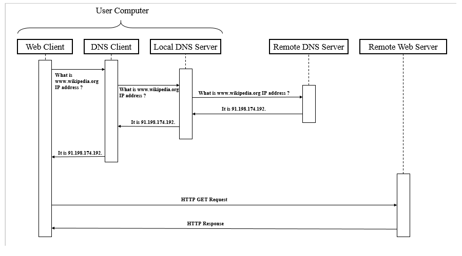

# Client vs server

*Two computers, two responsibilities, one conversation. Knowing which side owns a bug is the fastest triage skill in software — and it's decided by one question you can answer in ten seconds.*

> Every web bug you will ever meet lives on one side of a line: **the client** (the
> browser on someone's desk) or **the server** (a machine in a data centre you'll never
> see). Junior testers describe symptoms. Senior testers say "this is server-side" and
> are right, and the whole team saves an afternoon. The line is real, it's crossable in
> one place only, and by the end of this note you'll be able to point at it.

> **In real life**
>
> Client and server are **you and a restaurant kitchen.** You (the client) can see the
> menu, hold the cutlery, and complain. You cannot enter the kitchen. The kitchen (the
> server) has the ingredients, the recipes, and the only copy of the ledger — and it never
> comes to your table. Everything you get is something you *asked* for, through a waiter,
> in a strict format. **You can lie to the kitchen** — order things that don't exist,
> claim to be someone else — which is why a serious kitchen checks every order rather
> than trusting the menu it printed.

## Who owns what

| | Client (browser) | Server |
|---|---|---|
| **Runs** | On the user's device, code you shipped them | In a data centre, code they never see |
| **Owns** | The screen, clicks, the DOM | The database, the truth, other users' data |
| **Trust** | **None.** The user controls it completely | Trusts nothing the client sends |
| **Bugs look like** | Wrong layout, dead button, stale display | 500 errors, wrong data, slow responses |

The one that surprises beginners: **the client is **untrusted**: Code running on a machine the user controls completely. They can edit it, delete a disabled attribute, or bypass it entirely with curl. Any rule enforced only in the browser is not enforced at all — it must be re-checked on the server, every time..** Anyone can open DevTools
and change the page, delete a `disabled` attribute, or send a request your UI would
never send. That's not hacking; it's Tuesday. Which means any rule enforced *only* in
the browser isn't enforced at all.


*Diagram: client–server model — Wikimedia Commons, CC BY-SA 4.0. [Source](https://commons.wikimedia.org/wiki/File:Client-server_model_example_(Web_browsing)_-_en.png)*
- **The clients — many, untrusted, out of your control** — Each one is a browser on somebody's machine, running code you shipped but no longer own. They can edit it, replay requests, or write their own. Validation here is a KINDNESS to honest users, never a security control.
- **The server — one, trusted, holds the truth** — The database, the business rules, other people's data. It must assume every request is a lie until proven otherwise. Every rule that actually matters lives here, because this is the only machine you control.
- **The wire between them — the only crossing** — Requests go one way, responses come back. Nothing else crosses. That narrowness is a gift to testers: EVERY interaction is inspectable in one place — the Network panel from the last chapter.
- **The request — the client's only power** — A client can ask for anything: a URL that doesn't exist, a price of -5, another user's order id. Asking is free. Whether the server AGREES is the entire question, and it's where a large fraction of real security bugs live.
- **Why the server is 'slow' and the client is 'janky'** — Server problems present as waiting (high TTFB, 500s, timeouts). Client problems present as visual mess (broken layout, dead buttons, stale data on screen). Learn the two smells and you triage in seconds.

**Which side owns this bug? — press Play**

1. **🐛 A symptom appears** — 'The order total is wrong.' At this moment it could be either side, and every minute spent guessing is a minute stolen from fixing. Don't theorize. Look at the wire.
2. **🔍 Open the Network panel** — Find the request that fetched the order. Click it. You are now standing exactly on the line between the two worlds, holding the only thing that crosses it.
3. **📄 Read the response body** — Does the server's JSON say total: 100? Then the server is right and the browser rendered it wrong — the bug is CLIENT-side. Does it say total: 250? The server computed nonsense — the bug is SERVER-side. One glance, one answer, no argument.
4. **🎯 Now you know the owner** — Client bug → front-end developer, and the fix is in code shipped to users. Server bug → backend developer, and the fix is deployed to one machine. Same symptom, entirely different teams, tickets, and release paths.
5. **🧾 The report writes itself** — 'GET /api/orders/1042 returns total: 250; expected 100 (items sum to 100). Server-side.' Nobody argues with a pasted response body. Compare with 'the total is wrong', which starts a meeting.

*Try it — why client-side validation is a suggestion, not a rule*

```python
# The browser politely refuses to send a negative quantity...
def client_validate(order):
    if order["quantity"] < 1:
        return "BLOCKED by the browser: quantity must be at least 1"
    return None

# ...but anyone can skip the browser entirely and POST whatever they like.
def server_handles(order, validates: bool):
    if validates:
        if order["quantity"] < 1:
            return "400 Bad Request — server rejected it"
        if order["price"] < 0:
            return "400 Bad Request — server rejected it"
    total = order["quantity"] * order["price"]
    return f"200 OK — order accepted, total = {total}"

honest   = {"quantity": 2,  "price": 50}
attacker = {"quantity": -3, "price": 50}   # sent with curl, bypassing your UI entirely

print("Through the browser UI:")
print("  honest  :", client_validate(honest)   or "allowed through")
print("  attacker:", client_validate(attacker) or "allowed through")
print()
print("Sent directly to the API (no browser involved):")
for name, order in [("honest", honest), ("attacker", attacker)]:
    print(f"  {name:8} server WITHOUT validation -> {server_handles(order, validates=False)}")
print()
for name, order in [("honest", honest), ("attacker", attacker)]:
    print(f"  {name:8} server WITH validation    -> {server_handles(order, validates=True)}")
print()
print("Look at the unvalidated attacker line: total = -150. The shop now OWES money.")
print("Client validation is a kindness to honest users. It is never a security control,")
print("because the client is a computer the attacker owns.")
```

## The rule that survives everything

> **Never trust the client.**

Not because users are villains, but because you cannot enforce anything on a machine
you don't control. A `disabled` button can be re-enabled in DevTools in two seconds. A
hidden price field can be edited. A JavaScript check can be skipped by not using
JavaScript at all — `curl` doesn't run any.

Everything that matters — authentication, authorization, price calculation, data
validation — must be re-checked on the server, *every single time*, even if the UI
already checked it.

> **Tip**
>
> This gives you a test you can run against almost any application, today: **do the thing
> the UI won't let you do.** Re-enable a disabled button. Edit a hidden field. Send a
> request with a negative number, or with someone else's order ID. If the server accepts
> it, that's a real bug — often a serious one — and you found it with DevTools and thirty
> seconds. Track E turns this into a discipline with a name (broken access control tops
> the OWASP list, year after year). It begins here, with one idea: the browser's rules
> are decorations.

### Your first time: Your mission: stand on the line

- [ ] Find the wire — Open any web app, F12 → Network → filter Fetch/XHR. Click something. Watch the request cross. Everything the client and server ever say to each other passes through this list.
- [ ] Read a response body — Click any request → Response. This is the raw truth the server sent, before your app's code touched it. Compare it to what's on screen. When they disagree, you've found a client bug and proved it.
- [ ] Defeat a client-side rule — Find a disabled button. Right-click → Inspect → delete the `disabled` attribute in the Elements panel. Click it. The browser obeyed you, not the developer. Nothing was hacked; you edited your own copy of the page.
- [ ] Ask what the server did about it — Watch the Network panel when you click that re-enabled button. Did the server accept the request, or reject it with a 400? Accepted = a real bug. Rejected = the developer did their job. You just tested the only rule that matters.
- [ ] Say the smells out loud — Waiting, timeouts, 500s = server. Broken layout, dead buttons, stale display = client. Assign one recent bug you've seen to a side, and say why.

You found the wire, read the truth, broke a client rule, and checked whether the server cared. That's the whole triage skill.

- **The number on screen is wrong.**
  Open the Network response for the request that fetched it. Server sent the right number → client-side rendering bug. Server sent the wrong number → server-side calculation bug. This single check settles ten minutes of argument in ten seconds, and it works for every 'wrong data on screen' bug you will ever see. Never debate a number you haven't read on the wire.
- **It works on my machine but fails for a user.**
  Client-side, almost certainly — because the server is the same one for both of you. Their browser, their extensions, their cached JavaScript, their screen size, their old version of your app. Ask for the browser and version, and reproduce in a private window (chapter 2). The one exception: if the server behaves differently per user (permissions, feature flags, their data), then it IS server-side and their account is the clue.
- **The button is disabled, so users can't submit invalid data. We're safe.**
  You are not safe, and this is the most consequential misunderstanding in web development. Anyone can re-enable that button, or ignore your page entirely and send the request with curl. If the server doesn't re-validate, invalid data lands in your database. Test it: send the request the UI would never send. This is a real, filable, frequently-critical bug.
- **The page hangs forever with a spinner.**
  Look at the Network panel for a pending request. Still pending after 30 seconds = the server never answered (server-side, or a network problem). No request at all = the client never asked, so the bug is in the front-end (chapter 2's 'no error, no request' case). The spinner tells you nothing; the wire tells you everything.

### Where to check

Standing on the line, in practice:

- **Network → Response body** — the server's actual words. The single most decisive artifact in web testing.
- **Network → Status code** — 4xx (your request was wrong), 5xx (the server broke), 200 (the server is fine, look at the client).
- **Elements panel** — what the client did with that response. Disagreement with the response body = client bug, proven.
- **Console** — client-side crashes, always.
- **`curl` or an API tool** — the ultimate client-bypass. If a request succeeds without any browser involved, no browser-side rule was ever protecting anything. Track D lives here.

The triage question, memorized: **"What did the server actually send?"** Everything
downstream of that answer belongs to the client; everything upstream belongs to the
server. It is the cleanest dividing line in all of software, and it is one click away.

### Worked example: the discount that made the shop pay the customer

A tester with thirty minutes and DevTools finds a genuine financial bug.

1. **The feature:** a checkout page with a quantity field. The UI enforces `min="1"` — you cannot type a negative number into the box.
2. **The tester's instinct, straight from this note:** the browser's rules are decorations. What does the *server* think?
3. **Bypass the UI.** Open DevTools → Elements, find the input, delete the `min` attribute. Type `-3`. The form now submits happily, because the only guard was cosmetic.
4. **Watch the wire.** Network shows `POST /api/cart` with `{"quantity": -3, "price": 50}` → **200 OK**. The server accepted it. The cart total is now **-150**.
5. **Follow it through.** The checkout total goes negative. Depending on the payment integration, that is either a crash, a refund, or — genuinely, this has happened to real companies — a payment *to* the customer.
6. **The report:** 'Server accepts negative quantity. Repro: POST /api/cart with quantity -3 (or remove the min attribute in DevTools). Response: 200 OK, cart total -150. Expected: 400 Bad Request. Client-side min="1" is the only validation present.' Severity: high.
7. **Why the tester found it and nobody else did:** the developers tested through the UI, where the rule held. The tester tested through *the wire*, where it never existed. The bug wasn't hidden — it was simply on the other side of an assumption everyone shared.

> **Common mistake**
>
> Believing that because the UI prevents something, it cannot happen. The UI runs on a
> computer the user owns, controls, and can modify at will — the `disabled` attribute, the
> `min` value, the hidden price field, the JavaScript check, all of it is a suggestion
> written on paper you handed to a stranger. `curl` never loads your page at all. Any
> rule that exists only in the browser does not exist. This is not a niche security
> concern for the security team; it is the daily bread of testing, and it produces real
> bugs in real products every week, discoverable in thirty seconds by anyone who knows
> which side of the line they're standing on.

**Quiz.** An order's total displays as $250 on screen. You open the Network panel and the API response body clearly reads `total: 100`. Whose bug is it, and why?

- [ ] The server's — it must have sent the wrong data at some point
- [x] The client's. The server sent the correct value (100); the browser rendered 250. The bug is in front-end code that transformed or displayed the response, and the response body is the proof.
- [ ] Nobody's — the display might be showing a different currency
- [ ] Impossible to tell without database access

*The response body is the last artifact the server produced and the first the client consumed. If it holds the right number and the screen shows a wrong one, everything that could have gone wrong happened after the data crossed the wire — in the browser. That single comparison assigns the ticket to the right developer with evidence attached, and it takes one click. It's the highest-value ten seconds in web testing, and most testers never spend them.*

- **Client vs server** — Client = browser on the user's device, owns the screen, completely untrusted. Server = machine you control, owns the database and the truth, must verify everything.
- **The triage question** — 'What did the server actually send?' Read the response body. Right data, wrong screen = client bug. Wrong data = server bug. Ten seconds, no argument.
- **Never trust the client** — You cannot enforce rules on a machine you don't control. disabled buttons, min attributes and JS checks are decorations. curl never loads your page.
- **The bug smells** — Server: waiting, timeouts, 500s, wrong data. Client: broken layout, dead buttons, stale display, works-for-me.
- **Client validation is…** — A kindness to honest users — instant feedback, fewer round trips. Never a security control. Every rule must be re-checked server-side, every time.
- **The 30-second security test** — Do what the UI forbids: re-enable a button, edit a hidden field, send a negative number or another user's ID. If the server accepts it, that's a real bug.

### Challenge

Open any web app you have permission to test. Find a form field with a client-side rule
(a max length, a min value, a disabled submit). Defeat it in the Elements panel, submit,
and watch the Network panel. Write down the status code. If the server said 400, the
developers did their job and you should tell them so. If it said 200, you have found a
real bug in under a minute — and you now understand exactly why every senior engineer
repeats the same six words: never trust the client.

### Ask the community

> Client or server? Symptom: [what you see]. Request: [method + URL]. Status: [code]. Response body: [paste]. What's on screen: [what it shows instead]. Console: [errors or none].

Pasting the response body next to what's on screen answers the question before anyone
replies — if they match, the server is innocent. This template is the triage question
made into a form, and filling it in is usually the entire investigation.

- [MDN — the client–server overview](https://developer.mozilla.org/en-US/docs/Learn/Server-side/First_steps/Client-Server_overview)
- [OWASP — broken access control, the #1 risk (and it starts here)](https://owasp.org/Top10/A01_2021-Broken_Access_Control/)
- [Client and server, explained clearly](https://www.youtube.com/watch?v=L5BlpPU_muY)

🎬 [Client vs server, and why the client lies](https://www.youtube.com/watch?v=L5BlpPU_muY) (8 min)

- The client runs on the user's machine and is completely untrusted; the server holds the truth and must re-verify everything, every time.
- The triage question is 'what did the server actually send?' — compare the response body to the screen and the bug's owner is decided in ten seconds.
- Client-side validation is a kindness to honest users, never a security control: disabled buttons and min attributes are decorations, and curl never loads your page.
- Server bugs smell like waiting, timeouts and 500s; client bugs smell like broken layout, dead buttons and stale displays.
- Doing what the UI forbids — re-enabling a button, sending a negative number — is a thirty-second test that finds real, often serious bugs.


---
_Source: `packages/curriculum/content/notes/the-internet-and-the-web/client-server-and-http/client-vs-server.mdx`_
