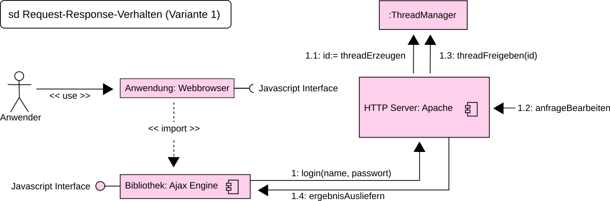

# Request & response

*Every interaction on the web is one message out and one message back. Learn the four parts of each, and you can read the conversation behind any bug, any app, any API.*

> Everything you have ever done on the internet was a **request** followed by a
> **response**. Logging in. Liking a post. Loading this page. Buying a flight. There is
> no third thing. Once you can read those two messages — and they are just text, plainly
> readable, sitting in a panel you already know how to open — the web stops being magic
> and starts being a conversation you can audit line by line.

> **In real life**
>
> A request is **a letter, not a phone call.** It arrives complete: an address (the URL),
> an instruction on the envelope (the method), a stack of notes clipped to the front (the
> headers), and possibly a parcel inside (the body). The server reads the whole letter,
> does something, and posts one letter back. Nobody stays on the line. The server has no
> memory of you between letters — which is why every letter must re-introduce you, and
> why cookies exist at all.

## The four parts of a request

1. **Method** — the verb. `GET` (give me), `POST` (here's something new), `PUT`/`PATCH` (change this), `DELETE` (remove this).
2. **URL** — the address. Which resource, on which server.
3. **Headers** — metadata clipped to the front: who you are (`Authorization`, `Cookie`), what format you want (`Accept`), what you're sending (`Content-Type`).
4. **Body** — the payload. Only for methods that carry data (`POST`, `PUT`, `PATCH`). A `GET` has none.

And the response mirrors it exactly:

1. **Status code** — `200`, `404`, `500`. The verdict.
2. **Headers** — caching rules, content type, cookies to store.
3. **Body** — the actual data: HTML, JSON, an image, nothing at all.


*Diagram: request and response — Wikimedia Commons, CC0. [Source](https://commons.wikimedia.org/wiki/File:Ajax_request_response.svg)*
- **The request — method + URL + headers + body** — One complete letter. The server has never heard of you before it opens this envelope, so everything it needs must be inside: your identity (a cookie or token in the headers), what you want (the URL), what to do (the method), and the data (the body).
- **The client sends and waits** — This is where the spinner spins. Everything between sending and receiving is latency (chapter 1), server thinking time (TTFB), and transfer. When a page 'hangs', one of these arrows is still in flight — and the Network panel will show it pending.
- **The server: reads, decides, forgets** — It authenticates you from the headers, validates the body, does the work, and answers. Then it FORGETS you entirely. HTTP is stateless: the next request is a stranger's letter again. Everything that feels like 'being logged in' is a cookie re-proving it, every single time.
- **The response — status + headers + body** — The status is the verdict, the body is the substance. In DevTools, clicking a request and opening 'Response' shows you exactly what the server said, in the server's own words. It is the most decisive artifact in web testing.
- **Then it happens again. And again.** — Thirty to a hundred times per page (chapter 2). Every image, every API call, every font: its own request, its own response, its own status code. The Network panel is the transcript of the entire conversation.

**One login, message by message — press Play**

1. **📤 POST /api/login** — Method: POST (I'm sending something). Headers: `Content-Type: application/json`. Body: your email and password. Note that the password is in the BODY, not the URL — URLs get logged, cached and shared, and a password in one is a genuine, reportable bug.
2. **🔐 The server checks and answers** — It looks you up, compares a hash of the password, and responds `200 OK` with a header: `Set-Cookie: session=abc123`. That cookie is the whole of your identity. It's a claim ticket the server issued to itself.
3. **🍪 The browser stores the cookie** — Automatically, scoped to that site. You did nothing. It now sits in DevTools → Application → Storage, visible to you and to anyone who can run JavaScript on that page — which is precisely why the HttpOnly flag exists.
4. **📤 GET /api/orders — with the cookie attached** — The browser automatically clips `Cookie: session=abc123` to every subsequent letter to that site. The server has no memory of the login; it recognizes you *only* because the ticket came back. Stateless, every time, forever.
5. **📥 200 OK, body: your orders** — Or `401 Unauthorized` if the cookie expired — and now you understand the mysterious 'you've been logged out' with total clarity. No session was lost, because none was ever kept. The ticket simply stopped being valid.

*Try it — build a request and read the response, by hand*

```python
# A real HTTP request is TEXT. This is (almost) exactly what goes over the wire.
request = """POST /api/orders HTTP/1.1
Host: shop.example.com
Content-Type: application/json
Authorization: Bearer abc123
Content-Length: 38

{"item": "keyboard", "quantity": 2}"""

print("--- THE REQUEST ---")
print(request)
print()

# Parse it the way a server does:
head, _, body = request.partition("\\n\\n")
lines = head.split("\\n")
method, path, version = lines[0].split()
headers = dict(l.split(": ", 1) for l in lines[1:])

print("--- WHAT THE SERVER SEES ---")
print(f"method:  {method}     (the verb: what to do)")
print(f"path:    {path}   (the resource)")
for k, v in headers.items():
    hint = {"Authorization": "<- who you claim to be", "Content-Type": "<- what the body is"}.get(k, "")
    print(f"header:  {k}: {v} {hint}")
print(f"body:    {body}")
print()

# The server decides, and answers with the same shape:
authed = headers.get("Authorization", "").startswith("Bearer ")
status, payload = (201, '{"id": 1042, "status": "created"}') if authed else (401, '{"error": "no token"}')
print("--- THE RESPONSE ---")
print(f"HTTP/1.1 {status}")
print("Content-Type: application/json")
print()
print(payload)
print()
print("Four parts out, three parts back. That is the entire web.")
print("Delete the Authorization header above and re-run: 401. You just tested auth.")
```

## Stateless: the idea that explains cookies

HTTP is **stateless**: Stateless: the server keeps no memory of you between requests. Each one arrives complete and anonymous, and is forgotten the moment it is answered. Cookies and tokens are re-attached to every request to paper over this — which is the entire reason they exist.. The server does not know that the request it's handling now
came from the same person as the last one. Every request arrives as a stranger's letter.

So how are you "logged in"? Because the browser attaches a cookie — a small string the
server issued earlier — to *every* subsequent request. The server checks it, recognizes
you, and forgets you again the moment it replies. Statelessness is why the web scales
to billions of users, and cookies are the sticky note that makes it feel continuous.

> **Tip**
>
> Testers: the URL and the method carry more meaning than beginners expect. A `GET` must
> never change anything — it's "give me", and browsers, caches and search engine crawlers
> will happily fetch it repeatedly, without asking. An app that deletes a record on
> `GET /orders/1042/delete` will have its data destroyed by a crawler, a prefetcher, or
> someone's antivirus opening every link in an email. That's not hypothetical; it's a
> famous class of incident, and spotting a state-changing `GET` in the Network panel is a
> real, senior-sounding bug report you can file this week.

### Your first time: Your mission: read one full conversation

- [ ] Capture a login — Open DevTools → Network → filter Fetch/XHR, then log in somewhere. Find the POST. You are looking at the most important request most apps ever make.
- [ ] Read all four parts of the request — Click it → Headers. Find the method, the URL, the Content-Type, and (under Payload) the body. Confirm the password is in the body, not the URL. If it's in the URL, you just found a real security bug.
- [ ] Read the response — Status code, then the Response tab. Look for a `Set-Cookie` header. That's the ticket being issued, live, in front of you.
- [ ] Watch the cookie ride along — Click anything else in the app and inspect the next request's headers. There's the cookie, attached automatically. Nobody told the browser to do that. It just does, on every letter, forever.
- [ ] Delete the cookie and watch it break — Application → Storage → Cookies → delete the session cookie. Refresh. You're logged out — because the server never remembered you at all. You just proved statelessness with two clicks.

You read a request, read a response, watched a cookie born and killed, and proved the server has no memory.

- **I keep getting logged out.**
  The server has no memory — only your cookie proves who you are. So: has it expired (check the Expires column in Application → Cookies)? Was it issued for a different domain (`app.site.com` vs `site.com` are different jars)? Is the app clearing it? Is a third-party-cookie block dropping it? Each is checkable in one panel, and 'I keep getting logged out' becomes a precise defect instead of an annoyance.
- **The API returns 401 even though I just logged in.**
  Look at the failing request's headers. Is the `Authorization` header or `Cookie` actually attached? Very often the front-end forgot to include it — the login succeeded and the token was never sent again. That's a client bug, and the request headers prove it in one glance. If it IS attached, the token may be expired or scoped wrong, which is a server-side answer.
- **The same request works in curl/Postman but not in the browser.**
  The browser adds things curl doesn't: cookies, an Origin header, and the same-origin policy (CORS). Almost always this is a CORS issue — the server didn't say the browser was allowed to read the response. The request usually SUCCEEDS on the server; the browser just refuses to hand the result to the page. Look for the CORS error in the console; the Network panel will show the request completing.
- **Data gets saved twice when I double-click Submit.**
  Two POST requests went out — look in the Network panel and you'll see both, both returning 201. POST is not idempotent: sending it twice creates two things. The fix is on the client (disable the button after the first click) AND on the server (an idempotency key). Report it with both requests as evidence; it's an extremely common bug and testers find it by being impatient, which for once is a virtue.

### Where to check

The conversation, in DevTools:

- **Network → Headers tab** — the request's method, URL, and every header. Is the auth token there? Is the Content-Type right?
- **Network → Payload tab** — the request body you sent. Is that negative number really leaving your browser?
- **Network → Response tab** — the server's words, verbatim. The most decisive artifact in web testing.
- **Network → Timing tab** — chapter 1's journey, itemized: DNS, connect, TLS, waiting (TTFB), download.
- **Application → Cookies** — the identity tickets, with their expiry, domain, and flags (`HttpOnly`, `Secure`, `SameSite`). A session cookie without `HttpOnly` is readable by any JavaScript on the page — a genuine finding.
- **`curl -i <url>`** — the same conversation without a browser. Headers and body, printed as text. `-i` includes the response headers, which is where half the answers live.

The habit: **before theorizing, read the two messages.** Everything the client claimed
and everything the server answered is right there, in plain text, waiting.

### Worked example: the 401 that wasn't the server's fault

"The app logs me out at random." Three engineers have looked at it. Watch the messages settle it.

1. **Reproduce with the Network panel open.** After a few minutes of clicking, one request returns **401 Unauthorized** and the app bounces to the login screen.
2. **Read that request's headers.** The `Authorization` header is **missing**. The request went out naked. The server was right to refuse it — a 401 is exactly what an unauthenticated request should get.
3. **So why was it missing?** Compare with a successful request a moment earlier: header present. Something changed between them.
4. **Look at what's different.** The failing call is to a *different* endpoint — `api-v2.shop.com` — while the working ones go to `api.shop.com`. The token is attached by code that only matches the first host.
5. **The diagnosis inverts.** The server behaved perfectly. The bug is client-side: a request to a second API host omits the auth header. The 'random' logouts happen whenever the user touches a feature that uses v2.
6. **The report:** 'Requests to api-v2.shop.com omit the Authorization header, causing a 401 and a forced logout. Repro: [action]. Compare request headers for api.shop.com (present) and api-v2.shop.com (absent). Server behaviour is correct.'
7. **Notice what it took:** not source code, not database access, not a debugger. Two request headers, compared. The four parts of a request are enough to solve most bugs that involve the wire at all.

> **Common mistake**
>
> Assuming a `401` or a `403` means the server is broken. Those codes are the server doing
> its job correctly — refusing a request it couldn't authenticate or authorize. The
> interesting question is never "why did the server say no?" but **"what exactly did the
> client send?"** Nine times in ten the answer is a missing header, an expired token, or a
> cookie scoped to the wrong domain, all of which are visible in the request's Headers tab.
> The server rarely lies. The client frequently forgets — and the Network panel is where
> it confesses.

**Quiz.** An app randomly logs users out. The failing request returns 401, and its Headers tab shows no `Authorization` header, while a successful request seconds earlier has one. Where's the bug?

- [ ] The server's token validation is broken
- [x] The client. A request went out without the auth header, so a 401 is the correct server response. Something in the front-end failed to attach the token — often for requests to a second API host or endpoint. Compare the headers of the working and failing requests to find the pattern.
- [ ] The user's cookies are disabled
- [ ] The token expired mid-session

*HTTP is stateless: the server only knows who you are because the credential is attached to each request. A missing Authorization header means the server received an anonymous letter, and 401 is precisely the right answer. The mistake is reading the 401 as an accusation against the server, when it's a confession by the client — and the request's own Headers tab holds the confession, in plain text, one click away.*

- **The four parts of a request** — Method (the verb), URL (the resource), headers (identity, formats), body (the payload — POST/PUT/PATCH only; GET has none).
- **The three parts of a response** — Status code (the verdict), headers (caching, cookies, content type), body (the data). The response body is the most decisive artifact in web testing.
- **HTTP is stateless** — The server forgets you after every reply. Cookies/tokens are re-attached to every request, which is the only reason you feel logged in.
- **GET must never change anything** — Caches, crawlers and prefetchers fetch GETs freely, without asking. A state-changing GET will eventually be triggered by a robot. It's a real, reportable bug.
- **POST is not idempotent** — Sending it twice creates two things — which is exactly what a double-clicked Submit button does. Fix on the client (disable) and the server (idempotency key).
- **401 means the client forgot** — The server correctly refused an unauthenticated request. Read the request's headers: missing token, expired cookie, wrong domain. The server rarely lies.

### Challenge

Log in to any app with the Network panel open. Find the POST, and write down all four
parts of the request and all three of the response. Then delete the session cookie in
Application → Storage and refresh. Watch the next request return 401 and the app bounce
you to login. You have just proven, with your own hands, that "being logged in" is a
string of characters attached to every letter — and that the server has never once
remembered you.

### Ask the community

> Request/response question: [method] [url] returns [status]. Request headers include: [Authorization? Cookie? Content-Type?]. Request body: [paste]. Response body: [paste]. A working request to the same API looks like: [paste its headers].

That last line — the working request, side by side with the failing one — is the whole
technique from this note's worked example. Comparing two letters where one succeeds and
one fails is faster than reasoning about either alone, and it converts 'random' bugs
into a pattern with a name.

- [MDN — the anatomy of HTTP messages](https://developer.mozilla.org/en-US/docs/Web/HTTP/Messages)
- [MDN — cookies, and how statelessness is papered over](https://developer.mozilla.org/en-US/docs/Web/HTTP/Cookies)
- [Requests and responses, read line by line](https://www.youtube.com/watch?v=L5BlpPU_muY)

🎬 [HTTP requests and responses](https://www.youtube.com/watch?v=L5BlpPU_muY) (9 min)

- A request has four parts (method, URL, headers, body); a response has three (status, headers, body). Every web interaction is one of each.
- HTTP is stateless — the server forgets you after every reply. Cookies and tokens re-prove your identity on every single request.
- GET must never change anything: caches, crawlers and prefetchers will fetch it unbidden. POST is not idempotent, which is why a double-clicked Submit creates two records.
- A 401 usually means the client forgot to attach a credential, not that the server is broken. Read the request's headers before blaming anyone.
- Before theorizing about any web bug, read the two messages: what the client sent and what the server answered. Both are plain text, one click away.


---
_Source: `packages/curriculum/content/notes/the-internet-and-the-web/client-server-and-http/request-and-response.mdx`_
