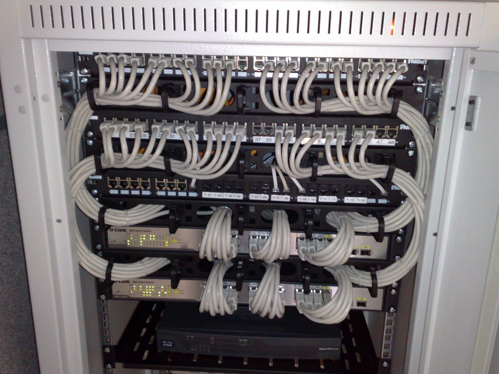

# Hosting

*A website has to physically live on a computer that's always on. What web hosting is, the flavors from shared to cloud, and why 'the site is down' has half a dozen very different causes.*

> Your laptop can run a website — for about as long as your laptop stays on, awake, plugged
> in, and connected. Which is to say: not a real website. A site the world can reach needs
> a computer that never sleeps, never closes the lid, and has a permanent address. Renting
> that always-on computer is called hosting, and understanding it is why a good tester can
> say "the site's down — but is it the app, the host, or DNS?" instead of just refreshing
> and hoping.

> **In real life**
>
> Hosting is **renting shop premises for your business.** Your website is the shop — the
> products, the layout, the till. But a shop needs a physical location that's open,
> lit, and findable: an address, a lease, the electricity bill. Hosting is that premises.
> And just like real estate, there are tiers: a shared stall in a crowded market (cheap,
> noisy neighbors), your own small unit (more control, more rent), or a flexible space
> that grows and shrinks with your crowd (the cloud). The website is your business; the
> host is where it physically opens its doors.

## Why you can't just host it yourself (and why the pros don't either)

**Hosting**: Renting a computer that is always on, always connected, and reachable at a stable address, so your site can answer a visitor at 3 AM. Shared hosting, VPS, dedicated servers and serverless are different points on the control-versus-convenience trade. exists because of a short list of demands. To serve a website to the world, a computer must be: **always on** (a visitor at 3 AM
still needs an answer), **always connected** (a fast, permanent internet link), reachable
at a **stable address** (so DNS can point the domain at it), **secured and maintained**
(patched, backed up, defended), and **able to handle many visitors at once**. Your home
laptop fails every one of these. So everyone — from a hobbyist to Netflix — rents the
always-on computer from a hosting provider instead. The provider runs the data centers
(the cloud notes) and rents you a slice.


*Photo: Dsimic — Wikimedia Commons, CC BY-SA 4.0. [Source](https://commons.wikimedia.org/wiki/File:19-inch_rackmount_Ethernet_switches_and_patch_panels.jpg)*
- **The always-on connection** — These cables are the 'always connected' requirement made physical: a permanent, fast link to the internet backbone. Your hosted site is reachable at 3 AM because this connection never goes home. Your laptop's Wi-Fi could never promise that.
- **The switch — routing visitors to the right server** — When a request for your domain arrives, gear like this directs it to the specific server hosting your site. One building, many hosted sites, traffic sorted in microseconds. 'The network is up' and 'my specific site is up' are separate claims — this is where they diverge.
- **Redundant links — no single cable kills you** — Notice multiple cables, not one. Serious hosting has redundant network paths so a single cut cable doesn't take sites offline. That redundancy is what an SLA (uptime guarantee) is really promising — and what you're paying more for on higher tiers.
- **Uptime is a number, and it's tested** — Hosts advertise '99.9% uptime' — which still allows ~8 hours of downtime a year. Testers and ops teams MONITOR this with automated checks that hit the site every minute. 'Is it up?' is not a feeling; it's a measured, graphed, alerted-on metric.
- **Where your deploy actually lands** — When your team 'ships to production', the code travels through infrastructure like this to the host's servers. The gap between 'it works on my laptop' and 'it works in production' is exactly this journey — different machine, different config, real traffic. Testing production is testing here, not on a developer's desk.

## The flavors of hosting, cheapest to most powerful

You'll hear these words in every ops conversation; here's what they actually mean:

1. **Shared hosting** — many sites on one server, splitting its resources. Cheapest,
   simplest. Downside: a "noisy neighbor" site that gets a traffic spike can slow yours,
   because you share the same machine. Fine for a blog.
2. **VPS (Virtual Private Server)** — your own isolated slice of a server, with
   guaranteed resources. More control, more responsibility, more cost. The middle tier.
3. **Dedicated server** — a whole physical machine, just yours. Maximum control and
   power, maximum cost and maintenance. Increasingly rare outside special needs.
4. **Cloud hosting** — the modern default. Your site runs across the provider's cloud
   (the earlier notes), scaling up under a crowd and down when quiet, paying for what you
   use. This is where most new things launch — including this very platform, which runs
   on a cloud host (Vercel) that redeploys every time the team pushes code.

The trend is unmistakably toward cloud and its cousins (serverless, platform hosting)
because they remove the "always-on machine maintenance" burden entirely — you bring the
code, they handle the premises.

**From 'git push' to a live site a stranger can load — press Play**

1. **💻 Code on the developer's laptop** — It works here — but 'works on my machine' is the least meaningful kind of working. This laptop isn't always on, isn't reachable, and has the developer's exact setup that production won't. The journey to real starts now.
2. **📦 Pushed to the host / build** — The code goes to the hosting provider, which often BUILDS it fresh on their machines (installs dependencies, compiles). Bugs that only appear here — a missing file, a wrong environment variable — are why 'it built locally' isn't 'it built in production'. Testers meet these constantly.
3. **🖥️ Deployed to always-on servers** — The built site lands on the host's servers — the always-on, always-connected machines from this note. Now it has a home that never sleeps. But nobody can find it yet, because the name isn't pointed here.
4. **🌐 DNS points the domain at the host** — The domain's DNS record (previous note) points at the host's address, so example.com now reaches these servers. Name meets number meets premises. Miss this step and you have a perfect site nobody can navigate to.
5. **✅ A stranger loads the site** — Someone types the domain, DNS resolves it to the host, the host serves the page over https (next note). Live, worldwide, at 3 AM. Every link in this chain can break independently — which is exactly why 'the site is down' has half a dozen causes.

*Try it — a simple uptime monitor (how ops actually knows a site is down)*

```python
# 'Is the site up?' is not a feeling -- it's a measured number. Model the monitor.

# Simulated checks over 20 minutes: (minute, http_status). 200 = OK.
checks = [
    (0, 200), (1, 200), (2, 200), (3, 500), (4, 500), (5, 500),
    (6, 200), (7, 200), (8, 200), (9, 200), (10, 503), (11, 200),
    (12, 200), (13, 200), (14, 200), (15, 200), (16, 200), (17, 200),
    (18, 200), (19, 200),
]

ok = sum(1 for _, s in checks if s == 200)
total = len(checks)
uptime = ok / total * 100

print('Checks run:', total, '(one per minute)')
print('Successful :', ok)
print('Uptime     : ' + str(round(uptime, 1)) + '%')
print()
print('Outages detected:')
for minute, status in checks:
    if status != 200:
        kind = 'server error (our code)' if status == 500 else 'unavailable (host/overload)'
        print('  minute ' + str(minute) + ': HTTP ' + str(status) + ' -- ' + kind)
print()
print('This is what an uptime monitor (UptimeRobot, Pingdom, or a health-check')
print('endpoint) does every minute, forever. When the number drops, it pages')
print('someone. Note 500 vs 503 point at DIFFERENT culprits -- our app vs the')
print('host -- which is the first fork in every outage investigation.')
```

> **Tip**
>
> A site has a "pulse" you can check yourself. Many web apps expose a health-check URL like
> `/health` or `/status` that returns a tiny OK when the server is alive — hit it and you
> learn 'is the host even answering?' separately from 'does the full app work?'. And the
> browser's Network tab shows the HTTP status of the main page load: 200 (fine), 404 (page
> missing but server alive), 500 (the app crashed), 503 (host overloaded or down). Reading
> that number is the single fastest way to aim an outage investigation at the right system.

### Your first time: First time? Investigate where a real site lives

- [ ] Check a site's status code — Open any site → Inspect → Network → click the very first row (the document). The 'Status' column shows 200 for a healthy load. That number is the site's vital sign, and you'll learn to read it reflexively.
- [ ] Find out who hosts a site — Search 'who is hosting <domain>' or use a tool like whois. You'll often see the hosting provider or cloud platform. Sites you use every day live on a handful of big hosts — the internet is more centralized than it feels.
- [ ] Look for a health/status page — Try adding /health or /status to a site's domain, or search '<company> status page'. Big services publish real-time uptime dashboards. This is 'is it me or them?' answered officially.
- [ ] Read an HTTP status you caused — Visit a URL you know is wrong (site.com/definitely-not-a-page). Network tab → 404. The server answered — it's alive — it just doesn't have that page. That's very different from the server not answering at all.
- [ ] Notice a deploy in the wild — Some sites show a version or build number in the page source or an /version endpoint. Watching it change is watching a deploy land on the host — the end of the 'git push to live site' chain you just learned.

Five checks and hosting stopped being abstract — you can now locate where a site lives
and read whether it's healthy.

- **“The whole site is down — every page, everyone.”**
  Broad outage points at infrastructure, not one bug. Check the HTTP status: 503 or no response at all suggests the HOST (server down, overloaded, or a bad deploy that won't boot). 500 on every page suggests the APP crashed globally. Check the host's status page and your own deploy history — did a deploy just go out? Reverting the last deploy is the fastest test of 'did we break it'. This is an incident, not a bug ticket.
- **“One page is broken but the rest of the site is fine.”**
  The opposite signal: the host and app are up (other pages prove it), so it's a bug in that specific page/feature, not hosting. Status is likely 500 (that page's code crashed) or 404 (route missing). This is a normal bug ticket, not an outage — and knowing the difference stops you from paging the ops team for a single broken button.
- **“It works in staging but breaks in production.”**
  The 'works on my machine', scaled up. Staging and production are different hosted environments — different data, config, environment variables, secrets, scale. Something differs between them. Check: environment variables set in prod? Same database schema? Real production data hitting an edge the small staging dataset never did? This gap is one of the most important things a tester probes, because users only ever meet production.
- **“The site is really slow but not fully down.”**
  Degraded, not dead — often a hosting capacity problem. On shared hosting, a noisy neighbor; on any host, more traffic than provisioned for, or a slow database dragging every page. Check response times in the Network tab (which request is slow — the page, or a specific API call?). Slowness is a real bug with real user impact ('slow' is the new 'down' for user patience), and it's measured the same way uptime is: numbers, over time.

### Where to check

'The site is down' — which system is it, really?

- **The HTTP status code** (Network tab, first row): 200 fine · 404 page missing, server alive · 500 app crashed · 503 host down/overloaded · no response at all = host or DNS. This number aims the whole investigation.
- **Scope**: whole site down = infrastructure/host/deploy. One page down = a bug in that feature. This split decides 'incident' vs 'ticket'.
- **The host's status page**: is the provider having an outage? 'Us or them', answered officially.
- **Recent deploys**: did something just ship? A broken deploy is the most common cause of 'it was fine an hour ago'. Reverting is the fastest test.
- **Staging vs production diff**: if it works in one environment and not the other, the answer is in what differs — config, env vars, data, scale.
- **nslookup** (previous note): rule DNS out first, so you're not debugging the host for a name problem.

### Worked example: the deploy that took the site down — an incident, worked

5:40 PM Friday (of course). Alerts fire: the whole site is returning errors. You're on
the incident:

1. **Read the status code.** Network tab on the homepage: **500** on every page. Server is answering (so the host is up, DNS is fine) but the app is crashing globally. Narrowed to the application, on the host.
2. **Check the timeline.** When did it start? 5:38 PM. What happened at 5:38? The deploy dashboard shows a release went out at 5:37. Correlation this tight is rarely coincidence.
3. **Form the hypothesis, cheaply testable.** The 5:37 deploy broke production. Test it the fastest possible way: **roll back to the previous release.** Ops triggers the revert.
4. **Confirm.** Two minutes later, the old version is live, status codes back to 200, site healthy. Rollback fixed it → the deploy was the cause. Confirmed by the fix working, the strongest evidence there is.
5. **The incident note:** "Site-wide 500s from 5:38–5:44 PM caused by the 5:37 deploy. Rolled back to the prior release; service restored. Root cause in the deploy to be investigated in daylight — a missing production environment variable is the leading suspect (worked in staging, which had it set). No data lost. Uptime impact: 6 minutes."
6. **The lesson for the team:** production had a config staging didn't — the exact 'works in staging, breaks in prod' trap. The tester who knows the deploy chain, reads the status code, and reaches for rollback turns a Friday-night panic into a six-minute footnote.

> **Common mistake**
>
> Testing only on your own machine and assuming production behaves the same. 'Works on my
> machine' is the most expensive sentence in software because your machine has your files,
> your data, your environment variables, your fast local database, and one user (you).
> Production has none of that guaranteed and thousands of real users besides. The bugs that
> only appear in production — a missing config value, a slow query under real load, a file
> that didn't get deployed, an edge case in real data — are invisible on a laptop and
> extremely visible to customers. The whole reason staging environments and production
> testing exist is that the host is a different world from your desk. Respect the gap; test
> across it.

**Quiz.** The whole site returns HTTP 503 for everyone, starting right after a deploy. Where do you look first?

- [ ] Individual page bugs in the feature code
- [x] The recent deploy and the host/infrastructure — a site-wide failure right after a release points at the deploy or the host, not one feature; reverting the deploy is the fastest test
- [ ] The user's browser cache
- [ ] The database query on one specific report page

*Scope and timing are the clues. Site-WIDE (not one page) rules out a single feature bug — that would break one page, not all of them. Right AFTER a deploy points straight at the release or the infrastructure it landed on. A single report page's query or a user's browser cache can't take down the whole site for everyone. The fastest, cheapest test of 'did the deploy break it' is to roll it back and watch the status codes — if they recover, you've found and fixed it in one move.*

- **Web hosting** — Renting an always-on, always-connected computer with a stable address to serve your website to the world. Your laptop can't do this; everyone from hobbyists to Netflix rents it.
- **The five requirements** — Always on, always connected, stable address (for DNS), secured/maintained, handles many visitors. A home machine fails all five; hosting provides all five.
- **Hosting flavors** — Shared (many sites/server, cheap, noisy neighbors) → VPS (your isolated slice) → dedicated (whole machine) → cloud (scales up/down, pay-per-use, the modern default).
- **HTTP status codes for outages** — 200 fine · 404 page missing but server alive · 500 app crashed · 503 host down/overloaded · no response = host or DNS. The number aims the investigation.
- **Uptime** — A measured, monitored number ('99.9%' still allows ~8h/year down). Checked every minute by tools that page someone when it drops. 'Is it up?' is data, not a feeling.
- **Works-in-staging-not-prod** — Staging and production are different hosted environments — different config, env vars, data, scale. The difference IS the bug. Users only ever meet production.

### Challenge

Be the on-call tester for sites you use. (1) Check the HTTP status code of three sites'
homepages via the Network tab — all 200, hopefully. (2) Deliberately hit a wrong URL on
each and confirm you get 404 (server alive, page absent) — feel the difference from a
site that won't respond at all. (3) Find two companies' public status pages and note their
advertised uptime. (4) Write two sentences explaining the difference between a 500 and a
503 and which system each points at. You've just practiced the first sixty seconds of
every outage investigation, on live infrastructure.

### Ask the community

> Hosting question: [site/app] shows [what] for [one page / whole site / some users]. The HTTP status is [code]. It started [when, vs any recent deploy]. The host's status page says [state]. Staging [works/fails the same]. What's the likely culprit?

Lead with the HTTP status code and whether it's one page or the whole site — those two
facts sort 'app bug' from 'host/infra incident' before anyone reads the rest, and they
determine whether this is a ticket or a page-the-team emergency.

- [MDN — how the internet works (hosting in context)](https://developer.mozilla.org/en-US/docs/Learn/Common_questions/Web_mechanics/How_does_the_Internet_work)
- [Cloudflare Learning — what is web hosting](https://www.cloudflare.com/learning/cdn/what-is-web-hosting/)
- [MDN — HTTP status codes (bookmark this)](https://developer.mozilla.org/en-US/docs/Web/HTTP/Status)

🎬 [Where websites actually live — hosting & the cloud](https://www.youtube.com/watch?v=8sNAPqJ_c7c) (8 min)

- A public website needs an always-on, always-connected computer with a stable address — your laptop can't be that, so everyone rents hosting from providers who run the data centers.
- Hosting tiers run shared → VPS → dedicated → cloud; cloud is the modern default because it scales with traffic and removes the always-on-machine maintenance burden.
- 'Site is down' has distinct causes read from the HTTP status: 500 = app crashed, 503 = host down/overloaded, 404 = page missing but server alive, no response = host or DNS.
- Whole-site failure = infrastructure/deploy (an incident); one-page failure = a feature bug (a ticket). Scope plus timing (right after a deploy?) aims the investigation.
- 'Works in staging, breaks in production' is the works-on-my-machine trap scaled up: different config, data, and scale. Users only ever meet production, so test across the gap.


---
_Source: `packages/curriculum/content/notes/the-internet-and-the-web/domains-urls-and-hosting/hosting.mdx`_
